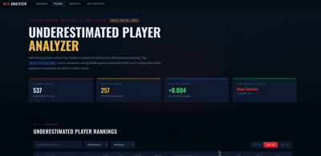

+++
date = '2026-02-21T00:00:00+08:00'
title = '【AI Practice Journal Vol.02】Develop web app of "Daily Underestimated MLB Player Ranking"'
tags = ['AI Practice Journal', 'Using AI']
+++

**Nov 2024:** I had the vision and the domain expertise, but I faced a technical ceiling. At that time, I could use AI to generate "polished UI mockups," but building a live, data-integrated application as a solo creator required a level of manual engineering that was out of reach.

**Feb 2026:** The landscape has fundamentally changed. By evolving my workflow to manage autonomous AI agents, I have transitioned from "visualizing ideas" to **shipping a production-ready, full-stack web application.**

---

### **⚾️ The Project: MLB Underestimated Player Analyzer**

In real-world baseball, a player's box score results are heavily influenced by external factors—such as defensive positioning, ballpark dimensions, and environmental variance. Consequently, surface-level statistics like **wOBA** often fail to accurately in-time reflect a player's underlying skill set or true performance level during a specific period. To understand how a player is actually performing, a deeper analysis of "Value vs. Outcome" is required:

* **wOBA (Weighted On-Base Average):** This represents a player's actual offensive contribution on the field. It is the "realized" result—the **Outcome**.
* **xwOBA (Expected wOBA):** Using Statcast data, this calculates what a player's output *should* have been based on the physical characteristics of their hits (Exit Velocity and Launch Angle). This is the **Process**, a pure measure of contact quality independent of defensive shifts or luck.
* **The Differential ($wOBA - xwOBA$):** When realized results significantly lag behind contact quality, a player is **Underestimated**. Statistical history shows that these gaps are usually temporary; eventually, a player's on-field results will **regress to the mean**, aligning with their underlying performance profile.

My dashboard identifies these statistical anomalies in real-time, highlighting hitters who are poised for a significant rebound.

[Daily Underestomated MLBPlayers Ranking](https://lch99310.github.io/Daily_underestimated_MLBplayer_ranking/)

---

### **🛠 The Orchestration: Architect + AI Agent**

The most significant shift isn't just the speed of AI—it’s the **Managerial Workflow**. I didn't just "ask" for an app; I orchestrated it through **Documentation-Driven Development**:

1.  **The Blueprint:** I authored comprehensive technical documentation defining the **Design System**, **User Interaction Logic**, and **Backend Data Architecture**.
2.  **The Management:** I acted as the Project Manager and Lead Architect, guiding AI agents to execute the **Full-Stack** build (React/Vite Frontend + Python Data Pipeline). 
3.  **The Automation:** Together, we implemented an automated workflow that handles daily data ingestion and processing, ensuring the dashboard reflects the most current MLB metrics without any manual intervention.

---

### **📈 Case Study: Performance Convergence**
Using **Tyler O'Neill** as an example: his early-season batting average appeared low, but the analyzer flagged an elite **16.5% Barrel rate** and a massive negative differential. The data suggested his "underperformance" was a result of statistical variance rather than a decline in skill. As predicted, his outcomes eventually converged with his elite contact quality.

### **The Takeaway**
In 2026, the competitive advantage for developers is no longer just "writing code"—it’s **structuring logic and managing agentic execution.** One person with a clear vision and rigorous documentation can now deliver the output of an entire engineering team.

#AI #GenerativeAI #AIAgents #DataAnalytics #FullStack #MLB #SportsTech #ProductManagement #DataVisualization #FutureOfWork

---
*© Chung-Hao Lee. All Rights Reserved.
All content on this webpage—including but not limited to text, images, design, code, and multimedia materials—is protected under the international copyright treaties. Unauthorized reproduction, modification, distribution, public transmission, or commercial use is strictly prohibited. Legal action will be taken against infringement.*  
*© 李崇豪。保留所有權利。
本網頁之內容（包括但不限於文字、圖片、設計、程式碼及多媒體素材）均受國際著作權條約保護。未經書面授權，嚴禁任何形式之複製、改作、散布、公開傳輸或商業利用。侵權者將依法追訴。*
