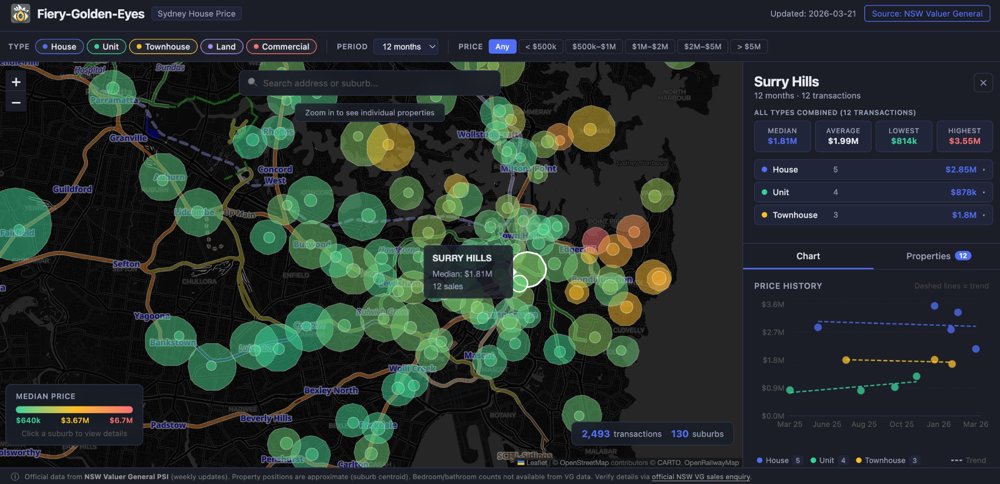

+++
date = '2026-03-22T00:00:00+00:00'
title = '【AI Side Project Vol.05】Fiery Golden Eyes'
tags = ['AI Practice Journal', 'Using AI', 'App', 'Side_Project', '中文']
thumbnail = 'pic.png'
+++

## Excited to introduce my latest side project: Fiery Golden Eyes  
Fiery Golden Eyes is an web-based app that has interactive map of property sale prices across Greater Sydney, powered by official NSW Government open data.  
Navigating the Sydney property market requires high-fidelity data and spatial clarity. This platform provides a comprehensive, interactive visualization of sales across Greater Sydney, powered by official NSW Government open data.  

## 很高興向大家介紹我的最新 Side Project：Fiery Golden Eyes  
Fiery Golden Eyes 是一款網頁應用程式，透過互動式地圖呈現大雪梨地區的房產成交價格，數據來源為新南威爾斯州（NSW）政府的官方開放數據。  
在雪梨房地產市場中穿梭，需要極高精確度的數據與清晰的空間直覺。本平台透過官方開放數據，提供大雪梨地區成交狀況的全面互動式視覺化呈現。  

---

### It delivers:  
→ **Suburb-level price heatmaps** for instantaneous market evaluation  
→ **Granular detail panels** featuring median, average, and historical price extremes  
→ **Longitudinal trend analysis** through integrated scatter plots and property-type modeling  

### 它提供以下核心價值： 
→ **分區價格熱點圖：** 協助使用者即時評估市場行情  
→ **精細的資訊面板：** 展示中位數、平均價以及歷史成交價格的極值  
→ **長期趨勢分析：** 透過整合散點圖與房產類型建模，掌握價格走勢  

### What else you get:  
→ **Advanced filtering** by zoning, price range, and specific property categories  
→ **Seamless weekly automation** via GitHub Actions to ensure the latest data is always accessible  
→ **Geographic search** functionality for precise suburb and address lookup  

### 其他進階功能：  
→ **進階篩選：** 支援土地分區、價格範圍與特定房產類別的精確篩選  
→ **無縫自動化更新：** 透過 GitHub Actions 實現每週自動更新，確保數據始終處於最新狀態  
→ **地理搜尋功能：** 支援精確的行政區與地址查詢  

---

## THE ARCHITECTURE: LEVERAGING AI AGENTS FOR FULL-STACK DEVELOPMENT  
This project was built from the ground up using Claude Code as a primary development partner. By treating AI as a high-level engineering agent, I was able to bridge the gap between complex legacy government datasets and a modern web experience.  

→ **Engineering a Robust Data Pipeline:**  
The NSW Valuer General publishes data in a specialized .DAT format with multi-layered record types. I utilized AI to architect a Python-based pipeline that autonomously parses, and validates these files, converting them into high-performance structures optimized for the frontend.  

→ **Rapid Full-Stack Prototyping:**  
The user interface—a React application integrated with Leaflet for spatial mapping and Recharts for data visualization—was developed through iterative, natural language collaboration. This allowed for rapid UI refinements and the deployment of a highly responsive, professional dark-themed design.  

→ **Fully Automated Lifecycle:**  
To ensure the platform remains a reliable source of truth, I leveraged AI to configure a sophisticated CI/CD workflow via GitHub Actions. Every Tuesday morning, the system autonomously fetches new public records, updates the underlying data models, and redeploys the live site.  

## 架構設計：運用 AI Agent 實現全端開發  
本專案從概念開發到最終部署，皆是將 Claude Code 作為主要開發夥伴協作完成。透過將 AI 視為高階工程代理人（Engineering Agent），我得以成功跨越政府舊式複雜數據集與現代網頁體驗之間的技術鴻溝。  

→ **打造強健的數據管線:**  
NSW Valuer General 以特殊的 .DAT 格式發布數據，其結構包含多層次的紀錄類型。我利用 AI 架構了一套 Python 數據管線，能自動解析並驗證這些原始文件，將其轉換為針對前端效能優化的高效結構。  

→ **快速全端原型開發:**  
使用者介面採用 React 開發，並整合 Leaflet 進行空間地圖呈現與 Recharts 進行數據視覺化。透過與 AI 的自然語言協作，我們實現了快速的 UI 迭代，並部署了具備專業感且高度響應式的深色主題設計。  

→ **全自動化生命週期管理:**  
為確保平台成為可靠的資訊來源，我利用 AI 設定了基於 GitHub Actions 的精精密 CI/CD 工作流。每週二早晨，系統會自動抓取最新的官方開放紀錄、更新底層數據模型並重新部署網站。  

As a practitioner focused on delivering actionable insights, I believe this project demonstrates how AI-driven execution can transform raw open data into high-value professional tools.  
作為一名專注於提供實質見解的實踐者，我相信這個專案充分展示了 AI 驅動的執行力如何將原始的開放數據，轉化為具備高價值的專業工具。  

Explore the tool here: [Fiery Golden Eyes](https://lch99310.github.io/Fiery-Golden-Eyes/) 🚀  

---
*© Chung-Hao Lee. All Rights Reserved.
All content on this webpage—including but not limited to text, images, design, code, and multimedia materials—is protected under the international copyright treaties. Unauthorized reproduction, modification, distribution, public transmission, or commercial use is strictly prohibited. Legal action will be taken against infringement.*  
*© 李崇豪。保留所有權利。
本網頁之內容（包括但不限於文字、圖片、設計、程式碼及多媒體素材）均受國際著作權條約保護。未經書面授權，嚴禁任何形式之複製、改作、散布、公開傳輸或商業利用。侵權者將依法追訴。*
