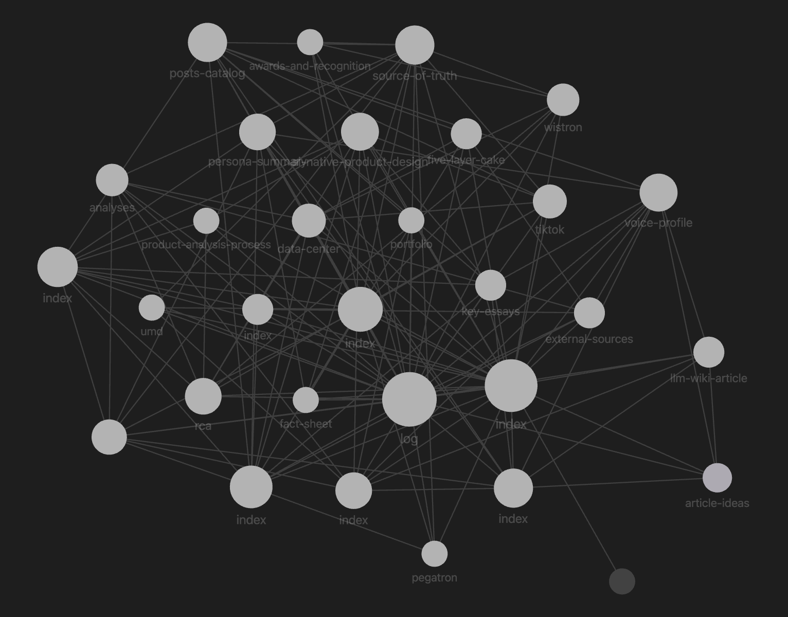

+++
date = '2026-07-19T00:00:00+08:00'
title = ' From Disposable Queries to a Knowledge Base That Accumulates: My LLM Wiki'
tags = ['Using AI', 'AI', 'Side_Project', 'AI Practice Journal']
thumbnail = 'pic.png'
+++

## The Pain Point // 痛點

Every time I sit down with an AI assistant for anything non-trivial, I follow the same ritual. I paste in my latest research notes, the relevant articles I've saved, my project documents — a growing pile of context the model has to ingest before it can actually help me. The more I add, the more the AI starts losing the thread. And if I close the conversation and open a new one? Complete amnesia.

This is the same dynamic that RAG systems were supposed to solve. And RAG does help — retrieval gives the model relevant chunks at query time. But the deeper problem remains. RAG is fundamentally stateless: on every question, the model rediscovers what it needs, re-synthesizes the same knowledge, and retains nothing for next time. My personal website, articles, research notes, project ideas, and accumulated observations have grown into a body of knowledge that no single retrieval pass can fully capture. They sit in different places — some in an Obsidian vault, some scattered across markdown files, some buried in conversations I have already closed. None of it is systematically usable by the AI that is supposed to help me work.

每次用 AI 處理一件稍微複雜的事，我都在做同一件事：貼背景資料。最新的研究筆記、相關文章、專案文件——越來越多上下文要餵給模型，它才能真的幫上忙。但材料一多，AI 就開始抓不住重點。如果關掉對話開新的？失憶，一切重來。

這個問題，最早是 RAG 試圖解決的。RAG 確實有幫助——檢索讓模型能在查詢當下找到相關片段。但深層的問題沒變：RAG 本質上是無狀態的。每一次查詢，模型都重新發現知識、重新推論、然後什麼也不留下。個人網站、文章、研究筆記、專案想法、累積的觀察——這些東西散落在 Obsidian 筆記庫、零散的 markdown 檔、已經結束的對話紀錄裡。沒有任何單次的檢索能完整掌握它們。而這些就是 AI 真正應該理解的東西。

## What Is an LLM Wiki // 什麼是 LLM Wiki

Then I came across an idea by Andrej Karpathy that reframes the problem entirely.[1] He calls it the LLM Wiki. The core insight is deceptively simple: instead of relying on RAG to retrieve raw chunks on every query, you build a persistent intermediary knowledge layer — curated and maintained by the AI itself.

Raw documents live in a `raw/` directory, untouched. The LLM reads them, extracts what matters, and compiles them into interlinked markdown wiki pages with an index, change logs, cross-references, and source citations. This is not RAG, which rediscovers everything from scratch each time. It is not regular note-taking either, which relies on human discipline and collapses under scale.

The LLM Wiki is *stateful*. It accumulates. It reorganizes. The LLM handles the bookkeeping — summarizing, cross-referencing, filing — and the result is a personal knowledge map that grows richer with every source you add. Karpathy puts it concisely: the wiki is a persistent, compounding artifact. The cross-references are already there. The contradictions have already been flagged. The synthesis already reflects everything you've read.

後來我讀到 Andrej Karpathy 提出的「LLM Wiki」概念，它從根本上重新定義了問題。[1] 核心洞察很簡單：與其像 RAG 那樣每次查詢都在原始文件中撈片段，不如在原始資料和 AI 之間，建立一層由 AI 自行維護的持久知識層。

原始文件保留在 `raw/`，AI 讀過後萃取出關鍵資訊，整理成互相連結的 markdown wiki 頁面——有 index、有更新紀錄、有跨頁面引用、有來源追蹤。這不是 RAG。RAG 每次都從頭推論，沒有任何積累。這也不是一般筆記——筆記依賴人的紀律，規模一大就難以維護。

LLM Wiki 是有狀態的。它會累積、會隨新資料重組。AI 負責所有書面工夫——摘要、交叉引用、歸檔——最後產生的是一張愈用愈豐富的個人知識地圖。Karpathy 說得很精準：wiki 是持續累積的產物。跨頁面關聯已經建好了，矛盾已經標示了，綜述已經反映你讀過的一切了。

## How to Get Started // 如何開始

The MVP is surprisingly modest.
建立 MVP 其實不複雜，以下是五個步驟：

### Step 1
Scaffold the repo.** Create a private GitHub repository with three directories: `inbox/` for new material, `raw/` for source files, `wiki/` for compiled pages. At the root, add a `CLAUDE.md` (or `AGENTS.md`) that instructs future AI sessions to start by reading `wiki/index.md` before answering any question.

建好 repo 骨架。** 開一個私有 GitHub repository，建立三個目錄：`inbox/` 放新資料、`raw/` 放原始檔案、`wiki/` 放編譯好的頁面。根目錄放一份 `CLAUDE.md`（或 `AGENTS.md`），告訴未來的 AI 會話：回答任何問題之前，先讀 `wiki/index.md`。

### Step 2
Process your first source.** Drop an article, a paper, or a set of notes into `inbox/`. Ask the LLM to read it, create a summary page in `wiki/`, update the index, and log what it did. That is the entire ingest cycle — it takes one conversation.

處理第一篇資料。** 把一篇文章、一份論文或一組筆記丟進 `inbox/`。請 LLM 讀取、在 `wiki/` 建立摘要頁面、更新 index、記錄它做了什麼。這就是整個收納循環——一次對話就完成。

### Step 3
Ask a question against the wiki.** Tell the LLM to find relevant pages via the index, read them, and answer. File any useful answer back as a new wiki page. The wiki compounds from here.

對 wiki 提問。** 告訴 LLM 透過 index 找到相關頁面、閱讀、回答。任何有價值的回答，存回 wiki 成為新頁面。從這裡開始，wiki 會自己疊加。

### Step 4
Check coherence.** Open the repo in Obsidian and look at the graph view. Are the links forming a coherent map? Are there orphan pages? The visual check tells you in seconds whether the structure is sound.

檢查知識結構。** 用 Obsidian 打開 repo，看 Graph View。連結是否形成有意義的地圖？有沒有孤立頁面？視覺檢查幾秒鐘就能告訴你結構對不對。

### Step 5
Iterate.** Ingest another source. Ask another question. Run a lint pass every few cycles to catch contradictions and stale claims. The workflow never changes; only the wiki grows.

重複迭代。** 收納新來源、提出新問題、每隔幾次做一次 lint 檢查矛盾與過時的論述。工作流從不改變，只有 wiki 一直長大。

Git handles version control. The LLM handles curation. Obsidian handles visualization. Each layer does what it does best, and because everything is plain markdown, the system will survive whatever comes next. The barrier to entry is not technical — it is a shift in how you think about your relationship with AI. From disposable queries to a stateful, cumulative knowledge practice.

Git 管版本，LLM 管整理，Obsidian 管可視化。每一層做自己擅長的事，而且因為全是純粹的 markdown，換了下一個工具也不會壞。這套方法的門檻不在技術——而在心態的轉變：從把 AI 對話當作一次性查詢，轉向一種持續累積、有狀態的知識實踐。

---
## Reference:
1: Andrej Karpathy, "LLM Wiki," GitHub Gist, April 2026. https://gist.github.com/karpathy/442a6bf555914893e9891c11519de94f

---
*© Chung-Hao Lee. All Rights Reserved.
All content on this webpage—including but not limited to text, images, design, code, and multimedia materials—is protected under the international copyright treaties. Unauthorized reproduction, modification, distribution, public transmission, or commercial use is strictly prohibited. Legal action will be taken against infringement.*  
*© 李崇豪。保留所有權利。
本網頁之內容（包括但不限於文字、圖片、設計、程式碼及多媒體素材）均受國際著作權條約保護。未經書面授權，嚴禁任何形式之複製、改作、散布、公開傳輸或商業利用。侵權者將依法追訴。*
