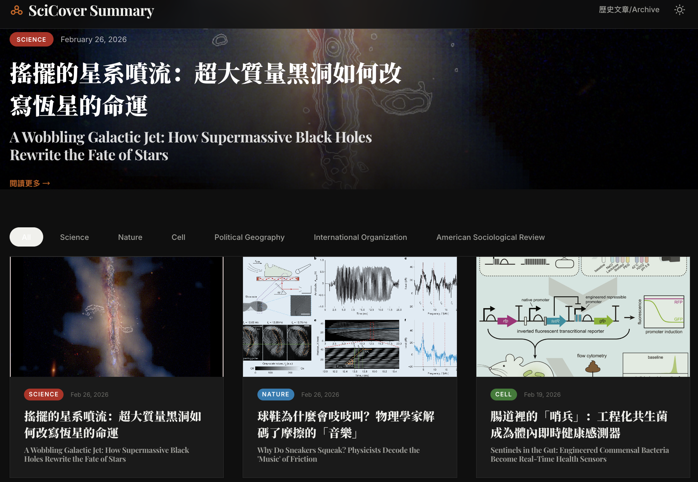
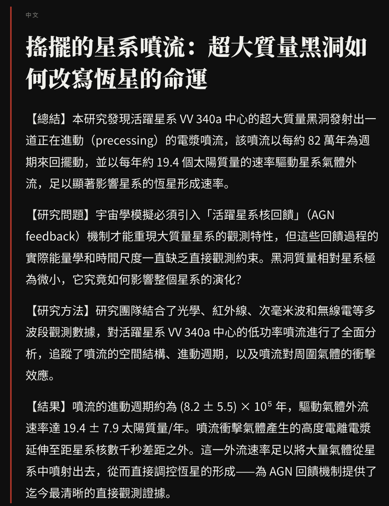

+++
date = '2026-03-01T00:00:00+08:00'
title = '【AI Practice Journal Vol.04】Develop web app of "SciCover Summary"'
tags = ['AI Practice Journal', 'Using AI', 'App', 'Side_Project', '中文']
+++

### 🚀 Every week, premier academic journals like *Science*, *Nature*, and *Cell* publish cover stories that reshape our understanding of the world. However, a significant chasm remains between the rigors of academic publishing and general public accessibility.

每週，《Science》、《Nature》、《Cell》等頂級學術期刊都會發表改變世界的封面研究。然而，在學術出版與公眾認知之間，仍存在著一道難以跨越的鴻溝。

---

### 🚩 Four Structural Pain Points in Knowledge Acquisition
* **🔹 Time Constraints & Information Overload**
In today’s fast-paced professional environment, researchers and industry experts find it increasingly difficult to dedicate hours each week to navigating multiple journal websites just to identify high-value cover stories.
* **🔹 Cognitive Load & Technical Jargon**
Academic papers are designed for peer review, not broad communication. High-density terminology and complex syntax create a steep barrier for non-specialists trying to grasp core innovations.
* **🔹 Linguistic Barriers & Lack of Localization**
Academic English follows specific conventions that can be daunting for non-native speakers. It’s not just about translation; it's about the lack of high-quality, real-time Chinese interpretations that preserve scientific context.
* **🔹 Information Fragmentation & Retrieval Inefficiency**
Top-tier journals update on different schedules across decentralized platforms. The lack of a unified interface makes the knowledge-seeking process fragmented and inefficient.

### 🚩 讀者的四大認知痛點 (Pain Points)
* **🔹 時間成本與資訊過載**
現代職場節奏緊湊，研究者與從業人員難以每週耗費大量時間遍歷各個期刊官網，篩選高價值的封面故事。
* **🔹 認知負荷與術語壁壘**
學術論文旨在同行評審，而非大眾傳播。高密度的專有術語與複雜的句式，使得非領域專家難以快速捕捉核心創新點。
* **🔹 語言障礙與在地化不足**
英文學術寫作具有特定的規範與語境，對於非母語讀者而言，不僅是語言翻譯的問題，更是文化與邏輯理解的挑戰。目前市場缺乏即時且高品質的中文科學解讀。
* **🔹 資訊碎片化與獲取效率**
頂級期刊更新週期不一，來源分散。缺乏統一的聚合介面，導致知識獲取過程低效且斷續。

---

### 🧠 Development Philosophy: AI-Driven "Semantic Translation Engineering"

To address these friction points, I utilized the **GitHub Models API** to build an automated content workflow focused on:
* **From "Translation" to "Interpretation":** Leveraging the cross-domain capabilities of Large Language Models (LLMs) to reconstruct technical abstracts into bilingual "popular science" content—reducing entry barriers while maintaining scientific integrity.
* **High-Efficiency Technical Architecture:** Adopting a Serverless philosophy, the entire site is deployed on **GitHub Pages**, achieving zero-cost, high-performance content distribution.
* **Professional UI/UX Aesthetics:** Drawing inspiration from the visual language of *Quanta Magazine*, the platform features a responsive, magazine-style layout with Dark Mode support for a premium reading experience.

### 🧠 開發思路：AI 驅動的「語意轉譯工程」

為了優化上述痛點，我利用 GitHub Models API 構建了一套全自動化的內容轉譯工作流，重點在於：
* **從「翻譯」進化為「解讀」：** 利用大語言模型（LLM）的跨域理解能力，將硬核論文摘要重構為「科普級」雙語內容，在保持科學準確性的前提下，極大降低了閱讀門檻。
* **高效能的技術架構：** 採用 Serverless 理念，全站部署於 GitHub Pages，實現零成本、高效率的內容分發。
* **UI/UX 的專業審美：** 借鑒 Quanta Magazine 的視覺美學，設計了雜誌化的排版佈局，支援多端適配與深色模式，提升專業閱讀的舒適度。

---

### 💡 The Solution: SciCover Summary
In response to these challenges, I developed **SciCover Summary**—a web-based bilingual science platform. This is more than a reading tool; it is an attempt to reshape the science communication pipeline using AI.

### 💡 解決方案：SciCover Summary
針對上述問題，我開發了 SciCover Summary—— 一個基於 Web 的雙語科學摘要平台。這不僅是一個閱讀工具，更是利用 AI 技術重塑科學傳播流程的嘗試。

---

### 🔬 SciCover Summary: Key Features

* **Automated Journal Tracking:** Real-time monitoring of *Science*, *Nature*, and *Cell* to eliminate manual searching.
* **High-Quality Bilingual Summaries:** AI-generated "interpretative rewrites" that balance natural Chinese fluency with professional English insights.
* **Visual Science Gallery:** Displays original cover art and in-text figures with bilingual captions to enhance visual understanding.
* **Historical Archives:** A curated scientific timeline allowing users to browse research trends across months and years.

### 🔬 SciCover Summary 核心功能摘要
* **智能期刊聚合：** 自動化追蹤頂刊動態，告別手動檢索，實現「一站式」科研閱覽。
* **高品質雙語摘要：** AI 生成的 interpretative rewrites，兼顧中文流暢度與專業英文語感。
* **視覺化科學畫廊：** 完整呈現期刊封面圖與圖表說明，強化視覺理解。
* **歷史脈絡存檔：** 建立橫跨年份的科學趨勢地圖。

---

### 🌐 Our Vision
Scientific progress should not be confined to the lab. My goal with SciCover is to lower the barrier to entry, enabling busy professionals and the public to touch the frontiers of human knowledge more efficiently.

### 🌐 願景
科技的進步不應僅限於實驗室內。我希望透過 SciCover，降低科學知識的獲取門檻，讓忙碌的專業人士與公眾能更高效地觸摸科學前沿。

---

👉 **Experience SciCover Summary Now / 立即體驗：** [SciCover_Summary](https://lch99310.github.io/SciCover_Summary/)

---
*© Chung-Hao Lee. All Rights Reserved.
All content on this webpage—including but not limited to text, images, design, code, and multimedia materials—is protected under the international copyright treaties. Unauthorized reproduction, modification, distribution, public transmission, or commercial use is strictly prohibited. Legal action will be taken against infringement.*  
*© 李崇豪。保留所有權利。
本網頁之內容（包括但不限於文字、圖片、設計、程式碼及多媒體素材）均受國際著作權條約保護。未經書面授權，嚴禁任何形式之複製、改作、散布、公開傳輸或商業利用。侵權者將依法追訴。*
