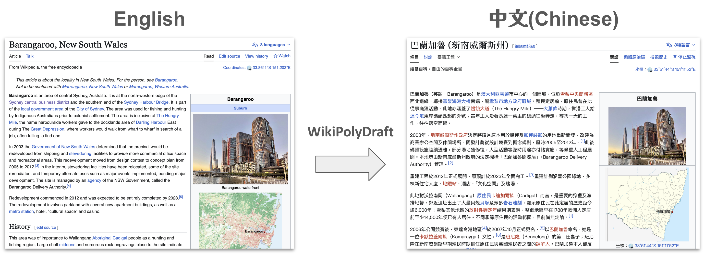
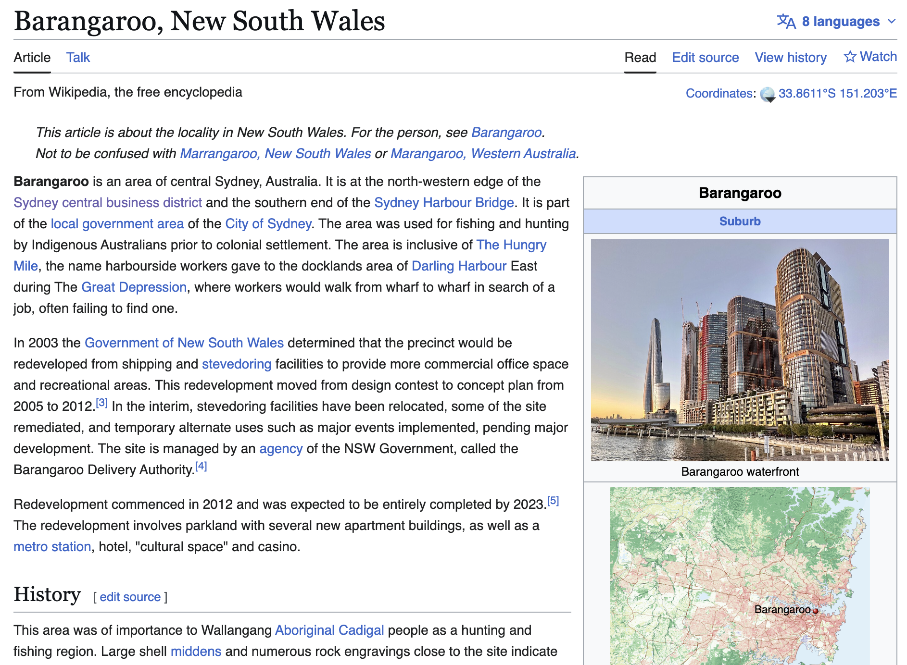
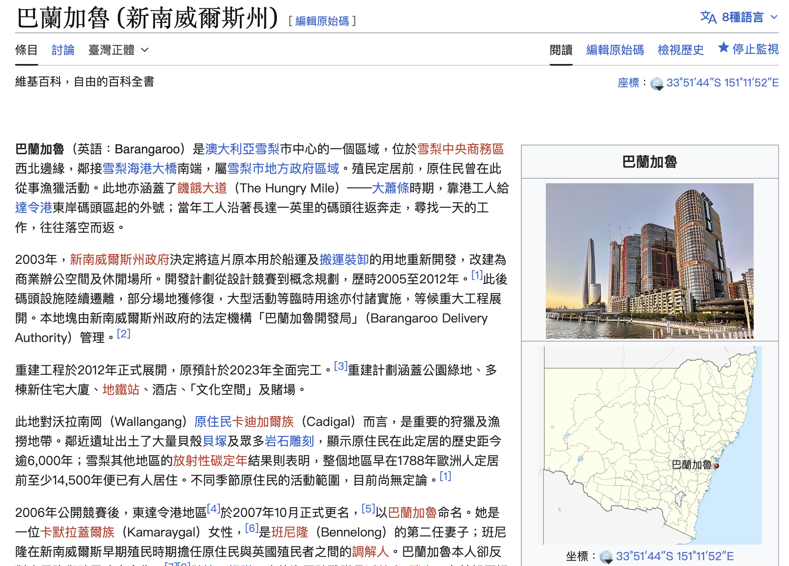

+++
date = '2026-06-13T00:00:00+00:00'
title = '【AI Side Project Vol.08】WikiPolyDraft: An Open-Source Tool for AI-Drafted Wikipedia Translations'
tags = ['AI Practice Journal', 'Using AI', 'SKILL', 'Side_Project', '中文']
thumbnail = 'pic.png'
+++

## WikiPolyDraft：一個用 AI 起草維基百科翻譯的開源工具

**GitHub**: [WikiPolyDraft](https://github.com/lch99310/WikiPolyDraft)

A few months after I moved to Sydney from Taiwan, I started walking through Barangaroo most mornings. It sits at the northwestern edge of the CBD, just past Darling Harbour, and on a clear day the headland turns into one of the better views in the city. I'd jog the loop, stop at the bend where the harbour opens up, and think: this is the kind of place I'd want to tell my parents about.
So one weekend I went to find a Chinese Wikipedia link to send them. There wasn't one. Not a stub, not a placeholder — nothing. The English entry on my phone had pages of history: colonial maritime use, the Hungry Mile during the Great Depression, the Cadigal people, the 2003 redevelopment. The Chinese version simply didn't exist.
That gap is what got me thinking.

 
 
從台灣搬到悉尼之後，Barangaroo 成了我幾乎每天晨跑的地方。它位於 CBD 的西北邊，緊鄰 Darling Harbour（達令港），轉到岬角那段視野一打開，就是悉尼整個港灣最舒服的角度之一。我常常跑到那邊停下來想，下次跟家裡的人聊到悉尼，要怎麼介紹這個地方。
有一個週末，我想找一個中文維基百科的連結傳給爸媽看。我找不到。不是頁面很短，也不是只有骨架——是根本沒有這一頁。我手機上的英文版有好幾頁的篇幅：殖民時期的碼頭歷史、大蕭條時期「The Hungry Mile（饑餓大道）」上排隊找工的工人、原住民 Cadigal 族在這片土地上的痕跡、2003 年起的重建計劃。中文版完全不存在。
那個落差，就是我開始想這件事情的起點。

 
 
Wikipedia is the largest reference work humans have ever assembled, and one of the few examples of voluntary cooperation that genuinely works at scale. But its coverage is structurally uneven, and the unevenness is most visible at the language boundaries. People write best about what they know. Australians write about Australian places in English. The Chinese Wikipedia entry for an Australian suburb is whatever a bilingual volunteer happened to translate, a thin auto-stub no one came back to flesh out — or nothing at all. The reverse is just as true: there are events in Chinese history with rich, multi-page coverage in Chinese and a paragraph or two in English. None of this is anyone's fault. It is the natural shape of crowd-sourced knowledge — dense where people are, sparse where they aren't.
That asymmetry made sense in the era when translation was the hard part. It makes less sense now.
In the last two years the bottleneck has moved. A modern language model can render a thousand-word Wikipedia entry from English into Chinese in a few seconds, preserving structure, retaining inline citations, and matching the encyclopedic register. What it can't do — and shouldn't do — is publish. AI translation still hallucinates, still misroutes citations, still quietly flattens the editorial voice an encyclopedia depends on. A Wikipedia article isn't just text. It's a body of references, an editorial style, and a community norm of attribution. The model can do the first pass. A human still has to land it.

 
 
維基百科是人類有史以來最大的參考資料庫，也是少數真正在規模上運作起來的群眾協作案例。但它的覆蓋率是結構性地不平均的，而這個不平均在語言交界處最看得出來。每個人都會優先寫自己熟悉的東西。澳洲在地人會用英文寫澳洲的地方，那一頁中文版的命運，要看當年是不是有某個雙語志工願意翻譯，或者停在自動骨架沒人回來補——再不然就是像 Barangaroo 一樣，根本不存在。反過來也一樣：許多在華語世界資料豐厚、好幾頁起跳的歷史事件，在英文維基上可能只有薄薄一兩段。這不是誰的錯，而是群眾貢獻知識的自然樣貌：人多的地方厚，人少的地方薄。
這種不對稱在「翻譯本身是難事」的年代是合理的。在現在這個時代，它已經沒那麼合理了。
過去這一兩年，瓶頸的位置移動了。一個現代的大型語言模型可以在幾秒內把一篇千字的維基條目從英文翻成中文，保留段落結構、保留內嵌引用、語感也能維持百科風格。但它做不到——也不應該做到——的，是「直接發佈」。AI 翻譯仍會幻覺、會把引用接錯、會在不知不覺中把百科賴以為生的編輯語氣磨平。一篇維基條目不只是文字，它是一整套引用體系、一套編輯風格、一個社群對「來源該怎麼標」的長期共識。AI 可以幫忙完成第一稿，最後落地的還是人。

 
 
 
### A small tool // 一個小工具：WikiPolyDraft

 
 
So I wrote a small open-source tool I called **WikiPolyDraft**. It takes a Wikipedia article in one language and produces a *draft* in another — preserving section structure, keeping citations linked, and attaching the CC BY-SA attribution Wikipedia requires. The output is explicitly labeled as a draft. It comes with a human-review checklist. It is not — and is not designed to be — a one-click publishing pipeline.

 
我把這個想法寫成了一個開源小工具，叫 **WikiPolyDraft**。它做的事情很單純：把一篇某語言的維基條目，產出另一個語言的「草稿」——保留章節結構、保留引用連結，並自動附上維基百科 CC BY-SA 授權要求的出處標註。它的輸出明確被標為「草稿」，附上一份人工審稿的檢查清單。它不是、也刻意不被設計成「一鍵發佈」的工具。

 
 
The first article I used it on was Barangaroo. The Chinese Wikipedia page for Barangaroo that you can read today is the result: an AI draft, a few rounds of manual editing, citation checks, and a final review inside the Wikipedia editor before I published it. Before that, the page didn't exist at all.
I started with English ↔ Traditional Chinese because those are the two languages I read in. If the flow holds up, it should generalize to other language pairs. The code lives on GitHub: [`lch99310/WikiPolyDraft`](https://github.com/lch99310/WikiPolyDraft/tree/main).

 
 
我第一篇拿來試的條目就是 Barangaroo。今天大家在中文維基上看到的那一頁，就是這個流程跑出來的結果：先讓 AI 翻一稿、人工編輯幾輪、檢查引用、最後在維基編輯器裡再過一次，才實際送上去。在那之前，這一頁根本不存在。
我先從英文 ↔ 繁體中文這個語言對開始，因為這是我兩種主要的閱讀語言。如果流程跑得通，其他語言對應該也適用。程式碼放在 GitHub 上：[`lch99310/WikiPolyDraft`](https://github.com/lch99310/WikiPolyDraft/tree/main)。

 

  
  

    
    
Barangaroo in Wikipedia English page 

  

  

    
    
巴蘭加魯 維基百科中文頁面

  

 

 
 
What I really want to say isn't about the tool. It's about what the tool makes possible.
In the AI era, technology is no longer the bottleneck. The chores that used to block a contribution before it even began — first-pass translation, matching citations to their sources, reconciling structure, getting the tone right — are things a model can now finish in seconds. What's left for the human is the part that always required a human in the first place: deciding which sources are credible, fact-checking the claims that don't match across versions, planning what context a reader from another culture will need, holding the editorial line. AI doesn't replace the editor. It frees the editor.
That is the trade WikiPolyDraft is built to make. The tool takes the chores. The contributor's afternoon goes into the judgment.
If a hundred people used a tool like this to fill in the language gaps on topics they cared about — Australian places that have no Chinese page, Chinese historical episodes that have no English page, every quiet corner where one language community knows something the others don't — the texture of the world's reference material would start to even out. Information that used to be locked inside one language would surface in another. Readers everywhere would have less ground to make up before they could begin to understand each other.
That is the part that's worth working on. Not a single article — a more transparent global record, built by the people who care about each piece of it.
The code is on GitHub. If any of this resonates, come build with me.

 
 
我真正想說的，其實不是這個工具，而是這個工具讓什麼事變得可能。
在 AI 時代，技術已經不是瓶頸了。過去那些卡住一個人不去動手貢獻的瑣事——第一稿翻譯、引用對應、章節結構、語感拿捏——現在 AI 都可以在幾秒內處理完。剩下交還給人的，是這件事一開始就需要人來做的部分：判斷哪些來源可信、核對在不同語言版本之間對不上的事實、規劃一個外國讀者需要哪些背景脈絡、守住編輯的口吻與紀律。AI 不是要取代編輯者，它是要把編輯者從瑣事中釋放出來。
這就是 WikiPolyDraft 想做的交換：工具把瑣事接走，貢獻者把一個下午的時間，全部投入在「判斷」這件事上。
如果有一百個人，用類似的工具去補各自關心的語言落差——那些沒有中文頁面的澳洲地方、那些沒有英文頁面的華人歷史事件、每一個某個語言社群知道而其他人不知道的角落——這個世界的參考資料的紋理，就會慢慢被填得更平。原本被鎖在一種語言裡的資訊，會浮上另一種語言。每個語言的讀者，都不必再花那麼多力氣才能開始理解別人。
這才是值得花時間的事。不是哪一篇條目，而是一份更透明的全球紀錄，由每一個在乎其中某一塊的人，自己動手蓋起來。
程式碼放在 GitHub 上。如果這些話有打到你，一起來蓋。

---

## Sources & Links

- WikiPolyDraft on GitHub: [github.com/lch99310/WikiPolyDraft](https://github.com/lch99310/WikiPolyDraft/tree/main)
- Barangaroo, New South Wales (English Wikipedia): [en.wikipedia.org/wiki/Barangaroo,_New_South_Wales](https://en.wikipedia.org/wiki/Barangaroo,_New_South_Wales)
- 巴蘭加魯（新南威爾斯州）中文維基百科：[zh.wikipedia.org/wiki/巴蘭加魯_(新南威爾斯州)](https://zh.wikipedia.org/wiki/%E5%B7%B4%E8%98%AD%E5%8A%A0%E9%AD%AF_(%E6%96%B0%E5%8D%97%E5%A8%81%E7%88%BE%E6%96%AF%E5%B7%9E))

---
*© Chung-Hao Lee. All Rights Reserved.
All content on this webpage—including but not limited to text, images, design, code, and multimedia materials—is protected under the international copyright treaties. Unauthorized reproduction, modification, distribution, public transmission, or commercial use is strictly prohibited. Legal action will be taken against infringement.*  
*© 李崇豪。保留所有權利。
本網頁之內容（包括但不限於文字、圖片、設計、程式碼及多媒體素材）均受國際著作權條約保護。未經書面授權，嚴禁任何形式之複製、改作、散布、公開傳輸或商業利用。侵權者將依法追訴。*
