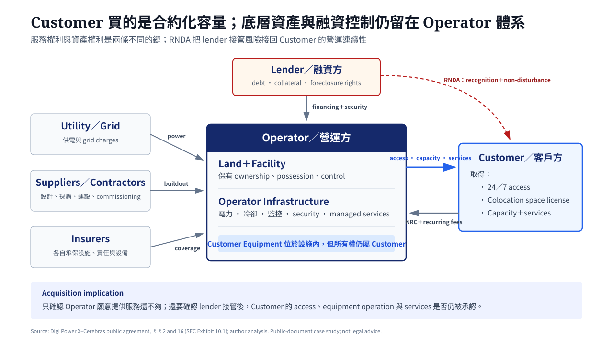
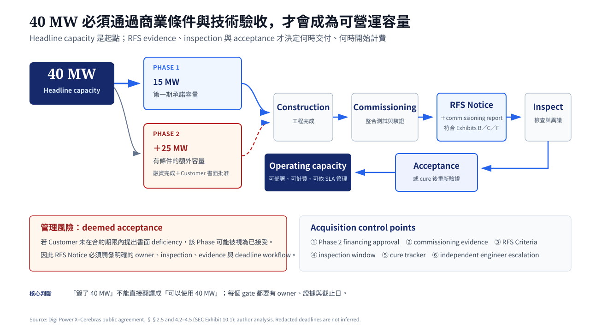
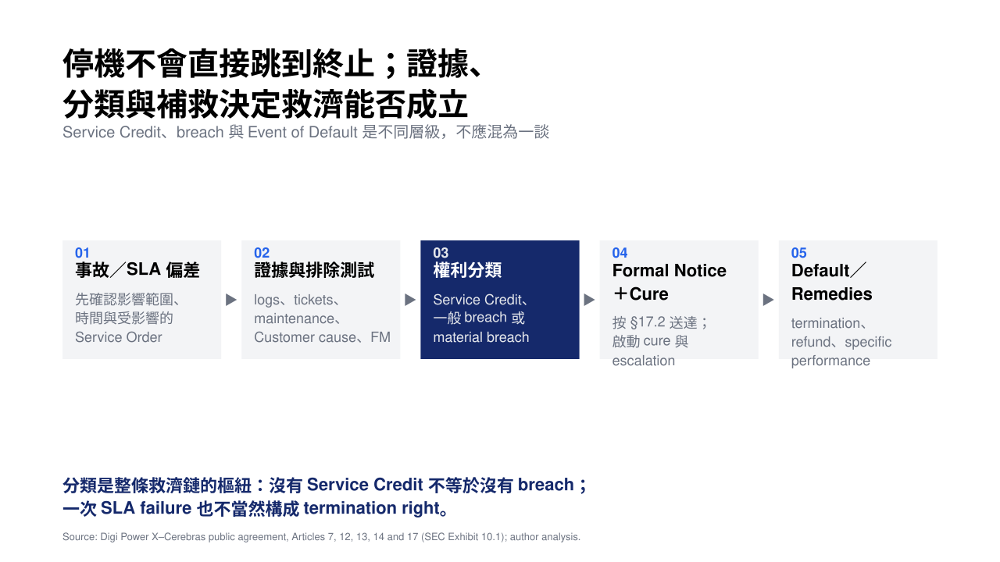
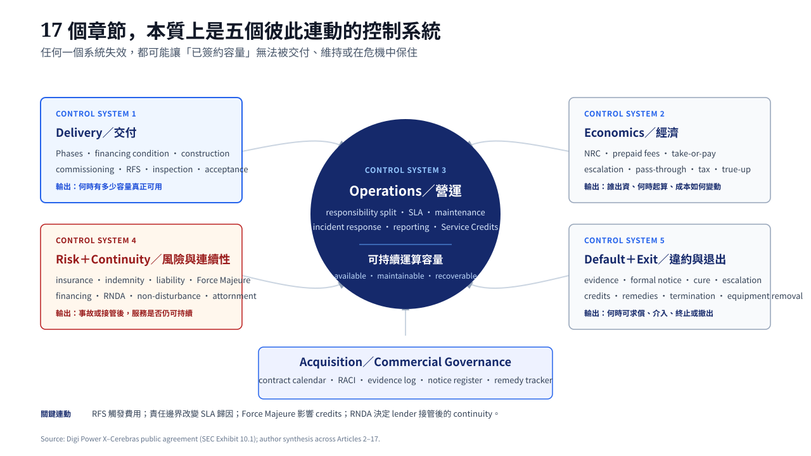

+++
date = '2026-08-29T18:00:00+10:00'
title = '從 40 MW 到可用容量：一份公開資料中心合約的商業解讀'
description = '以 Digi Power X 與 Cerebras 公開申報的資料中心合約為案例，拆解容量交付、RFS、SLA、風險分配、融資連續性與 DC acquisition 管理重點。'
summary = '40 MW 不等於 40 MW 已經可用。這份公開合約案例說明，資料中心容量如何經過融資、興建、commissioning、RFS、驗收與營運治理，才成為真正可執行的商業權利。'
tags = ['Data Center', 'Contract', 'Commercial', 'Case Study','中文']
showTableOfContents = true
showReadingTime = true
collapseMobileToc = true
featureAlt = '抽象化的公開合約、電力與冷卻系統共同構成一座資料中心'
+++


**公開文件聲明｜Public-document case study**

本文分析的不是外洩文件、內部簡報或未公開談判資料，而是 Digi Power X Inc. 於 2026 年 5 月 8 日向美國證券交易委員會（SEC）提交的 8-K 公開申報文件，以及其中的 Exhibit 10.1——一份由 Digi Power X Inc. 與 Cerebras Systems Inc. 簽署的《Data Center Colocation and Master Services Agreement》。任何讀者都可以直接查閱 [SEC 8-K 原始申報](https://www.sec.gov/Archives/edgar/data/1854368/000121390026053566/ea0289585-8k_digi.htm)、[SEC 公開合約原文](https://www.sec.gov/Archives/edgar/data/1854368/000121390026053566/ea028958501ex10-1.htm)，或[下載本站保存的公開 PDF 閱讀副本](/portfolio/data-center-contract-case-study/public-data-center-contract.pdf)。如副本與 SEC 原始文件有任何差異，應以 SEC 版本為準。公開版本遮蔽了部分商業條件，也未附完整 exhibits；本文只分析可見機制，不推測被遮蔽內容，亦不構成法律、投資或採購意見。


  <a href="https://www.sec.gov/Archives/edgar/data/1854368/000121390026053566/ea028958501ex10-1.htm" target="_blank" rel="noopener noreferrer" style="display:inline-block;padding:11px 18px;border-radius:8px;background:#be7e4a;color:#fff;text-decoration:none;font-weight:700;">查看 SEC 合約原文</a>
  <a href="/portfolio/data-center-contract-case-study/public-data-center-contract.pdf" download style="display:inline-block;padding:11px 18px;border:1px solid #be7e4a;border-radius:8px;color:inherit;text-decoration:none;font-weight:700;">下載公開合約 PDF</a>

---

## Executive Summary

40 MW 看起來是一個很清楚的數字。對一家需要大量 AI 運算能力的公司而言，它似乎代表一座資料中心、一筆長期容量，以及未來十年的基礎設施保障。

但合約不是這樣運作的。

這份公開合約將 40 MW 拆成兩期：Phase 1 為 15 MW；Phase 2 再增加 25 MW。第二期不只取決於興建進度，還取決於 Operator 能否取得融資、Customer 是否批准融資條件，以及雙方是否按時完成書面通知。即使容量完成興建，也不代表已經可以交付。每一期仍要經過 commissioning、Ready for Service（RFS）通知、工程報告、Customer inspection、缺失補正，以及可能的第三方工程師裁決。

因此，資料中心合約真正交易的不是封面上的 MW，而是一條把容量承諾轉化為可使用、可持續、可管理、可救濟權利的商業鏈條。

這份合約帶來五個核心發現：

1. **Customer 買的不是土地或一般租賃空間，而是資料中心空間的 exclusive license，加上一組 managed infrastructure services。** Operator 仍然保有土地與設施的所有權、占有與控制權。
2. **Headline capacity 不等於可使用容量。** 40 MW 必須經過分期條件、興建、commissioning、RFS 與 acceptance，才會轉化成真正可營運的容量。
3. **Take-or-pay、NRC、prepaid fees 與 pass-through 共同決定建設與營運風險如何分攤。** Customer 取得容量保障，但也可能在實際使用量不足時仍需按 contracted IT Load 付款。
4. **發生停機不等於可以立即終止合約。** SLA failure、service credit、breach、material breach、Event of Default 與 termination 是不同層級，中間還有 evidence、notice、cure 和 escalation。
5. **Operator 的融資不是 Customer 的局外事。** 一旦 lender 透過 foreclosure 或其他方式接管 Facility，Customer 是否還能進入設施、運作設備與取得服務，取決於 RNDA 等 continuity protection 是否有效成立。

對 DC acquisition 或 commercial manager 而言，工作不只是取得容量。更重要的是把容量變成一套可驗收、可營運、可追蹤、可救濟，而且在融資與控制權變化後仍然受保護的權利。

---

這份研究延續我在〈[Beyond the Model](https://chunghaolee.com/posts/beyond-the-model-the-invisible-moat-of-ai-infrastructure--data-center/)〉中對 AI 基礎設施底層的探索。這次再往下一層，理解實體容量如何透過合約被轉化成可以取得、管理與保護的商業權利。

---

## 一、這筆交易究竟在買什麼？

第一次看到 colocation agreement，很容易把它想成一份特殊版本的房屋租約：Operator 提供空間，Customer 每月付費，把 GPU、伺服器和網路設備放進去。

但這份合約刻意排除了這種理解。

### Customer 取得 license，不取得不動產權利

依 §2.1，Customer 取得的是 24 小時、每週 7 天、全年 365 天進入 Facility、使用 Colocation Space、安裝與維護 Customer Equipment，以及取得 Services 的 exclusive license。Operator 則始終保有 Land 和 Facility 的 ownership、possession and control。

合約更直接寫明，這項權利「**shall not constitute a leasehold estate**」。§2.3 再次確認：這是一份空間 license 加 managed infrastructure services agreement，而不是 lease，也沒有把任何 real property interest 移轉給 Customer。

這個區分不是法律文字遊戲。它決定了 Customer 真正擁有什麼。

Customer 擁有自己的 IT 設備，卻不擁有設備所在的土地與建築物；它有權使用資料中心，卻不能像業主一樣處分設施。Operator 可以進入 Facility 進行維護、檢查與緊急處置，也可以在符合合約的前提下融資、設定擔保或處分其權益。

因此，這筆交易同時包含三種不同資產：

| 層次 | 由誰控制 | Customer 真正取得的內容 |
|---|---|---|
| Land／Facility | Operator | 沒有所有權，只取得合約保障的使用權 |
| Operator Infrastructure | Operator | 電力、冷卻、監控與 managed services |
| Customer Equipment | Customer | 自己的 GPU、伺服器、網路及指定設備 |

資料中心合約的核心，不是把這三層混在一起，而是把各自的 ownership、operation、risk 和 remedy 分清楚。

> **Clause in focus｜§2.1、§2.3**
>
> - 合約用語：license，不是 lease。
> - 白話意思：Customer 可以進入和使用，但不擁有土地或建築物。
> - 商業意義：Customer 的持續使用權依賴合約、Operator 履約，以及 lender 是否承認這些權利。
> - Acquisition action：確認 access、security、operator entry、lender recognition 和 termination 後設備搬離機制。

*圖 1｜Contract Entity and Transaction Map。Customer 透過合約取得 capacity、access 與 services；Operator 保留底層資產控制，lender recognition 則決定接管後的連續性。*

---

## 二、從 40 MW 到真正可以使用的容量

這份合約最醒目的數字是 40 MW IT Load。但 40 MW 不是同一天、同一條件下交付的單一產品。

### 40 MW 被拆成兩個不同承諾

Phase 1 是 15 MW。Operator 必須在 Delivery Date 1 前交付。

Phase 2 是額外 25 MW，合計才是 40 MW。但 Phase 2 是 conditional delivery：Operator 需要在 Financing Period 內，以 commercially reasonable efforts 取得股權、債務或兩者組合的融資；取得融資後，再把 Financing Materials 提供給 Customer。Customer 必須在合約期限內書面批准或不批准。

如果 Customer 發出 Phase 2 Approval Notice，Operator 才需要交付額外 25 MW；如果 Customer 不批准，或沒有按時回覆，Operator 對 Phase 2 就沒有交付義務，Customer 的權利與義務也只剩 Phase 1。

所以「40 MW contract」至少包含五種不同狀態：

1. Headline capacity：對外看到的 40 MW。
2. Phase 1 committed capacity：第一期 15 MW。
3. Conditional capacity：有待融資與批准的第二期 25 MW。
4. RFS capacity：完成建設並符合交付條件的容量。
5. Operating capacity：Customer 已完成設備部署、可投入實際運算的容量。

把這五種容量混為一談，會讓排程、資金、設備採購與下游客戶承諾一起失真。

### Construction、commissioning、RFS 與 acceptance 不是同一件事

Construction completion 表示工程完成；commissioning 則是透過測試、調校與驗證，確認電力、冷卻、監控及相關系統能按照設計共同運作。它回答的不是「設備有沒有裝上去」，而是「整個系統能不能在真實條件下運作」。

RFS 又比 commissioning 多一層合約意義。依 §4.2，Operator 只有在 Phase 完成施工與 commissioning，且符合 Exhibits B、C、F 的 specifications、RFS Criteria 和 technical requirements 後，才能發出 RFS Notice。通知還必須附上由 engineer of record 準備的 commissioning report。

Customer 收到通知後，有一段被遮蔽的 Business Days 可以檢查設施。如果發現 material deviation，必須在期限內書面提出 deficiencies；如果沒有回覆，該 Phase 便會「**deemed accepted**」。Operator 補正後，Customer 還有另一段期限驗證 cure 是否完成；再次沒有異議，也會被視為接受。

如果雙方仍然無法同意是否達到 RFS Criteria，任何一方都可以要求共同接受的 independent data center engineer 作出 final and binding determination，費用由雙方平均負擔。

這整套流程揭示了一件重要的事：**合約權利不會自己執行。**

Customer 可能擁有拒絕不合格交付的權利，但如果 RFS Notice 沒有進入正確的內部流程、工程團隊來不及檢查，或 commercial owner 錯過回覆期限，紙上的權利仍可能因 deemed acceptance 而消失。

一個實際的 RFS workflow 至少要有：

- RFS Notice 接收人與備援人。
- Commissioning report 審閱責任人。
- 現場 inspection 排程。
- RFS Criteria 與 deficiency threshold。
- 書面異議格式與批准權限。
- Cure tracker 與重新驗證期限。
- Independent engineer escalation path。
- 所有 deadline 的 contract calendar。

### Early Access 不等於 RFS

為了縮短部署時間，Customer 可以在正式交付前進場安裝 racks、PDUs、IT equipment、cabling、Customer-supplied liquid cooling，並進行 pre-commissioning testing。Early Access Period 原則上不收 recurring fees；如果 Customer 提前 energize 設備，則支付實際使用的電力費。

但 §4.5 明確說明，Early Access 不構成 RFS acceptance。能進場，不代表設施已經完成；能讓設備通電，也不代表 Operator 已達到正式 SLA。

對專案管理來說，這需要至少三個不同的狀態標記：Early Access、Partial RFS、Full RFS。否則 Customer 自己的設備安裝活動可能被誤認為設施已經交付，甚至在延誤爭議中被認定為 Customer-Caused Delay。

### Delay 不只是算天數，而是先判斷責任

如果 Operator 沒有在 Delivery Date 達成 RFS，Customer 可能取得 Daily RFS Credits。但計算前要先排除兩類原因：Force Majeure Event 和 Customer-Caused Delay。

Customer-Caused Delay 包括未按時提供 approvals、specifications 或 decisions，也包括 Customer 的安裝活動干擾施工，以及 Customer、contractors 或 agents 的其他作為或不作為。符合這些情況時，Target Delivery Date 會 day-for-day 延長。

這就是為什麼 acquisition manager 不能只記錄「總共晚了 10 天」。真正要問的是：10 天當中，哪些由 Operator 造成，哪些可以歸責於 Customer，哪些符合 Force Majeure；每一類有沒有通知、證據與 revised schedule。

當延誤超過 Final Outside Delivery Date，Customer 可以書面終止受影響的 Service Order，不需支付 fee 或 penalty，並取回未投入已完成工程的 Prepaid Fees、NRCs，以及累積未付的 Daily RFS Credits。實際期限與 credit rate 在公開版中被遮蔽，因此本文不能計算具體金額。

### Liquidated Damages：預先約定，而不是事後漫天喊價

晚交資料中心容量可能造成設備閒置、部署延期、下游客戶違約或 compute revenue 損失。這些損失很難在事後逐筆證明，也很容易讓雙方陷入長期爭議。

§4.4 因此承認實際損失難以確定，並將 Daily RFS Credits 定位為雙方事前對損害的合理估計，而不是 penalty。Liquidated Damages 的商業功能，正是把一個難以量化的未來爭議，轉換成事先同意的計算機制。

它的價值在於可執行性，不在於一定能完全補回 Customer 的真實損失。

> **Clause in focus｜§4.2–§4.4**
>
> - 合約用語：RFS Notice、commissioning report、deemed acceptance、Daily RFS Credits。
> - 白話意思：完成興建只是起點，還要證明達標、按期檢查、提出缺失並完成補正。
> - 商業意義：交付權利的價值，取決於通知、證據和 deadline 是否被正確管理。
> - Acquisition action：在簽約前就設計 RFS governance，不要等 RFS Notice 到達才臨時找人。

*圖 2｜From 40 MW Commitment to Operating Capacity。Headline capacity 必須通過 phase condition、construction、commissioning、RFS evidence 與 acceptance，才會轉化為可營運容量。*

---

## 三、容量的經濟學：誰出錢、為什麼付錢、風險由誰承擔

Operator 要取得土地、興建建築物、接入電力、配置冷卻與備援系統，還要負責後續 managed services。Customer 則需要一段長時間、可預測、不中斷的高密度運算容量。

兩者透過合約交換的，不只是空間與租金，而是前期建設資金、長期容量承諾和未來營運風險。

### NRC：Customer 也參與建設資金

Phase 1 和 Phase 2 都有 Non-Recurring Charges（NRCs），用於 Operator Infrastructure 的 design、procurement、construction、installation 和 commissioning。Customer 可以把 NRC 交給 escrow agent，也可以依 Operator 提供的 invoices，直接支付指定 suppliers、vendors 或 contractors。

這項設計同時處理三個問題：

1. Operator 取得建設所需資金。
2. Customer 可以看到資金流向和 supporting invoices。
3. Customer 的責任設有 aggregate cap，超出約定 NRC 的成本原則上由 Operator 承擔，除非 Customer 書面批准。

Customer 的付款也不是毫無條件。Phase 1 Funding Condition 包括 Customer 對 general contractor 的批准；Phase 2 則包括對 final plans and specifications 的批准。反過來，如果 Customer 沒有按時支付 NRC，Delivery Date 可能因 Customer-Caused Delay 而 day-for-day 延後。

### Take-or-pay：買的是保留容量，不只是實際電量

§6.1(c) 是理解整份合約經濟模型的關鍵。Colocation Fee 是 all-in rate，涵蓋 contracted IT Load 以內的 delivered electrical power、Operator Infrastructure 和 Services；同時也是「**take-or-pay obligation**」。

這代表每個 Phase 的費用以 contracted IT Load 計算，不以 Customer 當月真正使用多少電為準。即使 Customer 的設備沒有全部上線、實際 draw 不足，或自己的營運縮減，原則上仍需支付完整 Colocation Fee；只有合約明確列出的 Force Majeure 或 Service Credits 例外可能調整。

對 Customer 而言，這是利用率風險：容量沒有充分使用，費用仍然存在。對 Operator 而言，則是現金流保障：長期、可預測的收入可以支撐前期建設與融資。

所以 take-or-pay 不是一句強硬的付款條款。它是 capacity certainty 與 project finance 之間的橋樑。

### All-in rate 也不代表未來不會有額外成本

合約把 Effective Date 當時的 delivered electricity cost 放進 Colocation Fee，但允許特定 Energy Pass-Throughs：例如 Effective Date 後新增或實質增加的政府稅費、utility demand charges、capacity charges，以及 transmission and distribution charges。

Operator 不能只說「電變貴了」就把成本轉嫁。§6.8 要求 reasonable supporting evidence，而且一般市場波動範圍內的 commodity price fluctuation 不構成 Energy Pass-Through。這裡的控制點是 discrete、identifiable、new or increased governmental or regulatory charges。

對 acquisition manager 而言，真正要建立的是 invoice validation：每一項 pass-through 對應哪個政府或 utility 文件、何時生效、適用哪個 Phase、如何分攤、是否重複包含在 all-in rate，以及季度 true-up 是否正確。

### 公開版本無法回答「這筆交易划不划算」

公開合約遮蔽了實際 Colocation Fee、annual escalation、prepaid amount、NRC rate、Service Credit formula 和多數 liability caps。沒有這些資訊，就不能判斷 Customer 是否買貴，也不能判斷 Operator 的報酬是否與風險相稱。

概念上，可以把 Operator 看成擁有長期基礎設施現金流的資產營運方；但沒有租約價格、利用率、建設成本、營運成本、資本結構與折現率，就不能把這個概念直接變成可信的 DCF。

專業分析的邊界，不是「能不能想像一個數字」，而是「現有資料是否足以支持那個數字」。

> **Clause in focus｜§6.1(c)、§6.8**
>
> - 合約用語：all-in rate、take-or-pay、Energy Pass-Through。
> - 白話意思：Customer 買的是保留容量；特定新增政府或電網費用可以另外轉嫁，但要提出證明。
> - 商業意義：Operator 取得收入可預測性，Customer 承擔利用率與部分制度性成本風險。
> - Acquisition action：同時審查 capacity forecast、fee model、pass-through definition 和 invoice evidence。

---

## 四、設備與責任邊界：誰該做什麼？

一座資料中心發生問題時，最困難的問題往往不是「哪個設備壞了」，而是「這個設備和這段服務到底由誰負責」。

合約把 Operator Infrastructure 與 Customer Equipment 分開。Operator 負責 Facility-level 的電力、冷卻、監控和 managed services；Customer 則負責自己的 IT、network、racks，以及 Appendix A 或 §5.2 指定的設備。Early Access 期間由 Customer 安裝的 liquid-cooling infrastructure，也可能形成額外的責任界面。

這條界線會一路影響四件事：

- 延誤算 Operator Delay 還是 Customer-Caused Delay。
- 停機能不能計入 SLA。
- 維修費由誰支付。
- 損害應由哪一方的 insurance 或 indemnity 處理。

例如，冷卻中斷可能來自 Operator 的 Facility cooling，也可能來自 Customer-supplied cooling component；GPU 無法運作可能是供電問題，也可能是 Customer Equipment failure。只記錄「GPU down」不足以啟動正確的求償。

因此，responsibility matrix 不能只留在合約附件裡。它應該轉換成營運團隊可使用的 RACI、asset register、monitoring boundary 和 incident routing rule。

| 問題 | Operator 主要責任 | Customer 主要責任 | 商務控制 |
|---|---|---|---|
| Facility power／cooling | 建設、commission、維護與提供服務 | 遵守 contracted specifications | SLA、monitoring、maintenance notice |
| Customer IT equipment | 提供環境與約定服務 | 採購、安裝、維護與保險 | asset list、warranty、incident evidence |
| Buildout | 管理施工與供應商 | 及時批准、提供規格、支付 NRC | milestone、approval log、change control |
| Additional services | 按 SOW／cost-plus 提供 | 批准範圍與費用 | SOW、PO、invoice validation |

---

## 五、營運合約：SLA、維護與 Service Credits

很多人看到 SLA，第一反應是 uptime percentage。但這份合約把營運表現拆成多個控制面：Power Availability、Cooling Availability、Monitoring and Reporting、Planned Maintenance、Emergency Maintenance 和 Response Time。

這比較接近資料中心的真實世界。電力可用，不代表冷卻可用；系統恢復，不代表回應時間達標；設備停機，也不一定算入 SLA。

### 發生中斷，不代表一定取得 Service Credits

§7.3 規定，如果 Operator 未達 Power 或 Cooling SLA，Customer 有權依 Exhibit D 取得 Service Credits，抵扣下一期 Colocation Fee。但 Exhibit D 沒有出現在公開版本，因此公式、claim protocol、cap 和期限都不可見。

更重要的是，合約另外定義多種 exclusion。

在 Standard Maintenance Window 內，如果 Operator 已按約提供 Potential Service Impact Notice，即使發生 service interruption，Customer 也可能沒有 credits。在 Non-Standard Maintenance Window 內，只要通知與實際維護時間符合約定，結果也可能相同；但未經 Customer 同意超過每月時數上限的部分，則可能重新計入 credits。

Emergency Maintenance 也不是一律排除。如果事件無法合理預見，且無法透過 Planned Maintenance 避免，Operator 可能取得 relief；如果原因本來可以預見、可以安排維護避免，或來自 Operator negligence／willful misconduct，Customer 便可能有 credits。每月超過 6 小時的 Emergency Maintenance，也會依合約重新產生 credit eligibility。

所以 Service Credit 並不是按下按鈕就自動出現。它需要一條證據鏈：

1. Incident start／end time。
2. 受影響的 service 和 Phase。
3. Operator monitoring data。
4. Maintenance notice 是否有效。
5. Root cause 屬於 Operator、Customer 或 Force Majeure。
6. Excluded Downtime 是否成立。
7. Exhibit D 的公式、claim deadline 和 cap。
8. Credit 是否正確出現在下一張 invoice。

### Service Credit 不是完整損失補償

Customer 可能因停機失去 compute revenue、延誤下游客戶工作，甚至產生機會成本。但 Service Credit 通常是事前約定、用來管理服務表現的合約補償，不代表 Customer 的所有實際損失都能獲賠。

Article 12 同時排除了多種 indirect、incidental、consequential、punitive 或 special damages，包括 lost profits、revenue、data 和 business opportunity；實際例外與 liability cap 又被遮蔽。因此，Customer 不能把「有 SLA」理解成「所有停機損失都有人買單」。

> **Clause in focus｜§7.3、§7.5、§7.6**
>
> - 合約用語：Service Credits、Excluded Downtime、Planned Maintenance、Emergency Maintenance。
> - 白話意思：有中斷不一定有 credits；要先看時間、通知、原因、可預見性和 exclusion。
> - 商業意義：SLA 的價值不只在百分比，而在 measurement、evidence、claim protocol 和 invoice recovery。
> - Acquisition action：建立 monthly SLA reconciliation，不要只在重大停機後才回頭找資料。

---

## 六、風險如何分配：Insurance、Indemnity、Liability 與 Force Majeure

合約不能阻止事故發生。它能做的是事先決定：事故發生後，誰先處理、誰負責第三方求償、哪些損失可以索賠，以及責任最多到哪裡。

### Insurance 處理資產與風險承保

Operator 要為 Facility 和 Operator Infrastructure 維持 property insurance，也要有 commercial general liability、workers’ compensation 和 excess liability 等保險。Customer 則要為自己的設備與財產維持 full replacement cost 的 property／mechanical breakdown coverage，並承擔自己的 CGL 與相關保險義務。

這表示 Customer 的 GPU 或其他設備受損時，不能直覺認定 Operator 一定全額賠償。首先要看損害原因、責任歸屬、insurance coverage、deductible，以及 Article 11、12 的 indemnity 和 liability limitations。

### Indemnity 主要處理第三方 claims

如果事故造成的不只是雙方彼此損失，而是第三方地主、承包商、員工或其他受害者提出求償，indemnity 就變得重要。

例如，Facility-level cooling design 或 Operator Infrastructure 造成 coolant release，進而污染鄰近土地，第三方可能對 Customer 提告。§11.2(c) 表示，在污染是由 Facility、Operator Infrastructure、Operator 的設計、施工、commissioning、operation、maintenance 或違反法規所造成的範圍內，Operator 應就相關第三方 claims 對 Customer 提供 indemnification。

反過來，如果損害來自 Customer Equipment、Customer personnel 或 Customer 自己的違約，Customer 也可能需要承擔相應責任；但公開版遮蔽了 Customer indemnity 的部分內容，因此不能完整重建責任範圍。

### Liability cap 不等於所有損失都有共同上限

Article 12 排除 consequential damages，並設定 cumulative liability cap，但 cap 金額與多數 exceptions 已被遮蔽。實務上必須把三件事分開：

- 哪些損失類型一開始就被排除。
- 沒被排除的損失是否受到 cap 限制。
- Fraud、gross negligence、willful misconduct、confidentiality、indemnity 或其他項目是否屬於 carve-out。

只看到「liability cap」四個字，還不足以知道最壞情境下誰承擔多少。

### Force Majeure 不會自動停止付款

§14.1 允許一方在無法合理控制、也無法透過 due diligence 預防或減輕的事件下，就受影響的履約義務取得 relief；但它明確排除「**other than payment obligations**」。換句話說，Customer 不能只因 Force Majeure 就假定月費自動停止。

Force Majeure 也不是一張空白支票。主張的一方要 prompt notice、說明預期期間與影響、持續更新，並以 commercially reasonable efforts 減輕損失與恢復履約。Operator 的資金不足、一般市場不利、可透過 advance planning 避免的延誤，以及因 maintenance failure 造成的設備問題，都不在定義內。

如果 Force Majeure 造成 service interruption，Operator 要在事件發生後 72 小時內提供通知，才可能取得相應 SLA relief。長期 Force Majeure 可能觸發 termination，但公開版本遮蔽了具體天數。

這裡形成一個對 Customer 不利、卻有商業邏輯的張力：服務可能中斷，credits 可能不產生，付款義務卻可能繼續。Operator 需要現金流維持 Facility 和恢復服務；Customer 則需要在簽約前評估，自己是否有足夠的 business continuity、insurance 和 workload migration 能力承受這段不對稱。

---

## 七、Operator 融資，為什麼會成為 Customer 的營運風險？

資料中心是高資本密集資產。Operator 可能以 mortgage、deed of trust、mezzanine loan、sale-leaseback 或其他 security arrangement 融資。§16.2 允許 Operator 不經 Customer 同意進行這些 Financing，只要符合合約保護。

表面上，這是 Operator 的公司財務。實際上，它直接影響 Customer 的設備能否繼續運作。

### Customer 的權利建立在別人的土地上

Customer 不擁有 Facility。當 Operator 無法償債，Lender 可能透過 foreclosure、deed-in-lieu 或其他方式取得 title 或 control。如果新的 owner 不承認原合約，Customer 可能同時失去三項關鍵權利：進入 Facility、使用 Colocation Space，以及持續取得 Services。

這就是 RNDA 存在的原因。

RNDA 是 recognition、non-disturbance and attornment agreement：

- Recognition：Lender 接管後承認原 Agreement 和 Service Orders。
- Non-disturbance：只要 Customer 沒有未補正的 material default，Lender 不會單純因 foreclosure 終止其 occupancy 和 service rights。
- Attornment：Lender 或 successor owner 接管後，Customer 承認對方成為新的 Operator，雙方依原合約繼續履行。

這個保護並非毫無限制。§16.2(c) 同時表示，Lender 不必承擔接管前 Operator 已經產生的義務、不必 cure pre-existing default，也不必接受 Customer 對原 Operator 的 offset、defense 或 counterclaim。它主要保護未來 continuity，不是把過去所有問題一起修好。

此外，Operator 的 Financing 不得在超過 de minimis 的程度上削弱 Customer 權利或增加 Customer 義務；RNDA 也應在 Financing 生效前完成。這些都需要被納入 transaction closing checklist，而不是等 Operator 出現財務問題才追查。

> **Clause in focus｜§16.2**
>
> - 合約用語：foreclosure、recognition、non-disturbance、attornment。
> - 白話意思：設施換了 owner，Customer 的設備和服務不能跟著失去法律與商業立足點。
> - 商業意義：financing continuity 就是 service continuity。
> - Acquisition action：要求取得 signed RNDA，核對 Lender cure notice、recognition scope、pre-existing default 和 no-impairment language。

---

## 八、從事故到退出：Breach、Default、Cure 與 Termination

在日常口語裡，我們很容易把「對方沒做到」都叫做違約。但合約把它拆成不同階段。

Breach 是違反某項義務；material breach 是足以影響交易核心的重大違反；Event of Default 則通常要符合合約定義，並完成 notice 和 cure 流程後才正式成立。

一次 SLA failure 通常先產生 Service Credit eligibility，不會自動變成 Operator Event of Default。只有當 Operator 的 material breach 沒有在書面通知後的期限內補正，或沒有按約開始並持續完成 cure，才可能進入 §13.2 的正式狀態。

### Default Notice 必須能讓對方真的補救

§13.3 要求 notice 指出 specific provision breached、構成違約的 facts，以及 required cure action。原文甚至直接警告：「**Vague or omnibus default notices shall carry no effect.**」

因此，「Your service is unacceptable. Fix it immediately.」不夠。它沒有告訴對方違反哪一條、發生什麼事、要修什麼，也無法建立 cure period 的可驗證起點。

一份有效的 commercial default package 至少要包含：

- Incident timeline 和 supporting records。
- 被違反的 Agreement／Service Order／Exhibit。
- 為什麼屬於 material breach。
- 要求的 cure action 和 acceptance criteria。
- Cure deadline。
- Owner、status 和 evidence repository。
- 未 cure 時準備採取的下一步。

### Remedies 是階梯，不是單一開關

根據事件與條款，Customer 可能先取得 Service Credits 或 Daily RFS Credits；material breach 發生後，則進入 notice 和 cure。只有在 Event of Default 成立後，才可能進一步尋求 termination、unused Prepaid Fee／NRC refund、specific performance，或其他法律與衡平法上的 remedies。

Specific performance 代表要求對方實際履行，而不只是付錢；但合約允許一方 seek specific performance，不代表法院一定批准。是否成立仍取決於 governing law、事實、救濟是否足夠，以及法院判斷。

### No Cross-Default：問題可能被限制在單一 site

§13.5 將每份 Service Order 視為獨立義務。某個 Service Order 的 breach、dispute 或 termination，不會自動造成另一份 Service Order 或整份 Master Agreement 違約；即使一份 Service Order 涵蓋多個 Facility sites，某個 site 的問題也原則上只影響該 site。

對多站點 Customer 而言，這可以避免單點問題擴散到整個 portfolio；但也表示 Customer 可能無法利用一個嚴重 site failure，終止其他仍正常運作的站點承諾。

### 終止合約後，設備還在裡面

資料中心合約不能像取消 SaaS 訂閱一樣結束。Customer 的 racks、servers、storage media 和 network equipment 仍然位於 Operator 控制的設施中。

§13.4 要求 Customer 在 Decommissioning Period 內搬走設備、修復超出正常耗損的損害，並交還空間。如果沒有按時搬離，Operator 可以「at its election」移除並儲存設備、視為 abandoned，或依合約與適用法律處置；相關費用可能由 Customer 承擔。

合約也特別處理設備內資料的安全：存放、移轉、抹除與銷毀需要適當的 physical security 和 data destruction controls。這提醒 acquisition manager，exit plan 必須同時涵蓋 workload migration、physical removal、data sanitization、vendor access 和 chain of custody。

*圖 3｜Incident-to-Remedy Ladder。事故本身只是起點；證據、排除項目、權利分類、正式通知與 cure 共同決定最後能否主張 remedies。*

---

## 九、控制權改變、正式通知與爭議處理

長達十年的合約期間內，Customer、Operator、Facility owner 和資金提供者都可能改變。合約因此不只管理服務，也管理組織變動。

### Assignment 與 Change of Control

Customer 原則上不能未經 Operator 同意轉讓 Agreement、Service Order 或相關權利義務；但合約允許若干 Permitted Transfers。由 professional private equity 或 venture capital investors 為 Customer 營運或成長提供資金而取得控制權，以及 Customer IPO，依 §17.3.1 不會單純因此被視為 Change of Control。

Operator 也不能任意轉讓。它可以在 merger、acquisition、reorganization 或出售 Facility 等情況下，把合約移交給 successor，但 assignee 必須承接 Operator 義務、具備至少相當的履約能力，並提前通知 Customer。Operator 也不能把 Agreement、Service Order 或 Facility 控制權交給 Exhibit H 所列的 Customer Competitor；Customer 可依限制定期更新名單。

這些條款的商業目的不是阻止公司交易，而是避免 Customer 在沒有選擇的情況下，被迫把關鍵 AI infrastructure 交給信用不足、能力不足或具有競爭衝突的新對手方。

### 正式通知不等於「寄一封 email 就好」

§17.2 允許三種方式：hand delivery、nationally recognized overnight courier，以及附 confirmed read receipt 的 email。通知何時 deemed received，也依方式不同：親送當日、courier 寄出後下一個 Business Day，或 email confirmed receipt 時。

所以真正問題不是「商務以後要不要每天去收實體信」，而是：

- 合約指定的 notice address 和 email 是什麼。
- 這些地址是否仍有效。
- Mailroom、legal、commercial owner 和 project team 如何串接。
- 誰負責辨認 RFS Notice、Default Notice、Dispute Notice 或 assignment notice。
- 收到後如何立刻進入 contract calendar 和 workflow。

在大型跨國公司中，正式通知應該是一套組織流程，而不是依賴某個人記得查看信箱。

### 不能跳過 dispute escalation

依 §17.1，爭議發生後，雙方先由負責日常營運的 representatives 協商；無法解決，再升級到有權拘束公司的 senior executives。只有這些步驟完成後，才進入 Delaware 指定法院的 formal proceeding。

例外是為了避免 irreparable harm 或維持 status quo 而需要 temporary、preliminary、emergency injunctive relief 或 specific performance。這種情況可能不需先完成一般 escalation。

因此，爭議處理的重點不只是「能不能告」，而是有沒有走完正確流程、選對 venue、送出有效 notice，並保留每一步的記錄。

> **Clause in focus｜§17.1、§17.2、§17.3**
>
> - 合約用語：governing law、venue、notice、assignment、Change of Control。
> - 白話意思：公司、設施和爭議都可能改變，但不能讓合約權利在變動中失去控制。
> - 商業意義：形式程序錯誤，可能讓原本存在的權利無法有效行使。
> - Acquisition action：維護 notice matrix、authority matrix、escalation tree 和 counterparty change monitoring。

---

## 十、DC Acquisition／Commercial Manager 的工作清單

讀完一份合約，不等於把工作做完。真正的價值在於把條款轉換成跨部門可以執行的流程。

### 1. 簽約前：先確認買到的東西

- Parties、signing authority 和 creditworthiness。
- Operator 是否真的擁有或控制 Land／Facility。
- 交易是 lease、license 還是 services arrangement。
- Contracted IT Load、Phase、future capacity 和 renewal options。
- Delivery schedule、RFS Criteria、technical specifications。
- Operator／Customer responsibility matrix。
- NRC、prepaid fees、take-or-pay、annual escalation 和 pass-through。
- SLA、maintenance exclusions、credit formula 和 claim protocol。
- Insurance、indemnity、liability cap 和 carve-outs。
- Title、encumbrances、Lender、RNDA 和 step-in rights。
- Assignment、Change of Control、competitor restrictions。
- Default、cure、termination、equipment removal。
- Notice、dispute escalation、governing law 和 venue。

### 2. 簽約後至 RFS：把交付變成 governance

- Financing conditions 和 Customer approval deadlines。
- General contractor／design approval。
- Construction milestones 和 long-lead items。
- Customer decision／specification tracker。
- Early Access 和 Customer installation controls。
- Commissioning plan、report 和 witness testing。
- RFS Notice intake。
- Inspection、deficiency、cure 和 independent engineer process。
- Deemed acceptance deadline。
- Delay attribution、notice 和 revised schedule。

### 3. 營運期間：把 SLA 變成可回收的權利

- Monthly SLA report 和 monitoring audit。
- Incident／RCA record。
- Planned／Emergency Maintenance notice。
- Excluded Downtime review。
- Service Credit calculation 和 invoice reconciliation。
- Pass-through supporting evidence。
- Insurance certificate renewal。
- Change request／SOW／cost-plus approval。
- Notice address、Lender、ownership 和 counterparty changes。

### 4. Distress 或退出：先保住運算，再處理爭議

- Default evidence 和 valid notice。
- Cure owner、deadline、acceptance criteria。
- Operational／executive escalation。
- RNDA contact 和 Lender notice。
- Step-in／substitute operator assessment。
- Workload migration 和 temporary capacity。
- Equipment access、removal、transport 和 storage。
- Data sanitization 和 destruction evidence。
- Credits、refunds 和 unapplied NRC／prepaid fee reconciliation。
- Litigation prerequisites 和 designated venue。

### 最先閱讀的三份附件

如果資料室開放、時間又有限，我會先看：

1. **Exhibit A — Phased Delivery Schedule**：容量何時交付，哪些日期是 target、trigger 或 final outside date。
2. **Exhibit C — Ready for Service Criteria**：什麼條件成立後，容量才算真正可以交付。
3. **Exhibit D — SLA and Service Credits**：營運失敗如何衡量、排除與計算補償。

接著再看 Facility specifications、technical requirements、responsibility／cost breakdown、physical security 和 escrow arrangement。主合約定義治理邏輯，附件才放著大量會決定實際結果的 operational truth。

*圖 4｜Contract Operating-System Map。條款不是一份線性清單，而是五個互相連動的控制系統；acquisition governance 把它們變成可管理的日常流程。*

---

## 結語：合約不是交易的終點，而是容量開始被管理的地方

從 AI 模型往下看，會先看到 GPU、電力、冷卻、土地和供應鏈。再往下一層，才會看到決定誰可以使用、何時可以使用、要付多少錢、發生問題時能做什麼的商業合約。

這份公開合約最值得學習的，不是某一條特別強勢或特別優惠的文字，而是整套條款如何互相連動：Phase 2 financing 影響容量；RFS 影響 fee commencement；責任邊界影響 SLA；Force Majeure 影響 delivery 和 credits；Operator financing 又透過 RNDA 影響長期 continuity。

合約簽署，只是容量承諾成立。真正的 acquisition work，是把承諾轉換成工程證據、內部流程、通知期限、營運紀錄和可執行的 remedies。

面對這份部分遮蔽、又省略關鍵附件的公開版本，我們無法判斷價格是否合理，也無法形成最終 Go／No-Go。這不是分析沒有完成；恰恰相反，它代表分析已經指出：還缺哪些資訊，才能負責任地做決定。

MW 寫在合約首頁。容量的真實價值，藏在它能不能被交付、被維持，也能不能在出問題時被保住。

---

## Appendix A｜Contract Clause Map

| 合約部分 | 核心問題 | Acquisition／Commercial 重點 |
|---|---|---|
| Article 1 — Definitions | 每個術語如何定義 | 定義會跨條款改變付款、交付與救濟結果 |
| Article 2 — License／Phased Delivery | Customer 買到什麼、分幾期交付 | License vs lease、15 MW＋conditional 25 MW、RFS linkage |
| Article 3 — Term | 合約多久、如何延長 | 10-year initial term、extension notice、holdover、future capacity ROFR |
| Article 4 — Delivery／Early Access | 何時算交付、晚交怎麼辦 | Commissioning、RFS、deemed acceptance、credits、Final Outside Delivery Date |
| Article 5 — Responsibilities | 誰負責哪些設備與服務 | Operator Infrastructure、Customer Equipment、additional services |
| Article 6 — Fees／Payment | 誰支付建設與營運成本 | NRC、prepaid fee、take-or-pay、escalation、pass-through、tax |
| Article 7 — Service Levels | 如何衡量營運表現 | Power／cooling SLA、maintenance、reporting、Service Credits |
| Article 8 — IP | 雙方技術與資料權利如何分開 | Operator IP、Customer IP、Customer Data |
| Article 9 — Confidentiality | 哪些資訊能揭露 | Permitted disclosure、exclusions、press release、survival |
| Article 10 — Insurance | 哪一方為哪類資產投保 | Facility、Operator Infrastructure、Customer Equipment、additional insured |
| Article 11 — Indemnification | 第三方求償由誰承擔 | Negligence、misconduct、environmental／coolant claims |
| Article 12 — Liability | 哪些損失被排除、責任上限多少 | Consequential damages waiver、cap、exceptions |
| Article 13 — Default／Termination | 何時構成正式違約、如何退出 | Notice、cure、remedies、equipment removal、no cross-default、step-in |
| Article 14 — Force Majeure | 哪些不可控制事件可以免責 | Payment carve-out、notice、mitigation、SLA relief、extended FM |
| Article 15 — Representations／Warranties | 雙方在簽約時保證什麼 | Authority、compliance、facility permits、funding／buildout statements |
| Article 16 — Title／Financing | Facility 融資或被接管後怎麼辦 | Encumbrances、RNDA、attornment、collateral assignment、step-in |
| Article 17 — General Provisions | 通知、轉讓和爭議如何處理 | Delaware law／venue、escalation、notices、assignment、CoC |

---

## Appendix B｜18-Point Acquisition Checklist

### 1. Parties and roles

- 誰是 Operator、Customer、Facility owner、Land owner？
- 簽署人是否有 authority？
- 是否有 guarantor、affiliate、end user 或 lender？

### 2. Transaction structure

- Lease、license、managed services 還是混合結構？
- Customer 是否取得 real-property interest？
- Operator 保留哪些 access 和 control？

### 3. Capacity and phases

- Contracted IT Load 是多少？
- 哪些容量 firm、哪些 conditional？
- Future capacity 是否有 ROFR／option？

### 4. Term and renewal

- Term 從 Effective Date、Commencement Date 還是 RFS 起算？
- Renewal notice 提前多久？
- Holdover price 和退出期限為何？

### 5. Delivery and RFS

- Target／committed／outside delivery dates 分別是什麼？
- Commissioning report 由誰出具？
- RFS Criteria、Checklist、technical specifications 是否完整？

### 6. Acceptance and delay

- Inspection 和 objection window 多久？
- 是否有 deemed acceptance？
- Customer-Caused Delay、Force Majeure 和 Operator Delay 如何區分？

### 7. Responsibility split

- Power、cooling、network、liquid cooling、security 由誰負責？
- Demarcation point 在哪裡？
- Failure routing 和 repair cost 如何分配？

### 8. NRC／prepayment／fees

- NRC 用於什麼、是否 refundable？
- Escrow／supplier payment 如何控制？
- Monthly fee 從哪一天開始？

### 9. Escalation／pass-through／tax

- Annual escalation 幅度與起算日？
- 哪些 utility／government charge 可轉嫁？
- Supporting evidence 和 true-up 流程？

### 10. SLA／maintenance／credits

- Power、cooling、response SLA 各是多少？
- Planned／Emergency Maintenance exclusion？
- Credit formula、claim deadline、cap、sole remedy？

### 11. Insurance

- Facility、Operator Infrastructure、Customer Equipment 由誰投保？
- Coverage limit、deductible、additional insured？
- Certificate renewal 和 notice of cancellation？

### 12. Indemnity

- 哪些 third-party claims 由 Operator／Customer indemnify？
- Coolant、environmental、bodily injury、IP claim 如何處理？
- Indemnity 是否受 liability cap？

### 13. Liability

- Direct／consequential damages 如何區分？
- Cap 以多少費用、多久期間或固定金額計算？
- Fraud、gross negligence、confidentiality、indemnity 等 carve-outs？

### 14. Default／cure／remedies

- Breach 何時升級為 Event of Default？
- Notice 和 cure period？
- Termination、specific performance、refund、credit 是否可併用？

### 15. Force Majeure

- 定義、exclusions、notice、mitigation？
- Payment 和 SLA 是否繼續？
- Extended Force Majeure 何時可以終止？

### 16. Title／financing／RNDA

- Operator 是否真正擁有 Land／Facility？
- 現有 encumbrances？
- RNDA 是否在 financing 前簽署？
- Lender 接管後承認哪些義務、不承認哪些過去責任？

### 17. Assignment／Change of Control

- Customer／Operator assignment consent？
- Permitted transfers？
- Competitor restriction？
- Successor 的能力與信用要求？

### 18. Notices／disputes／governing law

- 有效送達方式、地址、email、deemed receipt？
- Operational／executive escalation？
- Governing law、venue、emergency relief exception？

---

## Appendix C｜Glossary

| Term | 白話中文 | 在合約中的功能 | 簡單英文例句 |
|---|---|---|---|
| Operator | 營運方／資料中心營運商 | 擁有或控制 Facility，興建並提供基礎設施與服務 | The Operator maintains the facility. |
| Customer | 客戶方／容量採購方 | 使用空間與服務，部署設備並支付費用 | The Customer installs its servers. |
| Lender | 貸款人／融資方 | 對 Facility 或相關權益提供融資並可能取得擔保權 | The Lender finances the facility. |
| Commissioning | 系統試運轉與驗證 | 確認電力、冷卻等系統按設計整合運作，不只是裝設完成 | Commissioning must be completed before RFS. |
| RFS | Ready for Service，可交付使用 | 合約定義的正式交付狀態，通常要符合 criteria 並附 commissioning evidence | Phase 1 has achieved RFS. |
| Deemed acceptance | 視為接受 | Customer 未在期限內異議，即使沒有主動簽字也被認定接受 | Silence may result in deemed acceptance. |
| Liquidated Damages | 預定損害賠償 | 事先約定難以精確計算的損害公式，不是懲罰性罰款 | Liquidated Damages apply to late delivery. |
| Service Credits | 服務抵扣額 | SLA 未達標時，依公式抵扣未來費用 | Service Credits will reduce the next invoice. |
| Take-or-pay | 用不用都按約付 | 以 contracted capacity 計費，不以實際使用量決定全部費用 | The fee is payable on a take-or-pay basis. |
| NRC | Non-Recurring Charge，一次性費用 | 支付設計、採購、建設或 commissioning 等 buildout 成本 | The NRC funds the initial buildout. |
| MRC | Monthly Recurring Charge，每月經常性費用 | 每月支付的容量或服務費基礎 | The MRC begins after RFS. |
| Pass-through | 成本轉嫁 | 符合定義的額外成本由 Operator 轉由 Customer 負擔 | The new grid charge is a pass-through cost. |
| Clause | 條款／條文 | 合約中規範特定權利義務的文字單元 | This clause governs late delivery. |
| Construed | 被解釋為 | 表示某段文字法律上可以或不可以如何解讀 | Nothing here should be construed as a lease. |
| Election | 選擇權／自行選擇 | `at its election` 表示該方可依自己選擇採取措施 | The Customer may, at its election, terminate. |
| Notwithstanding | 儘管前述內容／不受前文限制 | 表示後面的規則優先於前面可能衝突的內容 | Notwithstanding the above, payment remains due. |
| Hereunder | 依本合約 | 指依目前這份 Agreement 產生的權利義務 | The Customer must perform its obligations hereunder. |
| Thereunder | 依前述文件或條款 | 指依前面剛提到的 Agreement、Service Order 等 | Each Service Order and the rights thereunder remain effective. |
| Therein | 在其中 | 指前述文件、資產或安排之中 | The Lender may acquire an interest therein. |
| Thereof | 其／由此 | 指前述事物的某一部分或結果 | The parties must notify each other of any change thereof. |
| Thereby | 藉此／因此 | 指透過前面所述行為而產生的效果 | The notice starts the cure period, thereby protecting both parties. |
| Foreclosure | 擔保權實行／法拍接管 | Lender 因借款違約取得或出售擔保資產 | The Lender acquired the facility through foreclosure. |
| Deed of trust | 信託契據型擔保文件 | 以不動產提供融資擔保的一種法律工具 | The property is secured by a deed of trust. |
| Encumbrance | 產權負擔 | 影響資產的 mortgage、lien、easement 等權利限制 | The title search identified an encumbrance. |
| Lien | 留置權／擔保權 | 債權人對資產主張的擔保權益 | The bank holds a lien over the facility. |
| Easement | 地役權 | 第三方使用土地特定部分的權利，例如管線或通行 | The utility has an easement across the land. |
| Covenant | 約定義務 | 土地或合約上的持續承諾與限制 | The financing covenant limits additional debt. |
| Condition | 條件 | 某項權利或義務生效前必須滿足的事項 | Financing approval is a condition to Phase 2. |
| Prerogative | 權利／特權 | 某方依合約享有的特定決定或行動權限 | The decision remains the Customer's prerogative. |
| Mezzanine loan | 夾層貸款 | 介於 senior debt 與 equity 之間、風險與報酬較高的融資 | The project used a mezzanine loan. |
| Sale-leaseback | 售後回租 | 先出售資產，再向新 owner 租回使用，以釋放資金 | The Operator completed a sale-leaseback. |
| RNDA | Recognition, Non-Disturbance and Attornment Agreement | 確保 Lender 接管後承認合約、不中斷 Customer 權利，並成為新 Operator | The Lender signed an RNDA with the Customer. |
| Attornment | 承認新業主／新營運方 | Customer 在 Lender 或 successor 接管後承認新的履約對手方 | The Customer will attorn to the successor owner. |
| Non-disturbance | 不干擾保障 | Customer 沒有 default 時，不因 foreclosure 喪失使用與服務權 | The agreement provides non-disturbance protection. |
| Indemnity | 補償／代為承擔第三方求償 | 約定第三方 claim 由哪一方 defend、indemnify、hold harmless | The indemnity covers certain third-party claims. |
| Liability cap | 責任上限 | 限制一方在約定範圍內的累積金錢責任 | The claim is subject to the liability cap. |
| Consequential damages | 間接／衍生損失 | 例如 lost profit、lost revenue、business opportunity 等非直接損害 | Lost revenue may be treated as consequential damages. |
| Breach | 違反合約 | 某方沒有履行特定義務 | Late payment may constitute a breach. |
| Material breach | 重大違約 | 對交易核心或對方權利造成實質影響的違反 | The outage may amount to a material breach. |
| Event of Default | 正式違約事件 | 符合合約定義並完成必要 notice／cure 後的違約狀態 | The uncured breach became an Event of Default. |
| Cure period | 補救期間 | 違約方在正式 remedies 啟動前修正問題的期限 | The Operator fixed the issue during the cure period. |
| Specific performance | 強制實際履行 | 請求法院要求對方完成承諾，而不只是支付金錢 | The Customer may seek specific performance. |
| Step-in rights | 介入權 | 特定事件下，Customer 或其他指定方介入營運或補救的權利 | Step-in rights may protect service continuity. |
| Assignment | 合約轉讓 | 把合約權利或義務移轉給另一方 | The assignment requires prior consent. |
| Change of Control | 控制權變更 | 公司 voting equity 或 beneficial ownership 發生約定幅度的改變 | The merger triggered a Change of Control review. |
| Force Majeure | 不可抗力 | 超出合理控制、無法以 due diligence 避免或減輕的事件 | The grid failure may qualify as Force Majeure. |

---

## Appendix D｜Sources, Methodology and Disclaimer

### Primary sources

1. Digi Power X Inc., Form 8-K, filed May 8, 2026：
   <https://www.sec.gov/Archives/edgar/data/1854368/000121390026053566/ea0289585-8k_digi.htm>

2. Exhibit 10.1, *Data Center Colocation and Master Services Agreement*, effective May 4, 2026：
   <https://www.sec.gov/Archives/edgar/data/1854368/000121390026053566/ea028958501ex10-1.htm>

3. 本文頁面保存的公開 PDF 閱讀副本：
   [下載 public-data-center-contract.pdf](/portfolio/data-center-contract-case-study/public-data-center-contract.pdf)

### Method

- Contract fact：由公開 Agreement、8-K 或可見附件名稱直接支持。
- Commercial interpretation：本文對條款商業效果與管理流程的分析。
- Unknown：被 `[***]` 遮蔽，或位於 omitted Exhibits／Appendix 的資訊。
- Transferable question：由此案例延伸、供其他交易檢查的問題，不宣稱是所有合約的市場標準。

### Public-document and privacy note

本文只使用公開 SEC filing 與已公開文章作為來源，不使用任何雇主內部資料、非公開談判內容，或非公開的個人與第三方資訊。

### Disclaimer

本文僅供一般研究、教育與 commercial analysis 使用，不構成法律、投資、會計、稅務或採購建議。實際交易應由具資格的法律、技術、財務與保險專業人員，依完整合約、附件、資料室內容與具體事實進行審查。

### Decks

    <a href="from-40-mw-to-usable-capacity.pdf" download class="download-button" style="display: inline-block; padding: 12px 24px; background-color: #5e616d; color: white; text-decoration: none; border-radius: 5px; font-weight: bold; transition: background-color 0.3s;">
        📥 Download Decks
    </a>

<!-- Option 1: Using iframe embed (works if PDF is in static folder) -->
<iframe src="from-40-mw-to-usable-capacity.pdf" class="pdf-embed" type="application/pdf">
    
Your browser doesn't support PDF viewing. Please <a href="from-40-mw-to-usable-capacity.pdf">download the PDF</a> to view it.

</iframe>

---
