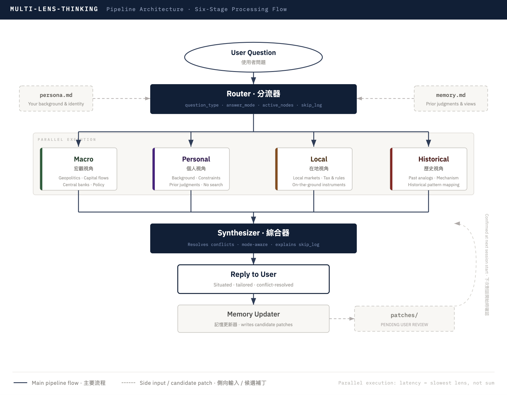

+++
date = '2026-06-06T00:00:00+00:00'
title = 'Multi-Lens Thinking: A Skill That Allows AI to Think From Your Perspective'
tags = ['AI Practice Journal', 'Using AI', 'App', 'Side_Project', '中文']
thumbnail = 'pic.png'
+++

**GitHub**: [lch99310/multi-lens-thinking](https://github.com/lch99310/multi-lens-thinking)

---
## When One Prompt Is Never Enough: Why I Built multi-lens-thinking
## 一個 Prompt 永遠不夠：為什麼我開發了這個多維視角分析框架

There is a version of AI assistance that feels impressive the first time and hollow the tenth. You ask about gold markets, geopolitical risk, or whether a career move makes sense — and the model returns a polished, confident, and completely generic answer. One calibrated for the median reader. The problem is that the median reader is not you.

有一種 AI 輔助工具第一次用覺得驚豔，用到第十次覺得空洞。你問黃金市場、地緣風險、或是一個職涯決定是否值得——模型回傳一個表達流暢、態度自信、但完全通用的答案。那個答案是為「中位數讀者」校準的。問題在於，中位數讀者不是你。

## The Problem That Made Me Build This // 讓我動手開發的那個問題

I kept running into the same wall. I would ask Claude about a specific investment theme — gold, say — and get back a competent survey of macroeconomic forces and central bank dynamics. All accurate. None of it was for me. It didn't know I was based in Sydney, that my returns are AUD-denominated, that the relevant instruments for me are ASX-listed miners, not London spot. It didn't know how I had thought about similar situations before, or which parts of its answer I already knew and which I needed to hear.

我一再碰到同一面牆。我問 Claude 一個具體的投資主題——比如黃金——得到的是一份關於宏觀力量與央行動態的工整概覽。內容都正確。但沒有一句是為我說的。它不知道我住在雪梨、報酬以澳元計價、對我而言最相關的工具是 ASX 上市礦商而非倫敦現貨。它不知道我過去對類似情境如何思考，也不知道哪些部分我早已了解、哪些才是我真正需要聽到的。

The naive fix is to stuff more context into the prompt. "I'm a Sydney-based investor, paid in AUD, 5-year horizon, here's what I already know..." But this introduces a second, subtler failure: **context bleeding**. Ask a single prompt to simultaneously run macroeconomic analysis, historical analogies, and local market dynamics while holding all your personal constraints — and the contexts bleed into each other. The macro section starts mentioning AUD when it should be thinking in USD. The historical analogy drifts toward your risk tolerance instead of staying disciplined on the mechanism. The answer feels personalized but is actually a compromise of every frame at once.

直覺上的解法是把更多 context 塞進 prompt。「我是雪梨的投資者、澳元計薪、五年期限，以下是我已知的……」但這帶來了第二個、更隱性的問題：**context 污染**。要求單一 prompt 同時進行宏觀分析、歷史類比、在地市場動態，又要記住你所有的個人限制——各個框架就會互相滲透。宏觀分析段落在該以 USD 思考的地方開始提到 AUD；歷史類比因為你的個人風險偏好而偏移，無法嚴格聚焦在機制本身。答案看起來個人化，但實際上是所有框架同時妥協的產物。

The root cause is not model capability — it is architecture. A single prompt asks the model to be all things at once. The fix is isolation: run each analytical dimension as its own sub-agent, in its own context, then synthesize. So I built **`multi-lens-thinking`** — an open-source Skill that does exactly that.

問題的根源不在模型能力，而在架構。單一 prompt 要求模型同時扮演所有角色。解法是隔離：讓每個分析維度在自己的 sub-agent 裡、自己的 context 中獨立運行，再由綜合器統一輸出。所以我開發了 **`multi-lens-thinking`**——一個做到這件事的開源 Skill。

→ Find it on **GitHub**: [lch99310/multi-lens-thinking](https://github.com/lch99310/multi-lens-thinking)

## The Architecture: Six Stages, Four Lenses // 架構：六個階段，四個視角

The pipeline has six stages: **Router (分流器)** → four parallel Lens nodes → **Synthesizer (綜合器)** → Memory Updater. Each stage has a defined scope and cannot leak into the others.

Pipeline 共有六個階段：**分流器** → 四個平行視角節點 → **綜合器** → 記憶更新器。每個階段都有明確的職責範圍，彼此不干擾。

<!-- Embed pipeline-flowchart.html here -->

The **Router** reads your `persona.md` and `memory.md` once and makes two decisions: which lenses are worth activating for this specific question, and what `answer_mode` to emit — `analytical`, `personal_decision`, `framework`, or `meta`. This distinction matters more than it might seem. The failure mode I call the **writer trap** is when an analyst asks "analyze gold" and the model, having read their profession in the prompt, returns a writing brief instead of analysis. The `answer_mode` is determined by the question verb, not your identity — and the Synthesizer respects it downstream. The Router also skips lenses aggressively: most questions don't need all four, and running unnecessary lenses is pure latency with no upside.

**分流器**讀取你的 `persona.md` 與 `memory.md` 一次，做出兩個決定：哪些視角對這個問題有幫助，以及要輸出哪種回答模式——`analytical`（分析型）、`personal_decision`（個人決策型）、`framework`（框架型）或 `meta`（元問題型）。這個區分比表面看起來更重要。我稱之為**「寫作陷阱」**的失效模式是：分析師問「分析黃金走勢」，但模型因為讀到 prompt 裡的職業背景，回傳的是一份寫作簡報而非分析本身。`answer_mode` 由問題的動詞決定，而非你的身份——綜合器在下游會嚴格遵守這個模式。分流器也會積極跳過不必要的視角：多數問題不需要全部四個，啟動不必要的視角只是純粹的延遲，毫無收益。

The **four lenses** run in parallel — latency equals the slowest lens, not the sum:

**四個視角**平行運行——延遲等於最慢的視角，而非所有視角時間的總和：

- **Macro 宏觀視角**: Geopolitics, capital flows, central bank behavior, monetary regime. Web search enabled. This is where structural forces that operate above any individual live.
- **Personal 個人視角**: Your background, constraints, and prior judgments stored in `memory.md`. No search — this lens reads you, not the world.
- **Local 在地視角**: On-the-ground reality in your geography — prices, regulations, available instruments, tax treatment. Vertical or web search.
- **Historical 歷史視角**: The analog from the past that best explains the present *mechanism*, not just surface similarity. Search plus LLM reasoning.

The **Synthesizer** receives all four outputs, the Router's `answer_mode`, and the skip log. It resolves conflicts between lenses explicitly — where Macro and Historical disagree, it says so and explains its weighting — and outputs a single answer shaped by who you are and where you are.

**綜合器**接收四個視角的輸出、分流器的回答模式，以及跳過日誌。它明確處理視角之間的分歧——當宏觀與歷史意見不同，它會說明原因並解釋加權邏輯——最終輸出一個由你的身份與所在處境所塑造的答案。

## Worked Example: Gold 2026–2029 // 實戰案例：2026-2029 黃金走勢

The best way to see what this changes is to watch it on a real question. Asked in May 2026:

最好的方式是在真實問題上看到它改變了什麼。問題提出於 2026 年 5 月：

> "基於當下的地緣風險與宏觀經濟，分析未來三年黃金最有可能的走勢。要基於事實信息與數據的推導與分析。"

The Router emits `analytical` mode. All four lenses fire. Each ran independently and reported back:

分流器輸出 `analytical` 模式，四個視角全部啟動，各自獨立運行後回報：

| Lens | Core Finding |
|---|---|
| **Macro 宏觀** | Three independent data chains align: non-price-sensitive central bank buying (WGC Q1 2026 net 244t; full-year est. 750–850t, 2–3× the 2010s average); unsustainable US fiscal trajectory (CBO FY26 deficit $1.9T / 5.8% GDP, interest costs doubling to $2.1T — a path only digestible through negative real rates); BRICS Unit settlement layer going 40% gold-backed, with Russian-Chinese bilateral trade 90% in local currency. Base case: USD 5,500–7,000/oz, CAGR 12–18%. |
| **Personal 個人** | Analytical mode — voice calibration only. Register: formal-analytical, mechanism over narrative. Zero impact on conclusions. |
| **Local 在地 (Sydney)** | AUD/USD 0.69–0.73 (RBA 4.35% hawkish hold) compresses AUD-denominated gold returns by 20–30% vs USD. Perth Mint February sales +131% MoM, yet mainstream industry super funds hold near-zero gold — SMSF via PMGOLD is the main channel. Cleanest ASX leverage: **EVN** (first net-cash position at A$69m, AISC A$1,640–1,760/oz) > **NST** (FY26 production cut to 1.5Moz + Elliott activist pressure introducing M&A uncertainty). |
| **Historical 歷史** | Strongest analog: **1971–1980** (Bretton Woods collapse), not the 2001–2011 QE cycle. The 2022 Russian reserve freeze = the 21st-century Nixon shock — reserve assets politically repriced overnight. Implication: structural uptrend with at least one **25–35% mid-cycle drawdown** (cf. 1974–76: −40%). Critical difference from 1980: the Volcker rate-shock kill switch is not available — today's sovereign buyers are not price-sensitive. |

**Synthesizer output // 綜合器最終輸出：**

> **Base case**: structural bull market through 2029, USD target **5,500–7,000/oz** (CAGR 12–18%). Path is non-monotonic — Historical calibrates Macro's optimism: expect at least one 25–35% mid-cycle drawdown. Each correction is the accumulation window, not a trend reversal.
>
> For Sydney investors: AUD/USD at 0.69–0.73 eats 20–30% of the USD return. Cleanest ASX leverage is **EVN** over **NST** given Elliott's mounting governance pressure. Perth Mint data confirms retail demand is already activating; mainstream super's near-zero gold exposure is the latent second-wave catalyst.
>
> **Three signals that confirm — or break — this thesis:**
> 1. PBOC holdings jump to 5,000+ tonnes → de-dollarization acceleration confirmed
> 2. Western ETF positioning returns to 2020 highs → second-wave private demand ignites
> 3. 30-year TIPS yield breaks 2.5% while gold still prints new highs → gold–real yield decoupling permanent
>
> **I would be wrong if:** Fed forced into YCC + orderly USD devaluation + geopolitical de-escalation (Taiwan + Middle East cooling + BRICS fracturing) → central bank buying pace slows 30–40%, and the move compresses back to a cyclical bounce. Or if inflation stabilises at 2–3% with persistently positive real rates, the path flattens and the target range compresses to 4,500–5,500.

> **基準情境**：結構性多頭延伸至 2029 年，USD 目標區間 **5,500-7,000/oz**（年化 12-18%）。但路徑非單調——歷史視角校準了宏觀視角的樂觀：預期中段至少一次 25-35% 回檔，這是加碼窗口，而非趨勢反轉訊號。
>
> 對雪梨投資者：AUD/USD 0.69-0.73 吃掉 20-30% 的 USD 漲幅。ASX 首選 **EVN**（首次淨現金，AISC 成本優勢），而非治理風險持續上升的 **NST**。Perth Mint 數據確認零售需求已啟動；主流 super fund 幾乎零黃金配置，是潛在的第二波需求催化劑。
>
> **三個決定論點成立或崩解的訊號：**
> 1. PBOC 持倉跳升至 5,000+ 噸 → 去美元化加速確認
> 2. 西方 ETF 部位回到 2020 高點 → 第二波私人需求啟動
> 3. 30 年 TIPS 實質殖利率突破 2.5% 同時金價仍創高 → 黃金-實質利率脫鉤永久化
>
> **若我判斷錯誤：** Fed 被迫 YCC + 美元有序貶值 + 地緣緩和（台海/中東降溫 + BRICS 內部分裂）→ 央行買盤節奏放緩 30-40%，行情壓回循環性。或通膨穩定在 2-3% 且實質利率持續為正，路徑趨平、目標區間下修至 4,500-5,500。

This is the gap between a generic survey and a situated analysis. The Macro lens alone gives you the structural thesis. Without Local, you benchmark returns in USD while your portfolio bleeds in AUD. Without Historical, you treat every 20% correction as a buy signal rather than understanding that the 1974–76 template implies corrections can run deeper and last longer than the QE era conditioned us to expect. Without the Synthesizer explicitly resolving the tension between Macro's direction and Historical's path warnings, you are left to reconcile two confident but internally inconsistent analyses yourself.

這就是通用概覽與有所在感的分析之間的差距。單靠宏觀視角，你得到結構性論點。少了在地視角，你以 USD 估算報酬，但投資組合實際以 AUD 計價。少了歷史視角，你把每次 20% 回檔都當成買點，而不理解 1974-76 年的模板意味著回檔可以更深、持續更久。少了綜合器明確處理宏觀視角的方向論點與歷史視角的路徑警示之間的張力，你只能自己去協調兩個各自有信心但彼此不完全一致的分析。

## A Memory Loop That Stays Honest // 不會說謊的記憶迴圈

After each session, the Memory Updater writes a candidate patch — a structured set of proposed additions to `memory.md`. You review and approve each item at the start of the next session. Rejected items are logged so the system stops proposing them.

每次對話結束後，記憶更新器會輸出一份候選補丁——一組擬加入 `memory.md` 的結構化條目。你在下次對話開始時逐條審閱確認，被拒絕的條目會被記錄，系統不再重複提議。

This design is deliberately slow. I could have built auto-updating memory, but that drifts — a few weeks of AI sessions can quietly poison what the model thinks it knows about you. The patch-and-confirm loop keeps you in control of what the system learns, without requiring you to manually maintain a context file after every conversation. Your `persona.md` and `memory.md` stay on your machine — the public repo ships only the pipeline logic.

這個設計刻意慢。我本可以做成自動更新的記憶，但那樣會漂移——幾週的 AI 對話，可能讓系統對你的認知悄悄走偏。補丁確認機制讓你掌控系統學習的邊界，同時不需要在每次對話結束後手動維護背景檔案。你的 `persona.md` 與 `memory.md` 保留在本機——公開 repo 只有 Pipeline 邏輯本身。

## Give It Your Hardest Question // 把你最難回答的問題丟給它

"Should I buy gold?" has a thousand correct answers depending on who is asking. A US pension fund manager, a Sydney SMSF investor, a Taiwan entrepreneur with USD exposure, and a London macro hedge fund analyst each deserve a genuinely different response — not the same synthesis rephrased four times. `multi-lens-thinking` is not a more comprehensive AI. It is a more **situated** one: a pipeline that knows which questions to ask of the world, which to ask of your past judgments, and how to reconcile them into an answer that is actually yours.

「我該買黃金嗎？」有上千個正確答案，取決於提問者是誰。美國退休基金經理、雪梨 SMSF 投資者、有美元曝險的台灣創業者、倫敦宏觀對沖基金分析師——每個人值得得到的是真正不同的回答，而不是同一份分析改寫四次。`multi-lens-thinking` 不是更全面的 AI，而是更有**所在感**的 AI：一條知道該向世界問什麼問題、該向你的過往判斷問什麼問題、以及如何將兩者調和成真正屬於你的答案的 Pipeline。

The Skill is open source and designed to be forked. If the four built-in lenses don't match your domain, add one. If the Router's skip logic is too aggressive or too permissive for your question type, tune it. If the Synthesizer's voice doesn't match how you think, rewrite the prompt. The architecture is the starting point.

這個 Skill 是開源的，歡迎 fork。如果四個內建視角不符合你的領域，新增一個。如果分流器的跳過邏輯對你的問題類型太積極或太保守，調整它。如果綜合器的語氣不符合你的思考方式，重寫那個 prompt。架構是起點。

The question is not whether AI can help you think. It can. The question is whether the answer it gives was actually designed for you — or for everyone.

問題不在於 AI 能不能幫你思考，它可以。問題在於它給你的答案，究竟是為你設計的——還是為所有人設計的。

---
*© Chung-Hao Lee. All Rights Reserved.
All content on this webpage—including but not limited to text, images, design, code, and multimedia materials—is protected under the international copyright treaties. Unauthorized reproduction, modification, distribution, public transmission, or commercial use is strictly prohibited. Legal action will be taken against infringement.*  
*© 李崇豪。保留所有權利。
本網頁之內容（包括但不限於文字、圖片、設計、程式碼及多媒體素材）均受國際著作權條約保護。未經書面授權，嚴禁任何形式之複製、改作、散布、公開傳輸或商業利用。侵權者將依法追訴。*
