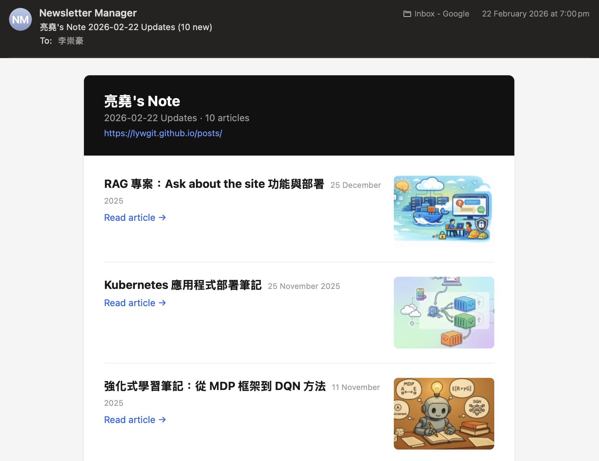

+++
date = '2026-02-21T00:00:00+08:00'
title = '【AI Side Project Vol.03】Develop web app of "Newsletter Manager"'
tags = ['AI Practice Journal', 'Using AI', 'App', 'Side_Project']
+++

### 【From Defining Pain Points to Product Launch: How I Leveraged AI for Automated Development in an Unfamiliar Domain】
### 【從定義痛點到產品落地：我如何利用 AI 在陌生領域完成自動化開發】

In this age of information overload, we often stumble upon high-quality independent blogs or technical columns that lack a "Subscribe" feature. To avoid missing deep-dive content, I used to check these sites manually—a process that was both inefficient and prone to oversight. 
在資訊爆炸的時代，我們常會遇到高品質的獨立部落格或技術專欄，卻發現它們缺乏「訂閱」功能。為了不漏掉深度內容，過去我只能手動檢查網頁，既低效又容易遺漏。

"Since there is no subscribe button, I’ll build one for myself." 
「既然沒有訂閱按鈕，我就為自己做一個。」

This was the inspiration behind **Newsletter Manager**—an automated tool powered by GitHub Actions that transforms any website into scheduled email updates. 
這是我開發 **Newsletter Manager** 的初衷。這是一個基於 GitHub Actions 的自動化工具，能將任何網站轉化為定時 Email 推送。

For me, the core value of this project lies not in the code itself, but in **how to leverage AI as a force multiplier to solve real-world problems by crossing technical boundaries:** 
這份專案對我而言，最核心的價值不在於程式碼本身，而是**「如何透過 AI 槓桿，跨越技術邊界解決實際問題」**：

🚀 **1. Agile Iteration and Problem Definition**
Early in development, I wasn't fully versed in email protocols or backend automation logic. I treated AI as my "Senior Architect." By providing clear requirement definitions (Domain Knowledge), I moved from the core scraping logic of V1 to the automated scheduling of V2, continuously providing feedback and refining the solution through high-frequency iterations with AI. 
🚀 **1. 敏捷迭代與問題定義**
在開發初期，我對 Email 協議與後端自動化邏輯並不全然熟悉。我將 AI 視為「資深架構師」，透過明確的需求定義（Domain Knowledge），從 V1 的核心抓取邏輯，到 V2 的自動化排程，我不斷針對痛點提出反饋與修正，與 AI 進行高頻的快速迭代。

🛠️ **2. Lean Architecture Mindset**
To achieve "zero-cost maintenance," I adopted a serverless mindset. By utilizing **GitHub Actions** as the execution environment combined with the **Resend API** and JSON data structures, I created an automated closed-loop system that requires no external servers or databases. 
🛠️ **2. 輕量化的架構思維**
為了實現「零成本維護」，我選擇了 Serverless 的思維，利用 **GitHub Actions** 作為執行環境，結合 **Resend API** 與 JSON 資料結構，實現了無需伺服器、無需資料庫的自動化閉環。

💡 **3. Persistence and a Proactive "Get-it-Done" Attitude**
I firmly believe that technical boundaries should never hinder action. In the modern workplace, the most critical skill isn't "what you already know," but the speed at which you "learn and solve problems" when facing the unknown. This side project proves my ability to define requirements from scratch and proactively find the right tools (like AI) to turn an idea into a functional product. 
💡 **3. 解決問題的執著與實幹態度**
我深信：「技術邊界不應成為行動的阻礙。」 現代職場中，最關鍵的能力不再是「已知多少」，而是面對未知時，「學習並解決問題」的速度。這份 Side Project 證明了我能從零開始定義需求，並主動尋找工具（如 AI）將想法轉化為可執行的產品。

**Project Achievements:**
✅ Automated monitoring of website updates
✅ Integrated scheduled tasks via GitHub Actions
✅ Seamless integration of frontend and backend management interfaces (GitHub Pages) 
**專案成果：**
✅ 自動化監控網站更新
✅ 整合 GitHub Actions 定時執行任務
✅ 前後端管理介面整合（GitHub Pages）

As a result-oriented practitioner, I am passionate about breaking down complex problems and bringing them to life through innovative tools. If you're interested in AI-collaborative development or workflow automation, let’s connect and exchange ideas! 
身為一個「結果導向」的實踐者，我熱衷於將複雜問題拆解並透過創新工具落地。如果你也對 AI 協作開發或生產力自動化感興趣，歡迎留言交流！

#AICollaboration #GitHubActions #ProductLanding #SideProject #ProblemSolving #ActionOriented #AutomationWorkflow #LearningByDoing

---
*© Chung-Hao Lee. All Rights Reserved.
All content on this webpage—including but not limited to text, images, design, code, and multimedia materials—is protected under the international copyright treaties. Unauthorized reproduction, modification, distribution, public transmission, or commercial use is strictly prohibited. Legal action will be taken against infringement.*  
*© 李崇豪。保留所有權利。
本網頁之內容（包括但不限於文字、圖片、設計、程式碼及多媒體素材）均受國際著作權條約保護。未經書面授權，嚴禁任何形式之複製、改作、散布、公開傳輸或商業利用。侵權者將依法追訴。*
