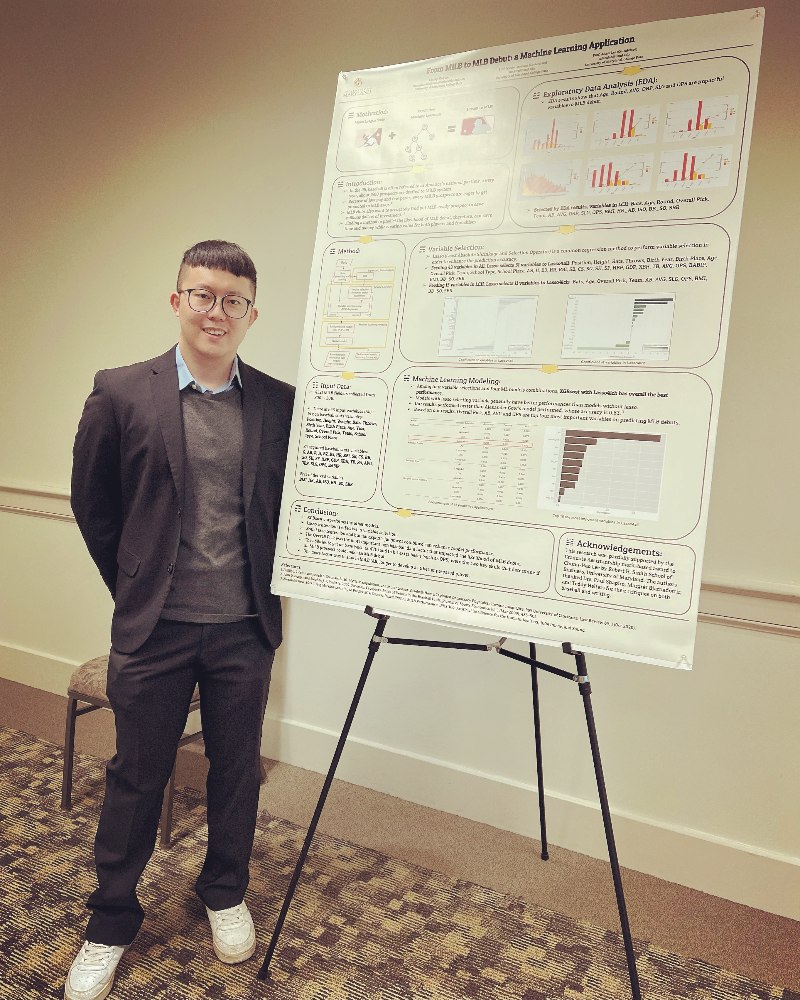
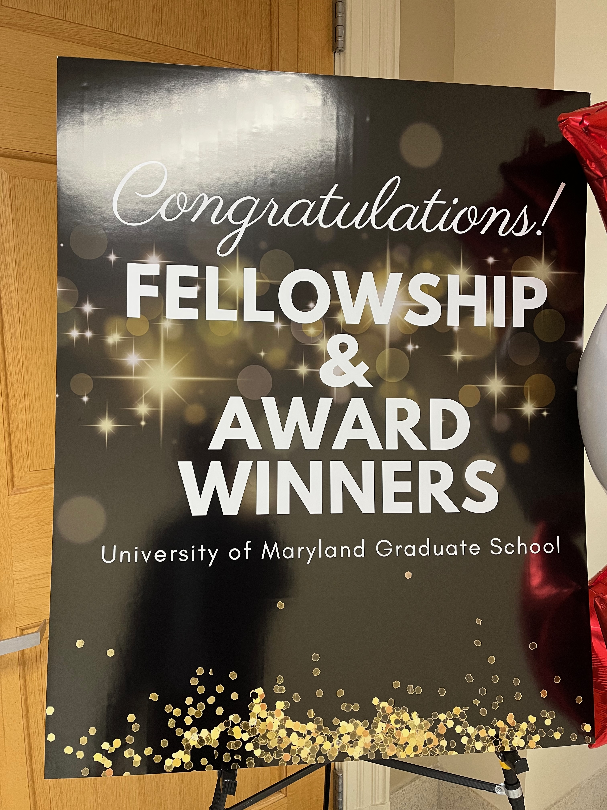
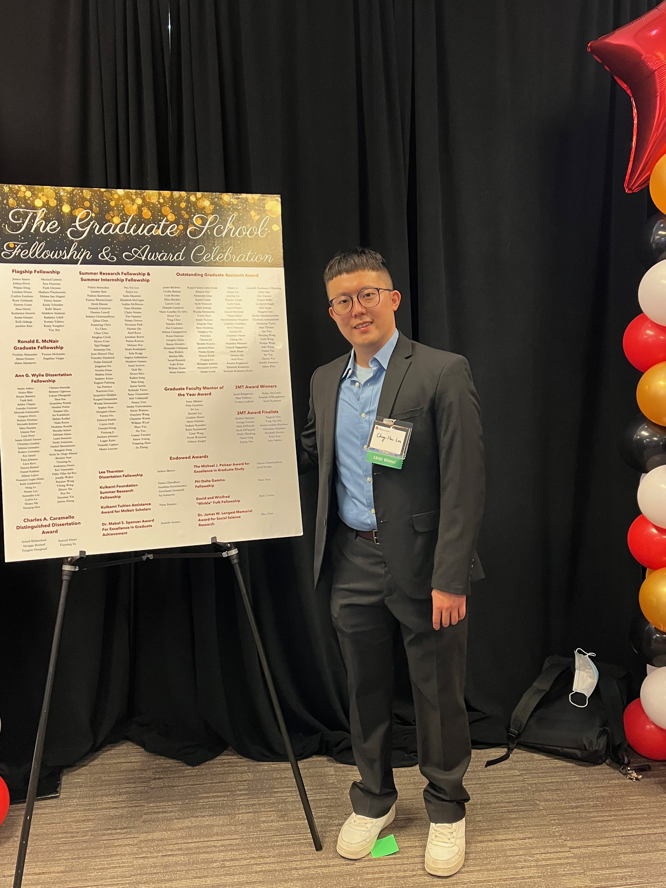
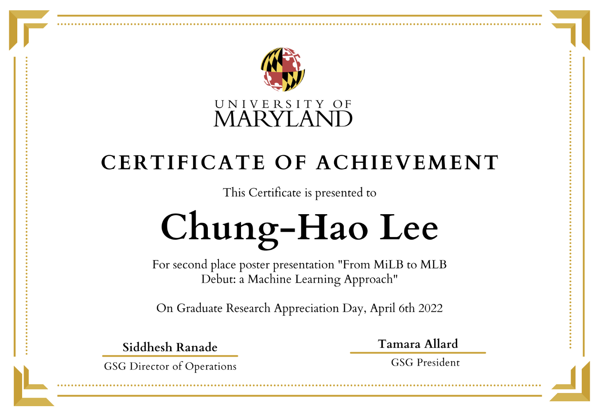

+++
date = '2022-05-11T00:00:00+08:00'
title = '2nd Place in UMD GRAD 2022'
+++

**Honored to share my research in UMD GRAD 2022 and recognized as 2nd place**

Graduate Research Appreciation Day (GRAD) provides an on-campus conference venue in which graduate students from all academic backgrounds can share their research or work, obtain valuable faculty and peer feedback, and hone their communication skills within the comfort of their own campus environment.

---
*Originally published on LinkedIn; republished here.*  
*文章原發表於 linkedin，後轉移至此*
