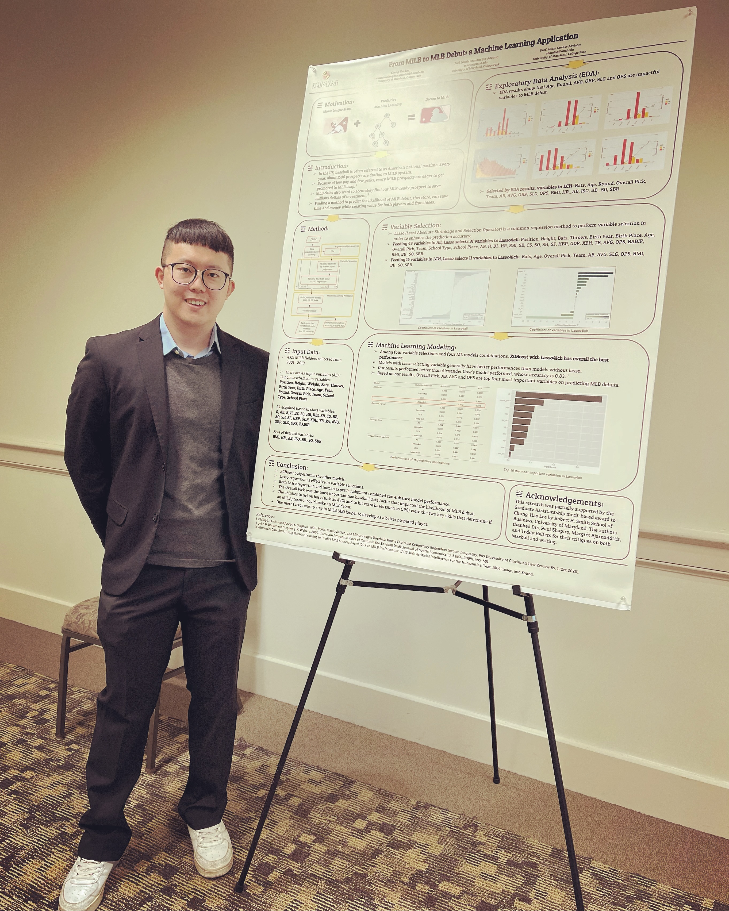
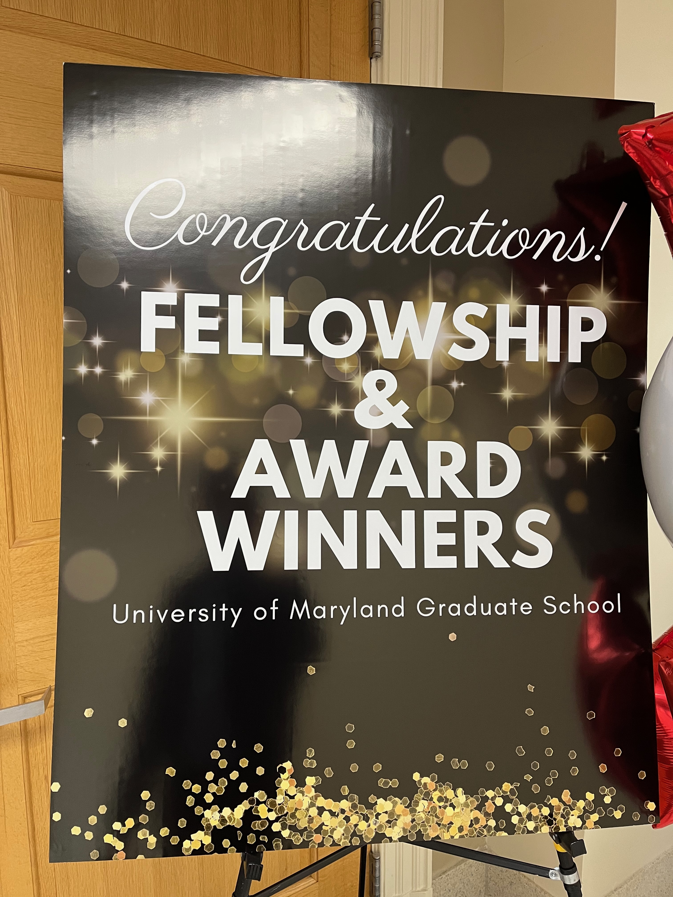
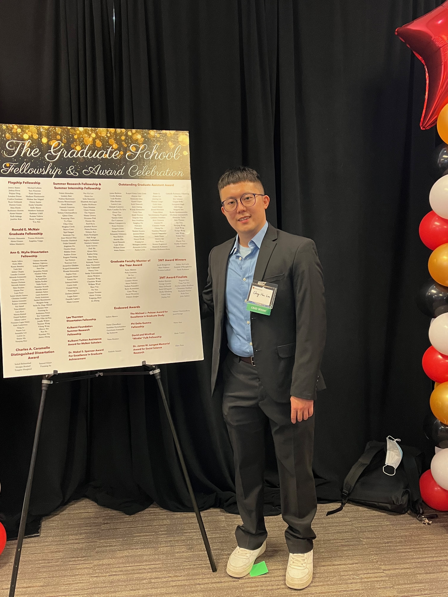
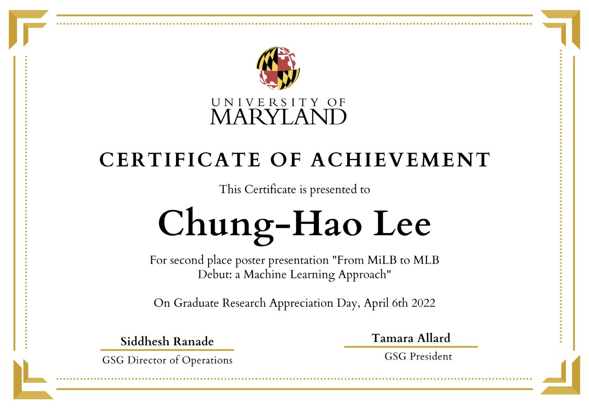

+++
date = '2022-05-11T00:00:00+08:00'
title = '2nd Place in UMD GRAD 2022'
tags = ['Sharing', 'Achievements']
thumbnail = 'pic1.jpeg'
+++

**Honored to share my research in UMD GRAD 2022 and recognized as 2nd place**

Graduate Research Appreciation Day (GRAD) provides an on-campus conference venue in which graduate students from all academic backgrounds can share their research or work, obtain valuable faculty and peer feedback, and hone their communication skills within the comfort of their own campus environment.

---
© Chung-Hao Lee. All Rights Reserved. All content on this webpage—including but not limited to text, images, design, code, and multimedia materials—is protected under the international copyright treaties. Unauthorized reproduction, modification, distribution, public transmission, or commercial use is strictly prohibited. Legal action will be taken against infringement.  
© 李崇豪。保留所有權利。 本網頁之內容（包括但不限於文字、圖片、設計、程式碼及多媒體素材）均受國際著作權條約保護。未經書面授權，嚴禁任何形式之複製、改作、散布、公開傳輸或商業利用。侵權者將依法追訴。
