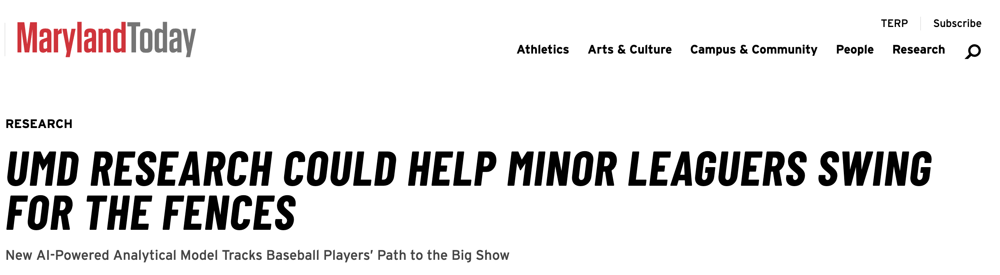

+++
date = '2023-09-21T00:00:00+08:00'
title = 'UMD Research Could Help Minor Leaguers Swing for the Fences'
+++

## Media Coverage

**Honored to be featured in [Maryland Today](https://today.umd.edu/) for our research work!**

  <a href="https://today.umd.edu/umd-research-could-help-minor-leaguers-swing-for-the-fences" target="_blank" rel="noopener">
    

      

        
      

      

        <h3>UMD Research Could Help Minor Leaguers Swing for the Fences</h3>
        
New AI-Powered Analytical Model Tracks Baseball Players' Path to the Big Show. Using machine learning to analyze baseball performance data, helping minor league players identify skills that need improvement to increase their chances of reaching the majors. Research found that batting average is more decisive than on-base percentage for player call-ups.

        today.umd.edu • September 21, 2023
      

    

  </a>

---
*Originally published on LinkedIn; republished here.*  
*文章原發表於 linkedin，後轉移至此*
