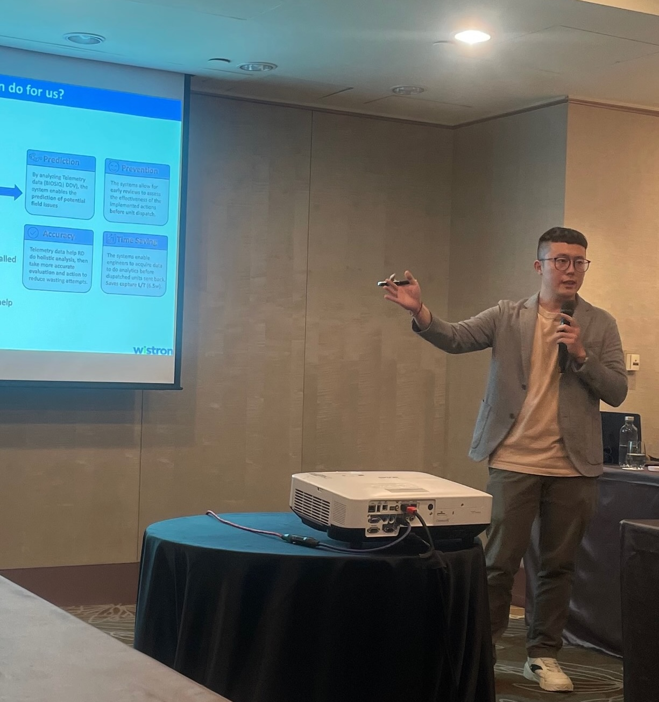
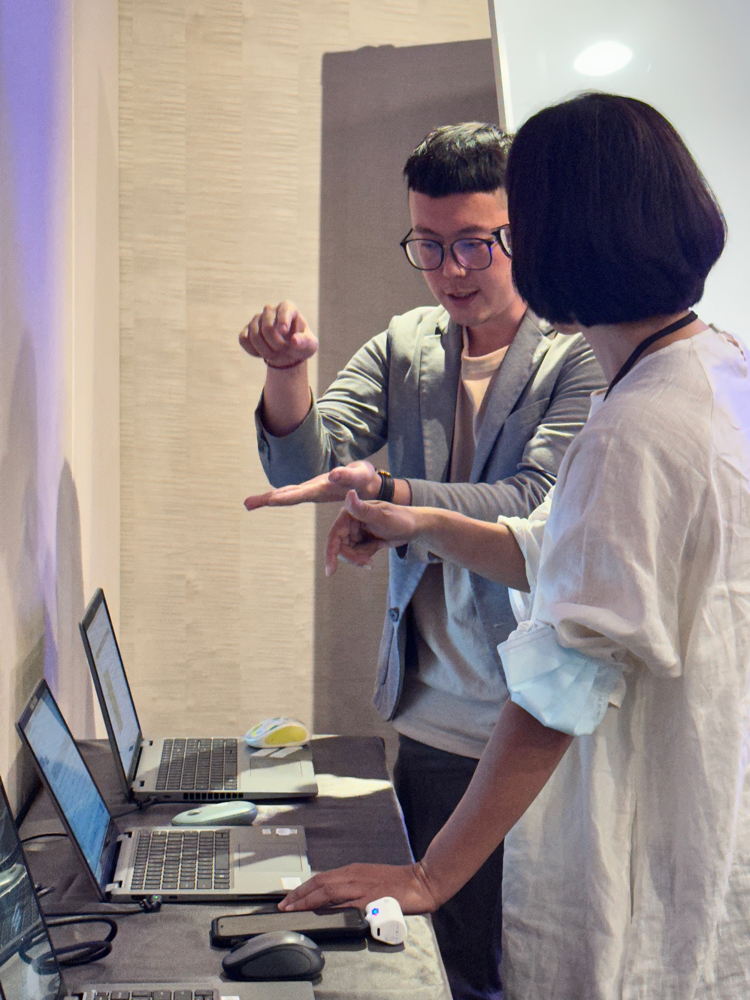

+++
date = '2023-10-24T00:00:00+08:00'
title = 'First time to co-host a workshop'
+++

This is my first time co-hosting a workshop. I presented a demo of our product to participants and led a collaborative discussion on strategies for resolving challenging engineering issues in notebooks.

---
*Originally published on LinkedIn; republished here.*  
*文章原發表於 linkedin，後轉移至此*
