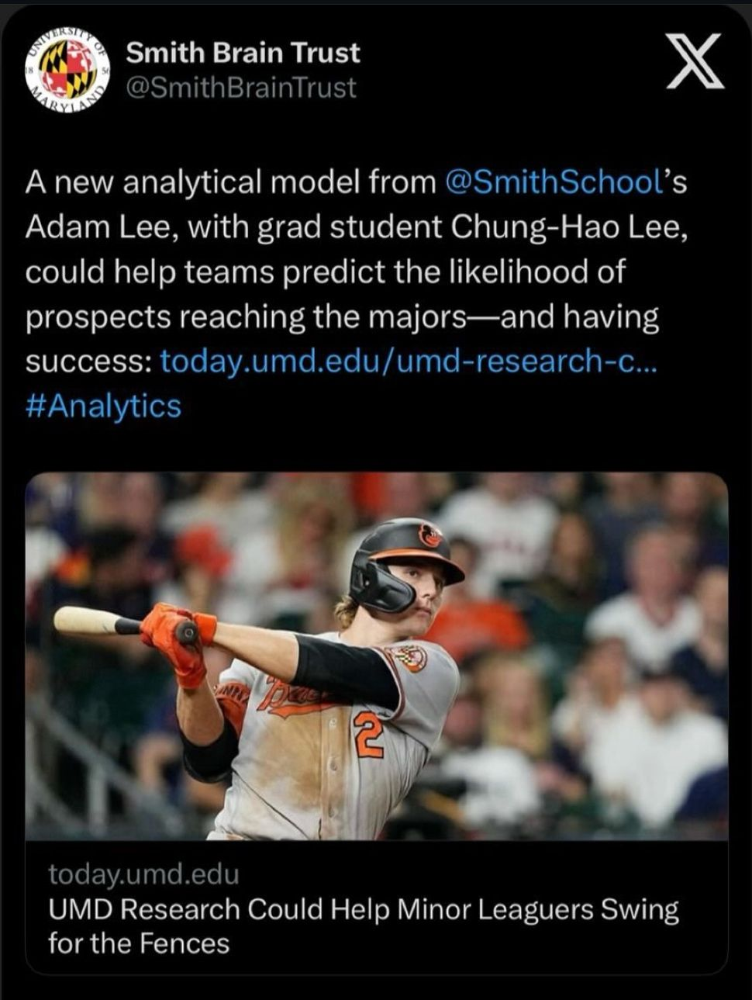

+++
date = '2025-08-15T00:00:00+08:00'
title = 'Beyond the Numbers: AI’s Real Power Lies in Solving Problems, Not Just Dazzling with Tech🚀'
+++

### AI’s purpose isn’t to impress with flashy technology—it’s to solve real business problems 🎯
In today’s AI-driven landscape, I’ve learned that the most impactful implementations aren’t always the most sophisticated ones. The key lies in understanding genuine business pain points and selecting the most appropriate solution, rather than chasing the latest trends that may look impressive but fail to deliver results.

### A Real Example: 
I learned this firsthand during my research at the University of Maryland, where I worked on a project to predict the likelihood of minor league baseball players making it to the MLB. Instead of a complex deep learning model, I used XGBoost. Why? Because it was the right tool for the job. It was efficient, effective, and provided the clarity I needed.

The validation of my approach came through tangible results: publication in Springer’s Analytics Enabled Decision Making and coverage by Maryland Today, the University of Maryland’s official media, demonstrating that solving real problems garners genuine recognition.

### Here’s how I approach AI work in practice:
 1. **Problem first → tool second**
Define the business outcome (revenue, time-to-value, risk reduction). Only then pick the method that best and most efficiently achieves that outcome.
 2. **Fit-for-purpose modeling**
Sometimes a well-tuned XGBoost or classical model beats a large deep network because it’s faster to train, easier to explain, and produces better performance on the true objective. Don’t confuse novelty with value.
 3. **Measure real impact, not model glamour**
Validate against business KPIs, production constraints, and operational readiness — not just flashy demo metrics.

### The Strategic Takeaway: 
When implementing AI solutions, resist the temptation to deploy the most cutting-edge technology simply because it exists. Instead, focus on understanding the specific business challenge, evaluating available approaches objectively, and selecting the method that delivers the most reliable and actionable results.

"Traditional approaches may overlook these nuances, but those who blend domain expertise with targeted AI will lead the game."

---
*Originally published on LinkedIn; republished here.*  
*文章原發表於 linkedin，後轉移至此*

