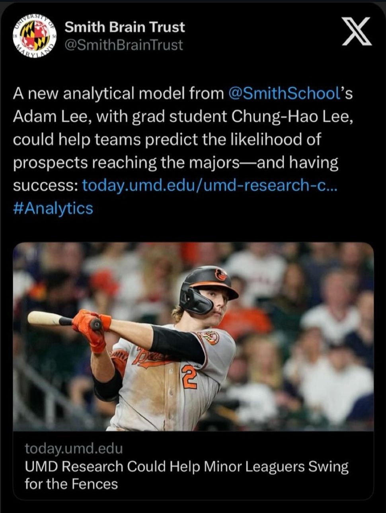

+++
date = '2025-08-15T00:00:00+08:00'
title = 'Beyond the Numbers: AI’s Real Power Lies in Solving Problems, Not Just Dazzling with Tech🚀'
tags = ['Beyond the___', 'using AI', '中文']
thumbnail = 'pic.png'
+++

### AI’s purpose isn’t to impress with flashy technology—it’s to solve real business problems 🎯  
In today’s AI-driven landscape, I’ve learned that the most impactful implementations aren’t always the most sophisticated ones. The key lies in understanding genuine business pain points and selecting the most appropriate solution, rather than chasing the latest trends that may look impressive but fail to deliver results.

### AI 的價值不在炫技，而在解決真實的商業問題 🎯  
在當今由 AI 驅動的環境中，我體會到：最具影響力的 AI 實踐，往往並非技術最複雜的那一種。關鍵在於深入理解真實的業務痛點，並選擇最恰當的解決方案，而非盲目追逐看似亮眼卻難以落地的技術潮流。

### A Real Example:  
I learned this firsthand during my research at the University of Maryland, where I worked on a project to predict the likelihood of minor league baseball players making it to the MLB. Instead of a complex deep learning model, I used XGBoost. Why? Because it was the right tool for the job. It was efficient, effective, and provided the clarity I needed.

The validation of my approach came through tangible results: publication in Springer’s *Analytics Enabled Decision Making* and coverage by *Maryland Today*, the University of Maryland’s official media, demonstrating that solving real problems garners genuine recognition.

### 一個真實案例：  
我在馬里蘭大學進行研究時親身驗證了這一點——當時我負責一個預測小聯盟棒球選手晉升大聯盟（MLB）機率的專案。我沒有選擇複雜的深度學習模型，而是採用 XGBoost。原因很簡單：它才是最適合這項任務的工具——高效、有效，且結果清晰易解。  

這套方法的價值，最終透過具體成果得到驗證：研究成果獲刊登於 Springer 出版的《Analytics Enabled Decision Making》專書，並獲馬里蘭大學官方媒體 *Maryland Today* 報導。這證明：真正解決問題的方案，才會贏得實質的認可。

### Here’s how I approach AI work in practice:  
1. **Problem first → tool second**  
Define the business outcome (revenue, time-to-value, risk reduction). Only then pick the method that best and most efficiently achieves that outcome.  
2. **Fit-for-purpose modeling**  
Sometimes a well-tuned XGBoost or classical model beats a large deep network because it’s faster to train, easier to explain, and produces better performance on the true objective. Don’t confuse novelty with value.  
3. **Measure real impact, not model glamour**  
Validate against business KPIs, production constraints, and operational readiness — not just flashy demo metrics.

### 我在實務中如何應用 AI：  
1. **先釐清問題，再選擇工具**  
先明確定義商業目標（例如提升收入、縮短實現價值的時間、降低風險），再挑選最有效且高效達成目標的方法。  
2. **以任務為導向的建模思維**  
有時，一個調校得當的 XGBoost 或傳統模型，反而比龐大的深度神經網路更勝一籌——因為它訓練更快、解釋性更強，且在真實目標上表現更佳。切勿將「新穎」誤認為「價值」。  
3. **衡量實際影響，而非模型光環**  
驗證標準應是商業 KPI、生產環境限制與營運就緒度，而非僅僅炫目的展示指標。

### The Strategic Takeaway:  
When implementing AI solutions, resist the temptation to deploy the most cutting-edge technology simply because it exists. Instead, focus on understanding the specific business challenge, evaluating available approaches objectively, and selecting the method that delivers the most reliable and actionable results.

### 策略啟示：  
導入 AI 解決方案時，務必克制「只因技術存在就非用不可」的衝動。與其追求技術前沿，不如專注於理解具體的業務挑戰，客觀評估可行方案，並選擇能穩定產出可執行成果的方法。

"Traditional approaches may overlook these nuances, but those who blend domain expertise with targeted AI will lead the game."

「傳統做法常忽略這些細微卻關鍵的差異，唯有將領域專業與精準的 AI 應用相結合的人，才能在競爭中領先群倫。」

---
*Originally published on LinkedIn; republished here.*  
*文章原發表於 linkedin，後轉移至此*

