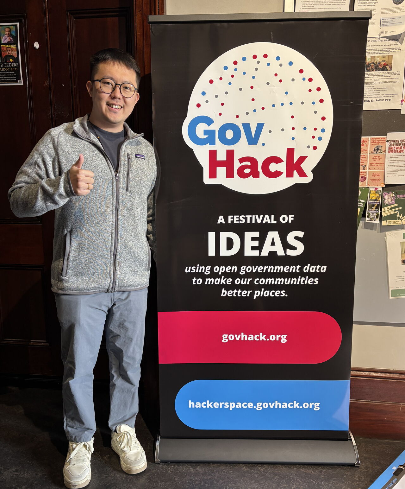

+++
date = '2025-08-30T00:00:00+08:00'
title = 'GovHack2025 participating'
+++

**✨ Honored to take part in #GovHack2025 this weekend. Huge thanks to Vikash Kumar for hosting and guiding the event 🙏**

The atmosphere was fantastic: working side by side with many teams under tight deadlines, brainstorming solutions, and pushing through to solve real challenges was truly inspiring 🚀

Having recently relocated from Taiwan to Sydney 🇦🇺, I’m passionate about using data to analyze problems and drive practical solutions. GovHack offered this great opportunity for me to apply those skills, contribute to the Australian community, and learn from others who share the same curiosity and drive

I chose to tackle the “data center” challenge. As Scott Farquhar recently noted at the National Press Club, Australia has a unique opportunity to become a leader in the data center space, with advantages like abundant resources, a reliable power supply, a skilled workforce, and a strategic location between East Asia and the USA.⚡️🌏 However, a key question remains: how do we select the best locations, and what is the best way to evaluate them? There is currently no clear solution.

It was an honor to work on this challenge, and over two intensive days the analytical work may help advance Australia’s digital infrastructure and support the broader community’s technological needs 💡📊

---
*Originally published on LinkedIn; republished here.*  
*文章原發表於 linkedin，後轉移至此*

