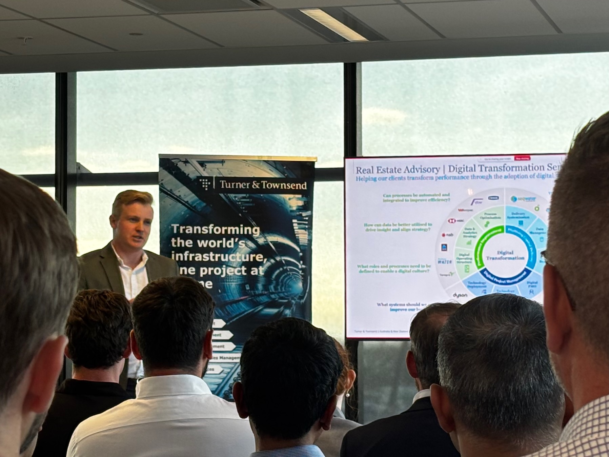

+++
date = '2025-11-01T00:00:00+00:00'
title = 'AI-Human Synergy in Project Delivery: Reflections on Australia’s Construction Industry Networking Event'
tags = ['Sharing', 'Networking']
thumbnail = 'pic1.jpeg'
+++

I’m truly grateful to The Chartered Institute of Building (CIOB) and Turner & Townsend for hosting such an insightful event on "Transforming Project Delivery with AI". It was a fantastic evening of high-level presentations and invaluable networking.

As a professional who has just relocated from Taiwan to Sydney, this was my first industry networking event in Australia, and it was an incredibly welcoming experience. I gained significant insights into the current landscape of AI in the local construction sector and had the pleasure of connecting with many dedicated experts.

A special thanks to George Highfield from Turner & Townsend for his brilliant presentation on two powerful AI applications currently being leveraged:

* **AI Agent "Dream Teams":** I was particularly impressed by the concept of assembling a "dream team" of specialized AI agents. By dedicating different agents to specific tasks—such as cost management or scheduling master—and having them collaborate, efficiency can be dramatically enhanced.

* **RAG for Data-Intensive Roles:** The application of Retrieval-Augmented Generation (RAG) is a true game-changer for professions like Quantity Surveying. Historically, a QS would need to manually sift through countless PDFs and spreadsheets to find specific data points from different quotes or schedules. With RAG, they can now use natural language queries to find accurate information instantly. This frees up professionals to focus their time and energy on high-value analysis and strategic decision-making.

The key takeaway is clear: AI is a powerful tool for augmenting human capability, creating a win-win synergy that drives efficiency and better outcomes.

As a fellow AI professional, I am incredibly excited to be part of Australia's growing AI ecosystem. I am eager to connect, collaborate, and network with more industry leaders here. Let's continue to exchange ideas and build the future of construction together!

#AIinAustralia #Networking #AI #construction

---
*© Chung-Hao Lee. All Rights Reserved.
All content on this webpage—including but not limited to text, images, design, code, and multimedia materials—is protected under the international copyright treaties. Unauthorized reproduction, modification, distribution, public transmission, or commercial use is strictly prohibited. Legal action will be taken against infringement.*  
*© 李崇豪。保留所有權利。
本網頁之內容（包括但不限於文字、圖片、設計、程式碼及多媒體素材）均受國際著作權條約保護。未經書面授權，嚴禁任何形式之複製、改作、散布、公開傳輸或商業利用。侵權者將依法追訴。*
