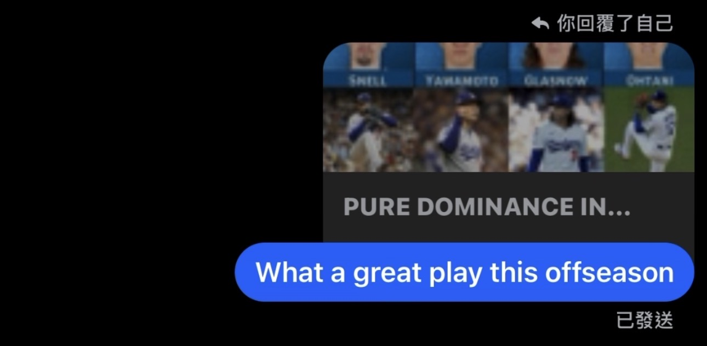

+++
date = '2025-10-19T00:00:00+00:00'
title = "Product Decoder: Messenger 的拆分策略與引用回覆功能解析"
+++

身為一位PM,我總是喜歡以一位使用者角度來看一個產品。這次想來跟著大家一起來看我心中一個很好的產品 — Messenger。

## 一、 Messenger從Facebook App中獨立出來

Messenger 本來是 Facebook 的一個通訊功能,但在 2015 年時被 Facebook 分拆出來,要求用戶單獨下載 App 來做使用。

坦白說,當時我覺得很麻煩,覺得同樣都是 Facebook,為什麼要分兩個 App 做使用 (Facebook: 主要用來瀏覽動態 / Messenger: 主要用來與人溝通)。

但是後來看,會發現這是非常高明的一步。

### 用戶視角

以用戶視角來看,我很大的需求是想要與我的朋友溝通、分享資訊。

如果 Messenger 還是被綁定在 Facebook 內部的話,那我要與我的朋友溝通時,總共要幾步呢?

1. 打開 Facebook app
2. 打開 Messenger
3. 找到我朋友
4. 開始溝通

如果 Messenger 獨立出來成為一個 App,那我要與我的朋友溝通時,總共要幾步呢?

1. 打開 Messenger
2. 找到我朋友
3. 開始溝通

別看只有一步之差,但因為 Facebook 要同時容納動態與 Messenger,在排版佈局上,勢必會很複雜,因為要兼容很多內容。所以在 Facebook App 裡面要找 Messenger 的入口,會比較沒有那麼友好。

### 產品經理視角

也因為沒那麼友好,從 PM 的視角看,如果 Messenger 當初沒跟 Facebook 分拆的話,Messenger 的留存率一定不會像現在那麼好。

不論從用戶視角還是PM視角,Messenger 從 Facebook 分拆都是一件非常高明的一步。

## 二、 引用回覆 (Quoted Replies)

這是我在 Messenger 中最喜歡的功能了,也認為這是有史以來最棒的設計之一。Messenger 的功能就是與人的對話溝通,在對話的過程中,往往雙方可能會有來來回回,或者我想要回覆之前某個時候的內容,這時候就是「引用回覆」這功能最好的使用時機。

在 Messenger 的引用回覆有三點,是我認為很偉大的設計:

### (1) 非常直覺的交互方式

跟別的 App 不同,在 Messenger 使用引用回覆不需要先長按、點出彈窗、再點選引用回覆的功能這麼繁瑣的步驟。只需要在你想要引用的消息,輕輕的按住左滑 or 右滑(取決於這消息是你的還是你朋友的),就可以完成引用回覆,非常的直覺而且省去極度繁瑣的步驟。

### (2) 引用回覆的呈現

在 Messenger 引用回覆的視覺呈現是:會在你的回覆消息上面,呈現一個小的、顏色較淡的窗口,並放上被你引用的消息 (不論這消息是文字還是圖片,甚至是連結都會用縮圖呈現!)。

這麼做的好處是,當使用者要查看時,可以第一時間看到被引用的資訊是什麼,就不用像其他 App 一樣,還需要往上滑才能看到被引用的消息,讓使用者整個的閱讀體驗跟效率提升了一個檔次。

### (3) 點選被引用消息的後續交互

在 Messenger 上,如果使用者想要查看被引用的消息,只需要在被引用消息的小窗口點一下,系統就會自動的往上滾動到被引用消息的原始處。

這方便使用者可以很快看到被引用消息原始處的上下文;或者,如果被引用消息是一個連結,使用者也可以很快回到原始處的連結,並點一下就可以進到連結。這種交互非常的直覺,且讓使用者查看訊息時的效率提升,提高了使用這體驗。

 
也因為上面三種原因,讓我覺得「引用回覆」是一個非常直覺、交互設計優良的功能,大大提升使用者體驗,也是 Messenger 在我看來是一項好產品的主要原因。

---
*© Chung-Hao Lee. All Rights Reserved.
All content on this webpage—including but not limited to text, images, design, code, and multimedia materials—is protected under the international copyright treaties. Unauthorized reproduction, modification, distribution, public transmission, or commercial use is strictly prohibited. Legal action will be taken against infringement.*  
*© 李崇豪。保留所有權利。
本網頁之內容（包括但不限於文字、圖片、設計、程式碼及多媒體素材）均受國際著作權條約保護。未經書面授權，嚴禁任何形式之複製、改作、散布、公開傳輸或商業利用。侵權者將依法追訴。*
