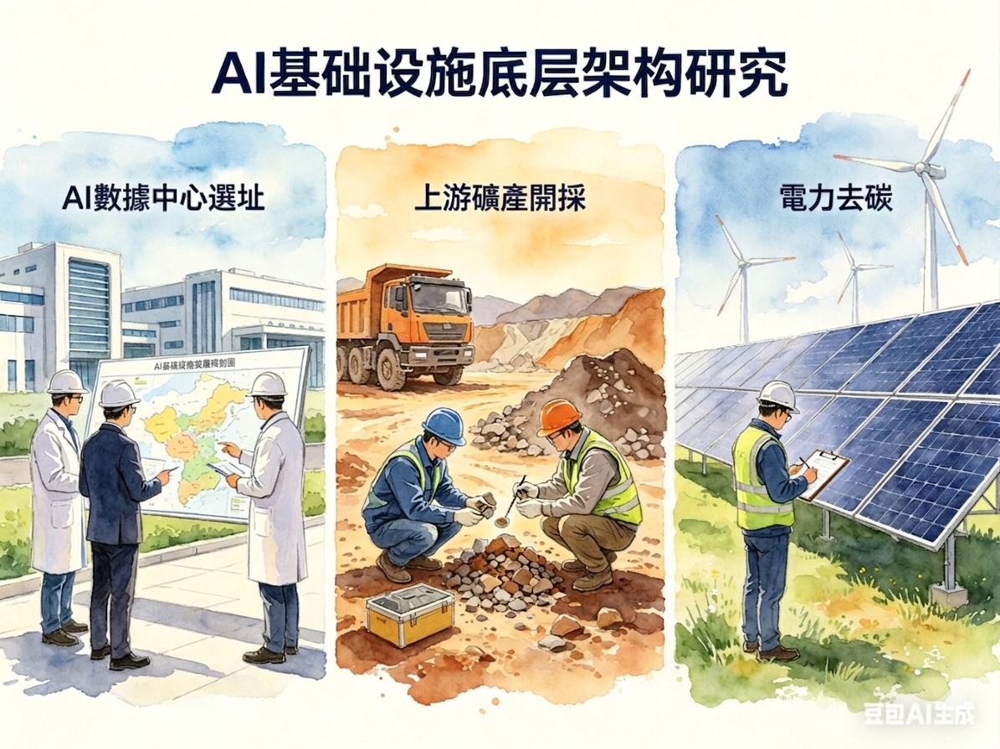

+++
date = '2026-04-07T00:00:00+00:00'
title = "Beyond the Model: The Invisible Moat of AI Infrastructure & Data Center 🏭"
tags = ['Beyond the___', 'Data Center', '中文', 'Passport to AI Era']
thumbnail = 'pic.png'
+++

Product professionals naturally focus on user experience and output. It wasn’t until I began diving into AI infrastructure that I realized a critical oversight: while the market spends immense time comparing model intelligence and product fluidity, few discuss the underlying architecture that makes it all possible.

At Davos 2026, Jensen Huang described [AI as a five-layer cake](https://blogs.nvidia.com/blog/ai-5-layer-cake/): Energy, Chips, Infrastructure, Models, and Applications. He emphasized: "Every successful application pulls on every layer beneath it, all the way down to the power plant that keeps it alive."

While most eyes are fixed on the top three layers, I am increasingly fascinated by the foundation. Over the past year, I have conducted deep-dive research into the bottom three layers of Jensen’s cake—**Siting & Deployment, Supply Chain & Geopolitics, and Energy & Decarbonization**. Viewed together, they point to a singular conclusion: AI’s true moat is quietly forming at the base.

 

做產品的人，習慣將目光聚焦於用戶體驗與產出。直到我開始深入研究 AI 基礎設施才意識到：市場花了大量時間比較模型的聰明程度與產品的流暢度，卻鮮少有人討論讓這一切得以運作的底層架構。

黃仁勳2026年在達沃斯論壇上提出，[AI 是一個五層蛋糕](https://blogs.nvidia.com/blog/ai-5-layer-cake/)：能源、晶片、基礎設施、模型、應用。他強調：「每一個成功的應用，都牽動著它底下的每一層，一路往下，直到那座讓它活著的發電廠。」

多數人的目光停在第三層以上，但我對更基礎的地基更有興趣。過去一年，我針對 Jensen 蛋糕最底部的三層——**選址與部署、供應鏈與地緣、能源與去碳**——進行了深入研究。將這三者結合來看，指向了一個明確的結論：AI 真正的護城河，正悄悄在底層形成。

---

### I. Data Center Siting: Business Logic Behind Technical Decisions

Last year at GovHack 2025, I utilized public data from AEMO, BOM, and ABS to build a five-factor evaluation framework for Australian data center siting: Power Supply Density, Cooling Efficiency, Network Connectivity, Talent Pool, and Land Acquisition.

The most valuable insight from the model was the disconnect between the "ideal" scores and market reality. For instance, while Sydney is not the optimal solution for grid cleanliness, it carries approximately 60% of Australia’s total data center capacity. This outcome is driven by a different set of logic: latency, customer proximity, and the historical legacy of the fibre backbone. This demonstrates that DC siting has no perfect solution; it is a dynamic tug-of-war between grid conditions, commercial viability, and ESG mandates. Only those who master these trade-offs can execute the right configurations at the right nodes.

 

**一、Data Center 選址：技術決策背後的商業權衡**

去年參加 GovHack 2025，我利用 AEMO、BOM、ABS 的公開數據，建構了澳洲資料中心選址的五因子評估框架（電力供應密度、冷卻效率、網路連接性、人才庫、土地取得）。

跑完模型後，最有價值的發現是分數與市場現況的落差。例如，Sydney 在電力潔淨度上並非最佳解，卻承載了全澳洲約 60% 的資料中心容量。決定這個結果的是另一組邏輯：延遲時間、客戶重心、以及光纖骨幹（fibre backbone）的歷史沉澱。這顯示 DC 的選址從來沒有完美解，而是電網條件、商業可行性與 ESG 之間的動態拉鋸。只有最懂這些 trade-off 的人，才能在正確的節點做正確的配置。

---

### II. Upstream Infrastructure: Supply Chain and Geopolitical Risks

Building a data center relies heavily on critical metals: copper (cooling and wiring, ~25% of hardware material costs), aluminum (racks and casings, 15%), silicon (chips and solar panels, 15%), and various rare earth elements.

Earlier this year, I tracked the role of Australian mineral resources within the AI infrastructure supply chain. Australia is the world’s second-largest holder of copper reserves and a global leader in lithium and rare earths, exporting over $410 billion AUD in resources annually—$152 billion of which goes to China. As AI compute demand grows exponentially, the demand for minerals follows. However, copper supply elasticity is extremely low (new mines take 10–15 years to develop), and the geopolitical concentration of rare earths dictates which nations maintain supply chain sovereignty in the AI arms race. Australia’s position between the U.S. and China makes it both an opportunity and a strategic pawn. Understanding these "underwater" factors is essential to grasping the long-term procurement logic and massive localized bets made by hyperscalers.

 

**二、基礎設施上游：供應鏈與地緣風險**

建置一座資料中心，高度依賴關鍵金屬：銅（冷卻與配線，佔硬體材料成本約 25%）、鋁（機架與外殼，15%）、矽（晶片與太陽能板，15%），以及多種稀土元素。

今年早些時候，我做了一個研究：追蹤澳洲礦產資源在 AI 基礎設施供應鏈裡的位置。澳洲是全球第二大銅儲量國，鋰和稀土同樣是世界級供應者，每年資源出口逾 $4,100 億澳幣，其中對中國就有 $1,520 億。當 AI 算力需求以指數成長，礦產的需求曲線跟著走。銅的供應彈性低、建新礦需要 10–15 年。稀土的地緣集中度，決定了哪些國家在 AI 軍備競賽裡有供應鏈自主權。澳洲夾在美中之間的位置，讓它在 AI 供應鏈裡同時是機會和棋子。要了解到這些水面下的因素，才能真正理解 hyperscaler 的長期採購邏輯，也才能看懂為什麼特定時間點特定業者會在特定地點押下大注。

---

### III. Clean Energy: The increasing Challenge for the Next Decade

Electricity represents roughly 60–70% of data center operating expenses. With NSW's 2024 average wholesale electricity price at approximately $130/MWh, a 100MW facility faces annual power costs nearing $100 million AUD. This is not a marginal cost; it is the lifeblood of the business model.

Concurrently, I analyzed the carbon emission structures of the Queensland aluminum industry. In 2024, Rio Tinto’s QLD aluminum chain emissions reached 7.72 Mt CO₂e, leaving a 3.8 Mt gap to meet 2030 reduction targets. While aluminum and data centers seem unrelated, they face identical structural dilemmas: how to decarbonize while maintaining high-intensity baseload power without spiraling costs. The solutions being explored by both industries are nearly identical—long-term PPAs, renewable energy integration solutions. The decarbonization learning curve is cross-industrial; however, this cross-domain perspective remains scarce in the AI field today.

 

**三、清潔能源：DC 未來十年越來越重要的挑戰**

電力佔 DC 營運成本高達 60–70%。以 NSW 2024 年批發電價均值約 $130/MWh 計算，一座 100MW 的設施，每年電費接近一億澳幣。這已不是單純的邊際成本，而是商業模型的命脈。

同期，我分析了昆士蘭鋁業的碳排結構（2024 年 Rio Tinto QLD 鋁業鏈排放量達 7.72 Mt CO₂e，距離 2030 減半目標尚缺 3.8 Mt）。鋁業與 DC 表面上毫無交集，卻面臨完全相同的結構性困境：如何在維持高強度基載（baseload）用電的同時達成去碳，並控制成本。雙方摸索出的解法高度一致——長期 PPA、再生能源整合...等方案。能源去碳的學習曲線是跨產業共通的，而這種跨域視野在目前的 AI 領域仍極為稀缺。

---

### Conclusion: The Depth of the Foundation Dictates the Height of the Tower

While the industry remains fixated on model parameters and end-user experiences, the true strategic pivot is happening at the base. The logic of data center siting, the resilience of critical mineral supply chains, and the path toward decarbonizing high-intensity power—these three factors define the competitive boundary of next-generation AI infrastructure.

Without the support of energy, minerals, and infrastructure, even the most advanced models are merely castles in the air. The moat of AI lies not just in parameter counts, but in a profound understanding of underlying commercial trade-offs, geopolitical landscapes, and energy regulations. The long-term winners in the AI era will be those who can see the technical trends at the top, while mastering the industrial logic at the bottom.

 

**結論：決定高樓高度的，永遠是地基的深度**

當產業目光仍聚焦於模型參數量與終端體驗時，真正的戰略轉折點已在底層悄然發生。資料中心的選址邏輯、關鍵礦產的供應鏈韌性、高強度用電的去碳路徑——這三者共同構成了新一代 AI 基礎設施的競爭邊界。

沒有堅實的能源、礦產與基礎設施支撐，再先進的模型與產品都只是空中樓閣。AI 的護城河不只在參數的高低，更在於對底層商業權衡、地緣格局與能源規則的深度理解。未來能在 AI 時代長期立足的玩家，必然是既能看懂上層技術趨勢，又能吃透底層產業邏輯的人。

---

**Further Reading / 延伸閱讀：**
* [GovHack 2025: A Data-Driven Framework for Data Center Siting](https://lch99310.github.io/chunghao_lee/portfolio/govhack2025---data-center-challenging/)
* [AI Revolution: Australia's Pivotal Role in the Global Mineral Supply Chain](https://lch99310.github.io/chunghao_lee/portfolio/2025-11-23-powering-the-ai-revolution-australias-pivotal-role-in-the-global-mineral-supply-chain/)
* [Queensland Aluminium Industry Emissions: 2024 Status & Decarbonization Roadmap](https://lch99310.github.io/chunghao_lee/portfolio/queensland_aluminum_industry_emissions/)

---
*© Chung-Hao Lee. All Rights Reserved.
All content on this webpage—including but not limited to text, images, design, code, and multimedia materials—is protected under the international copyright treaties. Unauthorized reproduction, modification, distribution, public transmission, or commercial use is strictly prohibited. Legal action will be taken against infringement.*  
*© 李崇豪。保留所有權利。
本網頁之內容（包括但不限於文字、圖片、設計、程式碼及多媒體素材）均受國際著作權條約保護。未經書面授權，嚴禁任何形式之複製、改作、散布、公開傳輸或商業利用。侵權者將依法追訴。*
