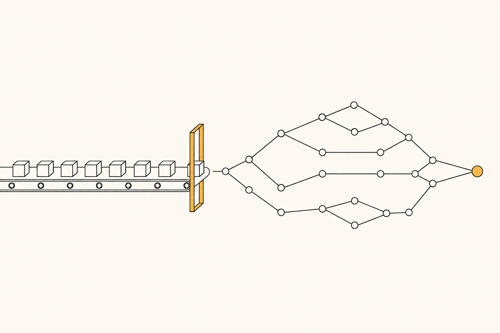
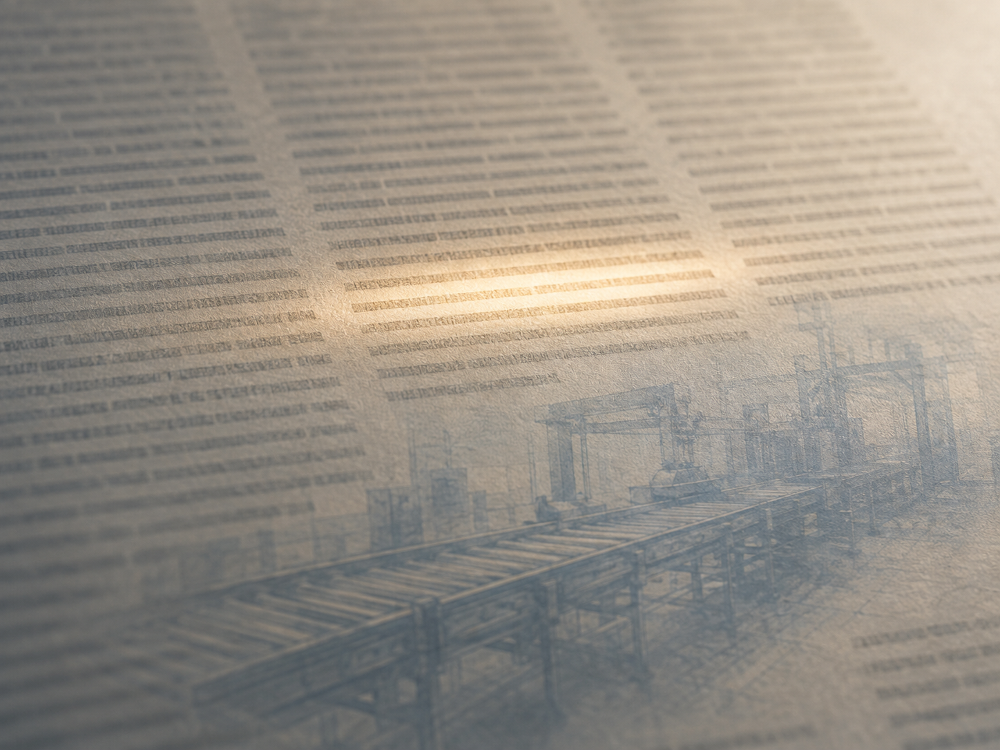

+++
date = '2026-08-27T00:05:00+00:00'
title = "Beyond the Subjects: The Walls Are in the Org Chart, Not in the World"
tags = ['Beyond the___', 'PM', 'Sharing', '中文']
thumbnail = 'pic.png'
+++

## Different fields, the same problem // 不同的領域，同一道題

The world was never divided into subjects. We cut it into pieces so we could divide the labor, then gave each piece its own name. The layer underneath was never cut.

這世界本來就沒有分學科。是我們為了分工，才把它切成一塊一塊，然後在每一塊上各自取了名字。底層那一層，從來沒有被切開過。

An empty aluminum can crumples between two fingers. Pressurize it and you can stand on it. Its shape doesn't come from the metal. It comes from the pressure.

一個空的鋁罐，你用手指就能捏扁。但只要裡面灌了壓，你整個人站上去它都不會塌。它的形狀不是靠金屬撐住的，是靠壓力撐住的。

A rocket works the same way. In 1946, a Convair engineer named Karel Bossart designed the Atlas missile on exactly that principle: a stainless-steel skin thinner than a coin, so thin it would collapse under its own weight if left unpressurized. On the ground it had to be inflated with nitrogen just to hold its shape. Seventy years later, when Musk switched Starship back from carbon fiber to stainless steel and someone asked him about it, the rocket he reached for as a reference wasn't any vehicle currently flying. It was Atlas.

火箭也是這麼一回事。1946 年，Convair 的工程師 Karel Bossart 就照這個原理設計了 Atlas 飛彈：不鏽鋼外殼比一枚硬幣還薄，薄到不充壓就會被自己的重量壓垮，平常得灌氮氣撐著形狀。七十多年後，馬斯克把 Starship 從碳纖維改回不鏽鋼，有人問他這個決定，他拿來當參照的不是任何一枚現役火箭，就是 Atlas。

A container for soda and a container for people headed to orbit sit an entire industry apart. Underneath, they are the same problem: hold the most pressure with the least material. The first principles are shared. Only the vocabulary differs.

裝汽水的容器和載人上太空的容器，中間隔著一整個產業。但底層是同一道題：怎麼用最少的材料，關住最大的壓力。第一性原理是共用的，不一樣的只有名字。

I've had that "oh — it's the same thing" moment a few times in my own work.

這種「原來是同一件事」的時刻，我在自己身上遇過幾次。

---
## Installing a production line inside a labeling panel // 把一條產線裝進標注面板

Some years ago I ran a production line at a consumer-electronics plant in China.

之前，我在中國一座消費性電子廠管產線。

A cost-reduction project required updating the mapping between component specifications. The comparison was done by eye: two spec sheets side by side, a person checking whether the codes matched. I never put a verification gate on that step.

有一個降低成本的項目，需要更新料件的對照關係。當時的比對方式是人工目視：兩份規格擺在一起，人去看編碼對不對得上。我沒有在這道流程上設任何驗證關卡。

About 500 boards had already gone into SMT when engineering caught the mapping error. All scrapped.

結果是大約 500 片板子已經進了 SMT，工程端才發現對照是錯的。全部報廢。

Afterwards I didn't ask anyone to be more careful. Asking people to be more careful is the weakest countermeasure there is — it bets the outcome on humans not making mistakes, and humans make mistakes. The actual fix was to hand the code comparison to software: if the two specs didn't match, the system threw an error and blocked the board from moving to the next station.

那件事之後，我沒有去要求大家更仔細。要求人更仔細，是最沒有用的一種對策——它把成敗押在人不出錯上，而人一定會出錯。真正的修法是把兩份規格的編碼交給電腦比對，對不上就直接報錯、擋住，進不到下一個工站。

Manufacturing has a name for this: poka-yoke. The point was never to remind anyone. The point is to leave the wrong thing no path downstream.

這在製造業裡有名字，叫防呆（Poka-Yoke）。它的重點從來不是提醒人，是讓錯的東西沒有路可以往下走。

And it works because of one property: **a production line has an order.** Anything stopped at one station cannot appear at the next.

而它能成立，有一個前提：**產線是有順序的。** 錯的東西只要在某一站被擋下來，就不可能出現在下一站。

Years later I was doing quality analysis for large-scale AI content moderation. The work was to figure out why the model got things wrong: reviewers examined cases one at a time and tagged the reason. The tool laid out dozens of cause codes on a single panel and let them multi-select.

幾年後，我在做一個大規模 AI 內容審核的品質分析。工作是弄清楚模型為什麼判錯：由質檢員一件一件看，然後標出原因。當時的做法，是把幾十個原因代碼全部攤在同一個面板上，讓他們多選。

Two problems surfaced quickly. The second one was fatal.

兩個問題很快浮出來，第二個是致命的。

First: an unchecked code told you nothing. You couldn't separate "this wasn't a factor" from "the reviewer missed it." With dozens of options and ordinary human lapses, those two look identical.

第一個是，沒有被勾起來的代碼，你分不出是「真的沒有這個問題」，還是「他漏了」。幾十個選項，加上人為疏失，這兩件事長得一模一樣。

Second: the causes stand in causal relationships to each other, and multi-select has no order. A speech-recognition failure can cause the model to misjudge; a model misjudgment is not necessarily caused by speech recognition. When both codes are checked and sitting flat on the same panel, you cannot tell which came first.

第二個是，這些原因彼此之間有因果關係，而多選是沒有順序的。語音辨識出錯，會導致模型判錯；但模型判錯，不一定是語音辨識造成的。當這兩個代碼被一起勾起來、平攤在同一個面板上，你看不出誰先誰後。

So you end up with a pile of causes and never a root cause.

於是你會得到一堆原因，但你永遠找不到根因。

The fix was poka-yoke. I broke the panel into a sequence of single-choice questions, each one determined by how the previous was answered. Follow it to the end and you land on exactly one mutually exclusive cause.

解法就是防呆。我把那個面板拆成一連串單選題，每一題問什麼，取決於上一題怎麼答。一路走到底，只會落在一個互斥的原因上。

The key: **the order of the questions is the order of causality.** If the problem lies in speech recognition, the reviewer is stopped at that station and never reaches the downstream box. A wrong attribution can't be produced in the first place.

關鍵在於：**提問的順序，就是因果的順序。** 如果問題出在語音辨識，質檢員會在那一站就被攔下來，走不到下游那一格。錯誤的歸因，在結構上就生不出來。

One is a factory with thousands of boards moving down a conveyor. The other is a few dozen people clicking through cases on a screen. On the surface they have nothing to do with each other. What I actually did was install a production line inside a labeling panel.

一邊是幾千片板子在輸送帶上跑的工廠，一邊是幾十個人對著螢幕點選的標注台。表面上八竿子打不著。但我做的事情，其實是把一條產線裝進了一個標注面板裡。

Different industries, the same underlying logic — and the idea transfers directly.

產業不同，底層邏輯是通的——而且想法可以直接搬過去用。

---
## That clause // 那一段條文

Lately I've been teaching myself how to read data-center contracts.

最近在自學怎麼解讀數據中心的合約。

I picked up a colocation master agreement filed publicly with the SEC.

我找了一份在美國證券交易委員會（SEC）上公開揭露的託管主約來讀。

I stopped at the clause on liquidated damages for late delivery.

讀到「遲交違約金」（liquidated damages）那一段的時候，我停下來了。

Because I recognized it.

因為我認得這件事。

Years ago, that production line had a quality incident. A supplier of a critical component changed its process without telling us. The product failed cosmetic inspection, and the defect rate was high enough that the line had to stop. It stayed down for about a month.

多年前那條產線出過一次品質問題。一個關鍵零組件的供應商，沒有事先告知就改了製程。結果是產品的外觀檢驗過不了，不良率高到整條線必須停下來。停了大約一個月。

The loss was real: scrapped material, rework hours, idle operators, overhead that accrued anyway. I was on site that month.

損失是實的：報廢的材料、重工的工時、閒置的作業員、照樣要攤提的廠務費用。停線的那個月，我在現場。

But finding the root cause wasn't the hard part. That took a few weeks. The hard part came after — itemizing the loss, negotiating who absorbed how much, weeks of back and forth, and in the end recovering a portion of it.

但真正難的不是找根因。根因幾個星期就找到了。難的是之後——把損失一項一項列出來，跟對方談誰該吃下多少，來回好幾個星期，最後拿回一部分。

What the liquidated damages clause says is this: that number was agreed on the day the contract was signed.

而 liquidated damages 這段條文的意思是：那個數字，在簽約那天就已經先講好了。

It exists for one reason. Arguing about damages after the fact is a known and expensive failure mode. An industry stepped on it for decades, so it moved the price to the front.

它存在的唯一理由，是因為「事後吵賠償吵不贏」本身就是一個已知的、而且很貴的失敗模式。一個行業重複踩了幾十年，於是把價格寫在事前。

Every so often something clicks. Two things belonging to completely different fields — a quality incident on a production line, a paragraph in a contract — and because the logic underneath is the same, it lands.

我常常會在某個時刻突然「啊」一聲。兩件事分屬完全不同的領域——一個是產線上的品質事故，一個是合約裡的一段條文——但因為底層邏輯是同一個，就在那一刻想通了。

That feeling isn't learning something new. It's recognizing something you had already seen.

那種感覺不是學到新知識。是認出了一個你早就見過的東西。

---
## We drew the walls // 牆是我們畫上去的

The walls were not there to begin with.

牆不是世界本來就有的。

Contracts belong to legal, poka-yoke belongs to the line, materials science belongs to engineering. Those boxes make the division of labor possible, and they also let each box grow its own vocabulary, its own conventions, its own version of "this is just how it's done." The world doesn't sort itself that way. Dig into enough fields and the bottom turns out to be the same material.

合約歸法務，防呆歸產線，材料力學歸工程——這些格子讓分工變得可能，也讓每一格長出自己的詞彙、自己的慣例、自己那句「本來就該這樣做」。但世界不照這個分。很多領域一路挖下去，底層根本是同一套東西。

Except the transfer doesn't happen on its own. What matters is not how many fields you have worked in, but whether you actually thought your way down to that layer. Get there and experience becomes portable. Don't, and experience stays just experience.

只是互通不會自己發生。重點從來不是你待過幾個領域，而是你有沒有真的把那一層想通。想通了，經驗才搬得動；沒想通，經歷就只是經歷。

And often it is precisely because you are an outsider that you break something open. You don't know what "this is just how it's done" means here, so you carry none of it, and you are left with the most basic question: what is this actually about? Someone who came off a production line does not take it for granted that labeling means ticking codes on a panel. Industry convention is an insider's moat, and an insider's ceiling.

而且很多時候，正因為你是外來的，你才破得了局。你不知道這一行「本來就該怎麼做」，所以你沒有那個包袱，只能回到最原始的問題：這件事的本質到底是什麼。一個從產線來的人，不會覺得「標注就是在面板上勾代碼」是天經地義的。行業慣性是內行人的護城河，也是內行人的天花板。

Now the first reader who never had to divide the labor has arrived. Large language models read every box at once. They have no discipline, and no habits from any trade.

現在，第一個不需要分工的讀者出現了。大型語言模型同時讀完了所有格子，它天生沒有學科，也沒有哪一行的窠臼。

I take that as good news. It amounts to a proof: those walls were never in the world. They were only in our division of labor.

我把這當成好消息。它等於替我們證明了一件事：那些牆從來不在世界上，只在我們的分工裡。

And once the walls are gone, one question remains — whether you have genuinely thought your way down to that layer. Get there, and a rocket and a soda can are the same problem, a production line and a labeling panel are the same line, a month of downtime and a paragraph in a contract are the same thing.

而牆一旦不在，剩下的就只有一個問題——你有沒有真的把底層那一層想通。想通了，火箭和可樂罐是同一道題，產線和標注面板是同一條線，停線的損失和合約裡的一段字是同一件事。

It was never about the division of labor, and never about how much experience you have accumulated. It is whether you can look beneath all those different names and find the first principles that actually carry across.

關鍵從來不是分工，也不是經驗的多寡。是你能不能在那些不同的名字底下，把那套可以轉換的第一性原理，真的想通。

---
*© Chung-Hao Lee. All Rights Reserved.
All content on this webpage—including but not limited to text, images, design, code, and multimedia materials—is protected under the international copyright treaties. Unauthorized reproduction, modification, distribution, public transmission, or commercial use is strictly prohibited. Legal action will be taken against infringement.*  
*© 李崇豪。保留所有權利。
本網頁之內容（包括但不限於文字、圖片、設計、程式碼及多媒體素材）均受國際著作權條約保護。未經書面授權，嚴禁任何形式之複製、改作、散布、公開傳輸或商業利用。侵權者將依法追訴。*
