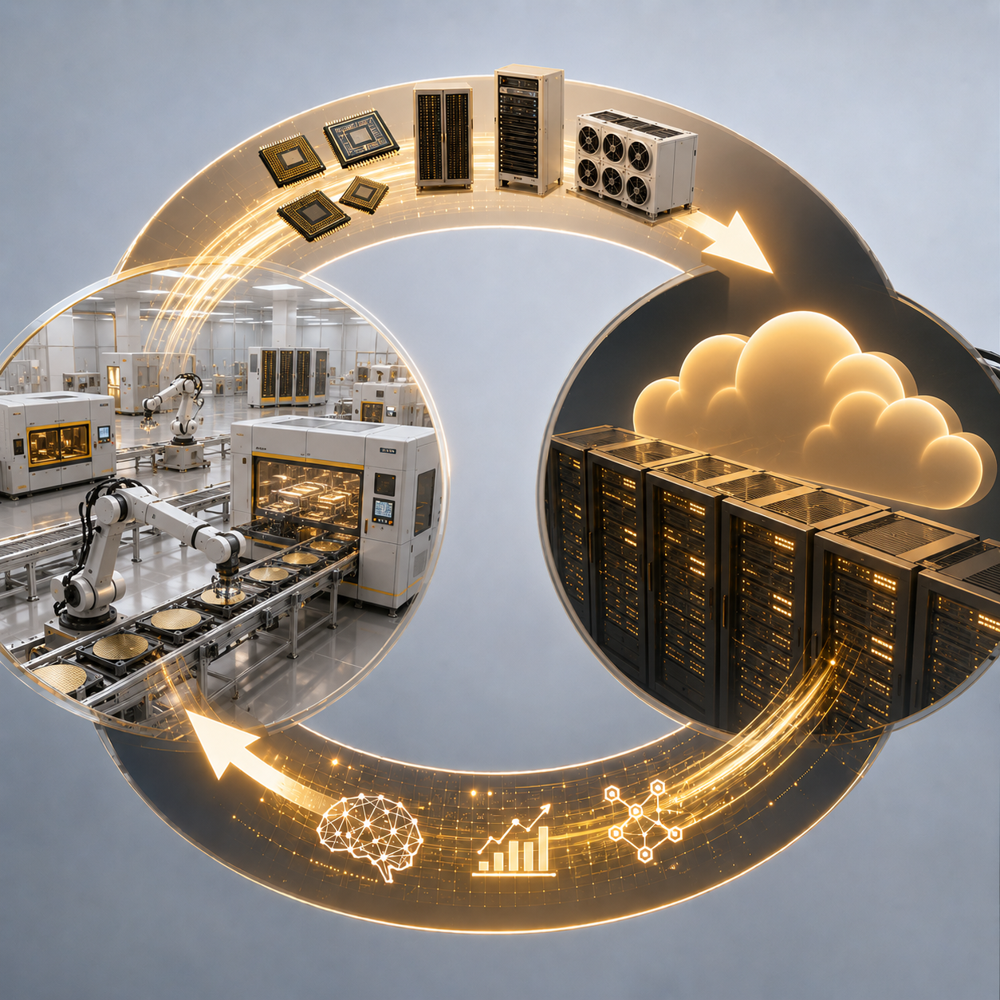

+++
date = '2026-05-23T00:00:00+00:00'
title = "Beyond the Legacy Mindset: How Atoms and Tokens Are Redefining Industrial Power"
tags = ['AI', 'Beyond The___', 'Supply Chain', '中文']
thumbnail = 'pic.png'
+++
 
## 當工廠開始生產「智慧」：原子與詞元的雙重奏
 
---
 
In the past, the phrase "industrial strength" tended to conjure a specific set of images: the glow of a steel mill, the cleanroom of a semiconductor fab, or an assembly line where tens of thousands of workers labored in concert. What these factories handled was tangible and visible—metal, plastic, silicon wafers. We might call them "atom factories," because what they move and machine are the elements of the periodic table.
 
過去，只要提起「工業實力」，人們腦中浮現的通常是鋼鐵廠的火光、半導體廠的無塵室，或是數萬人同時作業的組裝線。這些工廠處理的都是看得見、摸得著的東西——金屬、塑膠、矽晶圓。我們可以稱它們為「原子工廠」，因為它們移動、加工的是週期表上的元素。
 
But now a wholly new kind of factory has risen up alongside us. It produces no physical goods; instead, around the clock, it churns out trillions of "tokens." This is the data center—the "token factory" of the AI era.
 
但現在，一個全新的工廠型態已經矗立在我們身邊：它不生產實體物品，而是無時無刻產出數兆個「詞元」（token）。這就是數據中心，AI 時代的「詞元工廠」。
 
In the years ahead, measuring industrial strength will mean looking not only at the output of atom factories, but also at the computing scale of token factories. And the two are far from separate domains. They are forming a vast, virtuous loop—aiding one another, accelerating one another.
 
未來，衡量工業實力，不能只看原子工廠的產值，也要看詞元工廠的算力規模。而這兩者並非涇渭分明，反而正在形成一個巨大的正循環，彼此幫助、互相加速。
 
## Two Factories, One Logic // 兩種工廠，同一套邏輯
 
Any factory can be broken down into the same components: raw materials, a production line, energy, quality control, and output.
 
任何工廠都可以拆解為：原料、產線、能源、品管、產出。
 
For an atom factory, the raw materials are steel billets, wafers, and chemicals; the production line is stamping presses, etching machines, and robotic arms; the output is cars, chips, and refrigerators. For a token factory, the raw material is data; the production line is clusters of GPUs and TPUs running large-model architectures; and the output is tokens—every word, every snippet of code, every decision-making recommendation an AI generates.
 
原子工廠的原料是鋼胚、晶圓、化學品；產線是沖壓機、蝕刻機、機械手臂；產出是汽車、晶片、冰箱。詞元工廠的原料是數據；產線是 GPU、TPU 叢集與大模型架構；產出則是 token——也就是 AI 生成的每一個字、每一段程式碼、每一條決策建議。
 
An atom factory chases units of output per kilowatt-hour; a token factory chases how many meaningful tokens it can generate per watt of power. Both are utterly dependent on energy, cooling, and automation. The only difference is that the object being processed has shifted from atoms to tokens.
 
原子工廠追求每度電的產能，詞元工廠追求每瓦電能生成多少有意義的 token。兩者都極度依賴能源、冷卻與自動化，只是處理的對象從原子變成了詞元。
 
## Atom Factories Are the Foundation of Token Factories // 原子工廠，是詞元工廠的根本
 
An AI training cluster of a hundred thousand GPUs is, in itself, a masterpiece of manufacturing at its most extreme.
 
一座十萬張 GPU 的 AI 訓練叢集，本身就是一個極致製造業的結晶。
 
**Chips** Every GPU depends on advanced process nodes and packaging. TSMC's 4-nanometer fabs and its CoWoS packaging lines are atom factories of the highest order. A single NVIDIA H100 contains nearly 80 billion transistors—behind it lie hundreds of process steps, dozens of materials, and a precision ten thousand times finer than a human hair.
 
**晶片**: 每顆 GPU 都需要先進製程與封裝。台積電的 4 奈米晶圓廠、CoWoS 封裝產線，全是頂尖原子工廠。輝達的 H100 單顆就需要近 800 億個電晶體，這背後是數百道工序、數十種材料，以及比頭髮還細萬倍的精度。
 
**Power systems** A hyperscale data center routinely draws hundreds of megawatts—the equivalent of a mid-sized city. That demands transformers, high-voltage switchgear, backup diesel generators, and uninterruptible power supplies—every one of them a heavy-industry product, built by atom giants such as Siemens, Schneider Electric, and ABB.
 
**電力系統**: 一座超大規模數據中心用電量動輒數百兆瓦，等同一個中型城市。這需要變壓器、高壓開關櫃、備援柴油發電機、不斷電系統——每一樣都是重工業產品，由西門子、施耐德、ABB 等原子巨頭製造。
 
**Cooling systems** Once a rack's power density pushes past 40 kilowatts, liquid cooling becomes mandatory. Coolant distribution units, cold plates, pumps, and piping all come from the precision machinery and thermal management industries. Microsoft and Amazon have even begun purchasing power from small modular nuclear reactors to stabilize their supply—pulling in the nuclear industry, the hardest "atom industry" of them all.
 
**冷卻系統**: 當機櫃功率密度突破 40 千瓦，就必須採用液冷。冷卻分配單元、冷板、泵浦、管路，來自精密機械與散熱產業。甚至為了穩定供電，微軟、亞馬遜開始採購小型模組化核反應爐的電力，這又將拉動核工業這門最硬的原子工業。
 
Without breakthroughs from atom factories in materials, precision manufacturing, and power equipment, a token factory is nothing more than a castle in the air. Put another way: the birth of every single token carries the sweat of a long atom supply chain.
 
沒有原子工廠在材料、精密製造、電力設備上的突破，詞元工廠就只是紙上談兵。換句話說，每一個 token 的誕生，都背負著一長串原子供應鏈的汗水。
 
## Token Factories, in Turn, Optimize Atom Factories // 詞元工廠，回過頭來優化原子工廠
 
Once these data centers—stacked together out of atoms—begin producing high-quality tokens, AI starts to permeate the factory floor, carrying out the kind of system-wide optimization that has long eluded human hands.
 
當這些用原子堆出來的數據中心開始產出高品質 token，AI 便開始滲入製造現場，進行以往人類難以做到的全域優化。
 
**Big-data analysis.** In wafer fabrication, thousands of sensors generate an enormous stream of data every second; AI models read patterns from it in real time and output fine-tuning recommendations directly—exposure parameters, etch times, and the like. TSMC has already deployed systems of this kind on its advanced-node pilot lines, keeping yields climbing steadily even in the 2-nanometer generation, where physical limits loom. The same principle applies to chip design itself: NVIDIA, Google, and AMD use reinforcement learning to analyze millions of layout permutations, letting AI generate standard-cell placement and routing schemes outright. Design cycles that once took months are compressed dramatically—and the architectures it produces are themselves the heart of the next generation of token factories.
 
**大數據分析**: 在晶圓製造中，數以千計的感測器每秒產生海量數據，AI 模型從中即時判讀模式，直接輸出曝光參數、蝕刻時間等微調建議。台積電已在先進製程試產線部署這類系統，讓良率在逼近物理極限的 2 奈米世代依然穩定爬升。同樣的原理也應用於晶片設計：輝達、Google 與超微利用強化學習分析數百萬種佈局組合，由 AI 直接生成標準單元放置與繞線方案，將過去耗時數月的設計週期大幅壓縮，設計出來的架構本身就是下一世代詞元工廠的核心。
 
**Intelligent inspection and predictive maintenance.** These applications span both real-time quality assurance and long-term equipment health management. On the maintenance side, Siemens builds digital twins for production lines, continuously analyzing vibration, temperature, and current waveforms; AI can predict the failure point of a bearing or motor weeks in advance, and every such warning is a real-time token that directly averts the enormous losses of an unplanned line stoppage. On the inspection side, Foxconn has deployed AI vision systems at scale for PCB assembly and connector appearance checks; once a model is trained in the cloud on millions of defect samples, it is pushed to the production-line edge for real-time inference, driving the miss rate down to near zero—with a speed and consistency far beyond the era that relied on the human eye.
 
**智能檢測與預防性維護** 這類應用橫跨即時品質把關與長期設備健康管理。在設備維護端，西門子為產線建立數位孿生，持續分析振動、溫度與電流波形，AI 能提前數週預測軸承或馬達的故障點，每一條預警都是一道即時 token，直接避免整條產線非預期停機造成的鉅額損失。在品質檢測端，富士康於 PCB 組裝與連接器外觀檢查環節大規模部署 AI 視覺系統，模型在雲端以百萬級缺陷樣本完成訓練後，部署至產線邊緣進行即時推理，將漏檢率壓低至接近零的水準，檢測速度與一致性遠超過去依賴人眼的時代。
 
**Efficient supply chain management.** A modern manufacturing supply chain routinely involves thousands of materials, intercontinental shipping, fluctuating tariffs, and delivery dates that change by the hour—it long ago outgrew what human effort could optimize in real time. A single inference pass lets an AI model weigh every variable at once and generate near-optimal dynamic production schedules and procurement recommendations. Work that once required a whole team of industrial engineers calculating by hand is now distilled into a string of high-quality tokens, sharply boosting the responsiveness and resilience of the entire supply chain.
 
**高效供應鏈管理** 現代製造業的供應鏈動輒涉及上千種物料、跨洲海運、浮動關稅與瞬息萬變的交期，已非人力所能即時最適化。AI 模型一次推理便能同時權衡所有變數，生成近乎最優的動態生產排程與採購建議。過去需要整組工業工程師手工試算的工作，如今濃縮為一串高品質 token，讓整條供應鏈的反應速度與韌性大幅躍升。
 
According to a McKinsey report, AI stands to create trillions of dollars in value for global manufacturing each year, in areas such as predictive maintenance and supply chain optimization. That value is precisely what token factories give back to atom factories.
 
根據麥肯錫的報告，AI 可望為全球製造業在預測性維護、供應鏈優化等領域每年創造數兆美元的價值。這些價值，正是詞元工廠對原子工廠的回饋。
 
## The Virtuous Loop: A Flywheel That Feeds Itself // 正循環：彼此餵養的飛輪
 
Connect those two sections, and a self-accelerating flywheel comes into view.
 
把上面兩段接起來，一個自我加速的飛輪就浮現了。
 
Atom factories build stronger chips and more efficient cooling systems; token factories gain greater computing power and train smarter models. Those models, in turn, optimize a fab's etch recipes, design the architecture of the next generation of chips, and orchestrate intercontinental supply chains. Manufacturing efficiency rises, and the cost of chips and infrastructure falls. AI applications spread from the cloud to the edge, demand surges once more, atom factories run at full capacity, and a fresh round of technological breakthroughs begins.
 
原子工廠造出更強的晶片與更高效的冷卻系統，詞元工廠獲得更大算力，訓練出更聰明的模型。這些模型反過來優化晶圓廠的蝕刻配方、設計下一代晶片的架構、調度跨洲供應鏈，製造效率提升，晶片與基礎設施成本下降。AI 應用從雲端擴散到邊緣，需求再度暴漲，原子工廠產能滿載，投入新一輪技術突破。
 
The more precise the atoms, the more powerful the tokens; the more powerful the tokens, the more efficient the atoms. Every turn of the loop accelerates the next—each side the most powerful accelerator the other has.
 
原子越精密，詞元越強大；詞元越強大，原子越高效。每一輪循環都在加速，兩者互為對方最強的加速器。

## In Closing: Only Together Do They Make Industry Whole // 結語：合在一起，才是完整的工業
 
The next time you walk into a nearly deserted smart factory and watch robotic arms dance at speed behind their glass enclosures, picture this: the parameters for each step of the process may well have come from a model in some data center hundreds of kilometers away, generating a few lines of tokens just moments ago. And on the racks of that data center, every GPU bears the atom-level engraving of a wafer fab, its liquid-cooling lines wired into the craft of precision machinery.
 
下次當你走進一座幾乎無人的智慧工廠，看著機械手臂在玻璃罩內飛快舞動時，可以想像一下：每一道工序的參數，很可能來自數百公里外某座數據中心裡，模型剛生成的幾行 token。而在那座數據中心的機架上，每塊 GPU 都烙印著晶圓廠的原子級雕琢，液冷管路則連接著精密機械的工藝。
 
Atoms shape the foundation of tokens; tokens endow atoms with intelligence. The boundary between these two kinds of factories is dissolving, forming a double helix in which each aids the other and the two evolve together.
 
原子塑造了詞元的根本，詞元則賦予原子智慧。這兩種工廠的邊界正在消融，形成一個彼此互助、共同進化的雙螺旋。
 
The new industrial revolution is no longer a pure hardware story, nor a pure software story. It is a symphony in which atoms and tokens come to a boil together. And we are witnessing this great current of history as it unfolds.
 
新的工業革命，不再是純粹的硬體故事，也不是純粹的軟體故事。它是一場原子與 token 一起沸騰的交響樂。而我們，正見證這歷史的洪流。

---
*© Chung-Hao Lee. All Rights Reserved.
All content on this webpage—including but not limited to text, images, design, code, and multimedia materials—is protected under the international copyright treaties. Unauthorized reproduction, modification, distribution, public transmission, or commercial use is strictly prohibited. Legal action will be taken against infringement.*  
*© 李崇豪。保留所有權利。
本網頁之內容（包括但不限於文字、圖片、設計、程式碼及多媒體素材）均受國際著作權條約保護。未經書面授權，嚴禁任何形式之複製、改作、散布、公開傳輸或商業利用。侵權者將依法追訴。*
