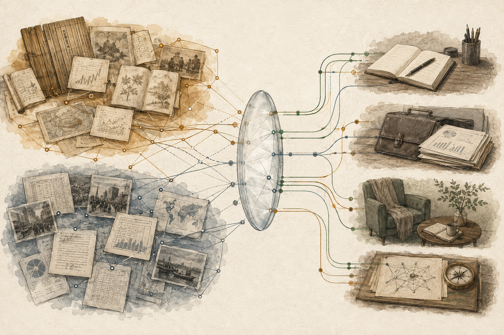

+++
date = '2026-08-09T00:00:00+10:00'
title = "Learning from Records of the Grand Historian (史記): Memory, Compression, and the Future of Personal AI"
tags = ['AI', '中文', 'Passport to AI Era']
+++

## 借鑑《史記》的智慧：記憶、壓縮、保留矛盾，未來的 AI 方向

## What People Want Is Jarvis // 大家想要的是賈維斯

What people want from personal AI is not another chat window.

大家想要的個人 AI，不是另一個聊天視窗。

They want Jarvis.

大家想要的是賈維斯。

You speak, and it knows what you are working on. You get stuck, and it knows which document to retrieve. Before you finish the sentence, it understands that this question is connected to something you decided last month, last year, or even earlier.

你開口，它知道你在做什麼；你卡住，它知道該找哪份資料；你還沒說完，它已經理解這件事跟你上個月、去年，甚至更早之前的某個判斷有關。

It does not just answer. It carries context, restores memory, and moves work forward.

它不只是回答問題，而是接住脈絡、補上記憶、推進行動。

In [*When AGI Moves In*](/posts/when-agi-moves-in/), I argued that the real bottleneck for AI entering everyday life is not just model intelligence. It is perception, interface, and the distance between intent and action. This piece pushes that question one layer deeper: once AI can finally catch our intent, it must also learn how to catch our history.

在[《When AGI Moves In》](/posts/when-agi-moves-in/)裡，我曾經寫過，AI 真正進入生活的瓶頸，不只是模型智慧，而是感知、介面，以及「意圖」到「行動」之間的距離。這篇文章想往後再推一步：當 AI 終於能接住人的意圖，它還需要接住人的歷史。

That is why memory is becoming one of the most important layers in AI products. ChatGPT now distinguishes between saved memories and references to past chat history. Claude has introduced chat search, memory, and project-level memory spaces. These features look like user-experience improvements. But underneath, they point to a larger shift.

這也是為什麼「記憶」正在變成 AI 產品裡越來越重要的一層。ChatGPT 已經把記憶分成使用者明確要求保存的「保存記憶」，以及能參考過去對話的「對話歷史」。Claude 也開始讓使用者搜尋過去對話，並在不同專案裡建立各自的記憶空間。

If AI is going to become a real personal assistant, it cannot meet you from scratch every time.

如果 AI 要成為真正的個人助手，它不能每一次都像第一次認識你。

But once it starts to remember you, a harder question appears.

但當它真的開始記得你，另一個問題就出現了。

Which version of you is it remembering?

它到底記得的是哪一個你？

---

## The More Memory Accumulates, the More Contradiction Becomes Inevitable // 記憶越多，矛盾越不可避免

A person is not a clean, stable, permanently consistent object.

一個人不會只有一個穩定、乾淨、永遠一致的版本。

A strategy that makes sense today may be overturned by reality six months later. A goal you wrote down in one phase of life may only reflect what was reasonable then. Your understanding of a problem changes as new data, experience, and consequences arrive.

你今天相信的策略，可能半年後會被現實推翻；你曾經寫下的目標，可能只是某個階段的合理判斷；你對一件事的理解，會隨著新的資料、經驗與代價而改變。

Worse, these versions do not always align. They overlap, expire, contradict each other, and sometimes remain valid in different contexts.

更麻煩的是，這些版本不一定會彼此對齊。它們會衝突、重疊、過期，也會在不同情境下同時成立。

The version of yourself you use for job applications is not the same as the version that writes essays. A private reflection should not automatically become public context. Some statements are facts. Some are inferences. Some were right at the time but are no longer current. Some look contradictory only because they came from different moments, different questions, or different angles.

一個求職用的自我，不等於一個寫作中的自我；一個私人反思裡的判斷，也不一定適合被帶進公開文章。某些資訊是事實，某些是推論；某些當時合理，現在已經失效；某些看起來矛盾，但只是因為它們來自不同時間、不同問題、不同角度。

This is not a minor inconvenience caused by having too much personal data. It is the central difficulty of personal AI.

這不是個人資料變多之後的小麻煩，而是個人 AI 要成立時的核心難題。

In [*The AI Era May Need a New Division of Labor*](/posts/the-ai-era-may-need-a-new-division-of-labor/), I described a possible division of labor for personal AI: the cloud handles reasoning, the phone carries memory and permissions, and earbuds or glasses become lightweight input-output channels.

在[《The AI Era May Need a New Division of Labor》](/posts/the-ai-era-may-need-a-new-division-of-labor/)裡，我把未來個人 AI 拆成一套分工：雲端負責推理，手機承擔記憶與權限，耳機與眼鏡成為輸入輸出的入口。

The key layer is the phone: the memory and control layer.

這裡最關鍵的，其實是手機那一層：記憶與控制層。

Because the differentiation of personal AI will not come only from how smart the model is. It will come from how well the system manages a person's long-term context.

因為個人 AI 的差異化，最後不只會來自模型多聰明，而會來自它如何管理一個人的長期脈絡。

---

## Compression Is Intelligence, but Compression Always Has an Angle // 壓縮是智慧，但壓縮一定有角度

Ilya Sutskever has used compression as a way to think about intelligence. In his Simons Institute talk, [*An Observation on Generalization*](https://simons.berkeley.edu/talks/ilya-sutskever-openai-2023-08-14), he framed compression as a language for understanding unsupervised learning: a good compressor does not merely shrink data; it discovers shared structure across datasets. Prediction and compression are two sides of the same idea.

Ilya Sutskever 曾經用「壓縮」來理解「智慧」。他在 Simons Institute 的演講 [*An Observation on Generalization*](https://simons.berkeley.edu/talks/ilya-sutskever-openai-2023-08-14) 裡，用壓縮的語言解釋無監督學習：好的壓縮器不是單純把資料變小，而是找出不同資料之間共享的結構；而預測與壓縮，本來就是同一件事的兩面。

This is a powerful lens.

這個觀點很有力量。

Humans understand the world through compression too. We compress experience into concepts, phenomena into models, careers into resumes, and lives into stories. Without compression, there is no understanding. Without summary, there is no judgment. Without selection, there is no action.

人理解世界，本來也不可能保存每一個細節。我們用概念壓縮經驗，用模型壓縮現象，用履歷壓縮職涯，用故事壓縮人生。沒有壓縮，就沒有理解；沒有摘要，就沒有判斷；沒有取捨，就沒有行動。

AI works the same way. A model can answer because it has compressed large amounts of data into usable representations. When we ask AI to summarize a conversation, organize a report, or infer someone's preferences, we are asking it to compress.

AI 也是如此。模型之所以能回答，是因為它把大量資料壓成某種可用的表示。當我們要求 AI 總結一段對話、整理一份報告、歸納一個人的偏好，本質上也都是在要求它壓縮。

Compression is not the problem.

問題不在壓縮。

The problem is that every act of compression has an angle.

問題在於，每一次壓縮都有角度。

A meeting summary drops tone. A resume compresses struggle. A memory entry about a person turns a continuous life into several stable-looking preferences. These compressions are not necessarily wrong. Most of the time, they are useful.

一份會議摘要會省略掉語氣。一份履歷會壓掉掙扎。一個「關於我的記憶」會把連續的人生切成幾條看似穩定的偏好。這些壓縮不一定錯，甚至通常很有用。

The danger begins when the compressed version replaces the original material.

真正危險的是，當壓縮後的版本取代了原始材料。

Once that happens, the user loses the ability to return, reinterpret, and understand themselves again.

一旦發生這件事，使用者就失去了回頭重新理解自己的能力。

A good personal AI should not avoid compression. It should make compression traceable, recomputable, and challengeable.

所以好的個人 AI 不是不壓縮，而是要讓壓縮可追溯、可重算、可被反駁。

---

## Raw Material Is Not a Burden. It Is Future Evidence. // 原始資料不是負擔，而是未來判斷的素材

Large amounts of raw material still matter.

龐大的原始資料仍然有價值。

Not because humans should keep everything, and not because disorder itself is valuable. Raw material matters because future questions cannot be fully predicted from the present.

不是因為人類應該保留一切，也不是因為雜亂本身值得崇拜，而是因為未來的問題無法被現在預測。

A conversation that seems irrelevant today may become key evidence in a decision next year. A hesitation removed from a summary may later explain why a certain turning point mattered. A detail that looks like noise now may become signal under a different model, a different question, or a different version of yourself.

今天看起來無關緊要的一段對話，可能在明年的決策裡變成關鍵證據；今天被摘要刪掉的一個猶豫，可能正是未來理解某次轉折的線索。現在看起來像雜訊的細節，可能在不同模型、不同問題、不同版本的自己面前，突然變成訊號。

A good knowledge system cannot only ask, "How do we reduce the amount of information?"

好的知識系統，不能只問「如何把資料變少」。

It must also ask: when I need to judge again, can I return to the original context? When two summaries conflict, can I compare their sources? When a new question appears, can old material be thawed and understood again?

它還要問：當我需要重新判斷時，能不能找到原始脈絡？當兩個摘要互相衝突時，能不能回到來源比對？當新的問題出現時，舊資料是否還有被重新解凍的可能？

This is similar to the method behind Sima Qian's *Records of the Grand Historian* (史記).

這件事很像太史公司馬遷寫《史記》的方法。

The power of *Records of the Grand Historian* does not come only from its grand narrative of the past. It comes from the way it preserves people, events, institutions, families, wars, and the texture of fate across different forms: basic annals, hereditary houses, biographies, tables, and treatises. It does not compress the past into one elegant sentence. It leaves materials that reflect, complicate, and sometimes contradict one another, so later readers can compare, judge, and reread.

《史記》之所以有力量，不只是因為它留下了一套完整的歷史敘事，而是因為它保留了大量人物、事件、制度、家族、戰爭與命運的材料。它不是把過去壓成一句漂亮結論，而是在不同人物的列傳、本紀、世家與書表之間，留下彼此映照、甚至彼此矛盾的線索，讓後人可以繼續比較、判斷、重讀。

Good historical work does not rush to flatten the past. It preserves materials, marks sources, compares different accounts, and tries to approach truth through contradiction. It understands that a single source may be biased, a single narrative may be too smooth, and a single conclusion may only reflect the limits of perspective, available materials, or the questions being asked at the time.

好的歷史工作，往往不是太早裁決，而是保存材料、標記來源、比較不同敘述，在矛盾之間盡量逼近真相。它知道單一材料可能有偏見，單一敘事可能太順，單一結論可能只是視角、材料不足，或當時問題意識的產物。

So the materials must remain. The contradictions must remain too.

所以史料要留下來。矛盾也要留下來。

Not because every angle is equally true, but because different angles may preserve different parts of the truth. Judgment is still necessary. Evidence still needs weight. Sources still need comparison. But preserving inspectable material is often more responsible than flattening contradiction too early.

不是因為所有角度都同樣正確，而是因為不同角度可能保留了真相的不同切面。最後仍然需要判斷，需要證據權重，需要交叉比對；但比起太早磨平矛盾，保留可檢查的材料，通常是對未來更負責的做法。

---

## Jarvis Needs a Traceable Back End // 賈維斯的前台，需要一個可追溯的後台

This is what personal AI memory systems need to learn.

這也是個人 AI 記憶系統應該學會的事。

The front end can be as clean as Jarvis: fast answers, task continuity, proactive reminders, useful action. Users should not need to open a giant personal archive every day. They should not need to read their entire history before asking one question.

它的前台可以像賈維斯一樣乾淨：快速回答、接續任務、主動提醒、協助行動。使用者不需要每天打開一座龐大的個人檔案館，也不需要為了問一個問題，先閱讀自己的全部歷史。

But the back end cannot be a vague list of preference labels.

但它的後台不能只是一串模糊的偏好標籤。

A reliable personal AI needs to know where information came from, when it was created, what context it belonged to, and whether later evidence has modified it. It needs to distinguish raw material, excerpts, summaries, inferences, and decisions. It needs to retrieve quickly during normal use, but return to original material when the situation demands it.

真正可靠的個人 AI，需要知道資訊從哪裡來、何時產生、在什麼情境下成立、是否已經被後來的資料修正。它要能區分原始資料、摘錄、摘要、推論與決策；要能在回答時快速索引，但在必要時回到原件；要能壓縮，但不能讓壓縮失去回溯路徑。

In other words, a summary should not be the end of memory. It should be an entrance back into the material.

換句話說，摘要不應該是記憶的終點，而應該是通往材料的入口。

This is why I built my [Personal LLM Wiki](/portfolio/my-llm-wiki/). It is not simply a place to store information. It separates raw material, excerpts, interpretation, and source tracing into different layers, so AI can not only find an answer, but also return to the material from which that answer was formed.

這也是我做 [Personal LLM Wiki](/portfolio/my-llm-wiki/) 的原因。它不是單純把資料存起來，而是把原始資料、摘錄、詮釋與來源追蹤分成不同層，讓 AI 不只找到答案，也能回到答案形成的材料。

This design is messier than a beautiful summary.

這種設計看起來比一份漂亮摘要麻煩。

But it is closer to what long-term memory actually requires.

但它更接近長期記憶真正的需求。

Because personal AI is not dealing with static data. It is dealing with a changing person.

因為個人 AI 面對的不是靜態資料，而是一個正在變動的人。

---

## A Personal AI Must Understand Different Versions of You // 真正懂你的 AI，必須能處理不同版本的你

If a personal AI only remembers what you like, what you have done, or what tone you prefer, it is just a more thoughtful chatbot.

個人 AI 如果只記得你「喜歡什麼」、「做過什麼」、「偏好什麼語氣」，那它只是比較貼心的聊天工具。

The harder task is understanding how you change.

真正困難的是，它要理解你如何改變。

Which judgments are outdated? Which strategies are still being tested? Which contradictions should be preserved? Which parts of the past should no longer govern the future?

哪些判斷已經過期？哪些策略仍在驗證？哪些矛盾應該保留？哪些過去不該再支配未來？

This may be one of the real differences between humans and AI.

這裡也許才是人和 AI 的差別。

AI can help us compress, index, compare, and reorganize memory. It can retrieve more quickly than we can. It can preserve context more consistently. It can extract patterns from far more material than any person could hold in mind.

AI 可以幫我們壓縮、索引、比對、重組記憶。它可以比人更快找到資料，比人更穩定保留脈絡，也比人更擅長在大量資訊中抽取模式。

But the human is the one who lives with the consequences.

但人是那個在時間裡承擔後果的人。

A person does not only produce answers. A person is changed by them. A person does not only store memories. A person decides which memories continue to participate in the future.

人不只是產生答案，也要被答案改變；不只是保存記憶，也要決定哪些記憶繼續參與未來。

The end state of personal AI, then, is not merely "an assistant that understands me better."

所以個人 AI 的終局，不只是「更懂我的助手」。

It is an infrastructure for long-term collaboration with oneself: a front end that acts like Jarvis, a back end that preserves like a knowledge base, a deeper layer that compares evidence like historical work, and a final authority that still belongs to the person who must live with the outcome.

它更像是一套讓人與自己長期協作的基礎設施：前台像賈維斯一樣行動，後台像知識庫一樣保存，底層像歷史學一樣比對，最終仍把判斷權交還給那個必須承擔後果的人。

If intelligence is compression, then higher intelligence may not mean compressing oneself into a permanently correct answer.

如果智慧是壓縮，那麼更高階的智慧，可能不是壓出一個永遠正確的自己。

It may mean keeping the ability to trace, compare, revise, and preserve the right to overturn today's version of ourselves tomorrow.

而是讓我們在不同版本的自己之間，仍然能追溯、比較、修正，並保留未來推翻今天的權利。

---

### References // 參考資料

- Ilya Sutskever, [*An Observation on Generalization*](https://simons.berkeley.edu/talks/ilya-sutskever-openai-2023-08-14), Simons Institute, 2023.
- OpenAI Help Center, [*How does reference saved memories work?*](https://help.openai.com/en/articles/11146739-how-does-reference-saved-memories-work).
- Anthropic Support, [*Use Claude's chat search and memory to build on previous context*](https://support.claude.com/en/articles/11817273-use-claude-s-chat-search-and-memory-to-build-on-previous-context).
