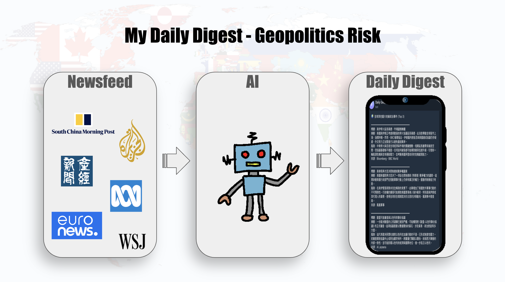
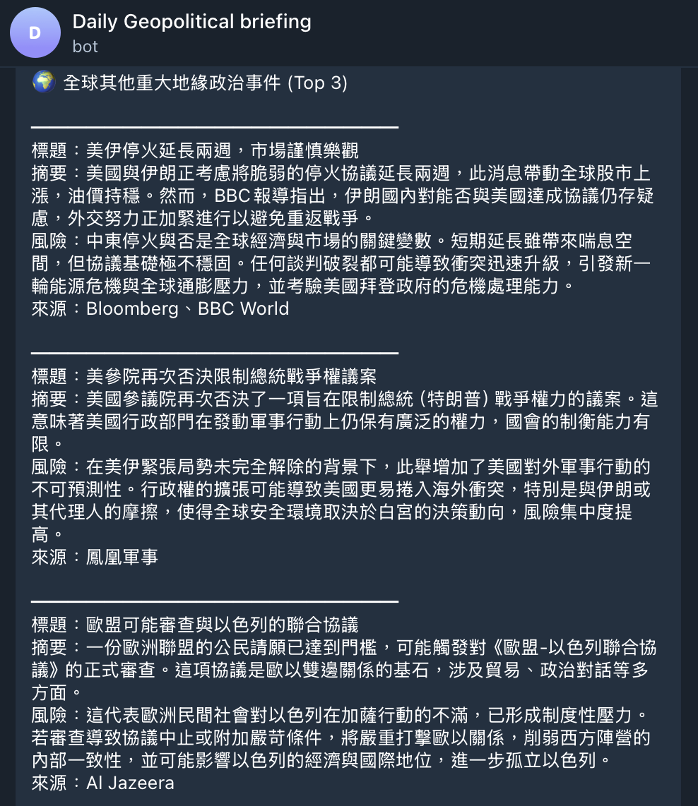

+++
date = '2026-04-16T00:00:00+00:00'
title = "【AI Side Project Vol.06】My Daily Digest - Geopolitics Risk"
tags = ['AI Practice Journal', 'Using AI', 'App', 'Side_Project', '中文']
thumbnail = 'pic.png'
+++

In an era of increasingly volatile global geopolitics, risk is no longer just a headline; it has become a tangible force affecting everyone’s life and corporate operations. Inflationary pressures, supply chain disruptions, and energy price fluctuations—these impacts have long since extended from conflict points on a map into our daily decisions and commercial strategies. As someone who has long monitored global affairs, I have come to a profound realization: **the ability to grasp geopolitical risks in a timely and accurate manner has become indispensable for supply chain management and business strategy.**

在當今世界地緣政治環境日益動盪的時代，風險不再只是新聞標題，而是真實影響到每個人的生活與企業運作。通膨壓力、供應鏈中斷、能源價格波動……這些影響早已從地圖上的衝突點，延伸到我們的日常決策與商業布局。作為一名長期關注全球局勢的我，深刻體會到：**即時、精準掌握地緣風險，已成為供應鏈管理與商業策略不可或缺的能力**。

---

For this reason, I no longer passively consume information. Instead, I have proactively collaborated with AI to build a tool entirely my own—**My Daily Digest: Geopolitics Risk**.

正因如此，我不再被動接收資訊，而是主動與AI合作，打造了一款完全屬於自己的工具——**My Daily Digest - Geopolitics Risk**（每日地緣風險摘要）。

---

Every morning at 8:00 AM, this tool automatically generates a structured, high-quality geopolitical risk briefing for me. It distills the content I care about most from reliable, world-class media sources such as Reuters, Financial Times, SCMP, Bloomberg, and Nikkei Asia:

這個工具每天早上8點會自動為我生成一份結構化、高品質的地緣風險簡報。它會從Reuters、Financial Times、SCMP、Bloomberg、Nikkei Asia等國際一流媒體的可靠來源中，精煉出我最關心的內容：

---

🌍 **Focus on Key Regions:** Systematically tracking high-risk hotspots in East Asia, the Middle East, Europe, and the Americas.
📉 **Linked Market Insights:** Real-time analysis of the potential impact of these geopolitical events on the supply chain.

🌍 **聚焦關鍵區域：** 結構化追蹤東亞, 中東與歐美等高風險熱點。 
📉 **連動市場判斷：** 即時分析這些地緣風險事件對供應鏈的潛在影響。 

---

All content is presented in a calm, fact-oriented style, free from hype or unnecessary emotion, allowing me to see the full picture in the shortest possible time.

所有內容以冷靜、事實導向的風格呈現，沒有炒作、沒有多餘情緒，讓我能在最短時間內看清全貌。

---

In today’s information explosion, we no longer face a "lack of information" but rather "too much noise." This tool allows me to truly make information work for me: I can customize the format, regional focus, and analytical perspective based on my needs, fully realizing an automated workflow from raw RSS feeds to daily summaries with the help of AI. The entire process requires zero maintenance; with just a few minutes each day, I gain strictly vetted, high-value insights.

在資訊爆炸的今天，我們面臨的已不再是「資訊不足」，而是「雜音太多」。這個工具讓我真正做到「資訊為我所用」：我可以根據自身需求客製化格式、區域重點與分析角度，完全由AI協助實現從原始RSS到每日摘要的自動化流程。整個過程零維護，每天只需幾分鐘，就能獲得經過嚴選、去蕪存菁的高價值洞察。

---

To me, this is more than just a personal gadget; it is an extension of professional capability. It helps me maintain a forward-looking perspective in supply chain risk assessment, business decision-making, and strategic planning. When global events threaten to affect raw material prices, logistics routes, or regional investment environments, I am already equipped to make faster judgments.

對我而言，這不只是個人小工具，更是專業能力的延伸。它幫助我在供應鏈風險評估、商業決策與戰略規劃上，保持領先一步的視野。當全球事件可能影響到原物料價格、物流路線或區域投資環境時，我已能更快做出判斷。

---

The development process has further convinced me that in the AI era, **proactively solving pain points and building your own solutions** is the most precious competitive edge for any professional. I do not wait for off-the-shelf tools; instead, I choose to work hand-in-hand with AI to rapidly transform needs into actual value.

這次開發的過程，也讓我更加相信：在AI時代，**主動解決痛點、自己動手打造解決方案**，正是每位專業人士最珍貴的競爭力。我不等待現成工具，而是選擇與AI攜手，快速將需求轉化為實際價值。

Join the @Daily_geopo_briefing_CH_bot on Telegram to stay informed with real-time insights.

歡迎加入在Telegram上的 @Daily_geopo_briefing_CH_bot ，獲取即時新知。

---
*© Chung-Hao Lee. All Rights Reserved.
All content on this webpage—including but not limited to text, images, design, code, and multimedia materials—is protected under the international copyright treaties. Unauthorized reproduction, modification, distribution, public transmission, or commercial use is strictly prohibited. Legal action will be taken against infringement.*  
*© 李崇豪。保留所有權利。
本網頁之內容（包括但不限於文字、圖片、設計、程式碼及多媒體素材）均受國際著作權條約保護。未經書面授權，嚴禁任何形式之複製、改作、散布、公開傳輸或商業利用。侵權者將依法追訴。*
