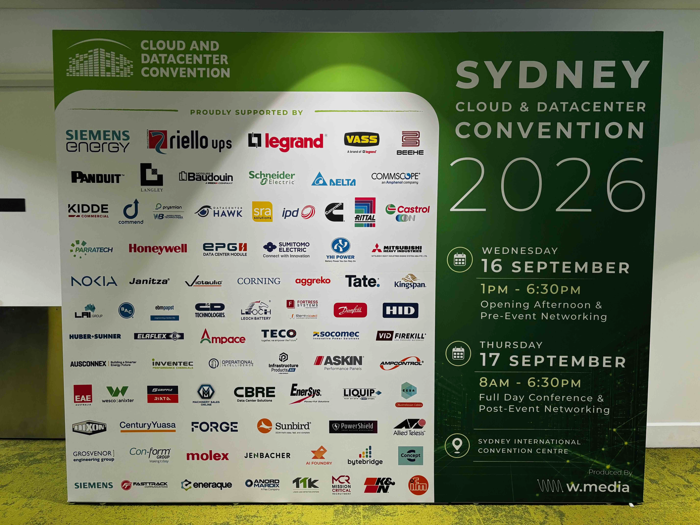
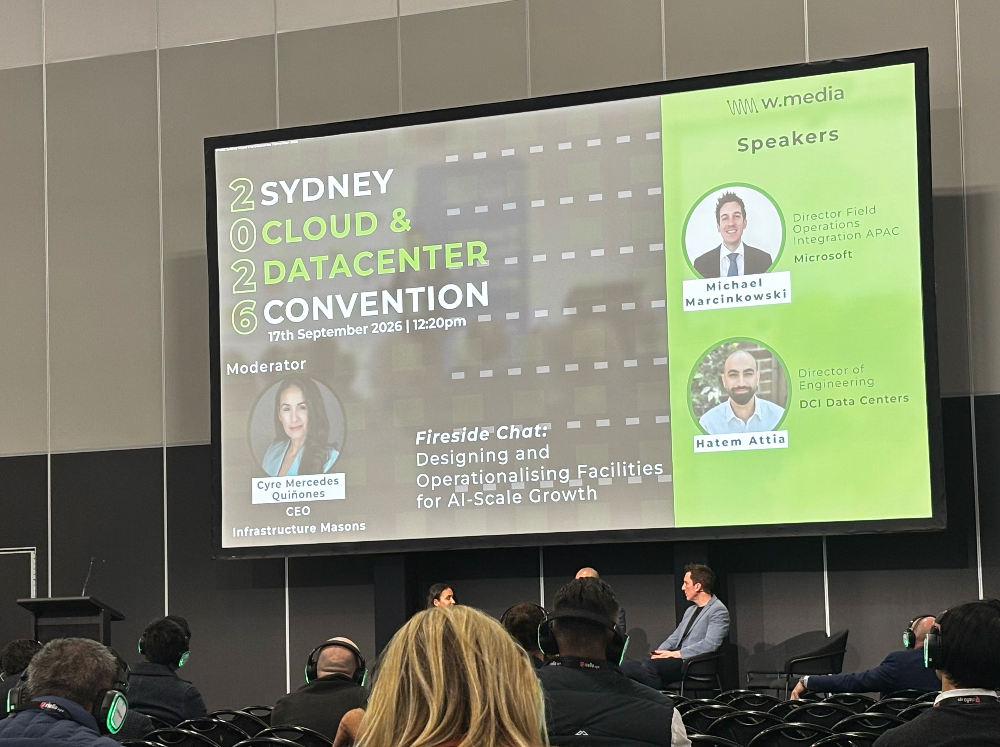

+++
date = '2026-09-17T00:00:00+00:00'
title = 'Sydney Cloud & Datacenter Convention 2026: Three Signals I Saw on the Ground'
tags = ['Sharing', 'Networking', '中文', 'Data Center']
thumbnail = 'pic.jpg'
+++

Attending the Cloud & Datacenter Convention at ICC Sydney brought me back to an earlier event: Sydney Build Expo 2026.

參加這次在 ICC Sydney 舉行的 Cloud & Datacenter Convention，讓我想起幾個月前參加 Sydney Build Expo 2026 的經驗。

The two events focused on different industries, but I noticed a similar pattern. In the news, AI often appears to be concentrated in a few familiar companies: model developers, cloud platforms and chipmakers. On the ground, however, AI is spreading through a much wider physical ecosystem.

兩場活動關注的產業不同，但我在現場看到了相似的結構。新聞裡的 AI，經常集中在幾家熟悉的公司身上：模型開發商、雲端平台與晶片業者。但走進真實產業現場後，會發現 AI 正沿著更廣泛的實體生態系擴散。

Here are three signals I took away from the event.

以下是我這次活動帶回來的三個訊號。

## 1. The supply chain behind AI is becoming visible // AI 背後的供應鏈，正在現場變得可見

My first impression was that the exhibition floor was made up largely of suppliers rather than hyperscalers or colocation operators.

我最直接的感受是，這個展場主要由各種供應商組成，而不是 hyperscaler 或 colocation operator 的展示攤位。

There were companies working across thermal control, liquid cooling, power equipment, energy systems, industrial control and connectivity components. Their products came from different parts of the infrastructure stack, but they were responding to the same underlying demand: how to support increasingly dense and demanding computing environments.

現場可以看到 thermal control、液冷、電力設備、能源系統、工業控制與連接元件等不同方向的方案。這些產品分屬基礎設施的不同層次，但回應的其實是同一個底層需求：如何支撐密度越來越高、要求越來越複雜的運算環境。

In *The AI Supply Chain Dividend*, I argued that AI spending would not remain inside the financial statements of software companies and cloud providers. It would travel down into power, cooling, equipment, manufacturing and other physical industries.

我在 [The AI Supply Chain Dividend](https://chunghaolee.com/posts/the-ai-supply-chain-dividend/) 中曾經寫過，AI 的支出不會只停留在軟體公司與雲端業者的財報裡，而會一路向下傳導到電力、冷卻、設備、製造與其他實體產業。

At the conference, that argument was no longer just a diagram or a macroeconomic idea. It was represented by different suppliers, products and technical conversations across the exhibition floor.

這次在展場裡，這個觀點不再只是一張供應鏈圖，或一個宏觀經濟判斷，而是以不同供應商、產品與技術對話的形式，直接出現在眼前。

AI may be concentrated in the headlines. Its infrastructure is not.

新聞裡的 AI 也許集中在幾家巨頭，但支撐 AI 運作的基礎設施，早已不是如此。

## 2. Sydney is being treated as a promising data-center market // 現場交流也讓我更相信 Sydney 的市場潛力

The second signal came from the conversations around the event.

第二個訊號，來自活動現場的交流。

Several industry participants spoke positively about the Australian data-center market and Sydney in particular. The conversations were not limited to whether Australia had potential. They were about where demand was growing, which infrastructure capabilities would be needed, and how different companies could participate in the next stage of development.

幾位產業參與者都對澳洲、尤其是 Sydney 的 data-center market 抱持正面看法。大家談的不只是澳洲有沒有潛力，而是需求正在往哪裡成長、下一階段需要哪些基礎設施能力，以及不同公司可以如何參與其中。

This is not proof that every planned project will be delivered. But it is still a meaningful first-hand signal. Sydney is being discussed not as a market waiting to mature, but as a market where companies are already positioning themselves for continued growth.

這當然不能證明每一個規劃中的專案都一定會落地，但仍然是一個有意義的第一手訊號。Sydney 被討論的方式，已經不是一個等待成熟的市場，而是一個業者正在提前布局、準備持續成長的市場。

That matched the structural analysis in my [Sydney data-center deep dive](https://chunghaolee.com/posts/data-center-101-13-sydney-deep-dive/), which looked at Sydney’s connectivity, existing capacity, hyperscaler presence and financial and government demand.

這與我在 [Data Center 101 #13: Sydney Deep Dive](https://chunghaolee.com/posts/data-center-101-13-sydney-deep-dive/) 中做的結構性分析相互呼應。那篇文章討論了 Sydney 的網路連接、既有容量、hyperscaler presence，以及金融與政府需求所形成的本地基礎。

It also connected with my earlier observation in [Sydney AI Data Centre Build and Hire](https://chunghaolee.com/posts/sydney_ai_data_centre_build_and_hire/): a market becomes more real not only through investment announcements, but also through the appearance of new roles, suppliers and decision-making functions.

這也連到我在 [Sydney AI Data Centre Build and Hire](https://chunghaolee.com/posts/sydney_ai_data_centre_build_and_hire/) 中的另一個觀察：一個市場是否正在形成，不只要看投資公告，也要看新的職能、供應商與決策功能是否開始出現。

The conference gave those earlier conclusions a more physical form.

這次 conference，讓我過去透過資料與文章推導出的判斷，第一次以更直接的現場形狀呈現出來。

## 3. Data centers are being built faster. Is operational readiness keeping up? // 數據中心蓋得越快，營運準備跟上了嗎？

The third signal came from a discussion about designing and operating data centers.

第三個訊號，來自一場關於 data center 設計與營運的討論。

One speaker with an operations background highlighted two points that stayed with me. First, facilities need flexibility because the equipment and technologies used several years from now may look very different from those being deployed today. Second, operational readiness is one of the biggest challenges as data-center construction accelerates.

其中一位具有營運背景的講者，提到兩個讓我印象深刻的觀點。第一，設施必須保留彈性，因為幾年後使用的設備與技術，可能會和今天完全不同。第二，隨著 data center 建設速度加快，operational readiness 也成為最大的挑戰之一。

That raises an uncomfortable but practical question: data centers are being built faster and in greater numbers, but are their operating models ready for the same scale?

這也帶出一個不算舒服、但很實際的問題：數據中心越蓋越快、數量越來越多，但它們的營運模式，真的已經準備好承接同樣的規模了嗎？

This is not an argument against construction speed. It is an argument for thinking further ahead during the planning and design stages.

這不是反對加快建設速度，而是提醒我們，在前期規劃與設計階段，就應該把思考放得更長遠。

Equipment will change. Cooling methods will evolve. Compute density will increase. Maintenance models and operational responsibilities will also change. These questions should not be postponed until the facility is almost complete.

設備會變，冷卻方式會演進，運算密度會提高，維護模式與營運責任也會跟著改變。這些問題不應該等到設施快完工時，才臨時補上答案。

Commissioning and testing are not simply final steps to be compressed under schedule pressure. They are important control points for confirming whether a facility can operate reliably over the long term.

Commissioning 與 testing 也不只是可以在時程壓力下任意壓縮的最後步驟。它們是確認一座設施能否長期可靠運作的重要控制關卡。

A data center that can be built is one thing. A data center that can remain flexible, maintainable and reliable over time is another.

一座 data center 能不能蓋出來，是一回事；蓋出來之後，能不能長期保持彈性、可維護與可靠運作，則是另一回事。

> Capital builds capacity. Operational readiness turns capacity into service.
>
> 資本可以蓋出容量，但 operational readiness 才能把容量轉成真正可用的服務。

---

## Further Reading

- [Sydney Build Expo 2026](https://chunghaolee.com/posts/sydney-build-expo-2026/)
- [Sydney Global AI Pivot](https://chunghaolee.com/posts/sydney-global-ai-pivot/)

---
*© Chung-Hao Lee. All Rights Reserved.
All content on this webpage—including but not limited to text, images, design, code, and multimedia materials—is protected under the international copyright treaties. Unauthorized reproduction, modification, distribution, public transmission, or commercial use is strictly prohibited. Legal action will be taken against infringement.*  
*© 李崇豪。保留所有權利。
本網頁之內容（包括但不限於文字、圖片、設計、程式碼及多媒體素材）均受國際著作權條約保護。未經書面授權，嚴禁任何形式之複製、改作、散布、公開傳輸或商業利用。侵權者將依法追訴。*
