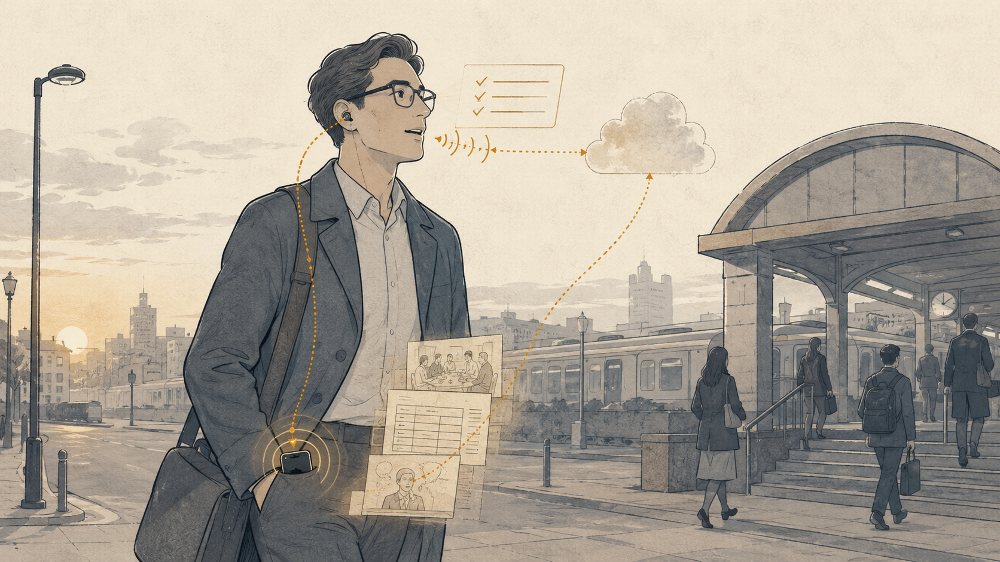
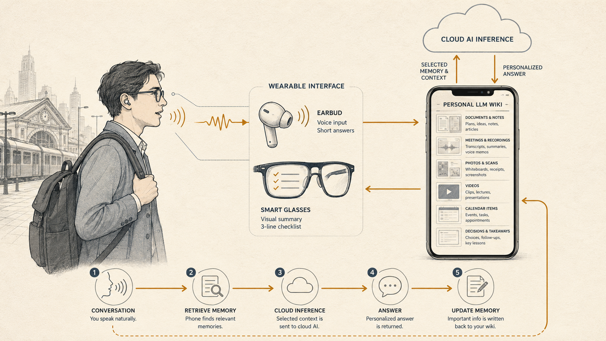

+++
date = '2026-07-25T00:00:00+00:00'
title = "The AI Era May Need a New Division of Labor, Not a New Device"
tags = ['AI', '中文', 'Passport to AI Era']
thumbnail = 'pic.png'
+++

## AI 時代可能不是需要一台新裝置，而是需要一套新的分工思維

Imagine an ordinary morning.

想像一個很普通的早晨。

You are walking toward the station with earbuds in when a question about the afternoon meeting surfaces: "Why did we decide against the second option last time?"

你戴著耳機走向車站，突然想到下午會議裡還有一個問題沒有釐清。你沒有停下腳步，也沒有拿出手機，只是直接問：「上次討論這個專案時，我們最後為什麼沒有選第二個方案？」

The earbuds capture the question. Your phone searches a personal wiki for the relevant meeting notes, earlier comparisons and the concerns you recorded at the time. A cloud model reasons over that context, then returns the answer through your earbuds.

耳機收下你的問題。手機從個人 Wiki 中找出相關的會議紀錄、過去做過的比較，以及你當時記下的顧慮；雲端 AI 根據這些背景完成推理，再透過耳機告訴你答案。

If the answer includes a checklist, your glasses place it quietly in view. If the conversation produces a new decision, the important part is organized and written back to the wiki on your phone.

如果回答裡出現一份需要確認的清單，它會顯示在眼鏡上；如果這次對話形成了新的決定，重要內容則會被整理後寫回手機裡的 Wiki。

From expressing an idea to retrieving memory, receiving an answer and updating that memory, the loop takes less than a minute. You never open an app.

從提出問題、調用記憶、獲得答案，到更新記憶，整個過程可能不到一分鐘。你甚至不需要打開任何 App。

This may be what personal AI looks like when it finally enters everyday life.

這或許就是個人 AI 真正進入日常生活後的樣子。

What matters is that almost none of this requires an entirely new category of hardware. The smartphone, wireless earbuds, mobile networks and cloud AI are already mature. Smart glasses are earlier, but their role is becoming clear.

值得注意的是，這個場景幾乎沒有依賴尚未存在的硬體。手機、藍牙耳機、行動網路、雲端 AI 都已經相當成熟；智慧眼鏡雖然仍在發展，卻也已經能看見清楚的產品方向。

We keep waiting for a single device to define the AI era. The more plausible answer may be the opposite: **the AI era may not need a new device. It may need a new division of labor.**

我們一直在等待一台代表 AI 時代的全新裝置。但真正需要出現的，可能不是另一台裝置，而是一套新的分工思維。

---

## From Opening an App to Expressing Intent // 從「打開 App」到「直接表達」

Using AI today still resembles using conventional software. We unlock a phone, find an app, open a chat box and translate whatever is in our head into a prompt the model can understand. The model may be powerful, but until we begin typing, it knows nothing about what we need.

今天使用 AI，仍然很像在使用一套傳統軟體。我們拿出手機、解鎖、找到 App、打開對話框，再把腦中的想法整理成一段足以讓模型理解的文字。模型可能已經具備強大的推理能力，但在我們真正開始輸入之前，它仍然不知道我們需要什麼。

The friction is not just the number of steps. It is that people must first reshape their thoughts to suit the machine.

這種互動方式的問題，不只是步驟多，而是它要求人先配合機器。

Thought rarely arrives as a finished sentence. It appears as a question, a half-formed judgment or a detail that surfaces while we are walking, driving or working. Turning it into text means stopping, structuring and typing.

人的想法往往不是以完整句子出現。它可能是一個突然浮現的疑問、一段尚未成形的判斷，或是在走路、開車、工作時產生的臨時念頭。要把這些想法轉成文字，我們必須先停下來、整理，再輸入。

Voice shortens that distance. In mobile, hands-busy and real-time situations, speaking is often closer to the speed at which thought occurs. You can think aloud, add context as it comes and correct the AI the moment it misunderstands.

語音縮短了這段距離。在移動、免手持或需要即時反應的情境裡，說話比打字更接近思考發生的速度。人可以一邊想、一邊補充，也可以在 AI 理解錯誤時立即修正。

The keyboard and screen will not disappear. Text remains better for precision, quiet environments and complex editing. The change is subtler: voice moves from an optional feature toward a primary entrance to personal AI.

這不代表鍵盤和螢幕會消失。需要精確編輯、處理複雜資料，或不方便出聲時，文字仍然更適合。真正的改變是：語音會從一項附加功能，逐漸成為個人 AI 的主要入口之一。

You no longer have to "open AI." You simply start talking.

你不再需要特別「打開 AI」。你只是開始說話。

---

## Let the Output Fit the Information // 讓輸出方式配合資訊

Once input expands beyond typing, output should no longer be trapped inside the same chat box.

當輸入從打字延伸到語音，AI 的輸出也不應該永遠停留在同一個對話框裡。

Hearing and sight remain our two most natural channels for receiving information, but they are good at different things. Earbuds suit short answers, reminders, summaries and continuing conversation. They leave the hands free and the eyes on the physical world.

人接收資訊最自然的兩條通道，仍然是聽與看。但兩者適合承載的內容並不相同。耳機適合短回答、摘要、提醒與連續對話。它不會占用雙手，也不需要把視線從現實世界移開。

Glasses are better for information that needs to remain visible for a moment: directions, names, subtitles, comparisons, checklists or a simple chart.

眼鏡則適合需要短暫停留在視野中的資訊：路線、清單、字幕、比較結果、姓名，或一張簡單的圖表。

Smart glasses do not need to begin by building an elaborate augmented world. A more practical role is to place a small amount of important information in front of us at the right time.

未來的智慧眼鏡不必一開始就建構一個覆蓋現實世界的龐大 AR 空間。更實際的角色，是在正確的時間，把少量但關鍵的資訊放到眼前。

Earbuds and glasses are therefore not competing AI devices. They are two interfaces within the same system. Short and immediate information can be heard; information that must be compared or retained can be seen.

因此，耳機與眼鏡並不是兩個彼此競爭的 AI 裝置。它們是同一套系統的兩個輸出介面。短而即時的內容用聽的；需要辨識、比較和保留的內容用看的。

The interface begins adapting to the information, instead of forcing every kind of information onto the same screen.

介面開始配合資訊，而不是要求所有資訊都擠進同一塊螢幕。

---

## Personalization Lives in Memory // 真正的個人化，來自記憶

Voice and glasses alone do not create a personal AI.

只有語音與眼鏡，仍然不足以構成真正的個人 AI。

A general model can explain common project risks. It cannot explain why your team delayed a particular project unless it knows the project history, the people involved, the alternatives discussed and the conditions that mattered when the decision was made.

一個通用模型可以回答「專案管理通常有哪些風險」，卻無法回答「我這個專案上次為什麼決定延後」，除非它知道專案背景、參與者、先前的討論，以及你做決策時在意的條件。

The difference between those two questions is not intelligence. It is memory.

兩個問題之間的差距，不是模型能力，而是記憶。

Most AI interaction is still organized around individual conversations. Even when a system remembers a few preferences, its understanding of "you" is often little more than settings and recent chat history. Real personalization requires a longer record: what you have read, which decisions you made, what you are working on, how you weigh trade-offs, and how those preferences change over time.

今天多數 AI 互動仍然以單次對話為中心。即使系統能記住部分偏好，它所理解的「你」，通常仍只是零散的設定與近期對話。真正的個人化需要更完整、也更長期的脈絡：你讀過哪些資料、做過哪些決定、正在推進哪些工作、如何權衡不同選項，以及你的偏好如何隨時間改變。

That is the role of a Personal LLM Wiki.

這就是 Personal LLM Wiki 的角色。

It may begin with notes, documents, meeting records and articles. As AI moves deeper into daily life, it can expand to photos, voice recordings, videos, screenshots, schedules, receipts, health records and long-running conversations.

一開始，它可能只是筆記、文件、會議紀錄與文章；但當 AI 深入生活，它會逐漸涵蓋照片、語音、影片、截圖、行程、收據、健康紀錄與長期對話。

It preserves not only what happened, but how events, decisions and preferences relate to one another. At that point, the wiki is no longer merely a knowledge base for humans to search. It becomes the memory foundation through which AI understands a person.

它不只保存「發生過什麼」，也保存事情之間的關係，以及一個人長期形成的判斷脈絡。到了那時，Wiki 不再只是給人搜尋的知識庫，而是 AI 理解一個人的記憶基礎。

---

## The Phone as Memory and Control // 手機成為記憶與控制層

Discussions about AI phones often begin with device-side computing: should a large model run directly on the phone, and which tasks should work offline?

談到 AI 手機，討論通常先聚焦在裝置端算力：模型是否要直接在手機上運行？哪些工作可以在離線狀態完成？

For personal AI, however, a more important question may be who controls the memory.

但對個人 AI 而言，更關鍵的問題可能不是「模型在哪裡運行」，而是「個人記憶由誰保管」。

The phone is one of the strongest candidates. It stays close to its owner and already provides local storage, encryption, permissions, networking and connections to surrounding devices. It knows when the earbuds are connected, what the glasses can display and which data a service may access.

手機是最合理的答案之一。它長時間跟著使用者，已經具備成熟的本地儲存、權限管理、加密機制、網路連線與周邊裝置整合能力。它知道耳機何時連線、眼鏡能顯示什麼，也能決定哪些資料可以被調用。

Its role is therefore larger than storage. The phone becomes the memory and control layer of a personal AI system.

因此，手機的角色不只是儲存硬碟，而是整套個人 AI 的「記憶與控制層」。

When a question arrives, the phone retrieves the relevant pieces from the local wiki. With permission, it sends only the context needed for that task to the cloud model. The model does not need a person's entire archive; it needs the right context for the present decision.

當使用者提出問題，手機先從本地 Wiki 中找出必要的背景，再在權限允許下，把與這次任務相關的上下文交給雲端 AI。模型不需要取得一個人的全部資料，只需要取得完成當前任務所需的部分。

The answer returns to the phone, which decides whether it belongs in the earbuds, the glasses or the screen. If the interaction creates a durable fact or decision, the system can organize it, confirm it and write it back to the wiki.

推理完成後，答案回到手機，再由手機決定應該透過耳機、眼鏡或螢幕呈現。若對話產生新的重要資訊，系統也能先整理、確認，再寫回 Wiki。

The result is a continuous loop:

這形成一個持續運作的閉環：

> Express intent → retrieve personal memory → reason in the cloud → return an answer → update memory
>
> 表達意圖 → 調用個人記憶 → 雲端推理 → 回傳答案 → 更新記憶

AI no longer starts from zero each time. The more useful the interaction, the richer the shared context becomes.

AI 因此不再每次都從零開始。互動越多，它對使用者的理解也越完整。

---

## The Cloud Thinks. The Phone Remembers. // 雲端是大腦，手機是記憶

Keeping the personal wiki on the phone does not mean every AI computation must happen there.

把個人 Wiki 放在手機上，不代表所有 AI 運算都必須在手機完成。

Large models require substantial computing resources and keep improving. Cloud inference lets people use stronger, continuously updated models without waiting for a phone to become a data center.

大型模型需要大量算力，也需要持續更新。將主要推理能力放在雲端，可以讓使用者即時調用更強的模型，而不必讓手機承擔所有運算。

The division of labor becomes clear:

這會形成一套清楚的分工：

- **Cloud AI:** reasoning, analysis and generation
- **雲端 AI：**推理、分析與生成

- **Phone:** memory, permissions, indexing and context retrieval
- **手機：**記憶、權限、索引與上下文調用

- **Earbuds:** voice input and immediate audio response
- **耳機：**語音輸入與即時回覆

- **Smart glasses:** concise visual information
- **智慧眼鏡：**視覺資訊

- **The person:** the center of the system
- **使用者：**整套系統的中心

The important question is no longer which device becomes the new protagonist. It is whether data and computation are placed where each belongs. Heavy reasoning goes to the cloud. Private, durable and immediately retrievable memory stays close to the person.

這裡真正重要的，不是哪一台裝置成為新的主角，而是資料與運算被放在最適合的位置。需要大量算力的工作交給雲端；需要隱私、長期保存與即時調用的個人記憶留在身邊。

The model can change as the market evolves. Personal memory should persist. You may use one model today and another tomorrow, while the wiki on your phone remains yours.

AI 的能力可以隨模型進步而更新，但個人的記憶不必跟著每一次模型更換而遷移。今天使用一個模型，明天改用另一個模型，手機裡的 Wiki 仍然屬於使用者自己。

Models are replaceable. Memory must be portable.

模型可以更換，記憶必須能夠延續。

---

## The Missing Layer Is Integration // 我們缺少的不是硬體，而是整合

Break this system into parts and most of them already exist. Phones already combine storage, connectivity, security and peripheral control. Wireless earbuds are worn for hours every day. Cloud models can process voice, text and images in real time. Smart glasses are less mature, but their direction is increasingly visible.

如果把這套系統拆開來看，會發現大部分零件都已經存在。手機已經具備儲存、連線、安全與周邊控制能力；藍牙耳機已經成為許多人每天長時間使用的裝置；雲端模型可以即時處理語音、文字與影像；智慧眼鏡雖然還不如手機成熟，但顯示、相機與語音互動的方向已經逐漸清楚。

What remains unfinished is coordination.

真正尚未完成的，是這些裝置之間的協作。

Which memories can be read? How much context should a task retrieve? What deserves to be written back? When should AI intervene, and when should it remain silent? Should a response be spoken through the earbuds, displayed on the glasses or saved for later?

誰能讀取哪些記憶？一次任務應該調用多少背景？什麼內容值得寫回？AI 何時應該主動提醒，何時應該保持沉默？同一個答案應該透過耳機說出來、顯示在眼鏡上，還是留待稍後處理？

These are not merely hardware questions. They are questions of memory architecture, permissions and interaction design.

這些問題不是單純的硬體問題，而是記憶架構、權限設計與互動邏輯的問題。

The competition may therefore shift from "Who will build the next AI device?" to "Who can turn the devices people already own into the most natural and trustworthy personal AI system?"

未來的競爭重點，也可能因此從「誰打造下一台 AI 裝置」，轉向「誰能把現有裝置整合成最自然、可信任的個人 AI 系統」。

---

## A New Division of Labor // 一套新的分工思維

Every computing transition creates an expectation for a defining device. The PC era had the personal computer. The mobile era had the smartphone. It is natural to ask what device will represent the AI era.

每一次運算平台轉移，都會讓人期待一個代表新時代的硬體。PC 時代有個人電腦，行動時代有智慧手機，因此我們自然會問：AI 時代的代表性裝置會是什麼？

AI may be different.

但 AI 與過去的平台可能不同。

It may not need to concentrate every capability inside one new machine. It may work better as a distributed personal system: the cloud provides intelligence, the phone preserves memory, earbuds carry language, and glasses add a visual layer. Each component does one job well, while the person remains at the center.

它不一定需要把所有能力集中進一台新機器。相反地，它更像一套分散式個人系統：雲端提供智慧，手機保存記憶，耳機承接語言，眼鏡補上視覺，而這些裝置共同圍繞同一個人運作。

This is not a future waiting for a single hardware breakthrough. Most of the pieces are already around us.

這不是一場等待單一硬體突破的未來想像。其中大部分零件，已經在我們身邊。

The turning point comes when we stop treating phones, earbuds and glasses as isolated products and begin seeing them as organs of the same personal AI.

真正的轉折，會發生在我們不再把手機、耳機與眼鏡看成彼此獨立的產品，而開始把它們理解成同一套個人 AI 的不同器官。

The defining AI device may not be a device at all.

AI 時代可能不是需要一台新裝置，而是需要一套新的分工思維。

---

*© Chung-Hao Lee. All Rights Reserved.
All content on this webpage—including but not limited to text, images, design, code, and multimedia materials—is protected under the international copyright treaties. Unauthorized reproduction, modification, distribution, public transmission, or commercial use is strictly prohibited. Legal action will be taken against infringement.*  
*© 李崇豪。保留所有權利。
本網頁之內容（包括但不限於文字、圖片、設計、程式碼及多媒體素材）均受國際著作權條約保護。未經書面授權，嚴禁任何形式之複製、改作、散布、公開傳輸或商業利用。侵權者將依法追訴。*
