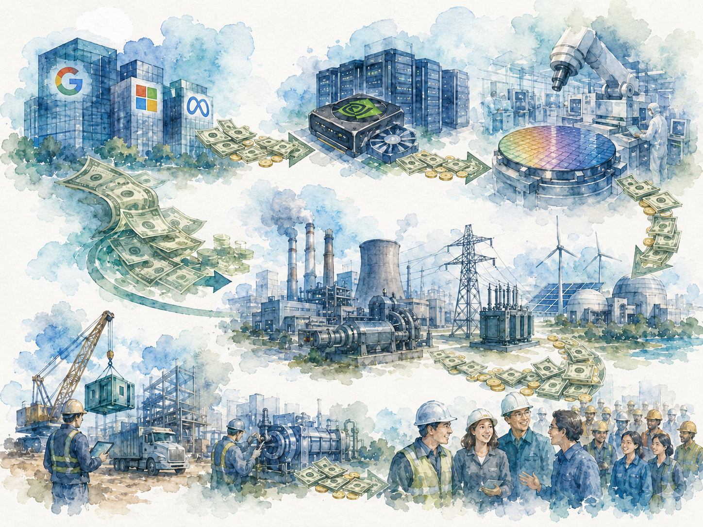

+++
date = '2026-05-29T00:00:00+00:00'
title = "【Passport to AI Era Special Edition】The AI Supply Chain Dividend: The Great Wealth Transfer from Tech Giants"
tags = ['AI', 'Data Center', '中文', 'Passport to AI Era']
thumbnail = 'pic.png'
+++

### **科技巨頭向AI供應鏈的「財富轉移」紅利**

For the past two decades, the most successful business models in Silicon Valley shared a single defining trait: they were asset-light. Google didn't need steel mills. Meta didn't need oil refineries. Microsoft didn't need railroads. Even Amazon, despite its massive logistics network, maintains AWS at its core as a high-margin, digital business with immense free cash flow.

過去二十年，矽谷最成功的商業模式，有一個共同特徵：輕。 Google 不需要鋼鐵廠。 Meta 不需要煉油廠。 Microsoft 不需要鐵路。 Amazon 雖然有物流網路，但 AWS 的核心本質，仍然是一門極高毛利、極高自由現金流的數位生意。

These companies leveraged software, advertising, and cloud services to build the most formidable cash machines in human history. But with the dawn of the AI era, this paradigm has shifted—and it has happened with staggering speed.

它們靠軟體、廣告與雲服務，建立了人類歷史上最強大的現金機器。但 AI 時代開始後，這件事變了。而且變得非常快。

Before 2023, the question investors most frequently asked tech giants was, "How will you spend all that cash?" By 2025, the question became: "Do you have enough cash to keep burning?" This is because AI is fundamentally different from the internet services of the past. You cannot sustain the next generation of AI simply by adding a few more servers; you need an entirely new industrial ecosystem.

2023 年以前，科技巨頭最常被投資人問的問題，是「手上的現金要怎麼花？」 2025 年之後，問題開始變成：「還有沒有足夠的現金可以繼續燒？」因為 AI 並不像過去的網際網路服務。你不能只靠多幾台伺服器，就撐起下一代 AI。 你需要的是一整座新的工業體系。

---

#### **Capital Restructuring: The Extreme Compression of Free Cash Flow // 資本重構：自由現金流的極限壓縮**

Since the debut of GPT-4, the tech industry has undergone a transformation that is simple on the surface but profound at its core: the world’s most profitable software giants have become the world’s most voracious spending machines. From a capital return perspective, these titans are actively dismantling the "asset-light, high-margin" model that has been a textbook standard for years.

這是 GPT-4 問世之後，科技業表面上最簡單、底層卻最劇烈的一個轉變：曾經是地球上最會賺錢的那幾家軟體巨頭，如今變成了地球上最會花錢的機器。從資本回報維度來看，巨頭們正主動拆解過往「輕資產、高毛利」的教科書模型：

* **Free Cash Flow Compression:** In 2024, the "Big Four" generated a combined $237 billion in free cash flow. By 2025, that figure dropped to $200 billion. Analysts project that by 2026, Alphabet’s free cash flow will plummet by nearly 90% to just $8.2 billion, while Amazon’s free cash flow is expected to turn negative, reaching -$17 billion.
* **自由現金流壓縮：** 2024 年四大巨頭合計產出 2,370 億美元的自由現金流，至 2025 年已下滑至 2,000 億美元。機構預測，2026 年 Alphabet 的自由現金流將驟減近九成（僅剩 82 億美元），而 Amazon 的自由現金流甚至將直接轉負，達到負 170 億美元。

* **A Historic Build-out:** According to the latest global infrastructure estimates, we are witnessing a historic cross-industry capital expenditure (CapEx) wave totaling $6.7 trillion. 
* **歷史級建置浪潮：** 根據最新全球基礎設施推估，這是一場累計資本支出（CapEx）高達 6.7 兆美元的歷史級跨界建置。

These trillions of dollars haven't vanished into thin air. Instead, they are being pushed down through a long, heavy, and physically intensive supply chain. To understand this hidden wealth transfer, we can track "a single dollar" from Amazon’s $131.8 billion CapEx in 2025 as it transforms from virtual code into physical steel and power grids.

這些萬億級別的資金並未憑空消失，而是沿著一條漫長、沉重且具實體張力的供應鏈層層下推。要看清這場隱秘的財富轉移，我們不妨追蹤 Amazon 2025 年 1,318 億美元資本支出（CapEx）中的「一塊錢」，觀察它如何從虛擬程式碼，逐步轉化為實體鋼鐵與電網。

---

#### **First Stop: Rewiring the Architecture of Chips and Memory // 第一站：重構晶片與記憶體的深層架構**

The first stop for this dollar is, inevitably, Nvidia in Santa Clara. The majority of the data center expenditures from the four cloud giants eventually converge here. Nvidia’s data center division saw its quarterly revenue explode from $3.8 billion at the end of 2022 to $51.2 billion just three years later, with its stock price surging over 13 times in the same period.

這塊錢的首站，毫無懸念地匯流至 Santa Clara 的 Nvidia。四大雲端巨頭的資料中心支出，最終多數在此集散。Nvidia 資料中心部門單季營收從 2022 年底的 38 億美元，三年後暴增至 512 億美元，股價同期漲逾十三倍。

But Nvidia is merely a hub for capital redistribution. The cash flow continues to ripple downward into the hardware ecosystem:

但 Nvidia 僅是資本的中轉樞紐。金流隨後進一步向下游硬體生態系擴散：

* **Foundries and Photolithography:** Capital flows into Taiwan, driving TSMC’s revenue from $69 billion in 2023 to $117 billion in 2025. AI accelerators, which were a rounding error in TSMC’s portfolio two years ago, now account for 17–19% of wafer revenue. Simultaneously, nearly half of the €32.7 billion ASML earned in 2025 came from selling EUV (Extreme Ultraviolet) machines to TSMC and SK Hynix.
* **晶圓代工與光刻設備：** 資金流入台灣，推動台積電營收從 2023 年的 690 億美元爆發至 2025 年的 1,170 億美元，AI 加速器已霸佔晶圓營收的 17% 至 19%。同時，荷蘭 ASML 在 2025 年斬獲的 327 億歐元營收中，亦有近半來自賣給台積電與 SK 海力士的 EUV 極紫外光刻機。

* **High Bandwidth Memory (HBM):** SK Hynix leveraged HBM technology to reverse a 9 trillion won loss in 2023 into a historic 19.8 trillion won profit in 2024. Micron’s HBM business also saw its annualized revenue soar to $8 billion by the end of FY2025.
* **高頻寬記憶體（HBM）：** SK 海力士憑藉 HBM 技術逆轉 2023 年 9 兆韓元的虧損，於 2024 年創下獲利 19.8 兆韓元的公司史神話；美光的 HBM 業務年化營收也在 FY2025 年底衝上 80 億美元。

---

#### **Second Stop: Hitting the Hard Constraints of the Physical World—Power and Heavy Industry // 第二站：撞上物理世界的硬約束——電力與重工業**

After moving at high velocity through the IT hardware layer, this capital eventually hits the rigid barriers of the physical world. Moving beyond chips and servers, the money begins to flood into traditional heavy industries and energy infrastructure—sectors that have long been far from the tech spotlight.

當資本在 IT 硬體層高速運轉後，隨即撞上物理世界最嚴峻的瓶頸。資金越過晶片與伺服器，開始湧入長年遠離科技聚光燈的傳統重工業與能源基礎設施。

The market once anticipated that improvements in model efficiency (such as DeepSeek drastically lowering the cost per token) would curb infrastructure demand. However, the **"Jevons Paradox"** has proven true once again: as the unit cost of computation drops, it triggers a tipping point for large-scale enterprise deployment of AI agents, causing total demand for compute and energy to increase rather than decrease.

市場曾預期，模型效率的提升（如 DeepSeek 大幅壓低單 token 成本）將抑制基礎設施需求。然而，**「傑文斯悖論（Jevons Paradox）」**再次應驗：單位運算成本的下降，反而觸發企業大規模部署 Agent 的臨界點，導致總算力與總能耗需求不減反增。

By 2030, global data center power capacity is projected to expand from 60 GW in 2023 to between 171 and 219 GW. The true bottleneck of this trillion-dollar gamble shifted in late 2025 from semiconductor nodes to physical power grids and heavy electrical equipment. Consider the "Stargate" project—a $500 billion, 10 GW collaboration between OpenAI, Oracle, and SoftBank. Its massive capital is currently forced into a long queue in the physical world.

預估至 2030 年，全球資料中心電力容量將從 2023 年的 60 GW 擴張至 171–219 GW。這場兆美元級賭局的真正瓶頸，已於 2025 年下半年明確從半導體製程，轉移至實體電網與重型電氣設備。以 OpenAI、Oracle 與軟銀聯手砸下 5,000 億美元、佈局 10 GW 容量的「Stargate」超級專案為例，其龐大的資金正被迫在物理世界中漫長排隊。

Traditional energy and heavy industry giants are seeing an unprecedented windfall from this capital spillover:

傳統能源與重工巨頭因此迎來了源源不絕的財富外溢：

* **Cooling and Power Distribution:** Vertiv’s quarterly revenue grew 35% year-over-year in 2025, with its backlog swelling to a record $15 billion by 2026. U.S. data centers already consume 4% of the nation’s electricity, a figure expected to double by 2030. To bypass the long wait times for grid connection, tech giants are increasingly building "Behind-the-Meter" microgrids.
* **液冷與電力分配：** Vertiv 2025 年單季營收年增 35%，至 2026 年其在手訂單（backlog）已積壓至歷史新高的 150 億美元。目前美國資料中心已吃掉全國 4% 的用電量，2030 年預估翻倍。為繞過高昂的併網排隊時間，巨頭們紛紛於場內自建微電網（Behind-the-Meter）。

* **Heavy Electrical Equipment:** In Q1 2026, GE Vernova’s backlog for heavy gas turbines hit $163 billion, while Siemens Energy’s order book reached a historic high of €136 billion.
* **重型電力設備：** 2026 年第一季，GE Vernova 的重型燃氣輪機在手訂單衝破 1,630 億美元；Siemens Energy 的訂單簿亦創下 1,360 億歐元的歷史新高。

* **Base-load Energy (Nuclear and Fuel Cells):** Constellation Energy signed a 20-year deal to restart the Three Mile Island nuclear plant specifically for Microsoft, while Vistra is providing 2.2 GW of nuclear power for Meta’s AI clusters. Bloom Energy, with its fuel cells capable of native 800 VDC output to power NVIDIA Rubin racks, secured over 4 GW in power generation orders from AEP and Oracle.
* **基載能源（核能與燃料電池）：** Constellation Energy 簽下 20 年黃金合約為 Microsoft 重啟三哩島核電廠；Vistra 則為 Meta 的 AI 超級叢集提供高達 2.2 GW 的核能供電。Bloom Energy 憑藉能直接為 NVIDIA Rubin 機架供電的原生 800 VDC 輸出燃料電池，一口氣斬獲 AEP 與 Oracle 等超過 4 GW 的主動發電訂單。

---

#### **Final Stop: Capital Reaching the Real-World Payroll // 終點站：財富流向實體世界的薪資單**

As this capital flows through chip designs, advanced packaging, liquid cooling pipes, gas turbines, and transformer factories, it finally reaches the end of the supply chain, where the "virtual" and "high-margin" labels of the tech industry are stripped away. It transforms into tangible profit and compensation within the real economy.

當這塊錢穿透了晶片設計、異質封裝、液冷管線、重型燃氣輪機與變壓器工廠，最終落到供應鏈末端時，它已經徹底洗去了「科技業」高毛利、虛擬化的代碼色彩。它轉化成了實體經濟中最真實的利潤與報酬：

* The night-shift wages of an electrical worker in Texas rushing to complete a "Behind-the-Meter" power plant.
* 德州工人在 Behind-the-Meter 自建電廠徹夜趕工的夜班薪水。
* The profits of a transformer contractor in Wisconsin seeing a full order book for the first time in thirty years.
* 威斯康辛州變壓器承包商三十年來第一次接單接到手軟的工廠利潤。
* The wages of copper miners in Arizona.
* 亞利桑那州銅礦工人的勞動報酬。
* The structural salary shifts for frontline engineers in tech manufacturing.
* 科技製造業基層工程師的薪資結構洗牌。

Take the semiconductor manufacturing industry as an example: at TSMC in Hsinchu Science Park, average annual salaries jumped from NT$3.57 million in 2024 to NT$4.09 million in 2025— a 23% increase. This same "salary dividend" is playing out for HBM packaging line engineers at SK Hynix and Micron.

以半導體製造業為例，新竹科學園區台積電員工的平均年薪，從 2024 年的新台幣 357 萬，在 2025 年暴漲 23% 至新台幣 409 萬。同樣的薪資紅利劇本，也正在 SK 海力士與美光的 HBM 封裝線工程師身上全面複製。

While the public often focuses on the anxiety of potential monopolies at the software and cloud layers, a look at the physical "AI Factory" infrastructure chain reveals the opposite: a few software giants, who have earned the most immense profits in global markets, are now taking a decade of accumulated wealth and pushing it—forcefully and irreversibly—outward through a massive physical supply chain.

大眾只看到 AI 經濟在軟體與雲端層面似乎呈現出壟斷的焦慮，但如果將視角擴大到「AI 工廠基礎設施」的物理全鏈，它的本質恰恰相反——少數幾家在全球市場賺取最豐厚利潤的軟體巨頭，正在將他們過去十年累積下來的驚人利潤，順著這條長長的實體供應鏈，強行且不可逆地向外推擠。

AI is redistributing the profits once concentrated in the hands of Silicon Valley giants across the global supply chain. This is why AI is not the "winner-take-all" scenario many imagine. It is more like a massive capital spillover. A few giants are taking the cash accumulated over the past dozen years and pushing it, layer by layer, through AI infrastructure and into the global industrial system.

AI 正在把過去集中在矽谷巨頭手上的利潤，重新分配到全球供應鏈。這也是為什麼，AI 並不像大家以為的是「winner-take-all」。它更像是一場超大型的資本外溢。少數幾家巨頭，正在把過去十幾年累積的現金，透過 AI 基礎設施，一層一層推向全球工業體系。

And this wealth transfer may have only just begun.

而這場財富轉移，可能才剛開始。

---
*© Chung-Hao Lee. All Rights Reserved.
All content on this webpage—including but not limited to text, images, design, code, and multimedia materials—is protected under the international copyright treaties. Unauthorized reproduction, modification, distribution, public transmission, or commercial use is strictly prohibited. Legal action will be taken against infringement.*  
*© 李崇豪。保留所有權利。
本網頁之內容（包括但不限於文字、圖片、設計、程式碼及多媒體素材）均受國際著作權條約保護。未經書面授權，嚴禁任何形式之複製、改作、散布、公開傳輸或商業利用。侵權者將依法追訴。*
