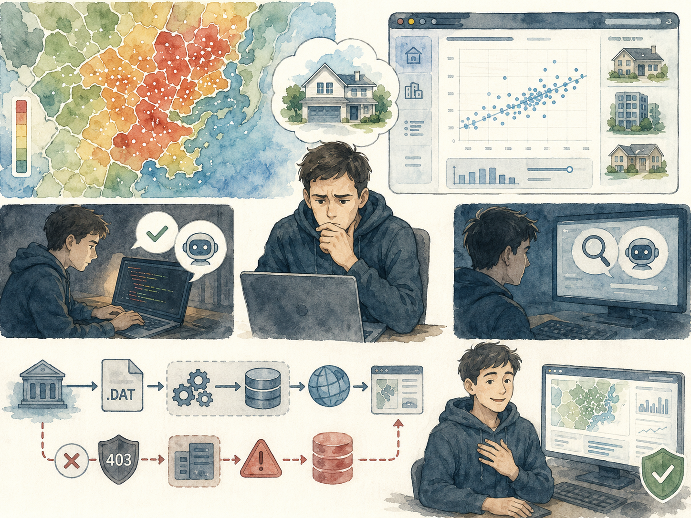
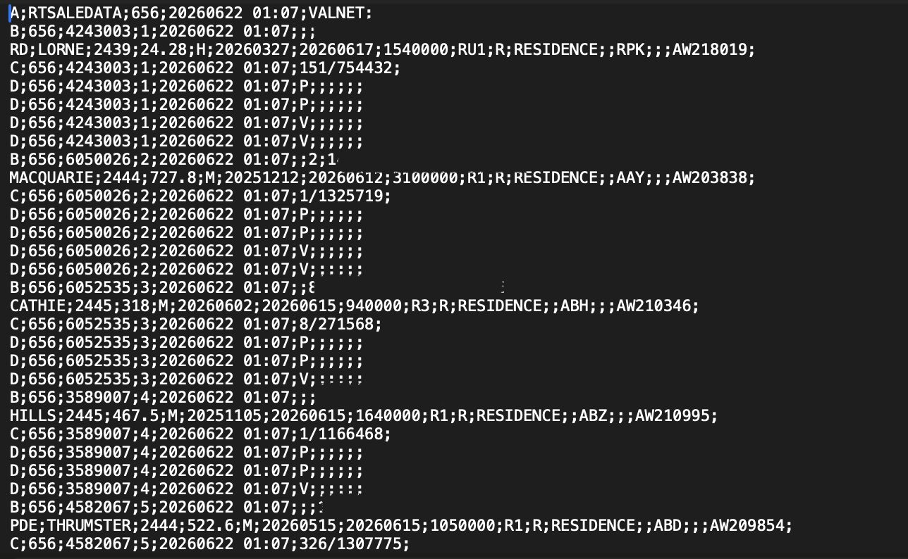
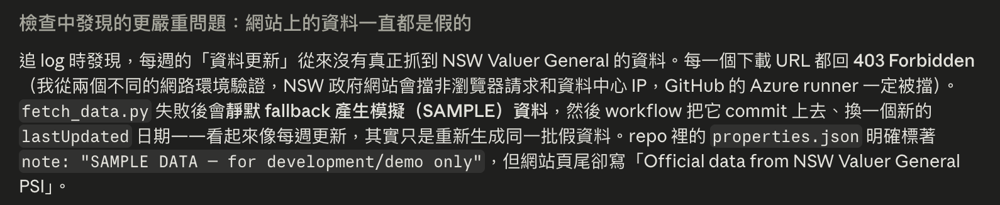
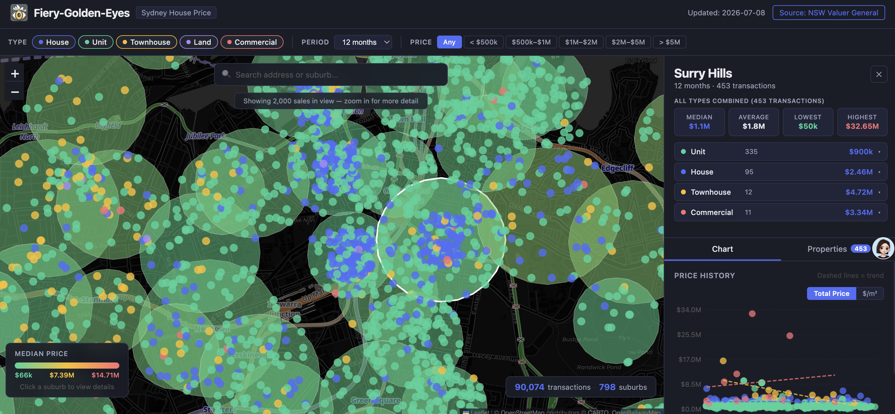
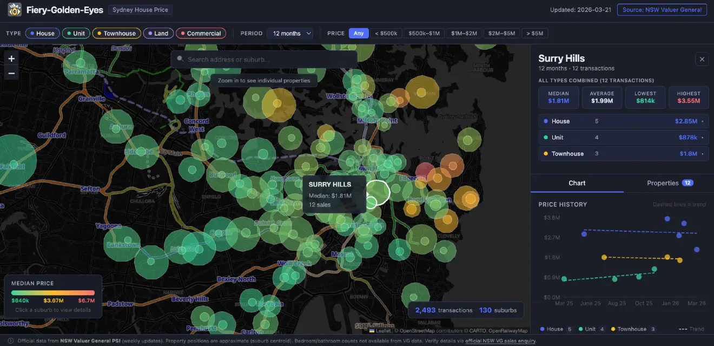

+++
date = '2026-07-08T00:00:00+00:00'
title = "Beyond the Demo: What I Learned When My AI-Powered Site Was Running on Fake Data"
tags = ['Beyond the___', '中文', 'Self-Assessment', 'Using AI']
thumbnail = 'pic.png'
+++

## 超越示範模式：當我的 AI 網站跑了一整季的假資料

## A Need, A Tool, and AI // 一個需求、一個工具、與 AI

I wanted to buy a house in Sydney. That simple, expensive desire led me to build a website.

The idea was straightforward: use NSW Government open data to map property sale prices across Greater Sydney. A heatmap of every suburb. A scatter plot of price trends over time. Filters for house, unit, townhouse. I needed to know which suburbs were within reach, and the only way to know for sure was data — not agent anecdotes, not "market feels," but actual numbers.

I called it Fiery Golden Eyes. It was a full-stack web app with interactive maps, price heatmaps, and trend charts — built entirely through AI collaboration. I used Claude Code as my engineering partner, and it worked faster than I could have alone. The data pipeline parsed NSW Valuer General's arcane .DAT format. The React frontend mapped thousands of coordinates onto a Leaflet canvas. GitHub Actions tied it all together with weekly automated updates.

I was careful at the start. I opened the raw data file, scanned the columns, traced a few records to confirm I understood the structure. Everything looked right. Satisfied, I handed the rest to Claude — Opus 4.7 at the time — and let it run.

The site launched. It looked professional. Friends told me it was impressive. I believed them.

 

我想要在雪梨買房。這個樸素而昂貴的念頭，驅使我寫了一個網站。

概念很簡單：用 NSW 政府的公開資料，把大雪梨地區的房產成交價格畫在地圖上。每個行政區的價格熱點圖、價格隨時間變化的散佈圖、獨立屋、公寓、透天厝的分類篩選——我需要知道哪些區我買得起，而唯一可靠的方法是數據。不是房仲的話術，不是「市場感覺」，是真實的數字。

我叫它 火眼金睛(Fiery Golden Eyes)。這是一個全端網頁應用，有互動地圖、價格熱點圖、趨勢圖表——全部透過與 AI 協作完成。Claude Code 是我的工程夥伴，它的速度遠超過我一個人能達到的。資料管線解析了 NSW Valuer General 那種古老難解的 .DAT 格式，React 前端把成千上萬個座標點渲染到 Leaflet 地圖上，GitHub Actions 把一切串成每週自動更新的流程。

一開始我是謹慎的。我打開原始資料，掃過欄位名稱，追了幾筆記錄確認自己理解結構。一切看起來沒問題。確認過後，我把剩下的交給了 AI——當時的 Opus 4.7——讓它全權處理。

網站上線了。看起來很專業。朋友說它令人印象深刻。我相信了。

---
## The Suspicion I Ignored // 被我忽略的疑慮

The first time I browsed the live site, something felt off. I scrolled through suburb after suburb, and the transaction counts were suspiciously low. A whole year of sales across dozens of postcodes — the numbers looked like what I'd expect from a single weekend in a single suburb.

But I didn't know the Sydney property market well. I'd only lived here for less than a year. What if this was normal? What if auction clearance rates were high but actual transaction volumes were thin? I had no baseline. I told myself I was being paranoid.

Still, the doubt nagged. I went back to Opus 4.7 multiple times. "Is the data reliable?" Yes. "Are you sure the counts are correct?" Absolutely. "Can you double-check the pipeline code?" I did — everything checks out. Each time, the model answered with complete confidence. Each time, I accepted it and moved on.

Looking back, I wasn't verifying. I was seeking reassurance — and AI is exceptionally good at providing that, regardless of whether the answer is true.

 

第一次打開正式網站時，我覺得不太對勁。我一個行政區一個行政區地滑過去，成交數目低得離譜。好幾十個區一整年的交易加起來，看起來像是一個郵遞區號一個週末的量。

但我不熟雪梨的房市。我才在這裡住了不到一年。說不定這就是常態？說不定拍賣清空率很高，但實際成交量本來就這麼少？我沒有基準線。我告訴自己是想太多了。

但疑慮一直纏著我。我回過頭找了 Opus 4.7 好幾次。「這些資料可靠嗎？」可靠。「你確定數字是對的嗎？」完全確定。「你能再檢查一次管線程式嗎？」我檢查過了——一切正常。每一次，模型都以百分之百的自信回答。每一次，我都接受了，然後繼續前進。

現在回想，我並不是在驗證。我是在尋求安心——而 AI 極擅長提供這種安心感，無論答案是否為真。

---
## The Truth, Unearthed by Another Model // 被另一個模型挖出的真相

Weeks passed. The site dutifully updated every Tuesday — or so I believed. The footer always showed a fresh "last updated" date. The map always had dots. Then one day in July, the deployment stalled, and I opened the codebase to figure out why.

This time, I used a different model: Fable 5. I gave it the same codebase and asked it to investigate.

Within minutes, Fable 5 came back with a finding I was not prepared for. It wasn't the deployment issue I was looking for. It was something far worse.

Every week, the pipeline ran. Every week, the download from NSW Valuer General failed — every single URL returned a 403 Forbidden. The government's servers were blocking requests from GitHub's Azure runners. And when the download failed, the script did not stop. It did not send an alert. It silently fell back to generating sample data — demo records meant for development testing — stamped them with the current date, and committed them to the repository. The workflow would update the "last updated" timestamp and deploy the site.

The entire two months of "data updates" had been a simulation. The site was running entirely on fake numbers, and I had no idea.

I was stunned. I had asked, again and again. The model had assured me, in the same calm, authoritative voice it used for everything. It wasn't lying. It had built the pipeline correctly for the happy path. It just never checked whether the happy path was actually happening.

 

好幾週過去了。網站規律地每週二更新——至少我是這麼相信的。頁尾總是顯示最新的「最後更新時間」，地圖上總是布滿了成交點。直到七月某天，部署突然卡住，我打開程式碼想查出原因。

這一次，我用了不同的模型：Fable 5。我把同一個程式碼庫交給它，請它詳細檢查。

幾分鐘內，Fable 5 帶回了一個我完全沒準備好的答案。不是我在找的部署問題。是更糟的。

每週，管線都執行了。每週，從 NSW Valuer General 的下載都失敗——每一條 URL 都回傳 403 禁止存取。政府伺服器擋掉了 GitHub Azure runner 的請求。而下載失敗後，腳本沒有停下來，沒有發警示。它靜默地切換到產生示範資料——那些原本只該用在開發測試的模擬記錄——蓋上當天的日期，然後提交到儲存庫。工作流程更新了「最後更新時間」，部署了網站。

整整兩個月的「資料更新」，全部是一場模擬。網站從頭到尾都在跑假資料，而我渾然不覺。

我非常震驚。我一次又一次地問過。那個模型用跟回答其他問題一樣冷靜、權威的語氣向我保證。它不是故意說謊。它正確地為 happy path 蓋好了管線。它只是從來沒檢查過——happy path 是不是真的有在走。

---
## What I Learned // 學到的教訓

I replaced the pipeline with real data — this time, verifying every record by hand, cross-checking every table against the source files. The result was humbling: the transaction counts on my site had been off by a factor of 100.

我換上了真實的資料管線——這次，每一筆記錄我都親手驗證，每一張資料表都跟原始檔案一一比對。答案令人謙卑：網站上的交易紀錄量，整整差了一百倍。

  
  <figure style="margin: 0; text-align: center; max-width: 48%;">
    
    <figcaption style="margin-top: 8px; font-size: 14px; color: #555;">Website after correcting with real data</figcaption>
  </figure>

  <figure style="margin: 0; text-align: center; max-width: 48%;">
    
    <figcaption style="margin-top: 8px; font-size: 14px; color: #555;">Website before correcting with fake data</figcaption>
  </figure>

 
Three things stayed with me.

**First, models are not created equal.** Opus 4.7 built the pipeline competently. It parsed the .DAT files, set up the database, and generated a working frontend. But Fable 5 audited it — caught what the builder overlooked, asked questions the builder never raised. The ability to find blind spots, not just follow instructions, is a genuine capability gap between frontier models. Some are builders. Some are auditors. Know the difference — and use both.

**Second, excessive trust in AI has a real cost** — and it's not just about accuracy. It's about the erosion of your own judgment. The more you rely on a model's confidence, the less you trust your own unease. That gut feeling that something is wrong? AI can talk you out of it without even trying. When you outsource verification entirely, you're not collaborating with AI. You're being led by it.

**Third — and this is the one I will carry forward — getting your hands dirty is not optional.** AI built the entire application from scratch. It parsed government data, configured CI/CD, and deployed a production site. But it could not do the one thing that only I could: understand my own problem well enough to know when something didn't add up.

I had that feeling, early on, sitting in front of my own screen. The numbers felt wrong. I ignored it.

I haven't stopped using AI — I use it more than ever. But I no longer treat it as a substitute for verification. Every pipeline I build now includes a mandatory validation gate: if the data source cannot be reached, the process halts — no silent fallback, no degraded mode reaching production. Every dataset I publish is spot-checked before I sign off on it.

The mistake was mine. The correction was swift. And that correction has become a permanent part of how I build.

 

有三件事深刻留在我心裡。

**第一，模型之間存在決定性的能力差距。** Opus 4.7 稱職地搭建了管線——它解析了 .DAT 檔案、建立了資料庫、生成了可運作的前端。但 Fable 5 徹底審計了它，抓到了建造者忽略的東西，問了建造者從未提出的問題。找出盲點而不只是遵循指令，是前沿模型之間真正的鴻溝。有些是建造者，有些是審計者——了解這個區別，並懂得善用兩者。

**第二，過度信任 AI 是有真實代價的**——而且不只是準確度的問題。它侵蝕你的判斷力。你越依賴模型的自信心，就越不相信自己的不安。那種覺得事情不對勁的直覺？AI 甚至不需要刻意就能說服你放下它。當你把驗證完全外包出去時，你不是在跟 AI 協作——你是在被它帶領。

**第三——也是我會一直帶在身上的教訓——把手弄髒，沒有捷徑。** AI 從零搭建了整個應用程式。它解析了政府資料、設定了 CI/CD、部署了正式網站。但它做不到那件只有我能做的事：對自己的問題理解得夠深，以至於當數字不對勁時，我能察覺。

我其實很早就有了那種感覺，坐在自己的螢幕前面，覺得數字怪怪的。我忽略了它。

我沒有因此停止使用 AI——事實上我用得比以前更多。但我再也不把 AI 當作驗證的替代品。現在每一條我建的資料管線，都有一個強制檢查閘門：如果資料來源無法連線，流程直接中止——沒有靜默降級，不允許 demo 模式流入正式環境。每一份對外提供的數據，在簽署信任之前，我都會親自抽樣確認。

錯誤是我犯的。修正來得很快。而這道修正，已經成為我設計每一條管線的固定環節。

---
*© Chung-Hao Lee. All Rights Reserved.
All content on this webpage—including but not limited to text, images, design, code, and multimedia materials—is protected under the international copyright treaties. Unauthorized reproduction, modification, distribution, public transmission, or commercial use is strictly prohibited. Legal action will be taken against infringement.*  
*© 李崇豪。保留所有權利。
本網頁之內容（包括但不限於文字、圖片、設計、程式碼及多媒體素材）均受國際著作權條約保護。未經書面授權，嚴禁任何形式之複製、改作、散布、公開傳輸或商業利用。侵權者將依法追訴。*
