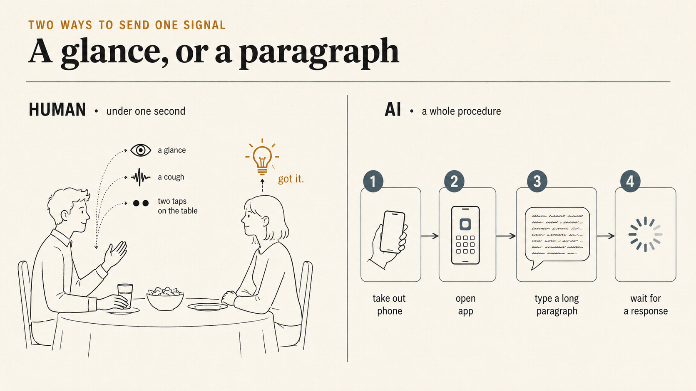
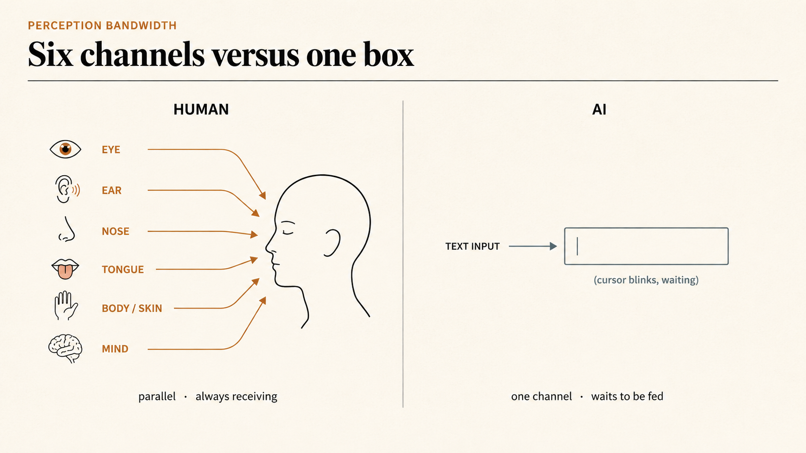
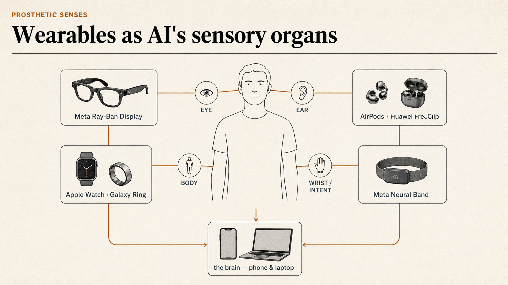
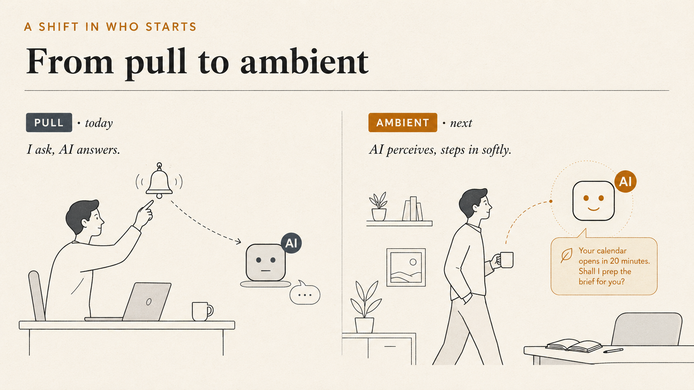
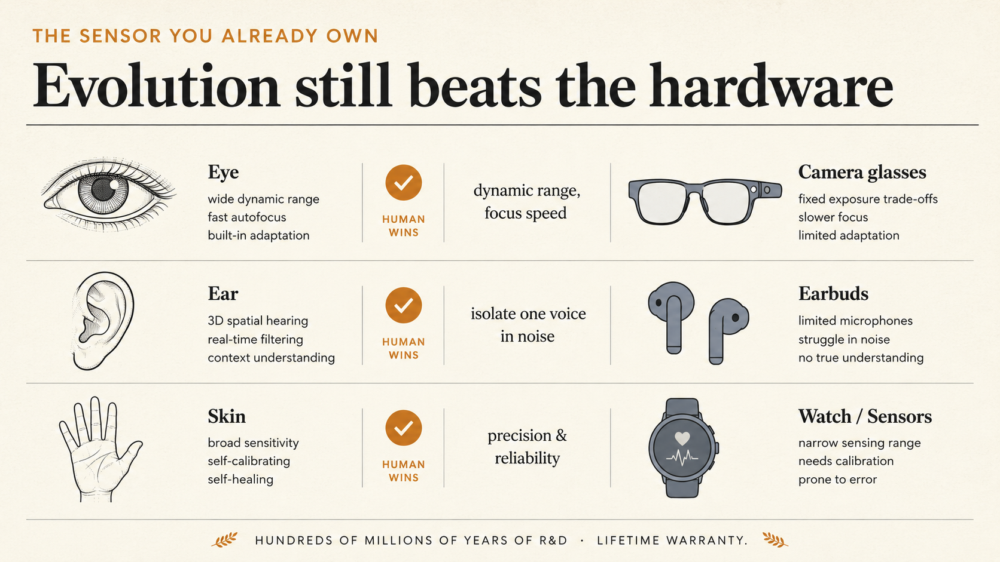
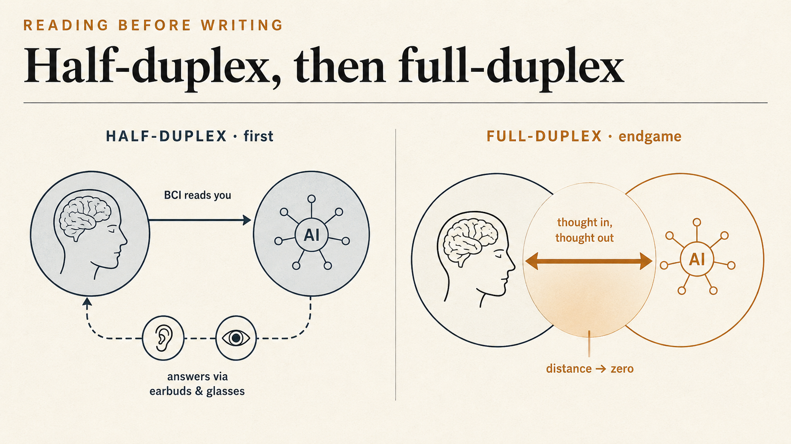

+++
date = '2026-07-17T00:00:00+00:00'
title = "When AGI Moves In: The Two-Stage Roadmap to Human-AGI Coexistence"
tags = ['AI', '中文', 'Passport to AI Era']
thumbnail = 'pic.png'
+++

Picture a family dinner. An elder is about to steer the conversation toward a sensitive topic. Across the table, your partner catches your eye, clears their throat softly, and taps a finger twice on the table. You understand instantly — change the subject, now.

想像一個場景：家庭聚餐，長輩正要開口聊某個敏感話題。坐你對面的伴侶看了你一眼，輕咳了一聲，指尖在桌面輕輕點了兩下。你瞬間懂了——換話題，現在。

The whole exchange takes under a second. Not a single word is spoken.

整個過程不到一秒，沒有一個字。

Now run the same task through the smartest AI on earth: "If anyone brings up that thing later, remind me to steer the conversation away." First, take out your phone. Open the app. Type out the entire backstory — who is involved, what counts as "that thing," what "steering away" means. By the time you hit send, the conversation has already moved on.

現在換一個場景：你想讓世界上最聰明的 AI 幫你做同一件事——「待會如果有人提到那件事，提醒我岔開」。你得先掏出手機、打開 App、打字描述整個背景：對方是誰、什麼算「那件事」、什麼叫「岔開」。等你按下送出，話題早就聊完了。

This is the absurdity of human-AI interaction today: the model's intelligence compounds by the month, while the bandwidth of the interaction is still stuck in the typewriter era. At the end of my previous piece, [*Product Decoder: Google's AI Pointer*](/posts/product-decoder_google-ai-pointer/), I left a question hanging: if the mission of every interface is to shorten the distance between intent and action, the endpoint of that distance is zero — and when that day comes, where does the interface retreat to?

這就是今天人與 AI 交互的荒謬之處：模型的智力一日千里，交互的帶寬卻停在打字機的時代。上一篇[《Product Decoder: Google's AI Pointer》](/posts/product-decoder_google-ai-pointer/)的結尾我留了一個問題：如果介面的使命是縮短「意圖」與「行動」之間的距離，那這個距離的終點是零——到那一天，介面會退到哪裡去？

In this piece, I want to run the timeline all the way to the end — a serious flight of imagination. But imagination is not fantasy: every step below stands on hardware and technology that already exists today.

這一篇，我想認真地把時間軸拉到底，狂想一次。但狂想不等於空想——每一步，我都會踩在今天已經存在的硬體與技術上。

---

## The Interface Is a Translation Layer // 介面的本質：一層翻譯

Push the previous piece's conclusion one step further. An interface is, at its core, a **translation layer**. Human intent is continuous, fuzzy, multi-dimensional; machine execution is discrete, precise, single-threaded. The interface stands in between, translating the former into the latter.

先把上一篇的結論再往下推一步。介面的本質是**翻譯層**——人的意圖是連續的、模糊的、多維的；機器的執行是離散的、精確的、單線的。介面站在中間，把前者翻譯成後者。

In the punch-card era, that translation layer was as thick as a wall: intent had to be translated into a program, then into hole positions, and the answer came back the next day. The CLI thinned the wall into a door. The GUI turned the door into a window. Touch turned the window into a film — for the first time, your finger "directly touched" the digital world. And the chat box changed the language of translation into your mother tongue.

打孔卡時代，這層翻譯厚得像一堵牆：你得先把意圖翻成程式、再翻成孔位，隔天才知道結果。CLI 把牆變薄成一扇門，GUI 把門變成一扇窗，觸控把窗變成一層膜——你的手指第一次「直接碰到」了數位世界。而對話框，把翻譯的語言換成了母語。

Every generation of interface makes the translation layer thinner. So what comes next? The answer depends on seeing clearly where today's AI is actually stuck.

每一代介面，都在讓這層翻譯變薄。那麼下一步呢？下一步的答案，取決於我們先看清一件事：今天的 AI，到底卡在哪裡。

---

## AI's Real Bottleneck: Perception, Not Intelligence // AI 的根本瓶頸：不是智力，是感知

Today's AI has a trait that rarely gets stated plainly: it is **spoon-fed**. However powerful the model, everything it knows about your world comes from the fragment of text or the screenshot you actively hand it. Stop feeding it, and it is a brain floating in a vacuum — brilliant, but deaf and blind.

今天的 AI 有一個很少被正視的特徵：它是「等餵型」的。不管模型多強，它對世界的全部認知，來自你主動塞給它的那一小段文字、那一張截圖。你不餵，它就是一顆漂浮在真空裡的大腦——聰明，但又聾又盲。

Now look at humans. Buddhism names the **six roots** of perception — eye, ear, nose, tongue, body, and mind — six channels that never stop receiving, in parallel, cross-checking one another. Return to the dinner table: the reason you "got it" within a second rests on three conditions stacking together:

對比一下人。佛家講**六根**——眼、耳、鼻、舌、身、意——人的六個感知通道，無時無刻不在接收，而且是並行的、連動的。回到開場那個餐桌場景，你之所以能在一秒內「會意」，靠的是三個條件的疊加：

- **Multiple senses online at once.** The glance (sight), the cough (hearing), the table taps (touch) arrive simultaneously and confirm one another. Any single signal might be missed; stacked together, the message is unambiguous.
- **多感官同時在線。** 眼神（視覺）、輕咳（聽覺）、敲桌（觸覺震動）三路訊號同時進來，互相印證。單獨任何一路都可能被忽略，疊加起來就是明確的訊息。

- **A shared history.** You can read that glance because you both lived through the awkwardness of the last dinner. Without shared memory, no amount of sensing decodes the meaning.
- **共享的歷史。** 那個眼神你看得懂，是因為你們共同經歷過上次聚餐的尷尬。沒有共同記憶，再多感官也解不出語意。

- **Proactive understanding.** Your partner didn't "summon" you, and you weren't answering a query. You were perceiving in the background all along, and you activated yourself at exactly the right moment.
- **主動會意。** 對方沒有「呼叫」你，你也不是被提問才回答。你一直在背景裡低功耗地感知著，在正確的時機自己啟動。

Hold today's AI against these three conditions: for senses, it has one text box; for memory, nearly every conversation starts from zero; for proactivity — none. Until you hit send, it is silent forever.

拿這三條去對照今天的 AI：感官，只有一個文字輸入框；記憶，每次對話幾乎從零開始；主動性，零——不點送出，它永遠沉默。

So AI's next leap has little to do with parameter counts. **It is about completing its perception.** And I believe that happens in two clearly distinct stages.

所以 AI 的下一步，跟模型參數無關。**是把感知補齊**。而補齊的路徑，我認為會分成清楚的兩個階段。

---

## Stage One: Prosthetic Senses — Wearables as AI's Sensory Organs // 階段一：外掛五根——穿戴裝置是 AI 的感官

Stage one has already begun — you are probably wearing it.

第一階段已經開始了，而且你大概已經穿在身上。

Look at the hottest hardware of the moment, and a clear pattern appears: each product maps onto one of the six roots.

看看現在最紅的幾樣硬體，會發現一個清楚的模式——每一樣，都剛好對應人的一根：

- **Eye → AI glasses**: Meta's Ray-Ban partnership is the most successful category so far; the latest Ray-Ban Display even builds a screen into the lens. The camera sees what you see; the lens overlays AI's response onto your field of view.
- **眼 → AI 眼鏡**: Meta 與 Ray-Ban 合作的智慧眼鏡是目前最成功的品類，最新的 Ray-Ban Display 甚至在鏡片裡內建了顯示器：鏡頭看見你所看，鏡片把 AI 的回應疊在你的視野上。

- **Ear → smart earbuds**: AirPods Pro already do live translation and hearing assistance; Huawei's FreeClip uses a clip-on design you can wear all day. "All-day in-ear" is precisely the point — it is AI's resident microphone and speaker.
- **耳 → 智慧耳機**: AirPods Pro 已經能做即時翻譯與助聽；華為的 FreeClip 用夾耳式設計讓耳機可以整天戴著不摘。「全天候在耳」正是重點——它是 AI 的常駐麥克風與喇叭。

- **Body → watches and rings**: Apple Watch, Galaxy Ring — devices pressed against your skin, reading heart rate, temperature, motion. Through them, AI "touches" the state of your body.
- **身 → 手錶與指環**: Apple Watch、Galaxy Ring 這些貼著皮膚的裝置，量的是心率、體溫、動作——AI 藉此「摸到」你的身體狀態。

- **The outpost of the mind → the neural wristband**: The most remarkable item is the Neural Band that ships with Ray-Ban Display: an EMG wristband that reads not movement but the **neural electrical signals** traveling from brain to wrist — the command is issued before the finger actually moves. It no longer reads behavior; it reads the downstream of intent.
- **意的前哨 → 神經腕帶**: 最值得注意的是 Ray-Ban Display 附的 Neural Band：一條 EMG 腕帶，讀的不是動作，而是從大腦傳到手腕的**神經電訊號**——手指還沒真的動，指令已經發出。它讀的已經不是行為，是意圖的下游。

- **Brain → the phone and laptop**: All these sensory streams converge on the compute hub in your pocket.
- **腦 → 手機與筆電**: 這一整套感官的訊號，最後匯流到口袋裡那顆算力中樞。

Glasses are a prosthetic eye; earbuds a prosthetic ear; the watch a prosthetic body. **The essence of wearables is to graft the five senses onto AI.**

眼鏡是外掛的眼，耳機是外掛的耳，手錶是外掛的身——**穿戴裝置的本質，是替 AI 外掛五根。**

But anyone who owns these products knows the experience today is fragmented: the glasses are glasses, the watch is a watch, the earbuds are earbuds — each minding its own business. What's missing is not hardware but three lessons, mapping exactly onto the dinner-table conditions: **sensor fusion** (what the glasses see and what the earbuds hear must assemble into one picture), **persistent memory** (AI must share your life's history to read your "glance"), and **proactivity** (speaking up softly at the right moment, instead of waiting to be summoned).

但用過這些產品的人都知道，現在的體驗是割裂的：眼鏡是眼鏡、手錶是手錶、耳機是耳機，各自為政。缺的不是硬體，是三堂課——正好對應餐桌場景的三個條件：**感官融合**（眼鏡看到的和耳機聽到的要拼成同一幅畫面）、**持久記憶**（AI 要跟你共享生活的歷史，才看得懂你的「眼神」）、**主動性**（在正確的時機輕聲開口，而不是等你呼叫）。

Once those three lessons are learned, the mode of interaction flips at the root: from **pull** (I ask, AI answers) to **ambient** (AI perceives, and steps in at the right moment). The chat box won't disappear — but it will step down from the front door to the fallback, just like the CLI today.

這三堂課補齊之後，交互的模式會發生一次根本的反轉：從 **pull**（我問、AI 答）變成 **ambient**（AI 感知、適時介入）。對話框不會消失，但它會從主入口退成 fallback——就像今天的 CLI。

---

## Stage Two: Straight to the Mind — You Are the Best Sensor // 階段二：直達意根——人自己，就是最好的感測器

Stage one builds AI a set of artificial senses — cameras for eyes, microphones for ears. But hiding in that logic is a question so obvious it sounds strange: why bother?

階段一是替 AI 造一套人工感官——鏡頭當眼睛、麥克風當耳朵。但這裡藏著一個看似理所當然、其實很奇怪的問題：何必呢？

**The human eye is the product of hundreds of millions of years of evolution.** Its dynamic range, its focusing speed, its ability to lock onto what matters inside visual noise — no camera has comprehensively surpassed it. The ear can isolate one voice in a roaring restaurant. Skin, nose, tongue — every one of them is a sensor of astonishing precision and reliability. And each of us carries this full suite everywhere, with a lifetime warranty.

**人的眼睛經過了幾億年的演化**：動態範圍、對焦速度、在雜訊裡鎖定重點的能力，至今沒有任何鏡頭能全面超越；耳朵能在嘈雜的餐廳裡單獨聽清一個人的聲音；皮膚、鼻子、舌頭，每一個都是精度與可靠性驚人的感測器。這套設備我們每個人隨身攜帶、終身保固。

So the insight of stage two is: **instead of building AI its own senses, let AI share ours.** And the technology for sharing — still early, but pointed in an unmistakable direction — is the **Brain-Computer Interface (BCI)**: skip the muscles, skip language, skip typing, and open a direct signal channel between brain and machine.

所以階段二的洞察是：**與其替 AI 造感官，不如讓 AI 共享我們的。**而要共享感官，靠的是一項還在早期、但方向已經清楚的技術——**腦機介面（Brain-Computer Interface，BCI）**：跳過肌肉、跳過語言、跳過打字，直接在大腦與機器之間建立訊號通道。

This is not pure science fiction. Neuralink's chip has been implanted in more than 25 trial participants: paralyzed patients type by thinking, play video games, operate robotic arms. For now it all lives in medical settings — the risks of invasive surgery and the limits of decoding keep it far from consumer use. But the direction is set.

這不是純科幻。Neuralink 的晶片已經植入超過 25 位受試者：癱瘓的患者用「想」的打字、玩遊戲、操作機械手臂。現階段這一切仍屬醫療場景，侵入式手術的風險與精度都離消費級尚遠——但方向已經定了。

When BCI matures enough to read the sensory cortex, AI will no longer need the camera on your glasses — what you see, it sees; what you hear, it hears; the tension, excitement, and hesitation you feel, it feels with you, in real time, losslessly. On that day, "interaction" is no longer the right word. It becomes an **auxiliary brain**: a second consciousness sharing your entire sensory stream and your entire web of memory — another, stronger you. You never need to "describe" anything, because it was there. You never need to "ask," because it saw the problem the moment you did.

當 BCI 成熟到能讀取感覺皮層的訊號，AI 就不再需要眼鏡上的鏡頭——你看到什麼，它就看到什麼；你聽到什麼，它就聽到什麼；你感受到的緊張、興奮、遲疑，它即時、無損地一同感受。到那一天，「交互」這個詞都不準確了。它更像一個**外掛大腦**：一個跟你共享全部感官、共享全部記憶脈絡的第二意識——等於是另一個更強大的我。你不再需要「描述」任何事，因為它就在現場；你不再需要「提問」，因為它跟你同時看到了問題。

Honestly, there is a technical watershed here that splits stage two into an early and a late period:

誠實地說，這一步有一個技術上的分水嶺，會把階段二再切成前後兩期：

- **The half-duplex period (first): reading works, writing doesn't.** BCI decoding — "reading the brain" — is advancing far faster than writing information back in. So there will be a transition: AI reads you through BCI, but replies the old way — sound in your earbuds, images on your glasses. You ask by thinking; it answers by speaking.
- **半雙工期（先來）：讀得到，寫不進。** BCI 解碼「讀腦」的進展遠快於「寫腦」。所以會先有一個過渡期：AI 透過 BCI 讀你，但回話仍走老路——耳機的聲音、眼鏡的畫面。你用想的問，它用說的答。

- **The full-duplex period (the endgame): reading and writing both work.** When "writing" matures and information can be delivered straight into the sensory cortex, the translation layer of language dissolves entirely. Between you and your auxiliary brain runs a seamless, real-time, two-way synchronization of thought. The distance between intent and action reaches zero.
- **全雙工期（終局）：讀寫皆通。** 當「寫」也成熟，資訊可以直接送進感覺皮層，語言這層翻譯就徹底消失了。你和你的外掛大腦之間，是無縫、即時、雙向的思想同步。意圖與行動的距離，歸零。

---

## After the Distance Hits Zero // 距離歸零之後

Return to the sixty-year curve. From punch cards to BCI, the history of interfaces has been doing one thing all along: moving technology step by step behind us, until it vanishes. When the distance truly hits zero, the word "interface" will fade from our language — the way "dial-up" did.

回到那條貫穿六十年的曲線。從打孔卡到 BCI，介面史其實一直在做同一件事：讓技術一步步退到我們身後，最後徹底消失。而當距離真的歸零，「介面」這個詞也會從我們的語言裡淡出——就像「撥號上網」淡出一樣。

And this disappearance is the one most worth looking forward to. An auxiliary brain that sees what you see, feels what you feel, and understands you before you speak is not coming to replace you — it is coming to **amplify** you: to connect the senses that evolution spent hundreds of millions of years refining with the intelligence and memory of machines, and grow into a sharper, wiser, always-on version of yourself.

但這一次的消失最令人期待。當一個外掛大腦能看你所看、感你所感、在你開口之前就懂你，它不是要來取代你，而是要來**增幅**你——把人類幾億年演化出的感官，接上機器的智力與記憶，長成一個更敏銳、更博學、永遠在線的自己。

Douglas Engelbart wrote the epigraph for all of this back in 1962: the true mission of the computer is not calculation, but *augmenting human intellect*. Sixty years on — through the CLI, the GUI, touch, and the chat box — we may finally be arriving at the destination he imagined: a day when the best technology, like your own senses, is something you forget is there at all.

早在 1962 年，Douglas Engelbart 就為這一切寫下了註腳：電腦真正的使命，不是計算，而是「增強人類的智力」（augmenting human intellect）。走了六十年，穿過 CLI、GUI、觸控、對話框，我們也許終於要抵達他當初想像的那個終點——那時，最好的科技，會像最好的感官一樣，讓你根本忘了它的存在。

### References // 參考資料

- Douglas Engelbart, *Augmenting Human Intellect: A Conceptual Framework*, SRI (1962)
- Meta, "Introducing Meta Ray-Ban Display and the Meta Neural Band" (2025)
- Neuralink, "Two Years of Telepathy" — PRIME study updates (2026)
- Chung-Hao Lee, [*Product Decoder: Google's AI Pointer — Where Human-AI Interaction Goes Next*](/posts/product-decoder_google-ai-pointer/) (2026)

---

*© Chung-Hao Lee. All Rights Reserved.
All content on this webpage—including but not limited to text, images, design, code, and multimedia materials—is protected under the international copyright treaties. Unauthorized reproduction, modification, distribution, public transmission, or commercial use is strictly prohibited. Legal action will be taken against infringement.*  
*© 李崇豪。保留所有權利。
本網頁之內容（包括但不限於文字、圖片、設計、程式碼及多媒體素材）均受國際著作權條約保護。未經書面授權，嚴禁任何形式之複製、改作、散布、公開傳輸或商業利用。侵權者將依法追訴。*
