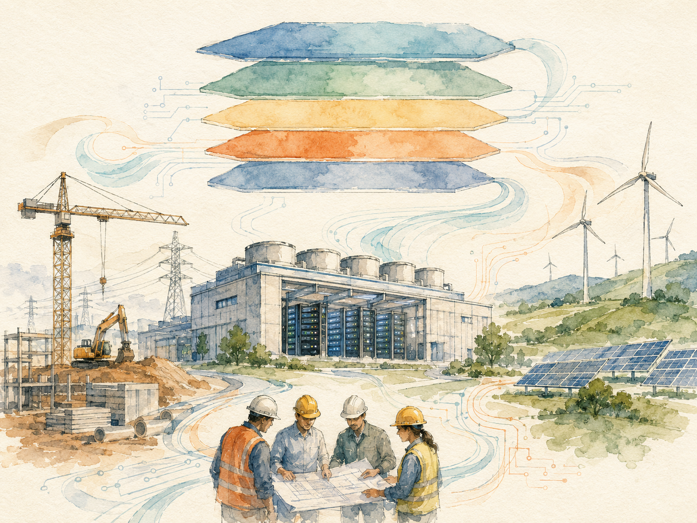

> Every time someone asks a chatbot a question, posts on Instagram, or streams a Netflix show, the request travels to a building most people have never seen. These buildings — data centers — collectively consume about 3% of global electricity, and that number is climbing roughly 6% per year. The AI boom is accelerating it further.
>
> 每次有人跟 ChatGPT 對話、滑 Instagram、看 Netflix，請求都會跑進一棟大多數人從沒看過的建築 —— 數據中心（Data Center, DC）。這些建築合計消耗全球約 3% 的電力，每年還以約 6% 的速度往上爬。AI 浪潮正在進一步加速這個數字。



---

## Why You Need the Map First // 為什麼要先看地圖

For anyone stepping into the data center world for the first time, the trap is to dive straight into technical jargon — UPS, CRAC, PUE, Tier III — and end up three months later still not knowing what you're learning or why.

對任何第一次接觸數據中心的人來說，陷阱是直接從技術術語（UPS、CRAC、PUE、Tier III）下手，學了三個月還搞不清楚自己在學什麼、為什麼學。

The correct entry point is the map: how the industry is structured, who builds what, who pays for what, and what business models exist. Once the map is in your head, every technical term snaps into place.

正確的入口是「地圖」 —— 這個產業怎麼組成、誰蓋什麼、誰付什麼錢、有哪些商業模式。地圖建立在腦袋裡之後，每個技術詞會自動歸位。

This article is that map. It covers four things:

這篇文章就是這張地圖，涵蓋四件事：

- **The five-layer architecture** every conversation maps onto // 所有對話都會落上去的**五層架構**
- **The industry chain** with its four phases and four roles // 由四個階段與四個角色組成的**產業鏈**
- **The 27-month lifecycle** of building a typical data center // 蓋一座典型 DC 的 **27 個月生命週期**
- **The four major types** of data centers + the three colocation rental models // **四大類型 DC** 與三種 Colocation 租賃模式

---

## Part 1 — The Five-Layer Architecture: L0 to L4 // 五層架構：L0 到 L4

The industry organizes itself around five layers, stacked from physical infrastructure at the bottom to user-facing applications at the top.

業界用 5 個層級來組織自己，從最底層的實體基礎設施到最上層面向用戶的應用程式。

### The diagram // 架構圖

```
┌─────────────────────────────────────────────┐
│  L4   Application       業務應用、雲服務      │
├─────────────────────────────────────────────┤
│  L3   Software Platform 虛擬化、雲管理、DCIM  │
├─────────────────────────────────────────────┤
│  L2   ICT Device        伺服器、儲存、網路設備│
├─────────────────────────────────────────────┤
│  L1   Facility          電力、冷卻、機櫃、消防 ⭐
├─────────────────────────────────────────────┤
│  L0   Civil Work        建物本體（土建、結構）│
└─────────────────────────────────────────────┘
```

### Why L1 has a star // L1 為什麼掛星號

The star is deliberate. The facility layer — power, cooling, racks, fire protection, cabling, security, lightning protection — is where **90% of industry conversations happen**.

星號是刻意標的。設施層 —— 電力、冷卻、機櫃、消防、佈線、安防、防雷接地 —— 是**業界 90% 對話發生的地方**。

When you talk to equipment vendors like Huawei, Vertiv, or Schneider Electric, you're almost always in L1. When you talk to cloud architects or application developers, you're in L2 through L4.

跟設備商（華為、Vertiv、Schneider Electric）對話，幾乎都在 L1。跟雲端架構師或應用程式開發者對話，則是在 L2 到 L4。

L0 (the building itself) is handled by general contractors and construction firms. L1 is handled by specialized electrical and mechanical contractors and equipment vendors. They are different industries with different supply chains.

L0（建物本身）由土木總包與營造公司負責。L1 則由專業的機電承包商與設備供應商負責。兩個產業、兩條供應鏈。

### Mapping any sentence to a layer // 任何一句話對應到哪一層

> **The first skill in this industry is mapping any sentence to the right layer.**
>
> **這個產業的第一個技能，就是把任何一句話對應到正確的層級。**

A quick exercise:

簡單練習：

- "We need to upgrade the UPS (Uninterruptible Power Supply). // 我們要升級 UPS（不斷電系統）」" → **L1**
- "We need more GPU capacity. // 我們要更多 GPU 算力" → **L2**
- "We need to migrate to Kubernetes. // 我們要遷移到 Kubernetes" → **L3**
- "The website is down. // 網站掛了" → **L4**

---

## Part 2 — The Industry Chain: Four Phases, Four Roles // 產業鏈：四個階段、四個角色

A data center is not built by one company. It's built by an orchestrated chain spanning real estate, design firms, general contractors, equipment vendors, and operators.

數據中心不是一家公司蓋出來的。它是一條跨房地產、設計公司、總包、設備商、運營商的協調鏈。

The chain has four sequential phases, each with its own dominant players.

鏈條有四個依序發生的階段，每個階段有自己的主導者。

### The four phases // 四個階段

| Phase | Duration | Main activities // 主要動作 | Main players // 主要角色 |
|---|---|---|---|
| **1. Planning 規劃** | ~3 months | Site selection, TCO analysis, ROI calculation<br>選址、TCO 分析、ROI 計算 | Owner, government, consultants |
| **2. Design 設計** | ~6 months | PUE design, Tier design, power density, CFD simulation<br>PUE/Tier 設計、功率密度、CFD 模擬 | Design institutes, consulting firms |
| **3. Construction 建設** | ~18 months | Civil work, MEP installation, equipment deployment, commissioning<br>土建、機電安裝、設備部署、調試 | General contractors, equipment vendors, SIs |
| **4. Operation 運營** | 10–15 years | Monitoring, inspection, predictive maintenance, fault response<br>監控、巡檢、預測性維護、故障處理 | Owner or outsourced operators |

The four phases for a typical project total **about 27 months** from breaking ground to going live.

四個階段加起來，從動土到上線典型約 **27 個月**。

> A real case from a Chinese telecom carrier in Jiangsu Province — a 6,000-cabinet facility — took **957 days**, almost 32 months. That's closer to the industry average than the ideal 27.
>
> 中國江蘇某運營商蓋一座 6,000 機櫃的案場，實際花了 **957 天**，將近 32 個月。比理想的 27 個月更接近業界平均。

---

### The four roles // 四個角色

Beneath the four phases sit four roles whose interests sometimes align and sometimes diverge.

四個階段底下坐著四個角色，他們的利益有時一致，有時衝突。

#### Owner 業主

The company or government agency that will use the data center. Pays for everything. Cares about long-term **TCO (Total Cost of Ownership, 總體擁有成本)** and uptime.

將要使用這座 DC 的公司或政府機構。出錢的人。在意長期 **TCO（Total Cost of Ownership，總體擁有成本）**與可用率。

#### Designer 設計院 / 顧問公司

Independent design firms or consultants who produce the technical specifications. Their job is to translate the owner's requirements — PUE targets, Tier level, cabinet density — into something that can actually be built.

獨立設計公司或顧問，負責產出技術規格。工作是把業主需求（PUE 目標、Tier 等級、機櫃功率密度）翻譯成可施工的設計。

#### EPC General Contractor / SI 總包 / 系統整合商

Companies like Jacobs Engineering, Wood plc, or local SIs (System Integrators). **EPC** stands for *Engineering, Procurement, Construction*. They coordinate hundreds of subcontractors and vendors.

像 Jacobs Engineering、Wood plc 或本地 SI（System Integrator，系統整合商）。**EPC** 代表 *Engineering、Procurement、Construction*（工程、採購、施工）。負責協調上百家分包商與供應商。

#### Equipment Vendor 設備商

Companies like Huawei, Vertiv, Schneider Electric, Caterpillar, Cisco that sell the boxes — UPS systems, chillers, switches, servers. They want their boxes specified into the design.

像華為、Vertiv、Schneider Electric、Caterpillar、Cisco，賣設備（UPS、冷水機、交換機、伺服器）。他們希望自家設備被指定進設計。

---

### Three construction modes // 三種建設模式

The owner has three high-level choices for how to procure the project. The choice determines who has control and where the margin sits.

業主對「怎麼採購這個專案」有三個高層選擇。這個選擇決定誰握有控制權、利潤落在哪。

| Mode | What it is // 是什麼 | Typical owner // 典型業主 |
|---|---|---|
| **EPC General Contracting 總包** | One contract covers design + procurement + construction<br>一個合約包設計+採購+施工 | Government, SMEs without DC expertise<br>政府、無 DC 專業的中小企業 |
| **Design + GC 設計+總包** | Design tendered separately, then construction tendered separately<br>設計獨立招標，總包獨立招標 | Mid-to-large enterprises with some technical capability<br>有一定技術能力的中大型企業 |
| **Design + Devices + PM 設計+設備+項目管理** | Owner directly tenders devices and manages integration<br>業主自行招標設備、自行管理整合 | Hyperscale colocation operators (GDS, CHINDATA), cloud providers<br>超大規模 Colocation（GDS、CHINDATA）、雲服務商 |

The pattern is clear:

規律很清楚：

> **The more capable the owner, the more they pull procurement in-house.**
>
> **業主能力越強，越會把採購拉回內部。**

A 10,000-cabinet hyperscale order is large enough to negotiate directly with equipment vendors, bypassing the EPC margin. Smaller owners gladly trade margin for simplicity.

10,000 機櫃的超大規模訂單夠大，可以直接跟設備商議價，跳過 EPC 的利潤層。規模小的業主則樂於用利潤換簡單。

---

## Part 3 — Where the 27 Months Go // 27 個月到底花在哪

Most of the 27 months goes into civil work and MEP installation, not into the high-profile equipment. *MEP* stands for *Mechanical, Electrical, Plumbing*.

27 個月裡，大部分時間花在土建與 MEP 安裝，不是花在那些高曝光的設備上。*MEP* 代表 *Mechanical, Electrical, Plumbing*（機電水）。

The Jiangsu case study breaks down like this:

江蘇案場的時程拆解如下：

| Step | Days | % of total |
|---|---|---|
| Site survey 場勘 | 7 | 0.7% |
| Civil work design 土建設計 | 120 | 12.5% |
| Design bidding 設計招標 | 90 | 9.4% |
| **Civil work construction 土建施工** | **420** | **43.9%** ⭐ |
| Equipment installation 設備安裝 | 180 | 18.8% |
| Commissioning 調試 | 90 | 9.4% |
| Trial run 試運轉 | 20 | 2.1% |
| Rectification 整改 | 30 | 3.1% |
| **Total 合計** | **957** | **100%** |

> **Civil construction alone takes 14 months — almost half the entire timeline.**
>
> **光是土建施工就吃掉 14 個月 —— 將近整個時程的一半。**

This is exactly the inefficiency that **prefabricated modular data centers (PMDCs, 預製化模組化 DC)** target. By manufacturing modules in a factory while site work is still ongoing, PMDC vendors compress the 27-month sequential timeline to a 6-to-11-month parallel one.

這正是**預製化模組化數據中心（PMDC, Prefabricated Modular Data Center）**瞄準的低效點。透過在工廠製造模組、與工地土建並行進行，PMDC 業者把 27 個月的串聯時程壓縮到 6-11 個月的並行時程。

A later article in this series will cover PMDC in depth.

本系列後面會專篇詳談 PMDC。

---

## Part 4 — The Four Types of Data Centers // 四大類型數據中心

The industry recognizes four primary types of data centers, separated by who owns them, who uses them, and what they're optimized for.

業界辨識四種主要的數據中心類型，由「誰擁有、誰使用、為什麼優化」來區分。

Getting this distinction right is essential because the same physical building can be designed and operated very differently depending on its category.

搞清楚這個差別很重要，因為同一棟建物根據它屬於哪一類，設計與運營方式可能天差地別。

### Quick comparison // 快速對照

| Type | Full name (中文) | Owner–user relationship // 業主與使用者關係 | Typical scale // 典型規模 |
|---|---|---|---|---|
| **IDC** | Internet Data Center (互聯網數據中心) | Owner rents space to others<br>業主出租機櫃 | 1,000–10,000+ cabinets |
| **EDC** | Enterprise Data Center (企業數據中心) | Owner builds for own use<br>業主自建自用 | 10s–100s of cabinets |
| **CDC** | Cloud Data Center (雲數據中心) | Cloud provider builds to sell cloud services<br>雲服務商自建賣雲服務 | 10,000+ cabinets |
| **HPC** | High Performance Computing (高效能運算中心) | Built for scientific computing or AI training<br>為科學運算或 AI 訓練而蓋 | 100s–1,000s of cabinets |

---

### IDC — the rental model // IDC：租賃模式

An **IDC** is the rental property of the data center world. Owners build large facilities and rent cabinets to multiple tenants.

**IDC** 是數據中心世界的「出租房地產」。業主蓋大型機房，把機櫃出租給多個租戶。

**Examples** // **代表業者**: GDS, CHINDATA, Equinix, Digital Realty, NEXTDC, AirTrunk.

**Tenants** are mid-to-small internet companies, SaaS providers, and enterprises that don't want to build their own. The term "colocation" or "colo" usually refers to this rental relationship.

**租戶**是中小型互聯網公司、SaaS 供應商，以及不想自建的企業。「Colocation」或「Colo」一般指這種租賃關係。

---

### EDC — the in-house model // EDC：自建自用

An **EDC** is built by an enterprise or government for its own use, not for rent.

**EDC** 由企業或政府自建自用，不對外出租。

Banks, insurance companies, healthcare systems, and large manufacturers often build EDCs to meet regulatory compliance, data sovereignty, or integration requirements.

銀行、保險公司、醫療體系、大型製造商常蓋 EDC 來滿足合規、資料主權或系統整合需求。

EDCs tend to be smaller in scale but higher in reliability tier (Tier III or Tier IV).

EDC 規模通常較小，但可靠性等級較高（Tier III 或 Tier IV）。

---

### CDC — the hyperscaler model // CDC：雲服務商模式

A **CDC** is built by a cloud provider — AWS, Microsoft Azure, Google Cloud, Huawei Cloud, Alibaba Cloud, Tencent Cloud — to sell cloud services.

**CDC** 由雲服務商（AWS、Microsoft Azure、Google Cloud、華為雲、阿里雲、騰訊雲）自建，用來提供雲服務。

CDCs are the largest data centers in the world, sometimes spanning entire industrial parks with hundreds of megawatts of capacity.

CDC 是全球最大的數據中心，有時跨整個工業園區、容量達數百 MW。

> CDC operators are the most aggressive optimizers of **PUE (Power Usage Effectiveness, 電力使用效率)**, because at their scale, a 0.01 improvement in PUE saves millions of dollars per year.
>
> CDC 業者是最積極優化 **PUE（Power Usage Effectiveness，電力使用效率）** 的角色，因為以他們的規模，PUE 改善 0.01 一年就能省下數百萬美元。

---

### HPC — the AI training era's new star // HPC：AI 訓練時代的新明星

An **HPC** center runs high-performance scientific computing or, increasingly, AI training. Traditional HPCs serve government research labs, universities, and weather and climate modeling.

**HPC** 中心跑高效能科學運算，或越來越多是 AI 訓練。傳統 HPC 服務政府研究機構、大學、氣象與氣候模擬。

The AI boom has turned HPCs into the hottest segment of the industry.

AI 浪潮把 HPC 變成業界最熱的賽道。

> NVIDIA's H100 and B200 GPUs push rack power density above **30–50 kW per cabinet** — five to ten times typical CDC density — which forces liquid cooling and rewrites the entire facility design.
>
> NVIDIA H100 與 B200 GPU 把機櫃功率密度推到 **30-50 kW** —— 是典型 CDC 機櫃的 5-10 倍 —— 強迫採用液冷，並改寫整個設施設計。

---

## Part 5 — Colocation: Three Rental Models // Colocation 三種租賃模式

IDC operators don't sell space the same way to everyone. There are three distinct rental models, each with its own pricing, contract terms, and target customers.

IDC 業者不會用同一種方式賣給所有人。有三種不同的租賃模式，各自有定價、合約條款與目標客戶。

| Model | What you rent // 租什麼 | Typical tenant // 典型租戶 | Density // 功率密度 |
|---|---|---|---|
| **Wholesale 批發** | Entire floor, hall, or building<br>整層、整廳、整棟 | Hyperscalers, large internet companies<br>超大規模、大型互聯網 | 8–12 kW/cabinet |
| **Retail 零售** | Single cabinets or small zones<br>單櫃或小區 | SMEs, mid-tier internet companies<br>中小企業、中型互聯網 | 4–8 kW/cabinet |
| **Customization 客製** | Whole purpose-built facility<br>為單一客戶量身蓋的整座機房 | Anchor tenants (large cloud providers)<br>錨定租戶（大型雲服務商） | 8–12 kW/cabinet |

### Wholesale 批發

The long-lease, low-margin, high-volume play. The IDC operator hands over a 500-cabinet hall to a single tenant on a 5-to-10-year contract.

長約低毛利量大的玩法。IDC 業者把 500 個機櫃的整個機房交給單一租戶，簽 5-10 年合約。

Margin per cabinet is thin, but cash flow is predictable.

單櫃毛利薄，但現金流穩定。

### Retail 零售

The higher-margin, harder-to-manage variant. The IDC operator slices cabinets and rents to dozens of small customers.

高毛利、難管理的版本。IDC 業者把機櫃切細出租給數十個小客戶。

Per-cabinet pricing is high, but customer acquisition and support cost scale with tenant count.

單櫃定價高，但客戶獲取與服務成本隨租戶數增加。

### Customization 客製

The build-to-suit variant. An "anchor tenant" — usually a hyperscaler — commits to a long lease before the building is even designed, and the IDC operator builds the whole facility around the anchor's specifications.

「為客戶量身蓋」的版本。某個「Anchor Tenant 錨定租戶」 —— 通常是超大規模雲服務商 —— 在建物還沒設計前就簽下長約，IDC 業者圍繞 Anchor Tenant 的規格蓋整座機房。

Stack Infrastructure's purpose-built sites for Microsoft, and AirTrunk's anchor-led campuses in Sydney and Tokyo, are well-known examples.

Stack Infrastructure 為 Microsoft 量身蓋的機房，以及 AirTrunk 在雪梨與東京由 Anchor Tenant 主導的園區，都是著名例子。

---

## Part 6 — Five Questions to Classify Any Data Center // 五個問題判斷任何 DC 類型

When you encounter a data center project for the first time, five quick questions classify it within minutes.

第一次看到一個 DC 案，五個快速問題能在幾分鐘內判斷它的類型。

### Q1. Who is the actual user? // 真正的使用者是誰？

- **Self-use** → EDC, CDC, or HPC
- **Rented out** → IDC

- **自用** → EDC、CDC 或 HPC
- **出租** → IDC

### Q2. What's the primary workload? // 主要工作負載是什麼？

- **Internal ERP and business systems** → EDC
- **Public cloud services** → CDC
- **Hosting other companies' servers** → IDC
- **Scientific computing or AI training** → HPC

- **內部 ERP 與業務系統** → EDC
- **對外雲服務** → CDC
- **託管別人的伺服器** → IDC
- **科學運算或 AI 訓練** → HPC

### Q3. What's the power density per cabinet? // 單櫃功率密度多少？

- **4–8 kW** → typical EDC or retail IDC
- **8–12 kW** → wholesale IDC or CDC
- **20+ kW** → HPC or AI cluster

- **4–8 kW** → 典型 EDC 或零售 IDC
- **8–12 kW** → 批發 IDC 或 CDC
- **20+ kW** → HPC 或 AI 集群

### Q4. What's the scale? // 規模多大？

- **< 100 cabinets** → small EDC or edge DC
- **100–1,000** → typical EDC or retail IDC
- **1,000–10,000** → wholesale IDC or CDC
- **> 10,000** → hyperscale CDC

- **100 機櫃以下** → 小型 EDC 或邊緣 DC
- **100–1,000** → 典型 EDC 或零售 IDC
- **1,000–10,000** → 批發 IDC 或 CDC
- **10,000+** → 超大規模 CDC

### Q5. What's the required reliability tier? // 要求的可靠性等級是？

- **Tier IV** → financial EDC or customization IDC for hyperscalers
- **Tier III** → mainstream IDC, CDC, and EDC
- **Tier II** → some CDCs that rely on software-layer fault tolerance

- **Tier IV** → 金融 EDC 或為 hyperscaler 客製的 IDC
- **Tier III** → 主流 IDC、CDC、EDC
- **Tier II** → 部分用軟體層容錯的 CDC

---

## Key Takeaways // 重點整理

#### 1. The five-layer architecture is the foundation // 五層架構是底層基礎

L0 is the building, L1 is the facility (where most industry conversations happen), L2 is the IT hardware, L3 is the software platform, L4 is the application. Every sentence about data centers maps onto one of these layers.

L0 是建物、L1 是設施（業界對話 90% 發生在這裡）、L2 是 IT 硬體、L3 是軟體平台、L4 是應用。任何一句關於數據中心的話都會落在這五層的某一層。

#### 2. The industry chain spans four phases over ~27 months // 產業鏈跨四階段、約 27 個月

Planning (3) → Design (6) → Construction (18) → Operation (10–15 years). Four roles — owner, designer, EPC/SI, vendor — each with their own interests. Three construction modes reflect how much control the owner wants to retain.

規劃（3）→ 設計（6）→ 建設（18）→ 運營（10-15 年）。四個角色 —— 業主、設計、EPC/SI、設備商 —— 各有利益。三種建設模式反映業主想保留多少控制權。

#### 3. Civil construction alone consumes 14 months // 光是土建就吃 14 個月

This is what prefabricated modular data centers (PMDCs) attack, compressing the schedule to 6–11 months through parallel factory production.

這正是預製化模組化數據中心（PMDC）攻擊的點，透過工廠平行生產壓到 6-11 個月。

#### 4. Four data center types serve different customers // 四種類型服務不同客戶

IDC (rental), EDC (in-house enterprise), CDC (cloud), HPC (high-performance / AI). IDCs further split into wholesale, retail, and customization rental models.

IDC（出租）、EDC（企業自建）、CDC（雲服務）、HPC（高效能 / AI）。IDC 內部再分批發、零售、客製三種租賃模式。

#### 5. Five quick diagnostic questions classify any project // 五個快速診斷問題能判類

Who uses it, what workload, power density per cabinet, total scale, reliability tier. With these, a new project's category becomes clear within minutes.

誰使用、什麼負載、單櫃功率密度、總規模、可靠性等級。有了這五個問題，新案場的歸類在幾分鐘內就會清楚。

---

## What's Next // 下一篇預告

The next article in this series breaks down the **economics**: where the money goes in a data center's 10-year lifetime, why electricity dominates 58% of operating costs, and how customer cost per kW ranges from under **$3,500** for hyperscalers to over **$7,000** for banks.

本系列下一篇拆解**經濟學**：DC 10 年生命週期的錢都花到哪、為什麼電費佔運營成本 58%、客戶單位 kW 成本怎麼從 hyperscaler 的 **< $3,500** 一路漲到銀行的 **> $7,000**。
