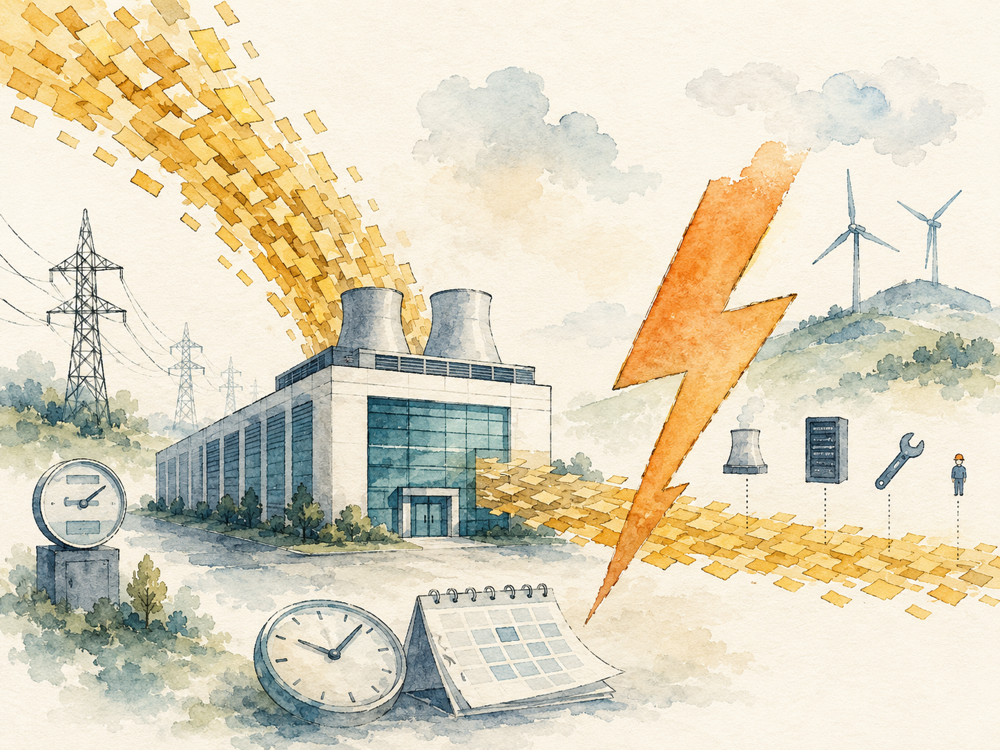

+++
date = '2026-06-07T00:00:00+00:00'
title = "【Data Center 101】TCO Economics: Why Data Centers Are an OPEX-Dominated Business"
slug = "data-center-101-02-tco-economics"
aliases = ["/posts/data-center-101-tco-economics/", "/posts/數據中心-101-tco-經濟學/"]
tags = ['Data Center', 'Data Center 101', 'Passport to AI Era', '中文']
math = true
thumbnail = 'pic.png'
+++

> If you asked a CFO to guess where most of a data center's lifetime money goes, the typical answer would be "the servers" or "the building." The actual answer is electricity — almost **58% of total operating expenses** over a 10-year span. That single fact rewrites how the entire industry thinks about investment decisions.
>
> 如果你問一位 CFO「數據中心一輩子的錢主要花在哪裡？」，典型答案會是「伺服器」或「建築物」。但實際答案是電費 —— 在 10 年生命週期裡，電費佔總運營支出將近 **58%**。光這一個事實就改寫了整個產業看待投資決策的方式。



---

## Why TCO Is the Industry's Master KPI // 為什麼 TCO 是這個產業的總指揮

In most industries, decisions get made on either upfront cost (CAPEX) or ongoing cost (OPEX). In data centers, neither view alone is enough.

大多數產業裡，決策不是看一次性成本（CAPEX）就是看持續成本（OPEX）。但在數據中心，任何一個單獨的視角都不夠。

The industry uses **Total Cost of Ownership (TCO)** as the master KPI — a single number that bundles the one-time CAPEX with 10 years of OPEX.

這個產業用 **TCO（Total Cost of Ownership，總體擁有成本）** 當作總指揮 KPI —— 一個把一次性 CAPEX 和 10 年 OPEX 綁在一起的單一數字。

### The basic formula // 基本公式

\[
\text{TCO} = \text{CAPEX} + \sum_{i=1}^{10} \text{OPEX}_i
\]

- **CAPEX (Capital Expenditure, 資本支出)** — One-time investment to build the data center: land, civil work, equipment, installation, commissioning. // 建設數據中心的一次性投資：土地、土建、設備、安裝、調試。
- **OPEX (Operating Expenditure, 營運支出)** — Continuous spending after the data center is operational: electricity, labor, maintenance, equipment refresh, financing. // 數據中心開始運轉後的持續支出：電費、人力、維修、設備更新、資金成本。

---

### Why 10 years? // 為什麼選 10 年？

The 10-year window is the industry standard for three reasons:

10 年的時間視窗是業界標準，原因有三：

- **Equipment design life** — UPS systems last 10–15 years, batteries 5–10 years, chillers 10–15 years, equipment room fit-out around 10 years.
- **Depreciation schedule** — Most accounting frameworks amortize data center buildings over 10–20 years.
- **Customer contracts** — Wholesale IDC long leases are typically 5–10 years.


- **設備設計壽命** —— UPS 約 10-15 年、電池 5-10 年、冷水機 10-15 年、機房裝修約 10 年。
- **折舊年限** —— 大多數會計框架把數據中心建物攤提 10-20 年。
- **客戶合約** —— Wholesale IDC 的長租合約典型是 5-10 年。

---
> When someone says "this looks expensive on CAPEX but cheap on OPEX," the correct follow-up is: *"What does the 10-year TCO look like?"* If they can't answer, the analysis isn't complete yet.
>
> 當有人說「這個 CAPEX 高但 OPEX 低」，正確的追問永遠是：*「10 年 TCO 看起來怎麼樣？」* 答不出來，分析就還沒完成。

---

## Part 1 — The 10-Year TCO Breakdown // 10 年 TCO 結構

Industry surveys consistently show the same shape:

業界調查一致呈現相同的結構：

| Bucket | Share of 10-year TCO // 佔 10 年 TCO 比例 |
|---|---|
| **CAPEX** (one-time build) | **~30%** |
| **OPEX** (10 years of operations) | **~70%** |

That alone is a surprise to most outsiders — operations cost more than construction. But the bigger surprise sits one level down, inside the OPEX number:

對大多數外行人這已是驚訝點 —— 運營竟然比建設貴。但更大的驚訝藏在 OPEX 內部下一層：

| OPEX category | Share of OPEX // 佔 OPEX 比例 |
|---|---|
| **Electricity 電費** | **~58%** ⭐ |
| Equipment Update 設備更新 | ~7% |
| Capital Expense 資金成本 (financing) | ~5% |
| Other 其他 (maintenance, labor, etc.) | ~9% |
| Building Depreciation 建物折舊 | ~1% |
| Land 土地分攤 | ~0.5% |

> **Electricity alone is more than half of operating costs.**
>
> **光是電費就佔了運營成本一半以上。**

This single fact explains many otherwise-puzzling industry behaviors:

光這一個事實就解釋了很多原本看起來奇怪的產業行為：

- Why Google, Meta, and Microsoft chase data center sites in northern Sweden, Finland, and Iceland — naturally cold air means free cooling and low PUE.
- Why Microsoft has experimented with underwater data centers (Project Natick) and Google has acquired hydroelectric power directly from utilities.
- Why hyperscalers are signing decade-long PPAs (Power Purchase Agreements, 購電協議) for nuclear power, including Three Mile Island and small modular reactors.
- Why the entire industry is racing toward PUE 1.0.

---

- 為什麼 Google、Meta、Microsoft 都在找瑞典北部、芬蘭、冰島的選址 —— 天然低溫帶來自然冷卻與低 PUE。
- 為什麼 Microsoft 試過把數據中心沉到海底（Project Natick）、Google 直接跟電力公司簽長約。
- 為什麼超大規模業者都在簽十年起跳的 PPA（Power Purchase Agreement，購電協議）綁核能 —— 包括三浬島復役與小型模組化反應爐（SMR）。
- 為什麼整個產業在拼命衝向 PUE 1.0。

---

## Part 2 — CAPEX: Where the One-Time Money Goes // CAPEX：一次性投資去哪了

When you actually crack open the CAPEX number, the surprises start. The big-name equipment everyone talks about — UPS, chillers — isn't the biggest spend. The biggest spend is the boring stuff: civil work and installation.

當你真的拆開 CAPEX 這個數字，驚訝才開始。大家整天掛在嘴邊的設備（UPS、冷水機）並不是最大支出。最大支出是無聊的東西：土建與安裝。

### The 12-category breakdown // 12 個科目拆解

Based on the CDCC (China Data Center Committee) industry survey:

根據 CDCC（中國數據中心委員會）的產業調查：

| # | Category | 中文 | Share of CAPEX | Notable suppliers |
|---|---|---|---|---|
| 1 | **Civil Work** | 土建 | **19.96%** ⭐ | Local construction firms |
| 2 | **Installation** | 機電安裝 | **12.86%** | Local MEP contractors, SIs |
| 3 | Mechanical (HVAC) | 空調暖通 | 10.5% | Vertiv, Stulz, Huawei, Daikin |
| 4 | Genset | 柴油發電機 | 9.8% | Caterpillar, Cummins, MTU |
| 5 | External Power | 外市電 | 7.44% | Local utilities |
| 6 | LVSG | 低壓開關櫃 | 6.77% | Schneider, ABB, Siemens |
| 7 | Power Cable | 電力電纜 | 6.77% | Prysmian, Nexans, Sumitomo |
| 8 | Municipal | 小市政 | 6.77% | Local utilities |
| 9 | Batteries | 蓄電池 | 6.77% | CATL, BYD, Samsung SDI |
| 10 | Low Voltage | 弱電 | 4.4% | Various |
| 11 | UPS | 不斷電系統 | 4.4% | Vertiv, Schneider, Huawei |
| 12 | Fire | 消防 | 3.25% | Honeywell, 3M, Siemens |

Three observations are worth pulling out.

三個值得拉出來的觀察。

---

### Observation 1 — Civil Work is the single biggest line // 觀察一：土建是最大單一科目

Civil Work alone (19.96%) is bigger than UPS + Cooling + Genset combined.

光是土建（19.96%）就比 UPS + 空調 + Genset 加起來還大。

> **One-fifth of CAPEX is concrete, steel, and floor slabs.**
>
> **CAPEX 五分之一就是水泥、鋼筋、地坪。**

This is why **prefabricated modular data centers (PMDCs)** can save so much money — by building modules in a factory and minimizing on-site civil work, PMDCs slice directly into the biggest CAPEX line.

這就是為什麼**預製化模組化數據中心（PMDC）**能省這麼多錢 —— 透過工廠預製模組、最小化現場土建，PMDC 直接切進 CAPEX 最大的科目。

---

### Observation 2 — UPS is only 4.4% // 觀察二：UPS 只佔 4.4%

Despite all the marketing attention given to UPS systems by vendors like Vertiv, Schneider, and Huawei, the UPS itself is only **4.4% of CAPEX**. Fire protection is even smaller at 3.25%.

儘管 Vertiv、Schneider、華為等廠商在 UPS 上投入大量行銷火力，UPS 本身只佔 CAPEX **4.4%**。消防更小，只 3.25%。

This doesn't mean these categories don't matter — UPS reliability is critical and fire suppression can save the entire facility. But for financial planning, don't get distracted by the loud categories. The boring categories (civil work, installation, MEP) dominate the budget.

這不代表這些類別不重要 —— UPS 可靠性至關重要，消防能救整座機房。但做財務規劃時，不要被吵雜的類別分心。無聊的類別（土建、安裝、MEP）才主導預算。

---

### Observation 3 — Batteries (6.77%) cost more than UPS (4.4%) // 觀察三：電池比 UPS 還貴

The rise of lithium batteries has flipped the ratio. Lithium-ion is more expensive per cabinet than the legacy lead-acid VRLA batteries, but offers double the lifespan and 60% smaller footprint.

鋰電池的崛起翻轉了比例。鋰電池每櫃比傳統鉛酸 VRLA 電池貴，但壽命翻倍、佔地縮減 60%。

> **For supply chain planners, batteries have become a strategic resource — competing directly with electric vehicles for the same cells from CATL, BYD, Samsung SDI, and LG Energy Solution.**
>
> **對供應鏈規劃者來說，電池已經變成戰略物資 —— 跟電動車搶 CATL、BYD、Samsung SDI、LG Energy Solution 的同一批電芯。**

---

### Simplified 4-bucket view for executives // 給高層的 4 大類簡化版

For CFO presentations, the 12 categories can be compressed into four:

對 CFO 簡報時，12 個科目可以濃縮成四大類：

| Bucket | Share | Includes |
|---|---|---|
| Civil & Site 土建與場域 | ~33% | Civil work, municipal, part of installation |
| Power System 電力系統 | ~29% | Genset, LVSG, cables, UPS, batteries, external power |
| Cooling 空調與冷卻 | ~11% | HVAC, chillers, cooling towers |
| Other Systems & Install 其他系統與安裝 | ~27% | Low voltage, fire, MEP installation |

> **CFOs can't remember 12 categories — but they can remember "civil 1/3, power 1/3, other 1/3."**
>
> **CFO 記不住 12 個科目 —— 但記得住「土建三分之一、電力三分之一、其他三分之一」。**

---

## Part 3 — OPEX: Why Electricity Eats Everything // OPEX：為什麼電費吃掉一切

The OPEX breakdown contains the single most important fact in data center economics: **electricity is 58% of operating costs.** Nothing else comes close.

OPEX 拆解包含了數據中心經濟學裡最重要的一個事實：**電費佔運營成本 58%。** 沒有其他項目接近這個比例。

### The 9-category breakdown // 9 個科目拆解

| # | Category | 中文 | Share of OPEX |
|---|---|---|---|
| 1 | **Electricity** | 電費 | **57.95%** ⭐ |
| 2 | Equipment Update | 設備更新 | 7.27% |
| 3 | Capital Expense | 資金成本 | 5.22% |
| 4 | Maintenance Contract | 設備維保合約 | 2.42% |
| 5 | Building Depreciation | 建物折舊 | 0.93% |
| 6 | Office | 辦公配套 | 0.90% |
| 7 | Building Maintenance | 建物維保 | 0.89% |
| 8 | **Labor** | **人力** | **0.74%** ⭐ |
| 9 | Land | 土地分攤 | 0.50% |

Two numbers in this table deserve special attention.

這張表裡兩個數字值得特別注意。

---

### Insight 1 — Electricity is roughly 80× labor // 洞察一：電費約是人力的 80 倍

The labor figure (0.74%) frequently surprises people. Many assume data centers are labor-intensive — they're not. A typical 1,000-cabinet data center might employ a few dozen full-time staff plus contractor support.

人力成本（0.74%）的數字常讓人意外。很多人以為數據中心是人力密集型 —— 不是。一座典型的 1,000 機櫃數據中心可能只有幾十位全職員工加外包支援。

> **Cutting headcount doesn't move the OPEX needle. Cutting electricity does — by orders of magnitude.**
>
> **砍人力不會撼動 OPEX。砍電費才會 —— 數量級的差別。**

---

### Insight 2 — Why AI operations matter (and not for the obvious reason) // 洞察二：為什麼 AI 運維重要（且不是顯而易見的理由）

The obvious story for AI-driven operations — *"AI replaces human operators"* — is the wrong story. Labor is already only 0.74% of OPEX. Even fully automating headcount only saves that 0.74%.

「AI 取代運維人員」這個顯而易見的故事是錯的故事。人力已經只佔 OPEX 0.74%。即使全自動化，也只省那 0.74%。

The real story is different. AI operations matter because they **reduce human-triggered failures** — and human-triggered failures cause electricity to be wasted, equipment to be damaged, and SLA penalties to be paid.

真正的故事不同。AI 運維重要是因為它**減少人為觸發的故障** —— 而人為觸發的故障導致電力被浪費、設備被損壞、SLA 違約金被罰。

Industry research from the Uptime Institute consistently shows that **62% of unplanned data center outages are caused by human operational error**, not equipment failure. That's where AI operations create real value: not by replacing operators, but by reducing the consequences of operator mistakes.

Uptime Institute 的產業研究一致顯示：**62% 的非計畫性數據中心停機由人為運營錯誤造成**，不是設備故障。這就是 AI 運維創造真實價值的地方：不是取代運維人員，而是降低運維錯誤造成的後果。

---

## Part 4 — The Five Customer Cost Tiers // 五級客戶成本梯度

When industry analysts price out "cost per kilowatt of IT equipment," they don't get one number. They get five, depending on what type of customer is paying.

當產業分析師計算「每 kW IT 設備的成本」時，他們不會得到一個數字。會得到五個 —— 依客戶類型而定。

### The tier table // 等級對照

Based on the CDCC 2019 survey of 30 MW super-large data centers:

根據 CDCC 2019 對 30 MW 超大型數據中心的調查：

| Customer type | USD/kW | Multiple vs OTT | Why |
|---|---|---|---|
| **Finance 金融** | **> $7,000** | ~2.0× | Tier IV, 2N redundancy, strict compliance |
| **Government 政府** | $5,200 – $7,000 | ~1.7× | Compliance, security, long design life |
| **Enterprise 企業自用** | $4,100 – $5,200 | ~1.3× | Moderate customization |
| **MTDC 多租戶 IDC** | $3,500 – $4,100 | ~1.1× | Competitive pricing, standardization |
| **OTT 互聯網大廠** | **< $3,500** | 1.0× (baseline) | Scale, Tier II/III, in-house design |

> **A bank's data center costs roughly twice what Google's costs — per kilowatt.**
>
> **銀行的數據中心成本，每 kW 大約是 Google 的兩倍。**

---

### Why the gap is 2× // 為什麼差距是 2 倍

The core driver is **reliability tier and redundancy**:

核心差異是**可靠性等級與冗餘**：

| Customer | Typical Tier | Redundancy | Customization |
|---|---|---|---|
| Finance | Tier IV | 2N or 2(N+1) | High |
| Government | Tier III/IV | N+1 or 2N | High |
| Enterprise | Tier III | N+1 | Medium |
| MTDC | Tier III | N+1 | Low (standardized) |
| OTT | Tier II/III | N+1 (or even N) | Low (software-layer fault tolerance) |

The most counter-intuitive insight: **OTT (Over-The-Top) hyperscalers — Google, Meta, AWS — build the cheapest data centers per kilowatt.**

最反直覺的洞察：**OTT（互聯網大廠）—— Google、Meta、AWS —— 每 kW 蓋的數據中心最便宜。**

Why? Because they compensate for hardware reliability with software-layer fault tolerance. If a single rack fails, software automatically routes the workload elsewhere.

為什麼？因為他們用軟體層容錯彌補硬體可靠性。單一機櫃故障時，軟體自動把負載轉到別處。

> This is the cloud-native philosophy: **failure is normal; just route around it.** Banks can't take this approach because regulatory frameworks demand hardware-level redundancy.
>
> 這是雲原生思維：**失敗是常態；繞過它就好。** 銀行不能採用這種方法，因為監管框架要求硬體層級的冗餘。

---

## Part 5 — Three Levers to Reduce TCO // 三大降本槓桿

Once you understand the TCO structure, the question becomes: what can you actually do to reduce it? There are three levers, in decreasing order of impact.

理解 TCO 結構之後，問題變成：你實際上能做什麼來降低它？有三個槓桿，依影響力遞減排序。

### Lever 1 — Site Selection // 槓桿一：選址（影響最大）

**Impact: ±20% on TCO // 影響：± 20%**

Site selection touches everything: electricity price, land cost, labor cost, government subsidies, natural cooling capacity, water access.

選址影響所有東西：電價、土地、人力、政府補貼、自然冷卻能力、水源。

> A data center in Inner Mongolia (cold climate, cheap electricity) versus Beijing (warm, expensive electricity) can have **PUE 0.2 lower and TCO 30%+ lower** over 10 years.
>
> 一座數據中心蓋在內蒙古（寒冷氣候、便宜電力）vs. 蓋在北京（溫暖、貴電），**10 年 PUE 可低 0.2、TCO 可低 30%+**。

This is why Google operates in Hamina, Finland; why Apple's North Carolina campus runs on solar; and why Microsoft's data center in Quincy, Washington taps hydropower from the Columbia River.

這就是為什麼 Google 在芬蘭哈米納運轉、Apple 北卡園區用太陽能、Microsoft 在華盛頓州 Quincy 用 Columbia 河水力電。

---

### Lever 2 — Design // 槓桿二：設計

**Impact: ±10–15% on TCO // 影響：± 10-15%**

Design choices set the structural efficiency:

設計選擇決定結構性效率：

- **Modular / prefabricated layouts** — Cut civil work cost and shorten time-to-market.
- **High-efficiency UPS (96%+)** — Directly reduces electricity loss in power distribution.
- **Natural / evaporative / liquid cooling** — Reduces the energy spent on cooling.
- **High-density design** — More IT load per square meter improves SUE (Space Usage Effectiveness, 空間使用效率).

---

- **模組化 / 預製化布局** —— 砍土建成本、縮短上市時間。
- **高效率 UPS（96%+）** —— 直接降低配電端的電力損失。
- **自然冷卻 / 蒸發冷卻 / 液冷** —— 降低冷卻能耗。
- **高密度設計** —— 每平方公尺塞更多 IT 負載，改善 SUE（Space Usage Effectiveness，空間使用效率）。

---

### Lever 3 — Operations // 槓桿三：運維

**Impact: ±5–10% on TCO // 影響：± 5-10%**

The operations lever is the smallest in absolute impact but the most ongoing:

運維槓桿絕對影響最小，但最持續：

- **AI-driven cooling optimization** (Huawei iCooling, Google DeepMind cooling control)
- **Predictive maintenance** to avoid emergency repairs
- **DCIM (Data Center Infrastructure Management, 數據中心基礎設施管理) platforms** for real-time monitoring
- **Energy management** including peak-shaving and renewable energy time-shifting

---

- **AI 驅動冷卻優化**（華為 iCooling、Google DeepMind cooling control）
- **預測性維護**避免緊急搶修
- **DCIM（Data Center Infrastructure Management，數據中心基礎設施管理）平台**做即時監控
- **能源管理**含尖峰削減、再生能源時間調節

---

### Why the order matters // 為什麼這個順序重要

```
Lever          Impact on TCO    Decision point     Reversibility
─────────────────────────────────────────────────────────────────
Site Selection      ±20%        Planning phase     Locked once built
Design              ±10–15%     Design phase       Very expensive to change
Operations          ±5–10%      Operations phase   Continuously optimizable
```

The industry often inverts this order — rushes site selection, settles for "good enough" design, then spends decades trying to optimize operations.

業界經常把順序顛倒 —— 草率選址、設計湊合、然後在運維期拼命優化。

> **The cheapest dollar spent is in planning; the most expensive dollar is the one that tries to fix a poor site choice 10 years later.**
>
> **最便宜的一塊錢花在規劃；最貴的一塊錢是 10 年後試圖修補爛選址的那一塊。**

---

## Part 6 — PUE: The Financial Multiplier // PUE：財務乘數

Almost every TCO conversation eventually comes back to **PUE (Power Usage Effectiveness, 電力使用效率)**.

幾乎每個 TCO 討論最終都會回到 **PUE（Power Usage Effectiveness，電力使用效率）**。

PUE is a ratio: total facility power divided by IT power. A PUE of 1.0 is theoretically perfect; 2.0 means half the energy you buy is wasted on cooling and infrastructure.

PUE 是一個比例：總設施用電除以 IT 用電。PUE = 1.0 是理論完美；2.0 代表你買的電有一半浪費在冷卻與基礎設施。

### The calculation that makes CFOs sit up // 讓 CFO 坐直的算式

A 10 MW IT load data center, electricity at $0.10/kWh:

10 MW IT 負載的數據中心，電價 $0.10/kWh：

| PUE | Annual total power (GWh) | Annual electricity (USD M) | vs PUE 1.5 |
|---|---|---|---|
| 2.0 | 175.2 | 17.52 | +$4.38M |
| 1.8 | 157.7 | 15.77 | +$2.63M |
| **1.5** | **131.4** | **13.14** | baseline |
| 1.3 | 113.9 | 11.39 | **−$1.75M** |
| 1.2 | 105.1 | 10.51 | −$2.63M |
| 1.1 | 96.4 | 9.64 | −$3.50M |

> **PUE 1.5 → 1.1 saves $3.5 million per year on a 10 MW data center.**
>
> **Over a 10-year horizon, that's $35 million — enough to build a new mid-sized data center.**
>
> ---
>
> **PUE 從 1.5 降到 1.1，在 10 MW 數據中心一年省 $3.5M。**
>
> **10 年累計 $35M —— 夠蓋一座新的中型數據中心。**

---

### The investment payback math // 投資回收期算式

Realistic scenario:

實際場景：

- 5 MW IT data center
- Invest $5M to upgrade equipment (high-efficiency UPS, AHU, hot/cold aisle containment)
- Expected PUE improvement: 1.5 → 1.3
- Electricity at $0.10/kWh

---

- 5 MW IT 數據中心
- 投入 $5M 升級設備（高效 UPS、AHU、冷熱通道封閉）
- 預期 PUE 改善：1.5 → 1.3
- 電價 $0.10/kWh

The math:

算式：

\[
\text{Annual saving} = 5\,\text{MW} \times 8760\,\text{hr} \times (1.5 - 1.3) \times \$0.10 = \$0.876\,\text{M}
\]

\[
\text{Payback period} = \frac{\$5\,\text{M}}{\$0.876\,\text{M/yr}} = 5.7 \text{ years}
\]

Equipment lifespan is 10–15 years, so years 6 through 15 are **pure profit**.

設備壽命 10-15 年，所以第 6 到第 15 年都是**純利**。

---

### PUE × Carbon Tax = a new multiplier // PUE × 碳費 = 未來的新乘數

As carbon pricing rolls out globally — EU CBAM (Carbon Border Adjustment Mechanism, 碳邊境調整機制) starting 2026, Taiwan carbon fee NT$300/ton starting 2025, China's national carbon market already operational — the PUE-financial-impact equation gets a new term.

隨著碳定價在全球展開 —— 歐盟 CBAM（Carbon Border Adjustment Mechanism，碳邊境調整機制）2026 開徵、台灣碳費 NT$300/噸 從 2025 開始、中國全國碳市場已經運轉 —— PUE 對財務的影響等式多了一個新項。

Example: a 10 MW IT data center at PUE 1.5 emits roughly **65,000 tons of CO₂ per year** (assuming grid emission factor 0.5 kg CO₂/kWh). At $50/ton carbon fee, that's **$3.25M/year — on top of the electricity bill**.

例：10 MW IT 數據中心、PUE 1.5，年排碳約 **65,000 噸**（假設電網排放係數 0.5 kg CO₂/kWh）。碳費 $50/噸時，一年 **$3.25M —— 在電費之上**。

> **PUE optimization's ROI doubles in a carbon-priced world.**
>
> **在碳定價的世界，PUE 優化的 ROI 翻倍。**

---

## Key Takeaways // 重點整理

#### 1. Data centers are an OPEX-dominated business // 數據中心是 OPEX 主導的生意

CAPEX is roughly 30% of 10-year TCO; OPEX is roughly 70%. Within OPEX, electricity alone is 58%.

CAPEX 約佔 10 年 TCO 的 30%；OPEX 約 70%。OPEX 內，電費就佔 58%。

#### 2. CAPEX is mostly boring stuff // CAPEX 大部分是無聊的東西

Civil work (20%) and installation (13%) dwarf UPS (4.4%) and fire protection (3.3%). The biggest CAPEX-reduction opportunity is prefabrication, not better UPS specs.

土建（20%）與安裝（13%）遠超過 UPS（4.4%）與消防（3.3%）。CAPEX 最大的減省機會在預製化，不是更好的 UPS 規格。

#### 3. Labor is only 0.74% of OPEX // 人力只佔 OPEX 0.74%

AI-driven operations don't matter because they cut headcount — they matter because they reduce human-triggered failures, which cause 62% of all unplanned outages.

AI 運維重要不是因為它砍人力 —— 而是因為它降低人為觸發的故障（這類故障佔所有非計畫性停機的 62%）。

#### 4. Customer type drives 2× cost differences // 客戶類型造成 2 倍成本差異

Bank data centers cost twice what hyperscaler data centers cost per kilowatt — because banks pay for hardware redundancy while hyperscalers pay for software resilience.

每 kW 銀行數據中心成本是 hyperscaler 的兩倍 —— 因為銀行買硬體冗餘，hyperscaler 買軟體韌性。

#### 5. Three levers, in this order // 三大槓桿，這個順序

Site selection (±20%) > Design (±10–15%) > Operations (±5–10%). The earlier you make the decision, the bigger the lever.

選址（± 20%）> 設計（± 10-15%）> 運維（± 5-10%）。決策做得越早，槓桿越大。

#### 6. PUE is a financial multiplier // PUE 是財務乘數

A 0.4 PUE improvement on a 10 MW data center saves $3.5M per year. In a carbon-priced economy, that doubles. PUE optimization is one of the highest-ROI investments available in the industry.

10 MW 數據中心 PUE 改善 0.4，一年省 $3.5M。在碳定價的經濟體，這個數字翻倍。PUE 優化是這個產業裡 ROI 最高的投資之一。

---

## What's Next // 下一篇預告

The third article in this series goes deep into the **data center supply chain** — from the building structure (L0) to facility equipment (L1) to IT hardware (L2), and one layer further up to the raw materials (copper, rare earths, grain-oriented electrical steel, lithium, helium) that underpin the whole chain. We'll map the major suppliers, country dependencies, and the geopolitical fault lines that will reshape data center construction over the next decade.

本系列第三篇深入**數據中心供應鏈** —— 從建物結構（L0）、設施設備（L1）、IT 硬體（L2），再往上一層挖到撐起整條鏈的原物料（銅、稀土、晶粒取向電工鋼、鋰、氦氣）。我們會把主要供應商、國家依賴、以及未來十年將重塑數據中心建設的地緣政治斷層線完整繪出。
