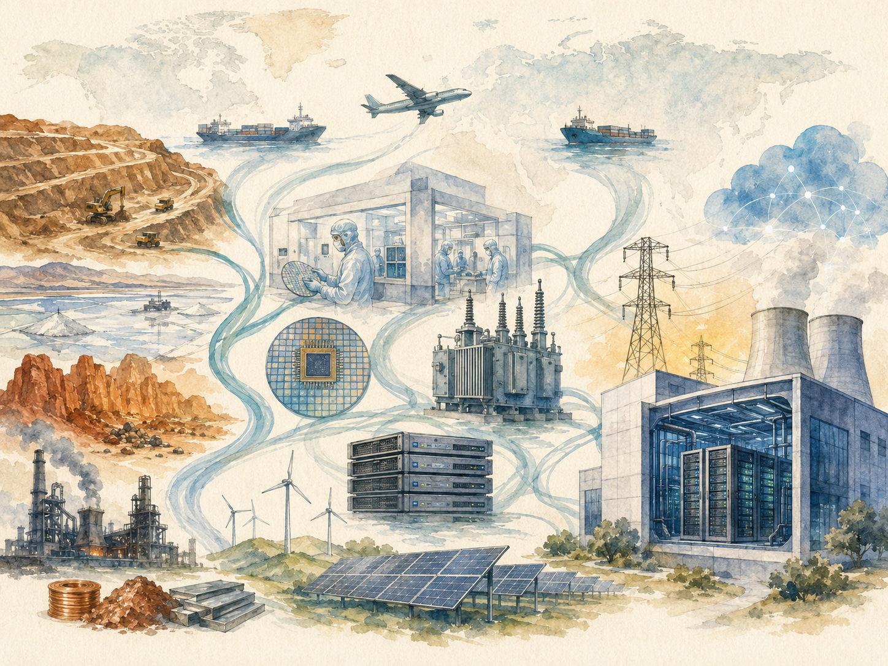

+++
date = '2026-06-08T00:00:00+00:00'
title = "【Data Center 101】The Data Center Supply Chain: From Copper Mines to AI Clusters"
slug = "data-center-101-03-supply-chain"
aliases = ["/posts/data-center-101-supply-chain/", "/posts/數據中心-101-供應鏈/"]
tags = ['Data Center', 'Data Center 101', 'Passport to AI Era', '中文']
thumbnail = 'pic.png'
+++

> In 2026, a high-voltage transformer that used to ship in 12 months now takes **5 years**. 3M is winding down production of the fluoroketone fire suppression chemical sitting inside roughly half the world's data centers. NVIDIA H100 GPU lead times have been longer than the time it takes to train a frontier model.
>
> Each of these is a single supplier decision rippling through thousands of facilities — and they are happening at the same time. To build, operate, or invest in data centers today, you have to read the supply chain like a map of fault lines.
>
> 2026 年，過去 12 個月就能到貨的高壓變壓器，現在要等 **5 年**。3M 正在收掉那種裝在全球約一半數據中心裡的氟酮滅火劑生產線。NVIDIA H100 GPU 的等待時間，曾經比訓練一個前沿模型的時間還長。
>
> 任何一個都是單一供應商決策漣漪擴散到數千座機房 —— 而它們正同時發生。今天要蓋、要運轉、要投資數據中心，你必須像看地震斷層線一樣看這條供應鏈。




---

## Why the Supply Chain Map Matters // 為什麼這張地圖很重要

A single 6,000-cabinet data center contains over 100,000 unique components sourced from more than 1,000 suppliers across 30-plus countries. The chain spans five almost-independent industries — heavy electrical equipment, HVAC, civil construction, IT hardware, and software — each with its own oligopolies, lead times, and geopolitical exposures.

一座 6,000 機櫃的數據中心包含超過 100,000 個獨特零組件，來自 30 多個國家、1,000 多家供應商。整條鏈跨越五個幾乎獨立的產業 —— 重電、暖通、土建、IT 硬體、軟體 —— 各有寡占結構、各有交期、各有地緣政治曝險。

The map matters because:

這張地圖之所以重要，是因為：

- **One choke point delays the whole project.** A missing transformer or a cancelled chemical can hold up a $500M facility for years.
- **單一卡關點延遲整個專案。** 一台缺貨的變壓器、一種被停產的化學品，可能讓 $500M 的機房延宕數年。
  
- **Lead times are stretching, not shrinking.** High-voltage transformers, gas turbines, large GPUs, liquid cooling distribution units — every category has lengthened in the last 24 months.
- **交期在拉長，不是縮短。** 高壓變壓器、燃氣輪機、大型 GPU、液冷分配單元 —— 過去 24 個月每個品類都在拉長。
  
- **The upstream layer is now a national security topic.** Copper, rare earths, grain-oriented electrical steel, gallium, germanium, and helium have moved from "commodity" to "strategic resource" in less than five years.
- **上游層已經是國家安全議題。** 銅、稀土、晶粒取向電工鋼、鎵、鍺、氦 —— 不到 5 年內從「大宗商品」變「戰略資源」。

This article is the map. It works from the bottom of the building up through the IT hardware, then digs one more layer down into the raw materials and finally into the geopolitics.

這篇文章就是這張地圖。我們從建物底層往上走到 IT 硬體，再往下挖一層到原物料、最後挖到地緣政治。

---

## Part 1 — The Four-Layer Supply Chain Structure // 四層供應鏈結構

Article 1 in this series introduced the five-layer architecture (L0–L4) of the data center itself. The supply chain has a related but distinct four-layer structure.

本系列第 1 篇介紹過數據中心本身的五層架構（L0–L4）。供應鏈有一個相關但不同的四層結構。

| Layer | What it covers // 涵蓋什麼 | Why it's separate // 為什麼獨立 |
|---|---|---|
| **L2 IT Hardware** | Servers, storage, network gear, chips<br>伺服器、儲存、網路設備、晶片 | Fast refresh cycle (3–5 years), global, deeply oligopolistic<br>3–5 年快速汰換、全球化、寡占嚴重 |
| **L1 Facility Equipment** | UPS, batteries, gensets, chillers, fire, security<br>UPS、電池、發電機、冷水機、消防、安防 | Slow refresh (10–15 years), regional channels, heavy regulation<br>10–15 年慢汰換、區域通路、法規重 |
| **L0 Civil & Site** | Building, foundation, MEP rough-in, grid connection<br>建物、地基、機電粗作、電網接入 | Almost entirely local; biggest schedule risk<br>幾乎完全在地化、最大時程風險 |
| **Upstream Raw Materials** | Copper, GOES steel, rare earths, lithium, helium, polysilicon<br>銅、GOES 電工鋼、稀土、鋰、氦、多晶矽 | Concentrated in a handful of countries, geopolitically loaded<br>集中在少數國家、地緣政治敏感 |

The key mental model: **L2 moves fast, L1 moves slowly, L0 is local, and the upstream layer is concentrated.** Different procurement strategies are needed for each.

關鍵心智模型：**L2 動得快、L1 動得慢、L0 在地化、上游層集中化。** 每一層需要不同的採購策略。

> **The most expensive mistake new operators make is treating data center procurement like IT procurement. The facility layer is closer to power-plant procurement, and the upstream layer is closer to commodity trading.**
>
> **新手最貴的錯誤是把數據中心採購當 IT 採購來做。設施層比較像電廠採購，上游層比較像大宗物資交易。**

---

## Part 2 — L0: Civil Work and the Grid Connection // L0：土建與電網接入

L0 represents roughly **33% of a data center's CAPEX** but is the source of the largest single schedule risk — getting power from the grid.

L0 約佔數據中心 CAPEX **33%**，但它也是最大時程風險的來源 —— 從電網拉到電。

### Civil construction // 土建

This part of the chain is almost entirely local. There is no "global" data center civil construction firm. The dominant suppliers are regional construction companies with deep experience in concrete pours, structural steel, and the kind of heavy floor loading data centers require (typically 1,000+ kg per square meter).

這部分供應鏈幾乎完全在地化。世界上沒有「全球性」的數據中心土建廠商。主導者是區域性的建設公司，擅長混凝土澆灌、結構鋼、以及數據中心需要的重型地板載重（通常每平方公尺 1,000 kg 以上）。

| Region | Typical players // 典型業者 |
|---|---|
| United States | Holder, DPR, Turner, Mortenson |
| Europe | Skanska, Strabag, Bouygues |
| China | China State Construction (CSCEC), CCCC |
| Australia | Lendlease, John Holland, Watpac |
| Taiwan | 互助、潤泰、大成、達欣、根基 |

The supply chain here is concrete, steel rebar, and rebar cages. The main risks are local labor availability and material cost inflation.

這層供應鏈的東西是混凝土、鋼筋、預拌混凝土。主要風險是當地工人供給與原料漲價。

### MEP installation // 機電安裝

MEP (Mechanical, Electrical, Plumbing) installation is roughly **13% of CAPEX**. This includes routing cable trays, mounting busways, installing chillers and air handlers, and plumbing the chilled-water loops.

機電安裝（MEP，Mechanical, Electrical, Plumbing）約佔 CAPEX **13%**。包括拉線槽、安裝母線、安裝冷水機與空氣處理機、配冷凍水管。

The supply chain is the labor — certified electrical and mechanical contractors with data center experience. Lead times here are not about ordering parts; they're about scheduling crews on a project that already has hundreds of subcontractors competing for floor space.

供應鏈是「人力」 —— 有數據中心經驗、有證照的電氣與機械承包商。這層的交期問題不是訂零件，而是排程 —— 一個專案上面有上百家分包商在搶現場。

### Grid connection — the single biggest schedule risk // 電網接入：最大時程風險

This deserves its own section. **Getting power from the utility is now the single most likely thing to delay a data center.**

這值得獨立一節說。**從電力公司接到電，現在是數據中心最可能被延宕的事情。**

In 2020, a 100 MW grid connection in the United States typically took 18 months. In 2025, that same connection in markets like Northern Virginia, Dublin, Frankfurt, or Singapore can take **3 to 7 years**. The bottleneck is upstream — high-voltage transformers, switchgear at substation scale, and transmission line buildout.

2020 年美國 100 MW 電網接入典型 18 個月。2025 年同樣的接入在 Northern Virginia、Dublin、Frankfurt、新加坡這些市場，要 **3 到 7 年**。瓶頸在更上游 —— 高壓變壓器、變電所等級的開關設備、輸電線建設。

> **GE Vernova's grid equipment backlog is over $163 billion. Siemens Energy's is over €136 billion. Both companies have years of forward orders.**
>
> **GE Vernova 的電網設備未交付訂單超過 $163B。Siemens Energy 的超過 €136B。兩家公司都壓著好幾年的訂單。**

For hyperscale projects, this risk is now managed through co-location with existing substations, behind-the-meter generation, and direct PPAs (Power Purchase Agreements). Some hyperscalers are signing agreements to build their own substations.

對超大規模專案來說，這個風險現在用三種方式管理：跟既有變電所共址、Behind-the-Meter 自備發電、直接簽 PPA（Power Purchase Agreement，購電協議）。部分超大規模業者已經在簽合約自蓋變電所。

---

## Part 3 — L1 Power Chain: UPS, Batteries, Gensets, Switchgear // L1 電力鏈

The L1 power chain is the most consolidated, most studied, and most predictable supply layer. Five categories of equipment, each with three to five dominant suppliers.

L1 電力鏈是最集中、最被研究、最可預測的供應層。五個設備類別，每類各有 3 到 5 家主導供應商。

### UPS (Uninterruptible Power Supply, 不斷電系統)

UPS systems represent only about 4.4% of CAPEX, but they receive disproportionate market attention because they are the most visibly engineered component.

UPS 只佔 CAPEX 約 4.4%，但市場關注度不成比例地高，因為它是「最看得出工程感」的元件。

| Vendor | HQ | Notable strengths // 強項 |
|---|---|---|
| **Huawei** | China | Modular UPS, ~19% global Modular UPS share (Frost & Sullivan 2021)<br>模組化 UPS、全球 Modular UPS 約 19% 市佔 |
| **Vertiv (Liebert)** | USA | Brand heritage, North American dominance<br>品牌信譽、北美主導 |
| **Schneider Electric (APC)** | France | Full product integration, ecosystem<br>產品整合、生態系統 |
| **ABB** | Switzerland | Industrial reliability<br>工業級可靠性 |
| **Eaton** | USA | Mid-tier market, North America<br>中型市場、北美 |
| **Delta Electronics 台達電** | Taiwan | Mid-size UPS, integrated solutions<br>中型 UPS、整合方案 |
| **Mitsubishi Electric** | Japan | Japan-aligned financial market<br>日系金融市場 |

Lead times for large modular UPS systems (500 kVA+) currently run 4 to 9 months.

大型模組化 UPS（500 kVA 以上）目前交期 4 到 9 個月。

### Batteries // 電池

The battery layer has changed more in the last five years than in the previous thirty. The industry is mid-transition from lead-acid VRLA to lithium-ion. CAPEX share is 6.77% — already higher than the UPS systems they support.

電池層在過去 5 年的變化比之前 30 年都大。整個產業正從鉛酸 VRLA 轉到鋰電池。CAPEX 佔 6.77% —— 已經比它服務的 UPS 還高。

**Lead-acid (legacy):** C&D Technologies, EnerSys, Yuasa, Narada.

**鉛酸（傳統）**：C&D Technologies、EnerSys、Yuasa、南都電源。

**Lithium-ion (rising):** CATL, BYD, EVE Energy, Samsung SDI, LG Energy Solution, Panasonic.

**鋰電池（崛起）**：CATL（寧德時代）、BYD（比亞迪）、EVE Energy（億緯鋰能）、Samsung SDI、LG Energy Solution、Panasonic。

> **Data center battery procurement now competes directly with electric vehicles for the same cells. Q3–Q4 every year is the tightest window.**
>
> **數據中心電池採購現在直接跟電動車搶同一批電芯。每年 Q3–Q4 是最緊的時段。**

### Gensets (柴油發電機)

Diesel gensets are the last-line backup, sized to carry the full data center load for 24 to 72 hours during a grid outage. CAPEX share is 9.8%.

柴油發電機是最後一道備援，容量要能在電網中斷時撐起整個數據中心 24 到 72 小時。CAPEX 佔 9.8%。

| Vendor | HQ | Strength // 強項 |
|---|---|---|
| **Caterpillar** | USA | Largest global service network<br>全球最強服務網 |
| **Cummins** | USA | Highest data center market share<br>數據中心市佔最高 |
| **MTU (Rolls-Royce Power Systems)** | Germany | Efficiency champion in high-end European market<br>歐洲高端、效率冠軍 |
| **Kohler** | USA | Mid-size market, quality reputation<br>中型市場、品質口碑 |
| **Mitsubishi Heavy Industries** | Japan | Japan financial/government<br>日系金融、政府 |
| **Wärtsilä** | Finland | 10 MW+ large market<br>10 MW+ 大型市場 |

Lead times: 6 to 12 months for medium gensets, sometimes longer for large units (2 MW+). The industry consensus on the most cost-effective size point is **1,800 kW** — standard parts, abundant service support, easy parallel operation.

交期：中型發電機 6 到 12 個月，大型（2 MW 以上）有時更長。業界共識中性價比最高的規格是 **1,800 kW** —— 標準零件、服務支援充足、並聯容易。

### Switchgear (LVSG, MV switchgear)

Switchgear sits at every voltage stepdown between the utility connection and the IT racks. CAPEX share for low-voltage switchgear (LVSG) is 6.77%, and medium-voltage adds another 5–7%.

開關設備位於電力公司接入到 IT 機櫃之間的每個降壓階段。低壓開關櫃（LVSG）CAPEX 佔 6.77%，中壓再多 5–7%。

| Vendor | HQ | Position |
|---|---|---|
| **Schneider Electric** | France | Global #1, APC + Square D brands<br>全球 #1，APC + Square D 品牌 |
| **ABB** | Switzerland | Industrial-grade, Europe<br>工業級、歐洲 |
| **Siemens** | Germany | German engineering standard<br>德系規範主力 |
| **Eaton** | USA | North America<br>北美 |
| **GE Vernova** | USA | North America + utility scale<br>北美 + 電網等級 |
| **Mitsubishi Electric** | Japan | Japan market<br>日系市場 |

Lead times for LVSG have stretched from 8 weeks pre-2020 to 9–15 months as of 2025.

LVSG 的交期從 2020 年前的 8 週拉長到 2025 年的 9 到 15 個月。

### Power cable // 電力電纜

A surprisingly large 6.77% of CAPEX. The cable supply chain is dominated by:

意外大的 6.77% CAPEX。電力電纜供應鏈由以下廠商主導：

- **Prysmian** (Italy, world #1, includes General Cable)
- **Nexans** (France, world #2, includes AmerCable)
- **Sumitomo Electric** (Japan)
- **Furukawa Electric** (Japan)
- **LS Cable & System** (Korea)
- **太平洋電線、華新麗華** (Taiwan)

Copper price volatility passes through directly — copper accounts for 60–70% of cable cost. This is also the point where the supply chain touches the upstream layer (we'll come back to copper in Part 12).

銅價波動會直接傳遞 —— 銅佔電纜成本 60–70%。這也是供應鏈接觸到上游層的點（Part 12 會回頭談銅）。

### Smart Busbar // 智能母線槽

A newer category replacing traditional cabling. Allows hot-swappable PDU connections, real-time per-circuit monitoring, and shorter installation times.

一個比較新的類別，正在取代傳統電纜。允許熱插拔 PDU 連接、單迴路即時監控、安裝時間更短。

| Vendor | Notable |
|---|---|
| **Schneider (Canalis / I-LINE)** | Global leader |
| **Starline (Universal Electric)** | Data center–specialist Track Busway leader<br>數據中心專用 Track Busway 龍頭 |
| **ABB, Siemens, Legrand, Eaton** | Industrial scale |
| **Huawei Smart Busbar** | Integrated with FusionModule offerings |

---

## Part 4 — L1 Cooling Chain: Chillers, Towers, CRACs, Liquid // L1 冷卻鏈

The cooling chain is technically more diverse than the power chain, with different equipment for different temperature regimes and cabinet densities. Total CAPEX share is roughly 11% of the build, but cooling is responsible for a larger share of OPEX through electricity consumption.

冷卻鏈技術多樣性比電力鏈高，不同的溫度區間與機櫃密度用不同設備。CAPEX 佔約 11%，但因為電力消耗，冷卻在 OPEX 佔的比例更高。

### Chillers // 冷水機

Large chilled-water plants are the workhorses of any data center above 1 MW. The market is dominated by traditional HVAC giants.

大型冰水主機是任何 1 MW 以上數據中心的主力。市場由傳統 HVAC 巨頭主導。

| Vendor | Notable |
|---|---|
| **Trane (Johnson Controls)** | Global leader |
| **York (Johnson Controls)** | Sister brand under JCI |
| **Carrier** | Tier-one global |
| **Daikin** | Strong variable-speed technology<br>變頻技術強 |
| **Mitsubishi Heavy** | High efficiency |
| **McQuay (Daikin)** | Data center specialty |
| **Smardt** | Magnetic-bearing oil-free chillers<br>磁懸浮無油冷水機 |

Lead times: 6 to 12 months for standard units, 12 to 18 months for large or specialized configurations.

交期：標準機 6 到 12 個月，大型或特殊規格 12 到 18 個月。

### Cooling towers // 冷卻塔

| Vendor | Notable |
|---|---|
| **BAC (Baltimore Aircoil)** | Global #1 |
| **EVAPCO** | Global #2 |
| **SPX Marley** | North American mainstream |
| **Munters** | Evaporative cooling integration |

### CRAC / CRAH (Computer Room Air Conditioner / Handler)

| Vendor | HQ | Notable |
|---|---|---|
| **Vertiv (Liebert)** | USA | Global #1 in CRAC/CRAH |
| **Stulz** | Germany | High-efficiency CRAH specialty |
| **Schneider (Uniflair, APC)** | France | Integrated solutions |
| **Huawei NetCol5000** | China | In-row air conditioners |
| **Daikin** | Japan | Integrated systems |
| **Munters** | Sweden | Evaporative AHU/EHU king |

### Compressors — the second-tier supply chain // 壓縮機 —— 二級供應鏈

When you buy a Trane chiller, the compressor inside is often made by someone else. This is the second-tier supply chain that few people see.

當你買一台 Trane 冷水機，裡面的壓縮機通常是另一家做的。這是少數人會看到的「二級供應鏈」。

- **Danfoss Turbocor** — Magnetic-bearing oil-free compressor leader
- **Bitzer** — German industrial-grade
- **Emerson (Copeland)** — Global #1 in scroll compressors
- **Mitsubishi / Daikin** — Integrated variable-frequency

### Fans — Taiwan's quiet dominance // 風扇 —— 台灣的隱形冠軍

Fans appear in nearly every cooling subsystem, from CRAC return-air paths to server PSUs. Taiwan is unusually strong here.

風扇出現在每個冷卻子系統，從 CRAC 回風到伺服器電源。台灣在這層異常強勢。

- **EBM-papst** (Germany) — EC fan global #1
- **ZIEHL-ABEGG** (Germany) — Same-tier competitor
- **Nidec** (Japan) — Global generalist
- **Sunon 建準, Adda 宏全, Auras 超眾** (Taiwan) — Server and data-center fan world champions

### Liquid cooling — the AI-driven category // 液冷 —— AI 浪潮帶出的類別

The fastest-growing cooling category. NVIDIA's H100 and B200 GPUs push per-cabinet power above 30–50 kW, with the GB200 NVL72 reaching 120 kW. Air cooling stops working around 25 kW per cabinet. Liquid is now the only path forward for AI training and high-density workloads.

成長最快的冷卻類別。NVIDIA H100、B200 GPU 把單櫃功率推到 30–50 kW，GB200 NVL72 達 120 kW。氣冷在每櫃 25 kW 附近就撐不住。液冷現在是 AI 訓練與高密度工作負載唯一可行的路。

| Vendor | HQ | Approach |
|---|---|---|
| **CoolIT Systems** | Canada | Direct-to-chip (D2C) leader |
| **Asetek** | Denmark | D2C, OCP-aligned |
| **Vertiv Liebert XDU** | USA | Integrated CDU + rack |
| **Submer** | Spain | Single-phase immersion |
| **LiquidStack** | USA | Two-phase immersion |
| **Iceotope** | UK | Chassis-level liquid |
| **GRC (Green Revolution Cooling)** | USA | Single-phase immersion |
| **Motivair, ColdLogik** | USA / UK | Rear-door heat exchangers |

> **CDUs (Coolant Distribution Units) currently carry 6–12 month lead times. For a hyperscale AI build, a missing CDU now delays the same as a missing chiller in 2020.**
>
> **CDU（Coolant Distribution Unit，冷卻液分配單元）目前交期 6–12 個月。對 hyperscale AI 案場來說，少一台 CDU 的影響等於 2020 年少一台冷水機。**

---

## Part 5 — L1 Monitoring, Fire, Security // L1 監控、消防、安防

Three subsystems with low individual CAPEX share but high importance — and one of them (fire suppression) is currently undergoing a supply chain shock.

三個子系統 CAPEX 佔比個別都小、但重要性高 —— 其中一個（消防）正在經歷供應鏈衝擊。

### DCIM (Data Center Infrastructure Management, 數據中心基礎設施管理)

Software, not hardware. Manages assets, capacity, environmental sensors, power monitoring, alarms, workflows.

是軟體，不是硬體。管資產、容量、環境感測器、電力監控、警報、工單流。

| Vendor | Position |
|---|---|
| **Schneider EcoStruxure IT** | Global leader, deep integration |
| **Sunbird dcTrack + PowerIQ** | Modern UI, capacity planning strength |
| **Nlyte** (now Carrier) | Workflow and asset specialty |
| **Vertiv Avocent (former Trellis)** | North American base |
| **Huawei NetEco 6000** | Strong with Huawei equipment, AI integration |
| **OpenDCIM** | Open-source, used by some hyperscalers |
| **Device42, Cormant-CS, EkkoSense** | Cloud-native challengers |

### Fire — the 3M Novec exit // 消防 —— 3M Novec 退場

Most modern data centers do not use water sprinklers as the primary fire suppression because water destroys IT equipment and creates electrocution risk. The dominant approach is a clean-agent gas system, and the most common gas in data centers worldwide has been **3M Novec 1230 (FK-5-1-12)**.

大多數現代數據中心不用水霧滅火當主要手段 —— 水會毀掉 IT 設備、有觸電風險。主流方法是潔淨氣體系統，全球數據中心用得最多的氣體一直是 **3M Novec 1230（FK-5-1-12）**。

3M announced in late 2022 that it would exit per- and polyfluoroalkyl substances (PFAS) by the end of 2025. Novec 1230 falls within that exit. Production is winding down.

3M 在 2022 年底宣布 2025 年底退出所有 PFAS（per- and polyfluoroalkyl substances，全氟與多氟烷基物質）生產。Novec 1230 在退出範圍內。產線正在收。

The replacement options are:

替代選項：

- **FK-5-1-12 from non-3M producers** (other chemical suppliers continuing the molecule)
- **FM-200 (HFC-227ea)** — older alternative, much higher Global Warming Potential
- **Inergen / IG-541** — inert nitrogen-argon-CO₂ blend, requires larger storage volume
- **Aerosol systems (e.g., Stat-X)** — solid-particle suppression, niche use

---

- **非 3M 來源的 FK-5-1-12** —— 其他化學品廠繼續做同一個分子
- **FM-200（HFC-227ea）** —— 較舊的替代方案，全球暖化潛勢值高很多
- **Inergen / IG-541** —— 氮、氬、CO₂ 惰性氣體混合，需要更大儲量
- **氣溶膠系統（如 Stat-X）** —— 固態粉末滅火，利基應用

> **Existing facilities that specified Novec are now scrambling to secure decade-long supply contracts, while new builds are reassessing whether to switch chemicals.**
>
> **既有指定 Novec 的機房正在搶簽十年期供應合約，新建案則在重新評估要不要換化學品。**

The detection side is more stable:

偵測這邊比較穩定：

- **VESDA (Very Early Smoke Detection Apparatus)** by Xtralis/Honeywell — industry gold standard
- Point smoke detectors and heat detectors as supplementary
- Fire panels by Notifier, Edwards (Carrier), Siemens Cerberus

### Physical security // 實體安防

Access control, surveillance, intrusion detection.

門禁、監視、入侵偵測。

| Category | Notable |
|---|---|
| Access cards | HID, Honeywell, Bosch, Suprema |
| IP cameras (Western) | **Axis** (Sweden), Bosch, Hanwha (Korea) |
| IP cameras (China) | **Hikvision, Dahua** — restricted in US federal projects and EU government use |
| Video management (VMS) | Genetec, Milestone, Avigilon (Motorola) |

> **The Hikvision / Dahua exclusion from US federal procurement (2019 NDAA Section 889) and EU public-sector deployments has reshaped the security supply chain into two near-incompatible tracks.**
>
> **Hikvision / Dahua 被美國聯邦採購（2019 NDAA Section 889）與歐盟公部門排除，已經把安防供應鏈重塑成兩條幾乎不相容的軌道。**

---

## Part 6 — L2 IT Hardware: The Three-Tier Structure // L2 IT 硬體：三層結構

The IT hardware layer is built on a three-tier global supply chain:

IT 硬體層建在一條三層全球供應鏈上：

```
Tier 3:  Branded servers              Dell, HPE, Lenovo, Huawei, Supermicro
              ↑
Tier 2:  ODM / EMS manufacturing      Quanta, Wiwynn, Foxconn, Inventec, Wistron
              ↑
Tier 1:  Silicon (chips)              NVIDIA, AMD, Intel, Broadcom, Marvell
```

Hyperscalers like Google, Meta, AWS, and Microsoft frequently **skip Tier 3 entirely** — they design servers internally, send the designs to Tier 2 ODMs (mostly Taiwanese), and operate the resulting "white-box" systems directly. This is the **OCP (Open Compute Project)** model.

像 Google、Meta、AWS、Microsoft 這種超大規模業者，常常**完全跳過 Tier 3** —— 自己設計伺服器，把設計送到 Tier 2 ODM（多半台灣廠），操作這些「白牌」系統。這就是 **OCP（Open Compute Project，開放運算計畫）** 模式。

This single fact is responsible for Taiwan's outsized position in the global data center supply chain — a position we'll detail in Part 13.

光是這一個事實，就撐起了台灣在全球數據中心供應鏈裡的超大份額 —— 我們在 Part 13 詳述。

---

## Part 7 — L2 Compute: CPUs, GPUs, DPUs, AI ASICs // L2 算力層

The compute layer is the layer that everyone talks about, but it's only one slice of the cost. For traditional enterprise workloads, compute is roughly 35–45% of IT spend; for AI training clusters, that figure rises to 60–75%.

算力層是每個人都在談的層，但它只佔成本的一部分。傳統企業工作負載，算力約佔 IT 預算 35–45%；AI 訓練集群，這個數字升到 60–75%。

### CPUs (x86 and ARM)

| Vendor | Architecture | Position |
|---|---|---|
| **Intel Xeon** | x86 | Long-standing leader, market share declining<br>長期領先，市佔逐年下滑 |
| **AMD EPYC** | x86 | Aggressive gains since Zen 2 (2019)<br>2019 Zen 2 後激進蠶食 |
| **NVIDIA Grace** | ARM | Co-packaged with Hopper / Blackwell GPUs<br>跟 Hopper / Blackwell GPU 同封裝 |
| **AWS Graviton** | ARM | In-house Amazon, custom Annapurna designs<br>Amazon 自研，Annapurna 設計 |
| **Ampere Altra** | ARM | Cloud-native ARM CPU<br>雲原生 ARM CPU |
| **Alibaba Yitian 倚天** | ARM | Alibaba self-designed |

### GPUs — the AI bottleneck // GPU —— AI 瓶頸

| Vendor | Position |
|---|---|
| **NVIDIA** | Roughly 90%+ of the AI training market. H100, B200, Vera Rubin roadmap.<br>AI 訓練市場 90%+。H100、B200、Vera Rubin 路線圖。 |
| **AMD Instinct (MI300, MI350, MI400)** | Distant second; gaining traction in inference<br>差距大的第二名；推理市場有起色 |
| **Intel Gaudi** | Third, smaller<br>第三，規模小 |

For training clusters, the GPU has been the rate-limiting component since 2023. Cluster build timelines now follow the GPU delivery schedule, not the facility schedule.

對訓練集群來說，GPU 從 2023 年就是限速元件。現在集群的建構時程跟著 GPU 交貨表走，不是跟著機房工程走。

### DPUs and SmartNICs // DPU 與 SmartNIC

The "data processing unit" category sits between the CPU and the network, offloading networking, storage, and security functions.

DPU（Data Processing Unit，資料處理器）這個類別介於 CPU 與網路之間，分擔網路、儲存、安全功能。

- **NVIDIA BlueField** (acquired from Mellanox 2020)
- **AMD Pensando** (acquired 2022)
- **Intel IPU**
- **AWS Nitro** (internal)

### AI ASICs — the hyperscaler in-house chips // AI 專用晶片 —— 雲廠自研

Each major hyperscaler has built its own AI accelerator to reduce dependence on NVIDIA:

每個主要雲廠都自研 AI 加速器來減少對 NVIDIA 的依賴：

- **Google TPU v5p, v7 Ironwood** (Cloud TPU)
- **AWS Trainium 2, Trainium 3, Inferentia 2**
- **Microsoft Maia 100, 200**
- **Meta MTIA v1, v2, v3**
- **Tesla Dojo** (internal training)
- **Huawei Ascend 910C, 950PR** (China alternative)

### Foundry — TSMC's structural dominance // 晶圓代工 —— TSMC 結構性主導

Almost every leading-edge chip listed above — NVIDIA, AMD, Apple, AWS Graviton, Google TPU, Huawei Ascend — is manufactured by **TSMC**. Samsung Foundry holds a smaller share, mostly for Samsung's own products and some Qualcomm legacy. Intel Foundry Services is trying to enter but has not yet won meaningful AI customer commitments.

上面列的幾乎每一顆領先製程晶片 —— NVIDIA、AMD、Apple、AWS Graviton、Google TPU、華為 Ascend —— 都是 **TSMC** 做的。Samsung Foundry 份額較小、多半是 Samsung 自家產品與一些 Qualcomm 舊案。Intel Foundry Services 在嘗試切入，但還沒拿到有意義的 AI 客戶承諾。

> **TSMC is the single most critical node in the entire global AI supply chain. If TSMC's leading-edge production stops, the AI buildout stops.**
>
> **TSMC 是全球 AI 供應鏈裡最關鍵的單一節點。TSMC 領先製程一旦停產，AI 擴建就停。**

---

## Part 8 — L2 Memory and Storage: DRAM, HBM, NAND // L2 記憶體與儲存

Memory and storage are the second AI bottleneck after GPUs themselves.

記憶體與儲存是 GPU 之後 AI 的第二個瓶頸。

### DRAM — a three-way oligopoly // DRAM —— 三方寡占

| Vendor | HQ | Approx. share |
|---|---|---|
| **Samsung** | Korea | ~40% |
| **SK Hynix** | Korea | ~30% |
| **Micron** | USA | ~25% |
| Others | — | <5% |

> **Three companies control over 95% of global DRAM supply. Pricing cycles can swing ±50% in a single year.**
>
> **三家公司控制全球 DRAM 供應 95% 以上。定價週期單年可以波動 ±50%。**

### HBM — the AI gating component // HBM —— AI 的卡關元件

HBM (High Bandwidth Memory) is the stacked DRAM that sits next to AI GPUs. Each H100 carries 80 GB of HBM3; each B200 carries 192 GB of HBM3e. The HBM market is even more concentrated than standard DRAM.

HBM（High Bandwidth Memory，高頻寬記憶體）是堆疊在 AI GPU 旁邊的 DRAM。每片 H100 帶 80 GB HBM3；每片 B200 帶 192 GB HBM3e。HBM 市場比標準 DRAM 更集中。

- **SK Hynix** — Currently leading HBM3 / HBM3e supply to NVIDIA
- **Samsung** — Catching up, qualified later
- **Micron** — Entered HBM3e in 2024

HBM lead times and capacity allocations have been the gating factor on NVIDIA's GPU production since 2023.

HBM 的交期與產能分配從 2023 年起就是 NVIDIA GPU 生產的瓶頸。

### NAND and SSDs // NAND 與 SSD

| Vendor | HQ |
|---|---|
| **Samsung** | Korea |
| **SK Hynix (Solidigm)** | Korea (acquired Intel NAND in 2021) |
| **Micron** | USA |
| **Kioxia** (former Toshiba Memory) | Japan |
| **Western Digital** | USA |

### Enterprise storage arrays // 企業儲存陣列

The systems integrators that turn raw NAND and DRAM into storage products:

把原料 NAND 與 DRAM 整合成儲存產品的廠商：

- Dell EMC PowerStore, PowerMax
- NetApp
- Pure Storage (all-flash specialist)
- HPE
- Hitachi Vantara
- Huawei OceanStor
- Inspur
- Nutanix (hyperconverged)

---

## Part 9 — L2 Networking: Switches, Routers, Optics // L2 網路層

### Switches — branded vs white-box // 交換機 —— 品牌 vs 白牌

| Branded | White-box / ODM |
|---|---|
| Cisco | **Edgecore (Accton, 智邦/Taiwan)** — global white-box switch leader |
| Arista | Quanta |
| Juniper | Delta Networks |
| NVIDIA (former Mellanox) | Inventec |
| Huawei | Wistron |
| H3C (formerly part of HP) | |

### Switch silicon // 交換機晶片

The chip inside the switch determines bandwidth and feature set. The market here is highly consolidated:

交換機裡的晶片決定頻寬與功能。市場高度集中：

- **Broadcom (Tomahawk, Trident, Jericho families)** — dominant
- Marvell
- NVIDIA (Mellanox Spectrum)
- Cisco Silicon One (internal)

### Optical transceivers — the 400G/800G surge // 光模組 —— 400G/800G 暴增

AI clusters need enormous east-west bandwidth between GPU servers. This has driven a surge in 400 G and 800 G optical transceiver demand.

AI 集群需要 GPU 伺服器間巨大的東西向頻寬。這帶動 400 G 與 800 G 光模組需求暴增。

| Vendor | HQ |
|---|---|
| **Coherent (II-VI / Finisar)** | USA |
| **Lumentum** | USA |
| **Source Photonics** | USA |
| **Innolight** | China |
| **Hisense Broadband** | China |
| **Eoptolink** | China |
| **聯亞 (LandMark Optoelectronics), 上詮 (Browave), 光環 (Hon Hai owned), AOI** | Taiwan |

Lead times for high-speed optical transceivers have stretched to 6–12 months, with allocation favoring hyperscaler customers.

高速光模組交期拉到 6 到 12 個月，配額傾向給 hyperscaler 客戶。

---

## Part 10 — L2 Server Assembly: Branded, White-Box, and the Taiwan Stack // L2 伺服器組裝

### Branded server vendors // 品牌伺服器

| Vendor | HQ | Notable |
|---|---|---|
| **Dell PowerEdge** | USA | Global enterprise #1 |
| **HPE ProLiant** | USA | Same tier |
| **Lenovo ThinkSystem** | China | Acquired IBM x86 business in 2014 |
| **Inspur 浪潮** | China | China market leader |
| **xFusion** (former Huawei server) | China | Spun off from Huawei in 2021 due to US sanctions |
| **Cisco UCS** | USA | Network-integrated |
| **Supermicro** | USA | AI server specialty, ODM-like |
| **Fujitsu** | Japan | Japan market |

### White-box / ODM server vendors — the Taiwan dominance // 白牌 ODM —— 台灣主場

| Vendor | HQ | Major customers |
|---|---|---|
| **Quanta Computer / QCT 廣達 / 雲達** | Taiwan | Google, Meta, Microsoft, AWS |
| **Wiwynn 緯穎** | Taiwan | Meta, Microsoft, AWS |
| **Foxconn Industrial Internet / FII 鴻海工業富聯** | Taiwan | AWS, Google, NVIDIA, Apple |
| **Inventec 英業達** | Taiwan | Google, Meta, Microsoft |
| **Mitac / Tyan 神達** | Taiwan | Brand + ODM mix |
| **Wistron 緯創** | Taiwan | Dell, HPE OEM |
| **Compal 仁寶** | Taiwan | ODM |
| **ASUS / ASRock Rack 華碩 / 華擎** | Taiwan | In-house brand servers |
| **Pegatron 和碩** | Taiwan | ODM |

> **Roughly 80%+ of global hyperscale server production goes through Taiwanese ODMs. This is the single biggest concentration in the entire data center supply chain — and it sits on one island 130 km from China.**
>
> **全球超大規模伺服器約 80%+ 經過台灣 ODM 之手。這是整條數據中心供應鏈最大的單一集中度 —— 而且這個島離中國 130 公里。**

### Server power supply (PSU) — the second Taiwan stronghold // 伺服器電源 —— 台灣第二個主場

The power supply inside every server is also overwhelmingly Taiwanese.

每台伺服器裡面的電源供應器也壓倒性地是台灣製。

| Vendor | HQ |
|---|---|
| **Delta Electronics 台達電** | Taiwan — global server PSU #1 |
| **Lite-On 光寶** | Taiwan |
| **Chicony 群光** | Taiwan |
| **FSP 全漢** | Taiwan |
| **Acbel 康舒** | Taiwan |
| **Bel Power Solutions** | USA |

### BMC (Baseboard Management Controller) — Aspeed's quiet monopoly // BMC —— 信驊的隱形寡占

The BMC chip is the small embedded controller that lets remote administrators turn a server on, monitor its sensors, and reset it. Nearly every server has one.

BMC 晶片是讓遠端管理者開機、看感測器、重置伺服器的小型嵌入式控制器。幾乎每台伺服器都有一顆。

- **Aspeed Technology 信驊** (Taiwan) — over 70% global share
- **Nuvoton 新唐** (Taiwan) — secondary supplier

### Server fans, racks, chassis // 風扇、機櫃、機殼

- Fans: **Sunon 建準, Adda 宏全, Auras 超眾** (all Taiwan)
- Cabinets / racks: Vertiv, Schneider APC NetShelter, **Rittal** (Germany, including liquid cooling racks), Eaton, Chatsworth, **信邦 Sinbon, 勤誠 Chenbro, 迎廣 In Win** (Taiwan)

---

## Part 11 — Upstream Raw Materials: Where the Real Bottlenecks Live // 上游原物料：真正的瓶頸所在

Below the IT and facility layers sits a layer most data center practitioners never see — the raw materials and refined inputs that make every component possible. This layer has become a national security topic in the last five years.

IT 與設施層下面，有一層大多數從業者從沒看過 —— 讓每個元件能存在的原物料與冶煉品。這一層在過去 5 年變成國安議題。

### Copper — the metal AI is built on // 銅 —— AI 蓋在銅上面

Copper is in transformers, busways, power cables, server PSU coils, motor windings, and rack distribution. A hyperscale AI data center can consume **5,000–8,000 tons of copper** per gigawatt of capacity.

銅出現在變壓器、母線、電力電纜、伺服器電源線圈、馬達繞組、機櫃配電。一座 hyperscale AI 數據中心每 GW 容量會消耗 **5,000 到 8,000 噸銅**。

> **S&P Global projects a 10-million-ton global copper deficit by 2040 — about 25% of projected demand. JPMorgan estimates hundreds of thousands of tons of shortfall as early as 2026.**
>
> **S&P Global 預估 2040 年全球銅赤字達 1,000 萬噸 —— 約佔預測需求 25%。JPMorgan 估 2026 年就有數十萬噸短缺。**

Major copper producers:

主要銅生產者：

- **Codelco** (Chile, state-owned, world's largest)
- **Freeport-McMoRan** (USA / Indonesia)
- **BHP** (Australia)
- **Glencore** (Switzerland, global trader and miner)
- **Anglo American** (UK)
- **Jiangxi Copper 江西銅業** (China)
- **Antofagasta** (Chile)

Copper price volatility passes directly through cable and transformer pricing. Long-term offtake agreements have started appearing between hyperscalers and copper producers — a year ago, that would have sounded absurd.

銅價波動直接傳遞到電纜與變壓器價格。Hyperscaler 跟銅生產商之間開始出現長期包銷協議 —— 一年前聽起來會很荒謬。

### GOES (Grain-Oriented Electrical Steel) — the transformer crisis // GOES 晶粒取向電工鋼 —— 變壓器危機

The 5-year transformer lead time mentioned at the top of this article traces back to a single material: grain-oriented electrical steel, the magnetic steel that forms transformer cores. GOES production is extremely concentrated.

文章開頭提到的變壓器 5 年交期，可以追溯到單一材料：晶粒取向電工鋼，變壓器鐵芯用的磁性鋼材。GOES 生產極度集中。

| Producer | Country | Notes |
|---|---|---|
| **JFE Steel** | Japan | Major exporter |
| **Nippon Steel** | Japan | Major exporter |
| **POSCO** | South Korea | Major exporter |
| **Baowu / Baosteel 寶鋼** | China | Largest by volume; serves China domestic market |
| **Cleveland-Cliffs** | USA | **Only US-domestic GOES producer** |
| **Stalprodukt** | Poland | European supplier |
| **ThyssenKrupp Electrical Steel** | Germany | European supplier |

Cleveland-Cliffs' position as the only US producer turns out to be a national security pressure point. Every new US data center transformer either uses domestic GOES from Cleveland-Cliffs or imported GOES — and import lead times are extreme.

Cleveland-Cliffs 作為美國唯一的 GOES 生產者，竟然變成國安壓力點。每一台新建美國數據中心變壓器，要嘛用 Cleveland-Cliffs 的本土 GOES、要嘛用進口的 —— 進口交期極長。

### Rare earths — the magnet and motor layer // 稀土 —— 磁鐵與馬達層

Neodymium (Nd) and dysprosium (Dy) are critical for the permanent magnets used in wind turbines, motors, hard drives, and some gensets. The refining stage of the rare earth supply chain is dominated by China.

釹（Nd）與鏑（Dy）對風力發電機、馬達、硬碟、部分發電機用的永磁鐵至關重要。稀土供應鏈的「冶煉」環節由中國主導。

> **China controls over 90% of global rare earth refining capacity. Mining can be done elsewhere (Australia's Lynas, US's MP Materials), but the refined output still mostly flows through China.**
>
> **中國控制全球稀土冶煉產能 90% 以上。開採可以在別處（澳洲 Lynas、美國 MP Materials），但冶煉產出大部分仍經過中國。**

In April 2025, China imposed additional export controls on heavy rare earths, sending Western magnet manufacturers scrambling for alternative supply.

2025 年 4 月，中國對重稀土加強出口管制，西方磁鐵廠商被迫尋找替代供應。

### Lithium, cobalt, nickel — the battery triple // 鋰、鈷、鎳 —— 電池三件套

Data center lithium battery demand is now growing fast enough to register on the same charts as electric vehicles. The cell supply chain is dominated by China — both for finished cells and for refined battery-grade materials.

數據中心鋰電池需求現在成長到夠快，已經跟電動車一起出現在同一張圖上。電芯供應鏈由中國主導 —— 不管是成品電芯還是電池等級的原料冶煉。

- **Lithium mining**: Australia (Pilbara, Mineral Resources), Chile (SQM, Albemarle), Argentina, China
- **Lithium refining**: China controls ~65–70% of global capacity
- **Cobalt mining**: DRC (Democratic Republic of Congo) dominates raw output (~70%)
- **Cobalt refining**: China refines ~75% of global supply
- **Nickel**: Indonesia is the dominant source for battery-grade nickel
- **Cell makers**: CATL, BYD, EVE, Samsung SDI, LG Energy Solution, Panasonic

### Gallium, germanium — the semiconductor pressure point // 鎵、鍺 —— 半導體壓力點

These two elements are used in compound semiconductors (GaAs, GaN) and specialized optoelectronics. Production is heavily concentrated in China.

這兩個元素用在化合物半導體（GaAs、GaN）與特殊光電。生產高度集中在中國。

- **Gallium**: China controls ~90% of global production
- **Germanium**: China controls ~60%
- **Export controls**: Beijing began restricting gallium and germanium exports in mid-2023, requiring case-by-case licenses

Compound semiconductors are used in data center optical transceivers, RF components, and power electronics, so the impact of these restrictions ripples into the network and power layers of L1 and L2.

化合物半導體用在數據中心光模組、RF 元件、電力電子，所以這些管制的影響漣漪到 L1、L2 的網路與電力層。

### Helium — the EUV cooling gas // 氦氣 —— EUV 冷卻氣體

Helium is used in EUV (Extreme Ultraviolet) lithography systems at semiconductor fabs, in semiconductor processing more broadly, and in some data center component manufacturing.

氦氣用在半導體廠的 EUV 光刻系統、半導體製程、以及部分數據中心元件製造。

> **Semiconductor manufacturing alone consumes 20–25% of global helium supply, projected to rise to 30%+ by 2030. Asian fabs sometimes hold only 2–3 months of helium inventory.**
>
> **光是半導體製造就消耗全球氦氣供應 20–25%，預計 2030 年升到 30%+。亞洲晶圓廠有時只剩 2–3 個月氦氣庫存。**

Major helium producers: Air Liquide, Air Products, Linde, Qatar Helium, Russian state operators (now under sanctions).

主要氦氣生產商：Air Liquide、Air Products、Linde、Qatar Helium、俄羅斯國營業者（現在受制裁）。

### Steel and cement — the boring giants // 鋼材與水泥 —— 無聊巨人

Don't forget the inputs that dominate L0. A single hyperscale data center uses tens of thousands of tons of structural steel and hundreds of thousands of cubic meters of concrete. Both are heavily geographically constrained and emit massive CO₂ — putting them on the front line of carbon-pricing regimes.

別忘了主導 L0 的原料。一座超大規模數據中心用掉數萬噸結構鋼與數十萬立方公尺混凝土。兩者都受地理限制嚴重，且排放大量 CO₂ —— 讓它們成為碳定價制度的前線。

---

## Part 12 — Taiwan's Role: A Stack of Hidden Champions // 台灣的角色：一整疊隱形冠軍

Across the 13 categories surveyed above, Taiwan appears repeatedly. Pulling them into one view shows just how concentrated the global data center supply chain has become on one island.

橫跨前面 13 個類別的盤點，台灣反覆出現。把它們攤在一張表上，就可以看到全球數據中心供應鏈在一座島上集中到什麼程度。

| Layer | Category // 類別 | Taiwan champions // 台灣冠軍 |
|---|---|---|
| L2 silicon | Foundry | **TSMC 台積電** (foundry near-monopoly at leading edge) |
| L2 servers | Hyperscaler ODM | **Quanta, Wiwynn, Foxconn FII, Inventec, Wistron, Pegatron, Compal** |
| L2 servers | Self-brand servers | ASUS, ASRock Rack, Mitac/Tyan |
| L2 networking | White-box switch | **Accton / Edgecore 智邦** (global leader) |
| L2 networking | Optical transceivers | 聯亞 LandMark, 上詮 Browave, 光環 Hon Hai-owned, AOI |
| L2 server PSU | Power supply | **Delta 台達, Lite-On 光寶, Chicony 群光, FSP 全漢, Acbel 康舒** |
| L2 BMC | Management chip | **Aspeed 信驊** (~70% global) |
| L2 server cooling | Fans | **Sunon 建準, Adda 宏全, Auras 超眾** |
| L2 chassis / cabinets | Server racks & chassis | 信邦 Sinbon, 勤誠 Chenbro, 迎廣 In Win |
| L2 connectors / cables | DAC, AOC | Lotes, Bizlink |
| L1 facility | Mid-size UPS / PDU | Delta |
| L1 facility | LV switchgear / transformers | 士電, 華城, 中興電工 |

> **No other country has this kind of horizontal coverage across the data center supply chain — and certainly not at this density.**
>
> **沒有其他國家在數據中心供應鏈裡有這種橫向覆蓋 —— 而且絕對沒有這種密度。**

This concentration is simultaneously Taiwan's biggest strategic asset and the global supply chain's single largest geopolitical vulnerability. Both points are at the center of US-China competition over the next decade.

這個集中度同時是台灣最大的戰略資產、也是全球供應鏈最大的單一地緣政治脆弱點。兩件事都在未來十年中美競爭的核心。

---

## Part 13 — Geopolitical Fault Lines: Two Tracks Forming // 地緣政治斷層：兩條軌道成形

The data center supply chain has spent the last five years splitting into two near-incompatible tracks: the Western (US-led) track and the Chinese track. Taiwan is the only place that meaningfully operates on both.

過去 5 年數據中心供應鏈在分裂成兩條幾乎不相容的軌道：西方（美國主導）軌道與中國軌道。台灣是唯一能同時在兩條上實質運作的地方。

### The Western track // 西方軌道

The Western track excludes Huawei (US Entity List 2019, expanded multiple times), Hikvision and Dahua (NDAA 2019 Section 889), ZTE (partial), and the Chinese silicon ecosystem broadly (CHIPS Act and BIS export controls).

西方軌道排除華為（2019 美國實體清單，多次擴大）、Hikvision 與 Dahua（2019 NDAA Section 889）、ZTE（部分）、以及廣義的中國晶片生態系（CHIPS Act 與 BIS 出口管制）。

Equipment flowing in this track:

這條軌道上的設備：

- US/EU UPS (Vertiv, Schneider, ABB, Eaton)
- US/EU gensets (Caterpillar, Cummins, MTU, Wärtsilä)
- US/EU chillers (Trane, Carrier, Daikin)
- US silicon (NVIDIA, AMD, Intel, Broadcom)
- Korean memory (Samsung, SK Hynix), US memory (Micron)
- Taiwanese ODM-built servers
- Western security and DCIM software

### The Chinese track // 中國軌道

The Chinese track increasingly excludes US-designed advanced chips (BIS rules block NVIDIA H100/H200/B200 from China; allowed only de-rated H20 variant), parts of the US software ecosystem, and has reciprocal restrictions on Cisco, Western firewalls, and several Western chip categories.

中國軌道越來越排除美國設計的先進晶片（BIS 規定擋下 NVIDIA H100/H200/B200 進中國，只允許降規的 H20）、部分美國軟體生態系，並對 Cisco、西方防火牆、多個西方晶片類別有對等限制。

Equipment flowing in this track:

這條軌道上的設備：

- Huawei UPS, gensets coordinated with Chinese OEMs
- Chinese chillers, CRAC (AIRSYS, Huawei NetCol)
- Chinese silicon (Huawei Ascend, Cambricon, Hygon)
- Chinese DRAM emerging (CXMT) and NAND (YMTC)
- Inspur / xFusion / H3C servers
- Hikvision, Dahua security
- Huawei NetEco DCIM

### Taiwan as the bridge // 台灣作為橋樑

Taiwanese ODMs and TSMC operate on both tracks. They build servers for AWS and Inspur, supply chips to NVIDIA and Huawei (within export-control limits), and ship power supplies to both ecosystems.

台灣 ODM 與 TSMC 在兩條軌道上都操作。他們幫 AWS 蓋伺服器、也幫 Inspur 蓋；幫 NVIDIA 做晶片、也在出口管制範圍內幫 Huawei 做；電源供應到兩個生態系。

> **Whether this bridging role remains viable through the next decade is one of the single largest open questions in global technology supply chain planning.**
>
> **這個橋樑角色在未來十年是否還能維持，是全球科技供應鏈規劃裡最大的單一未決問題。**

---

## Part 14 — Long Lead Times: The New Normal // 長交期：新常態

Pulling together all the lead times mentioned through this article into a single view:

把全文提到的所有交期拉到一張表：

| Item | Pre-2020 lead time | 2025–2026 lead time |
|---|---|---|
| Grid connection (100 MW) | 12–18 months | **3–7 years** |
| High-voltage transformer | 12 months | **3–5 years** |
| Large gas turbine | 24 months | **2028–2030 delivery slots** |
| Medium-voltage switchgear | 3 months | 12–18 months |
| Low-voltage switchgear (LVSG) | 8 weeks | 9–15 months |
| Diesel genset (1–2 MW) | 4 months | 6–12 months |
| Large UPS (500 kVA+) | 3 months | 4–9 months |
| Lithium-ion battery cells | 3 months | 6–12 months |
| Chiller (large) | 4 months | 6–12 months |
| Cooling tower | 3 months | 3–6 months |
| CDU (liquid cooling) | n/a — niche | 6–12 months |
| NVIDIA H100 GPU | n/a | 6–18 months (eased late 2025) |
| 400G / 800G optical transceiver | n/a | 6–12 months |
| HBM3e allocation | n/a | Capacity-constrained through 2027 |
| Novec 1230 chemical supply | Off-the-shelf | Decade contracts being signed |

### What this changes about procurement // 這對採購的意義

The standard procurement playbook — wait until design is final, then issue purchase orders — no longer works. New norms are emerging:

標準採購手冊 —— 等設計定稿再下訂 —— 已經行不通。新規範正在浮現：

- **Reserve before design.** Hyperscalers now reserve transformer slots, GPU allocations, and grid connections years before site plans are signed off.
- **Multi-source by default.** Single-source contracts are being replaced by frame agreements with two or three suppliers per critical category.
- **Lock prices long.** With copper, steel, and chemicals all volatile, 5-to-10-year price-linked contracts are returning.
- **Co-invest upstream.** Some hyperscalers are co-investing in supplier capacity expansions to guarantee allocation.

---

- **設計前先卡位。** Hyperscaler 現在會在現場規劃簽核前好幾年就先卡位變壓器、GPU 配額、電網接入。
- **多源供應變預設。** 單一來源合約被取代成框架協議（每個關鍵類別 2–3 家供應商）。
- **長期鎖價。** 銅、鋼、化學品都波動的情況下，5 到 10 年的價格連動合約回來了。
- **往上游共同投資。** 部分 hyperscaler 在跟供應商共同投資擴產來保證配額。

---

## Part 15 — The Ten Choke Points That Matter Most // 十個最關鍵的卡關點

Of everything covered above, ten supplier categories represent the highest concentration of strategic risk. If any one of these fails or restricts supply, the global data center buildout slows materially.

上面講的所有東西裡，十個供應商類別代表最高的戰略風險集中度。任何一個若失敗或限制供應，全球數據中心建設會明顯放慢。

| # | Choke point // 卡關點 | What it does // 它做什麼 | Why it's critical // 為什麼關鍵 |
|---|---|---|---|
| 1 | **TSMC leading-edge foundry** | All advanced AI chips manufactured here<br>所有先進 AI 晶片在這做 | One island, no second source at the leading edge<br>單一島嶼，先進製程無替代 |
| 2 | **NVIDIA GPUs** | 90%+ of AI training compute<br>90%+ AI 訓練算力 | Single architecture lock-in across major hyperscalers<br>主要雲廠都被這個架構鎖定 |
| 3 | **HBM (SK Hynix/Samsung/Micron)** | High-bandwidth memory for GPUs<br>GPU 的高頻寬記憶體 | Capacity-constrained, gating NVIDIA's GPU output<br>產能緊張，卡住 NVIDIA GPU 出貨 |
| 4 | **High-voltage transformers (GE Vernova, Siemens Energy, Hitachi Energy)** | Grid connection, every data center<br>電網接入，每座數據中心都要 | 3–5 year lead times, can't be flown in<br>3–5 年交期，無法空運 |
| 5 | **GOES (Cleveland-Cliffs, JFE, POSCO)** | Transformer core material<br>變壓器鐵芯材料 | Upstream of every transformer<br>所有變壓器的上游 |
| 6 | **Copper supply** | Wires, busways, motor windings everywhere<br>線路、母線、馬達繞組到處都是 | Projected 25% supply deficit by 2040<br>2040 年預估 25% 供給赤字 |
| 7 | **Rare earth refining (China)** | Permanent magnets, motors, wind turbines<br>永磁鐵、馬達、風力發電機 | 90%+ Chinese-controlled refining<br>90%+ 由中國控制冶煉 |
| 8 | **Taiwanese hyperscaler server ODMs** | 80%+ of hyperscale servers<br>80%+ hyperscale 伺服器 | Single geographic concentration<br>單一地理集中 |
| 9 | **Lithium battery cell supply (CATL, Samsung SDI, LG, BYD)** | Backup energy storage<br>備援儲能 | Direct competition with EV market<br>跟電動車市場直接競爭 |
| 10 | **Novec 1230 / FK-5-1-12 supply transition** | Fire suppression in roughly half the world's data centers<br>全球約一半數據中心的滅火 | 3M exit forcing supplier reshuffle<br>3M 退出強迫供應商重洗 |

---

## Key Takeaways // 重點整理

#### 1. Four layers, not three // 四層，不是三層

The supply chain has L0 (civil), L1 (facility), L2 (IT) — and the upstream raw materials layer beneath them. The upstream layer is where the most acute risks now sit.

供應鏈有 L0（土建）、L1（設施）、L2（IT），以及它們下面的上游原物料層。上游層是最尖銳風險現在所在的地方。

#### 2. Grid connection is the schedule risk that eats everything // 電網接入是吞掉所有時程的風險

A 100 MW connection that took 18 months pre-2020 now takes 3 to 7 years in major markets, traceable through transformers to GOES electrical steel.

過去 18 個月就能接的 100 MW，現在主要市場要 3 到 7 年，可以追到變壓器、再追到 GOES 電工鋼。

#### 3. Three companies control 95% of DRAM, one country controls 90% of rare earths refining // 三家公司控制 95% DRAM、一個國家控制 90% 稀土冶煉

The data center supply chain is more concentrated than most outsiders realize. Bottleneck risk lives in oligopolies and geographies, not in obscure parts.

數據中心供應鏈比大多數外行人以為的更集中。瓶頸風險住在寡占與地理裡，不住在冷僻零件裡。

#### 4. Taiwan is the single largest concentration in the chain // 台灣是整條鏈最大的單一集中

TSMC + ODM server makers + PSU + BMC + cooling fans + chassis + connectors — no other country has this horizontal coverage. It is simultaneously a strategic asset and a vulnerability.

TSMC + ODM 伺服器 + 電源 + BMC + 風扇 + 機殼 + 連接器 —— 沒有其他國家有這種橫向覆蓋。同時是戰略資產、也是脆弱點。

#### 5. The chain is splitting into two tracks // 鏈條正在分裂成兩軌

The Western track (excluding Huawei, Hikvision, leading-edge Chinese silicon) and the Chinese track (excluding US silicon, NVIDIA's flagship GPUs, parts of US software). Taiwan operates on both. How long that remains viable is one of the central open questions.

西方軌道（排除華為、Hikvision、領先中國晶片）與中國軌道（排除美國晶片、NVIDIA 旗艦 GPU、部分美國軟體）。台灣兩條都在跑。這個橋樑角色能維持多久，是核心未決問題。

#### 6. Procurement strategy has changed // 採購策略已經變

Reserve before design, multi-source by default, lock prices long, co-invest upstream. The old "wait for spec, then PO" playbook is dead for any project above 10 MW.

設計前先卡位、多源預設、長期鎖價、上游共投。任何 10 MW 以上專案的「等規格定稿再下單」舊手冊已死。

---

## What's Next // 下一篇預告

The fourth article in this series steps inside the data center building and looks at how reliability is engineered. We'll cover the **Uptime Tier system** (Tier I through IV), the related **TIA-942** rating, and the six redundancy patterns (N, N+1, N+X, 2N, 2(N+1), 3N/2) that translate "reliability" from a marketing word into specific architecture decisions.

本系列第 4 篇走進數據中心建物內部，看可靠性是怎麼被工程化的。我們會涵蓋 **Uptime Tier 體系**（Tier I 到 IV）、相關的 **TIA-942** 評等、以及把「可靠性」從行銷詞轉成具體架構決策的六種冗餘模式（N、N+1、N+X、2N、2(N+1)、3N/2）。
