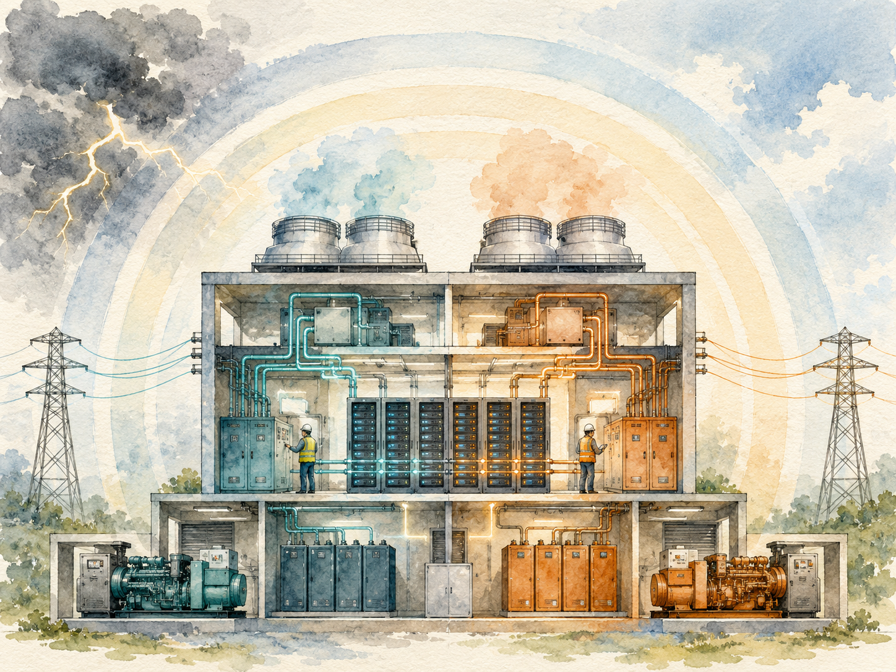
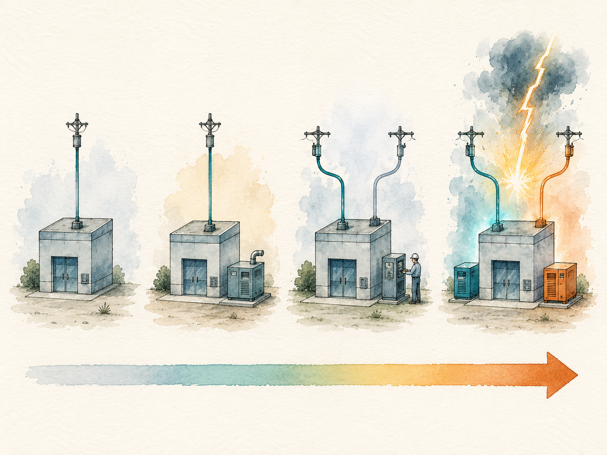

+++
date = '2026-06-08T01:00:00+00:00'
title = "【Data Center 101】Reliability Engineering: Uptime Tier, TIA-942, and the Six Redundancy Patterns"
slug = "data-center-101-04-reliability"
aliases = ["/posts/data-center-101-reliability/", "/posts/數據中心-101-可靠性設計/"]
tags = ['Data Center', 'Data Center 101', 'Passport to AI Era', '中文']
thumbnail = 'pic.png'
+++

> Inside a Tier IV data center, you can walk over to the main electrical panel, flip the master breaker to OFF, and watch nothing happen. The servers keep running. The cooling keeps flowing. The lights stay on. Somewhere in another room, a fully redundant parallel system has taken the load without a flicker.
>
> That ability — to survive any single failure invisibly — is what "reliability" actually means in this industry. It is not a marketing word. It is an engineered property with named tiers, measurable thresholds, and a cost curve that bends sharply upward at the top.
>
> 在一座 Tier IV 數據中心裡，你可以走到主電源面板前，把總開關切到 OFF，然後看著什麼事都沒發生。伺服器繼續運轉。冷卻繼續流動。燈繼續亮。在另一個房間裡，一套完全冗餘的平行系統已經毫無閃爍地接管了負載。
>
> 這個能力 —— 在不被察覺的情況下挺過任何單一故障 —— 才是這個產業「可靠性」的真正含義。它不是行銷詞彙，而是一個被工程化的屬性，有明確的等級、可量測的門檻、以及一條在最頂端急劇上揚的成本曲線。


---

## Why Reliability Has Its Own Vocabulary // 為什麼可靠性需要一套自己的詞彙

Reliability in data centers has its own language because the cost of failure is unusually concentrated. When a typical commercial building loses power for an hour, the consequences are inconvenience. When a financial-services data center loses power for an hour, the consequences are measured in millions of dollars per hour, plus regulatory penalties, customer compensation, and lasting brand damage.

數據中心的可靠性自己有一套語言，原因是「失敗的成本」高度集中。一般商業大樓停電一小時，後果是「不方便」。金融服務的數據中心停電一小時，後果用每小時數百萬美元來計算，再加上監管罰款、客戶補償、以及長期的品牌傷害。

### The downtime cost ladder // 停機成本階梯

Industry surveys (Uptime Institute, Ponemon Institute, ITIC) cluster around the same ranges:

業界調查（Uptime Institute、Ponemon Institute、ITIC）的數字大致落在同一個區間：

| Industry // 行業 | Hourly cost of downtime (USD) // 每小時停機成本 |
|---|---|
| Financial markets / trading 金融交易 | $5M – $9M |
| Large bank core systems 大型銀行核心 | $2M – $5M |
| E-commerce 電商 | $1M – $3M |
| Cloud services (per region) 雲服務（單一 region） | $500K – $2M |
| Manufacturing ERP 製造業 ERP | $100K – $500K |
| General enterprise 一般企業 | $10K – $100K |

> **For some workloads, one hour of downtime costs more than the entire annual electricity bill of the data center hosting them.**
>
> **對某些工作負載而言，一小時的停機成本超過承載它們的數據中心整年的電費。**

This explains why a bank is willing to pay roughly twice as much per kilowatt for a Tier IV data center as a hyperscale cloud operator pays for a Tier II–III data center. The bank is buying insurance against catastrophic single-event losses; the hyperscaler is engineering resilience at a different layer of the stack.

這就解釋了為什麼銀行願意為一座 Tier IV 數據中心付出大約是超大規模雲業者 Tier II–III 兩倍的 \$/kW。銀行買的是「對單一災難性事件的保險」；超大規模業者則在堆疊的另一層工程上做韌性。

---

## Part 1 — The Standards Landscape // 第一部分：標準地圖

Six standards bodies have meaningful presence in this industry, but two dominate the global conversation: the **Uptime Institute** in New York, and the **Telecommunications Industry Association (TIA)** in the United States.

業界有 6 個標準組織有實質存在感，但兩個主導全球對話：紐約的 **Uptime Institute**，以及美國的 **電信工業協會（TIA, Telecommunications Industry Association）**。

| Standard // 標準 | Issued by // 發起機構 | Coverage // 範圍 | Where it's used // 採用區域 |
|---|---|---|---|
| **Uptime Tier I–IV** | Uptime Institute (NY) | Mechanical & electrical focus<br>機電核心 | Globally recognized<br>全球通用 |
| **TIA-942 Rated 1–4** | TIA (US) | Broad: M&E + telecom + security + cabling<br>機電 + 電信 + 安防 + 佈線 | Global, strong in Americas<br>全球，美洲特別強 |
| **BICSI-002** | Building Industry Consulting Service International | Cabling-heavy<br>佈線重 | North America, Southeast Asia |
| **GB 50174** | China national standard 中國國標 | Mandatory in China<br>中國強制 | China (Class A/B/C) |
| **SS 507** | Singapore | National framework<br>國家框架 | Singapore |
| **EN 50600** | European CEN/CENELEC | EU-wide framework<br>歐盟通用 | European Union |

### Uptime vs TIA-942 — the practical difference // Uptime vs TIA-942 —— 實務差別

The two leading standards cover similar territory but with different emphasis.

兩個主流標準涵蓋相似的範圍，但側重點不同。

| Dimension // 維度 | Uptime Tier | TIA-942 Rated |
|---|---|---|
| Certification approach<br>認證方法 | Rigorous on-site verification + document review<br>嚴格現場驗證 + 文件審查 | Primarily document review<br>主要文件審查 |
| Certification fee<br>認證費用 | High ($50K–$500K+)<br>高 | Medium ($10K–$50K)<br>中 |
| Coverage<br>涵蓋範圍 | M&E heavy<br>機電重 | Broader: M&E + telecom + security + cabling + architecture<br>機電 + 電信 + 安防 + 佈線 + 建築 |
| Global recognition<br>全球認可度 | Highest<br>最高 | High<br>高 |
| Customer base<br>採用客戶 | Multinationals, banks, telecom<br>跨國企業、銀行、電信 | Americas, enterprise internal<br>美洲、企業內部 |

> **Uptime is like Michelin stars: strict, expensive, but instantly understood. TIA-942 is like ISO certification: broader, more accessible, but less recognized outside the industry.**
>
> **Uptime 像米其林星等：嚴格、昂貴、但所有人一聽就懂。TIA-942 像 ISO 認證：範圍廣、容易申請，但在業外辨識度沒那麼高。**

Globally listed colocation operators typically pursue both. Government and financial deployments often follow TIA-942 plus a local national standard such as GB 50174 in China or SS 507 in Singapore.

全球性的 Colocation 業者通常兩個都拿。政府與金融部署多半走 TIA-942 加當地國家標準（中國的 GB 50174、新加坡的 SS 507）。

---

## Part 2 — Uptime Tier I–IV // 第二部分：Uptime Tier I–IV 完整解析

The Uptime Tier system is the foundational reliability framework that every conversation eventually maps onto. Four tiers, defined by four progressively stronger guarantees about how the facility behaves under failure and maintenance.

Uptime Tier 體系是所有對話最終都會落上去的可靠性框架。四個等級，由四個逐漸增強的「故障與維護期間行為保證」定義。

### The four tiers in one table // 四個 Tier 一張表看完

| Tier | Name // 名稱 | Paths // 路徑 | Redundancy // 冗餘 | Concurrently maintainable // 在線維護 | Fault tolerant // 容錯 | Annual uptime | Annual downtime |
|---|---|---|---|---|---|---|---|
| **Tier I** | Basic Capacity<br>基本機房 | Single | None | ❌ | ❌ | 99.671% | **28.8 hr** |
| **Tier II** | Redundant Components<br>主設備冗餘 | Single | N+1 on main equipment<br>主設備 N+1 | ❌ | ❌ | 99.741% | **22.0 hr** |
| **Tier III** | Concurrently Maintainable<br>在線維護 | Multiple (1 active + 1 passive)<br>多路徑（1 主動 + 1 被動） | N+1 | ✅ | ❌ | 99.982% | **1.6 hr** |
| **Tier IV** | Fault Tolerant<br>容錯設計 | Multiple (2 active)<br>多路徑（2 主動） | 2N or 2(N+1)<br>2N 或 2(N+1) | ✅ | ✅ | 99.995% | **0.4 hr (26 min)** |

Two terms in this table do most of the work and are routinely confused.

表裡兩個術語做了大部分工作，而且常被混淆。

- **Concurrently maintainable** — any single component can be taken offline for planned maintenance without bringing down the facility. Planned outages are invisible.
- **在線維護（Concurrently maintainable）** —— 任何單一元件可以為了計畫性保養下線，整體運作不會中斷。**計畫性**停機是無感的。

  
- **Fault tolerant** — any single component can fail unexpectedly without bringing down the facility. Unplanned outages are also invisible.
- **容錯（Fault tolerant）** —— 任何單一元件可以突然故障，整體運作也不中斷。**意外性**停機同樣是無感的。


The difference: Tier III protects you from your own maintenance schedule; Tier IV additionally protects you from random failures during normal operation.

差別在於：Tier III 保護你免於「自家保養排程」造成的中斷；Tier IV 額外保護你免於正常運轉中的隨機故障。


---

### Tier I — Basic Capacity // Tier I：基本機房

A Tier I facility has one electrical path and one cooling path. There are no redundant components. Any maintenance requires bringing the facility down, and any unplanned failure causes a service interruption.

Tier I 機房有一條電力路徑與一條冷卻路徑。沒有冗餘元件。任何保養都需要把機房停機，任何意外故障都造成服務中斷。

```
Utility → Transformer → UPS → PDU → IT
            (single)    (single)   (single line)
```

Annual uptime 99.671% sounds high, but it permits **28.8 hours of downtime per year**. For dev/test environments and small offices, this is acceptable. For anything customer-facing, it is not.

99.671% 的年可用率聽起來很高，但允許**每年 28.8 小時停機**。對開發測試環境與小型辦公室來說可接受。對任何面對客戶的應用來說不能接受。

### Tier II — Redundant Components // Tier II：冗餘元件

A Tier II facility adds redundant copies of key equipment — typically a second UPS, a second generator, and additional cooling units. The distribution path is still single, however, so cabling and switchgear remain single points of failure.

Tier II 機房在關鍵設備上加冗餘 —— 通常多一台 UPS、多一台發電機、多幾組冷卻單元。配電路徑仍是單一條，所以電纜與開關櫃還是單點故障。

```
Utility → Transformer → UPS_1 → PDU → IT
                     ↘  UPS_2 ↗    (single path)
                     (N+1 backup)
```

22 hours of annual downtime is meaningful improvement over Tier I but still rules out most customer-facing applications. Tier II is most commonly seen in mid-size enterprise IT rooms and in non-critical regions of cloud providers' fleets.

每年 22 小時停機相對 Tier I 有意義的改善，但仍不足以承載多數面對客戶的應用。Tier II 最常見於中型企業 IT 機房，以及雲服務商的非關鍵 region。

### Tier III — Concurrently Maintainable // Tier III：在線維護（業界主流）

This is the level at which most modern data centers operate. Tier III introduces **multiple distribution paths** — typically one active and one passive — so that any element of the facility can be taken offline for planned maintenance while the system continues to serve IT load.

這是大多數現代數據中心運作的等級。Tier III 引入**多重配電路徑** —— 典型上是一條主動、一條被動 —— 讓設施任何元件可以為了計畫性保養下線，同時系統繼續服務 IT 負載。

```
Path A: Utility → ATS → UPS_1 → STS_1 → PDU_1 → IT side A
                                                    ↕ (dual cord)
Path B: Utility → ATS → UPS_2 → STS_2 → PDU_2 → IT side B
            (one active, one ready for switchover)
```

The critical limitation: Tier III protects you against planned outages, not unplanned ones. If the active path is being maintained and the passive path suffers an unexpected fault, the facility goes down. This is the boundary that Tier IV crosses.

關鍵限制：Tier III 保護你免於計畫性停機，但不保護意外停機。如果主動路徑正在保養，被動路徑同時意外故障，機房就會停。這就是 Tier IV 跨越的邊界。

Annual downtime drops to **1.6 hours** — a 14× improvement over Tier I. This level supports the vast majority of commercial IDCs, hyperscale CDCs, and mid-large enterprise EDCs.

每年停機降到 **1.6 小時** —— 比 Tier I 改善 14 倍。這個等級支撐絕大多數商用 IDC、超大規模 CDC、與中大型企業 EDC。

### Tier IV — Fault Tolerant // Tier IV：容錯設計（金融與政府核心）

Tier IV mirrors the entire facility. Two completely independent paths run in parallel, each capable of carrying the full IT load on its own. Any single fault — equipment failure, fire in one electrical room, water leak in one cooling loop — is absorbed by the parallel system.

Tier IV 把整座機房鏡像化。兩條完全獨立的路徑平行運轉，每一條都能單獨承擔完整 IT 負載。任何單一故障 —— 設備失效、其中一個電氣室火災、其中一條冷卻迴路漏水 —— 都被平行系統吸收。

```
Utility A → Transformer A → UPS A system (N+1) → ┐
                                                  ├→ IT (dual-corded)
Utility B → Transformer B → UPS B system (N+1) → ┘

Two systems physically separated in different rooms,
with different routing paths, in different fire zones.
```

Tier IV additionally requires **compartmentalization** — the two systems must be physically separated in different rooms, with different routing paths, and ideally in different fire zones. A fire in one electrical room cannot propagate to the other.

Tier IV 額外要求**隔艙化（Compartmentalization）** —— 兩套系統必須物理分隔在不同房間、用不同的走線路徑、最好在不同的防火分區。一個電氣室的火災不能蔓延到另一個。

> **Annual downtime: 26 minutes. This is the ceiling — and the price, both in CAPEX and in design complexity, is substantial.**
>
> **每年停機 26 分鐘。這是天花板 —— 而代價在 CAPEX 與設計複雜度上都很可觀。**

### A useful analogy: the elevator // 一個有用的類比：電梯

| Tier | Elevator equivalent // 電梯類比 |
|---|---|
| Tier I | One elevator. To service it, you shut it down.<br>一台電梯。要保養就關掉。 |
| Tier II | One main elevator + one backup. Switching during service may cause a brief stop.<br>一台主電梯 + 一台備用。切換時可能短暫停頓。 |
| Tier III | Two elevators alternating. While one is being serviced, the other carries the load. Planned maintenance is invisible.<br>兩台電梯交替運轉。一台保養時，另一台扛起。計畫性保養無感。 |
| Tier IV | Two elevators **running in parallel at all times**. If one suddenly breaks, the other has already been carrying half the load.<br>兩台電梯**永遠同時運轉**。一台突然壞掉，另一台早已扛著一半負載。 |

---

## Part 3 — TIA-942 Rated 1–4 // 第三部分：TIA-942 Rated 1–4

TIA-942 defines the same four-level structure but covers a wider scope and uses slightly different verification methodology.

TIA-942 定義同樣的四級結構，但涵蓋範圍更廣、驗證方式略不同。

| Uptime | TIA-942 | Core meaning |
|---|---|---|
| Tier IV | Rated 4 | Fault tolerance, full redundancy |
| Tier III | Rated 3 | Concurrently maintainable, multiple paths |
| Tier II | Rated 2 | Redundant capacity components |
| Tier I | Rated 1 | Basic requirements |

The two systems are typically used together rather than alternatively:

兩個體系通常是**一起用**而不是**互相替代**：

- **Uptime certification** gives global brand recognition. Buyers in any country recognize "Tier IV certified" instantly.
- **Uptime 認證**給的是全球品牌辨識度。任何國家的買家一聽到「Tier IV 認證」立刻懂。

  
- **TIA-942 compliance** gives engineers a complete specification document. It includes detailed requirements for cabling, telecommunications rooms, security zones, and architectural layout that Uptime does not address.
- **TIA-942 合規**給的是一份完整的工程規格書。包括 Uptime 沒涵蓋的佈線、電信機房、安全分區、建築布局等詳細要求。 

Most ambitious commercial data center projects pursue both certifications.

大多數有野心的商用數據中心專案兩個都拿。

---

## Part 4 — The Six Redundancy Patterns // 第四部分：六種冗餘架構

Tier definitions are abstract. The actual engineering happens through six specific redundancy patterns that determine how many units of equipment to install and how they are wired together.

Tier 的定義是抽象的。實際的工程透過六種具體的冗餘架構發生，這些架構決定要裝幾台設備、怎麼接線。

The pattern names come from a simple notation: **N** is the number of units needed to carry full load. Anything beyond N is redundant capacity.

架構名稱來自一個簡單記號：**N** 是承擔滿載所需的單元數。超過 N 的都是冗餘。

| Pattern | Capacity design // 容量設計 | Example: 1,000 kW load, 500 kW units // 範例：1,000 kW 負載、每台 500 kW | Reliability // 可靠性 | CAPEX multiple // CAPEX 倍數 |
|---|---|---|---|---|
| **N** | Bare minimum<br>剛好 | 2 units | Low (no backup)<br>低 | 1.0× |
| **N+1** | Bare minimum + 1<br>基本 + 1 | 3 units | Medium<br>中 | 1.5× |
| **N+X** | Bare minimum + X<br>基本 + X | 4 units (N+2)<br>4 台（N+2） | Medium-high<br>中高 | 2.0× |
| **2N** | Full mirror<br>完全鏡像 | 4 units (two banks of 2)<br>4 台（兩組各 2 台） | High<br>高 | 2.0× |
| **2(N+1)** | Dual + each N+1<br>雙系統 + 各 N+1 | 6 units (two banks of 3)<br>6 台（兩組各 3 台） | **Highest**<br>**最高** | 3.0× |
| **3N/2** | Distributed redundant<br>分散式冗餘 | 3 units sharing load<br>3 台分擔 | Near 2N<br>接近 2N | **1.5×** (best value)<br>**1.5×（最划算）** |

### N — no redundancy // N：無冗餘

The capacity exactly matches demand. Used in Tier I and in non-critical secondary systems. Any failure of any single component causes service interruption.

容量剛好等於需求。用在 Tier I 與非關鍵的次要系統。任何單一元件故障都造成服務中斷。

### N+1 — the workhorse // N+1：主力架構

The most widely deployed redundancy pattern. One extra unit beyond what is needed to carry full load. If any one unit fails or is taken offline for maintenance, the remaining units can still carry the full demand.

部署最廣的冗餘架構。比承擔滿載所需多一台。任何一台故障或為了保養下線，剩下的單元仍能扛起全部需求。

Example: a 1,000 kW total load with 500 kW UPS modules. N = 2 modules. N+1 = 3 modules. If one fails, the remaining two carry the 1,000 kW.

範例：1,000 kW 總負載、每台 UPS 500 kW。N = 2 台。N+1 = 3 台。任一台故障時，剩下兩台扛起 1,000 kW。

### N+X — multi-redundancy // N+X：多重冗餘

A common industry rule of thumb: **add one redundant unit for every four needed**. So N=4 becomes N+1 (5 total); N=8 becomes N+2 (10 total); N=12 becomes N+3 (15 total).

業界常見的經驗法則：**每 4 個基本單元加 1 個冗餘**。N=4 變 N+1（5 台）；N=8 變 N+2（10 台）；N=12 變 N+3（15 台）。

### 2N — the complete mirror // 2N：完全鏡像

Two completely independent systems, each capable of carrying the full IT load. The systems are physically separated — different electrical rooms, different routing paths, ideally different fire compartments.

兩套完全獨立的系統，每一套都能承擔完整 IT 負載。物理上分隔 —— 不同電氣室、不同走線路徑、最好不同防火分區。

> **An industry trap to avoid: "We have two UPS units, so we are 2N." Two units in parallel sharing one distribution path is not 2N. It is N+1. True 2N requires two complete, physically separated paths from the utility entry to the IT cabinet.**
>
> **業界常見陷阱：「我們有兩台 UPS，所以是 2N」。兩台 UPS 並聯共用同一條配電路徑不是 2N，那是 N+1。真正的 2N 需要從電力公司接入到 IT 機櫃，有兩條完整、物理分離的路徑。**

### 2(N+1) — the highest pattern // 2(N+1)：最高等級

Two mirrored systems, each internally with N+1 redundancy. This is the typical Tier IV configuration.

兩套鏡像系統，每套內部各有 N+1 冗餘。這是典型的 Tier IV 配置。

For a 1,500 kW load with 500 kW UPS modules: each side needs N = 3 modules, plus one redundant, so each side has 4 modules. Total: 8 modules. The system survives any single module failure even while one full side is offline for maintenance.

1,500 kW 負載、每台 UPS 500 kW：每邊 N = 3 台、加一台冗餘變 4 台。總共 8 台。任何單一模組故障時，即使一整邊在保養下線，系統仍能運轉。

### 3N/2 — the clever distributed pattern // 3N/2：分散式冗餘（精妙設計）

A clever pattern that approaches 2N reliability at closer to N+1 cost. Three systems each sized to carry 2/3 of the load. In normal operation, each runs at 66% capacity. When one fails, the other two ramp to 100% and carry the load between them.

精妙的架構，用接近 N+1 的成本買到接近 2N 的可靠性。三套系統各規劃承擔 2/3 負載。正常運轉時，每套跑 66% 容量。一套故障時，另外兩套各拉到 100% 共同分擔。

Example: 1,500 kW total load, 3 UPS systems at 750 kW each. Normal: each runs at 500 kW. If UPS C fails: UPS A and B each run at 750 kW. Service uninterrupted.

範例：1,500 kW 總負載、3 台 UPS 各 750 kW。正常：每台 500 kW。UPS C 故障時：UPS A、B 各跑 750 kW。服務不中斷。

This is the cloud-native approach in physical form — built into early Google data center designs and widely used in large cloud regions today.

這是雲原生思維的物理化版本 —— 早期 Google 數據中心設計就採用，今天廣泛應用於大型雲 region。

### Why higher patterns are not always better // 為什麼更高階模式不一定更好

The Uptime Institute design manual contains an interesting warning: configurations like 4N/3 or 5N/4 are technically possible, but past a certain point, the additional load-balancing complexity creates more potential failure modes than the extra redundancy eliminates.

Uptime Institute 設計手冊有一個有趣的警告：4N/3 或 5N/4 這種配置技術上做得出來，但過了某個臨界點，額外的負載均衡複雜度製造的潛在故障模式比額外冗餘消除的還多。

> **Redundancy is not a free good. Beyond a certain level, every additional redundant component is also an additional potential failure point and an additional management surface. The optimization is rarely "more N."**
>
> **冗餘不是免費的。過了某個等級，每多加一個冗餘元件，同時也是多一個潛在故障點、多一個管理面。最佳化通常不是「更多 N」。**

---

## Part 5 — Matching Tier to Customer // 第五部分：客戶與 Tier 的配對

Tier and customer category line up tightly because both are driven by the same underlying business logic: what does an hour of downtime cost?

Tier 與客戶類別緊密對應，因為兩者都被同一個底層商業邏輯驅動：一小時停機要付出多少代價？

### The cost-to-tier matrix // 成本對應 Tier 矩陣

Building on the customer cost tiers introduced in article 2:

延續本系列第 2 篇介紹的五級客戶成本：

| Customer // 客戶 | Typical Tier | Typical redundancy // 典型冗餘 | Approx. $/kW |
|---|---|---|---|
| Finance 金融 | Tier IV | 2N or 2(N+1) | > $7,000 |
| Government 政府 | Tier III/IV | N+1 or 2N | $5,200 – $7,000 |
| Enterprise 企業自用 | Tier III | N+1 | $4,100 – $5,200 |
| MTDC colocation | Tier III | N+1 | $3,500 – $4,100 |
| OTT hyperscalers OTT | Tier II/III | N+1 or even N (software-layer FT)<br>N+1 或甚至 N（軟體層容錯） | < $3,500 |

The math justifies the choice in each case. A bank that pays an extra $3,500 per kW for Tier IV — say $35 million additional CAPEX on a 10 MW build — recovers that in less than one major outage at $5 million per hour. A hyperscaler running thousands of identical racks across multiple regions can absorb single-rack failures in software, so paying for hardware-level fault tolerance is wasted capital.

每個案例的選擇都有數學上的合理性。一家銀行為 Tier IV 多付每 kW \$3,500 —— 10 MW 案場大約多 \$3,500 萬 CAPEX —— 一場大停機（每小時 \$500 萬）就回本。一家超大規模業者在多個 region 跑成千上萬台同型機櫃，可以在軟體層吸收單櫃故障，所以為硬體層容錯付錢就是浪費資本。

> **The cloud-native philosophy: failure is normal — just route around it. Banks cannot take this approach because regulatory frameworks demand hardware-level redundancy.**
>
> **雲原生哲學：故障是常態 —— 繞過去就好。銀行不能用這個方法，因為監管框架要求硬體層級的冗餘。**

---

## Part 6 — Common Misconceptions // 第六部分：常見誤解

Five misconceptions appear repeatedly in reliability discussions. Each is worth flagging because the cost of getting any of them wrong runs into the millions.

可靠性討論裡有 5 個誤解反覆出現。每一個都值得標記，因為任何一個搞錯都會花掉數百萬美元。

### Misconception 1 — "Two UPS units = 2N" // 誤解一：「兩台 UPS = 2N」

Already mentioned above. 2N is not about the equipment count. It is about **two complete, independent, physically separated paths** from the utility connection to the IT cabinet. Two UPS units sharing the same downstream distribution are N+1.

前面已經提過。2N 不是設備數量問題。**2N 是從電力公司接入到 IT 機櫃的兩條完整、獨立、物理分離的路徑**。兩台 UPS 共用同一條下游配電是 N+1。

### Misconception 2 — "Higher Tier is always better" // 誤解二：「Tier 越高越好」

False. Tier choice should be driven by the cost of downtime for the workload being hosted. For a dev/test environment or a workload that has software-layer fault tolerance, Tier II is sufficient and Tier IV is wasted capital. Engineering teams sometimes recommend the highest Tier because it eliminates blame; finance teams need to push back.

錯。Tier 選擇應該由「承載工作負載的停機成本」驅動。對開發測試環境或有軟體層容錯的工作負載來說，Tier II 已經足夠，Tier IV 是浪費資本。工程團隊有時推薦最高 Tier 是為了免責；財務團隊需要把這個推回去。

### Misconception 3 — "Tier certification doesn't matter, we built to spec" // 誤解三：「Tier 認證不重要，我們按規格蓋的」

It matters commercially. Self-claimed "Tier III equivalent" is not the same as a certified Tier III facility. Certified facilities command 20–30% higher colocation pricing precisely because the certification is a credible third-party signal. Without it, the operator has to talk every customer through the design.

商業上有差。「自稱 Tier III 等級」跟「拿到 Tier III 認證」是兩回事。拿到認證的機房 Colocation 定價高 20–30%，正是因為認證是可信的第三方訊號。沒認證的業者每個客戶都得自己解釋設計。

### Misconception 4 — "More redundancy is always more reliable" // 誤解四：「更多冗餘總是更可靠」

Past a certain point, additional redundancy introduces more failure modes than it removes. Every additional load-balancing point is a potential point of failure. The Uptime Institute explicitly warns about 4N/3 and 5N/4 configurations for this reason.

過了某個點，多加冗餘製造的故障模式比消除的還多。每個額外的負載均衡點都是潛在故障點。Uptime Institute 明確警告 4N/3 與 5N/4 配置正是這個原因。

### Misconception 5 — "Software fault tolerance lets us skip hardware redundancy" // 誤解五：「軟體容錯讓我們可以跳過硬體冗餘」

Partly true and partly dangerous. Hyperscalers really do run Tier II/III data centers and compensate at the software layer. But this works only when:

部分為真、部分危險。超大規模業者真的跑 Tier II/III 數據中心、在軟體層補償。但這只有在以下條件下才行：

- The application is genuinely stateless or has been designed for distributed fault tolerance // 應用真的是無狀態的，或有為分散式容錯而設計
- Workloads can be spread across multiple sufficiently distant geographic regions // 工作負載可以跨足夠遠的多個地理區域分散
- The cost of brief regional outages is acceptable to customers // 對短暫的 region 停機，客戶可以接受成本

A bank's core ledger or a stock exchange's matching engine does not meet these conditions. For these workloads, software fault tolerance is not a substitute for hardware redundancy — it complements it.

銀行的核心帳本或證券交易所的撮合引擎不符合這些條件。對這些工作負載，軟體容錯不是硬體冗餘的替代 —— 而是補充。

---

## Key Takeaways // 重點整理

#### 1. Reliability is a measurable, engineered property // 可靠性是可量測、可工程化的屬性

Not a marketing word. The Uptime Tier system defines four levels (I, II, III, IV) with concrete uptime thresholds (99.671% → 99.995%) and architectural requirements.

不是行銷詞。Uptime Tier 體系定義四個等級（I、II、III、IV），有具體的可用率門檻（99.671% → 99.995%）與架構要求。

#### 2. Tier III is the industry default // Tier III 是業界主流

99.982% uptime, concurrently maintainable. Used by the majority of commercial IDCs, hyperscale CDCs, and mid-to-large enterprise EDCs. Tier IV is reserved for finance, government core, and other workloads where any unplanned downtime is catastrophic.

99.982% 可用率、在線可維護。多數商用 IDC、超大規模 CDC、中大型企業 EDC 都用。Tier IV 留給金融、政府核心、以及任何「意外停機就是災難」的工作負載。

#### 3. Six redundancy patterns translate Tiers into hardware // 六種冗餘架構把 Tier 翻譯成硬體

N → N+1 → N+X → 2N → 2(N+1) → 3N/2. The "3N/2 distributed" pattern delivers near-2N reliability at near-N+1 cost — used by cloud operators at scale.

N → N+1 → N+X → 2N → 2(N+1) → 3N/2。「3N/2 分散式」架構用接近 N+1 的成本買到接近 2N 的可靠性 —— 大規模雲業者在用。

#### 4. "Two UPS units" is not 2N // 「兩台 UPS」不是 2N

Real 2N requires two complete, physically separated paths from utility entry to IT cabinet. Two units sharing distribution are N+1.

真正的 2N 需要從電力公司接入到 IT 機櫃有兩條完整、物理分離的路徑。兩台共用配電的是 N+1。

#### 5. Higher Tier is not always better // 更高 Tier 不一定更好

Choose Tier based on the cost of downtime for the workload. For workloads with software-layer fault tolerance, Tier II/III with N+1 is often the right answer. For financial systems, Tier IV with 2(N+1) usually pays for itself in one avoided incident.

依據工作負載的停機成本選 Tier。對有軟體層容錯的工作負載來說，Tier II/III + N+1 通常是對的答案。對金融系統來說，Tier IV + 2(N+1) 通常一次避免的事故就回本。

#### 6. Certification is a commercial signal, not just a technical one // 認證是商業訊號，不只是技術訊號

Uptime Tier IV-certified facilities command real pricing premiums because the certification is a credible third-party signal. Self-claimed equivalence does not.

Uptime Tier IV 認證的機房有實質的定價溢價，因為認證是可信的第三方訊號。自稱等同的沒有。

---

## What's Next // 下一篇預告

The fifth article in this series moves from reliability to **energy efficiency** — the PUE (Power Usage Effectiveness) family of metrics, the related water and grid efficiency ratios, and the space economics of "white space" versus "gray space" that determine how many cabinets a building can actually hold. We'll also see why the three core KPIs of the industry — reliability, efficiency, and density — form an impossible triangle that almost every modern design choice tries to bend.

本系列第 5 篇從可靠性走到**能源效率** —— PUE（Power Usage Effectiveness，電力使用效率）家族、相關的水與電網效率比、以及決定一棟建物實際能放多少機櫃的「白空間 vs 灰空間」經濟學。我們也會看到為什麼這個產業的三個核心 KPI —— 可靠性、能效、密度 —— 構成一個不可能三角，而幾乎每個現代設計選擇都在嘗試彎曲它。
