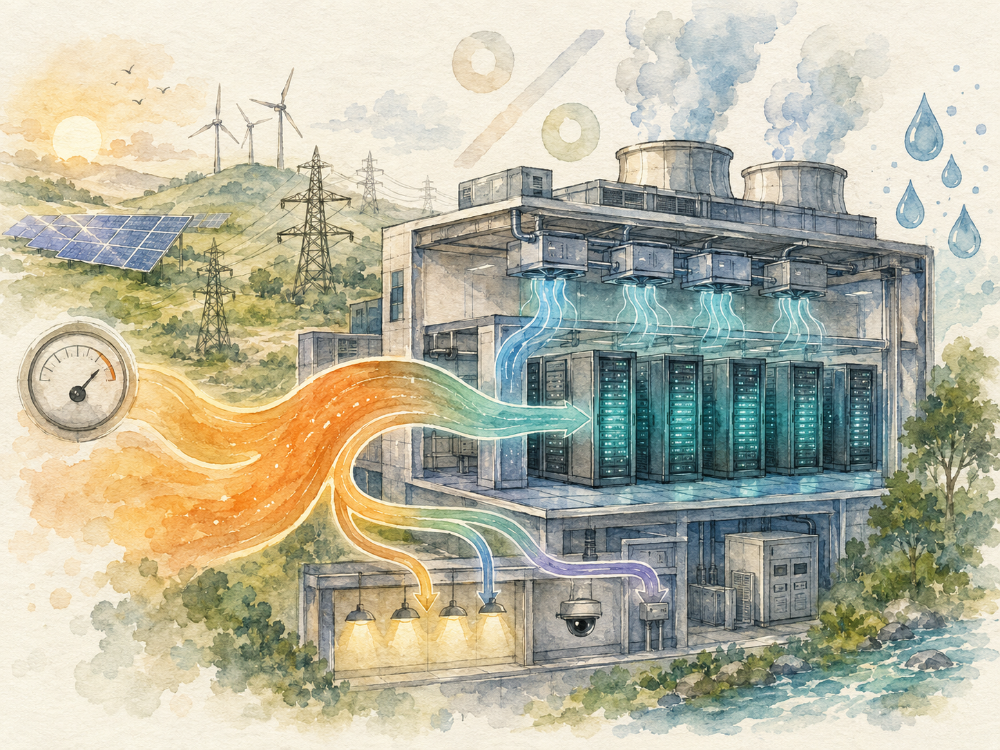
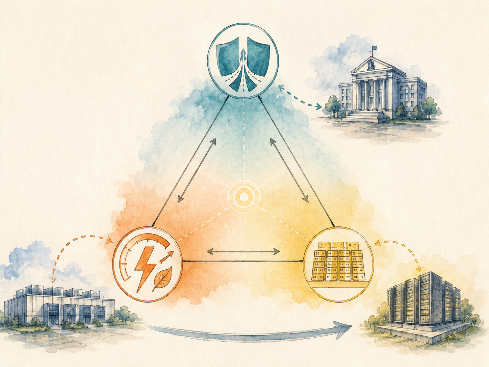

+++
date = '2026-06-09T00:00:00+00:00'
title = "【Data Center 101】Energy Efficiency and Space Economics: The PUE Family, WUE, GUE, and the Impossible Triangle"
slug = "data-center-101-05-efficiency"
aliases = ["/posts/data-center-101-efficiency/", "/posts/數據中心-101-能效與空間/"]
tags = ['Data Center', 'Data Center 101', 'Passport to AI Era', '中文']
thumbnail = 'pic.png'
math = true
+++

> Every watt of electricity flowing into a data center has only two destinations: it either powers IT equipment doing useful work, or it disappears into cooling, lighting, power conversion, and the long list of "everything else." The ratio between those two destinations is the single most important number in the industry. It has a name (**PUE**), a target (**1.0**), and a price tag that runs into the tens of millions of dollars per year for any operator above 10 MW.
>
> 每一瓦進到數據中心的電，只有兩個去處：要嘛驅動 IT 設備做有用的事，要嘛消失在冷卻、照明、電力轉換、以及一長串「其他所有東西」裡。這兩個去處之間的比例，是這個產業裡最重要的單一數字。它有名字（**PUE**）、有目標（**1.0**）、而對任何 10 MW 以上的營運者來說，它的價格標籤一年是數千萬美元。



---

## Why Efficiency Has Its Own Master Metric // 為什麼能效需要一個總指標

A 10 MW data center running at PUE 1.5 consumes 131 GWh of electricity per year. The same data center at PUE 1.2 consumes 105 GWh. The difference — 26 GWh per year — is roughly the annual consumption of 6,000 average homes. At U.S. industrial electricity rates, it is also about $2.6 million per year in pure operating savings.

一座 10 MW 數據中心若 PUE 1.5，每年消耗 131 GWh 電。同一座機房若 PUE 1.2，年耗電 105 GWh。差距 26 GWh —— 大約是 6,000 戶美國平均家庭一年用電。換算成美國工業電價，這是純粹運營省下來的每年 \$2.6M。

That kind of number explains why an entire vocabulary has grown around efficiency measurement, why governments have started writing PUE limits into regulation, and why hyperscalers are willing to relocate entire campuses to sites where the climate gives them a structural PUE advantage.

這種數字解釋了為什麼整個產業圍繞「效率量測」長出一套詞彙、為什麼政府開始把 PUE 上限寫進法規、為什麼超大規模業者願意把整座園區搬到「氣候給他們結構性 PUE 優勢」的地點。

This article walks through the **PUE family** of metrics — including PLF, CLF, OLF, WUE, and GUE — then turns to the **space economics** of white versus gray space, before showing how reliability, efficiency, and density together form an unavoidable trilemma.

這篇文章先走過 **PUE 家族**（含 PLF、CLF、OLF、WUE、GUE），然後轉到白空間與灰空間的**空間經濟學**，最後展示為什麼可靠性、能效、密度三者構成一個無法迴避的兩難。

---

## Part 1 — What PUE Actually Measures // 第一部分：PUE 究竟在量什麼

PUE stands for **Power Usage Effectiveness**. It is the ratio of total energy entering a data center to the energy actually consumed by IT equipment.

PUE 是 **Power Usage Effectiveness（電力使用效率）** 的縮寫。它是「進入數據中心的總能源」除以「IT 設備實際消耗的能源」。

\[
\text{PUE} = \frac{\text{Total facility power}}{\text{IT equipment power}}
\]

A PUE of 1.0 means every watt entering the building reaches an IT device — physically impossible because cooling, lighting, and power conversion always consume some energy. A PUE of 2.0 means half of all incoming electricity is wasted on non-IT functions.

PUE = 1.0 代表進入建物的每一瓦都到了 IT 設備 —— 物理上不可能，因為冷卻、照明、電力轉換永遠會消耗一部分能源。PUE = 2.0 代表進來的電有一半浪費在非 IT 功能上。

### The PUE benchmark ladder // PUE 標竿階梯

| PUE | Status // 狀態 | Where it shows up // 出現在哪 |
|---|---|---|
| 1.0 | Theoretical limit (impossible)<br>理論極限（不存在） | Physics doesn't allow it<br>物理上不允許 |
| 1.1 | World-class<br>世界級 | Google in Hamina, Meta in Luleå, Huawei modular pilots<br>Google 芬蘭、Meta 瑞典、華為模組化試點 |
| 1.2 | Excellent<br>優秀 | Nordic, Iceland, Inner Mongolia, Guizhou<br>北歐、冰島、內蒙古、貴州 |
| 1.3 | Industry good<br>業界優等 | Mainstream new builds in cooler regions<br>較冷地區的主流新建 |
| 1.4 | China regulatory floor for new builds<br>中國新建 DC 法規線 | Many mainstream Chinese DCs<br>許多主流中國 DC |
| 1.5 | Global average<br>全球平均 | Most existing facilities<br>多數既有機房 |
| 1.6 – 1.8 | Older or hot-climate<br>老舊或熱帶 | Legacy facilities, tropical regions<br>老機房、熱帶地區 |
| > 2.0 | Severely inefficient<br>嚴重低效 | Small server rooms, poorly designed<br>小型機房、設計不佳 |

> **A PUE difference of 0.4 — say 1.5 down to 1.1 — saves roughly $3.5 million per year on a 10 MW data center. Over a 10-year horizon, that is enough to fund a mid-sized new build.**
>
> **PUE 差 0.4 —— 例如從 1.5 降到 1.1 —— 在 10 MW 數據中心一年省下約 \$3.5M。十年累計 \$35M —— 夠蓋一座中型新機房。**

### Five things PUE does not measure // PUE 沒有量到的五件事

PUE is enormously useful but also enormously gameable. Five common ways operators "improve" PUE without actually saving energy:

PUE 非常有用，但也非常容易被操弄。業者「改善」PUE 卻沒有真省電的五種常見手法：

- **Reporting design PUE as actual PUE.** A design simulation might show 1.2; actual operations run 1.4.
- **把設計值當實測值報。** 設計模擬可能算出 1.2；實際運轉 1.4。
  
- **Reporting winter night PUE as annual average.** Beijing in January can hit PUE 1.1; Beijing in August might hit 1.5. The annual average is the honest number.
- **把冬夜最佳值當年平均報。** 北京一月可以到 PUE 1.1；八月可能 1.5。年平均才是誠實的數字。
  
- **Reporting peak-load PUE as steady-state.** PUE looks better at high utilization because the fixed overhead is amortized over more useful power.
- **把峰值負載 PUE 當常態 PUE。** PUE 在高利用率時看起來比較好，因為固定 overhead 被分攤到更多有用功率。
  
- **Choosing the measurement point that gives the best number.** PUE measured at the UPS output is lower than PUE measured at the utility entry, because UPS losses are excluded.
- **挑能給出最好數字的量測點。** 在 UPS 輸出端量到的 PUE，比在電力公司接入端量到的低，因為 UPS 損耗被排除。
  
- **Excluding parts of the load.** "Forgetting" to count office space, backup cooling, or perimeter security.
- **「忘記」算某些用電。** 漏掉辦公室、備援冷卻、周界安防。


For these reasons, **The Green Grid** — the consortium that maintains the standard — defines three measurement levels, with Level 3 being the most rigorous (continuous measurement at the UPS output and at the rack PDU, simultaneously). When PUE is contractually relevant, the level matters.

正因如此，維護標準的聯盟 **The Green Grid** 定義了三個量測等級，Level 3 最嚴格（UPS 輸出端與機櫃 PDU 同時連續量測）。當 PUE 牽涉到合約時，等級很重要。

---

## Part 2 — The PUE Family: PLF, CLF, OLF // 第二部分：PUE 家族 —— PLF、CLF、OLF

PUE can be decomposed into three factors that show **where** the overhead is going. This is the diagnostic version of PUE.

PUE 可以被拆解成三個因子，看出 overhead **跑到哪裡去了**。這是 PUE 的「診斷版」。

\[
\text{PUE} = 1 + \text{PLF} + \text{CLF} + \text{OLF}
\]

- **1** is the IT load itself — the baseline that everything else is measured against.
- **1** 是 IT 負載本身 —— 所有其他項目的基準。
  
- **PLF (Power Load Factor)** is the share of energy lost in electrical distribution: transformer losses, UPS conversion losses, cable losses, PDU losses.
- **PLF（Power Load Factor，電力負載因子）** 是電力配送過程損失的比例：變壓器損耗、UPS 轉換損耗、電纜損耗、PDU 損耗。
  
- **CLF (Cooling Load Factor)** is the share of energy consumed by cooling systems: chillers, pumps, fans, CRACs.
- **CLF（Cooling Load Factor，冷卻負載因子）** 是冷卻系統消耗的比例：冷水機、水泵、風扇、CRAC。
  
- **OLF (Other Load Factor)** is everything else: lighting, fresh air, fire systems, security.
- **OLF（Other Load Factor，其他負載因子）** 是其他所有東西：照明、新風、消防、安防。


### Typical ranges // 典型範圍

| Factor // 因子 | Typical range // 典型範圍 | Main optimization levers // 主要優化槓桿 |
|---|---|---|
| PLF | 0.08 – 0.15 | High-efficiency UPS (96%+), HVDC architecture, shorter cable runs<br>高效率 UPS（96%+）、HVDC 架構、縮短線路 |
| **CLF** | **0.20 – 0.50** ⭐ | Free cooling, evaporative cooling, liquid cooling, hot/cold aisle containment<br>自然冷卻、蒸發冷卻、液冷、冷熱通道封閉 |
| OLF | 0.02 – 0.05 | LED lighting, motion sensors, heat-recovery fresh-air systems<br>LED 照明、動作感應、新風熱回收 |

> **CLF dominates the equation, which means cooling dominates PUE optimization. A data center with PUE 1.5 has more PUE-reduction potential in its chillers than in its UPS systems by a factor of three.**
>
> **CLF 主導整個等式，意味著冷卻主導 PUE 優化。一座 PUE 1.5 的數據中心，從冷水機這邊能擠出的 PUE 改善空間，是從 UPS 那邊的三倍。**

This is why almost every major optimization story — free cooling in Nordic climates, evaporative cooling in dry regions, direct-to-chip liquid cooling for AI workloads — is fundamentally a CLF story.

這就是為什麼幾乎每個主要的優化故事 —— 北歐自然冷卻、乾燥地區蒸發冷卻、AI 工作負載的直接接觸晶片液冷 —— 本質上都是 CLF 的故事。

---

## Part 3 — WUE and GUE: The Other Two Ratios // 第三部分：WUE 與 GUE

PUE has two siblings that matter in adjacent dimensions.

PUE 有兩個在相鄰維度上重要的「兄弟姐妹」。

### WUE — Water Usage Effectiveness // WUE 水使用效率

\[
\text{WUE} = \frac{\text{Annual water consumption (L)}}{\text{Annual IT energy (kWh)}}
\]

WUE is measured in liters of water per kWh of IT load. Typical values fall between **1.2 and 2.0 L/kWh** for facilities using evaporative cooling, and can drop close to zero for facilities using air-cooled chillers.

WUE 以「每 kWh IT 負載對應多少公升水」為單位。用蒸發冷卻的機房典型值落在 **1.2 到 2.0 L/kWh**，用氣冷冷水機的機房可以接近零。

A 1,000-cabinet data center can consume **63,000 tons of water per year** — roughly the annual water usage of 300 households in a country like the United States or Australia.

一座 1,000 機櫃的數據中心一年可以用掉 **63,000 噸水** —— 大約是美國或澳洲 300 戶家庭一年的用水量。

> **In water-scarce regions like the United Arab Emirates, Singapore, and central and southern Taiwan, WUE is becoming as politically sensitive as PUE. Some operators now face the awkward trade-off that improving PUE (via evaporative cooling) makes WUE worse.**
>
> **在缺水地區（如阿聯酋、新加坡、台灣中南部），WUE 在政治上正變得跟 PUE 一樣敏感。部分業者現在面對一個尷尬的權衡：改善 PUE（用蒸發冷卻）會讓 WUE 變差。**

This tension — PUE-versus-WUE — is one of the more underappreciated structural issues in modern data center design. We will return to it in the design-trade-offs section.

這個張力 —— PUE vs. WUE —— 是現代數據中心設計裡比較少被討論的結構性議題之一。後面設計取捨章節會回頭談。

### GUE — Grid Usage Effectiveness // GUE 電網使用效率

\[
\text{GUE} = \frac{\text{IT power capacity}}{\text{Total grid power capacity}} = \frac{1}{\text{Peak PUE}}
\]

GUE is the inverse of peak PUE. It measures **what fraction of the grid capacity you applied for actually reaches IT equipment**.

GUE 是峰值 PUE 的倒數。它衡量**你申請的電網容量，最終有多少抵達 IT 設備**。

| Peak PUE | GUE | Implication // 意義 |
|---|---|---|
| 2.0 | 0.50 | Half the grid capacity you paid for is overhead<br>申請來的電網容量一半是 overhead |
| 1.5 | 0.67 | One-third still overhead<br>三分之一仍是 overhead |
| 1.2 | 0.83 | Most reaches IT<br>大部分到 IT |
| 1.1 | 0.91 | Near-maximum grid utilization<br>接近最大電網利用率 |

This matters because, as discussed in article 3, grid connection has become the single longest lead-time item in data center construction. A higher GUE means the same scarce grid connection supports more IT capacity — a 10 MVA grid connection at PUE 1.1 can host 9.1 MW of IT load, while the same connection at PUE 1.5 can host only 6.7 MW.

這很重要，因為（如第 3 篇所述）電網接入已經成為數據中心建設裡交期最長的單一項目。較高的 GUE 意味著同一條稀缺的電網接入支撐更多 IT 容量 —— 10 MVA 電網接入在 PUE 1.1 可承載 9.1 MW IT 負載，同一條接入在 PUE 1.5 只能承載 6.7 MW。

> **In markets with multi-year grid connection backlogs (Northern Virginia, Dublin, Frankfurt, Singapore), GUE has quietly become as commercially important as PUE.**
>
> **在電網接入排隊數年的市場（Northern Virginia、Dublin、Frankfurt、新加坡），GUE 已經悄悄變得跟 PUE 一樣具商業重要性。**

### A consolidated view // 一張表整合

| Metric | Formula | Typical excellent value | Who cares most |
|---|---|---|---|
| **PUE** | Total / IT | < 1.3 | Everyone |
| PLF | Distribution losses / IT | < 0.10 | Electrical engineers<br>電氣工程師 |
| **CLF** | Cooling energy / IT | < 0.30 | The main PUE battleground<br>PUE 主戰場 |
| OLF | Other energy / IT | < 0.05 | Operations teams<br>運維團隊 |
| **WUE** | Annual water L / IT kWh | < 1.5 | Water-scarce regions, ESG<br>缺水地區、ESG |
| **GUE** | IT capacity / Total capacity | > 0.80 | Planning, grid-constrained markets<br>規劃、電網受限市場 |

---

## Part 4 — Regional PUE Benchmarks and Regulation // 第四部分：各地 PUE 標竿與法規

PUE varies enormously by climate. The single biggest design lever an operator has is choosing where to build.

PUE 隨氣候差異巨大。業者掌握的最大設計槓桿，就是選擇「在哪裡蓋」。

### Global PUE benchmarks // 全球 PUE 標竿

| Region // 地區 | Typical new-build PUE | Why |
|---|---|---|
| Nordic (Iceland, Sweden, Finland)<br>北歐（冰島、瑞典、芬蘭） | **1.10 – 1.15** | Year-round cold air, hydro and geothermal power<br>全年冷氣候，水力與地熱電 |
| China Inner Mongolia, Guizhou, Ulanqab<br>中國內蒙古、貴州、烏蘭察布 | 1.15 – 1.25 | Cold climate, policy incentives<br>冷氣候、政策補貼 |
| China Beijing, Shanghai<br>中國北京、上海 | 1.30 – 1.40 | Regulatory cap at 1.4<br>法規上限 1.4 |
| US Pacific Northwest (Oregon, Washington)<br>美國西北部（俄勒岡、華盛頓） | 1.20 – 1.30 | Cool climate, hydro power<br>涼爽氣候、水力電 |
| US South (Texas, Arizona)<br>美國南部（德州、亞利桑那） | 1.40 – 1.55 | Hot, heavy cooling load<br>炎熱、冷卻負載重 |
| Singapore | 1.45 – 1.55 | Tropical, humid, dense<br>熱帶、潮濕、土地小 |
| Taiwan 台灣 | 1.45 – 1.60 | Hot, humid, but new builds can reach 1.30<br>炎熱潮濕，但新建可達 1.30 |
| Sydney 雪梨 | 1.35 – 1.50 | Mild climate, possible free cooling in winter<br>溫和氣候，冬天可自然冷卻 |
| Gulf states (Dubai, Riyadh)<br>波灣國家（杜拜、利雅德） | 1.50 – 1.80 | Extreme heat, water-constrained<br>極熱、缺水 |

### PUE regulation // PUE 法規

A growing number of jurisdictions have moved PUE from "best practice" to "legal requirement":

越來越多司法管轄區把 PUE 從「最佳實踐」升級為「法律要求」：

| Region | New-build PUE limit | Existing facility limit |
|---|---|---|
| China (national) | < 1.4 | < 1.8 |
| Beijing | < 1.3 | < 1.5 |
| Shanghai | < 1.3 | — |
| Singapore | < 1.3 (new builds) | — |
| EU (CSRD direction)<br>歐盟（CSRD 方向） | < 1.3 by 2030 | — |
| United States | No federal mandate; industry self-regulated<br>無聯邦強制；業界自律 | — |

The regulatory direction is unambiguous: PUE caps will keep tightening, and the legal floor of "acceptable" PUE will fall toward 1.2 over the next decade.

法規方向很清楚：PUE 上限會持續收緊，「可接受 PUE」的法律底線未來十年會降到 1.2 附近。

---

## Part 5 — The Four PUE Optimization Levers // 第五部分：PUE 優化的四大槓桿

PUE improvement opportunities exist at four points in a data center's life. The earlier the decision, the larger the lever.

PUE 改善的機會出現在數據中心生命週期的四個點。決策越早，槓桿越大。

### Lever 1 — Site selection // 槓桿一：選址

Decided in the planning phase, locked once construction starts.

在規劃階段決定，動工後鎖死。

| Site factor | Effect on PUE |
|---|---|
| Annual mean temperature < 15°C | Free cooling available year-round → CLF down 0.2+<br>全年自然冷卻 → CLF 降 0.2+ |
| Low humidity | Evaporative cooling viable → CLF down<br>蒸發冷卻可行 → CLF 降 |
| Abundant water | Cooling towers viable (but raises WUE)<br>冷卻塔可行（但抬高 WUE） |
| Stable grid | Less reliance on backup generators, lower PLF<br>少依賴備援，降低 PLF |
| Renewable power available | No direct PUE impact, but transforms ESG profile<br>不直接影響 PUE，但改變 ESG 樣貌 |

This is why Google operates a major facility in Hamina, Finland; why Apple's Maiden, North Carolina campus runs on solar; and why Microsoft taps hydropower from the Columbia River in Quincy, Washington.

這就是為什麼 Google 在芬蘭哈米納運轉、Apple 北卡 Maiden 園區用太陽能、Microsoft 在華盛頓州 Quincy 用 Columbia 河水力電。

### Lever 2 — Design // 槓桿二：設計

Decided in the design phase, very expensive to change later.

設計階段決定，事後變更非常貴。

| Design choice | PUE impact |
|---|---|
| UPS efficiency 93% → 96% | PUE −0.03 |
| HVDC / Panama architecture<br>HVDC / Panama 架構 | PUE −0.02 to −0.05 |
| Free cooling design<br>自然冷卻設計 | PUE −0.1 to −0.2 |
| Hot/cold aisle containment<br>冷熱通道封閉 | PUE −0.05 to −0.1 |
| In-row cooling (vs room-level)<br>行間冷卻（vs 房間級） | PUE −0.05 |
| Liquid cooling (vs air)<br>液冷（vs 氣冷） | PUE −0.1 to −0.2 |
| High inlet temperature (27°C vs 22°C)<br>高進氣溫度（27°C vs 22°C） | PUE −0.05 to −0.1 |

The high-inlet-temperature lever is notable because it costs essentially nothing — it is a setpoint change. The ASHRAE TC 9.9 guidelines now explicitly support recommended IT inlet temperatures up to 27°C, and many hyperscalers run their facilities even warmer.

「高進氣溫度」這個槓桿值得注意，因為它幾乎不花錢 —— 只是設定點變更。ASHRAE TC 9.9 規範現在明確支持 IT 進氣溫度可達 27°C，很多超大規模業者跑得更熱。

### Lever 3 — Operations // 槓桿三：運維

Continuously available, lower magnitude per action.

持續可優化，但單次行動的幅度較小。

- Setpoint optimization (raising temperature thresholds) // 設定點優化（提高溫度門檻）: PUE −0.02 to −0.05
- Airflow management (eliminating hot spots) // 氣流管理（消除熱點）: PUE −0.03
- Idle equipment power management // 閒置設備電源管理: PUE −0.02
- Seasonal mode switching (mechanical → free cooling) // 季節性模式切換（機械 → 自然冷卻）: PUE −0.03 to −0.05


### Lever 4 — AI-driven optimization // 槓桿四：AI 驅動優化

The newest lever, and the most rapidly maturing.

最新的槓桿，也是成熟最快的。

**Huawei iCooling** — Used in the Qinghai (Hainan, China) renewable-powered campus, controlling 96 in-row cooling units in a coordinated optimization loop. Reported cooling energy reduction: **about 8%**, translating to roughly 0.05–0.1 PUE improvement.

**華為 iCooling** —— 用在青海（中國海南）100% 再生能源園區，協同控制 96 台行間空調。報告冷卻能耗降低 **約 8%**，對應 PUE 改善約 0.05–0.1。

**Google DeepMind** — In a widely cited 2016 case study, applied reinforcement learning to control cooling parameters at one of Google's data centers. Reported cooling energy reduction: **40%**, with overall PUE improvement of roughly **15%**.

**Google DeepMind** —— 2016 年廣為引用的案例，用強化學習控制 Google 一座數據中心的冷卻參數。報告冷卻能耗降低 **40%**，整體 PUE 改善約 **15%**。

> **AI-driven PUE optimization is now treated as a near-mandatory component for any new hyperscale build. The technology has crossed from research curiosity to standard procurement requirement in roughly five years.**
>
> **AI 驅動的 PUE 優化現在已經被當成新建超大規模 DC 幾乎必備的元件。這個技術在約五年內從研究稀奇變成標準採購要求。**

### A relative-impact summary // 相對影響總結

```
Lever              PUE Impact     Decision point     Reversibility
────────────────────────────────────────────────────────────────────
Site selection     Largest        Planning           Locked once built
Design             Large          Design             Expensive to change
Operations         Medium         Operations         Continuously available
AI optimization    Medium-large   Operations         Continuously available
```

The cheapest dollar spent on PUE is the one spent during site selection. The most expensive dollar is the one spent ten years later, trying to retrofit a poorly sited facility.

花在 PUE 上最便宜的一塊錢是花在選址期間。最貴的一塊錢是十年後，試圖改造一座選址不佳的機房。

---

## Part 6 — White Space and Gray Space // 第六部分：白空間與灰空間

PUE measures how efficiently a data center converts grid power into useful IT work. **Space economics** measures how efficiently the same data center converts square meters into rentable or productive cabinet positions.

PUE 量「電網電力轉成有用 IT 工作」的效率。**空間經濟學**量同一座數據中心「平方公尺轉成可出租或可生產機櫃位置」的效率。

### The two-space taxonomy // 兩種空間分類

| Type | Definition | Revenue-generating? |
|---|---|---|
| **White Space 白空間** | Areas housing IT racks, storage, network gear — the rentable floor<br>放 IT 機櫃、儲存、網路設備的地方 —— 可出租樓面 | **Yes** |
| **Gray Space 灰空間** | Areas housing supporting infrastructure: UPS rooms, generator yards, cooling plants, electrical rooms, corridors<br>放支援基礎設施：UPS 室、發電機區、冷卻廠、電氣室、走廊 | **No** |

In a typical 1,000-cabinet data center:

一座典型 1,000 機櫃數據中心：

- Total building area // 總建物面積: 6,000–8,000 m²
- White space // 白空間: 2,500–3,000 m² (roughly **35%**)
- Gray space // 灰空間: 3,500–5,000 m² (roughly **65%**)
- Per-cabinet building footprint // 每櫃對應建物面積: **7 m²/cabinet**


> **In a typical data center, only one square meter in three is paying its way. The other two are paying for what makes the first one possible.**
>
> **在一座典型數據中心，每三平方公尺只有一平方公尺在賺錢。另外兩平方公尺是在為那一平方公尺能運轉而付錢。**

### Why gray space is so big // 為什麼灰空間這麼大

A handful of structural reasons explain the 65% gray-space proportion:

灰空間佔 65% 的結構性原因有幾個：

- **Cooling plant footprint** — Chillers, cooling towers, and heat exchangers occupy significant area; large facilities can dedicate over 30% of total floor area to cooling.
- **冷卻廠佔地** —— 冷水機、冷卻塔、熱交換器佔不小面積；大型機房可以把總樓面 30%+ 給冷卻用。
  
- **Electrical infrastructure** — Transformers, UPS rooms, switchgear, and battery rooms each require dedicated, often fire-rated, space with separation requirements.
- **電氣基礎設施** —— 變壓器、UPS 室、開關櫃、電池室，每樣都需要專屬空間，常常需要防火等級與隔離要求。
  
- **Generator yards** — Diesel gensets and fuel tanks need outdoor or semi-outdoor space, typically with crash protection and fire separation.
- **發電機區** —— 柴油發電機與燃油槽需要戶外或半戶外空間，通常還有撞擊保護與防火隔離。
  
- **Redundancy** — Higher Tier facilities require mirrored systems, doubling the gray-space footprint of UPS, cooling, and distribution.
- **冗餘** —— 較高 Tier 機房需要鏡像系統，把 UPS、冷卻、配電的灰空間佔比加倍。
  
- **Egress and maintenance corridors** — Building codes require minimum corridor widths for fire egress and equipment movement.
- **逃生與維修走道** —— 建築法規要求最小走道寬度給逃生與設備搬運。


---

## Part 7 — SUE and Density Economics // 第七部分：SUE 與密度經濟學

**SUE (Space Usage Effectiveness)** is the space analogue of PUE — it measures how many IT cabinets a building can host per unit of floor area.

**SUE（Space Usage Effectiveness，空間使用效率）** 是 PUE 的空間版 —— 量「每單位建物面積能容納多少 IT 機櫃」。

Different building types achieve very different SUE values:

不同建物類型達到的 SUE 差異很大：

| Facility type // 機房類型 | Per-cabinet area // 每櫃面積 | White space share // 白空間佔比 |
|---|---|---|
| Legacy traditional DC<br>傳統老舊 DC | 10–15 m²/cabinet | 25–30% |
| Standard enterprise EDC<br>一般企業 EDC | 7–8 m²/cabinet | 35–40% |
| Modern colocation IDC<br>現代 Colocation IDC | 6–7 m²/cabinet | 40–45% |
| Prefabricated modular DC (PMDC) | 4–5 m²/cabinet | **45–55%** |
| Modular + high-density + liquid-cooled<br>模組化 + 高密度 + 液冷 | 2–3 m²/cabinet | **55–65%** |

The gap between a traditional 12 m²/cabinet design and a modern 3 m²/cabinet design is roughly **4×**. For an operator building 5,000 cabinets, that is the difference between a 60,000 m² building and a 15,000 m² building — measured in tens of millions of dollars of construction cost.

傳統 12 m²/櫃 跟現代 3 m²/櫃 設計之間的差距大約是 **4 倍**。對一個要蓋 5,000 機櫃的營運者來說，這就是 60,000 m² 大樓與 15,000 m² 大樓的差別 —— 用「數千萬美元的建設成本」來衡量。

### Why density matters for revenue // 為什麼密度影響營收

A 1,000-cabinet data center where each cabinet draws 4 kW supports 4 MW of IT load. The same 1,000-cabinet building where each cabinet draws 20 kW supports 20 MW of IT load. **The building is the same; the revenue potential is 5× higher.**

一座 1,000 機櫃的數據中心，若每櫃 4 kW，承載 4 MW IT 負載。同一座 1,000 機櫃建物，若每櫃 20 kW，承載 20 MW IT 負載。**建物一樣，營收潛能高 5 倍。**

This is the central economic argument for high-density designs — and for the liquid cooling required to make them possible.

這是高密度設計（與其所需的液冷）核心的經濟論點。

### Cabinet density historical trajectory // 機櫃密度歷史軌跡

```
1990s    ~1 kW/cabinet      (legacy mainframes)
2000s    2–4 kW/cabinet     (early x86 server era)
2010s    4–8 kW/cabinet     (virtualization mainstream)
Early 2020s    8–15 kW/cabinet    (cloud workloads)
Mid 2020s    20–50 kW/cabinet   (AI/GPU clusters)
Late 2020s    100+ kW/cabinet    (NVIDIA NVL72, future)
```

Cooling technology has to follow this curve. Air cooling fails above roughly **20–25 kW/cabinet**. Anything denser requires liquid cooling — increasingly direct-to-chip or immersion.

冷卻技術必須跟上這條曲線。氣冷在約 **20–25 kW/櫃** 之上失效。更密就需要液冷 —— 越來越多走直接接觸晶片或浸沒式。

---

## Part 8 — The Impossible Triangle // 第八部分：不可能三角

This is the central design insight of modern data center engineering. Three core KPIs constrain each other, and improving any one tends to come at the cost of the others.

這是現代數據中心工程的核心設計洞察。三個核心 KPI 互相約束，任何一個的改善通常以其他兩個的代價換來。

```
                Reliability (Tier)
                       ▲
                      ╱│╲
                     ╱ │ ╲
                    ╱  │  ╲
                   ╱   │   ╲
                  ╱    │    ╲
                 ╱     │     ╲
                ╱  TRADE-OFFS ╲
               ╱       │       ╲
              ╱        │        ╲
   Efficiency (PUE) ───┴─── Density (SUE)
```

### The three trade-offs // 三組權衡

**Higher reliability fights against higher density.** A Tier IV facility with 2N redundancy needs twice the equipment, twice the gray space, and physical separation between the two systems. A 5,000-cabinet Tier IV facility takes roughly 30% more building area than a 5,000-cabinet Tier III facility.

**更高可靠性與更高密度衝突。** 2N 冗餘的 Tier IV 機房需要兩倍設備、兩倍灰空間、兩套系統物理分隔。一座 5,000 機櫃的 Tier IV 機房比同樣 5,000 機櫃的 Tier III 機房多用約 30% 建物面積。

**Lower PUE often fights against higher density.** Free cooling requires large air-handler units, deep evaporative pads, or long heat-exchanger loops. Liquid cooling distribution units (CDUs) take their own space inside the building. The PUE-optimal facility is often less SUE-optimal.

**較低 PUE 常常與更高密度衝突。** 自然冷卻需要大型空氣處理機、深層蒸發墊或長熱交換迴路。液冷分配單元（CDU）在建物內也有自己的佔地。PUE 最優的機房常常 SUE 不是最優的。

**Higher density often fights against lower PUE.** A 50 kW/cabinet rack produces concentrated heat that requires aggressive cooling, frequently liquid. The initial CAPEX for that cooling pushes PUE upward in the short term, even though it usually settles lower in steady state.

**更高密度常常與較低 PUE 衝突。** 50 kW/櫃的機櫃製造密集熱量，需要積極冷卻、通常是液冷。這部分冷卻的初期 CAPEX 短期會把 PUE 推高，雖然穩定態通常會降下去。

### How the industry bends the triangle // 業界怎麼彎這個三角

Modern designs attack the trilemma through a coordinated package of technologies:

現代設計透過一組協同技術攻擊這個兩難：

- **Modular + prefabricated layouts** compress gray space and shorten time-to-market simultaneously
- **模組化 + 預製化** 同時壓縮灰空間並縮短上市時間
  
- **In-row cooling** brings cold air closer to heat sources, reducing both fan energy (CLF) and the air-handling footprint
- **行間冷卻** 把冷空氣帶近熱源，同時降低風扇能耗（CLF）與空氣處理佔地
  
- **Liquid cooling at the cabinet** breaks the air-cooling density ceiling and pushes PUE down at the same time
- **機櫃級液冷** 打破氣冷密度天花板，同時把 PUE 往下推
  
- **Smart busbar power distribution** replaces traditional cable trays, freeing gray space and enabling rack-level reconfiguration
- **智能母線配電** 取代傳統線槽，釋放灰空間並允許機櫃級重組
  
- **AI-driven cooling control** continuously rebalances setpoints across the facility
- **AI 驅動冷卻控制** 持續在整棟機房內重新平衡設定點


These technologies do not eliminate the triangle. They bend its sides outward. A modern PMDC with liquid-cooled cabinets and AI-controlled cooling can hit Tier III, PUE 1.2, and 4 m²/cabinet simultaneously — territory that was geometrically impossible a decade ago.

這些技術沒有消滅三角形。它們把三角形的邊往外彎。一座現代 PMDC（搭配液冷機櫃與 AI 控冷）可以同時達到 Tier III、PUE 1.2、4 m²/櫃 —— 十年前在幾何上不可能的領地。



---

## Part 9 — AI Is Rewriting Space Economics // 第九部分：AI 正在改寫空間經濟學

The AI buildout has compressed a decade of density evolution into 24 months.

AI 擴建把十年的密度演進壓縮進 24 個月。

| Era | Typical density |
|---|---|
| Traditional enterprise (pre-2020) | 4–8 kW/cabinet |
| Hyperscale cloud (2020–2023) | 8–15 kW/cabinet |
| AI training cluster (NVIDIA H100, 2023–2024) | 30–50 kW/cabinet |
| GPU rack-scale (NVIDIA NVL72, 2025+) | **120 kW/cabinet** |
| Projected (Vera Rubin Ultra, 2027+) | **600 kW/cabinet** |

The implications for facility design are severe. A 5,000-cabinet building at 8 kW/cabinet hosts 40 MW of IT load. The same 5,000-cabinet building at 50 kW/cabinet hosts 250 MW of IT load — assuming the cooling, electrical distribution, and structural floor loading can be redesigned to support it. Most cannot, which is why pure AI training campuses are now being built from scratch rather than retrofitted into existing facilities.

對設施設計的影響很激烈。一座 5,000 機櫃 8 kW/櫃的機房承載 40 MW IT 負載。同樣 5,000 機櫃 50 kW/櫃的機房承載 250 MW IT 負載 —— 假設冷卻、電氣配電、結構樓板承重都能重新設計支撐。大多數做不到，這就是為什麼純 AI 訓練園區現在是從零開始蓋，而不是改造既有機房。

> **The AI workload is not just a denser version of the cloud workload. It is a structurally different building.**
>
> **AI 工作負載不只是雲端工作負載的更密版本。它是一棟結構性不同的建物。**

This is the fault line currently splitting the data center industry into two design philosophies:

這就是當前數據中心產業分裂成兩種設計哲學的斷層：

- **Traditional / cloud workload facilities** — Tier III, PUE 1.3–1.5, 8–15 kW/cabinet, air-cooled, large building footprint
- **傳統 / 雲端工作負載機房** —— Tier III、PUE 1.3–1.5、8–15 kW/櫃、氣冷、大型建物佔地
  
- **AI training / HPC facilities** — Tier II–III, PUE 1.1–1.3, 30–120 kW/cabinet, liquid-cooled, dense and compact
- **AI 訓練 / HPC 機房** —— Tier II–III、PUE 1.1–1.3、30–120 kW/櫃、液冷、密集緊湊

The two are starting to look like fundamentally different industries.

兩者開始看起來像根本不同的產業。

---

## Key Takeaways // 重點整理

#### 1. PUE is the industry's master efficiency metric // PUE 是這個產業的能效總指標

Total facility power divided by IT power. World-class is 1.1; global average is 1.5; regulatory floors in major markets are heading toward 1.3 over the next decade.

總設施電力除以 IT 電力。世界級 1.1；全球平均 1.5；主要市場的法規底線未來十年朝 1.3 走。

#### 2. CLF dominates PUE // CLF 主導 PUE

Of the three PUE factors (PLF, CLF, OLF), the cooling load factor (CLF) is by far the largest and most addressable. Almost every major optimization story is fundamentally a CLF story.

PUE 三因子中，冷卻負載因子（CLF）目前為止最大、最可優化。幾乎每個主要的優化故事本質上都是 CLF 的故事。

#### 3. WUE and GUE are the second-tier metrics that matter // WUE 與 GUE 是值得關注的次級指標

WUE matters in water-scarce regions and creates an awkward trade-off with PUE. GUE matters anywhere grid connection is constrained — which now includes most major markets globally.

WUE 在缺水地區重要，並與 PUE 形成尷尬權衡。GUE 在電網受限的地方重要 —— 現在包括全球大部分主要市場。

#### 4. Site selection is the single biggest PUE lever // 選址是 PUE 最大的單一槓桿

A site at 8°C annual mean temperature can structurally hit PUE 1.15. The same operator's design at 25°C annual mean temperature might struggle to hit 1.4. The siting decision is locked once construction starts.

年均溫 8°C 的選址結構上能打 PUE 1.15。同樣業者在年均溫 25°C 的設計可能連 1.4 都吃力。動工後選址鎖死。

#### 5. AI-driven cooling control is now standard // AI 驅動冷卻控制現在是標準

Huawei iCooling, Google DeepMind cooling control, and similar systems have moved from research curiosities to standard procurement requirements in roughly five years.

華為 iCooling、Google DeepMind 冷卻控制、以及類似系統，已經在約五年內從研究稀奇變成標準採購要求。

#### 6. Only one square meter in three is rentable // 每三平方公尺只有一平方公尺可出租

White space (housing IT) is typically only 35% of total building area. Gray space (housing supporting infrastructure) is the other 65%. Modern modular and high-density designs are pushing this ratio closer to 50/50.

白空間（放 IT）典型只佔總建物面積 35%。灰空間（放支援基礎設施）佔另外 65%。現代模組化與高密度設計把這個比例推向接近 50/50。

#### 7. The Impossible Triangle constrains every design // 不可能三角約束每個設計

Reliability (Tier) × Efficiency (PUE) × Density (SUE) cannot all be maximized at once. Modern designs bend the triangle through modular layouts, liquid cooling, and AI control — but cannot eliminate it.

可靠性（Tier）× 能效（PUE）× 密度（SUE）無法同時最大化。現代設計透過模組化、液冷、AI 控制彎曲三角形 —— 但無法消滅它。

#### 8. AI workloads are a structurally different building // AI 工作負載是結構性不同的建物

NVIDIA NVL72 at 120 kW/cabinet, with Vera Rubin Ultra projected at 600 kW/cabinet, has compressed a decade of density evolution into 24 months. The result is a fork in the industry between traditional cloud facilities and AI/HPC facilities that now look like separate engineering disciplines.

NVIDIA NVL72 120 kW/櫃，Vera Rubin Ultra 預測 600 kW/櫃，把十年的密度演進壓縮進 24 個月。結果是業界出現一個分岔，傳統雲端機房與 AI/HPC 機房現在看起來像兩個不同的工程學科。

---

## What's Next // 下一篇預告

The sixth article in this series goes deep into the **power system** — the UPS, HVDC and Panama architectures, diesel gensets, switchgear, automatic transfer switches, static transfer switches, and the smart busbar concept that is replacing traditional cable trays. We'll trace the full path from the utility connection through to the rack PDU, with particular attention to where lead times now run six months to several years.

本系列第 6 篇深入**電力系統** —— UPS、HVDC 與 Panama 架構、柴油發電機、開關設備、自動切換開關、靜態切換開關、以及取代傳統線槽的智能母線概念。我們會把從電力公司接入到機櫃 PDU 的完整路徑走一遍，特別注意現在交期從六個月到數年的地方。
