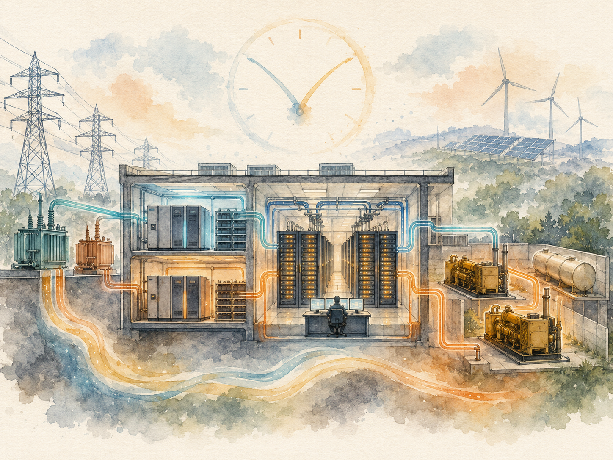

+++
date = '2026-06-12T00:00:00+00:00'
title = "【Data Center 101】Power Systems: From the Utility Connection to the Rack PDU"
slug = "data-center-101-06-power-systems"
aliases = ["/posts/data-center-101-power-systems/", "/posts/數據中心-101-電力系統/"]
tags = ['Data Center', 'Data Center 101', 'Passport to AI Era', '中文']
thumbnail = 'pic.png'
+++

> When the lights flicker in a normal building, the occupants notice but life continues. When the lights flicker in a data center, a modern server has roughly 16 milliseconds before its internal capacitors drain and the operating system crashes. Sixteen thousandths of a second. That single brutal physical constraint is why a data center's electrical system is more complex than the power infrastructure of a small town — and why an entire engineering discipline has been built around guaranteeing those 16 milliseconds are never crossed, even during a transformer fire, a substation explosion, or a major regional blackout.
>
> 當一般建物的燈閃一下，住戶會注意到但生活照常。當數據中心的燈閃一下，一台現代伺服器只有約 16 毫秒，它內部的電容就會耗盡、作業系統就會當機。16 個千分之一秒。這一個殘酷的物理約束，就是為什麼一座數據中心的電氣系統比一座小鎮的電力基礎設施還複雜 —— 也是為什麼整個工程學科被建立起來，就為了保證那 16 毫秒永遠不會被跨越，即使在變壓器火災、變電所爆炸、或大規模區域停電期間。



---

## Why the Power Chain Has Five Layers // 為什麼電力鏈有五層

A data center's power system is built as a sequence of defenses, each catching what the previous one missed. From the moment electricity leaves the utility's transmission line to the moment it enters a server's power supply, it passes through at least five distinct subsystems — each with its own failure modes, redundancy patterns, and time-to-respond budget.

數據中心的電力系統建造成一連串防線，每一層接住前一層漏掉的東西。從電力離開電力公司輸電線那一刻，到它進入伺服器電源那一刻之間，至少經過五個不同的子系統 —— 每一層都有自己的故障模式、冗餘架構、響應時間預算。

This article walks the full chain — utility connection, switchgear, automatic transfer switch, UPS, static transfer switch, distribution, and rack PDU — and then turns to the modern alternatives like HVDC, Panama architecture, and smart busbar that are rewriting the textbook.

這篇文章走過完整的鏈條 —— 電力公司接入、開關設備、自動切換開關、UPS、靜態切換開關、配電、機櫃 PDU —— 然後轉到 HVDC、Panama 架構、智能母線等正在改寫教科書的現代替代方案。

---

## Part 1 — The Complete Power Chain // 第一部分：完整的電力鏈

From the utility's high-voltage transmission line to a server's power input, electricity passes through a chain that looks roughly like this:

從電力公司的高壓輸電線到伺服器的電源輸入，電力經過大致如下的鏈條：

```
Utility grid (HV transmission)
       ↓
HV switchgear panel
       ↓
HV/MV/LV transformer (voltage stepdown)
       ↓
MV/LV switchgear (MDB → SMDB → DB)
       ↓
ATS (Automatic Transfer Switch)
       ↓
UPS (with battery backup)
       ↓
STS (Static Transfer Switch)
       ↓
PDU (Power Distribution Unit)
       ↓
rPDU (Rack PDU)
       ↓
Server power supply
```

In parallel, a diesel genset stands ready to feed back into the ATS the moment the utility connection fails.

平行地，一台柴油發電機隨時待命，在電力公司接入失效那一刻送電回 ATS。

### The five most critical nodes // 五個最關鍵節點

The chain has many components, but five of them carry disproportionate responsibility:

鏈條有很多元件，但五個承擔不成比例的責任：

| Node // 節點 | Function // 功能 | Failure consequence // 故障後果 |
|---|---|---|
| **Transformer** | Voltage step-down<br>降壓 | Whole facility down<br>整廠停電 |
| **ATS** | Switches between utility and genset<br>市電與發電機之間切換 | Backup can't take over<br>備援無法接管 |
| **UPS** | Bridges the 30-second gap between utility failure and genset startup<br>橋接市電中斷與發電機啟動的 30 秒空檔 | IT loses power immediately<br>IT 立即斷電 |
| **Genset** | Long-duration backup<br>長時間備援 | UPS batteries deplete, then IT down<br>UPS 電池耗盡，IT 斷電 |
| **PDU / rPDU** | Final distribution to the cabinet<br>最後分配到機櫃 | Cabinet-level outage<br>該機櫃停電 |

The time budgets are unforgiving. The ATS has to detect a failure and switch in well under one second. The UPS has to take over within milliseconds. The genset must start, stabilize, and synchronize within roughly 30 seconds. If any one of these misses its window, the chain breaks.

時間預算毫不留情。ATS 必須在遠少於一秒內偵測故障並切換。UPS 必須在毫秒內接管。發電機必須在約 30 秒內啟動、穩定、同步。任何一個沒抓住時間窗口，鏈條就斷。

![pic1.png]
---

## Part 2 — Three Power Architectures: UPS, HVDC, Panama // 第二部分：三種電力架構

At the highest level of design, the industry has three approaches to bridging the utility-to-server gap. One dominates; two are alternatives that have been tried and remain mostly experimental.

最高層的設計，業界有三種方法來橋接「電力公司到伺服器」的空檔。一種主導；兩種是試過但仍多半實驗性的替代方案。

| Architecture // 架構 | Global share // 市佔 | Output // 輸出 | Maturity // 成熟度 | Where it's used // 用在哪 |
|---|---|---|---|---|
| **UPS (online double conversion)** | **> 90%** | AC | Highest<br>最高 | Universal<br>通用 |
| **HVDC** | < 5% | 240–336 V DC | Medium<br>中 | Some Chinese internet and telecom operators<br>部分中國互聯網、電信業者 |
| **Panama (HVDC + integrated MV transformer)** | < 1% | 240 V DC | Low<br>低 | Limited Alibaba pilots<br>阿里部分試點 |

### Why UPS won // 為什麼 UPS 贏

UPS architecture won not because it was technically the most elegant, but because its ecosystem was the most complete:

UPS 架構贏不是因為技術上最優雅，而是因為它的生態系統最完整：

- **Standard AC output** — works with any commodity server power supply
- **標準 AC 輸出** —— 跟任何商用伺服器電源相容
  
- **Mature supply chain** — Vertiv, Schneider, Huawei, ABB, Eaton, Delta, Mitsubishi all compete in the same socket
- **成熟供應鏈** —— Vertiv、Schneider、Huawei、ABB、Eaton、Delta、三菱在同一個 socket 競爭
  
- **Maintenance bypass available** — facility can be serviced without taking IT offline
- **可用維修旁路** —— 機房可以保養而不下線 IT
  
- **Wide engineering talent pool** — anyone trained on electrical systems understands UPS
- **廣泛的工程人才池** —— 任何電氣系統訓練過的人都懂 UPS


HVDC eliminates one AC/DC conversion stage and is theoretically more efficient, but requires customized server power supplies, breaks the standard supply chain, and offers no compelling overall efficiency advantage in practice. Panama goes further by integrating the medium-voltage transformer with HVDC conversion — interesting on paper, but only deployed in limited Alibaba projects.

HVDC 消除了一個 AC/DC 轉換階段，理論上更有效率，但需要客製化伺服器電源、打破標準供應鏈、且實務上整體能效優勢不顯著。Panama 更進一步把中壓變壓器跟 HVDC 轉換整合 —— 紙上有趣，但只在阿里部分專案部署。

> **Ecosystem advantages tend to beat single-point technical advantages. UPS is a useful case study of that pattern in industrial infrastructure.**
>
> **生態系統優勢通常打敗單點技術優勢。UPS 在工業基礎設施裡是這個規律的有用案例。**

---

## Part 3 — UPS Deep Dive // 第三部分：UPS 深入解析

The UPS is the most fully engineered single component in the data center. Understanding how it works is the foundation for everything else.

UPS 是數據中心裡最完整工程化的單一元件。理解它怎麼運作是其他一切的基礎。

### Online double conversion // 在線雙轉換

Modern data center UPS systems use the **online double-conversion** topology. The name describes the two conversions:

現代數據中心 UPS 用**在線雙轉換**拓樸。名字描述了兩次轉換：

1. AC from the utility enters a **rectifier** that converts it to DC. // 從電力公司來的 AC 進入**整流器**轉成 DC。
2. The DC bus feeds an **inverter** that converts it back to AC for the IT load. // DC 母線餵給**逆變器**，把它轉回 AC 給 IT 負載。
3. In parallel, the same DC bus charges the battery string. // 平行地，同一條 DC 母線充電給電池組。


When the utility fails, the rectifier stops, the battery instantly takes over feeding the DC bus, and the inverter continues outputting clean AC. From the server's perspective, **nothing happened** — the inverter has been the only power source the IT load has ever seen.

當市電失效，整流器停止，電池立即接手餵 DC 母線，逆變器繼續輸出乾淨的 AC。從伺服器的角度看，**什麼事都沒發生** —— 逆變器一直是 IT 負載唯一見過的電源。

The cost of this elegance is conversion loss. Each conversion stage is roughly 96–98% efficient, so two stages compound to about 93–96% end-to-end. This is why the UPS efficiency war between vendors — Vertiv 95%, Huawei 96%, Schneider 96% — translates directly into PUE.

這個優雅的代價是轉換損耗。每個轉換階段約 96–98% 效率，兩階段複合到端到端約 93–96%。這就是為什麼廠商之間的 UPS 效率戰爭 —— Vertiv 95%、華為 96%、Schneider 96% —— 直接翻譯成 PUE。

### The three UPS topologies // 三種 UPS 拓樸

| Topology | What it is | Best for |
|---|---|---|
| **Tower UPS** | Single integrated unit, fixed capacity<br>單一整合單元、固定容量 | Small facilities, no expansion need<br>小型機房、無擴展需求 |
| **Modular UPS** | Multiple hot-swappable power modules sharing a common chassis<br>多個熱插拔電源模組共用機箱 | All modern IDCs, CDCs, mid-to-large EDCs<br>所有現代 IDC、CDC、中大型 EDC |
| **Integrated UPS** | UPS + power distribution combined in one cabinet, sized for a prefabricated module<br>UPS + 配電合在一個機櫃，配合預製化模組 | PMDCs, edge data centers<br>PMDC、邊緣 DC |

Modular UPS has become the industry default since the early 2010s, for three reasons: hot-swap maintenance without de-energizing the facility, easier N+1 redundancy by adding one extra module, and capacity scaling by adding modules instead of replacing the chassis.

模組化 UPS 從 2010 年代初成為業界預設，原因三個：熱插拔保養不需要把機房斷電、加一個額外模組就達成 N+1 冗餘、加模組擴容而不是換機箱。

### The bypass // 旁路

Every UPS has at least one bypass path: a direct connection from the utility input to the output, used during maintenance or fault. There are two kinds:

每台 UPS 至少有一條旁路路徑：從市電輸入直接連到輸出，在保養或故障時用。有兩種：

- **Maintenance bypass** — manual switch that lets the UPS be powered down for service while the load continues running off raw utility power
- **維護旁路** —— 手動開關，讓 UPS 停機保養，同時負載繼續用原始市電
  
- **Static bypass** — automatic switch (semiconductor-based) that engages during overload or internal UPS fault
- **靜態旁路** —— 自動開關（半導體），在過載或 UPS 內部故障時啟動


Both are critical to operational continuity. A UPS without maintenance bypass cannot be serviced without taking IT offline, which is why HVDC (which lacks maintenance bypass) is unsuitable for most applications.

兩者對運轉連續性都關鍵。沒有維護旁路的 UPS 不能保養而不下線 IT，這就是為什麼 HVDC（沒有維護旁路）不適合多數應用。

---

## Part 4 — Batteries: From VRLA to Lithium // 第四部分：電池 —— 從 VRLA 到鋰電

The battery is the part of the UPS that actually holds the energy during a utility outage. The battery layer has changed more in the last five years than in the previous thirty.

電池是 UPS 在市電中斷時實際存能量的部分。電池層在過去 5 年的變化比之前 30 年都大。

### Lead-acid (VRLA): the incumbent // 鉛酸 VRLA：傳統主流

Valve-Regulated Lead-Acid (VRLA) batteries have dominated data center backup for forty years. Mature supply chain, low CAPEX, well-understood failure modes. But a 5-to-7 year lifespan, large footprint, and stringent temperature requirements (degradation accelerates above 25°C) increasingly look unattractive.

閥控鉛酸（VRLA, Valve-Regulated Lead-Acid）電池主導數據中心備援 40 年。供應鏈成熟、CAPEX 低、故障模式清楚。但 5 到 7 年壽命、佔地大、嚴格溫度要求（高於 25°C 就加速衰退），看起來越來越沒吸引力。

| Property | VRLA |
|---|---|
| Lifespan<br>壽命 | 5–7 years |
| Round-trip efficiency<br>充放電效率 | 80–85% |
| Self-discharge<br>自放電 | High |
| Operating temperature<br>操作溫度 | Strict (25°C optimal) |
| Footprint<br>佔地 | Large |
| Failure mode<br>故障模式 | Predictable, well-understood<br>可預測、容易理解 |

### Lithium-ion (Li-ion): the new mainstream // 鋰電：新主流

Lithium-ion adoption in data centers accelerated after 2018. The economics now favor lithium even at higher CAPEX, because the longer lifespan and smaller footprint repay the difference within the equipment lifecycle.

鋰電在數據中心的採用從 2018 年後加速。經濟學現在偏向鋰電（即使 CAPEX 較高），因為更長壽命與更小佔地會在設備生命週期內補回差額。

| Property | Li-ion |
|---|---|
| Lifespan<br>壽命 | 10–15 years |
| Round-trip efficiency<br>充放電效率 | 95–98% |
| Self-discharge<br>自放電 | Low |
| Operating temperature<br>操作溫度 | Wide (−20°C to 50°C) |
| Footprint<br>佔地 | ~60% smaller than VRLA<br>比 VRLA 小 60% |
| Failure mode<br>故障模式 | Includes thermal runaway risk<br>含熱失控風險 |
| BMS required<br>需要 BMS | Yes — battery management system mandatory<br>必須 |

> **Lithium thermal runaway — where a damaged or overheated cell triggers an exothermic chain reaction — is the one failure mode lead-acid does not have. Fire protection design for lithium battery rooms is meaningfully different, sometimes involving fluorocarbon gas plus water mist as a dual-stage approach.**
>
> **鋰電熱失控 —— 受損或過熱電芯觸發放熱連鎖反應 —— 是鉛酸沒有的單一故障模式。鋰電池房的消防設計實質不同，有時用氟化物氣體加水霧的雙階段做法。**

### Cell suppliers // 電芯供應商

The actual lithium cells inside a Huawei SmartLi or Vertiv lithium UPS come from the same handful of cell makers that supply the EV industry: CATL, BYD, EVE Energy, Samsung SDI, LG Energy Solution, Panasonic. As article 3 noted, this means data center battery procurement now competes directly with electric vehicles for the same cells.

華為 SmartLi 或 Vertiv 鋰電 UPS 裡的實際電芯，來自同一批供應電動車產業的電芯廠：CATL、BYD、EVE Energy、Samsung SDI、LG Energy Solution、Panasonic。如第 3 篇所述，這意味著數據中心電池採購現在直接跟電動車搶同一批電芯。

---

## Part 5 — Gensets: The Last Line of Defense // 第五部分：發電機 —— 最後一道防線

The UPS bridges seconds. The genset bridges hours.

UPS 橋接秒。發電機橋接小時。

A typical data center is designed so that the UPS battery can carry the IT load for **5 to 15 minutes**, which is comfortably longer than the **20 to 30 seconds** a diesel genset needs to start, stabilize, and synchronize to the load. Once the genset takes over, it can carry the facility for as long as the fuel supply lasts — typically **24 to 72 hours** stored on-site, with refueling contracts for longer outages.

典型數據中心設計成 UPS 電池能扛 IT 負載 **5 到 15 分鐘**，舒適地長於柴油發電機啟動、穩定、與負載同步所需的 **20 到 30 秒**。一旦發電機接管，它可以扛機房直到燃油用完 —— 典型現場儲存 **24 到 72 小時**，更長中斷有加油合約。

### Voltage class choice // 電壓等級選擇

| Class | Voltage | Use |
|---|---|---|
| HV | 35 kV | Very large data centers, multi-MW genset arrays<br>非常大型 DC、多 MW 發電機陣列 |
| MV | 10 kV | Medium-to-large data centers<br>中大型 DC |
| LV | 380–415 V | Small-to-medium data centers<br>中小型 DC |

Three rules of thumb hold across the industry:

業界三個經驗法則：

- A single low-voltage genset typically tops out at about **2,400 kW**. Larger single units run at medium voltage.
- 單一低壓發電機典型上限約 **2,400 kW**。更大的單機跑中壓。
  
- Paralleling more than **10 low-voltage gensets** becomes operationally complex, so the practical ceiling for an LV genset farm is about 24 MW.
- 並聯超過 **10 台低壓發電機**運轉複雜，所以 LV 發電機群實務上限約 24 MW。
  
- The cost-per-kW sweet spot for diesel gensets is around **1,800 kW** — standard parts, abundant service support, and easy parallel operation.
- 柴油發電機的每 kW 性價比甜蜜點約 **1,800 kW** —— 標準零件、服務支援充足、並聯容易。


### Container-type gensets // 貨櫃式發電機

Increasingly, data centers deploy gensets pre-installed in standard 40-foot containers, with fuel system, exhaust silencer, and switchgear integrated at the factory. The container arrives on site, gets connected to fuel and electrical infrastructure, and is operational within days rather than months. This is part of the broader prefabrication trend covered in a later article.

越來越多數據中心採用預裝在標準 40 呎貨櫃裡的發電機，工廠就整合好燃油系統、消音器、開關設備。貨櫃到現場、接上燃油與電氣基礎設施，就在幾天而不是幾個月內可運轉。這是後面文章會講的更廣泛預製化趨勢的一部分。

### Major genset vendors // 主要發電機廠商

| Vendor | HQ | Notable |
|---|---|---|
| **Caterpillar** | USA | Largest global service network |
| **Cummins** | USA | Highest data center market share |
| **MTU (Rolls-Royce Power Systems)** | Germany | Efficiency leader in high-end European market |
| **Kohler** | USA | Quality reputation in mid-tier |
| **Mitsubishi Heavy** | Japan | Japan-aligned financial / government |
| **Wärtsilä** | Finland | 10 MW+ very large market |

---

## Part 6 — Switchgear: HV, MV, LV, and Form Levels // 第六部分：開關設備 —— HV、MV、LV 與 Form 等級

Between every voltage step-down in a data center sits a switchgear cabinet — physically large, fire-rated enclosures containing circuit breakers, busbars, metering, and protection relays.

數據中心每個降壓階段之間都有一個開關設備櫃 —— 物理上大、防火等級的機殼，裡面有斷路器、母線、計量、保護繼電器。

### The cabinet hierarchy // 機櫃層級

```
MDB (Main Distribution Board)
       ↓
SMDB (Sub-Main Distribution Board)
       ↓
DB (Distribution Board)
       ↓
End loads (PDUs, cooling units, lighting, etc.)
```

The MDB is the main feeder, typically 2,500–4,000 A. The SMDB is the intermediate stage, installed near load centers. The DB serves end loads — PDUs, mechanical equipment, lighting.

MDB 是主供電，典型 2,500–4,000 A。SMDB 是中間階段，安裝在負載中心附近。DB 服務末端負載 —— PDU、機械設備、照明。

### Form levels — the safety hierarchy // Form 等級 —— 安全層級

IEC 61439 (and the Chinese GB 7251 equivalent) defines seven "Form" levels for low-voltage switchgear, classifying how completely the internal components — busbars, switches, terminals — are physically isolated from each other.

IEC 61439（與中國的 GB 7251 對應）為低壓開關設備定義 7 個「Form」等級，分類內部元件（母線、開關、端子）彼此物理隔離的程度。

| Form | Isolation level // 隔離程度 | Typical use // 典型應用 |
|---|---|---|
| Form 1 | No isolation<br>無隔離 | Simple applications, fixed-type cabinets<br>簡單應用、固定式機櫃 |
| Form 2a / 2b | Terminals partly isolated<br>端子部分隔離 | Mid-range applications |
| Form 3a / 3b | Switches isolated from each other<br>開關之間互相隔離 | Industry mainstream (drawer-type)<br>業界主流（抽屜式） |
| Form 4a | Terminals and switches in shared compartment<br>端子與開關同隔艙 | High safety |
| Form 4b | Terminals, busbars, and switches all fully isolated<br>端子、母線、開關全部隔離 | Highest safety<br>最高安全 |

The industry mainstream is Form 3b. Tier IV financial facilities frequently specify Form 4b. The trade-off is that higher Form levels are more expensive and have worse natural heat dissipation, so they need active cooling inside the cabinet.

業界主流是 Form 3b。Tier IV 金融機房常指定 Form 4b。權衡是更高 Form 等級更貴、自然散熱差，所以櫃內需要主動冷卻。

---

## Part 7 — Circuit Breakers: ACB, MCCB, MCB // 第七部分：斷路器 —— ACB、MCCB、MCB

Inside every switchgear cabinet are the breakers that actually interrupt fault currents. Three families do most of the work.

每個開關設備櫃裡都有實際中斷故障電流的斷路器。三個系列做大部分工作。

| Type | Full name | Rated current // 額定電流 | Where it sits // 用在哪 |
|---|---|---|---|
| **ACB** | Air Circuit Breaker | Up to **6,300 A**<br>最大 6,300 A | Primary distribution (MDB)<br>主配電 |
| **MCCB** | Moulded Case Circuit Breaker | Up to **1,600 A**<br>最大 1,600 A | Any distribution level<br>各級配電通用 |
| **MCB** | Miniature Circuit Breaker | **1–63 A** | Terminal distribution (DB)<br>末端配電 |

### Trip unit configurations // 跳脫單元配置

ACB and MCCB units are usually specified with a "trip unit" that defines what events trigger the breaker. The standard nomenclature is **LSIG**:

ACB 與 MCCB 通常配「跳脫單元」，定義什麼事件觸發斷路器。標準命名是 **LSIG**：

- **L** — Long-time (overload protection) // 長延時（過載保護）
- **S** — Short-time (short-delay) // 短延時
- **I** — Instantaneous (short-circuit) // 瞬時（短路）
- **G** — Ground fault // 接地故障


A breaker specified as "LSIG" has full four-function protection. Cheaper variants drop one or more letters. For Tier III/IV facilities, LSIG is the standard.

被指定為「LSIG」的斷路器有完整四功能保護。便宜版會少一兩個字母。Tier III/IV 機房，LSIG 是標準。

### Major vendors // 主要廠商

The breaker industry is highly consolidated:

斷路器產業高度集中：

- **Schneider Electric** — Masterpact (ACB), Compact NSX (MCCB), Acti9 (MCB)
- **ABB** — Emax (ACB), Tmax (MCCB), S200 (MCB)
- **Siemens** — 3WL (ACB), 3VL (MCCB), 5SL (MCB)
- **Mitsubishi Electric** — AE (ACB), NF (MCCB)
- **Eaton** — Magnum (ACB), Series G (MCCB)

A common procurement pattern is to standardize on a single vendor's full family of breakers across a facility — it simplifies protection coordination, spare parts, and engineer familiarity.

常見採購做法是整廠標準化在單一廠商的全系列斷路器 —— 簡化保護協調、備品、工程師熟悉度。

---

## Part 8 — ATS vs STS: The Two Switching Technologies // 第八部分：ATS vs STS —— 兩種切換技術

Two different switches sit at two different places in the chain, with two very different time budgets.

兩個不同的開關坐在鏈條兩個不同位置，有兩個非常不同的時間預算。

### ATS — Automatic Transfer Switch // 自動切換開關

**Function:** Switches between utility and genset.

**功能：** 在市電與發電機之間切換。

**Switching time:** 50–200 milliseconds.

**切換時間：** 50–200 毫秒。

This is slow by IT standards, but the UPS is already carrying the load. The ATS does not need to be fast enough to keep IT online — it just needs to be reliable enough to bring the genset into service before the UPS battery depletes.

以 IT 標準算慢，但 UPS 已經扛著負載。ATS 不需要快到讓 IT 不下線 —— 只需要可靠到在 UPS 電池耗盡之前把發電機帶上線。

Major ATS vendors: ASCO (Schneider), Eaton, GE, Russelectric (Siemens), Cummins, Generac.

主要 ATS 廠商：ASCO（Schneider）、Eaton、GE、Russelectric（Siemens）、Cummins、Generac。

### STS — Static Transfer Switch // 靜態切換開關

**Function:** Switches between two UPS paths (A side and B side) downstream of the UPS.

**功能：** 在 UPS 下游兩條路徑（A 邊與 B 邊）之間切換。

**Switching time:** **Less than 4 milliseconds.**

**切換時間：** **少於 4 毫秒。**

This is fast because it has to be. The STS feeds IT equipment directly. A switch slower than the server power supply's hold-up time would cause servers to reset.

這個快是必須的。STS 直接餵 IT 設備。比伺服器電源 hold-up 時間慢的切換會讓伺服器重啟。

The technology is fundamentally different — STS uses semiconductor switching (SCR or IGBT), not mechanical contacts. This is why it is sub-4-millisecond fast and also why it is meaningfully more expensive than an ATS of equivalent current rating.

技術根本不同 —— STS 用半導體切換（SCR 或 IGBT），不是機械接點。這就是為什麼它可以小於 4 毫秒，也是為什麼它比同等電流額定的 ATS 顯著貴。

### Side by side // 並列對比

| Dimension | ATS | STS |
|---|---|---|
| What it switches // 切換什麼 | Utility ↔ Genset | UPS A ↔ UPS B |
| Switching time // 切換時間 | 50–200 ms | **< 4 ms** |
| Technology // 技術 | Mechanical (electromagnetic) | Semiconductor (SCR/IGBT) |
| Position in chain // 在鏈條位置 | Upstream of UPS<br>UPS 上游 | Downstream of UPS<br>UPS 下游 |
| Cost (relative) | Lower | Higher |

> **The ATS and STS are often confused in writing because both have "transfer switch" in the name. The practical difference — 1,000× in switching speed — is exactly the gap between "keeping the facility running" and "keeping the servers from rebooting."**
>
> **ATS 與 STS 在書面上常被混淆，因為兩者名字都有「transfer switch」。實務差別 —— 切換速度 1,000 倍 —— 正好是「讓機房繼續運轉」與「讓伺服器不重啟」之間的鴻溝。**

---

## Part 9 — PDU and rPDU: The Last Mile // 第九部分：PDU 與 rPDU —— 最後一哩

After all the high-amperage upstream infrastructure, the power finally arrives at the racks via two simpler-looking devices.

在所有高電流上游基礎設施之後，電力最終透過兩個看起來較簡單的裝置抵達機櫃。

| Device | What it is | Where it sits |
|---|---|---|
| **PDU (Power Distribution Unit)** | Floor-standing cabinet, 100–400 A, distributes to multiple racks<br>地面式機櫃、100–400 A、配電到多個機櫃 | Outside or at the end of a row |
| **rPDU (Rack PDU)** | Rack-mounted power strip with multiple outlets per rack<br>機櫃內的多孔電源條 | Inside the cabinet |

A traditional rPDU is just a power strip with monitoring. A modern **intelligent rPDU** measures voltage, current, power, energy, and temperature at every individual outlet — typically 24 to 48 outlets per rPDU.

傳統 rPDU 只是有監控的電源條。現代**智能 rPDU** 在每個獨立插座量電壓、電流、功率、能量、溫度 —— 典型每 rPDU 24 到 48 個插座。

This per-outlet visibility matters because it lets data center management software trace power consumption to individual servers, detect early-warning anomalies like rising contact temperature, and execute remote on/off control during incident response.

每插座可視性重要，因為它讓 DCIM 軟體把電力消耗追到單一伺服器、偵測早期異常（如接點溫度上升）、在事件響應時遠端控制單一插座的開關。

Major rPDU vendors: Vertiv Geist / Liebert, Schneider APC, Eaton ePDU, Server Technology (Legrand), Raritan (Legrand), Tripp Lite (Eaton), Delta.

主要 rPDU 廠商：Vertiv Geist / Liebert、Schneider APC、Eaton ePDU、Server Technology（Legrand）、Raritan（Legrand）、Tripp Lite（Eaton）、台達。

---

## Part 10 — Smart Busbar: The Cable Alternative // 第十部分：智能母線 —— 電纜的替代方案

For decades, the standard way to feed PDUs from upstream switchgear was overhead or underfloor copper cable. **Smart busbar** is the increasingly dominant alternative — a continuous overhead rail with snap-in PDU tap-off boxes.

幾十年來，從上游開關設備餵 PDU 的標準方法是頂上或地板下的銅纜。**智能母線**是越來越主導的替代方案 —— 一條連續的頂部軌道，搭配快插式 PDU 取電盒。

### Traditional cabling versus smart busbar // 傳統電纜 vs 智能母線

```
Traditional:
PDC → cable → rack 1
       ↓
       cable → rack 2
              ↓
              cable → rack 3 ...

Each rack requires running new cable. Reconfiguring means powering down.

Smart busbar:
PDC → [Input unit] → ===CONTINUOUS BUSBAR===
                          ↓        ↓        ↓
                       [PDU]    [PDU]    [PDU]
                          ↓        ↓        ↓
                       rack 1   rack 2   rack 3

Adding or moving a rack means clipping a new PDU tap onto the bar.
```

The three components of a smart busbar system:

智能母線系統的三個元件：

- **GIU** (General Input Unit，進線單元) — Feeds power from the upstream switchgear into the busbar // 從上游開關設備把電送進母線
- **BTU** (Busbar Trunking Unit，母線槽) — The continuous overhead bar // 連續的頂部母線
- **PDU tap-off boxes 取電盒** — Snap onto the bar to feed individual cabinets // 卡到母線上餵單一機櫃


The advantages over traditional cabling are significant: hot-swappable cabinet additions without de-energizing, far shorter installation time, real-time per-circuit monitoring, fewer cable joints (each of which is a potential failure point), and lower fire risk in the overhead routing zone.

相對傳統電纜的優勢顯著：熱插拔加機櫃不需要斷電、安裝時間大幅縮短、即時單迴路監控、更少電纜接點（每個都是潛在故障點）、頂部路由區火災風險較低。

Major smart busbar vendors:

主要智能母線廠商：

- **Starline (Universal Electric)** — Data center–specialized Track Busway leader
- **Schneider Canalis / I-LINE**
- **ABB, Siemens, Eaton, Legrand** — Industrial-scale
- **Huawei Smart Busbar** — Integrated with FusionModule offerings

---

## Part 11 — Lead Times Across the Power Chain // 第十一部分：電力鏈各環節的交期

As article 3 detailed, power equipment lead times have stretched dramatically since 2020. The headline numbers, focused on the power chain:

如第 3 篇所述，電力設備交期自 2020 年起大幅拉長。聚焦電力鏈的主要數字：

| Item | Pre-2020 lead time | 2025–2026 lead time |
|---|---|---|
| High-voltage transformer | 12 months | **3–5 years** |
| Medium-voltage switchgear | 3 months | 12–18 months |
| Low-voltage switchgear (LVSG) | 8 weeks | 9–15 months |
| Diesel genset (1–2 MW) | 4 months | 6–12 months |
| Large UPS (500 kVA+) | 3 months | 4–9 months |
| Lithium-ion battery cells | 3 months | 6–12 months |
| Grid connection (100 MW) | 18 months | **3–7 years** |

The pattern is unambiguous: every category has lengthened, and the longest lead times are now at the upstream-of-the-data-center end (transformers and grid connections), where the supply chain crosses into raw materials and utility infrastructure that no individual data center operator controls.

規律明確：每個類別都拉長，最長交期現在落在數據中心上游端（變壓器與電網接入），供應鏈在那裡跨進到原物料與電力公司基礎設施 —— 沒有任何單一數據中心營運者能控制。

---

## Key Takeaways // 重點整理

#### 1. The power chain has at least five critical nodes // 電力鏈至少有五個關鍵節點

Transformer, ATS, UPS, genset, PDU/rPDU. Each has its own failure modes, redundancy patterns, and time-to-respond budget. The chain only works when every node holds.

變壓器、ATS、UPS、發電機、PDU/rPDU。每一個有自己的故障模式、冗餘架構、響應時間預算。鏈條只有在每個節點都撐住時才運作。

#### 2. UPS won the architecture war through ecosystem, not pure technical merit // UPS 靠生態系統而非純技術贏架構戰

Online double-conversion UPS holds over 90% of the market. HVDC and Panama are technically reasonable but lack the supply chain, talent pool, and standard server compatibility that UPS commands.

在線雙轉換 UPS 拿超過 90% 市佔。HVDC 與 Panama 技術上合理，但缺乏 UPS 擁有的供應鏈、人才池、標準伺服器相容性。

#### 3. Lithium-ion has replaced VRLA as the default for new builds // 鋰電已取代 VRLA 成為新建預設

10–15 year lifespan, 95–98% efficiency, 60% smaller footprint — but with thermal runaway risk that requires fundamentally different fire protection design.

10–15 年壽命、95–98% 效率、佔地小 60% —— 但有熱失控風險，需要根本不同的消防設計。

#### 4. ATS and STS are different switches // ATS 與 STS 是不同的開關

ATS switches between utility and genset, 50–200 ms, mechanical. STS switches between two UPS paths, < 4 ms, semiconductor. The naming is confusingly similar; the time gap is 1,000×.

ATS 在市電與發電機之間切換，50–200 ms，機械式。STS 在兩條 UPS 路徑之間切換，< 4 ms，半導體。命名相似令人混淆；時間差距 1,000 倍。

#### 5. The 1,800 kW genset is the cost-per-kW sweet spot // 1,800 kW 發電機是性價比甜蜜點

Standard parts, abundant service, easy parallel operation. Single low-voltage gensets cap out at 2,400 kW; parallel arrays cap at about 10 units. Larger needs go to medium-voltage gensets.

標準零件、服務充足、並聯容易。單一低壓發電機上限 2,400 kW；並聯陣列約上限 10 台。更大需求上中壓發電機。

#### 6. Smart busbar is replacing cable trays in modern builds // 智能母線正在取代現代新建的線槽

Hot-swappable cabinet additions, faster installation, real-time monitoring, fewer joints. Industry mainstream within five years for new modular data centers.

熱插拔加機櫃、更快安裝、即時監控、更少接點。五年內成為新建模組化數據中心的業界主流。

#### 7. Lead times have lengthened across the entire chain // 整條鏈的交期都拉長

The longest stretching is at the upstream end (transformers, grid connection), now measured in years. Procurement strategy has shifted toward reserving capacity years ahead of design completion.

最長拉長在上游端（變壓器、電網接入），現在用「年」算。採購策略已轉向設計完成之前數年就先卡位產能。

---

## What's Next // 下一篇預告

The seventh article in this series turns from electricity to heat — the **cooling system**. We'll cover the four classic cooling architectures (DX, CW, AHU, EHU), the rise of free cooling and evaporative cooling, hot/cold aisle containment, and the dramatic shift to liquid cooling now being forced by AI workloads. CLF dominates PUE, which means cooling dominates the energy story — and the cooling chain is changing faster than at any time in the past forty years.

本系列第 7 篇從電轉到熱 —— **冷卻系統**。我們會涵蓋四種經典冷卻架構（DX、CW、AHU、EHU）、自然冷卻與蒸發冷卻的崛起、冷熱通道封閉、以及 AI 工作負載現在強迫的「轉向液冷」劇烈轉變。CLF 主導 PUE，意味著冷卻主導能源故事 —— 而冷卻鏈正在以過去 40 年內任何時候都更快的速度變化。
