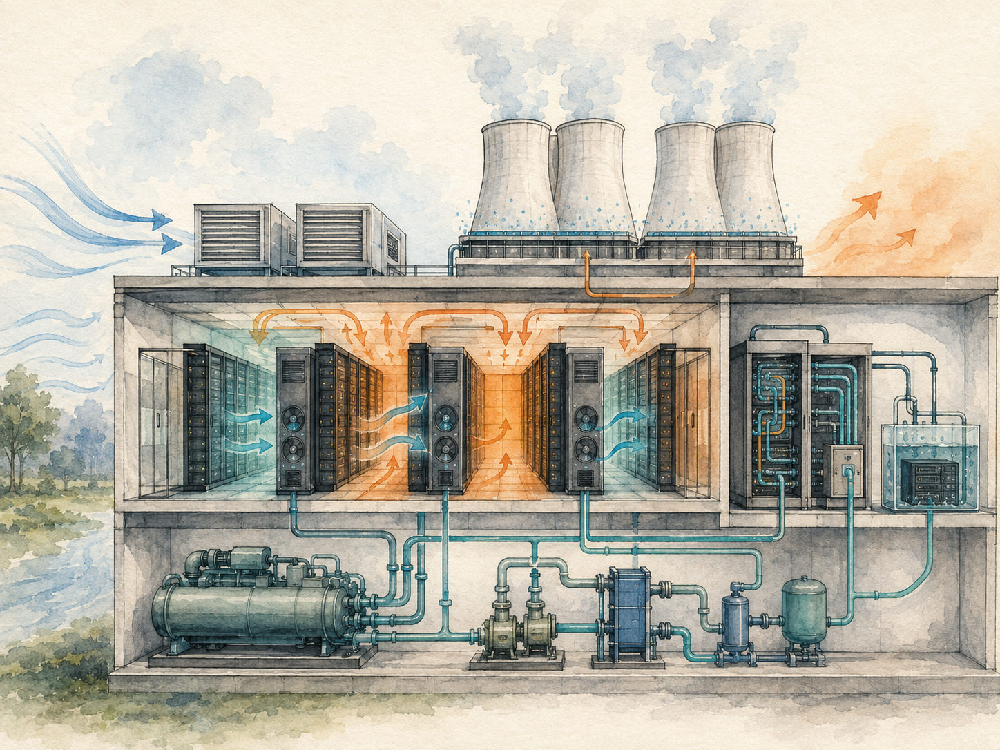
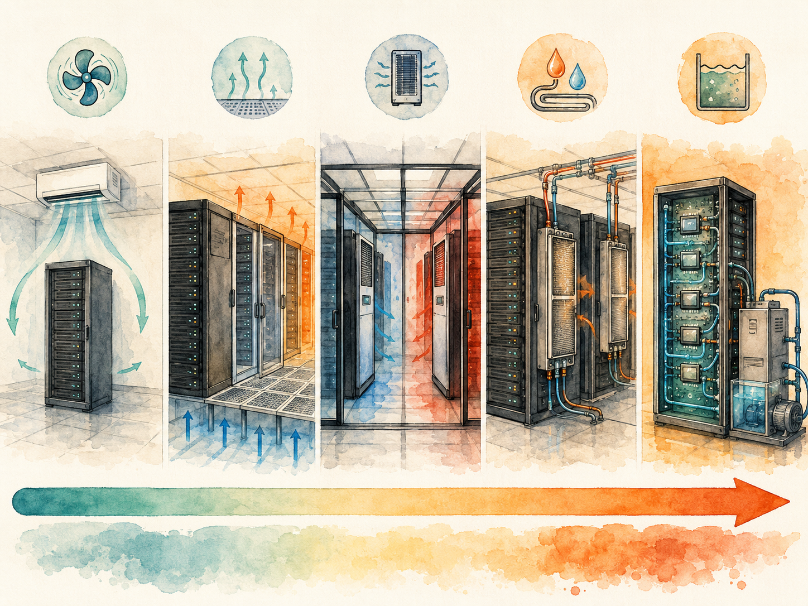

+++
date = '2026-06-13T00:00:00+00:00'
title = "【Data Center 101】Cooling Systems: From Room Air Conditioners to Direct-to-Chip Liquid"
slug = "data-center-101-07-cooling"
aliases = ["/posts/data-center-101-cooling/", "/posts/數據中心-101-冷卻系統/"]
tags = ['Data Center', 'Data Center 101', 'Passport to AI Era', '中文']
thumbnail = 'pic.png'
+++

> A modern silicon chip running at full load generates roughly **100 watts per square centimeter** — about the same heat flux as a kitchen stove burner. A rack of GPUs running an AI training workload generates more heat per cubic meter than the engine compartment of a passenger car. The data center industry's entire cooling stack — chillers, cooling towers, fans, ducts, water pipes, and now liquid loops directly touching the silicon — exists for one reason: to move that heat from the chip to the atmosphere fast enough that the chip never throttles.
>
> 一顆現代矽晶片滿載運轉時產生約**每平方公分 100 瓦**的熱量 —— 大約相當於廚房瓦斯爐火源的熱通量。一櫃跑著 AI 訓練負載的 GPU，每立方公尺產生的熱量比一輛轎車的引擎室還多。整個數據中心冷卻堆疊 —— 冷水機、冷卻塔、風扇、風管、水管、以及現在直接觸碰矽晶片的液冷迴路 —— 存在的唯一理由是：把熱從晶片移到大氣，速度快到讓晶片永遠不會降頻。

---

## Why Cooling Dominates the Energy Story // 為什麼冷卻主導能源故事

In the PUE family covered in article 5, the cooling load factor (CLF) is almost always the largest component of overhead. Typical CLF values sit between **0.20 and 0.50** — meaning cooling consumes 20 to 50 watts for every 100 watts the IT equipment draws. The next-largest factor, electrical distribution losses (PLF), sits at 0.08 to 0.15.

在第 5 篇談的 PUE 家族裡，冷卻負載因子（CLF）幾乎永遠是 overhead 裡最大的成分。CLF 典型值落在 **0.20 到 0.50** —— 也就是說 IT 設備每用 100 瓦，冷卻就消耗 20 到 50 瓦。第二大的因子（電力分配損耗 PLF）只有 0.08 到 0.15。

This means that any data center talking seriously about energy efficiency is, structurally, talking about cooling. Every major PUE-reduction story — Nordic free cooling, evaporative cooling in dry climates, direct-to-chip liquid cooling for AI workloads — is fundamentally a cooling story.

這意味著任何認真討論能效的數據中心，結構上都在討論冷卻。每個主要的 PUE 改善故事 —— 北歐自然冷卻、乾燥氣候的蒸發冷卻、AI 工作負載的直接接觸晶片液冷 —— 本質上都是冷卻故事。

> **A facility moving from PUE 1.5 to PUE 1.2 is, in 80% of cases, a facility that found a better way to move heat.**
>
> **一座機房從 PUE 1.5 降到 1.2，80% 的情況下是因為它找到更好的散熱方法。**

---

## Part 1 — Cabinet Density Decides the Cooling Technology // 第一部分：機櫃密度決定冷卻技術

The most important number for choosing a cooling architecture is not climate or building size — it is the power density per cabinet. As density rises, the physics of air-based cooling stops working, and the industry's cooling stack changes underneath it.

選擇冷卻架構最重要的單一數字不是氣候或建物大小 —— 是「每櫃功率密度」。隨著密度上升，氣冷的物理基礎逐漸失效，業界的冷卻堆疊跟著改變。

### The density-to-technology map // 密度對應冷卻技術地圖

| Cabinet density // 機櫃密度 | Recommended cooling // 建議冷卻 | Notes // 備註 |
|---|---|---|
| **< 3 kW** | Room-level air conditioning (in-room CRAC) 房間級空調（in-room CRAC） | Edge sites, small EDCs 邊緣站點、小型 EDC |
| **4–6 kW** | Room-level + underfloor supply + cold/hot aisle 房間級 + 地板下送風 + 冷熱通道 | Mainstream enterprise IT 主流企業 IT |
| **5–12 kW** | In-row cooling + containment 行間冷卻 + 通道封閉 | Most IDCs and CDCs today 今日多數 IDC 與 CDC |
| **7–20 kW** | In-row + rear-door heat exchangers OR in-cabinet cooling 行間 + 後門熱交換器 或 櫃內冷卻 | High-density colocation 高密度 Colocation |
| **> 20 kW** | Liquid cooling (direct-to-chip or immersion) 液冷（直接接觸晶片或浸沒式） | AI training, HPC AI 訓練、HPC |

### The physical reason air cooling stops working // 氣冷停止運作的物理原因

The heat capacity of air is low. Even with aggressive ducting and high-velocity fans, the practical ceiling for air-cooled racks sits around **20–25 kW per cabinet**. Above that, the fan power required to move enough air becomes its own significant share of the facility's energy budget, and the air cannot remove heat from chip-surface hotspots fast enough.

空氣的熱容很低。即使用積極風管與高速風扇，氣冷機櫃實務上限約 **每櫃 20–25 kW**。超過這個值，移動足夠空氣所需的風扇功率本身會變成機房能源預算的相當大塊，而且空氣無法夠快地把晶片表面熱點的熱帶走。

Liquid carries roughly **3,000 times more heat per unit volume than air**. Once cabinet density crosses the 20 kW threshold, liquid cooling stops being an option and becomes a requirement.

液體單位體積的帶熱能力是空氣的約 **3,000 倍**。一旦機櫃密度跨過 20 kW 門檻，液冷不再是選項，而是要求。

> **The 30-year history of data center cooling is, simply, the story of moving the cold source closer and closer to the heat source. Room → row → cabinet → chip. Every step shortens the path; every step lowers PUE.**
>
> **數據中心冷卻 30 年的歷史可以一句話總結：把冷源越拉越靠近熱源。房間 → 行間 → 櫃內 → 晶片。每一步縮短路徑；每一步降低 PUE。**

---

## Part 2 — The Four Classical Cooling Architectures // 第二部分：四種經典冷卻架構

Before liquid cooling rewrote the rulebook, the industry had four mainstream architectures, each suited to different facility sizes and climates.

在液冷改寫教科書之前，業界有四種主流架構，各自適合不同的設施規模與氣候。

| Architecture | Full name | Heat transfer medium // 傳熱介質 | Capacity sweet spot // 容量甜蜜點 |
|---|---|---|---|
| **DX** | Direct Expansion | Refrigerant (R410A, R134a, R1234yf) 冷媒 | < 1 MW |
| **CW** | Chilled Water | Water 水 | > 1 MW |
| **AHU** | Air Handling Unit (indirect evaporative) | Outside air via heat exchanger 外界空氣經熱交換器 | > 1 MW |
| **EHU** | Environmental Handling Unit (next-gen IEC) | Same as AHU + integrated controls 同 AHU + 整合控制 | > 1 MW |

### DX — Direct Expansion // DX：直接膨脹

The DX architecture is closest to a residential air conditioner. A refrigerant circulates in a closed loop: it absorbs heat from the indoor space (evaporator), is compressed, and releases heat outdoors (condenser).

DX 架構最接近家用空調。冷媒在封閉迴路裡循環：在室內側吸熱（蒸發器）、被壓縮、在室外側放熱（冷凝器）。

| Property | DX |
|---|---|
| Refrigerant loop length // 冷媒管長 | < 60 m (typical) |
| Outdoor unit height limit // 室外機高度限制 | Within 20 m above or 5 m below indoor unit 室外機高於室內機不超 20 m、低於不超 5 m |
| Best for // 最適合 | Small-to-mid DCs, edge sites, cold-climate facilities 中小型 DC、邊緣站點、寒冷氣候 |
| Main drawback // 主要缺點 | Low overall efficiency at large scale, no free cooling 大規模時效率低、無法自然冷卻 |
| Main strength // 主要優勢 | Simple, no water risk, few single points of failure 簡單、無水洩漏風險、SPOF 少 |

### CW — Chilled Water // CW：冷凍水

The dominant architecture for facilities above 1 MW. Two variants share the same indoor equipment but differ in how the chiller rejects heat to the outdoors.

1 MW 以上機房的主導架構。兩個變體共用室內設備，但冷水機把熱排到戶外的方式不同。

**Air-cooled CW:** Chillers reject heat directly to outside air. Simpler, lower CAPEX, slightly lower efficiency at full load. Used where water is scarce or freezing is a serious risk.

**氣冷 CW：** 冷水機直接把熱排到外界空氣。較簡單、CAPEX 較低、滿載效率稍低。用在缺水或結冰風險嚴重的地方。

**Water-cooled CW:** A second water loop runs through a cooling tower, where evaporation provides the heat rejection. Higher full-load efficiency (centrifugal chillers can reach COP 6–7), supports plate heat exchangers for winter "free cooling," but more components and more single points of failure.

**水冷 CW：** 第二條水迴路經過冷卻塔，蒸發提供散熱。滿載效率較高（離心式冷水機 COP 可達 6–7），冬天可用板式熱交換器做「自然冷卻」，但元件較多、SPOF 較多。

> **Water-cooled CW is the most thermally efficient classical architecture, but the most operationally complex. Multiple loops, water treatment requirements, and freeze protection mean it requires substantially deeper engineering and operations capability than DX or air-cooled CW.**
>
> **水冷 CW 是經典架構裡熱效率最高的，但運轉最複雜。多條迴路、水質處理、防凍要求意味著它需要遠比 DX 或氣冷 CW 更深的工程與運維能力。**

### AHU and EHU — Indirect Evaporative Cooling // AHU 與 EHU：間接蒸發冷卻

Air-Handling Units (AHUs) and the newer Environmental Handling Units (EHUs) use the **outside air directly as the heat sink**, but through a heat exchanger so that outdoor air never enters the data hall.

空氣處理機組（AHU）與較新的環境處理機組（EHU）使用**外界空氣作為散熱端**，但透過熱交換器，戶外空氣永遠不進入機房。

Three operating modes are typical:

典型有三個運轉模式：

- **Low outdoor temperature** — Direct sensible heat exchange (no water, no compressor). Cheapest mode.
- **戶外低溫** —— 直接顯熱交換（不用水、不用壓縮機）。最便宜的模式。
  
- **Moderate outdoor temperature** — Add evaporative cooling on the outdoor side (water spray on the heat exchanger).
- **戶外中溫** —— 外側加上蒸發冷卻（向熱交換器噴水）。
  
- **High outdoor temperature** — Add mechanical compression for peak summer days.
- **戶外高溫** —— 加上機械壓縮以應付夏季高溫日。

AHU/EHU architecture works best in cool, dry climates and is the dominant architecture in Northern Europe and the cooler parts of China. The EHU variant adds integrated AC/DC power conversion (so cooling does not depend on the main UPS), AI-driven dual damper control, and continuous-cooling guarantees during partial failures.

AHU/EHU 架構在涼爽乾燥氣候下表現最好，是北歐與中國較涼爽地區的主導架構。EHU 變體額外加入整合 AC/DC 電源轉換（讓冷卻不依賴主 UPS）、AI 雙進風閘控制、部分故障時的連續冷卻保證。

### Side-by-side // 一張表並列

| Dimension | DX | CW | Direct Evap | Indirect Evap (AHU/EHU) |
|---|---|---|---|---|
| Energy efficiency 能效 | Low (long pipes) 低（長管路）| Medium-low 中低 | Low 低 | **Low overhead** **低 overhead** |
| Water risk 水風險 | None | High (leakage) 高（洩漏） | Medium (outdoor air uncontrolled) 中（外界空氣不可控） | Low (isolated by HX) 低（被熱交換器隔離） |
| CAPEX | Low | High | Low | Medium-high |
| OPEX | Higher 較高 | Lower 較低 | Low | Low |
| Best climate // 適合氣候 | Anywhere (issues below −30°C) 任何地方（−30°C 以下有問題）| Anywhere (with glycol if freezing) 任何地方（結冰加防凍液）| Few suitable regions 很少地區適合 | Dry, low humidity 乾燥、低濕度 |

---

## Part 3 — Free Cooling: the Largest Single PUE Lever // 第三部分：自然冷卻 —— 最大的單一 PUE 槓桿

Free cooling means using outside conditions — air, water, or both — to cool the data center without running compressors. When the outside temperature is below the temperature needed at the chilled-water loop or air handler, free cooling can replace mechanical refrigeration entirely, eliminating the largest single component of the cooling energy bill.

「自然冷卻（Free Cooling）」意指利用外界條件 —— 空氣、水或兩者 —— 來冷卻數據中心，不需啟動壓縮機。當外界溫度低於冷凍水迴路或空氣處理機所需的溫度，自然冷卻可以完全取代機械製冷，消除冷卻電費裡最大的單一成分。

### Three forms // 三種形式

- **Direct Free Cooling** — Outside air is filtered and pumped directly into the data hall. Used in Nordic-style facilities and parts of the Google fleet. Requires extremely clean air and tolerance for short humidity excursions.
- **直接自然冷卻（Direct Free Cooling）** —— 過濾後的外界空氣直接送進機房。Nordic 風格機房與部分 Google 機房用這個。需要極乾淨的空氣與對短暫濕度波動的容忍度。
  
- **Indirect Free Cooling** — Outside air cools the data hall through a heat exchanger. The technology behind AHU/EHU. Slightly less efficient than direct, but immune to outdoor pollution.
- **間接自然冷卻（Indirect Free Cooling）** —— 外界空氣透過熱交換器冷卻機房。AHU/EHU 背後的技術。效率比直接式略低，但免疫戶外污染。
  
- **Refrigerant Pump Free Cooling** — A clever dual-cycle design that runs the refrigerant loop without engaging the compressor when outdoor temperature is below about 10°C. The pump moves the refrigerant; ambient air cools it; the compressor sleeps. A recent Huawei FusionModule deployment in Beijing reported **annual average PUE 1.111** using this technology — a world-class number in a climate that is not naturally cold.
- **冷媒泵自然冷卻（Refrigerant Pump Free Cooling）** —— 巧妙的雙循環設計，戶外溫度低於約 10°C 時運行冷媒迴路而不啟動壓縮機。冷媒泵驅動冷媒；環境空氣冷卻它；壓縮機休眠。華為 FusionModule 最近在北京的部署，用這個技術達到 **年平均 PUE 1.111** —— 在一個並非天然寒冷的氣候裡的世界級數字。

### Free cooling hours by region // 各地區自然冷卻時數

| Region | Annual mean temp // 年均溫 | Free cooling hours // 自然冷卻時數 | Achievable PUE |
|---|---|---|---|
| Iceland / Sweden 冰島 / 瑞典 | 4–6°C | **8,000+ hr/yr** (year-round) | 1.10–1.15 |
| Inner Mongolia / Beijing 內蒙古 / 北京 | 8–15°C | 6,000–7,000 hr/yr | 1.20–1.30 |
| Shanghai / Shenzhen 上海 / 深圳 | 18–22°C | 3,000–4,000 hr/yr | 1.35–1.45 |
| Sydney 雪梨 | 17–19°C | 4,000–5,500 hr/yr | 1.30–1.45 |
| Taiwan 台灣 | 22–25°C | 2,500–3,500 hr/yr | 1.40–1.50 |
| Dubai / India 杜拜 / 印度 | 28–32°C | < 1,000 hr/yr | 1.50–1.70 |

This table explains, in a single view, why Google operates major facilities in Hamina, Finland; why Meta is building out Luleå, Sweden; why Inner Mongolia and Guizhou have become Chinese data center hubs; and why Singapore introduced a moratorium on new data centers in 2019.

這張表用一個視角解釋了：為什麼 Google 在芬蘭哈米納運轉主要機房、為什麼 Meta 在瑞典 Luleå 擴建、為什麼內蒙古與貴州變成中國數據中心樞紐、為什麼新加坡 2019 年宣布暫停新建數據中心。

---

## Part 4 — Evaporative Cooling and the PUE-vs-WUE Trade-off // 第四部分：蒸發冷卻 —— PUE 與 WUE 的權衡

Evaporative cooling uses the physics of water phase change: every kilogram of water that evaporates absorbs about **2,260 kJ** of heat. That is roughly 25 times the energy a refrigeration cycle moves per kilogram of refrigerant. For dry-climate sites, evaporative cooling is the most efficient cooling mode physics allows.

蒸發冷卻利用水相變的物理：每蒸發 1 公斤水吸收約 **2,260 kJ** 熱量。這大約是冷凍循環每公斤冷媒移動能量的 25 倍。對乾燥氣候的選址來說，蒸發冷卻是物理允許的最有效冷卻模式。

### Direct vs Indirect Evaporative // 直接式 vs 間接式

| Dimension | Direct Evaporative | Indirect Evaporative |
|---|---|---|
| Outdoor air → data hall 戶外空氣 → 機房 | Directly 直接 | Through heat exchanger 透過熱交換器 |
| Air quality requirement 空氣品質要求 | High (filters pollution into the hall) 高（會把污染帶進機房） | Low 低 |
| Humidifies the hall? 讓機房變潮濕？ | Yes 是 | No 否 |
| Industry use // 業界採用 | Rare 少見 | Mainstream (basis for AHU/EHU) 主流（AHU/EHU 的基礎） |

### The PUE-WUE trade-off // PUE 與 WUE 權衡

The trade-off introduced in article 5 between Power Usage Effectiveness and Water Usage Effectiveness has its sharpest expression in evaporative cooling:

第 5 篇介紹過的 PUE 與 WUE 之間的權衡，在蒸發冷卻上有最尖銳的展現：

- Sites using evaporative cooling typically have **WUE between 1.5 and 2.5 L/kWh**.
- 用蒸發冷卻的機房 **WUE 典型落在 1.5 到 2.5 L/kWh**。
  
- Sites that avoid evaporative cooling can reach **WUE below 0.5 L/kWh** — but at the cost of higher PUE.
- 避免蒸發冷卻的機房可以達 **WUE 低於 0.5 L/kWh** —— 但代價是較高 PUE。

For a 1,000-cabinet facility, this translates to roughly **63,000 tons of water per year** — the annual usage of about 300 households. In water-stressed regions like the United Arab Emirates, central and southern Taiwan, parts of Spain, and Singapore, this number now drives regulatory action and increasingly shapes site selection.

對一座 1,000 機櫃機房，這轉成**每年約 63,000 噸水** —— 約 300 戶家庭一年的用量。在缺水地區（阿聯酋、台灣中南部、西班牙部分地區、新加坡），這個數字現在驅動法規行動，並越來越影響選址。

> **Over the next decade, WUE caps are likely to displace PUE caps as the binding regulatory constraint in water-scarce regions. Operators that built their PUE strategy around evaporative cooling will find themselves forced to rethink.**
>
> **未來十年，在缺水地區，WUE 上限有機會取代 PUE 上限成為主導性法規約束。把 PUE 策略建立在蒸發冷卻上的營運者將被迫重新思考。**

---

## Part 5 — Liquid Cooling: The AI-Driven Transition // 第五部分：液冷 —— AI 驅動的轉變

The liquid cooling market existed for decades as a niche serving mainframes and HPC clusters. The AI buildout has turned it into the fastest-growing category in the data center industry.

液冷市場過去幾十年作為大型主機與 HPC 集群的利基市場存在。AI 擴建把它變成數據中心產業裡成長最快的類別。

### Why the transition is now non-optional // 為什麼這個轉變現在不是選項

- **NVIDIA H100** — 700 W per GPU, 30–50 kW per rack
- **NVIDIA B200** — ~1,000 W per GPU
- **NVIDIA GB200 NVL72** — 120 kW per rack (single integrated unit)
- **Projected NVIDIA Vera Rubin Ultra (2027)** — ~600 kW per rack

Air cooling, as discussed, fails around 20–25 kW per rack. Every AI training cabinet specified today is above that ceiling.

如前所述，氣冷在每櫃約 20–25 kW 失效。今天所有 AI 訓練機櫃的規格都在這個天花板之上。

### Three liquid cooling approaches // 三種液冷做法

**Direct-to-Chip (D2C) // 直接接觸晶片（D2C）:**
- A cold plate sits directly on the CPU and GPU package // 冷板直接坐在 CPU 與 GPU 封裝上
- A coolant flows through the cold plate, absorbing heat at the source // 冷卻液流過冷板，從熱源吸熱
- A CDU (Coolant Distribution Unit) circulates the coolant to a building-side cooling loop // CDU（Coolant Distribution Unit，冷卻液分配單元）把冷卻液循環到建物側冷卻迴路
- Industry mainstream for AI clusters today // 今日 AI 集群的業界主流

**Rear-Door Heat Exchanger (RDHx) // 後門熱交換器（RDHx）:**
- A chilled-water coil mounted on the back door of the rack // 一片冷凍水盤管裝在機櫃後門
- Hot exhaust air passes through the coil before leaving the cabinet // 熱排氣通過盤管才離開機櫃
- Server hardware itself does not need redesign // 伺服器硬體本身不需要重設計
- Best for medium-density retrofits (20–40 kW) // 最適合中密度改造（20–40 kW）

**Immersion Cooling // 浸沒式冷卻:**
- Entire servers submerged in a dielectric (non-conductive) fluid // 整台伺服器浸沒在介電（不導電）液體中
- Two sub-types: single-phase (fluid stays liquid) and two-phase (fluid boils and recondenses) // 兩個子類型：單相（液體保持液態）與兩相（液體沸騰再凝結）
- Highest cooling efficiency, lowest fan power // 冷卻效率最高、風扇功率最低
- Requires servers redesigned for fluid immersion; maintenance is messier // 需要為浸沒重新設計的伺服器；維護較髒亂

### Major liquid cooling vendors // 主要液冷廠商

| Vendor | HQ | Approach |
|---|---|---|
| **CoolIT Systems** | Canada | D2C leader |
| **Asetek** | Denmark | D2C, OCP-aligned |
| **Vertiv Liebert XDU** | USA | Integrated CDU + rack |
| **Submer** | Spain | Single-phase immersion |
| **LiquidStack** | USA | Two-phase immersion |
| **Iceotope** | UK | Chassis-level liquid |
| **GRC (Green Revolution Cooling)** | USA | Single-phase immersion |
| **Motivair, ColdLogik** | USA / UK | Rear-door heat exchangers |

### The CDU bottleneck // CDU 瓶頸

CDU lead times have stretched to **6–12 months** in 2025–2026, with allocation favoring hyperscaler customers. For a hyperscale AI build, a missing CDU now delays the same kind of project that a missing chiller delayed in 2020.

CDU 交期在 2025–2026 拉到 **6–12 個月**，配額傾向 hyperscaler 客戶。對 hyperscale AI 案場來說，少一台 CDU 的影響等於 2020 年少一台冷水機的影響。

---

## Part 6 — Aisle Containment: The Highest-ROI Improvement // 第六部分：通道封閉 —— ROI 最高的改善

Of all the cooling-side investments a data center can make, **hot or cold aisle containment** is consistently the highest-return: small CAPEX, fast payback, immediate PUE improvement, no operational complexity.

數據中心可以做的冷卻側投資裡，**冷或熱通道封閉**永遠是回報率最高的一項：小 CAPEX、快速回本、立即 PUE 改善、無運轉複雜度。

### What containment does // 通道封閉做什麼

In an unstructured data hall, cold air supplied to the front of racks mixes with hot air exhausted at the back before being recaptured by the CRAC. This mixing reduces cooling efficiency because the CRAC has to overcool the entire hall to compensate.

在無結構的機房裡，送到機櫃前方的冷空氣，跟機櫃後方排出的熱空氣會在被 CRAC 回收之前混合。這個混合降低冷卻效率，因為 CRAC 必須過度冷卻整個機房來補償。

**Cold Aisle Containment (CAC):** Roof panels and end-doors enclose the cold aisle. Cold air supplied to the contained aisle goes only into the front of racks. Hot exhaust flows freely into the rest of the hall and returns to the CRAC.

**冷通道封閉（CAC）：** 屋頂面板與端門把冷通道圍起來。送到封閉冷通道的冷空氣只進機櫃前方。熱排氣流到機房其餘部分後回到 CRAC。

**Hot Aisle Containment (HAC):** The hot aisle is enclosed instead. Hot exhaust is channeled directly back to the CRAC return without mixing with the rest of the hall.

**熱通道封閉（HAC）：** 改成封閉熱通道。熱排氣被引導直接回 CRAC 回風端，不跟機房其餘部分混合。

### The economics // 經濟學

| Metric | Typical value |
|---|---|
| PUE improvement // PUE 改善 | 0.05 – 0.15 |
| CAPEX // 資本支出 | $30–$80 per m² |
| Payback period // 回本期 | **6–18 months** |

For most operating data centers, the question is not whether to add containment but why it has not been done already. The capital cost is genuinely small relative to the PUE savings, and the technology is mature, well-understood, and risk-free to retrofit.

對多數運轉中的數據中心，問題不是「要不要加封閉」，而是「為什麼還沒做」。資本成本相對 PUE 節省真的很小，技術成熟、易理解、改造無風險。

---

## Part 7 — ASHRAE Guidelines and the 27°C Inlet Revolution // 第七部分：ASHRAE 規範與 27°C 進氣革命

ASHRAE — the American Society of Heating, Refrigerating and Air-Conditioning Engineers — publishes the technical guidelines that the global data center industry follows for inlet temperature, humidity, and environmental classes.

ASHRAE（American Society of Heating, Refrigerating and Air-Conditioning Engineers，美國暖通冷凍空調工程師學會）發布全球數據中心產業遵循的技術規範，涵蓋進氣溫度、濕度、環境等級。

### The classes // 環境等級

ASHRAE TC 9.9 defines five operational classes for IT equipment:

ASHRAE TC 9.9 為 IT 設備定義五個運轉等級：

| Class | Recommended inlet // 推薦進氣 | Allowable inlet // 容許進氣 | Allowable humidity // 容許濕度 |
|---|---|---|---|
| **A1** | 18–27°C | 15–32°C | 20–80% RH |
| **A2** | 18–27°C | 10–35°C | 20–80% RH |
| **A3** | 18–27°C | **5–40°C** | 8–85% RH |
| **A4** | 18–27°C | **5–45°C** | 8–90% RH |

### The 27°C revolution // 27°C 革命

For decades, data center operators ran their facilities at IT-equipment inlet temperatures around **18–22°C** — cool to the touch, often described by visitors as "like a refrigerator." ASHRAE's recommendation has since shifted upward; the modern industry guideline is to run facilities at the high end of the recommended range, around **27°C**.

幾十年來，數據中心營運者把 IT 設備進氣溫度設在約 **18–22°C** —— 摸起來冷，常被訪客形容「像冰箱」。ASHRAE 的建議後來上移；現代業界規範是運轉在推薦範圍的上端，約 **27°C**。

The PUE saving is significant: raising inlet temperature from 22°C to 27°C reduces PUE by roughly **0.05 to 0.10**. The saving costs nothing — it is a setpoint change. Server reliability impact, within the recommended range, is statistically negligible.

PUE 節省可觀：把進氣溫度從 22°C 提到 27°C 降低 PUE 約 **0.05 到 0.10**。這個節省什麼錢都不用花 —— 只是設定點變更。在推薦範圍內，伺服器可靠性影響在統計上微不足道。

> **A typical legacy facility running at 22°C inlet temperature has a no-cost PUE-improvement lever sitting on the wall. The fact that it is rarely pulled is not a technology issue — it is an organizational one.**
>
> **一座運轉在 22°C 進氣的傳統機房，牆上掛著一個零成本的 PUE 改善槓桿。它很少被拉動不是技術問題 —— 是組織問題。**

---

## Part 8 — Humidification and the Wet-Film Quiet Champion // 第八部分：加濕系統與濕膜的低調冠軍

Data centers need humidification because dry air generates static electricity, which can damage IT equipment. The typical target is 40–60% relative humidity.

數據中心需要加濕，因為乾燥空氣產生靜電，可能損壞 IT 設備。典型目標是 40–60% 相對濕度。

| Humidifier type | Power draw // 功率 | Maintenance // 維護 | Scale buildup // 結垢 |
|---|---|---|---|
| Electrode-type 電極式 | ~760 W | Medium | Heavy (heats water to 100°C) 嚴重（加熱到 100°C） |
| Infrared 紅外線 | ~1,000 W | Medium | Heavy |
| **Wet-film 濕膜** | **~50 W** | Simple | Light |

The wet-film humidifier uses simple evaporation off a wetted media at room temperature. It draws about **5% the power** of electrode or infrared alternatives — and yet many legacy facilities still use electrode humidifiers because that was the standard choice in the 2000s.

濕膜加濕器在室溫下用濕潤介質的單純蒸發。它的功率約是電極或紅外線替代方案的 **5%** —— 然而很多老舊機房還在用電極加濕器，因為那是 2000 年代的標準選擇。

> **Data center energy efficiency is, in the end, the accumulation of many small optimizations. Replacing electrode humidifiers with wet-film is the kind of unglamorous change that, multiplied across a thousand cabinets, saves a meaningful amount of electricity every year.**
>
> **數據中心能效到頭來就是大量小優化的累積。把電極加濕器換成濕膜，是那種不華麗的改變 —— 但乘上一千個機櫃，每年省下的電力很有意義。**

---

## Part 9 — CFD Simulation: The Design-Time Tool // 第九部分：CFD 模擬 —— 設計階段的工具

Computational Fluid Dynamics (CFD) is the simulation technique that lets engineers model airflow inside a data hall before it is built — predicting hot spots, validating containment effectiveness, and optimizing CRAC placement.

計算流體動力學（CFD, Computational Fluid Dynamics）是模擬技術，讓工程師在機房蓋好之前就建模廳內氣流 —— 預測熱點、驗證封閉效果、優化 CRAC 配置。

CFD is now standard for any serious new build, and the main tools are:

CFD 現在是任何認真新建案的標準，主要工具：

- **6SigmaET / 6SigmaDC** (Future Facilities) — industry mainstream
- **TileFlow** (Innovative Research) — long-running incumbent
- **ANSYS Fluent** — general-purpose CFD
- **OpenFOAM** — open-source

For retrofits, CFD also plays an investigative role: when an existing facility has hot spots that no one can explain, a CFD simulation built from the as-built drawings often shows airflow paths that are obvious in hindsight but invisible in the floor plan.

對改造案，CFD 還扮演調查角色：當既有機房出現沒人解釋得了的熱點，從「as-built」圖紙建構的 CFD 模擬常常顯示出事後看明顯但平面圖看不到的氣流路徑。

---

## Key Takeaways // 重點整理

#### 1. Cooling dominates PUE // 冷卻主導 PUE

CLF (Cooling Load Factor) is typically 0.20–0.50, the largest single contributor to overhead. Almost every major PUE-reduction story is structurally a cooling story.

CLF（Cooling Load Factor）典型 0.20–0.50，是 overhead 最大的單一貢獻。幾乎每個主要的 PUE 改善故事結構上都是冷卻故事。

#### 2. Cabinet density chooses the cooling architecture // 機櫃密度決定冷卻架構

Below 3 kW: room-level. 5–12 kW: in-row with containment. Above 20 kW: liquid cooling is no longer optional. AI workloads push densities to 30–120 kW, which is why liquid cooling has gone from niche to mandatory inside 24 months.

3 kW 以下：房間級。5–12 kW：行間 + 通道封閉。20 kW 以上：液冷不再是選項。AI 工作負載把密度推到 30–120 kW，這就是液冷為什麼在 24 個月內從利基變成必須。

#### 3. CW dominates above 1 MW, but free cooling is the largest single lever // CW 主導 1 MW 以上，但自然冷卻是最大單一槓桿

Water-cooled chilled-water plants are the most efficient classical architecture. Layering free cooling on top — whether direct, indirect, or refrigerant-pump — produces the largest single PUE improvement available.

水冷冷凍水機組是最有效的經典架構。再疊上自然冷卻 —— 直接、間接、或冷媒泵 —— 產生能拿到的最大單一 PUE 改善。

#### 4. Evaporative cooling trades PUE for WUE // 蒸發冷卻用 PUE 換 WUE

The mechanism that lets dry-climate sites hit PUE 1.1 simultaneously raises water usage to 1.5–2.5 L/kWh. In water-scarce regions, WUE caps are becoming the binding regulatory constraint, displacing PUE caps.

讓乾燥氣候站點打到 PUE 1.1 的機制，同時把用水拉高到 1.5–2.5 L/kWh。在缺水地區，WUE 上限正在成為主導性法規約束，取代 PUE 上限。

#### 5. Liquid cooling is no longer a future technology // 液冷不再是未來技術

NVIDIA H100, B200, and especially GB200 NVL72 have pushed cabinet densities past every air-cooling ceiling. CoolIT, Asetek, Vertiv, Submer, and LiquidStack are now mainstream procurement names rather than niche specialists.

NVIDIA H100、B200，特別是 GB200 NVL72，把機櫃密度推過所有氣冷天花板。CoolIT、Asetek、Vertiv、Submer、LiquidStack 現在是主流採購名單，而不是利基專家。

#### 6. Containment is the cheapest PUE improvement available // 通道封閉是能拿到最便宜的 PUE 改善

$30–$80 per square meter, 6–18 month payback, 0.05–0.15 PUE improvement, no operational complexity. The question for any uncontained facility is not whether to add it but why it has not been added yet.

每平方公尺 $30–$80、6–18 個月回本、0.05–0.15 PUE 改善、無運轉複雜度。對任何尚未封閉的機房而言，問題不是「要不要加」，而是「為什麼還沒加」。

#### 7. ASHRAE's 27°C inlet recommendation is a free PUE lever // ASHRAE 27°C 進氣建議是免費的 PUE 槓桿

Raising inlet temperature from 22°C to 27°C reduces PUE by 0.05–0.10 with no CAPEX. The reason this is rarely done is organizational, not technical.

把進氣溫度從 22°C 提到 27°C 降 PUE 0.05–0.10，不花 CAPEX。很少被執行的原因是組織性的，不是技術性的。

---

## What's Next // 下一篇預告

The eighth article in this series turns from the physical infrastructure to the **operational nervous system** — DCIM (Data Center Infrastructure Management) platforms, the AI-driven cooling and power optimization systems built on top of them (Huawei iCooling, Google DeepMind cooling control, Schneider EcoStruxure), and the digital-twin layer that is starting to make data centers run themselves. The cooling and power chains we have spent the last two articles unpacking are increasingly controlled by software that learns from millions of telemetry points in real time. This is where the data center industry meets the AI industry — not as a customer, but as a co-traveler.

本系列第 8 篇從實體基礎設施轉到**運轉的神經系統** —— DCIM（Data Center Infrastructure Management，數據中心基礎設施管理）平台、建立在其上的 AI 驅動冷卻與電力優化系統（華為 iCooling、Google DeepMind 冷卻控制、Schneider EcoStruxure）、以及開始讓數據中心自己跑的數位孿生層。我們過去兩篇拆解的冷卻與電力鏈，越來越被「即時從上百萬遙測點學習」的軟體控制。這是數據中心產業遇上 AI 產業的地方 —— 不是作為客戶，而是作為同行者。
