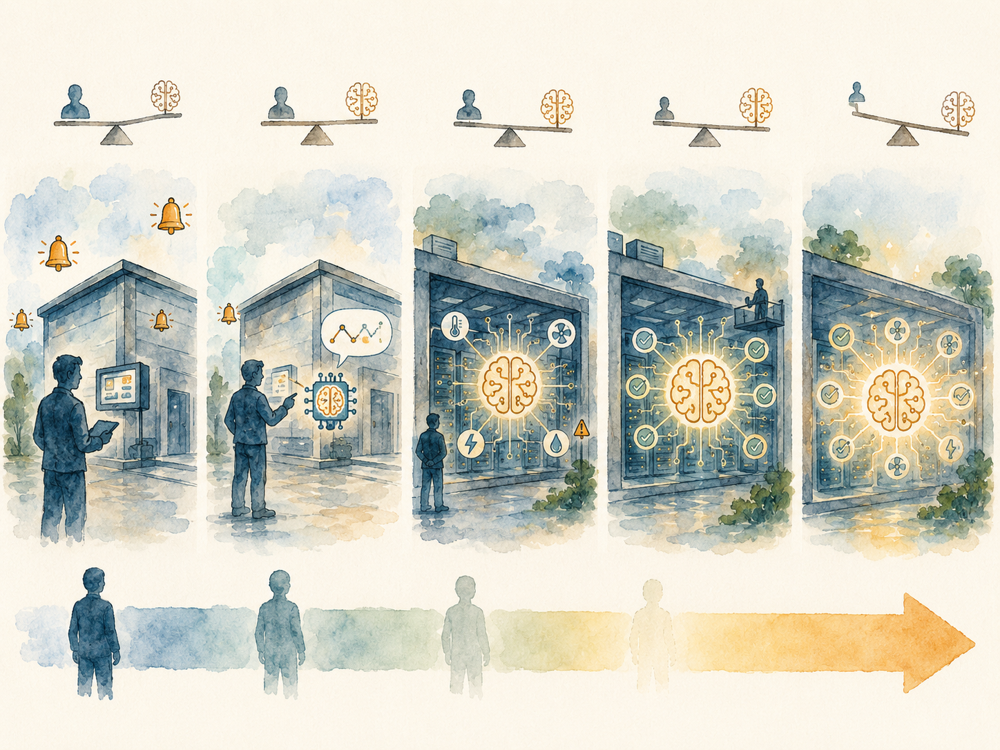

+++
date = '2026-06-13T01:00:00+00:00'
title = "【Data Center 101】DCIM and AI Operations: From Monitoring to Autonomous Data Centers"
slug = "data-center-101-08-dcim-ai-ops"
aliases = ["/posts/data-center-101-dcim-ai-ops/", "/posts/數據中心-101-dcim-ai-運維/"]
tags = ['Data Center', 'Data Center 101', 'Passport to AI Era', '中文']
thumbnail = 'pic.png'
+++

> A modern thousand-cabinet data center runs **roughly one million sensors** — measuring voltage, current, temperature, humidity, airflow, vibration, leak detection, door status, fan speed — and writes each measurement to a database every few seconds. A year of telemetry from a single facility exceeds **two terabytes** of raw data. The data center industry passed the threshold where a human team could meaningfully read its own facility about ten years ago. The only feasible response has been to put software in charge of the reading, and increasingly, in charge of the deciding.
>
> 一座現代千機櫃的數據中心運轉著**約 100 萬個感測器** —— 量測電壓、電流、溫度、濕度、氣流、振動、漏水偵測、門禁狀態、風扇轉速 —— 每隔幾秒就把每筆量測寫進資料庫。單一機房一年的遙測超過 **2 TB** 原始資料。數據中心產業大約十年前就跨過了「人類團隊能有意義地讀懂自家機房」的門檻。唯一可行的回應是把「讀」交給軟體，並且越來越把「決策」也交給它。


---

## Why Operations Has Its Own Software Stack // 為什麼運維需要自己的軟體堆疊

The combination of scale, real-time response requirements, and the rising cost of operator errors has created the modern operations software stack for data centers. The umbrella name for that stack is **DCIM — Data Center Infrastructure Management** — but the term covers a wider territory than most outsiders expect. It spans asset inventory, capacity planning, environmental monitoring, power and cooling control, alarm management, workflow, reporting, and increasingly, AI-driven optimization that runs continuously underneath the human operators.

規模、即時響應要求、加上運維錯誤成本上升，三件事合在一起催生了數據中心的現代運維軟體堆疊。這個堆疊的傘狀名稱是 **DCIM（Data Center Infrastructure Management，數據中心基礎設施管理）** —— 但這個詞涵蓋的領域比大多數外行人預期的要寬：資產清冊、容量規劃、環境監控、電力與冷卻控制、警報管理、工單流、報表，以及越來越多在運維人員底下持續跑的 AI 驅動優化。

This article walks through what DCIM actually is, how its modules are organized, the reference architecture from one of the industry's most-deployed examples, and the AI-driven extensions — Huawei iCooling, Huawei iPower, Google DeepMind cooling control — that have moved from research curiosity to standard procurement in roughly five years.

這篇文章走過 DCIM 究竟是什麼、它的模組怎麼組織、業界部署最廣的參考架構、以及 AI 驅動的延伸 —— 華為 iCooling、華為 iPower、Google DeepMind 冷卻控制 —— 它們在約 5 年內從研究稀奇變成標準採購。

---

## Part 1 — DCIM, BMS, and EMS: The Distinction That Matters // 第一部分：DCIM、BMS、EMS —— 重要的區分

Three acronyms get confused in this space, and the confusion has real procurement consequences. They overlap but solve different problems.

這個領域裡三個縮寫常被混淆，而混淆會造成實際的採購後果。它們有重疊但解決不同問題。

| System | What it manages // 它管什麼 | Typical vendors // 典型廠商 |
|---|---|---|
| **BMS (Building Management System)** | Whole-building services: HVAC, lighting, elevators, security, fire<br>整棟建物服務：HVAC、照明、電梯、安防、消防 | Honeywell, Siemens, Johnson Controls |
| **EMS (Energy Management System)** | Electrical energy specifically: consumption monitoring, demand management, billing<br>專注電力能源：用電監控、需量管理、計費 | Schneider EcoStruxure Power, ABB |
| **DCIM (Data Center Infrastructure Management)** | The data center as a system: facility + IT integration, capacity, workflow, real-time alarming<br>把數據中心當系統管：設施 + IT 整合、容量、工單、即時告警 | Schneider, Sunbird, Nlyte, Vertiv, Huawei |

The critical difference is that DCIM was built specifically for the operational pattern of a data center: dense sensor coverage, IT-system integration, sub-second alarm response, capacity planning at the cabinet level, and increasingly close coupling between the facility-side and the IT-side telemetry.

關鍵差別是 DCIM 是專門為數據中心的運轉模式而建：密集感測器覆蓋、IT 系統整合、亞秒級警報響應、機櫃層級的容量規劃、以及越來越緊密的設施側與 IT 側遙測耦合。

> **A BMS specified for a data center misses about 40% of what an operator actually needs to do. The mistake is expensive, because the visible work — temperature monitoring, alarm dashboards — looks similar enough that the gap only shows up at the first major incident.**
>
> **指定給數據中心用的 BMS 會漏掉運維實際需要做的事情約 40%。這個錯誤代價高，因為表面工作 —— 溫度監控、警報儀表板 —— 看起來夠像，差距只會在第一次重大事故時才浮現。**

---

## Part 2 — The Four Generations of DCIM // 第二部分：DCIM 的四個世代

DCIM as a category has evolved through four reasonably distinct generations, each layering new capabilities on top of the previous:

DCIM 作為一個類別經歷了四個算是明顯的世代，每個世代在前一代上疊上新能力：

```
Generation 1 (2000–2010): BMS / EMS era
- Basic monitoring and alarms
- Vendor-by-vendor PLC and DDC systems
- Question answered: "Is anything broken?"

Generation 2 (2010–2015): Traditional DCIM
- Schneider StruxureWare, Vertiv Trellis era
- Multi-vendor equipment integration
- Asset management and capacity planning
- Question: "What do I have and how full am I?"

Generation 3 (2015–2020): Cloud-Native DCIM
- Sunbird, Nlyte, Device42
- API-first, modern UI, workflow automation
- IT-system integration deepens
- Question: "How do I run this end-to-end?"

Generation 4 (2020–present): AI-Driven DCIM
- iCooling, iPower, EcoStruxure with ML
- Predictive maintenance, autonomous optimization
- Edge compute and continuous learning
- Question: "What should I be deciding right now?"
```

Most facilities running today sit somewhere between Generation 2 and Generation 3. Hyperscalers and a small set of leading colocation operators sit in Generation 4. The gap is widening.

今天運轉的多數機房處在第 2 代到第 3 代之間。Hyperscaler 與少數領先的 Colocation 業者處在第 4 代。差距正在拉大。

---

## Part 3 — The Three-Layer DCIM Architecture // 第三部分：DCIM 三層架構

A modern DCIM platform is organized in three loosely coupled layers — sensors at the bottom, data infrastructure in the middle, applications on top.

現代 DCIM 平台被組織成三個鬆耦合的層 —— 底層是感測器、中間是資料基礎設施、頂層是應用程式。

### Sensor layer // 感測器層

This is the physical layer of the platform — instruments embedded in every piece of equipment that report telemetry continuously.

這是平台的物理層 —— 嵌在每個設備裡持續回報遙測的儀器。

- **Power telemetry** — UPS / genset / PDU / rPDU per-outlet measurements
- **電力遙測** —— UPS / 發電機 / PDU / rPDU 每插座量測
  
- **Environmental telemetry** — Temperature, humidity, water leak, smoke
- **環境遙測** —— 溫度、濕度、漏水、煙霧
  
- **Cooling telemetry** — CRAC, chiller, compressor, fan, water flow, refrigerant pressure
- **冷卻遙測** —— CRAC、冷水機、壓縮機、風扇、水流量、冷媒壓力
  
- **Security telemetry** — Door access, IP cameras, motion sensors
- **安防遙測** —— 門禁、IP 攝影機、動作感測器
  
- **IT telemetry** — Server SNMP, switch SNMP, IPMI, Redfish
- **IT 遙測** —— 伺服器 SNMP、交換機 SNMP、IPMI、Redfish


The protocols underlying this layer are a heterogeneous mix: **Modbus** and **RS-485** for legacy power equipment, **SNMP** for IT-side devices, **BACnet** for building systems, **Profinet** and **OPC-UA** for industrial-grade equipment. Modern DCIM platforms include a protocol abstraction layer that normalizes all of this into a common data model.

這層底下的協定是異質混合：**Modbus** 與 **RS-485** 給傳統電力設備、**SNMP** 給 IT 設備、**BACnet** 給樓宇系統、**Profinet** 與 **OPC-UA** 給工業級設備。現代 DCIM 平台包含一層協定抽象，把這些全部正規化成共同的資料模型。

### Data layer // 資料層

The data layer ingests, stores, and serves the telemetry stream. Modern DCIM platforms typically use:

資料層接收、儲存、提供遙測資料流。現代 DCIM 平台典型使用：

- **Time-series database** — InfluxDB, TimescaleDB, or a vendor-internal equivalent — for the high-volume telemetry
- **時序資料庫** —— InfluxDB、TimescaleDB、或廠商自家版本 —— 給大量遙測
  
- **Configuration database (CMDB)** — Relational store for assets, connections, ownership
- **配置資料庫（CMDB）** —— 關聯式儲存，放資產、連接、所有權
  
- **Event log** — For alarms, operator actions, state transitions
- **事件日誌** —— 給警報、操作員動作、狀態轉換
  
- **Object storage / data lake** — For historical archives and AI/ML training datasets
- **物件儲存 / 資料湖** —— 給歷史封存與 AI/ML 訓練資料集


### Application layer // 應用層

This is where the platform meets the operator. The application layer hosts dashboards, capacity planning tools, alarm consoles, workflow automation, reporting engines, and — increasingly — AI optimization loops that run autonomously underneath.

這是平台跟運維人員見面的地方。應用層裝載儀表板、容量規劃工具、警報控制台、工單自動化、報表引擎、以及越來越多在底下自主跑的 AI 優化迴路。

The data volumes at the sensor layer are large enough that this layered separation is not optional. A single thousand-cabinet facility produces around **one million telemetry measurements per second** at peak sampling rates. Storing, indexing, and serving that flow requires the same kind of data infrastructure used by large web services.

感測器層的資料量大到這個分層分離不是選項。一座千機櫃機房在峰值取樣速率下每秒產生約 **100 萬筆遙測量測**。儲存、索引、提供這個資料流，需要的是跟大型網路服務一樣的資料基礎設施。

---

## Part 4 — The Eight DCIM Functional Modules // 第四部分：八個 DCIM 功能模組

Across vendors, DCIM platforms have converged on roughly the same eight functional modules. When evaluating a platform, the eight-module checklist is the cleanest way to map what a vendor actually offers against what an operator actually needs.

跨廠商來看，DCIM 平台趨同到大致相同的八個功能模組。評估平台時，這八個模組的清單是最乾淨的方法 —— 把廠商實際提供的東西對應到營運者實際需要的東西。

### 1. Asset Management // 資產管理

Equipment inventory: serial numbers, purchase dates, warranty status, physical location (floor / room / cabinet / U position), and inter-equipment connections (which server feeds which switch).

設備清冊：序號、採購日期、保固狀態、物理位置（樓層 / 機房 / 機櫃 / U 位）、設備之間的連接（哪台伺服器接哪個交換機）。

### 2. Capacity Planning // 容量規劃

Real-time answers to: which U positions are free, which PDUs have headroom, how much cooling margin remains in each zone, which switches have port capacity. The standard question is "I want to add 50 GPU servers — where can they go?"

即時回答：哪些 U 位是空的、哪些 PDU 有餘量、每個區域剩多少冷卻 margin、哪些交換機還有 port 容量。標準問題是「我要新增 50 台 GPU 伺服器 —— 可以放哪？」

### 3. Environmental Monitoring // 環境監控

Real-time temperature, humidity, water leak detection, smoke detection — at the rack inlet and exhaust, in equipment rooms, in containment zones. Heat-map visualization across the floor plan.

即時溫度、濕度、漏水偵測、煙霧偵測 —— 在機櫃進氣與排氣端、在電氣室、在封閉區。整個平面圖的熱圖可視化。

### 4. Power Monitoring // 電力監控

Voltage, current, power, power factor, harmonics, frequency — at every measurement point in the power chain. UPS battery state of charge and state of health. Genset run hours, fuel level.

電壓、電流、功率、功率因數、諧波、頻率 —— 電力鏈每個量測點。UPS 電池充電狀態與健康狀態。發電機運轉時數、燃油量。

### 5. Energy Efficiency // 能效管理

Real-time PUE, WUE, GUE, and the PUE decomposition (PLF / CLF / OLF). Trend analysis, seasonal comparisons, carbon reporting.

即時 PUE、WUE、GUE，以及 PUE 拆解（PLF / CLF / OLF）。趨勢分析、季節對比、碳排報表。

### 6. Workflow / Change Management // 工單 / 變更管理

Change requests, approval flows, Method of Procedure (MoP) documents, post-change verification. This is the module that catches "did the technician actually re-connect everything before leaving?"

變更請求、簽核流程、MoP（Method of Procedure，標準作業程序）文件、變更後驗證。這是抓住「技師離開前真的把所有東西接回來了嗎？」的模組。

### 7. Alarm and Event Management // 警報與事件管理

Alarm classification (P0 / P1 / P2 / P3), suppression rules (handling alarm storms), notification routing (email, SMS, Slack, PagerDuty), correlation analysis (multiple alarms with a common root cause), event timeline replay.

警報分類（P0 / P1 / P2 / P3）、抑制規則（處理告警風暴）、通知路由（email、簡訊、Slack、PagerDuty）、關聯分析（多個警報共同根因）、事件時間軸播放。

### 8. Reporting and Analytics // 報表與分析

Standard daily / weekly / monthly reports, custom dashboards, trend and anomaly analysis, external-facing reports for customers, regulators, and ESG submissions.

標準日 / 週 / 月報表、自訂儀表板、趨勢與異常分析、給客戶 / 監管 / ESG 報告用的對外報告。

### Vendor strength by module // 廠商各模組強項

| Vendor | Asset | Capacity | Env. | Power | Efficiency | Workflow | Alarm | Reports |
|---|---|---|---|---|---|---|---|---|
| **Schneider EcoStruxure IT** | ★★ | ★★ | ★ | ★★ | ★★ | ★ | ★★ | ★★ |
| **Sunbird dcTrack** | ★★★ | ★★★ | ★ | ★ | ★ | ★★ | ★ | ★★ |
| **Nlyte** | ★★ | ★★★ | ★ | ★ | ★ | ★★★ | ★ | ★★ |
| **Huawei NetEco 6000** | ★ | ★ | ★★ | ★★★ | ★★★ | ★ | ★★ | ★ |
| **Vertiv Avocent** | ★ | ★ | ★ | ★★ | ★ | ★ | ★★ | ★ |
| **OpenDCIM** (open source) | ★★ | ★★ | — | — | — | — | — | ★ |

No single platform is best at all eight. Procurement comes down to which modules matter most for the specific facility profile — a colocation operator needs strong capacity and workflow; a hyperscale operator needs strong efficiency and power; an enterprise EDC needs balanced coverage.

沒有單一平台在八個模組都最好。採購歸結到「對特定機房類型，哪些模組最重要」 —— Colocation 業者需要強的容量與工單；hyperscaler 需要強的能效與電力；企業 EDC 需要平衡的覆蓋。

---

## Part 5 — A Reference Architecture: Huawei ECC800 + NetEco 6000 // 第五部分：參考架構 —— 華為 ECC800 + NetEco 6000

Huawei's deployment, while not the only mainstream example, is one of the most documented and a useful illustration of how a modern DCIM stack is physically laid out.

華為的部署雖不是唯一的主流範例，但是文件化程度最高的之一，也是「現代 DCIM 堆疊在物理上怎麼擺」的好說明。

### ECC800-Pro: the edge controller // 邊緣控制器

Each prefabricated module or equipment cluster gets an **ECC800-Pro** edge controller. The ECC800 is the module-level "brain" — it consolidates everything inside the module and presents a clean interface upstream.

每個預製模組或設備群配一台 **ECC800-Pro** 邊緣控制器。ECC800 是模組級「大腦」 —— 它整合模組內所有東西，並向上游呈現乾淨的介面。

What feeds into a single ECC800:

餵進單一 ECC800 的東西：

- **Power distribution cabinet (PDC)**, UPS, rack PDUs
- **Precision air conditioner (PAC)** units
- **Diesel genset** (DG)
- **Temperature and humidity** (T&H) sensors
- **Door access, leak sensors, smoke detectors**
- **IP cameras and NVR**

The protocols flowing upward into the controller are mixed — Modbus, SNMP, RS-485, analog inputs, digital inputs, TCP/IP — and the ECC800 normalizes all of these into a single TCP/IP feed.

往上流入控制器的協定是混合的 —— Modbus、SNMP、RS-485、類比輸入、數位輸入、TCP/IP —— ECC800 把這些全部正規化成單一條 TCP/IP feed。

### NetEco 6000: the central platform // 中央平台

NetEco 6000 sits above the ECC800 layer. Multiple ECC800 controllers — one per prefabricated module, potentially hundreds across a large campus — feed up into a central NetEco 6000 server that provides cross-module visibility, capacity planning, energy reporting, and a SNMP northbound interface for integration with higher-level systems.

NetEco 6000 坐在 ECC800 層上面。多個 ECC800 控制器 —— 一個預製模組一台、大型園區可能上百台 —— 往上送進中央 NetEco 6000 伺服器，提供跨模組可視性、容量規劃、能源報表、以及給更上層系統整合用的 SNMP 北向接口。

### The "N to 1" promise // 「N 對 1」承諾

The marketing framing Huawei uses for this is "**N to 1**" — N pieces of equipment, 1 unified view. The five "1"s:

華為對這個的行銷說法是「**N to 1**」 —— N 個設備、1 個統一視角。五個「1」是：

- **One brain** — ECC800-Pro consolidating one module
- **一個大腦** —— ECC800-Pro 整合一個模組
  
- **One screen** — A 10-inch tablet or 43-inch smart screen showing all subsystems
- **一個螢幕** —— 10 吋平板或 43 吋智能螢幕顯示所有子系統
  
- **One interface** — SNMP northbound for third-party integration
- **一個介面** —— SNMP 北向給第三方整合
  
- **One phone** — SMS alerts for critical events
- **一支電話** —— 重大事件 SMS 告警
  
- **One network** — Web-based remote monitoring
- **一個網路** —— Web 遠端監控


The underlying observation that makes this framing land with customers: the single biggest pain point of data center operations is "**N different vendors, N different protocols, N different interfaces, N different on-call teams.**" The value of a unified platform is exactly the unification.

讓這個說法打中客戶的底層觀察：數據中心運維最大的單一痛點是「**N 家不同廠商、N 種不同協定、N 個不同介面、N 組不同值班團隊**」。統一平台的價值就在「統一」。

---

## Part 6 — iCooling: AI-Driven Cooling Optimization // 第六部分：iCooling —— AI 驅動冷卻優化

The AI-driven extension that has received the most public attention is **iCooling** — a closed-loop machine-learning system that continuously adjusts cooling setpoints across the facility to minimize energy consumption while maintaining temperature and humidity guarantees.

最受公眾關注的 AI 驅動延伸是 **iCooling** —— 一個閉環機器學習系統，持續調整整個機房的冷卻設定點，在維持溫度與濕度保證的同時最小化能耗。

### What it replaces // 它取代了什麼

Traditional cooling control runs static setpoints — chilled water at 7°C, room air at 22°C — chosen at commissioning and rarely changed afterwards. The setpoints have to be conservative because they cannot adapt: the cooling system has to be cold enough to handle peak load on the hottest day, which means it runs over-cold for most of the year.

傳統冷卻控制跑靜態設定點 —— 冷凍水 7°C、室內空氣 22°C —— 在調試時選定、之後很少改。設定點必須保守，因為它們無法適應：冷卻系統必須夠冷以應付最熱日子的峰值負載，這意味著一年大部分時間它跑得過冷。

### How iCooling adapts // iCooling 怎麼適應

The platform reads:

平台讀取：

- **IT load per zone** (which racks are running which workloads)
- **每區的 IT 負載**（哪些機櫃跑哪些工作負載）
  
- **Multi-point temperature and humidity** across the room
- **室內多點溫度與濕度**
  
- **Chilled water temperature, flow, and pressure**
- **冷凍水溫度、流量、壓力**
  
- **Outdoor temperature, humidity, wind speed**
- **戶外溫度、濕度、風速**
  
- **Cooling tower efficiency**
- **冷卻塔效率**
  
- **Historical trends and time-of-day patterns**
- **歷史趨勢與時段模式**


Then it predicts the cooling demand for the next 15–30 minutes and adjusts:

然後它預測未來 15–30 分鐘的冷卻需求並調整：

- **Chilled water setpoint temperature**
- **冷凍水設定溫度**
  
- **Variable-frequency drive (VFD) speeds on pumps and fans**
- **水泵與風扇上的變頻器（VFD）轉速**
  
- **Chiller staging** (which chillers are on, at what load)
- **冷水機分階運作**（哪幾台開、運轉到什麼負載）
  
- **Damper positions**
- **風閘位置**


### The model choices // 模型選擇

| ML approach | What it does // 做什麼 | Trade-offs // 取捨 |
|---|---|---|
| **Reinforcement learning (RL)** | Learns control policy by trial and reward in a simulator first, then on production with safety constraints<br>先在模擬器裡試誤學習控制策略，再在生產環境帶安全約束跑 | Highest performance ceiling; longest training, hardest to interpret<br>性能天花板最高；訓練最久、最難解釋 |
| **Supervised deep regression** | Learns "given current state, what setpoints did our best operators historically use?"<br>學習「給定當前狀態，最佳運維人員歷史上用什麼設定點？」 | Easier to deploy; ceiling is the best historical performance<br>較容易部署；天花板是歷史最佳表現 |
| **Digital twin + Model Predictive Control (MPC)** | Physical model of the facility predicts future state; optimizer finds the best setpoint sequence<br>機房的物理模型預測未來狀態；優化器找最佳設定點序列 | Most interpretable; requires accurate physics model<br>最可解釋；需要準確物理模型 |

### Reported results // 報告效果

- **Huawei iCooling at Qinghai (Hainan, China) renewable-powered campus** — 96 in-row cooling units coordinated, **~8%** reduction in cooling energy, translating to roughly 0.05–0.1 PUE improvement
- **華為 iCooling 在青海（中國海南）100% 再生能源園區** —— 96 台行間冷卻單元協同控制，冷卻能耗降低 **約 8%**，對應 PUE 改善約 0.05–0.1

  
- **Google DeepMind cooling control** (widely cited 2016 case) — reinforcement learning controlling one of Google's data centers, reported **40% reduction in cooling energy**, overall PUE improvement of roughly **15%**
-  **Google DeepMind 冷卻控制**（2016 年廣為引用的案例）—— 用強化學習控制 Google 一座數據中心，報告冷卻能耗降低 **40%**，整體 PUE 改善約 **15%**


The Google number is the headline most people quote. The Huawei number is more representative of what a typical new deployment will see — the Google case was an unusually aggressive setup with significant baseline headroom.

Google 那個數字是多數人引用的標題。華為那個數字比較代表典型新部署會看到的效果 —— Google 的案例是相當積極的設定，且有顯著的基線改善空間。

> **AI-driven cooling control has crossed the threshold from "research project" to "standard procurement requirement" in roughly five years. Any new hyperscale or large-colocation specification today expects an AI optimization layer in the cooling stack.**
>
> **AI 驅動的冷卻控制在約 5 年內跨過了從「研究專案」到「標準採購要求」的門檻。任何新的 hyperscale 或大型 Colocation 規格今天都預期冷卻堆疊裡有一層 AI 優化。**

---

## Part 7 — iPower: Predictive Maintenance // 第七部分：iPower —— 預測性維護

The power-side analogue of iCooling is the family of **predictive maintenance** systems that monitor electrical equipment for early warning of failure. Huawei calls its version **iPower**; competitors offer similar capabilities under different names.

iCooling 的電力側對應是**預測性維護**系列系統，監控電氣設備尋找故障的早期警告。華為叫 **iPower**；競爭對手用不同名字提供類似能力。

### What it watches // 它監控什麼

| Equipment | Telemetry features // 遙測特徵 | Failure modes predicted // 預測的故障模式 |
|---|---|---|
| **UPS** | Internal temperature, fan speed, efficiency drift, harmonic distortion | Fan failure, module degradation, capacitor wear |
| **Battery (Li-ion)** | Internal resistance, voltage, temperature per cell, charge/discharge curves | State-of-health decline, thermal runaway precursors |
| **Battery (lead-acid)** | Impedance, voltage, specific gravity (if instrumented) | Sulfation, dryout |
| **Genset** | Oil pressure, coolant temperature, vibration, start time, exhaust temperature | Start failure, bearing wear, fuel degradation |
| **Transformer** | Oil temperature, dissolved gas analysis (DGA), partial discharge, load factor | Insulation degradation, winding faults |
| **Circuit breakers** | Operation count, contact resistance, insulation resistance | Contact wear, mechanism failure |

### ML approaches in this domain // 這個領域的 ML 做法

The dominant techniques are mature and well-understood:

主流技術成熟且容易理解：

- **Anomaly detection** — Isolation Forest, Autoencoder, LSTM-based reconstruction error
- **異常偵測** —— Isolation Forest、Autoencoder、LSTM-based 重構誤差
  
- **Time-series forecasting** — ARIMA, Prophet, LSTM, Transformer-based models
- **時序預測** —— ARIMA、Prophet、LSTM、Transformer-based 模型
  
- **Remaining useful life (RUL) prediction** — Weibull-based survival analysis, Cox proportional hazards, deep survival networks
- **剩餘壽命（RUL）預測** —— Weibull 生存分析、Cox 比例風險模型、深度生存網路
  
- **Fault classification** — XGBoost, Random Forest on vibration spectrograms
- **故障分類** —— XGBoost、Random Forest 在振動頻譜上


### The business case // 商業案例

A typical predictive-maintenance economic analysis for a thousand-cabinet facility, with 500 UPS modules:

千機櫃機房、500 個 UPS 模組的典型預測性維護經濟分析：

| Line item | Traditional PM | PdM |
|---|---|---|
| Forced replacement frequency<br>強制更換頻率 | 100 modules/yr × $5K = $500K | 60 modules/yr × $5K = $300K |
| Emergency repairs<br>緊急搶修 | 5/yr × $50K = $250K | 0.5/yr × $50K = $25K |
| Platform OPEX<br>平台 OPEX | $0 | $100K/yr |
| **Annual total** | **$750K** | **$425K** |
| **Annual saving** | — | **$325K** |

With a $300K platform CAPEX, payback comes in just under one year. Three-year ROI is roughly 225%. The math works for any facility above a few hundred cabinets.

平台 CAPEX $300K，回本剛好一年。三年 ROI 約 225%。對任何幾百櫃以上的機房，這個數學都成立。

---

## Part 8 — Digital Twin and 3D View // 第八部分：數位孿生與 3D 視圖

The visual front-end of modern DCIM is increasingly a **digital twin** — a real-time, three-dimensional model of the facility that mirrors the physical layout, color-codes status, animates airflow, and supports zoom-and-rotate navigation.

現代 DCIM 的視覺前端越來越是**數位孿生** —— 機房的即時三維模型，鏡像物理布局、用顏色編碼狀態、動畫呈現氣流、支援縮放與旋轉導覽。

The 43-inch smart screens in Huawei's modular product line are a representative example. They host three primary views:

華為模組化產品線裡的 43 吋智能螢幕是代表性例子。它們承載三個主要視圖：

- **Overall view** — Module layout, current PUE, alarm count, environmental status, access control
- **整體視圖** —— 模組布局、當前 PUE、警報數、環境狀態、門禁
  
- **Power view** — Utility input, UPS, distribution chain visible end-to-end with live electrical measurements
- **電力視圖** —— 市電輸入、UPS、配電鏈完整可見，附即時電氣量測
  
- **Cooling view** — Indoor unit, outdoor unit, fan and compressor speeds, real-time refrigerant capacity, aisle temperature maps
- **冷卻視圖** —— 室內機、室外機、風扇與壓縮機轉速、即時冷媒容量、通道溫度地圖

 

The digital twin layer matters operationally because it dramatically shortens the time to understand a complex situation. An operator opening a dashboard sees the relevant data immediately in context; an operator working from raw alarm streams has to mentally reconstruct the same picture.

數位孿生層在運轉上重要，因為它戲劇性地縮短「理解複雜情況」的時間。打開儀表板的運維人員立即在上下文中看到相關資料；從原始警報串列工作的運維人員必須在腦中重建同一張圖。

---

## Part 9 — Autonomous Operations: L1 to L5 // 第九部分：自動駕駛運維 —— L1 到 L5

The framing the industry has gradually adopted for the long-term direction of operations is a **five-level autonomy scale**, modeled on the automotive industry's SAE levels for self-driving cars.

業界對運維長期方向逐漸採用的框架是 **五級自動駕駛量表**，類比汽車產業的 SAE 自駕等級。

| Level | Name // 名稱 | Description // 描述 |
|---|---|---|
| **L0** | Manual | All monitoring and decisions made by humans; alarms via static thresholds<br>全部監控與決策由人類做；靜態門檻產生警報 |
| **L1** | Alert-assisted | System raises alerts; operator decides<br>系統發警報；運維人員決策 |
| **L2** | Partial automation | AI suggests actions; operator confirms<br>AI 建議動作；運維人員確認 |
| **L3** | Conditional automation | AI handles known scenarios automatically; operator intervenes for novel events<br>已知場景 AI 自動處理；新情境運維人員介入 |
| **L4** | High automation | Most scenarios handled by AI; humans intervene only in extreme events<br>多數情境 AI 處理；極端事件人類才介入 |
| **L5** | Full autonomy | No human intervention required; entirely AI-managed<br>不需要人類介入；完全由 AI 管理 |

### Where the industry actually sits // 業界實際處在哪

- **Most operating data centers**: L0–L1
- **Leading IDCs and CDCs**: L2
- **Hyperscalers (Google, Meta, Microsoft internal)**: L2–L3
- **L4 facilities**: Experimental, demonstrated at a handful of sites
- **L5**: Not yet realized at any production facility

The gap between leading hyperscalers and mainstream operators is widening, mainly because the leading hyperscalers have both the data volume to train sophisticated models and the engineering capacity to deploy them.

領先 hyperscaler 與主流業者的差距正在拉大，主因是領先 hyperscaler 同時有「訓練複雜模型的資料量」與「部署它們的工程能量」。

### The five capabilities of autonomous operations // 自動駕駛運維的五個能力

What separates an L4 facility from an L1 facility is not a single technology but five compounding capabilities:

把 L4 機房跟 L1 機房分開的不是單一技術，而是五個複合能力：

- **Self-awareness** — Real-time state across every piece of equipment
- **自我感知** —— 每個設備的即時狀態
  
- **Self-prediction** — Forward visibility into capacity needs and failure risks
- **自我預測** —— 對容量需求與故障風險的前瞻能見度
  
- **Self-optimization** — Continuous setpoint adjustment without human input
- **自我優化** —— 沒有人類輸入的連續設定點調整
  
- **Self-healing** — Automatic failover, isolation, and routing around faults
- **自我修復** —— 自動故障切換、隔離、繞過故障路由
  
- **Self-learning** — Models that improve from every incident
- **自我學習** —— 從每個事件改進的模型



---

## Part 10 — The DCIM Vendor Ecosystem // 第十部分：DCIM 廠商生態

The DCIM space is more fragmented than the equipment supply chain. Six categories of vendor compete for different parts of the buyer:

DCIM 領域比設備供應鏈更分散。六類廠商爭奪買家的不同部分：

| Vendor | HQ | Position |
|---|---|---|
| **Schneider Electric EcoStruxure IT** | France | Global integration leader; deepest ecosystem |
| **Sunbird dcTrack + PowerIQ** | USA | Most modern UI; capacity-planning strength |
| **Nlyte (Carrier)** | USA | Workflow and asset specialty; enterprise focus |
| **Vertiv Avocent** (formerly Trellis) | USA | North American base; integration with Liebert equipment |
| **Huawei NetEco 6000** | China | AI-driven extensions strongest; deep equipment integration; restricted in Western markets |
| **OpenDCIM** (open source) | — | Free; used by some hyperscalers as a starting framework |

### Cloud-native challengers // 雲原生挑戰者

A newer generation of vendors has built DCIM as cloud-first products, with API-first architectures and modern integration patterns:

新一代廠商把 DCIM 蓋成雲端優先的產品，採用 API-first 架構與現代整合模式：

- **Device42** — Multi-cloud, container, IT integration
- **Cormant-CS** — Large-scale, highly customizable
- **Hyperview** — Cloud-native, early AI integration
- **EkkoSense** — AI-driven PUE and SUE optimization

### China-domestic // 中國本土

A separate ecosystem operates within China, both for regulatory reasons and for tighter integration with Chinese equipment:

中國境內運作一個分開的生態系，部分為了法規、部分為了跟中國設備更緊密整合：

- **Huawei NetEco** — Strongest within China and across the Belt and Road
- **ZTE** — Telecom heritage
- **H3C** (formerly part of HP) — Cloud and networking integration
- **科華 KEHUA** — Power-systems heritage

---

## Key Takeaways // 重點整理

#### 1. A modern facility produces too much telemetry for humans to read // 現代機房產出的遙測對人類太多

A thousand-cabinet site has roughly one million sensors and produces more than two terabytes of telemetry per year. DCIM exists because the data center industry passed the threshold of human cognitive capacity about a decade ago.

千機櫃機房約有 100 萬個感測器，每年產出超過 2 TB 遙測。DCIM 之所以存在，是因為數據中心產業大約十年前就跨過了人類認知能力的門檻。

#### 2. DCIM is different from BMS and EMS // DCIM 跟 BMS、EMS 不同

A BMS specified for a data center misses about 40% of what an operator needs. The boundaries between asset management, capacity planning, alarm correlation, and IT-system integration are unique to data centers.

指定給數據中心的 BMS 漏掉運維需要的事情約 40%。資產管理、容量規劃、告警關聯、IT 系統整合之間的邊界對數據中心而言是獨特的。

#### 3. Eight modules is the universal checklist // 八個模組是通用清單

Asset, Capacity, Environment, Power, Efficiency, Workflow, Alarm, Reporting. No single vendor is strongest across all eight; procurement is about matching strengths to facility profile.

資產、容量、環境、電力、能效、工單、警報、報表。沒有單一廠商在八個都最強；採購是把廠商強項對應到機房類型。

#### 4. The architecture is three layers // 架構分三層

Sensor (Modbus, SNMP, BACnet, OPC-UA), Data (time-series DB, CMDB, event log, data lake), Application (dashboards, capacity planning, workflow, AI optimization). The layered separation is mandatory at the data volumes involved.

感測器（Modbus、SNMP、BACnet、OPC-UA）、資料（時序 DB、CMDB、事件日誌、資料湖）、應用（儀表板、容量規劃、工單、AI 優化）。在牽涉的資料量下，分層分離是必須的。

#### 5. AI-driven cooling has crossed from research to standard // AI 驅動冷卻已從研究跨到標準

Huawei iCooling and Google DeepMind cooling control reduce cooling energy by 8% to 40% depending on the baseline. Any new hyperscale or large-colocation procurement specification today expects an AI optimization layer.

華為 iCooling 與 Google DeepMind 冷卻控制視基線而定降低冷卻能耗 8% 到 40%。任何新的 hyperscale 或大型 Colocation 採購規格今天都預期一層 AI 優化。

#### 6. Predictive maintenance is operationally profitable, not just technically interesting // 預測性維護在運轉上有利可圖，不只是技術上有趣

A predictive-maintenance platform deployed across 500 UPS modules pays back in roughly one year. Three-year ROI sits around 225%. The math works for any facility above a few hundred cabinets.

部署在 500 個 UPS 模組上的預測性維護平台約一年回本。三年 ROI 約 225%。對任何幾百櫃以上的機房，這個數學都成立。

#### 7. The L1–L5 autonomy framing makes the trajectory visible // L1–L5 自動駕駛框架讓軌跡可見

Most operating facilities sit at L0–L1. Leading hyperscalers sit at L2–L3. The gap is widening because hyperscalers have both the data volume and the engineering capacity to keep moving forward.

多數運轉中的機房處在 L0–L1。領先 hyperscaler 處在 L2–L3。差距在拉大，因為 hyperscaler 同時有資料量與工程能量繼續前進。

#### 8. The DCIM market is fragmented // DCIM 市場分散

Schneider, Sunbird, Nlyte, Huawei, Vertiv, plus cloud-native challengers and an open-source option. No dominant vendor across the eight modules. The fragmentation is itself a meaningful signal about the maturity of the category — it remains in the consolidation phase rather than the post-consolidation phase.

Schneider、Sunbird、Nlyte、華為、Vertiv，加上雲原生挑戰者與開源選項。八個模組裡沒有主導廠商。這個分散本身就是關於品類成熟度的有意義訊號 —— 它仍在整併階段，不在整併後階段。

---

## What's Next // 下一篇預告

The ninth article in this series goes deeper into the operational discipline that DCIM and AI operations enable: **fault analysis (root cause analysis, RCA) and predictive maintenance as a paired practice**. Uptime Institute research has consistently shown that **roughly 62% of unplanned data center outages are caused by human operational error** rather than equipment failure. The closing of that gap — using structured RCA, fault scenario libraries, and predictive maintenance models that learn from every incident — is the single biggest operational improvement opportunity the industry currently has. The next article walks through the methodology, the modern tooling, and several worked case studies of how leading operators are closing the loop.

本系列第 9 篇深入 DCIM 與 AI 運維啟用的運轉學科：**故障分析（RCA, Root Cause Analysis，根因分析）與預測性維護作為配對實踐**。Uptime Institute 研究一致顯示**約 62% 的非計畫性數據中心停機由人為運營錯誤造成**，而非設備故障。透過結構化 RCA、故障情境庫、以及從每個事件學習的預測性維護模型來縮小這個差距 —— 是這個產業目前擁有的最大單一運轉改善機會。下一篇走過方法論、現代工具、以及領先業者如何閉環的幾個實際案例。
