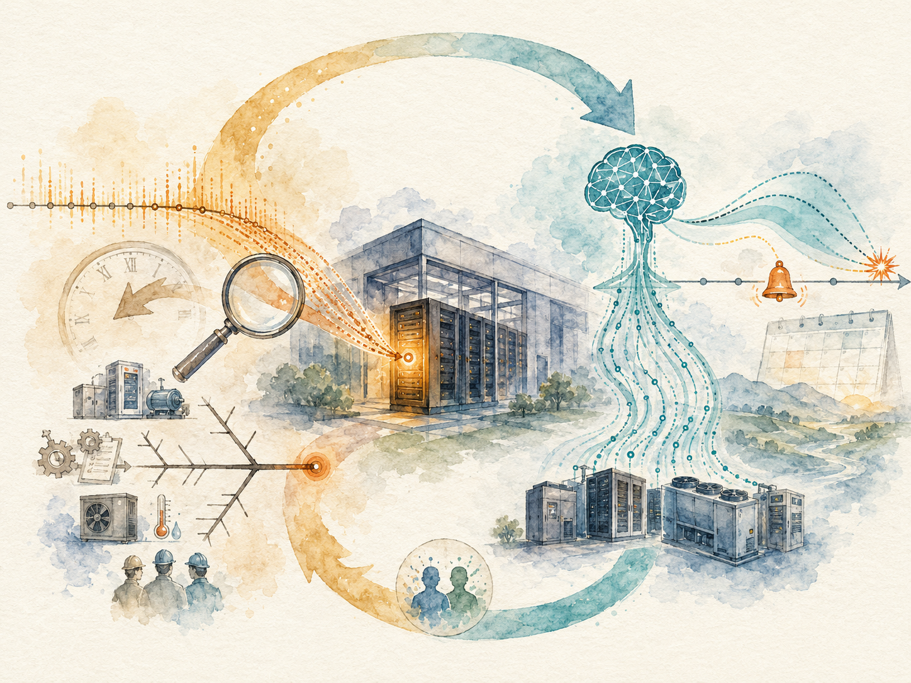
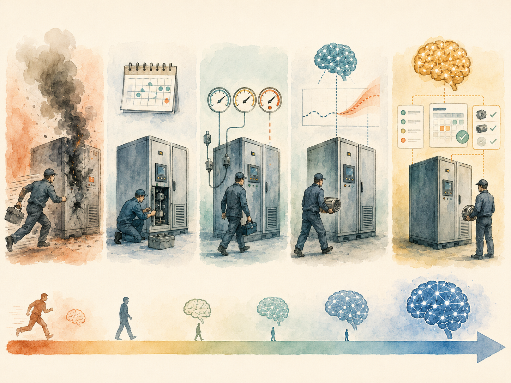

+++
date = '2026-06-14T00:00:00+00:00'
title = "【Data Center 101】Root Cause Analysis and Predictive Maintenance: The Closed Loop of Modern Operations"
slug = "data-center-101-09-rca-pdm"
aliases = ["/posts/data-center-101-rca-pdm/", "/posts/數據中心-101-rca-pdm/"]
tags = ['Data Center', 'Data Center 101', 'Passport to AI Era', '中文']
thumbnail = 'pic.png'
+++

> In thirty years of tracking unplanned data center outages, the Uptime Institute has consistently found one number that surprises nearly everyone outside the industry: **roughly 62% of unplanned outages are caused by human operational error**, not by equipment failure. The cooling system that ran for ten years without issue did not fail because the chiller broke. It failed because someone, somewhere, configured a control valve wrong during routine maintenance.
>
> That single statistic frames the modern operations discipline. The biggest improvement opportunity in the industry is not better hardware — it is better processes for understanding why things go wrong, and better tools for predicting where they will go wrong next.
>
> Uptime Institute 三十年追蹤非計畫性數據中心停機，一直發現一個讓業外人士驚訝的數字：**約 62% 的非計畫性停機由人為運營錯誤造成**，而不是設備故障。那套運轉了 10 年沒事的冷卻系統，不是因為冷水機壞了而失效，而是因為例行保養時某人在某處把一個控制閥設定錯了。
>
> 光是這一個統計就框定了現代運維學科。這個產業最大的改善機會不是更好的硬體 —— 而是更好的「為什麼出錯」流程，以及更好的「下次哪裡會出錯」工具。



---

## Two Paired Practices, One Operational Loop // 兩個配對實踐、一個運轉迴路

The two disciplines that close this gap are **RCA (Root Cause Analysis, 根因分析)** — used after a failure to understand what happened — and **PdM (Predictive Maintenance, 預測性維護)** — used continuously to forecast where the next failure will originate. They share infrastructure, share data, and increasingly share machine-learning models. In a mature operations function, neither stands alone.

縮小這個差距的兩個學科是 **RCA（Root Cause Analysis，根因分析）** —— 故障後用來理解發生了什麼 —— 與 **PdM（Predictive Maintenance，預測性維護）** —— 持續用來預測下一個故障會從哪裡發生。它們共用基礎設施、共用資料、越來越多共用機器學習模型。在成熟的運維功能裡，兩者都不單獨存在。

This article walks through both, then shows the closed loop that connects them: every RCA conclusion becomes training data for the PdM model, and every PdM prediction becomes a hypothesis to be validated by the next RCA event.

這篇文章走過兩者，然後展示連接它們的閉環：每個 RCA 結論變成 PdM 模型的訓練資料，每個 PdM 預測變成下一次 RCA 事件要驗證的假設。

---

## Part 1 — Reading the 62% Number // 第一部分：讀懂這個 62% 的數字

The Uptime Institute's "62%" figure has held remarkably steady over time, even as the industry's hardware has become more reliable and its monitoring more sophisticated. The breakdown tells the story.

Uptime Institute 的「62%」數字隨時間保持驚人穩定，即使業界的硬體變得更可靠、監控變得更先進。拆解告訴了故事。

### Failures vs Incidents: a critical distinction // 故障 vs 事件：關鍵區分

The Uptime survey distinguishes between **Failures** (unplanned outages that caused downtime) and **Incidents** (events that required intervention but did not necessarily cause downtime). The two distributions look very different:

Uptime 調查區分**故障**（造成停機的非計畫性停電）與**事件**（需要介入但不一定造成停機）。兩個分布看起來非常不同：

| Cause | Share of Failures // 故障佔比 | Share of Incidents // 事件佔比 |
|---|---|---|
| **Operations 運營** | **62%** | 35% |
| **Manufacturer 製造** | 19% | **52%** |
| Installation 安裝 | 15% | 6% |
| Design 設計 | 4% | 5% |
| External 外部 | 0% | 2% |

The asymmetry tells us something important: **equipment faults happen more often, but operational errors cause more downtime.** A bad capacitor causes alarms; a misconfigured ATS during maintenance takes the whole facility down.

不對稱告訴我們重要的事情：**設備故障發生得更頻繁，但運營錯誤造成更多停機。** 一顆壞電容會引發警報；保養期間配置錯誤的 ATS 會讓整座機房下線。

### Why operations dominates downtime // 為什麼運營主導停機

Three structural reasons:

三個結構性原因：

- **Compounding complexity** — Each subsystem (power, cooling, fire, security, network) has reasonable design margin. Compounding interactions between subsystems do not.
- **複合複雜度** —— 每個子系統（電力、冷卻、消防、安防、網路）有合理的設計餘量。子系統間的複合互動沒有。
  
- **The maintenance paradox** — The riskiest moments in a facility's life are scheduled maintenance windows, when operators deliberately bypass automatic protections to work on equipment.
- **保養悖論** —— 機房生命裡最危險的時刻是排定保養窗口，運維人員故意繞過自動保護來在設備上工作。
  
- **Cognitive overload at small data centers** — A thousand-sensor facility produces alerts faster than humans can triage them. Important warnings get lost in noise.
- **小機房的認知過載** —— 一座千感測器機房產生警報的速度比人類能分類的速度更快。重要警告淹沒在噪音中。


> **The single largest target for operational improvement is not equipment reliability. It is the cognitive and procedural infrastructure that surrounds operators during normal work — runbooks, change windows, alarm prioritization, and post-incident learning.**
>
> **運轉改善的最大單一目標不是設備可靠性。是包圍運維人員日常工作的認知與流程基礎設施 —— SOP 手冊、變更窗口、警報優先級、與事後學習。**

---

## Part 2 — The Four Layers of Root Cause // 第二部分：根因的四個層次

A common analytical mistake during RCA is stopping too early — settling for the first plausible explanation, naming an individual or an obviously faulty component, and closing the ticket. Mature RCA frameworks push past the first one or two layers to identify the systemic factors that allowed the immediate cause to manifest.

RCA 期間常見的分析錯誤是過早停止 —— 滿足於第一個合理的解釋、指名一個個人或明顯故障的元件、結案。成熟的 RCA 框架會推進過頭一兩層，識別讓直接原因得以浮現的系統性因素。

The standard four-layer model:

標準四層模型：

| Layer | Example explanation // 範例解釋 |
|---|---|
| **L1 — Symptom 表面** | "The UPS failed." |
| **L2 — Equipment 設備** | "The UPS battery degraded faster than expected." |
| **L3 — Process 流程** | "The battery replacement workflow did not include a load test before commissioning." |
| **L4 — Systemic 系統** | "The maintenance management system has no schedule-level visibility for battery age across the fleet, and no policy on load-testing replacement units." |

A well-run organization closes RCA at L3 or L4. An organization that consistently closes at L1 or L2 keeps repeating the same incidents in slightly different forms.

運轉良好的組織在 L3 或 L4 結案 RCA。一直在 L1 或 L2 結案的組織會以稍微不同的形式持續重複同樣的事件。

> **RCA is not about finding who or what to blame. It is about finding what to change so the same thing cannot happen again.**
>
> **RCA 不是找誰或什麼來咎責。是找出「該改什麼，讓同一件事不能再發生」。**

---

## Part 3 — The Five Classical RCA Tools // 第三部分：五個經典 RCA 工具

The methodology toolkit for RCA was largely developed in manufacturing — Toyota's production system, the aerospace industry's safety culture, the nuclear industry's incident review processes — and has migrated into IT operations relatively recently. Five tools dominate.

RCA 的方法論工具包大部分在製造業裡發展 —— 豐田生產系統、航太業的安全文化、核能業的事件審查流程 —— 相對較晚才遷移到 IT 運維。五個工具主導。

### 5 Whys // 5 個為什麼

The simplest tool: ask "why" five times, each time using the previous answer as the new question. Originating from Toyota.

最簡單的工具：問五次「為什麼」，每次用前一個答案當新問題。源自豐田。

A worked example for a hypothetical facility outage:

一個假想機房停電的範例：

```
Problem: 3rd-floor Hall 2 lost power for 30 minutes.

Why 1: Why did the hall lose power?
       → Because the UPS handoff failed.

Why 2: Why did the UPS handoff fail?
       → Because the static transfer switch (STS) entered fault mode.

Why 3: Why did the STS go into fault mode?
       → Because its control board overheated.

Why 4: Why did the control board overheat?
       → Because the internal cooling fan had stopped.

Why 5: Why was the fan failure not caught before it caused a fault?
       → Because the STS internal fan was not in the PdM monitoring scope.
       ← This is the root cause (L3-L4 systemic).

Corrective action: Add STS internal fan to PdM monitoring scope.
Preventive action: Audit PdM monitoring coverage for ALL critical subsystems.
```

The trap with the 5-Whys is stopping too early or veering into blaming an individual. A good facilitator keeps the chain focused on system factors, not personal ones.

5 個為什麼的陷阱是「停得太早」或「轉向責怪個人」。好的引導者會把鏈條聚焦在系統因素，而不是個人因素。

### Fishbone (Ishikawa) // 魚骨圖（石川圖）

A category-based brainstorming tool. Instead of following a single chain of reasoning, the Fishbone forces the team to consider multiple parallel causal categories. The classical six categories are **6M**:

基於類別的腦力激盪工具。不是順著單一推理鏈走，魚骨圖強迫團隊考慮多個平行因果類別。經典六類別是 **6M**：

- **Man** — Human factors: training, fatigue, handoff
- **人（Man）** —— 人的因素：訓練、疲勞、交接班
  
- **Method** — Procedures: SOPs, change windows, communication protocols
- **方法（Method）** —— 程序：SOP、變更窗口、通訊協定
  
- **Machine** — Equipment: design margin, age, maintenance state
- **設備（Machine）** —— 設備：設計餘量、年齡、保養狀態
  
- **Material** — Supplies: refrigerant quality, fuel quality, battery batches
- **材料（Material）** —— 供應：冷媒品質、燃油品質、電池批次
  
- **Measurement** — Sensors and monitoring: drift, missing coverage, false positives
- **量測（Measurement）** —— 感測器與監控：漂移、覆蓋缺漏、誤報
  
- **Mother Nature** — Environment: weather, vibration, EMI
- **環境（Mother Nature）** —— 環境：天氣、振動、EMI


The Fishbone's strength is forcing breadth before depth. Its weakness is taking longer than the 5-Whys when the cause is genuinely a single chain.

魚骨圖的強項是強迫先廣再深。它的弱點是當原因真的是單一鏈時，比 5 個為什麼花更久。

### FMEA — Failure Mode and Effects Analysis // FMEA：失效模式與影響分析

FMEA is a forward-looking, design-time tool. For each component, the team lists every plausible failure mode, scores the **Severity (S)**, **Occurrence (O)**, and **Detection (D)** of each, computes the **Risk Priority Number (RPN = S × O × D)**, and addresses the highest-RPN items first.

FMEA 是前瞻性、設計階段的工具。對每個元件，團隊列出每個合理的失效模式，給每個失效打**嚴重度（S）**、**發生率（O）**、**偵測度（D）** 分數，計算**風險優先級（RPN = S × O × D）**，先處理 RPN 最高的項目。

A sample FMEA fragment for a UPS subsystem:

UPS 子系統的 FMEA 範例片段：

| Failure mode // 失效模式 | Effect // 影響 | S | O | D | RPN | Mitigation // 緩解 |
|---|---|---|---|---|---|---|
| Battery internal resistance rises<br>電池內阻上升 | Switchover trips out during outage<br>停電時切換跳脫 | 10 | 4 | 6 | 240 | Add internal-resistance monitoring<br>加內阻監控 |
| Fan failure → overtemp shutdown<br>風扇故障 → 過溫關機 | UPS module drops out<br>UPS 模組退出 | 9 | 5 | 3 | 135 | Add fan-speed sensor<br>加風扇轉速感測器 |
| Static bypass false trigger<br>靜態旁路誤觸發 | Brief raw-utility exposure to IT<br>IT 短暫暴露於原始市電 | 7 | 2 | 4 | 56 | Bypass interlock + change control<br>旁路連鎖 + 變更管制 |

FMEA is widely used in aerospace and automotive but adopted unevenly in the data center industry. Most facilities perform some FMEA-equivalent analysis informally during design review without using the formal scoring framework.

FMEA 在航太與汽車業廣泛使用，但在數據中心產業採用不均。多數機房在設計審查時非正式地做一些 FMEA 等效分析，沒用正式評分框架。

### FTA — Fault Tree Analysis // FTA：故障樹分析

FTA works backward from a defined undesirable outcome (e.g., "facility loses power") and traces all combinations of upstream events that could produce it, expressed through Boolean logic gates (AND, OR).

FTA 從一個定義好的不期望結果（例如「機房失電」）反向推，追溯所有上游事件可以產生它的組合，用布林邏輯閘（AND、OR）表達。

The output is a probability — given individual component failure rates, what is the probability of the top-level event? FTA is the standard tool for quantifying reliability in Tier IV designs and for insurance underwriting.

輸出是一個機率 —— 給定個別元件故障率，頂層事件的機率是多少？FTA 是 Tier IV 設計裡量化可靠性、以及保險核保的標準工具。

### ETA — Event Tree Analysis // ETA：事件樹分析

ETA works forward from an initiating event (e.g., "utility power lost") and traces each downstream decision node (does UPS take over? does ATS switch? does genset start?) to enumerate possible outcomes with associated probabilities.

ETA 從一個起始事件（例如「失市電」）向前推，追蹤每個下游決策節點（UPS 接管？ATS 切換？發電機啟動？）來列舉可能的結果與相關機率。

FTA and ETA together cover the bidirectional probabilistic analysis needed for SLA modeling and for high-reliability design verification.

FTA 與 ETA 一起涵蓋 SLA 建模與高可靠性設計驗證所需的雙向機率分析。

### When to use which // 何時用哪個

| Tool | Best for // 最適合 |
|---|---|
| 5 Whys | Quick post-incident analysis with limited team time<br>團隊時間有限的快速事後分析 |
| Fishbone | Cross-functional team analysis of complex incidents<br>跨部門團隊分析複雜事件 |
| FMEA | Design review and proactive risk assessment<br>設計審查與主動風險評估 |
| FTA | Quantifying reliability for SLA, insurance, certification<br>給 SLA、保險、認證量化可靠性 |
| ETA | Scenario planning, disaster recovery design<br>情境規劃、災難復原設計 |

---

## Part 4 — Modern RCA: Causal Inference and LLM-Assisted Analysis // 第四部分：現代 RCA —— 因果推論與 LLM 輔助分析

The classical tools remain useful but increasingly fall short for one reason: data center operations now produce more telemetry per hour than a human team can read in a week. The interesting questions have shifted from "what caused this?" — answerable from the timeline — to "what caused this *that we would not have noticed manually?*"

經典工具仍有用，但越來越力不從心，原因是：數據中心運維現在每小時產出的遙測，比人類團隊一週能讀的還多。有趣的問題已經從「什麼造成這個？」 —— 從時間軸可以回答 —— 轉到「**人工不會注意到的**什麼造成了這個？」

Three modern techniques fill that gap.

三個現代技術填補這個空缺。

### Anomaly detection // 異常偵測

The first AI extension of RCA is not really RCA — it is moving the discovery of fault candidates earlier. Anomaly detection models continuously scan telemetry for patterns that deviate from learned normal behavior, surfacing fault candidates before they cascade into an outage.

RCA 的第一個 AI 延伸實際上不是 RCA —— 而是把故障候選的發現點往前移。異常偵測模型持續掃描遙測尋找偏離已學習正常行為的模式，在它們連鎖造成停機之前浮現故障候選。

The dominant techniques:

主流技術：

- **Isolation Forest** — Fast, interpretable, weak on complex time-series // 快、可解釋、複雜時序上較弱
- **Autoencoder** — Reconstruction error as anomaly score; strong on high-dimensional data // 重構誤差當異常分數；高維資料上強
- **LSTM-Autoencoder** — Time-series version of the above; captures temporal patterns // 上述的時序版本；捕捉時間模式


### Causal inference // 因果推論

Anomaly detection finds the **what**; causal inference asks the **why**. Modern tools (Microsoft DoWhy, Uber CausalML, CMU Tetrad) use graphical causal models and counterfactual reasoning to estimate which upstream variable most likely caused a downstream effect — distinguishing actual causation from mere correlation.

異常偵測找「**什麼**」；因果推論問「**為什麼**」。現代工具（Microsoft DoWhy、Uber CausalML、CMU Tetrad）使用圖形因果模型與反事實推理來估計哪個上游變數最可能造成下游效應 —— 把實際因果關係跟單純相關區分開來。

The classical example: "Ice cream sales correlate with drowning deaths." Correlation = strong. Causation = none; both are driven by summer weather. Bayesian causal networks are the formal framework that makes the distinction operationally usable.

經典例子：「冰淇淋銷量跟溺斃死亡相關。」相關 = 強。因果 = 無；兩者都被夏天天氣驅動。貝氏因果網路是讓這個區分在運轉上可用的正式框架。

### LLM-assisted RCA // LLM 輔助 RCA

Since 2023, large language models have entered the RCA toolkit in three concrete modes:

從 2023 年起，大語言模型以三種具體模式進入 RCA 工具包：

**Conversational copilot:**
An operator describes the incident; the LLM, given access to telemetry and a knowledge base of past incidents, suggests likely causes and recommended diagnostic steps. The operator remains the decision-maker.

**對話式 Copilot：**
運維人員描述事件；LLM 在獲得遙測存取權與過去事件知識庫的情況下，建議可能原因與推薦診斷步驟。運維人員仍是決策者。

**Automated post-incident reports:**
After an incident closes, the platform pulls all related telemetry, alarm history, change records, and CCTV footage; the LLM drafts a structured post-mortem report; a human edits and finalizes.

**自動化事後報告：**
事件結案後，平台拉所有相關遙測、警報歷史、變更紀錄、CCTV 影像；LLM 草擬結構化的事後報告；人類編輯與定稿。

**Knowledge-base RAG:**
Historical RCA reports are vector-embedded and stored. When a new event begins to look like a previously seen pattern, retrieval-augmented generation surfaces the historical match and the associated remediation playbook.

**知識庫 RAG：**
歷史 RCA 報告被向量嵌入並儲存。當新事件開始看起來像之前看過的模式，檢索增強生成浮現歷史匹配與相關的補救手冊。

> **The operator who can use an LLM-assisted RCA tool well — knows how to write the right prompt, knows how to verify what the model claims — has become a meaningfully more productive incident responder. This is now a standard interview topic for senior data center roles.**
>
> **能好好使用 LLM 輔助 RCA 工具的運維人員 —— 知道怎麼寫對的提示、知道怎麼驗證模型的主張 —— 已經變成顯著更有生產力的事件響應者。這現在是資深數據中心職位的標準面試主題。**

---

## Part 5 — The RCA Platform: Seven Functional Modules // 第五部分：RCA 平台 —— 七個功能模組

A mature RCA platform is not a single piece of software. It is a stack of seven cooperating modules, each handling one aspect of the analysis-and-learning loop.

成熟的 RCA 平台不是單一軟體。它是七個合作模組的堆疊，每個處理分析與學習迴路的一個面向。

| Module | Function // 功能 |
|---|---|
| **1. Incident management** | Severity classification (P0–P3), timeline tracking, status workflow, on-call routing<br>嚴重度分類（P0–P3）、時間軸追蹤、狀態流轉、值班路由 |
| **2. Timeline reconstruction** | Auto-pull telemetry, alarm history, change records, CCTV, access logs for the surrounding window<br>自動拉取事件前後窗口的遙測、警報歷史、變更紀錄、CCTV、門禁日誌 |
| **3. Fault scenario library** | Historical incidents stored as embeddings; similarity search for matching past cases<br>歷史事件以嵌入向量儲存；用相似度搜尋匹配的過去案例 |
| **4. AI root-cause engine** | Three-layer inference: rule engine → statistical correlation → LLM analysis<br>三層推論：規則引擎 → 統計關聯 → LLM 分析 |
| **5. Action recommendation** | Immediate actions, short-term fixes, long-term prevention measures<br>即時動作、短期修復、長期預防 |
| **6. Post-mortem workflow** | Templates, cross-team collaboration, blameless culture, action item tracking<br>模板、跨團隊協作、無責文化、行動項目追蹤 |
| **7. Trend dashboard** | Quarterly Pareto analysis, MTBF/MTTR trends, recurring-incident detection<br>季度 Pareto 分析、MTBF/MTTR 趨勢、重複事件偵測 |

The fault scenario library is arguably the most differentiating module. A platform that has accumulated hundreds of well-documented historical incidents, each with a structured timeline and a vetted root cause, becomes meaningfully better at suggesting matches than a platform without that history. The library compounds over time.

故障情境庫可說是最具差異化的模組。累積了上百個文件化良好的歷史事件、每個都有結構化時間軸與經審查的根因的平台，比沒有那段歷史的平台在建議匹配上明顯更好。情境庫隨時間複利。

---

## Part 6 — Six Worked Failure Scenarios // 第六部分：六個實際故障情境

The clearest way to make the abstract concrete is to walk through example failure timelines. The six below are composites — drawn from public Uptime case studies, vendor post-mortems, and industry forums — illustrating the diversity of modern data center failure modes.

把抽象變具體最清楚的方法是走過範例故障時間軸。下面六個是綜合案例 —— 取自公開的 Uptime 案例研究、廠商事後分析、產業論壇 —— 說明現代數據中心故障模式的多樣性。

### Scenario 1 — UPS handoff failure cascade // 情境一：UPS 切換失敗連鎖

```
T-30 min  Scheduled UPS 2 maintenance begins
T-25 min  Maintenance bypass engaged on UPS 2
T-20 min  ANOMALY: UPS 1 quietly enters its own bypass (no alarm raised)
T-10 min  Utility voltage flicker
T-5 min   UPS 1's bypass cannot absorb the disturbance
T= 0      All IT loads in Hall 2 drop power for 30 seconds
```

L1 cause: UPS 1 bypass activated silently.
L1 原因：UPS 1 旁路靜默啟動。

L2 cause: Both UPS systems were in bypass simultaneously — an architectural prohibition.
L2 原因：兩台 UPS 同時在旁路 —— 架構禁區。

L3 cause: Change workflow did not include a "both paths healthy" interlock check.
L3 原因：變更工單沒包含「兩路徑健康」連鎖檢查。

L4 cause: No automated "single-path operating" warning across the facility.
L4 原因：機房沒有自動化的「單路徑運轉」警告。


### Scenario 2 — Cooling failure with ignored early alarm // 情境二：冷卻失效 + 早期警報被忽略

```
T-60 min  Chiller 1 efficiency begins to degrade (early-warning alarm raised)
T-50 min  Alarm acknowledged but not investigated — categorized as routine
T-30 min  Room temperature drift +0.5°C/min becomes noticeable
T-15 min  Five cabinets exceed 32°C
T-5 min   Multiple cabinets exceed 35°C
T= 0      Server BMC thermal-protection triggers automatic shutdown
```

The root cause was not the chiller. It was the alarm prioritization scheme that allowed an early-warning alarm to be categorized as "routine" and acknowledged without investigation.

根因不是冷水機。是警報優先級設計允許一個「早期警告」被歸類為「例行」並被認可而不調查。

### Scenario 3 — Fire system + access control linkage failure // 情境三：消防 + 門禁聯動失敗

```
T= 0      Electrical short in a cabinet ignites a small fire
T+30 s    Cabinet-level fire suppression discharges (partial containment)
T+60 s    Room-level VESDA detects smoke
T+90 s    Room-level Novec gas suppression discharges
T+90 s    BUG: HVAC does NOT shut down → Novec dispersed before reaching concentration
T+150 s   Fire spreads to adjacent cabinet
T+200 s   BUG: Access doors do NOT unlock automatically — maintenance staff trapped
T+5 min   Sprinklers activate; all equipment destroyed
T+10 min  Fire department arrives
```

This is a classic linkage-failure case. The individual subsystems worked. The choreography between them did not. Annual full-system linkage testing would have caught both bugs before they mattered.

這是經典的聯動失敗案例。個別子系統運作。它們之間的協調沒運作。每年的全系統聯動測試應該會在這些 bug 變要緊之前抓到。

### Scenario 4 — Unauthorized intrusion via tailgating // 情境四：透過尾隨的未授權入侵

```
T= 0      Departed employee enters lobby with still-active badge (HR system not synced)
T+5 min   Tailgates a current employee into the data hall
T+30 min  Lingers near a specific cabinet
T+45 min  Removes a network cable and replaces it with a packet-sniffing device
T+1 hr    Departs
T+1 day   IT notices unusual network behavior
T+1 week  Security team reviews CCTV and identifies the breach
```

Three independent failures: HR-to-access-control synchronization gap; no anti-tailgating (mantrap) at the data hall entry; no real-time CCTV behavior analytics. Any one of the three would have prevented the breach.

三個獨立失敗：HR 與門禁同步缺口；機房入口沒有反尾隨（mantrap）；沒有即時 CCTV 行為分析。三者任一個都能防止入侵。

### Scenario 5 — Lithium battery thermal runaway // 情境五：鋰電池熱失控

```
T-7 days   PdM alarm: cell 12 temperature drifting upward (alarm ignored as noise)
T-1 day    PdM alarm: cell 12 internal resistance anomaly (alarm ignored)
T-2 hr     Cell 12 enters thermal runaway
T-30 min   Smoke detection (short-circuit + electrolyte vapor)
T= 0       Fire and rapid expansion
T+2 min    Building evacuation
T+30 min   Fire department arrives — lithium fires are notoriously hard to extinguish
T+24 hr    Recovery operations begin
```

This is the modern failure mode that the lithium transition has introduced to data centers. The PdM signal was there days in advance and was missed twice. A PdM platform integration without escalation policy is worse than no PdM platform at all — it provides false reassurance.

這是鋰電池轉變引入數據中心的現代故障模式。PdM 訊號在幾天前就在那裡，被忽略了兩次。沒有升級政策的 PdM 平台整合比根本沒有 PdM 平台更糟 —— 它提供虛假的安心。

### Scenario 6 — DDoS triggers facility-level cascade // 情境六：DDoS 觸發機房層級連鎖

```
T= 0      Large DDoS attack on a customer's site
T+5 min   CDN absorbs 70%; 30% reaches origin servers
T+10 min  Origin servers ramp to 100% CPU utilization
T+15 min  Facility electricity draw rises 40%
T+20 min  UPS enters overload warning state
T+30 min  Cooling system reaches design ceiling
T+40 min  Room temperature begins to climb
T+50 min  Some cabinets initiate automatic frequency throttling
T+60 min  DDoS attack ends
T+90 min  Facility stabilizes
```

This scenario does not look like a facility incident; it looks like a customer's IT incident. But the chain of events crosses the IT/facility boundary, and a strict separation between IT operations and facility operations would have left both teams blind to what was happening on the other side.

這個情境看起來不像機房事件；看起來像客戶的 IT 事件。但事件鏈跨越 IT/設施邊界，IT 運維與設施運維的嚴格分離會讓兩個團隊對另一邊發生的事情都瞎掉。

The architectural lesson: facility DCIM and IT operations monitoring need a shared dashboard layer for cross-boundary events.

架構教訓：機房 DCIM 與 IT 運維監控需要為跨邊界事件共用儀表板層。

---

## Part 7 — Post-mortem Culture: Blameless and SLO-Based // 第七部分：事後文化 —— 無責與 SLO 基礎

Two cultural practices have done more than any technology to improve modern operations: **blameless post-mortems** and **SLO/Error-Budget** management. Both come from Google's Site Reliability Engineering (SRE) tradition and have spread through the wider industry over the last decade.

兩個文化實踐對改善現代運維比任何技術做得更多：**無責事後檢討**與 **SLO/錯誤預算管理**。兩者都來自 Google 的網站可靠性工程（SRE）傳統，過去十年透過整個產業擴散。

### Blameless post-mortems // 無責事後檢討

The core principle: assume **everyone involved made the best decision they could with the information they had at the time.** Find the systemic factors that allowed the situation to develop, not the individual to assign blame to.

核心原則：假設**所有涉入的人在當時擁有的資訊下做了最好的決策**。找讓情況得以發展的系統性因素，而不是指派咎責的個人。

A standard blameless post-mortem template:

標準無責事後檢討模板：

- **Summary** — 3 lines: what failed, impact, how it was resolved
- **摘要** —— 3 行：什麼故障、影響、怎麼解決
  
- **Impact** — Affected customers, duration, financial impact, SLA breaches
- **影響** —— 受影響客戶、持續時間、財務影響、SLA 違約
  
- **Timeline** — Full sequence of events
- **時間軸** —— 完整事件序列
  
- **Root cause** — Layered analysis (L1 → L4)
- **根因** —— 分層分析（L1 → L4）
  
- **What went well** — Things to continue
- **做對的事** —— 要持續的事情
  
- **What went wrong** — Systemic factors to change (NOT individuals)
- **做錯的事** —— 要改變的系統性因素（不是個人）
  
- **Action items** — Owner, due date, change description
- **行動項目** —— 負責人、截止日、變更描述
  
- **Lessons learned** — Adds to the fault scenario library
- **學到的教訓** —— 加入故障情境庫


The cultural shift that enables blameless analysis is harder than the template. It requires senior leadership to demonstrate, repeatedly, that they will not punish operators for honest mistakes — because the alternative, fear-driven incident reporting, distorts the data more than missing reports do.

啟用無責分析的文化轉變比模板更難。它需要資深領導反覆證明他們不會懲罰運維人員的誠實錯誤 —— 因為替代方案，恐懼驅動的事件回報，比缺報告更扭曲資料。

### SLO, SLA, Error Budget // SLO、SLA、錯誤預算

The second SRE-derived practice is treating reliability as a quantitative budget rather than a binary target.

第二個來自 SRE 的實踐是把可靠性當量化預算，而不是二元目標。

| Term | Definition // 定義 |
|---|---|
| **SLI (Service Level Indicator)** | A measurable metric (e.g., monthly uptime percentage)<br>可量測指標（如月度可用率） |
| **SLO (Service Level Objective)** | An internal target (e.g., 99.95% monthly uptime)<br>內部目標（如月度 99.95% 可用率） |
| **SLA (Service Level Agreement)** | A contractual commitment to customers (e.g., 99.9%, with penalties below)<br>對客戶的契約承諾（如 99.9%，以下有罰則） |
| **Error Budget** | The allowed downtime under the SLO (e.g., 99.95% = 4.38 hr/year)<br>SLO 下允許的停機（如 99.95% = 4.38 hr/年） |

The clever twist is how the Error Budget is used: when it is mostly unspent, the team is allowed (even encouraged) to make changes, run experiments, push new features. When it is mostly spent, change freezes go into effect until reliability returns to target.

巧妙的轉折是錯誤預算怎麼被使用：當它大部分未用時，團隊被允許（甚至鼓勵）做變更、跑實驗、推新功能。當它大部分用完時，變更凍結生效，直到可靠性回到目標。

> **The Error Budget concept replaces subjective arguments about "are we being too cautious?" or "are we taking too many risks?" with a measured number. The argument shifts from rhetoric to math.**
>
> **錯誤預算概念把「我們是不是太保守？」或「我們是不是冒太多風險？」這類主觀辯論替換成一個量化的數字。爭論從修辭轉到數學。**

---

## Part 8 — Maintenance: The Five Maturity Levels // 第八部分：維護的五個成熟度等級

If RCA looks backward at what failed, the discipline that looks forward — and tries to prevent failure entirely — is **maintenance**. Modern frameworks organize maintenance into five maturity levels.

如果 RCA 向後看什麼失敗了，那麼向前看的學科 —— 試圖完全防止失敗 —— 是**維護**。現代框架把維護組織成五個成熟度等級。

| Level | Name | Trigger // 觸發 | Where the industry sits // 業界在哪 |
|---|---|---|---|
| **L1** | Reactive 反應式 | After failure<br>故障後 | Legacy facilities only<br>只有老舊機房 |
| **L2** | Preventive 預防性 | Fixed schedule<br>固定週期 | Mainstream<br>主流 |
| **L3** | Condition-based 狀態式 | Threshold crossing<br>越過門檻 | Leading operators<br>領先業者 |
| **L4** | Predictive (PdM) 預測性 | ML-predicted failure window<br>ML 預測的故障窗口 | Hyperscalers, top colocation<br>Hyperscaler、頂尖 Colocation |
| **L5** | Prescriptive 規範式 | AI recommends specific action<br>AI 推薦具體動作 | Experimental<br>實驗中 |

### What changes at L2 → L4 // L2 → L4 的改變

The shift from time-based preventive maintenance to predictive maintenance is the most economically significant in the maturity ladder.

從基於時間的預防性維護到預測性維護的轉變，是成熟度階梯裡經濟意義最重大的。

**L2 (preventive // 預防性):**
- Battery cells: replace every 5 years regardless of state
- 電池電芯：每 5 年更換不管狀態
  
- Genset: oil change every 250 run-hours
- 發電機：每 250 運轉小時換油
  
- Chiller: full overhaul every year
- 冷水機：每年大保


**L4 (predictive // 預測性):**
- Battery cells: replace when monitored internal resistance crosses the predictive threshold — typical actual replacement at 4.8 years
- 電池電芯：當監控的內阻越過預測門檻時更換 —— 典型實際更換在 4.8 年
  
- Genset: oil condition monitored; change when properties degrade — typical actual change at ~150 hours
- 發電機：油品狀態被監控；當性質衰退時換 —— 典型實際更換約 150 小時
  
- Chiller: vibration, oil temperature, COP monitored; intervene only on actual degradation
- 冷水機：振動、油溫、COP 被監控；只在實際衰退時介入


The benefits compound:

效益複利：

- **Reduced over-maintenance** — 30–50% fewer parts replaced
- **減少過度維護** —— 更換零件少 30–50%
  
- **Reduced unplanned failures** — 60–80% reduction in surprise events
- **減少非計畫性故障** —— 意外事件減少 60–80%
  
- **Extended equipment life** — Components actually used to their statistical limit, not their conservative replacement schedule
- **延長設備壽命** —— 元件實際用到統計上限，而不是保守的更換排程
  
- **Better operator focus** — Time freed up from routine to direct at higher-judgment work
- **更好的運維專注** —— 從例行工作釋出的時間用在更高判斷的工作上


### A worked PdM economic case // PdM 經濟學案例

A thousand-cabinet facility with 500 UPS modules:

千機櫃機房、500 個 UPS 模組：

| Line item | Traditional PM | PdM |
|---|---|---|
| Annual UPS replacement<br>年度 UPS 更換 | 100 modules × $5K = $500K | 60 modules × $5K = $300K |
| Annual emergency repairs<br>年度緊急搶修 | 5 × $50K = $250K | 0.5 × $50K = $25K |
| Annual PdM platform OPEX<br>年度 PdM 平台 OPEX | $0 | $100K |
| **Annual total** | **$750K** | **$425K** |
| **Annual saving** | — | **$325K** |

Platform CAPEX is roughly $300K. Payback is approximately one year. Three-year ROI sits around 225%.

平台 CAPEX 約 $300K。回本約一年。三年 ROI 約 225%。



---

## Part 9 — Equipment-Specific PdM and the ML Toolkit // 第九部分：設備特定 PdM 與 ML 工具包

PdM is not one model. It is a portfolio of models, each tailored to a specific equipment class.

PdM 不是一個模型。是模型組合，每個針對特定設備類別客製化。

### What each equipment class needs // 每個設備類別需要什麼

| Equipment | Monitored signals // 監控訊號 | Failure modes predicted // 預測的故障模式 |
|---|---|---|
| **UPS** | Internal temperature, fan speed, module efficiency drift, harmonic distortion<br>內部溫度、風扇轉速、模組效率漂移、諧波失真 | Fan failure, module degradation, capacitor wear |
| **Battery (Li-ion)** | Internal resistance, voltage per cell, temperature per cell, charge/discharge curves<br>內阻、每節電壓、每節溫度、充放電曲線 | State-of-health decline, **thermal runaway precursors** |
| **Genset** | Oil pressure, coolant temperature, vibration, start time, exhaust temperature, fuel quality<br>油壓、冷卻水溫、振動、啟動時間、排氣溫度、燃油品質 | Start failure, bearing wear, fuel degradation |
| **Transformer** | Oil temperature, dissolved gas analysis (DGA), partial discharge, load factor<br>油溫、油溶解氣體分析（DGA）、局部放電、負載因子 | Insulation degradation, winding faults |
| **Chiller** | Compressor vibration, refrigerant pressure, COP, oil quality<br>壓縮機振動、冷媒壓力、COP、油品質 | Compressor wear, refrigerant leak, oil contamination |
| **Circuit breakers** | Operation count, contact resistance, insulation resistance<br>動作次數、接觸電阻、絕緣電阻 | Contact wear, mechanism failure |

### The ML model families // ML 模型家族

Five families of models cover most PdM use cases:

五個模型家族涵蓋多數 PdM 用例：

- **Time-series anomaly detection** — LSTM, Transformer, Autoencoder; Isolation Forest for simpler cases
- **時序異常偵測** —— LSTM、Transformer、Autoencoder；較簡單案例用 Isolation Forest
  
- **Time-series forecasting** — ARIMA, Prophet, LSTM, Transformer-based models
- **時序預測** —— ARIMA、Prophet、LSTM、Transformer-based 模型
  
- **Fault classification** — XGBoost on vibration spectrograms; CNN on sensor signal images
- **故障分類** —— XGBoost 在振動頻譜上；CNN 在感測器訊號影像上
  
- **Remaining useful life (RUL) prediction** — Weibull survival analysis, Cox proportional hazards, deep survival networks
- **剩餘壽命（RUL）預測** —— Weibull 生存分析、Cox 比例風險、深度生存網路
  
- **Reinforcement learning** — Used at the multi-equipment policy level to optimize maintenance scheduling across the fleet
- **強化學習** —— 用在多設備政策層級，跨整個機隊優化維護排程


### The transformer DGA case // 變壓器 DGA 案例

The transformer Dissolved Gas Analysis (DGA) use case is worth highlighting because it predates modern ML and shows how interpretable PdM has been for decades. The mix of dissolved gases in transformer oil — hydrogen, methane, acetylene, ethylene, ethane — varies with fault type. The classical **Duval Triangle** method classifies the fault from the gas ratios. Modern ML overlays improve sensitivity but build on the same physical foundation.

變壓器溶解氣體分析（DGA）用例值得強調，因為它早於現代 ML，並展示 PdM 數十年來如何可解釋。變壓器油裡溶解氣體的混合 —— 氫、甲烷、乙炔、乙烯、乙烷 —— 隨故障類型變化。經典的 **Duval Triangle** 方法從氣體比例分類故障。現代 ML 疊加改善敏感度，但建立在同樣的物理基礎上。

---

## Part 10 — The Closed Loop // 第十部分：閉環

RCA and PdM are the same operational loop seen from two directions. Each one fails without the other.

RCA 與 PdM 是同一個運轉迴路從兩個方向看。任何一個沒有另一個會失敗。

```
        Past failure                  Future failure
       ┌────────────┐                ┌────────────┐
       │            │                │            │
       │    RCA     │  ←── INFORMS ──┤    PdM     │
       │  Analysis  │                │ Prediction │
       │            │                │            │
       └─────┬──────┘                └──────┬─────┘
             │                              │
             │  Lessons learned added       │  Predictions
             │  to fault scenario library   │  validated by
             │                              │  next event
             │                              │
             ▼                              ▼
       Improved PdM models  ←──────  Better RCA hypotheses
```

The platform that enables the closed loop has to share three things between the two functions:

啟用閉環的平台必須在兩個功能間共享三件事：

- **The CMDB (Configuration Management Database)** — equipment topology, ownership, dependencies
- **CMDB（Configuration Management Database，配置管理資料庫）** —— 設備拓樸、所有權、相依
  
- **The time-series database** — historical telemetry, same data for backward analysis and forward prediction
- **時序資料庫** —— 歷史遙測，向後分析與向前預測用同一份資料
  
- **The fault scenario library** — each RCA conclusion becomes a labeled training example for the PdM model
- **故障情境庫** —— 每個 RCA 結論變成 PdM 模型的標註訓練範例


When an organization builds these as separate systems for the two functions, the loop does not close. When they are built as one shared substrate, every incident makes the next prediction more accurate, and every prediction creates a hypothesis the next incident either validates or refutes.

當組織把這些建成兩個功能的分開系統，迴路不會閉合。當它們建成一個共享基礎，每個事件讓下一個預測更準，每個預測創造一個下一個事件會驗證或反駁的假設。

> **The closed loop is the difference between operations that improve year over year and operations that repeat the same incidents in slightly different forms. The technology is now widely available. What separates the leaders from the followers is the discipline to use it consistently.**
>
> **閉環是「年復一年改善的運維」跟「以稍微不同形式重複同樣事件的運維」之間的差別。技術現在廣泛可得。把領先者跟追隨者分開的，是持續使用它的紀律。**

---

## Key Takeaways // 重點整理

#### 1. 62% of unplanned outages come from human operations // 62% 的非計畫性停機來自人為運營

The Uptime Institute number has been stable for thirty years. Equipment reliability has improved; operational complexity has compounded. The single largest improvement target is procedural, not technical.

Uptime Institute 的數字三十年來保持穩定。設備可靠性改善了；運轉複雜度複合了。最大的改善目標是流程性的，不是技術性的。

#### 2. RCA must reach L3 or L4 to be useful // RCA 必須抵達 L3 或 L4 才有用

Stopping at "the UPS failed" closes a ticket but learns nothing. Reaching "no policy on load-testing replacement units" produces a systemic change that prevents recurrence.

停在「UPS 失敗了」結案但什麼都沒學。抵達「沒有更換單元的負載測試政策」產出防止再發的系統性變更。

#### 3. The five classical RCA tools each have a niche // 五個經典 RCA 工具各有其位

5 Whys for speed, Fishbone for breadth, FMEA for design-time prevention, FTA for SLA quantification, ETA for scenario planning. A mature operations function uses all five at different moments.

5 個為什麼為速度、魚骨圖為廣度、FMEA 為設計階段預防、FTA 為 SLA 量化、ETA 為情境規劃。成熟的運維功能在不同時刻使用全部五個。

#### 4. LLM-assisted RCA has crossed from novelty to standard // LLM 輔助 RCA 已從新奇跨到標準

Conversational copilots, automated post-mortem drafting, knowledge-base RAG. The operator who knows how to use these tools well is meaningfully more productive than one who does not.

對話式 Copilot、自動化事後報告草擬、知識庫 RAG。知道怎麼好好使用這些工具的運維人員，比不知道的人明顯更有生產力。

#### 5. Blameless post-mortems and Error Budgets came from SRE // 無責事後檢討與錯誤預算來自 SRE

Both replace fear-driven or argument-driven dynamics with measurement-driven ones. Both spread from Google through the wider industry over the last decade.

兩者都把恐懼驅動或爭論驅動的動態替換成量測驅動的。兩者都在過去十年從 Google 擴散到更廣的產業。

#### 6. Maintenance maturity progresses L1 → L5 // 維護成熟度從 L1 進展到 L5

Reactive → preventive → condition-based → predictive → prescriptive. Most operating facilities sit between L2 and L3. Leading operators are at L4. L5 is experimental.

反應式 → 預防性 → 狀態式 → 預測性 → 規範式。多數運轉機房處在 L2 到 L3。領先業者在 L4。L5 是實驗中。

#### 7. PdM is operationally profitable above a few hundred cabinets // PdM 在幾百櫃以上運轉上有利可圖

A $300K platform CAPEX with $100K/year OPEX saves $325K/year on a 500-UPS-module facility. One-year payback, ~225% three-year ROI. The economics work cleanly above a certain scale.

$300K 平台 CAPEX 加 $100K/年 OPEX，在 500 UPS 模組的機房省 $325K/年。一年回本、三年 ROI 約 225%。在某個規模以上經濟學乾淨成立。

#### 8. The closed loop is what separates leaders from followers // 閉環把領先者跟追隨者分開

RCA conclusions become PdM training data; PdM predictions become RCA hypotheses. Built as one shared substrate, the loop compounds. Built as separate systems, it does not close.

RCA 結論變成 PdM 訓練資料；PdM 預測變成 RCA 假設。建成一個共享基礎，迴路複利。建成分開系統，它不閉合。

---

## What's Next // 下一篇預告

The tenth article in this series covers the smaller L1 subsystems that we have referenced repeatedly but never given dedicated treatment: **fire suppression** (including the supply chain shock from 3M's exit from PFAS chemistry, which is removing Novec 1230 from the market), **cabinet and rack standards** (19-inch EIA-310-D versus the OCP 21-inch Open Rack versus the AI-driven NVL72 paradigm), **structured cabling** (the 400G/800G optical surge driven by AI clusters), **physical security** (the geopolitical issue around Hikvision and Dahua restrictions in Western markets), and **lightning protection and grounding** (the IEC 62305 three-tier SPD model and why 33% of facility faults still trace to electrical and grounding issues). None of these subsystems is large as a percentage of CAPEX, but each contains failure modes that can take down an entire facility.

本系列第 10 篇涵蓋我們反覆提到但從未專門處理的較小 L1 子系統：**消防**（含 3M 退出 PFAS 化學品的供應鏈衝擊，正把 Novec 1230 從市場上移除）、**機櫃與機架標準**（19 吋 EIA-310-D vs. OCP 21 吋 Open Rack vs. AI 驅動的 NVL72 範式）、**結構化佈線**（AI 集群驅動的 400G/800G 光模組暴增）、**實體安防**（Hikvision 與 Dahua 在西方市場受限的地緣政治議題）、**防雷與接地**（IEC 62305 三級 SPD 模型，以及為什麼 33% 的機房故障仍可追溯到電氣與接地問題）。沒有一個子系統佔 CAPEX 比例很大，但每一個都包含可以拖垮整座機房的故障模式。
