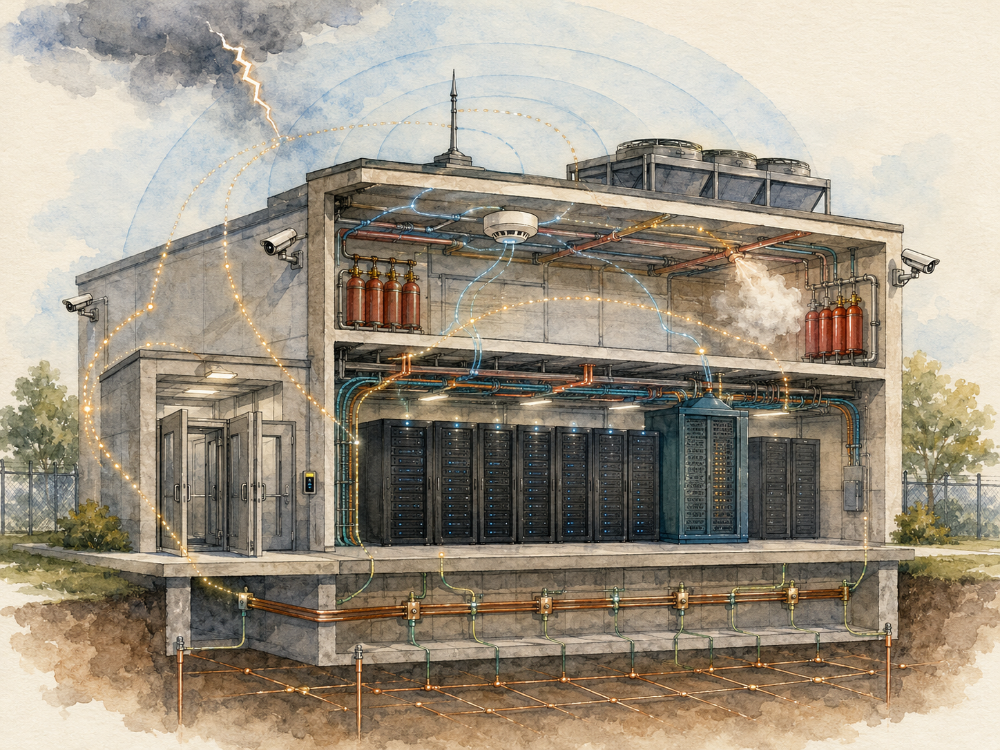
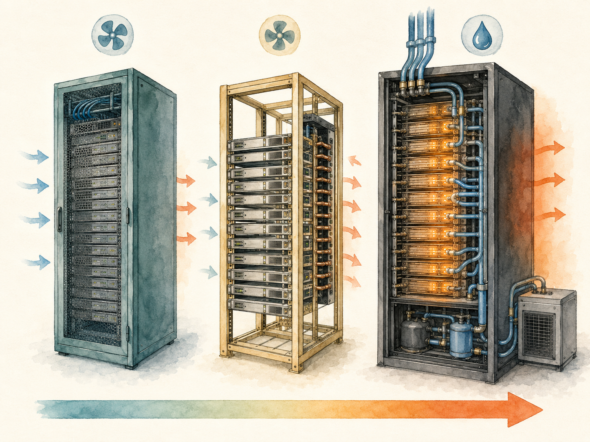

+++
date = '2026-06-18T00:00:00+00:00'
title = "【Data Center 101】The Smaller Subsystems: Fire, Cabinets, Cabling, Security, and Grounding"
slug = "data-center-101-10-other-subsystems"
aliases = ["/posts/data-center-101-other-subsystems/", "/posts/數據中心-101-其他子系統/"]
tags = ['Data Center', 'Data Center 101', 'Passport to AI Era', '中文']
thumbnail = 'pic.png'
+++

> Add up fire suppression, cabinets, structured cabling, physical security, and lightning/grounding — the five subsystems this article covers — and they account for **less than 15% of a data center's CAPEX**. They get almost none of the marketing attention given to UPS systems, chillers, or AI GPUs. And yet every one of them contains failure modes that can take down an entire facility in a way no UPS redundancy can rescue. A fire suppression chemical going off-market reshapes thousands of buildings. A grounding error melts a $500,000 transformer. A geopolitical decision in Washington restricts a camera brand that was specified into half the world's data centers.
>
> 把消防、機櫃、結構化佈線、實體安防、防雷接地加起來 —— 這篇文章涵蓋的五個子系統 —— 它們合計佔數據中心 CAPEX **不到 15%**。它們幾乎沒得到 UPS、冷水機、AI GPU 那種行銷關注。然而它們每一個都包含可以拖垮整座機房的故障模式，而且沒有 UPS 冗餘可以救回來。一個滅火化學品下市重塑數千棟建物。一個接地錯誤熔毀一台 50 萬美元的變壓器。華盛頓的一個地緣政治決策限制了一個被指定進全球一半數據中心的攝影機品牌。



---

## Why the "Small" Subsystems Deserve a Dedicated Article // 為什麼「小」子系統值得專文討論

The five subsystems in this article are small as a percentage of capital cost but disproportionate in their ability to cause catastrophic, uninsurable outcomes. Their economics, supply chains, and engineering trade-offs are also genuinely different from the headline systems — fire and security in particular have geopolitical dimensions that affect procurement choices in ways the chillers and UPS market does not.

這篇文章裡的五個子系統佔資本成本比例小，但它們造成災難性、不可保險後果的能力不成比例。它們的經濟學、供應鏈、工程權衡也跟頭條系統真的不同 —— 消防與安防特別有地緣政治面向，會以冷水機與 UPS 市場不會的方式影響採購選擇。

This article also marks a transition in the series. The previous articles covered systems where the engineering questions dominate. The next articles — construction process, prefabrication, regional regulation — move toward questions where business and policy increasingly dominate. The "small" subsystems sit on that boundary.

這篇文章也標示本系列的一個轉換。前面文章涵蓋工程問題主導的系統。後面文章 —— 建設流程、預製化、區域法規 —— 走向商業與政策越來越主導的問題。「小」子系統坐在那個邊界上。

---

## Part 1 — Fire Suppression and the 3M Novec Exit // 第一部分：消防與 3M Novec 退出

Modern data centers do not use water sprinklers as their primary fire-suppression mechanism. Water destroys IT equipment, creates electrocution risk for staff, and produces a secondary disaster that often costs more than the original fire. The standard approach is a **clean-agent gas system** — a chemical that smothers the fire without damaging equipment or harming people.

現代數據中心不用水霧噴淋當主要滅火機制。水毀掉 IT 設備、對員工有觸電風險、且產生通常比原本火災代價更高的次級災難。標準方法是**潔淨氣體系統** —— 一種能熄滅火災但不損壞設備或傷害人員的化學品。

For roughly two decades, the dominant chemical worldwide has been **3M Novec 1230**, technically known as **FK-5-1-12** (a fluoroketone). It has been installed in roughly half the world's data centers, plus telecom switching centers, museums, archive facilities, server rooms in banks and hospitals, and high-value industrial facilities.

過去約兩十年，全球主導的化學品一直是 **3M Novec 1230**，技術名稱 **FK-5-1-12**（氟酮）。它被安裝在全球約一半的數據中心，加上電信交換中心、博物館、檔案館、銀行與醫院的伺服器機房、以及高價值工業設施。

### The supply chain shock // 供應鏈衝擊

In December 2022, 3M announced it would exit production of all PFAS (per- and polyfluoroalkyl substances) compounds by the end of 2025. Novec 1230 falls within this exit. Production is being wound down.

2022 年 12 月，3M 宣布將在 2025 年底前退出所有 PFAS（per- and polyfluoroalkyl substances，全氟與多氟烷基物質）化合物生產。Novec 1230 在退出範圍內。產線正在收。

The reasons are part regulatory and part liability. The European Union's tightening PFAS regulations, the ongoing class-action litigation in the United States over PFAS contamination of water systems, and shareholder pressure on chemical manufacturers have made PFAS-adjacent product lines an increasing risk for 3M to retain. The decision to exit was strategic, not technical — Novec 1230 itself is one of the more environmentally benign agents in the class — but the market effect is the same.

原因部分是法規、部分是責任。歐盟收緊的 PFAS 法規、美國持續的 PFAS 水系統污染集體訴訟、以及股東對化學品製造商的壓力，讓 PFAS 相鄰產品線對 3M 變成越來越大的風險。退出決策是戰略性的，不是技術性的 —— Novec 1230 本身是這一類裡較環境友善的之一 —— 但市場效應一樣。

### The replacement options // 替代選項

| Replacement | Status // 狀態 |
|---|---|
| **FK-5-1-12 from non-3M suppliers** | Multiple chemical companies have announced continuation of the molecule. Supply will exist; pricing is unclear.<br>多家化學公司宣布繼續生產這個分子。供應會在；定價不明。 |
| **FM-200 (HFC-227ea)** | Older alternative with much higher Global Warming Potential. Faces Montreal Protocol pressure.<br>較舊的替代方案，GWP 高很多。面臨蒙特婁議定書壓力。 |
| **Inergen / IG-541** | Inert gas blend (N₂ + Ar + CO₂). Environmentally benign but requires larger storage volume.<br>惰性氣體混合（N₂ + Ar + CO₂）。環境友善但需要更大儲量。 |
| **Aerosol systems (e.g., Stat-X)** | Solid-particle suppression. Niche but growing.<br>固態粉末滅火。利基但成長中。 |

### The operational consequences // 運轉後果

The shock plays out at three time scales:

衝擊在三個時間尺度上展開：

- **Immediate** — Facilities specified with Novec 1230 are signing decade-long supply contracts to lock in the chemical they have. Pricing volatility is the dominant short-term risk.
- **立即** —— 已指定 Novec 1230 的機房正在簽十年期供應合約鎖住現有化學品。定價波動是主導性短期風險。
  
- **Medium term** — New builds in 2025 onward are increasingly evaluating Inergen or non-3M FK-5-1-12. Each carries different room-sizing implications.
- **中期** —— 2025 年起的新建越來越多在評估 Inergen 或非 3M 的 FK-5-1-12。每個有不同的房間規模意涵。
  
- **Long term** — A shift to Inergen would change building design: inert gas systems require larger storage rooms and more aggressive room sealing because the gas works by reducing oxygen concentration rather than chemically interrupting combustion.
- **長期** —— 轉向 Inergen 會改變建物設計：惰性氣體系統需要更大儲存空間、更積極的房間密封，因為氣體靠降低氧氣濃度而不是化學中斷燃燒來運作。


> **The 3M decision is one of the cleanest examples of a single corporate policy reshaping a global infrastructure supply chain. It is not unique — similar chemistry-driven shifts have happened with refrigerants (R22 phase-out) and with PFAS more broadly — but the speed and breadth of this one stand out.**
>
> **3M 的決策是「單一企業政策重塑全球基礎設施供應鏈」最乾淨的例子之一。它不獨特 —— 類似的化學品驅動轉變發生在冷媒（R22 淘汰）與更廣泛的 PFAS 上 —— 但這次的速度與廣度突出。**

---

## Part 2 — VESDA Early-Warning Detection // 第二部分：VESDA 極早期偵煙

Suppression chemistry is half of fire safety. The other half is detection — and standard ceiling-mounted smoke detectors are not nearly sensitive enough for the speed at which an IT equipment fire can develop.

滅火化學品是消防安全的一半。另一半是偵測 —— 而標準天花板式偵煙器對 IT 設備火災可能發展的速度遠遠不夠靈敏。

The industry gold standard is **VESDA — Very Early Smoke Detection Apparatus** — originally an Australian product (Xtralis), now part of Honeywell. Rather than passively waiting for smoke to reach a ceiling-mounted detector, VESDA **actively aspirates** air samples through a network of thin sampling tubes laid out across the room, returning the samples to a central laser-based detection chamber.

業界黃金標準是 **VESDA —— Very Early Smoke Detection Apparatus（極早期偵煙裝置）** —— 原本是澳洲產品（Xtralis），現在是 Honeywell 旗下。VESDA 不被動等煙到達天花板式偵測器，而是**主動抽取**空氣樣本，通過一個鋪設在房間各處的細採樣管網路，送回中央雷射偵測室。

The sensitivity advantage is dramatic:

靈敏度優勢戲劇性：

| Detection method | Smoke obscuration threshold // 煙阻光門檻 |
|---|---|
| Standard point smoke detector | ~3.5% obs/m |
| **VESDA aspirating detector** | **~0.005% obs/m** |

That is roughly **700× more sensitive**. The practical consequence is that VESDA can detect an overheating capacitor — before any visible smoke is produced, before any flame, before the equipment itself is damaged beyond repair — giving operators 5 to 30 minutes of warning before a point detector would even register.

那大約是 **700 倍敏感**。實務後果是 VESDA 可以在電容器過熱時就偵測到 —— 在任何可見煙產生之前、在任何火焰之前、在設備本身損壞到無法修復之前 —— 給運維人員 5 到 30 分鐘的警告，比點型偵測器先一步察覺。

For data center deployments, VESDA is typically combined with point smoke detectors and heat detectors as a defense-in-depth design. The VESDA catches the slowly developing event; the point detectors catch the fast event that grows past the VESDA's adaptive baseline.

對數據中心部署，VESDA 典型上跟點型偵煙器與熱偵測器結合做「縱深防禦」設計。VESDA 抓緩慢發展的事件；點型偵測器抓超過 VESDA 自適應基線的快速事件。

---

## Part 3 — Cabinet and Rack Standards // 第三部分：機櫃與機架標準

The most visible piece of physical infrastructure inside a data center is the cabinet — the vertical enclosure that houses servers, storage, and network equipment. There has been one dominant standard for thirty years, one challenger for the past decade, and one new paradigm that the AI buildout has forced into existence over the past two years.

數據中心裡最可見的實體基礎設施是機櫃 —— 容納伺服器、儲存、網路設備的垂直機殼。三十年來有一個主導標準，過去十年有一個挑戰者，過去兩年 AI 擴建強迫一個新範式存在。

### 19-inch EIA-310-D — the historical baseline // 19 吋 EIA-310-D —— 歷史基線

The 19-inch rack standard dates from the 1920s telephone industry. Modern data center equipment uses EIA-310-D, the formalized successor.

19 吋機架標準可追溯到 1920 年代電話業。現代數據中心設備用 EIA-310-D，正式化的繼承者。

| Specification | Value |
|---|---|
| Internal width // 內寬 | 19 inches (482.6 mm) |
| External width // 外寬 | 600 mm (typical) |
| Depth // 深度 | 600 / 800 / 1000 / 1100 / 1200 mm |
| Height unit // 高度單位 | 1U = 44.45 mm (1.75 inches) |
| Standard height // 標準高度 | 42U or 47U |
| Typical max load // 典型最大載重 | 800–1,500 kg |
| Equipment compatibility // 設備相容 | ~99% of traditional servers |

The 19-inch rack is the universal baseline. Any standard server, switch, or storage unit fits. The supply chain is mature, prices have been commoditized for decades, and any technician can work on one.

19 吋機架是通用基線。任何標準伺服器、交換機、儲存單元都能裝。供應鏈成熟、價格商品化幾十年、任何技師都能操作。

### OCP Open Rack v2 / v3 — the hyperscaler standard // OCP Open Rack v2 / v3 —— 超大規模標準

Around 2011, Facebook (now Meta) founded the **Open Compute Project (OCP)** to design servers and racks specifically for hyperscaler workloads, where standard 19-inch racks were no longer optimal.

約 2011 年，Facebook（現 Meta）創立 **Open Compute Project（OCP，開放運算計畫）**，專門為超大規模工作負載設計伺服器與機架，標準 19 吋機架在那裡不再最優。

| Specification | OCP Open Rack v2/v3 |
|---|---|
| Internal width // 內寬 | **21 inches** (wider — more board space, better cooling) |
| Depth // 深度 | 1,067 mm |
| Height unit // 高度單位 | **1 OU = 48 mm** (larger than 1U for better cooling) |
| Standard height // 標準高度 | 42 OU |
| Typical max load // 典型最大載重 | 1,400+ kg |
| Power delivery // 配電 | Centralized 48V DC via bus bar (eliminates per-server PSUs)<br>透過母線集中 48V DC（消除每台伺服器電源） |
| Cooling // 冷卻 | Rack-level designed (not per-server) |
| Redundancy // 冗餘 | No per-server redundant PSU (software-layer fault tolerance) |

The key design philosophy is **simplification at the server level by centralizing at the rack level**. Removing per-server power supplies, per-server fans, and per-server redundancy saves cost and improves efficiency at the scale where the rack is the unit of operation, not the server.

關鍵設計哲學是**透過在機架層級集中化，來在伺服器層級簡化**。移除每台伺服器的電源、每台伺服器的風扇、每台伺服器的冗餘，在「機架（不是伺服器）是運轉單位」的規模上省成本、改善效率。

Adopters: Meta (founding), Microsoft, Google (with variants), Alibaba, Tencent. Adoption stayed niche for years because the 19-inch ecosystem was so deep, but the AI workload has accelerated OCP adoption substantially since 2023.

採用者：Meta（創立）、Microsoft、Google（有變體）、阿里、騰訊。採用多年保持利基，因為 19 吋生態系太深，但 AI 工作負載從 2023 年起大幅加速 OCP 採用。

### NVIDIA NVL72 — the AI paradigm // NVIDIA NVL72 —— AI 範式

In 2024, NVIDIA introduced the **GB200 NVL72** — not just a server but an integrated rack-scale system containing **72 Blackwell GPUs** plus their associated CPUs, networking, and liquid cooling, all coordinated through high-bandwidth NVLink interconnect within the rack itself.

2024 年 NVIDIA 推出 **GB200 NVL72** —— 不只是伺服器，而是一個整合的機架級系統，包含 **72 顆 Blackwell GPU** 加相關 CPU、網路、與液冷，全部透過機架內的高頻寬 NVLink 互連協調。

| Specification | NVL72 |
|---|---|
| GPU count per rack // 每架 GPU 數 | **72** |
| Power per rack // 每架功率 | **~120 kW** |
| Cooling // 冷卻 | Liquid cooling mandatory (direct-to-chip)<br>液冷強制（直接接觸晶片） |
| Interconnect // 互連 | NVLink Switch in-rack fabric |
| Weight // 重量 | ~1,500 kg + GPUs |
| Floor loading requirement // 地板載重要求 | ~3× standard 19-inch rack<br>標準 19 吋機架的 3 倍 |

The NVL72 broke the cabinet design conversation in three ways at once: it forced liquid cooling into the mainstream, it required structural floor reinforcement in most existing facilities, and it embedded the network fabric inside the rack rather than between racks.

NVL72 一次在三個方向打破機櫃設計討論：它強迫液冷進入主流、它要求多數既有機房做結構性地板強化、它把網路 fabric 嵌入機架內而非機架之間。

> **The 30-year reign of the 19-inch rack as the universal data center building block is ending. Three standards will coexist for the next decade: 19-inch for traditional enterprise workloads, OCP for hyperscaler cloud workloads, and NVL72-style rack-scale systems for AI training clusters.**
>
> **19 吋機架作為通用數據中心建構塊統治 30 年的時代正在結束。未來十年三個標準會共存：19 吋給傳統企業工作負載、OCP 給超大規模雲端工作負載、NVL72 風格的機架級系統給 AI 訓練集群。**



---

## Part 4 — Structured Cabling and the 400G/800G Optical Surge // 第四部分:結構化佈線與 400G/800G 光模組暴增

Cabling is the connective tissue of a data center. It is also one of the most punishing systems to design wrong — once installed, replacing cabling is among the most expensive and disruptive changes a facility can undergo.

佈線是數據中心的結締組織。它也是設計錯了最折磨人的系統之一 —— 一旦安裝，更換佈線是機房能進行的最昂貴、最破壞性的變更之一。

### The two parallel cable systems // 兩條平行的纜線系統

```
Power cabling:
- Heavy copper feeders from switchgear to PDU/rPDU
- Mid-size cabling from PDU to cabinets

Data cabling:
- Fiber between servers and switches, between switches, and to external networks
- Copper (Cat6A / Cat7) for short-distance and edge connections
- Structured cable trays organizing both, kept physically separated
```

The dominant standard is **TIA-942-B**, which prescribes both the cable types and the physical separation requirements between power and data cabling to prevent electromagnetic interference.

主導標準是 **TIA-942-B**，它規定了纜線類型，以及電力與資料佈線之間防止電磁干擾所需的物理分離要求。

### Fiber vs copper trends // 光纖 vs 銅纜趨勢

| Dimension | Fiber 光纖 | Copper Cat6A/Cat7 銅纜 |
|---|---|---|
| Speed | 10G / 25G / 100G / 400G / 800G | 10G / 25G (max 40G) |
| Distance // 距離 | km-scale<br>公里級 | < 100 m |
| Cost | Medium-high (including optical transceivers) | Medium |
| Volume // 體積 | Thin, light | Thick, heavy |
| EMI immunity // 抗干擾 | Strong | Medium |
| Mainstream use // 主流用途 | Server↔Switch, Switch↔Switch | Inside cabinet, edge connections |

In modern data centers, fiber has displaced copper for nearly all backbone connections. Copper survives in short intra-cabinet runs and for low-bandwidth edge connections.

在現代數據中心，光纖已經取代銅纜在幾乎所有骨幹連接。銅纜在短距離櫃內走線與低頻寬邊緣連接上倖存。

### The 400G / 800G surge // 400G / 800G 暴增

AI training clusters need extraordinary east-west bandwidth between GPU servers. A single NVIDIA DGX or NVL72 rack can saturate hundreds of 400G fiber links to its neighbors. This has driven the optical transceiver market into a multi-year capacity-constrained surge.

AI 訓練集群需要 GPU 伺服器間極大的東西向頻寬。單一 NVIDIA DGX 或 NVL72 機架可以飽和上百條 400G 光纖到鄰居機架。這把光模組市場推進多年的產能受限暴增。

| Speed | Module form factor // 模組封裝 | Distance // 距離 | Use // 用途 |
|---|---|---|---|
| 10G | SFP+ | Short to long | Standard server connections |
| 25G | SFP28 | Short to medium | Mid-tier cloud servers |
| 100G | QSFP28 | Short to medium | Spine-leaf mainstream |
| **400G** | QSFP-DD / OSFP | Short to medium | **AI cluster standard** |
| 800G | OSFP-XD | Short | Next-gen GPU clusters |
| 1.6T | OSFP-XD | Short | Emerging |

The optical transceiver supply chain is heavily concentrated:

光模組供應鏈高度集中：

- **Coherent (II-VI / Finisar)** — USA
- **Lumentum** — USA
- **Source Photonics** — USA
- **Innolight** — China (now largest by volume)
- **Hisense Broadband** — China
- **Eoptolink** — China
- **聯亞 LandMark, 上詮 Browave, 光環 (Hon Hai-owned), AOI** — Taiwan

Lead times for 400G and 800G modules have stretched to **6–12 months** with capacity favoring hyperscaler customers. This has become one of the dozen or so supply-chain bottlenecks shaping AI cluster build timelines, alongside HBM memory and high-voltage transformers.

400G 與 800G 模組的交期拉到 **6–12 個月**，產能傾向 hyperscaler 客戶。這已經成為塑造 AI 集群建構時程的十幾個供應鏈瓶頸之一，跟 HBM 記憶體與高壓變壓器並列。

### Cable trays and physical management // 線槽與實體管理

The unglamorous side of cabling: the cable trays, conduits, and labeling that organize tens of thousands of cables across a facility.

佈線不華麗的一面：組織機房裡數萬條纜線的線槽、管道、與標籤。

A handful of design principles that consistently separate good installations from problematic ones:

幾個一致地把好的安裝跟有問題的安裝分開的設計原則：

- **Power and data trays run separately**, ideally with at least 300 mm physical separation, to minimize EMI coupling.
- **電力與資料線槽分開走**，理想上至少 300 mm 物理分隔，以最小化 EMI 耦合。
  
- **Overhead and underfloor runs as parallel systems**, so one can be maintained while the other carries the active load.
- **頂部與地板下走線作為平行系統**，這樣一個可以保養時另一個承載作用負載。
  
- **Strict labeling**, with labels at both ends and every 5 meters in between.
- **嚴格標籤**，兩端與中間每 5 公尺都有標籤。
  
- **30% spare capacity reserved** for future expansion. Adding capacity to a fully filled tray is dramatically more expensive than designing the headroom in originally.
- **預留 30% 餘量**給未來擴充。在已滿的線槽加容量比一開始就設計餘量戲劇性地貴。


---

## Part 5 — Physical Security: Access, Cameras, Mantraps // 第五部分：實體安防 —— 門禁、攝影機、反尾隨

Data center physical security has three layers, each catching what the previous one missed.

數據中心實體安防有三層，每層接住前一層漏掉的。

```
Perimeter — fencing, exterior CCTV, intrusion detection
       ↓
Building — lobby, visitor management, zone access control
       ↓
Equipment room — room access control, cabinet locks, mantraps, internal CCTV
```

### Access control technology evolution // 門禁技術演化

```
1990s — Mechanical keys
2000s — Magnetic stripe / IC card / RFID
2010s — Fingerprint / iris recognition
2020s — Facial recognition with liveness detection
Future — Multi-modal + AI behavior analytics
```

Modern high-security data centers run a combination — typically a card or PIN as the first factor, biometric (fingerprint or facial recognition) as the second, with the most sensitive areas (Tier IV cores, financial data halls) adding a third factor or requiring two-person rule entry.

現代高安全數據中心跑組合 —— 典型上卡或 PIN 作第一因子、生物識別（指紋或人臉辨識）作第二因子，最敏感區域（Tier IV 核心、金融資料機房）加第三因子或要求雙人原則進入。

### Facial recognition: speed and accuracy expectations // 人臉辨識：速度與準確度期待

For data center deployments, the modern expectation is:

對數據中心部署，現代期待是：

- **Recognition time < 1 second**
- **辨識時間 < 1 秒**
  
- **Recognition distance up to ~3 meters**
- **辨識距離可達約 3 公尺**
  
- **Accuracy > 99.6%**
- **準確度 > 99.6%**
  
- **Liveness detection** required (cannot be fooled by a photo or video)
- **活體偵測**必須（不能被照片或影片騙過）
  
- **Audit trail** — historical facial-recognition photos retained for traceability
- **稽核軌跡** —— 歷史人臉辨識照片保留供追溯


### Mantraps — the anti-tailgating defense // Mantrap —— 反尾隨防禦

A **mantrap** is a small vestibule between two doors that interlock — when one door is open, the other cannot be. Standard mantrap behavior allows **only one person at a time** to enter, often combined with a floor weight sensor to confirm a single occupant.

**Mantrap（反尾隨閘門）** 是兩道連鎖的門之間的小空間 —— 當一道門開著，另一道不能開。標準 mantrap 行為**一次只允許一人**進入，常結合地板重量感測器確認單一佔用者。

The purpose is to defeat **tailgating** — the social engineering technique where an unauthorized person follows an authorized one through a single-door entry. Tailgating is the single most common physical breach vector for data centers, and a mantrap is the only physical control that reliably defeats it.

目的是擊敗**尾隨** —— 一個未授權人跟著一個授權人通過單門入口的社交工程技術。尾隨是數據中心最常見的單一實體入侵向量，而 mantrap 是唯一可靠擊敗它的實體控制。

High-security facilities (financial, government core) typically require mantraps at every transition between zones. Lower-tier facilities often skip them at perimeter doors and rely on social vigilance — a known weak spot.

高安全機房（金融、政府核心）典型上要求每個區域過渡都有 mantrap。較低 Tier 機房通常在周界門跳過它們、依賴社交警覺 —— 一個已知弱點。

---

## Part 6 — Hikvision, Dahua, and the Geopolitical Layer // 第六部分：Hikvision、Dahua 與地緣政治層

The IP camera and Video Management System (VMS) supply chain has, since 2019, become one of the clearest examples of how geopolitical decisions reshape data center procurement.

IP 攝影機與 Video Management System（VMS）供應鏈從 2019 年起，變成「地緣政治決策重塑數據中心採購」最清楚的例子之一。

### The vendor landscape // 廠商版圖

| Category | Vendor | HQ |
|---|---|---|
| **Western IP cameras** | **Axis Communications** | Sweden |
| | Bosch | Germany |
| | Hanwha Vision (formerly Samsung) | Korea |
| **Chinese IP cameras** | **Hikvision 海康威視** | China |
| | **Dahua Technology 大華** | China |
| **Video Management Systems (VMS)** | Genetec | Canada |
| | Milestone | Denmark |
| | Avigilon (Motorola Solutions) | USA |

Hikvision and Dahua, prior to 2019, had become two of the largest IP camera manufacturers globally — by some estimates accounting for roughly **40% of all IP cameras sold worldwide**. Their products were specified into countless data centers, government buildings, schools, retail chains, and airports.

Hikvision 與 Dahua 在 2019 年前已經變成全球最大的 IP 攝影機製造商兩家 —— 某些估計佔全球賣出的所有 IP 攝影機約 **40%**。它們的產品被指定進無數的數據中心、政府建物、學校、零售連鎖、機場。

### The 2019 NDAA Section 889 // 2019 NDAA 第 889 節

The **2019 National Defense Authorization Act**, Section 889, prohibited US federal agencies from procuring or using equipment manufactured by Hikvision, Dahua, Huawei, ZTE, and Hytera. The prohibition extended to federal contractors after a transition period.

**2019 國防授權法案**第 889 節禁止美國聯邦機構採購或使用 Hikvision、Dahua、Huawei、ZTE、Hytera 製造的設備。禁令在過渡期後延伸到聯邦承包商。

The European Union has since taken a similar but less unified stance — public-sector use of Chinese-origin surveillance equipment is restricted or banned in the UK, the Netherlands, Belgium, and parts of Germany, with EU-wide policy still evolving.

歐盟之後採取類似但較不統一的立場 —— 中國製監控設備在公部門使用在英國、荷蘭、比利時、德國部分地區被限制或禁止，歐盟層級政策仍在演進。

### The procurement implications for data centers // 對數據中心採購的意涵

- **US federal data centers** — Cannot use Hikvision or Dahua. Must specify Axis, Bosch, Hanwha, or similar Western brand.
- **美國聯邦數據中心** —— 不能用 Hikvision 或 Dahua。必須指定 Axis、Bosch、Hanwha 或類似西方品牌。
  
- **Federal contractor data centers** — Same restriction extends through the supply chain.
- **聯邦承包商數據中心** —— 同樣限制延伸到供應鏈。
  
- **EU public-sector and critical-infrastructure** — Increasingly restricted; check local jurisdiction.
- **歐盟公部門與關鍵基礎設施** —— 越來越受限；查當地司法管轄區。
  
- **Taiwan financial and government** — Self-imposed restrictions broadly mirror US position, though not codified into single legislation.
- **台灣金融與政府** —— 自我設限大致對齊美國立場，雖未編入單一立法。
  
- **Australian government facilities** — Removed Chinese-origin surveillance equipment from government sites following 2023 audit.
- **澳洲政府設施** —— 2023 年稽核後從政府場址移除中國製監控設備。
  
- **Commercial colocation in most markets** — Choice remains open, but increasingly customers (especially multinationals) require disclosure of camera vendor.
- **多數市場的商業 Colocation** —— 選擇仍開放，但客戶（特別是跨國）越來越要求揭露攝影機供應商。


> **The camera vendor decision is now a geopolitical decision. Procurement teams that did not have to think about it before 2019 now have to think about it explicitly — and the consequences of getting it wrong can include disqualification from US federal contracts for the entire colocation provider.**
>
> **攝影機廠商決策現在是地緣政治決策。2019 年前不需要想這個的採購團隊現在必須明確思考它 —— 而搞錯的後果可以包括整個 Colocation 業者被取消美國聯邦合約資格。**

---

## Part 7 — Lightning Protection and Grounding // 第七部分：防雷與接地

Uptime Institute incident statistics consistently show that **roughly 33% of data center faults trace to electrical-side causes**, including grounding inadequacy and lightning damage. This is a high number relative to how little procurement attention these subsystems receive — lightning protection and grounding together typically account for **less than 1% of CAPEX** but a meaningful share of unplanned failures.

Uptime Institute 事件統計持續顯示**約 33% 的數據中心故障可追溯到電氣側原因**，包括接地不足與雷擊損壞。相對於這些子系統收到的少量採購注意，這是個高數字 —— 防雷與接地合計典型佔 **CAPEX 不到 1%**，但佔有意義份額的非計畫性故障。

### The IEC 62305 lightning protection zone model // IEC 62305 雷擊防護分區模型

The international framework for lightning protection is **IEC 62305**, which divides a facility's lightning exposure into four **Lightning Protection Zones (LPZ)**:

防雷的國際框架是 **IEC 62305**，它把機房的雷擊暴露分為四個**雷擊防護區（LPZ, Lightning Protection Zone）**：

| Zone | Definition // 定義 |
|---|---|
| **LPZ 0** | Outside, fully exposed — roof, exterior walls<br>外部、完全暴露 —— 屋頂、外牆 |
| **LPZ 1** | Inside after first-stage protection — entry point through roof-mounted air terminals and exterior wall SPDs<br>第一級保護後 —— 屋頂避雷針與外牆 SPD |
| **LPZ 2** | Inside after second-stage protection — switchgear and main electrical rooms<br>第二級保護後 —— 開關設備與主電氣室 |
| **LPZ 3** | Inside after third-stage protection — equipment rooms, cabinet level<br>第三級保護後 —— 機房、機櫃層級 |

At each zone boundary, a **Surge Protective Device (SPD)** reduces the remaining surge energy to a level safe for the next zone. The class of SPD required depends on the zone boundary it crosses.

在每個區域邊界，**SPD（Surge Protective Device，突波保護器）** 把剩餘突波能量降到下一個區域安全的等級。所需 SPD 的等級取決於它跨越的區域邊界。

### SPD class hierarchy // SPD 等級層級

| Class | Position // 位置 | Energy capacity // 能量容量 | Typical vendors // 典型廠商 |
|---|---|---|---|
| **Class I** | Main electrical entry (LPZ 0/1 boundary)<br>主電力入口 | 10/350 μs waveform, 25 kA+ | DEHN, Phoenix Contact |
| **Class II** | Distribution boards (LPZ 1/2 boundary)<br>配電盤 | 8/20 μs waveform, 20 kA+ | Schneider, ABB |
| **Class III** | Equipment rooms (LPZ 2/3 boundary)<br>機房 | 1.2/50 μs waveform, < 10 kA | Citel, Schneider |

The three classes are used **in series**, not as alternatives. Class I at the building entry, Class II at the distribution board, Class III at the equipment. Each stage reduces the energy further; relying on any single stage produces inadequate protection.

三個等級**串聯使用**，不是替代。Class I 在建物入口、Class II 在配電盤、Class III 在設備。每階段進一步降低能量；依賴單一階段產生不足的保護。

### Grounding systems // 接地系統

A data center requires four conceptually distinct grounding systems that, in modern practice, are bonded together rather than kept separate:

數據中心需要四個概念上不同的接地系統，現代實務上把它們綁定在一起而不是分開保持：

| System | Purpose // 目的 | Resistance target // 電阻目標 |
|---|---|---|
| **Protective Earth (PE)** | Electrical shock protection<br>電擊保護 | < 4 Ω |
| **Functional / working earth** | System reference (e.g., neutral point)<br>系統參考（如中性點） | < 4 Ω |
| **DC earth** | Communications equipment ground<br>通訊設備接地 | < 1 Ω |
| **Lightning earth** | Lightning current discharge<br>雷擊電流洩放 | < 10 Ω |

The integrating principle is **equipotential bonding** — connecting all of these systems together at a single bonding point. The reasoning is direct: if any two grounding systems are at different electrical potentials, currents will flow between them along whatever paths happen to be available, including signal cables and computer chassis. The damage from these "ground loop" currents can be subtle and pervasive: corrupted data, false alarms, gradually degraded equipment, eventual outright failures.

整合原則是**等電位聯結** —— 把這些系統在單一聯結點全部連在一起。理由很直接：如果任何兩個接地系統處在不同電位，電流會沿著任何可用路徑在它們之間流動，包括訊號線與電腦機殼。這些「接地迴路」電流造成的損害可以微妙而普遍：資料損壞、誤報、設備逐漸衰退、最終徹底故障。

The authoritative reference for data center grounding design is **IEEE 1100 (the "Emerald Book")** — required reading for any serious electrical engineer working in the industry.

數據中心接地設計的權威參考是 **IEEE 1100（「綠寶書」）** —— 任何在這個產業工作的認真電氣工程師必讀。

### Common grounding mistakes // 常見接地錯誤

The mistakes that cause real-world incidents are not exotic — they are simple, predictable, and persistent across the industry:

造成現實事件的錯誤不是奇特的 —— 是簡單、可預測、整個產業持續存在的：

- **Grounding grid undersized** — Resistance too high; lightning currents elevate building potential and damage equipment.
- **接地網規模不足** —— 電阻太高；雷擊電流抬升建物電位、損壞設備。
  
- **Multiple grounding systems not bonded** — Potential differences create destructive ground loops.
- **多套接地系統未聯結** —— 電位差製造破壞性的接地迴路。
  
- **SPDs not staged in series** — Single-stage protection lets surge energy through to end equipment.
- **SPD 未串聯分階段** —— 單階段保護讓突波能量穿透到末端設備。
  
- **Cabinet grounding inconsistent** — Some cabinets bonded to the grounding bus, others left floating; static buildup and lightning damage.
- **機櫃接地不一致** —— 部分機櫃聯結到接地母線、其他懸浮；靜電累積與雷擊損害。
  
- **Lightning down-conductors broken** — A cable that has degraded over time leaves the lightning rod with no path to ground; the lightning finds another path, often through electrical service lines.
- **避雷引下線斷裂** —— 隨時間衰退的電纜讓避雷針沒有對地路徑；雷擊找另一條路，常常透過電力服務線。


> **Grounding is the cheapest insurance in the data center, and the most commonly underspecified. It accounts for less than 1% of capital cost but a meaningful fraction of unplanned failures. The cheap-but-critical pattern is consistent across every audit Uptime publishes.**
>
> **接地是數據中心最便宜的保險，也最常被規格不足。它佔資本成本不到 1%，卻佔有意義份額的非計畫性故障。便宜但關鍵的模式在 Uptime 發布的每一次稽核裡都一致。**

---

## Key Takeaways // 重點整理

#### 1. 3M is exiting Novec 1230 production by end of 2025 // 3M 在 2025 年底前退出 Novec 1230 生產

The dominant clean-agent fire suppression chemical for two decades is leaving the market. Existing facilities are signing long-term supply contracts; new builds are evaluating non-3M FK-5-1-12, Inergen, and aerosol alternatives. A single chemical company decision is reshaping the global data center fire suppression supply chain.

過去兩十年主導的潔淨氣體滅火化學品正在離開市場。既有機房簽長期供應合約；新建在評估非 3M 的 FK-5-1-12、Inergen、氣溶膠替代方案。一家化學公司的決策重塑全球數據中心消防供應鏈。

#### 2. VESDA aspirating detection is 700× more sensitive than point detectors // VESDA 抽氣式偵測比點型偵測器敏感 700 倍

The industry gold standard for early-warning fire detection. Provides 5 to 30 minutes of warning before a point detector would register — long enough for graceful workload migration or controlled shutdown.

業界早期警告消防偵測的黃金標準。在點型偵測器察覺前提供 5 到 30 分鐘警告 —— 久到可以做工作負載優雅遷移或受控關機。

#### 3. Three cabinet standards will coexist for the next decade // 未來十年三個機櫃標準會共存

19-inch EIA-310-D for traditional workloads, OCP Open Rack 21-inch for hyperscaler cloud, NVL72-style rack-scale for AI training. Liquid cooling moves from optional to mandatory at the top of this hierarchy.

19 吋 EIA-310-D 給傳統工作負載、OCP Open Rack 21 吋給超大規模雲端、NVL72 風格機架級給 AI 訓練。液冷在這個層級的頂端從選配變成強制。

#### 4. Fiber has displaced copper for backbone connections // 光纖已取代銅纜在骨幹連接

Copper survives in short intra-cabinet runs and edge connections. 400G and 800G optical transceivers are now in supply-chain bottleneck status, with 6–12 month lead times allocated by hyperscaler priority.

銅纜在短距離櫃內走線與邊緣連接上倖存。400G 與 800G 光模組現在處於供應鏈瓶頸狀態，6–12 個月交期按 hyperscaler 優先級分配。

#### 5. Mantraps are the only reliable defeat for tailgating // Mantrap 是擊敗尾隨唯一可靠的方式

Tailgating is the single most common physical breach vector. Mantraps are required in high-security facilities and recommended everywhere — the social engineering vulnerability of single-door entries cannot be reliably trained away.

尾隨是最常見的單一實體入侵向量。Mantrap 在高安全機房必須、其他地方建議 —— 單門入口的社交工程脆弱性無法靠訓練可靠地消除。

#### 6. The Hikvision/Dahua restrictions have made camera vendor a geopolitical decision // Hikvision/Dahua 限制把攝影機廠商變成地緣政治決策

US 2019 NDAA Section 889 banned federal procurement. EU and allied jurisdictions have followed in various ways. Procurement teams now have to consider end-customer compliance requirements when specifying cameras — a decision that did not exist for most operators before 2019.

美國 2019 NDAA 第 889 節禁止聯邦採購。歐盟與盟友司法管轄區以各種方式跟進。採購團隊現在指定攝影機時必須考慮最終客戶的合規要求 —— 多數營運者 2019 年前不存在的決策。

#### 7. SPD must be staged in three classes // SPD 必須分三級串聯

Class I at building entry, Class II at distribution, Class III at equipment. Used in series, not as alternatives. Single-stage protection lets surge energy through to end equipment.

Class I 在建物入口、Class II 在配電、Class III 在設備。串聯使用、不是替代。單階段保護讓突波能量穿透到末端設備。

#### 8. Equipotential bonding is the single most important grounding principle // 等電位聯結是接地最重要的單一原則

All grounding systems — protective earth, working earth, DC earth, lightning earth — bonded together at a single point. The alternative (separate systems at different potentials) creates ground loops that damage equipment subtly and pervasively.

所有接地系統 —— 保護接地、工作接地、DC 接地、雷擊接地 —— 在單一點聯結。替代方案（在不同電位的分開系統）製造接地迴路，微妙而普遍地損害設備。

#### 9. The small subsystems sit on the boundary of engineering and policy // 小子系統坐在工程與政策的邊界

Fire suppression chemistry is regulated. Surveillance equipment is geopolitically constrained. Lightning protection is governed by international standards. The technical decisions for these subsystems increasingly require legal, regulatory, and geopolitical input alongside the engineering analysis.

消防化學品被監管。監控設備被地緣政治約束。防雷被國際標準治理。這些子系統的技術決策越來越需要法律、法規、地緣政治輸入跟工程分析並列。

---

## What's Next // 下一篇預告

The eleventh article in this series turns from the systems inside a data center to the **process of building one** — the 27-month industry-standard construction timeline, the 9 site-selection principles plus a 10th that practitioners always add, the 3 contracting models (EPC, Design+GC, Design+Devices+PM), the long-lead items that now drive scheduling, and the 5-step Commissioning sequence (FAT → SAT → PFT → FPT → IST) that ends with the dramatic "Pulling the Plug" test. The article will also introduce a working **site-selection scoring framework** — 10 weighted criteria covering power, climate, water, network, land, design adaptability, disaster resilience, policy, talent, and community impact — that operators and partners can use as a starting template for evaluating any new site.

本系列第 11 篇從數據中心內部系統轉到**建造它的流程** —— 27 個月的業界標準建設時程、9 個選址原則加上實務工作者總會加的第 10 個、3 種合約模式（EPC、Design+GC、Design+Devices+PM）、現在主導排程的長交期件、以及以戲劇性「Pulling the Plug」測試結束的 5 步 Commissioning 序列（FAT → SAT → PFT → FPT → IST）。文章還會引入一個可用的**選址評分框架** —— 10 個加權準則涵蓋電力、氣候、水、網路、土地、設計適應性、災害韌性、政策、人才、社區衝擊 —— 營運者與合作夥伴可以當任何新場址評估的起始模板。
