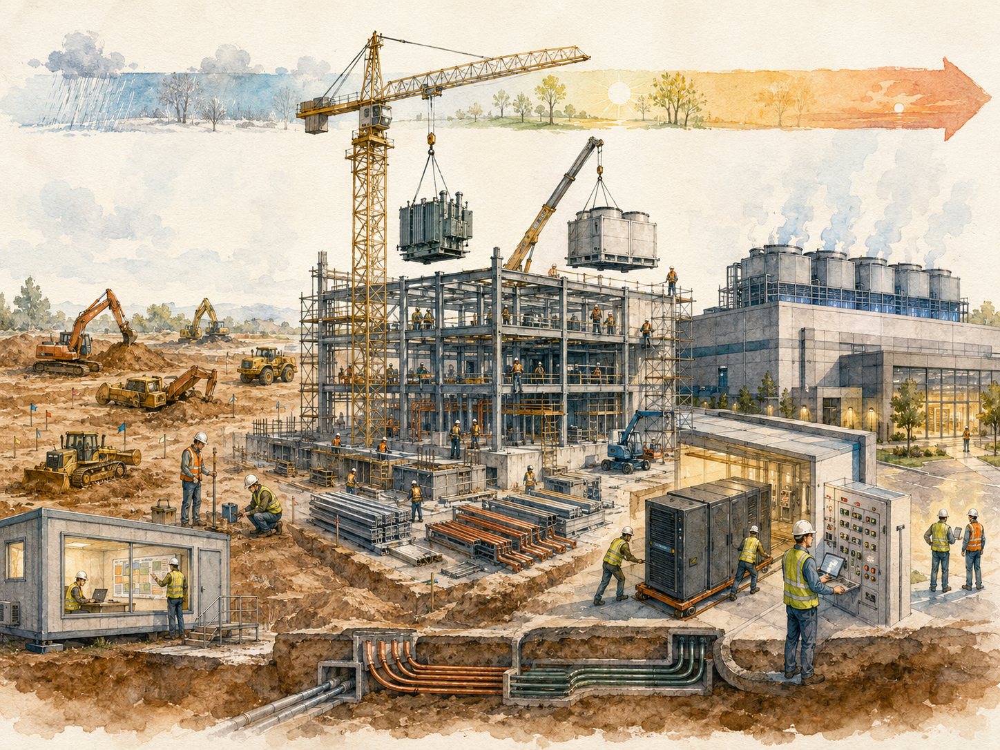
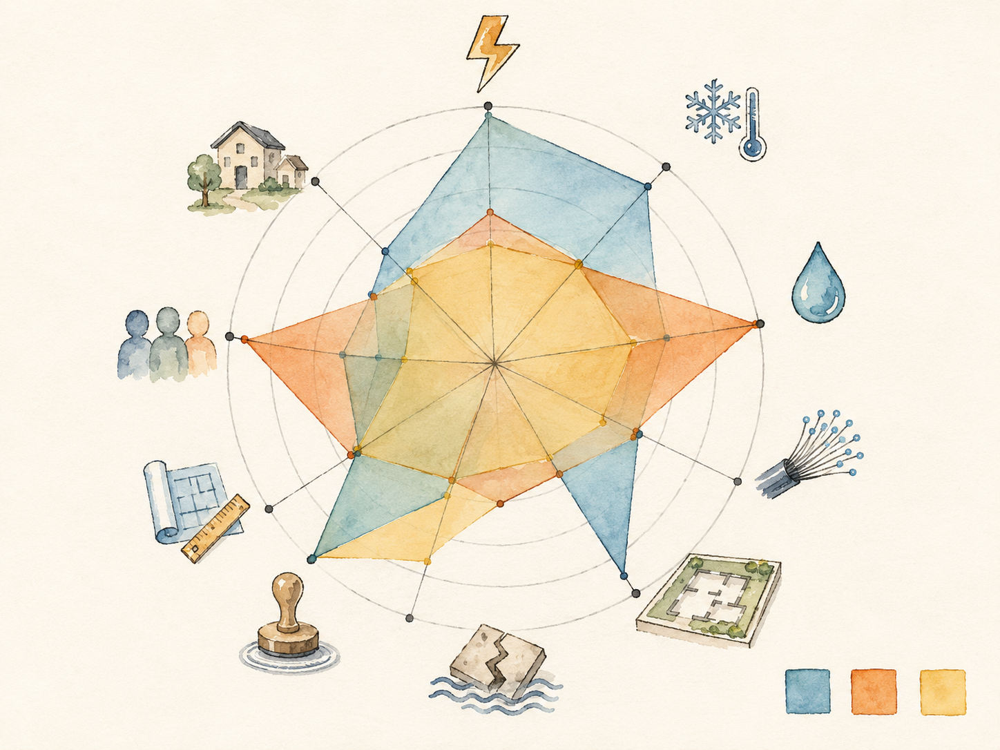

+++
date = '2026-06-18T00:05:00+00:00'
title = "【Data Center 101】Building a Data Center: The 27-Month Process, Site Selection Scoring, and the Five-Step Commissioning"
slug = "data-center-101-11-construction-commissioning"
aliases = ["/posts/data-center-101-construction-commissioning/", "/posts/數據中心-101-建設與調試/"]
tags = ['Data Center', 'Data Center 101', 'Passport to AI Era', '中文']
thumbnail = 'pic.png'
+++

> A typical data center takes **957 days** to build, end-to-end, from breaking ground to first IT load. The AI infrastructure cycle has compressed equipment refresh times to **18 months**. Construction time is now longer than the useful life of the hardware the building was originally specified to hold. The arithmetic does not work — and the industry's response has reshaped every phase of how data centers get built, from site selection to commissioning to handover.
>
> 一座典型數據中心從動土到第一個 IT 負載上線，全程要 **957 天**。AI 基礎設施週期把設備汰換時間壓縮到 **18 個月**。建設時間現在比建物原本規劃要承載的硬體有用壽命還長。算術不通 —— 而業界的回應重塑了數據中心如何被蓋的每一個階段，從選址到調試到交接。



---

## Why Construction Is Now the Bottleneck // 為什麼建設現在是瓶頸

For most of the data center industry's history, the bottleneck was equipment. Servers were expensive, hard to procure, and the dominant constraint on what an operator could build. That balance flipped sometime around 2020.

數據中心產業多數歷史中，瓶頸是設備。伺服器很貴、難採購，是營運者能蓋什麼的主導性限制。這個平衡大約 2020 年翻轉。

Today the binding constraints sit upstream of the building: grid capacity that takes 3 to 7 years to expand, high-voltage transformers with 5-year lead times, civil construction that takes 14 months and cannot be meaningfully shortened by writing a bigger cheque. The equipment inside the building — the servers, the GPUs, the cooling units — can mostly be obtained within 12 months once the procurement decision is made. The building itself often cannot.

今天的綁定約束坐在建物上游：擴張要 3 到 7 年的電網容量、5 年交期的高壓變壓器、需要 14 個月且無法靠多開支票顯著縮短的土建。建物內部的設備 —— 伺服器、GPU、冷卻單元 —— 一旦做出採購決策，多數可在 12 個月內取得。建物本身常常不行。

This article walks through how a data center actually gets built in this environment: the four-phase lifecycle, the three contracting models, the site-selection scoring framework that partners use to evaluate candidate locations, and the five-step Commissioning sequence that ends with the dramatic "Pulling the Plug" test before any IT load goes live.

這篇文章走過數據中心在這個環境下實際怎麼被蓋出來：四階段生命週期、三種合約模式、合作夥伴用來評估候選地點的選址評分框架、以及在任何 IT 負載上線前以戲劇性「Pulling the Plug」測試結束的五步 Commissioning 序列。

---

## Part 1 — The Four-Phase Lifecycle // 第一部分：四階段生命週期

Every data center build progresses through four phases. The phases are sequential at the highest level but increasingly run in parallel underneath, especially for prefabricated designs.

每個數據中心建設經過四個階段。階段在最高層級上是順序的，但底下越來越多平行進行，特別是預製化設計。

| Phase | Typical duration // 典型時程 | Main activities // 主要動作 |
|---|---|---|
| **1. Planning 規劃** | ~3 months | Site selection, TCO modeling, ROI calculation, Tier-level decision<br>選址、TCO 建模、ROI 計算、Tier 等級決策 |
| **2. Design 設計** | ~6 months | PUE design, Tier design, power density, CFD simulation, drawing production<br>PUE 設計、Tier 設計、功率密度、CFD 模擬、圖紙產出 |
| **3. Construction 建設** | ~18 months | Civil work, MEP installation, equipment deployment, commissioning<br>土建、機電安裝、設備部署、調試 |
| **4. Operation 運營** | 10–15 years | Monitoring, inspection, predictive maintenance, fault response<br>監控、巡檢、預測性維護、故障處理 |

The first three phases sum to about 27 months as the ideal industry baseline. Actual builds in mainstream markets routinely run 30–36 months, with extreme cases stretching beyond three years. The most-cited real-world example — a 6,000-cabinet facility in Jiangsu, China — took **957 days**, almost 32 months.

前三個階段加起來理想業界基線約 27 個月。主流市場的實際建設常常跑 30–36 個月，極端案例超過三年。最常被引用的真實案例 —— 中國江蘇一座 6,000 機櫃機房 —— 花了 **957 天**，將近 32 個月。

---

## Part 2 — Where the 957 Days Go // 第二部分：957 天花到哪去

The Jiangsu breakdown is instructive because it shows, in concrete days, which steps actually dominate the timeline.

江蘇的拆解很有啟發性，因為它用具體天數顯示哪些步驟實際主導時程。

| Step | Days | % of total |
|---|---|---|
| Site survey 場勘 | 7 | 0.7% |
| Civil work design 土建設計 | 120 | 12.5% |
| Design bidding 設計招標 | 90 | 9.4% |
| **Civil work construction 土建施工** | **420** | **43.9%** ⭐ |
| Equipment installation 設備安裝 | 180 | 18.8% |
| Commissioning 調試 | 90 | 9.4% |
| Trial run 試運轉 | 20 | 2.1% |
| Rectification 整改 | 30 | 3.1% |
| **Total 合計** | **957** | **100%** |

Two observations stand out:

兩個觀察突出：

- **Civil construction alone consumes 14 months — nearly half the entire timeline.** No equipment can be installed until the building structure, slabs, and MEP rough-ins are ready. This is the single largest target for any time-compression strategy.
- **Pure design activities (site survey + design + design bidding) total 217 days — over seven months.** Much of this is sequential information-gathering and approvals; modern parallel workflows can compress it meaningfully without changing the fundamental engineering work.

---

- **光是土建施工就吃掉 14 個月 —— 將近整個時程一半。** 在建物結構、樓板、MEP 粗作準備好之前，任何設備都不能安裝。這是任何時間壓縮策略的最大單一目標。
- **純設計活動（場勘 + 設計 + 設計招標）合計 217 天 —— 超過 7 個月。** 這多數是順序性的資訊收集與簽核；現代並行工作流可以顯著壓縮而不改變基本工程工作。

> **The compression opportunity is structural, not in working faster on any single step. The 14-month civil construction is what prefabricated modular data centers (PMDCs) are designed to attack — by manufacturing modules in a factory while site work is still in progress, the sequential dependency between civil and equipment can be broken. A later article in this series covers PMDC in depth.**
>
> **壓縮機會是結構性的，不在任何單一步驟跑更快。14 個月的土建施工正是預製化模組化數據中心（PMDC）設計來攻擊的點 —— 透過在工廠製造模組，同時工地施工進行中，土建與設備之間的順序相依可以被打破。本系列後面的文章深入講 PMDC。**

---

## Part 3 — The Three Contracting Models // 第三部分：三種合約模式

The owner of a new data center chooses one of three contracting structures. The choice determines who holds the technical risk, who controls equipment selection, and where the margin sits.

新數據中心的業主選擇三種合約結構之一。選擇決定誰持有技術風險、誰控制設備選擇、利潤落在哪。

| Model | Coverage // 涵蓋範圍 | Typical owner // 典型業主 |
|---|---|---|
| **EPC General Contracting 總包** | Design + procurement + construction in one contract<br>設計 + 採購 + 施工在一個合約 | Governments, SMEs without DC expertise<br>政府、無 DC 專業的中小企業 |
| **Design + GC 設計+總包** | Design tendered separately; construction tendered separately<br>設計獨立招標；建設獨立招標 | Mid-to-large enterprises with some technical capacity<br>有一定技術能力的中大型企業 |
| **Design + Devices + PM 設計+設備+項目管理** | Owner tenders devices directly and manages integration<br>業主直接招標設備並管理整合 | Hyperscale colocation operators, cloud providers<br>超大規模 Colocation、雲服務商 |

### EPC — the turnkey path // EPC —— 交鑰匙路徑

The owner issues one specification document; one general contractor takes responsibility for design, equipment procurement, and construction. The owner receives a turnkey facility at the end and pays a single fixed-price contract.

業主發出一份規格書；一個總承包商負責設計、設備採購、與施工。業主最後收到一座交鑰匙設施，支付單一固定價格合約。

The advantages are simplicity, single accountability, and low management overhead for the owner. The disadvantages are higher cost (the EPC firm builds in margin for its risk exposure), reduced control over equipment selection (the EPC chooses what is cheapest for them, not what is optimal for 10-year TCO), and limited flexibility once the contract is signed.

優勢是簡單、單一問責、業主低管理負擔。劣勢是較高成本（EPC 公司為風險曝險建入毛利）、對設備選擇控制減少（EPC 選對它們最便宜的，不是對 10 年 TCO 最優的）、合約簽訂後彈性有限。

### Design + GC — the balanced path // Design + GC —— 平衡路徑

The owner first contracts a design firm or consultant to produce the technical specification. The completed design is then tendered separately to a general contractor for construction. The owner manages the boundary between the two contracts.

業主先簽設計公司或顧問來產出技術規格。完成的設計再獨立招標給總承包商施工。業主管理兩個合約之間的邊界。

This is the most common model for mid-to-large enterprise builds. It produces a design that genuinely serves the owner's long-term interests (the designer's incentive is owner satisfaction, not contractor margin), and it allows competitive bidding on construction against a clear specification.

這是中大型企業建設最常見的模式。它產出真正服務業主長期利益的設計（設計師的激勵是業主滿意，不是承包商毛利），且允許依據清楚規格做有競爭力的施工投標。

### Design + Devices + PM — the hyperscaler path // Design + Devices + PM —— 超大規模路徑

The owner contracts the designer, separately tenders the major equipment categories (UPS, chillers, gensets) directly to manufacturers, and contracts a general contractor only for the construction labor and small-equipment integration. The owner manages all three boundaries.

業主簽設計師、把主要設備類別（UPS、冷水機、發電機）直接獨立招標給製造商、只為施工人力與小設備整合簽總承包商。業主管理所有三個邊界。

This model requires substantial in-house technical and project-management capacity, but it produces the lowest TCO at scale. A 10,000-cabinet hyperscale order is large enough to negotiate directly with manufacturers, bypassing the layer of margin that a general contractor would add to the equipment line items.

這個模式需要相當的內部技術與項目管理能力，但它在規模上產出最低 TCO。10,000 機櫃的超大規模訂單夠大可以直接跟製造商議價，跳過總承包商在設備項目上加的那層毛利。

> **The pattern: the more capable the owner, the more procurement they pull in-house. Smaller owners gladly trade margin for simplicity. Hyperscalers swap simplicity for the cost savings of direct equipment negotiation.**
>
> **規律：業主能力越強，越多採購拉回內部。較小業主樂於用毛利換簡單。超大規模業者用簡單換直接設備談判的成本節省。**

---

## Part 4 — The Long-Lead-Item Crisis // 第四部分：長交期件危機

The supply chain article in this series detailed how lead times across the data center supply chain have stretched since 2020. The compressed version for the construction-management perspective:

本系列的供應鏈文章詳述了數據中心供應鏈交期自 2020 年起如何拉長。從建設管理視角的壓縮版本：

| Item | Pre-2020 lead time | 2025–2026 lead time |
|---|---|---|
| **Grid connection (100 MW)** | 18 months | **3–7 years** |
| **High-voltage transformer** | 12 months | **3–5 years** |
| Diesel genset (1–2 MW) | 4 months | 6–12 months |
| Large UPS (500 kVA+) | 3 months | 4–9 months |
| Chiller (large) | 4 months | 6–12 months |
| Lithium-ion battery cells | 3 months | 6–12 months |
| **NVIDIA H100 GPU** | n/a | 6–18 months |
| **400G/800G optical transceiver** | n/a | 6–12 months |
| CDU (liquid cooling) | n/a — niche | 6–12 months |

The traditional procurement playbook — wait until design is final, then issue purchase orders — has stopped working. The replacement playbook has four elements:

傳統採購手冊 —— 等設計定稿再下訂 —— 已經停止運作。替代手冊有四個要素：

- **Reserve before design.** Slot reservations for transformers, GPU allocations, and grid connections are made years before the final site plan is signed off.
- **Multi-source by default.** Single-source contracts have largely been replaced by frame agreements with two or three suppliers per critical category.
- **Lock prices long.** With copper, steel, and chemicals all volatile, 5-to-10-year price-linked contracts are returning to favor.
- **Co-invest upstream.** Some hyperscalers are co-investing in supplier capacity expansion in exchange for guaranteed allocation.

---

- **設計前先卡位。** 變壓器、GPU 配額、電網接入的位置預留在最終場址規劃簽核前幾年就做。
- **多源預設。** 單一來源合約大致被框架協議取代，每個關鍵類別有兩到三個供應商。
- **長期鎖價。** 銅、鋼、化學品都波動的情況下，5 到 10 年的價格連動合約重新流行。
- **上游共同投資。** 部分超大規模業者跟供應商共投產能擴張以換取保證配額。

---

## Part 5 — Site Selection: The Nine Principles // 第五部分：選址 —— 九個原則

Before any of the contracting and procurement decisions can be made, the site itself has to be chosen. Industry experience has settled on a consistent set of principles for evaluating any candidate location.

在任何合約與採購決策能被做出之前，場址本身必須被選定。業界經驗已經沉澱出一套評估任何候選地點的一致原則。

### The classical nine // 經典九原則

| # | Principle // 原則 | Why it matters // 為什麼重要 |
|---|---|---|
| 1 | Sufficient and stable power, accessible transport, network connectivity<br>電力充足穩定、交通便利、網路可達 | The three utilities that cannot be substituted<br>三個無法替代的公用設施 |
| 2 | Clean environment, climate favorable for energy savings<br>環境潔淨、氣候有利節能 | Drives PUE structurally<br>結構性地驅動 PUE |
| 3 | Adequate water if evaporative cooling is used<br>若採用蒸發冷卻則水源充足 | Drives WUE<br>驅動 WUE |
| 4 | Distance from dust, corrosion, flammable/explosive materials<br>遠離粉塵、腐蝕、易燃易爆物 | Environmental resilience<br>環境韌性 |
| 5 | Distance from natural disaster zones (flood, earthquake)<br>遠離自然災害區（洪災、地震） | Disaster resilience<br>災害韌性 |
| 6 | Distance from strong vibration and noise sources<br>遠離強振動與噪音源 | Equipment stability<br>設備穩定 |
| 7 | Distance from strong electromagnetic interference<br>遠離強電磁干擾 | Signal integrity<br>訊號完整性 |
| 8 | Mid-to-large facilities should not sit in residential or commercial districts<br>中大型 DC 不應建在住宅或商業區 | Regulatory and community acceptance<br>法規與社區接受度 |
| 9 | Cloud data centers should keep paired availability zones >6 km apart<br>雲數據中心兩個 AZ 距離應 > 6 km | Disaster-recovery requirement<br>災難復原要求 |

### The unofficial tenth // 非官方的第十個

Practitioners consistently add one criterion that the formal lists rarely include:

實務工作者持續加上一個正式清單很少包括的準則：

**10. Proximity to equipment vendor service depots // 靠近設備商售後服務據點**

When a UPS or chiller fails at 2 AM, the service contract typically promises an engineer on site within 4 hours. That promise is only as good as the vendor's ability to fulfill it. Sites that are remote from major service hubs require either pre-positioned spares, a vendor's commitment to dedicated stationed engineers (expensive), or acceptance of longer response times.

當 UPS 或冷水機凌晨 2 點故障時，服務合約典型上承諾工程師 4 小時內到場。那個承諾只有跟廠商履行能力一樣可靠。遠離主要服務樞紐的場址需要：預先擺放的備品、廠商承諾派駐專員（貴）、或接受較長響應時間。

This consideration is rarely written into the formal nine principles because it is too operationally specific. But it has cancelled real projects.

這個考量很少寫進正式九原則，因為它太運轉特定。但它已經取消了實際的專案。

---

## Part 6 — A Site-Selection Scoring Framework // 第六部分：選址評分框架

The nine principles tell evaluators what to look at, but not how to compare two sites that score well on different dimensions. A scoring framework provides the missing layer — weighted criteria, defined sub-items, and an explicit comparison method.

九原則告訴評估者要看什麼，但沒告訴怎麼比較兩個在不同維度上分數都好的場址。評分框架提供缺失的層 —— 加權準則、定義的子項目、明確的比較方法。

### The 10 weighted criteria // 10 個加權準則

| # | Criterion // 準則 | Weight // 權重 | What it measures // 量測什麼 |
|---|---|---|---|
| 1 | **Power 電力** | **25%** | Connection capacity within 24 months, grid reliability, industrial tariff, green-energy share<br>24 個月內可得的接入容量、電網可靠性、工業電價、綠電占比 |
| 2 | **Climate 氣候** | 15% | Annual mean temperature, free-cooling hours, extreme heat days, humidity range<br>年均溫、自然冷卻時數、極端高溫天數、濕度範圍 |
| 3 | **Water 水資源** | 10% | Water rights, cost per cubic meter, shortage history, recycled water availability<br>水權、每立方公尺成本、缺水歷史、回收水可得性 |
| 4 | **Network 網路** | 10% | Independent fiber providers, submarine cable proximity, latency to major IXPs, dark fiber availability<br>獨立光纖供應商、海纜接近度、到主要 IXP 延遲、暗光纖可得性 |
| 5 | **Land & Layout 土地與佈局** | 10% | Available area, site shape, future expansion possibility, heavy-vehicle access<br>可用面積、場址形狀、未來擴展可能性、重車進出 |
| 6 | **Disaster Resilience 災害韌性** | 10% | Seismic zone, 100-year and 500-year flood risk, wind exposure, wildfire distance<br>地震分區、百年與五百年洪災風險、風暴曝險、距離野火 |
| 7 | **Policy & Permitting 政策與許可** | 5% | Permit timeline, tax incentives, carbon regulations, data sovereignty rules<br>許可時程、稅務優惠、碳法規、資料主權規則 |
| 8 | **Design Adaptability 設計適應性** | 5% | Clear height, floor load capacity, module entry path, supportable power density<br>淨高、樓板載重、模組進入路徑、可支撐功率密度 |
| 9 | **Talent & Service 人才與服務** | 5% | Skilled MEP technicians in area, vendor service centers within 4-hour drive, training programs, workforce language<br>當地熟練 MEP 技師、4 小時車程內廠商服務中心、訓練計畫、勞動力語言 |
| 10 | **Community Impact 社區衝擊** | 5% | Distance from residential, distance from sensitive uses (schools, hospitals), noise tolerance, visual impact<br>距離住宅、距離敏感用途（學校、醫院）、噪音容忍度、視覺衝擊 |
| | **Total // 合計** | **100%** | |

### The 0–5 scoring scale // 0-5 評分量表

For each criterion, a candidate site receives a score from 0 to 5:

對每個準則，候選場址收到 0 到 5 的分數：

| Score | Meaning // 意義 |
|---|---|
| 0 | Unacceptable — a hard disqualification on this criterion<br>不可接受 —— 在這個準則上是硬性失格 |
| 1 | Poor — significant problems, would need major remediation<br>差 —— 重大問題，需要重大修補 |
| 2 | Below average — workable but constraining<br>低於平均 —— 可以運作但有約束 |
| 3 | Average — meets typical industry expectations<br>平均 —— 滿足典型業界期待 |
| 4 | Good — above-average performance on this criterion<br>好 —— 這個準則上高於平均表現 |
| 5 | Excellent — best-in-class for this criterion<br>優秀 —— 這個準則上的最佳 |

A score of 0 on any single criterion is a disqualification regardless of the weighted total. The framework filters for adequacy on every dimension before it optimizes for excellence.

任何單一準則得 0 分都是失格，不管加權總分。框架在優化「卓越」之前，先在每個維度上篩選「足夠」。

### The weighted formula // 加權公式

\[
\text{Site Score} = \sum_{i=1}^{10} (\text{Weight}_i \times \text{Score}_i)
\]

A perfect site would score 5.00. A site that scores 3.00 across all criteria is acceptable but unremarkable. Anything below 2.5 is generally not worth pursuing.

完美場址得 5.00 分。所有準則都得 3.00 的場址可接受但不突出。低於 2.5 一般不值得追求。

### A worked example — three candidate sites // 範例 —— 三個候選場址

The framework is most useful when comparing alternative sites for the same project. Three typical archetypes:

框架在比較同一個專案的替代場址時最有用。三個典型原型：

- **Site A** — Cold, remote, cheap power (e.g., Inner Mongolia, Nordic interior)
- **Site B** — Urban edge, well-connected, expensive (e.g., Greater Western Sydney, Frankfurt suburb)
- **Site C** — Established industrial park, balanced (e.g., a Tier-2 city industrial zone)

---

- **場址 A** —— 寒冷、偏遠、便宜電力（如內蒙古、北歐內陸）
- **場址 B** —— 城市邊緣、連線良好、昂貴（如大西雪梨、法蘭克福郊區）
- **場址 C** —— 既有工業園區、平衡（如二線城市的工業區）

| Criterion | Weight | Site A | Site B | Site C |
|---|---|---|---|---|
| Power | 25% | 5 | 3 | 4 |
| Climate | 15% | 5 | 3 | 3 |
| Water | 10% | 3 | 3 | 4 |
| Network | 10% | 2 | 5 | 4 |
| Land & Layout | 10% | 5 | 3 | 4 |
| Disaster Resilience | 10% | 4 | 4 | 4 |
| Policy & Permitting | 5% | 4 | 3 | 5 |
| Design Adaptability | 5% | 5 | 3 | 4 |
| Talent & Service | 5% | 2 | 5 | 4 |
| Community Impact | 5% | 5 | 2 | 4 |
| **Weighted total** | **100%** | **4.20** | **3.35** | **3.90** |

**Interpretation:**

**解讀：**

- Site A wins on raw weighted total (4.20) — strong on the highest-weighted criteria (power, climate, land)
- Site C is a close second (3.90) — balanced, no weaknesses
- Site B trails (3.35) — strong network and talent, but weakness on power (the heaviest-weighted criterion) drags the total down

---

- 場址 A 在原始加權總分上贏（4.20）—— 在權重最高的準則上強（電力、氣候、土地）
- 場址 C 緊隨第二（3.90）—— 平衡、無弱點
- 場址 B 落後（3.35）—— 網路與人才強，但電力（權重最高的準則）弱拖低總分

The framework also reveals a less obvious insight: Site A scores 5 on community impact (it is so remote that no one will object) but only 2 on talent (it is so remote that no one wants to work there). These two scores are mathematically independent but operationally correlated in opposite directions.

框架還揭露一個較不明顯的洞察：場址 A 在社區衝擊上得 5（它太偏遠了沒人會抗議），但人才上只得 2（它太偏遠了沒人想去工作）。這兩個分數在數學上獨立但運轉上以相反方向相關。

### How to adjust the framework // 怎麼調整框架

The 25% / 15% / 10% × 4 / 5% × 5 weight pattern is a reasonable starting point but not universal. Specific projects should adjust based on their constraints:

25% / 15% / 10% × 4 / 5% × 5 的權重模式是合理的起點但非通用。具體專案應該根據其約束調整：

- **AI training cluster** — Power weight may rise to 35–40%; talent and community weights may drop
- **Financial-services Tier IV** — Disaster resilience and policy weights may rise; community may rise (reputational risk)
- **Edge data center** — Network weight may rise sharply; land and climate may drop
- **Highly sustainability-focused build** — Water and green-energy share within Power become disproportionately important; specific weights for these may rise

---

- **AI 訓練集群** —— 電力權重可能升到 35–40%；人才與社區權重可能降
- **金融服務 Tier IV** —— 災害韌性與政策權重可能升；社區可能升（聲譽風險）
- **邊緣數據中心** —— 網路權重可能急升；土地與氣候可能降
- **高度永續導向的建設** —— 水與電力內的綠電占比變得不成比例地重要；這些的特定權重可能升

The framework's value is not in any specific weight set. It is in forcing the evaluation team to make weights explicit, defensible, and consistent across all candidate sites.

框架的價值不在任何特定權重集。是在強迫評估團隊讓權重明確、可辯護、跨所有候選場址一致。

> **A scoring framework does not make the decision; it makes the disagreement explicit. Two evaluators using the same framework but different weights will converge on the source of their disagreement — which is far more productive than arguing about candidate sites in the abstract.**
>
> **評分框架不做決策；它讓不同意明確化。兩個用同一框架但不同權重的評估者會聚焦到他們不同意的源頭 —— 這比抽象地爭論候選場址生產力高得多。**



---

## Part 7 — Commissioning: Why Five Steps // 第七部分：Commissioning —— 為什麼五步

Once the building is constructed and equipment installed, the facility is not ready for IT load. Between physical completion and live operations sits **Commissioning** — a structured five-step verification process that catches defects, validates performance, and proves the facility behaves correctly under failure conditions.

一旦建物建成、設備安裝完，設施還沒準備好接 IT 負載。物理完成與線上運轉之間，坐著 **Commissioning** —— 一個結構化五步驗證流程，抓缺陷、驗證性能、證明設施在故障條件下行為正確。

Commissioning matters because Uptime Institute research has consistently shown that **roughly 62% of unplanned data center outages are caused by human operational error**, and a meaningful share of those errors are operators encountering, in production, a situation they had never seen during commissioning. The commissioning sequence is the structured opportunity to surface those situations in advance.

Commissioning 重要，因為 Uptime Institute 研究持續顯示**約 62% 的非計畫性數據中心停機由人為運營錯誤造成**，而其中有意義份額的錯誤是運維人員在生產環境遇到他們在 commissioning 期間從未見過的情況。Commissioning 序列是事先浮現那些情況的結構化機會。

### The five steps in order // 五個步驟順序

```
FAT (Factory Acceptance Test)
        ↓
SAT (Site Acceptance Test)
        ↓
PFT (Pre-Functional Test)
        ↓
FPT (Functional Performance Test)
        ↓
IST (Integrated Systems Test)
        ↓
   Live operations
```

Each step has a different location, a different scope, and a different witnessing party. Each step catches a specific class of defect that the previous step could not.

每步有不同的地點、不同的範圍、不同的見證方。每步抓前一步無法抓的特定類別缺陷。

> **The most expensive defect is the one caught in production. The cheapest is the one caught at FAT, before the equipment has even left the factory. The five-step sequence pushes defect detection as far upstream as possible.**
>
> **最貴的缺陷是在生產環境抓到的。最便宜的是在 FAT 抓到的，在設備離開工廠前。五步序列把缺陷偵測推到上游越遠越好。**

---

## Part 8 — FAT: Factory Acceptance Test // 第八部分：FAT —— 工廠驗收測試

The first step happens at the equipment manufacturer's factory, before the equipment ships. The owner (or its agent) travels to the factory and witnesses the equipment running on test loads, verifying that it meets the contracted specifications.

第一步在設備製造商的工廠裡發生，在設備出貨前。業主（或其代理）前往工廠見證設備在測試負載上運轉，驗證它符合合約規格。

### What gets FAT'd // 什麼東西做 FAT

Not every piece of equipment receives a formal FAT. The investment is reserved for mission-critical, high-value, or hard-to-replace items:

不是每個設備都收到正式 FAT。投資保留給關鍵任務、高價值、或難更換的項目：

- Large UPS systems (especially modular units above 500 kVA)
- Diesel gensets above 1 MW
- High- and medium-voltage switchgear assemblies
- Chillers above 200 RT
- Prefabricated PMDC modules (the whole module is FAT'd as one unit)
- Custom busbar systems

---

- 大型 UPS 系統（特別是 500 kVA 以上的模組化單元）
- 1 MW 以上的柴油發電機
- 高壓與中壓開關設備總成
- 200 RT 以上的冷水機
- 預製化 PMDC 模組（整個模組作為一個單元做 FAT）
- 客製化母線系統

### What gets tested // 測試什麼

A typical FAT for a UPS includes:

UPS 的典型 FAT 包括：

- Visual and dimensional verification against specification
- Full-load operation continuously for 24 to 72 hours
- Switchover testing (utility ↔ battery ↔ bypass) with sub-millisecond timing verification
- Harmonic distortion measurement at multiple load points
- Communication protocol verification (SNMP, Modbus)
- Software/firmware version verification
- Extreme-environment validation (−20°C to +50°C for outdoor-rated equipment)

---

- 視覺與尺寸對規格驗證
- 24 到 72 小時連續滿載運轉
- 切換測試（市電 ↔ 電池 ↔ 旁路），帶亞毫秒時序驗證
- 多個負載點的諧波失真量測
- 通訊協定驗證（SNMP、Modbus）
- 軟體 / 韌體版本驗證
- 極端環境驗證（戶外等級設備 −20°C 到 +50°C）

### Why FAT is worth the cost // 為什麼 FAT 值得花錢

The owner pays travel and accommodation for inspectors plus the labor cost of the third-party commissioning agent. A FAT trip for a major UPS deployment can cost $30,000 to $80,000.

業主支付檢驗員的差旅與住宿，加上第三方 commissioning agent 的人力成本。主要 UPS 部署的 FAT 出差可以花 $30,000 到 $80,000。

The math justifies it: a defect caught at FAT is fixed in the factory, where parts and engineering expertise are at hand. The same defect caught at SAT (after the equipment has shipped) requires re-shipping or factory-trained engineers traveling to site. A defect caught at PFT or FPT (after installation) requires partial disassembly. A defect caught at IST (just before live operations) can delay project handover by weeks.

數學支持它：在 FAT 抓到的缺陷在工廠裡修，零件與工程專業就在手邊。同樣缺陷在 SAT 抓到（設備已出貨）需要再運回或工廠訓練的工程師到場。在 PFT 或 FPT 抓到（安裝後）需要部分拆除。在 IST 抓到（剛好在線上運轉前）可以延誤專案交接數週。

The cost ratio is roughly **1× : 10× : 100× : 1000×** across the five stages.

成本比例橫跨五個階段大致是 **1× : 10× : 100× : 1000×**。

---

## Part 9 — SAT, PFT, FPT: The Middle Three Steps // 第九部分：SAT、PFT、FPT —— 中間三步

### SAT — Site Acceptance Test // SAT —— 現場驗收測試

After equipment ships and arrives on site, but before installation begins, the **Site Acceptance Test** verifies that the equipment arrived without shipping damage, that the serial numbers and configuration match what was specified, and that no parts are missing or substituted.

設備出貨抵達現場後、安裝開始前，**Site Acceptance Test** 驗證設備到貨無運輸損害、序號與配置符合規格、無零件遺失或替換。

This is the smallest of the five steps but it is the legal handoff point for ownership and insurance liability. After SAT signoff, the owner has accepted the equipment.

這是五步裡最小的，但它是所有權與保險責任的法定交接點。SAT 簽核後，業主已接受設備。

Common SAT findings:

常見 SAT 發現：

- Shipping damage from vibration or rough handling
- Wrong serial number (manufacturer shipped the wrong unit)
- Sea freight humidity damage despite vacuum packing
- Missing accessories or installation hardware

---

- 來自振動或粗暴搬運的運輸損害
- 序號錯誤（製造商出錯單元）
- 海運濕氣損害（儘管有真空包裝）
- 配件或安裝硬體遺失

### PFT — Pre-Functional Test // PFT —— 預功能測試

After equipment is installed (mounted, bolted, plumbed, wired) but before it is energized, the **Pre-Functional Test** verifies that the installation itself meets specification. This is a checklist-driven inspection covering:

設備安裝（安裝、上栓、配管、配線）後、通電前，**Pre-Functional Test** 驗證安裝本身符合規格。這是 checklist 驅動的檢驗，涵蓋：

- Mechanical fixing (vibration isolators, anti-tip restraints)
- Electrical termination (correct polarity, tightening torque, labelling)
- Grounding bonding (continuity, resistance)
- Piping connections (refrigerant, chilled water, fuel) — pressure tested
- Cable routing (correct segregation, labelling, slack)
- Fire-stopping at wall penetrations

---

- 機械固定（防振、防傾倒約束）
- 電氣端接（正確極性、扭力、標籤）
- 接地聯結（連續性、電阻）
- 管路連接（冷媒、冷凍水、燃油）—— 壓力測試
- 電纜走線（正確分隔、標籤、餘量）
- 牆穿透防火封堵

PFT is the step where the largest number of defects are actually found, because installation involves many trades working in parallel under time pressure. A typical PFT for a mid-size facility produces a "Punch List" of **200 to 800 individual items** requiring rectification before the next step can proceed.

PFT 是實際找到最多缺陷的步驟，因為安裝牽涉許多工種在時間壓力下平行工作。中型機房的典型 PFT 產生 **200 到 800 個個別項目** 的「Punch List」，需要在下一步前修正。

### FPT — Functional Performance Test // FPT —— 功能性能測試

With installation complete and Punch List items resolved, equipment is energized. The **Functional Performance Test** verifies that each control loop and each system actually does what it is supposed to do — that the chiller cools, the UPS holds load through utility loss, the genset starts and synchronizes, the building management system reads the right values, and so on.

安裝完成且 Punch List 項目解決後，設備通電。**Functional Performance Test** 驗證每個控制迴路與每個系統實際做它應該做的 —— 冷水機冷、UPS 在市電中斷時維持負載、發電機啟動並同步、建物管理系統讀正確的值、等等。

FPT is the step where the design assumptions get tested against the physical reality. This is also where **setpoint tuning** happens — adjusting parameters from their conservative design defaults to the values that produce optimal real-world performance.

FPT 是設計假設對物理現實被測試的步驟。這也是 **setpoint 調校** 發生的地方 —— 把參數從保守的設計預設值調整到產出最佳真實表現的值。

Typical FPT activities by subsystem:

各子系統典型 FPT 活動：

| Subsystem | FPT verification // FPT 驗證 |
|---|---|
| UPS | Charge time, switchover timing, efficiency at multiple loads |
| Genset | Start time, full-load operation, parallel synchronization |
| ATS | Switchover timing (50–200 ms acceptable) |
| STS | Switchover timing (<4 ms required) |
| Chiller | Cooling capacity, COP, controls response |
| CRAC / CRAH | Airflow, temperature delta, controls |
| Fire detection | VESDA sensitivity, sampling rate |
| Fire suppression | Pressure test (no actual discharge) |
| DCIM | Sensor coverage, alarm thresholds, reporting accuracy |

---

## Part 10 — IST: Pulling the Plug // 第十部分：IST —— Pulling the Plug

The final step is the most dramatic. The **Integrated Systems Test** runs the whole facility at simulated full load and then triggers failure scenarios to verify that all subsystems coordinate correctly during real failures.

最後一步最戲劇性。**Integrated Systems Test** 在模擬滿載下跑整座機房，然後觸發故障情境驗證所有子系統在真實故障期間正確協調。

The signature test, the one that gives the article its title, is the **"Pulling the Plug"** test:

招牌測試，給文章標題的，是 **"Pulling the Plug"** 測試：

```
Scenario setup:
- Dummy load of 50% to 100% of design capacity is energized
- All facility subsystems are running normally
- Monitoring is fully instrumented
- Owner, general contractor, commissioning agent, and key vendor reps are all present

The event:
- An operator presses a "simulate utility failure" button
- The main breaker trips
- The entire facility enters emergency mode

Expected response (within milliseconds to minutes):
- T+0: UPS takes over the IT load (zero interruption required)
- T+30 s: Genset starts automatically
- T+60 s: ATS transfers to genset
- T+90 s: System stabilizes on genset power
- T+10 min: Operator manually transitions back to utility
- T+10 min: Full transition complete with zero IT outage

Pass criteria:
✓ IT dummy load has zero power loss throughout
✓ Cooling does not exceed temperature thresholds
✓ DCIM alarms trigger appropriately
✓ Documentation is complete
```

### Why IST is genuinely scary // 為什麼 IST 真的可怕

Many owners hesitate to perform IST because the test really can cause damage if anything in the chain is mis-configured. The risks are real:

許多業主猶豫做 IST，因為測試真的可以造成損害如果鏈條任何環節配置錯誤。風險真實：

- A misconfigured ATS could connect generator output to live utility (catastrophic)
- An undersized UPS battery could fail to hold load through the genset transition window
- A control linkage bug between subsystems could cascade into a real outage

---

- 配置錯誤的 ATS 可能把發電機輸出連到帶電市電（災難性）
- 規格不足的 UPS 電池可能在發電機過渡窗口期間無法維持負載
- 子系統間的控制聯動 bug 可能連鎖到真實停機

But the alternative — not performing IST and discovering these problems in production — is far worse. A facility that has not been IST'd has unknown unknowns in its emergency response chain. A facility that has been IST'd has at least the known knowns. The first category of risk dominates the second by a wide margin.

但替代方案 —— 不做 IST，在生產環境發現這些問題 —— 遠遠更糟。沒做過 IST 的機房在其緊急響應鏈裡有「未知的未知」。做過 IST 的機房至少有「已知的已知」。第一類風險以巨大幅度主導第二類。

> **A facility that has not had its plug pulled by deliberate test will eventually have its plug pulled by reality. The first version is controlled, witnessed, and recoverable. The second version is not.**
>
> **沒有被刻意測試拔過插頭的機房，最終會被現實拔插頭。第一版是受控、被見證、可恢復的。第二版不是。**

### Beyond the single test // 超越單一測試

A thorough IST runs through multiple failure scenarios, not just utility loss:

徹底的 IST 跑過多個故障情境，不只是失市電：

| Scenario | What is verified // 驗證什麼 |
|---|---|
| Utility loss → genset cutover<br>失市電 → 發電機切換 | Complete power chain transition |
| Multi-UPS switchover<br>多 UPS 切換 | Multiple redundancy paths |
| Chiller trip + redundant chiller takeover<br>冷水機跳機 + 冗餘冷水機接管 | Cooling redundancy |
| Fire-system false trigger<br>消防系統誤觸發 | Linkage logic (HVAC shutdown, door unlock, alarm propagation) |
| Smoke detection + emergency evacuation<br>偵煙 + 緊急疏散 | Safety procedures |
| Cyberattack simulation (tabletop)<br>網路攻擊模擬（紙上推演） | Incident response coordination |

A facility that successfully passes a multi-scenario IST has demonstrated, through evidence, that its emergency procedures actually work. That evidence is the difference between marketing a Tier IV claim and being able to prove a Tier IV claim.

成功通過多情境 IST 的機房，已經透過證據證明其緊急程序實際運作。那個證據是「行銷 Tier IV 聲明」跟「能證明 Tier IV 聲明」之間的差別。

---

## Part 11 — The Commissioning Agent // 第十一部分：Commissioning Agent

A consistent feature of professional data center commissioning is the use of an independent third party — the **Commissioning Agent (Cx Agent)** — who plans, witnesses, and certifies the commissioning sequence on behalf of the owner.

專業數據中心調試的一致特徵是使用獨立第三方 —— **Commissioning Agent（Cx Agent）** —— 代表業主規劃、見證、認證調試序列。

### Why the third party matters // 為什麼第三方重要

Without an independent Cx Agent, the general contractor is in the position of both performing the construction and validating that the construction is correct. The conflict of interest is structural. Even good-faith contractors are subject to deadline pressure that biases their interpretation of marginal test results.

沒有獨立 Cx Agent，總承包商處在「同時執行施工跟驗證施工正確」的位置。利益衝突是結構性的。即使善意的承包商也受時程壓力影響，使他們對邊際測試結果的解釋有偏差。

A Cx Agent provides:

Cx Agent 提供：

- An independent commissioning plan, not influenced by construction schedule
- Witnessing of every test, with documentation that cannot be amended afterward
- An independent Punch List, with items prioritized by criticality rather than ease of fix
- A final certification that has legal weight separate from the construction sign-off

---

- 不受施工時程影響的獨立調試計畫
- 每個測試的見證，文件事後無法修改
- 獨立的 Punch List，項目按關鍵性（不是修復容易度）排優先級
- 法律上跟施工簽核分開、有重量的最終認證

### Major Cx Agent firms // 主要 Cx Agent 公司

| Firm | HQ | Notable |
|---|---|---|
| **Jacobs Engineering** | USA | Global engineering + Cx |
| **Wood plc** | UK | Major data center projects |
| **EYP Mission Critical** | USA | Data center specialist (acquired by Ramboll 2022) |
| **Stantec, WSP** | Canada / Global | International Cx |
| **Cushman & Wakefield Data Center** | Global | Commercial real estate + Cx |
| **Local engineering consultancies** | — | Regional Cx work |

### The economics // 經濟學

Cx Agent fees typically run **1% to 3% of total CAPEX**. For a $500 million data center build, that is $5 million to $15 million spent on commissioning oversight.

Cx Agent 費用典型上是**總 CAPEX 的 1% 到 3%**。對 $500M 的數據中心建設，那是 $5M 到 $15M 花在調試監督上。

Industry studies have consistently shown that proper commissioning reduces operational failures over the first three years of operations by **20% to 40%**. For a facility where a single major outage can cost $1 million to $5 million, the return on commissioning investment is generally positive within the first year of operation and substantial across the equipment lifecycle.

業界研究持續顯示適當的調試在運轉前三年降低運轉故障 **20% 到 40%**。對單一重大停機可以花 $1M 到 $5M 的機房而言，調試投資的回報一般在運轉第一年內為正，並在設備生命週期內可觀。

---

## Key Takeaways // 重點整理

#### 1. 957 days is the realistic baseline // 957 天是現實基線

Idealized 27-month timelines exist on paper. Real builds in mainstream markets run 30 to 36 months. Civil construction alone consumes 14 months. Modern PMDC designs target this by parallelizing factory production with on-site civil work.

理想化的 27 個月時程存在於紙上。主流市場的真實建設跑 30 到 36 個月。光土建就吃 14 個月。現代 PMDC 設計透過工廠生產與現場土建並行來瞄準這個。

#### 2. Three contracting models, picked by owner capability // 三種合約模式，依業主能力選

EPC for governments and SMEs (simplicity over cost). Design + GC for mid-to-large enterprises (balanced control). Design + Devices + PM for hyperscalers (lowest TCO, highest in-house demand). The choice is structural and rarely reversed mid-project.

EPC 給政府與中小企業（簡單超過成本）。Design + GC 給中大型企業（平衡控制）。Design + Devices + PM 給超大規模業者（最低 TCO、最高內部需求）。選擇是結構性的，專案中很少被改變。

#### 3. Lead times have reshaped procurement // 交期已重塑採購

Grid connection: 3–7 years. Transformers: 3–5 years. The traditional "wait for design, then order" playbook is dead. Replaced by reservation-before-design, multi-source by default, long-term price locks, and upstream co-investment.

電網接入：3–7 年。變壓器：3–5 年。傳統「等設計再下單」手冊已死。被「設計前先卡位、多源預設、長期鎖價、上游共投」取代。

#### 4. Nine site-selection principles plus a tenth // 九個選址原則加第十個

The classical nine cover power, climate, water, hazards, EMI, vibration, and zoning. The unofficial tenth — proximity to vendor service depots — is operationally critical but rarely written into formal lists. Both matter.

經典九個涵蓋電力、氣候、水、災害、EMI、振動、分區。非官方第十個 —— 靠近廠商服務據點 —— 在運轉上關鍵但很少寫進正式清單。兩者都重要。

#### 5. A scoring framework forces explicit weights // 評分框架強迫明確權重

Ten weighted criteria, scored 0–5, with the heaviest weights on power (25%) and climate (15%). The framework does not make the decision; it makes the disagreement explicit. Two evaluators using the same framework with different weights converge on the source of disagreement.

10 個加權準則，0–5 分，最重的權重在電力（25%）與氣候（15%）。框架不做決策；它讓不同意明確化。兩個用同框架不同權重的評估者聚焦到不同意的源頭。

#### 6. Adjust weights by project type // 依專案類型調整權重

AI training: bump Power weight to 35–40%. Financial Tier IV: bump Disaster and Policy. Edge data center: bump Network. The default 25/15/10×4/5×5 pattern is a starting point, not a universal answer.

AI 訓練：把電力權重提到 35–40%。金融 Tier IV：提高災害與政策。邊緣數據中心：提高網路。預設的 25/15/10×4/5×5 模式是起點，不是通用答案。

#### 7. Commissioning has five distinct steps for a reason // Commissioning 有五個不同步驟有原因

FAT (factory) → SAT (site arrival) → PFT (post-install) → FPT (energized) → IST (full integration). Defect cost scales by roughly 10× per step. The discipline is moving defect detection as far upstream as possible.

FAT（工廠）→ SAT（場址到貨）→ PFT（安裝後）→ FPT（通電）→ IST（完整整合）。缺陷成本每步大約倍增 10 倍。紀律是把缺陷偵測推到上游越遠越好。

#### 8. "Pulling the Plug" is genuinely necessary // "Pulling the Plug" 真的必要

Owners who skip IST keep the unknown unknowns in their emergency response chain. The risk is real but the alternative is worse. A controlled, witnessed, recoverable failure is far better than the eventual real one.

跳過 IST 的業主在緊急響應鏈裡保留「未知的未知」。風險真實但替代方案更糟。受控、被見證、可恢復的故障遠優於最終的真實故障。

#### 9. An independent Commissioning Agent pays for itself // 獨立 Commissioning Agent 自己付得起

Cx Agent fees of 1–3% of CAPEX reduce operational failures in the first three years by 20–40%. For any facility where a major outage costs millions, the math is straightforwardly positive.

Cx Agent 費用佔 CAPEX 1–3%，把運轉前三年的運轉故障降低 20–40%。對任何單一重大停機花費數百萬的機房，數學直接為正。

---

## What's Next // 下一篇預告

The twelfth article in this series turns from how data centers get built to **how they are evolving** — the prefabricated modular data center (PMDC) movement that is compressing 27-month builds to 6 months, the green and sustainability trends (ESG reporting, CBAM, lithium battery thermal management, water restrictions) reshaping site selection, the path toward autonomous operations (already covered partly in article 8, taken further here), and a comparative analysis of the major equipment vendor ecosystems (Vertiv, Schneider, Huawei) and what their architectural choices reveal about where the industry is heading. The thirteenth and final article will then go deep on a single regional case study — **Sydney, Australia** — combining all the frameworks from earlier articles into a complete picture of one specific data center market.

本系列第 12 篇從數據中心怎麼被蓋起，轉到**它們怎麼演化** —— 把 27 個月建設壓縮到 6 個月的預製化模組化數據中心（PMDC）運動、重塑選址的綠色與永續趨勢（ESG 報告、CBAM、鋰電池熱管理、水限制）、走向自動駕駛運轉的路徑（第 8 篇已涵蓋部分，這裡再走遠些）、以及主要設備廠商生態（Vertiv、Schneider、華為）的比較分析，看他們的架構選擇揭露產業要往哪去。第 13 篇也是最後一篇，會深入單一區域案例 —— **澳洲雪梨** —— 把前面文章的所有框架結合成一個特定數據中心市場的完整圖像。
