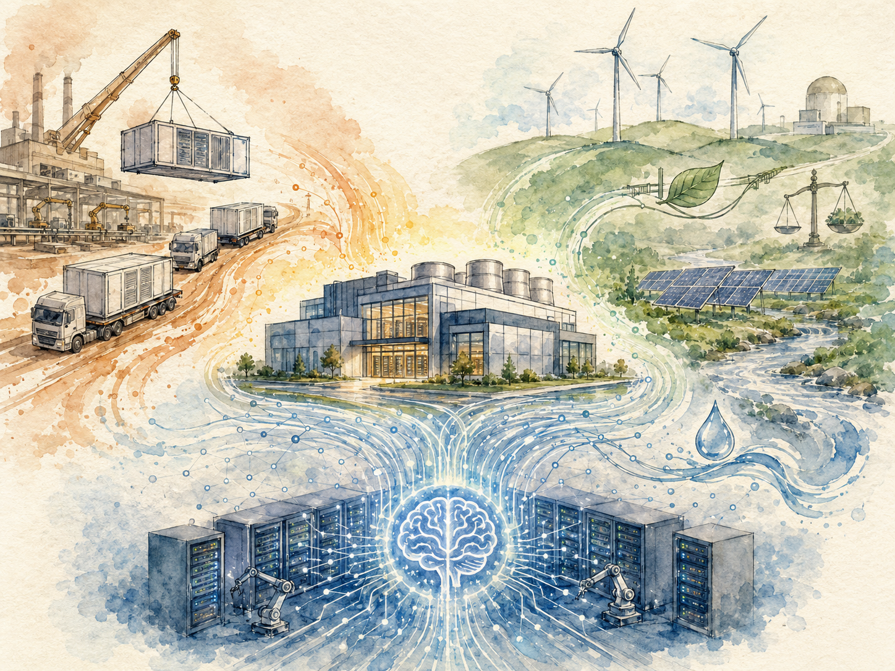
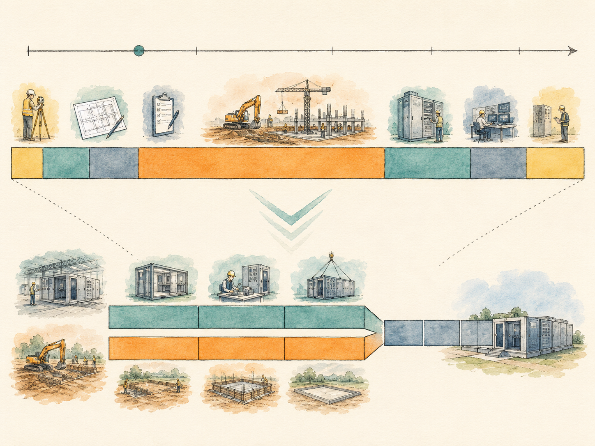

+++
date = '2026-06-22T00:00:00+00:00'
title = "【Data Center 101】Three Forces Reshaping Data Centers: Prefabrication, Sustainability, Autonomy, and the Vendor Wars"
slug = "data-center-101-12-future-trends"
aliases = ["/posts/data-center-101-future-trends/", "/posts/數據中心-101-未來趨勢/"]
tags = ['Data Center', 'Data Center 101', 'Passport to AI Era', '中文']
thumbnail = 'pic.png'
+++

> In 2020, building a data center took **27 months**, ran almost entirely under human supervision, and emitted roughly 100,000 tons of CO₂ over its 10-year operating life. In 2025, leading operators are completing data centers in **6 months**, signing 100% renewable power contracts before breaking ground, and running AI-driven optimization systems that make thousands of decisions per day without human input. Three forces have driven the change — and a fourth, the geopolitical bifurcation of the equipment vendor ecosystem, sits underneath all three. This article maps the four together and points at what the late 2020s look like.
>
> 2020 年，蓋一座數據中心需要 **27 個月**、幾乎完全在人類監督下運轉、在 10 年運轉壽命中排放約 10 萬噸 CO₂。2025 年，領先業者在 **6 個月**內完成數據中心、動土前就簽 100% 再生能源合約、跑著每天做數千個決策而不需人類輸入的 AI 驅動優化系統。三股力量驅動了這個改變 —— 加上設備廠商生態系地緣政治分裂這第四股力量，坐在三者之下。這篇文章把四者一起繪製，並指向 2020 年代後期會是什麼樣子。

---

## Why the Industry Is Reshaping Now // 為什麼這個產業現在正在重塑

For most of the data center industry's history, change was incremental. Power systems got slightly more efficient. Cooling architectures evolved through familiar variations. Building methods looked the same in 2010 as in 1990. The defining feature of the past five years has been the **simultaneous collision** of three accelerating forces, plus a geopolitical realignment that affects all three.

數據中心產業多數歷史中，改變是漸進的。電力系統稍微更有效率。冷卻架構透過熟悉的變化演化。建築方法 2010 年看起來跟 1990 年一樣。過去五年的決定性特徵是三股加速力量**同時碰撞**，加上影響三者的地緣政治重組。

The three forces // 三股力量:

- **Prefabrication** — Compressing 27-month builds to 6 months by manufacturing the data center as a product, not constructing it as a building.
- **預製化** —— 把 27 個月建設壓縮到 6 個月，方法是把數據中心當產品製造，而不是當建物建造。
  
- **Sustainability** — Carbon caps, water restrictions, ESG regulations, and renewable energy mandates moving from soft preferences to hard constraints.
- **永續** —— 碳上限、水資源限制、ESG 法規、再生能源強制要求從軟性偏好走向硬性約束。
  
- **Autonomous operations** — AI-driven optimization and predictive maintenance moving from research curiosity to standard procurement.
- **自動駕駛運轉** —— AI 驅動優化與預測性維護從研究稀奇變成標準採購。

And underneath all three // 而三者之下:

- **The geopolitical bifurcation** — The equipment vendor ecosystem has split into two near-incompatible tracks (Western and Chinese), and Taiwan sits at the bridge between them.
- **地緣政治分裂** —— 設備廠商生態系已分裂成兩條幾乎不相容的軌道（西方與中國），台灣坐在兩者之間的橋樑上。

This article works through each force, then closes with a comparative look at the major equipment vendor strategies and a 2030 outlook for the combined effect.

這篇文章走過每股力量，然後以主要設備廠商戰略的比較分析與 2030 年合併效應展望結束。

---

## Part 1 — Prefabrication: Treating the Building as a Product // 第一部分：預製化 —— 把建物當產品

The conceptual shift behind the prefabricated modular data center (PMDC) is straightforward: **a data center is no longer a building that gets constructed; it is a product that gets assembled.**

預製化模組化數據中心（PMDC）背後的概念轉變很直接：**數據中心不再是被建造的建物；它是被組裝的產品。**

The shift mirrors what happened in automotive manufacturing a century ago and in consumer electronics fifty years ago. The traditional approach — pour concrete on site, install equipment one piece at a time, integrate everything in the field — is structurally similar to building a car in a horse-drawn cart workshop. The prefabricated approach — manufacture standardized modules in a factory, ship them complete, plug them together on site — is structurally similar to Henry Ford's assembly line.

這個轉變鏡像了一百年前汽車製造與五十年前消費電子發生的事。傳統方法 —— 現場澆混凝土、一件件安裝設備、現場整合 —— 結構上類似在馬車作坊裡造車。預製化方法 —— 在工廠製造標準化模組、整套出貨、現場插接 —— 結構上類似 Henry Ford 的裝配線。

### Three PMDC categories // 三種 PMDC 類別

| Category | Scale // 規模 | Form factor // 形式 | Best for // 最適合 |
|---|---|---|---|
| **Containerized DC** | Small (6–26 cabinets per container) 小型 | ISO 20-ft or 40-ft container ISO 20 呎或 40 呎貨櫃 | Edge sites, military, disaster recovery, mining 邊緣站點、軍事、災難復原、採礦 |
| **Prefab modules** | Medium (100–1,000 cabinets) 中型 | Power module + IT module + cooling module, room-installed 電力模組 + IT 模組 + 冷卻模組，室內安裝 | Mid-to-large EDCs, custom IDCs 中大型 EDC、客製化 IDC |
| **Modular building** | Large (1,000+ cabinets) 大型 | Entire data center assembled from prefabricated building modules 整座數據中心由預製建物模組組成 | Large IDCs, hyperscale CDCs 大型 IDC、超大規模 CDC |

### How PMDC compresses time // PMDC 怎麼壓縮時間

Traditional construction is sequential: site preparation finishes, then foundation, then structure, then MEP, then equipment, then commissioning. Each phase waits for the previous one to complete.

傳統建設是順序的：場地準備完成、然後地基、然後結構、然後 MEP、然後設備、然後調試。每階段等前一階段完成。

PMDC construction is parallel: while the site is being prepared, modules are being manufactured in a factory. Factory acceptance testing runs concurrently. Site civil work and module fabrication finish around the same time. Module shipping and on-site installation become a coordination problem, not a sequential dependency.

PMDC 建設是平行的：場地準備時，模組在工廠製造。工廠驗收測試同步進行。場地土建與模組製造大約同時完成。模組出貨與現場安裝變成協調問題，不是順序相依。

The five mechanisms that produce the compression:

產出壓縮的五個機制：

- **Standardized module design** — No bespoke engineering per project; design time drops 50–80%
- **標準化模組設計** —— 每專案無客製工程；設計時間降 50–80%
  
- **Parallel factory production** — Equipment fabrication runs alongside site civil work, not after it
- **平行工廠生產** —— 設備製造跟場地土建並行進行，不是在後
  
- **Simplified civil work** — PMDC sites often use lightweight steel structures and reinforced slabs rather than full traditional buildings
- **簡化土建** —— PMDC 場地常用輕量鋼結構與強化樓板，而不是完整傳統建物
  
- **FAT before shipping** — Modules arrive 80% commissioned, with only integration testing remaining
- **出貨前 FAT** —— 模組以 80% 調試完抵達，只剩整合測試
  
- **Shortened final commissioning** — Most functional tests are completed in the factory; site IST is much faster
- **縮短最終調試** —— 多數功能測試在工廠完成；現場 IST 快得多

The aggregate result: a 27-month traditional build compressed to **6 to 11 months** as a PMDC build. The compression has been validated at scale by deployments from Huawei, Vertiv, Schneider, and the Chinese hyperscalers.

合計結果：27 個月的傳統建設壓縮到 PMDC 建設的 **6 到 11 個月**。壓縮已被華為、Vertiv、Schneider、中國超大規模業者的部署在規模上驗證。

> **Time-to-market matters more in AI infrastructure than in any previous data center era. A 12-month build versus a 24-month build is not just a 12-month difference — it is the difference between being able to deploy this generation of NVIDIA GPUs versus the next generation. The economic case for PMDC is now structurally aligned with the hardware refresh cycle.**
>
> **TTM 在 AI 基礎設施上比過去任何數據中心時代都重要。12 個月建設 vs 24 個月建設不只是 12 個月差距 —— 是「能部署這代 NVIDIA GPU」對「能部署下一代」的差別。PMDC 的經濟學論點現在結構上跟硬體汰換週期對齊。**

---

## Part 2 — The PMDC Vendor Landscape // 第二部分：PMDC 廠商版圖

The PMDC market is younger than the traditional data center equipment market, less consolidated, and includes both established equipment giants and new specialists.

PMDC 市場比傳統數據中心設備市場年輕、較不整合、包括既有設備巨頭與新專業廠商。

| Vendor | HQ | Product line // 產品線 |
|---|---|---|
| **Huawei** | China | FusionModule 2000 (310 kW) / 800 (40 kW) / 500 (3 kW); FusionDC 1000 A / B / C |
| **Vertiv** | USA | SmartMod, SmartAisle, SmartCabinet |
| **Schneider Electric** | France | EcoStruxure Modular, EcoStruxure Pod |
| **Eaton** | USA | Modular Data Center |
| **Dell** | USA | EdgeReady |
| **HPE** | USA | Edgeline, POD |
| **Inspur 浪潮** | China | InCloud |
| **Cyxtera / Compass** | USA | Large purpose-built modular |
| **Microsoft Azure Modular DC** | USA | Internal-use containerized for edge cloud |
| **AWS Outposts** | USA | Containerized cloud extension to customer sites |

### Hyperscaler in-house PMDC // 超大規模業者自家 PMDC

The most aggressive PMDC adopters are not buying from vendors at all. They are designing modular data centers in-house and contracting Taiwanese ODMs to manufacture them.

最積極的 PMDC 採用者根本沒在跟廠商買。他們自己內部設計模組化數據中心、簽台灣 ODM 製造。

- **Meta** — Open Compute Project (OCP) modular designs, manufactured primarily by Quanta and Wiwynn // Open Compute Project（OCP）模組化設計，主要由廣達與緯穎製造
- **Microsoft** — Custom modular designs for both Azure and the Stargate AI infrastructure // Azure 與 Stargate AI 基礎設施的客製模組化設計
- **Google** — Internal modular designs, with selective ODM contracting // 內部模組化設計，加上選擇性 ODM 簽約
- **AWS** — Outposts (commercial) plus internal modular for new region buildouts // Outposts（商用）加新 region 擴建用的內部模組化

### Market share signal from Huawei // 來自華為的市佔訊號

Frost & Sullivan reported Huawei holding **#1 global market share** in prefabricated modular data centers at roughly **43.5%** of the global market in 2021, and **#1 global market share** in modular UPS at roughly **19.0%**. The numbers are notable because they predate the most acute US restrictions on Chinese tech.

Frost & Sullivan 報告華為在預製化模組化數據中心持有**全球 #1 市佔**，2021 年約佔全球市場 **43.5%**，模組化 UPS 全球 #1 約 **19.0%**。這些數字值得注意，因為它們早於美國對中國科技最尖銳的限制。

In the years since, the practical reality has been a market split: Huawei holds dominant share in China, the Belt and Road region, the Middle East, and Africa, while Vertiv and Schneider hold dominant share in North America, Europe, Japan, Australia, and the rest of the OECD. We will return to this geopolitical split later in the article.

之後幾年，實務現實是市場分裂：華為在中國、一帶一路區域、中東、非洲持有主導市佔，Vertiv 與 Schneider 在北美、歐洲、日本、澳洲、其他 OECD 持有主導市佔。本文後面會回到這個地緣政治分裂。

---

## Part 3 — Sustainability: The Regulatory Wave // 第三部分：永續 —— 法規浪潮

For most of data center history, sustainability was a marketing preference. ESG reporting was voluntary. Carbon was unpriced. Water was assumed abundant. Renewable energy was an aspiration, not a requirement. All of that has changed in the past five years, and the regulatory pressure continues to tighten.

數據中心多數歷史中，永續是行銷偏好。ESG 報告是自願的。碳沒被定價。水被假設充足。再生能源是抱負，不是要求。所有這些在過去五年都變了，法規壓力持續收緊。

### The major regulatory frameworks // 主要法規框架

| Regulation | Region | Effective // 生效 | What it does // 它做什麼 |
|---|---|---|---|
| **CSRD (Corporate Sustainability Reporting Directive)** | EU | 2024 (large firms), 2026 (mid-size) | Mandatory ESG reporting with third-party assurance 強制 ESG 報告，第三方保證 |
| **CBAM (Carbon Border Adjustment Mechanism)** | EU | 2026 full implementation | Carbon tariff on imported goods including data center equipment 對進口商品（含數據中心設備）課碳關稅 |
| **EU Energy Efficiency Directive (revised)** | EU | 2024 | Mandatory PUE reporting for facilities >500 kW; targets for 2030 500 kW 以上設施強制 PUE 報告；2030 目標 |
| **Taiwan Carbon Fee** | Taiwan | 2025 | NT\$300/ton CO₂ initial, projected to rise 初期 NT\$300/噸 CO₂，預計上升 |
| **China National Carbon Market** | China | Operational since 2021 | Cap-and-trade for power generation; expansion planned 發電業限額交易；計畫擴展 |
| **Singapore DC Moratorium** | Singapore | 2019–2022 (then lifted with strict PUE caps) | Pause on new DC permits; relaunch with PUE <1.3 requirement 暫停新 DC 許可；以 PUE < 1.3 要求重啟 |
| **Netherlands DC Permit Tightening** | Netherlands | 2022 onward | Restrictions on new builds in major regions due to grid stress 因電網壓力對主要區域新建限制 |
| **Ireland Grid Connection Restrictions** | Ireland | 2022 onward | EirGrid effectively pausing new DC grid connections in Dublin region EirGrid 實質暫停都柏林區域新 DC 電網接入 |

### What CBAM actually does to data centers // CBAM 實際上對數據中心做什麼

The Carbon Border Adjustment Mechanism is worth understanding in detail because it operates indirectly but pervasively. CBAM puts a carbon tariff on imports of carbon-intensive goods into the EU. The initial product categories include cement, steel, aluminum, fertilizers, electricity, and hydrogen.

CBAM 值得詳細理解，因為它間接但普遍地運作。CBAM 對進入歐盟的碳密集商品進口課碳關稅。初始產品類別包括水泥、鋼、鋁、肥料、電力、氫。

For data centers, this means:

對數據中心而言這意味著：

- **Steel and cement imported for construction** are tariffed at the carbon equivalent
- **Aluminum used in cooling systems and busbars** is tariffed
- **Electricity imported across EU borders** is tariffed if it does not meet renewable thresholds
- **Future expansion to data center equipment categories** is being discussed

---

- **建設用的進口鋼與水泥**按碳當量課關稅
- **冷卻系統與母線用的鋁**課關稅
- **跨歐盟邊境進口的電力**若未達再生能源門檻則課關稅
- **未來擴展到數據中心設備類別**正在討論

The practical effect is that low-carbon supply chains become commercially advantaged within the EU market. Equipment manufactured in jurisdictions with high-carbon power generation faces a tariff disadvantage when shipped to EU customers.

實務效應是低碳供應鏈在歐盟市場內變成商業上有利。在高碳發電司法管轄區製造的設備出口給歐盟客戶時面臨關稅劣勢。

> **CBAM is the first regulatory mechanism that translates the carbon intensity of a supply chain into direct commercial cost. The data center industry has been preparing for it since 2022, primarily by pushing suppliers to verify and reduce their Scope 3 emissions.**
>
> **CBAM 是第一個把供應鏈碳強度翻譯成直接商業成本的法規機制。數據中心產業從 2022 年起就在準備，主要透過推供應商驗證並降低其範疇 3 排放。**

---

## Part 4 — Water, Carbon, and Waste Heat // 第四部分：水、碳、廢熱

Beyond the regulatory wave, three operational sustainability topics have moved from peripheral to central in the past five years.

法規浪潮之外，三個運轉永續主題在過去五年從邊緣移到中心。

### Water restrictions and the PUE-WUE trade-off // 水限制與 PUE-WUE 權衡

As covered in article 5, evaporative cooling — the technology that allows dry-climate sites to reach PUE 1.1 — also drives water consumption to roughly **1.5–2.5 liters per kWh of IT load**. A 1,000-cabinet facility consumes roughly **63,000 tons of water per year** under this regime.

如第 5 篇所述，蒸發冷卻 —— 讓乾燥氣候場址達 PUE 1.1 的技術 —— 也把水消耗推到大約**每 kWh IT 負載 1.5–2.5 公升**。1,000 機櫃機房在這個模式下每年消耗約 **63,000 噸水**。

Water-stressed regions are now imposing WUE caps that effectively prohibit evaporative cooling:

缺水區域現在強加 WUE 上限，實質上禁止蒸發冷卻：

- **United Arab Emirates** — New data center permits subject to WUE limits
- **Singapore** — Lifted DC moratorium tied to combined PUE/WUE thresholds
- **Central and southern Taiwan** — Public scrutiny tied to industrial water rationing during recurring droughts
- **Parts of Spain** — Water restrictions affecting major IDC operators in Madrid region

---

- **阿聯酋** —— 新數據中心許可受 WUE 限制
- **新加坡** —— 解除 DC 暫停跟合併的 PUE/WUE 門檻綁定
- **台灣中南部** —— 公眾審視跟反覆乾旱期間的工業限水綁定
- **西班牙部分地區** —— 水限制影響馬德里區域的主要 IDC 業者

The structural consequence: dry-climate operators that built their PUE strategy around evaporative cooling are now being forced to rethink. Direct liquid cooling (which uses far less water) and air-cooled chilled water (which uses almost none) are gaining favor in these markets.

結構性後果：在乾燥氣候建立 PUE 策略圍繞蒸發冷卻的營運者，現在被迫重新思考。直接液冷（用水遠少）與氣冷冷凍水（幾乎不用水）在這些市場獲得青睞。

### Carbon costs and the renewable PPA wave // 碳成本與再生能源 PPA 浪潮

The combination of carbon pricing and ESG reporting requirements has made renewable energy procurement a strategic priority for major operators. The dominant procurement mechanism is the **Power Purchase Agreement (PPA)** — a long-term contract directly with a renewable energy generator, bypassing the grid retail market.

碳定價與 ESG 報告要求的組合讓再生能源採購變成主要營運者的戰略優先。主導採購機制是 **PPA（Power Purchase Agreement，購電協議）** —— 直接跟再生能源發電商的長期合約，繞過電網零售市場。

Major hyperscaler PPA portfolios (cumulative, as of 2024–2025):

主要超大規模業者 PPA 組合（累計，2024–2025 為止）：

- **Amazon** — Over **33 GW** of renewable PPAs signed globally (the largest corporate buyer of clean energy in the world)
- **Microsoft** — Over **13 GW** including solar, wind, and emerging nuclear (Three Mile Island restart)
- **Meta** — Over **15 GW** primarily solar and wind
- **Google** — Over **12 GW** plus pioneering deals with small modular reactor (SMR) developer Kairos Power

---

- **Amazon** —— 全球簽超過 **33 GW** 再生能源 PPA（世界最大的企業潔淨能源買家）
- **Microsoft** —— 超過 **13 GW**，含太陽能、風力、與新興核能（三浬島復役）
- **Meta** —— 超過 **15 GW**，主要太陽能與風力
- **Google** —— 超過 **12 GW**，加上跟小型模組化反應爐（SMR）開發商 Kairos Power 的開創性交易

### The nuclear comeback // 核能回歸

For AI training workloads — which require **24/7 baseload power, often hundreds of megawatts at a single site, often in regions where solar and wind alone cannot reliably provide that baseload** — the hyperscalers have started signing nuclear power contracts that would have been politically impossible a decade ago.

對 AI 訓練工作負載 —— 它需要**24/7 基載電力、單一場址常數百 MW、常在太陽能與風力單獨無法可靠提供那個基載的區域** —— 超大規模業者已經開始簽十年前在政治上不可能的核電合約。

- **Microsoft + Constellation Energy** — 20-year PPA reviving the Three Mile Island Unit 1 nuclear plant, dedicated to Microsoft's AI workloads
- **Amazon + Talen Energy** — Direct grid connection at the Susquehanna nuclear plant for AWS data center
- **Google + Kairos Power** — Investment in small modular reactor development, with planned 500 MW deployment by 2030
- **Oracle (Larry Ellison statement)** — Three small modular reactors planned to power AI data center

---

- **Microsoft + Constellation Energy** —— 20 年 PPA 復活三浬島 1 號核電廠，專用於 Microsoft 的 AI 工作負載
- **Amazon + Talen Energy** —— 在 Susquehanna 核電廠直接電網接入，給 AWS 數據中心
- **Google + Kairos Power** —— 投資小型模組化反應爐開發，計畫 2030 年部署 500 MW
- **Oracle（Larry Ellison 聲明）** —— 計畫三座小型模組化反應爐供電 AI 數據中心

This is the most striking shift in the industry's power-sourcing strategy in fifty years. It reflects a coldly economic calculation: AI infrastructure needs power that renewables alone cannot reliably provide; gas turbines come with carbon liability; nuclear is the remaining option that meets both reliability and carbon constraints.

這是這個產業電力來源策略五十年來最驚人的轉變。它反映冷酷的經濟計算：AI 基礎設施需要再生能源單獨無法可靠提供的電力；燃氣輪機帶碳責任；核能是同時滿足可靠性與碳約束的剩餘選項。

### Waste heat recovery — emerging but real // 廢熱回收 —— 新興但真實

The heat that data centers reject to the atmosphere has been historically wasted. In cold climates, a growing number of facilities are recovering that heat for district heating, hot water, and industrial process heat.

數據中心排到大氣的熱歷史上被浪費。在寒冷氣候，越來越多設施回收那些熱用於區域供熱、熱水、工業製程熱。

- **Stockholm Data Parks** — Stockholm initiative connecting data center waste heat to the city district heating network; supplied to thousands of residential apartments
- **Equinix HE5 Helsinki** — Heat recovery providing district heating to roughly 11,000 households
- **Microsoft Helsinki region** — Planned heat recovery for district heating
- **Yandex Mäntsälä (Finland)** — Long-running heat recovery installation

---

- **Stockholm Data Parks** —— 斯德哥爾摩主動連結數據中心廢熱到城市區域供熱網路；供應數千戶住宅
- **Equinix HE5 Helsinki** —— 熱回收提供區域供熱給約 11,000 戶
- **Microsoft Helsinki 區域** —— 計畫熱回收做區域供熱
- **Yandex Mäntsälä（芬蘭）** —— 長期運轉的熱回收安裝

Waste heat recovery economics depend on the existence of a district heating network nearby. In countries without district heating (most of the US, most of Asia outside northern China), the technology is structurally constrained. In Northern Europe, where district heating is widespread, it is becoming routine.

廢熱回收的經濟學取決於附近區域供熱網路的存在。在沒有區域供熱的國家（多數美國、北中國以外的多數亞洲），這個技術結構性受限。在區域供熱普遍的北歐，它變成例行。

---

## Part 5 — Autonomous Operations: Beyond Level 3 // 第五部分：自動駕駛運轉 —— L3 之外

Article 8 in this series introduced the five-level framework for autonomous data center operations. Most facilities sit at L0–L1. Leading hyperscalers sit at L2–L3. The gap is widening because the leading hyperscalers have both the telemetry volume to train sophisticated models and the engineering capacity to deploy them.

本系列第 8 篇介紹了自動駕駛數據中心運轉的五級框架。多數機房處在 L0–L1。領先超大規模業者處在 L2–L3。差距正在拉大，因為領先超大規模業者同時有訓練複雜模型的遙測量、與部署它們的工程能力。

### What level 4 actually looks like // L4 實際上長什麼樣

A level-4 facility runs continuous AI optimization across power, cooling, and capacity allocation simultaneously, with human operators in a supervisory role rather than an active-control role. Concrete examples of what this means in practice:

L4 機房在電力、冷卻、容量分配上同時跑連續 AI 優化，人類運維人員處在監督角色而不是主動控制角色。實務上這意味著什麼的具體例子：

- **Cooling setpoints adjusted every few minutes** based on predicted IT load 30 minutes out
- **Chiller staging decisions made by the system**, not by an operator following a schedule
- **PdM models triggering work orders directly** for maintenance crews, with operator approval rather than operator authoring
- **Capacity allocation across racks rebalanced by the system** to match workload patterns
- **Failover decisions executed automatically** within pre-authorized envelopes
- **Post-mortem reports drafted by LLM** from raw telemetry, with operator editing rather than authoring

---

- **冷卻設定點每幾分鐘調整**，基於 30 分鐘外預測的 IT 負載
- **冷水機分階決策由系統做**，不是運維人員照排程
- **PdM 模型直接觸發工單**給維護人員，運維人員核准而非撰寫
- **跨機櫃的容量分配由系統重新平衡**以符合工作負載模式
- **故障切換決策自動執行**在預授權範圍內
- **事後報告由 LLM 草擬**，從原始遙測，運維人員編輯而非撰寫

The transition from L3 to L4 is fundamentally about **trust delegation** — the organization deciding which decisions the AI system is authorized to execute without prior human approval, and the AI system earning that trust through demonstrated reliability over time.

L3 到 L4 的轉變根本上是關於**信任委派** —— 組織決定 AI 系統被授權執行哪些不需要事先人類核准的決策、AI 系統透過長期展現的可靠性贏得那個信任。

### Why level 5 remains theoretical // 為什麼 L5 仍是理論的

Level 5 — full autonomy without human oversight — is not yet realized at any production facility, and the timeline for getting there remains uncertain. Three barriers are persistent:

L5 —— 完全自治不需人類監督 —— 還沒在任何生產機房實現，到那裡的時程仍不確定。三個障礙持續：

- **Novel-event handling** — AI systems trained on past data handle known scenarios well but novel events (a chemistry change at a battery supplier, a regulatory shift in a region) require human judgment
- **Regulatory accountability** — Insurance, regulatory bodies, and corporate governance still require a named human to be accountable for facility decisions
- **Trust dynamics** — Even when AI systems demonstrably outperform human operators on average, the failure modes can be unfamiliar and concerning, and full delegation is socially slow to develop

---

- **新事件處理** —— 用過去資料訓練的 AI 系統處理已知情境好，但新事件（電池供應商化學變更、區域法規轉變）需要人類判斷
- **法規問責** —— 保險、法規機構、企業治理仍要求一個具名人類對機房決策負責
- **信任動態** —— 即使 AI 系統平均上明顯優於人類運維人員，故障模式可以是不熟悉與令人擔心的，完全委派在社會上發展緩慢

The realistic 2030 expectation is **most hyperscaler facilities at L3, leading hyperscalers at L4, L5 still aspirational**.

現實的 2030 預期是**多數超大規模業者機房在 L3、領先超大規模業者在 L4、L5 仍是抱負**。

---

## Part 6 — Vendor Strategy Comparison // 第六部分：廠商戰略比較

The three forces above — prefabrication, sustainability, autonomy — are being played out competitively by the major equipment vendors. Each vendor has chosen a strategic posture that reveals what they believe about where the industry is going.

上面三股力量 —— 預製化、永續、自治 —— 正在被主要設備廠商競爭性地展演。每個廠商選擇了戰略姿態，揭露他們相信產業要往哪去。

### The three major Western vendors // 三大西方主要廠商

| Dimension | Vertiv | Schneider Electric | Eaton |
|---|---|---|---|
| **Heritage** | Spun out from Emerson Network Power (2016) 從 Emerson Network Power 拆分（2016） | Industrial automation roots; expanded into DC 工業自動化根源；擴展到 DC | Industrial power systems 工業電力系統 |
| **Strategic posture** | Equipment depth + service network 設備深度 + 服務網路 | Ecosystem play via EcoStruxure platform 透過 EcoStruxure 平台的生態系統 | Mid-tier global generalist 中階全球通才 |
| **PMDC offering** | SmartMod, SmartAisle, SmartCabinet SmartMod、SmartAisle、SmartCabinet | EcoStruxure Modular Pod EcoStruxure Modular Pod | Modular DC reference designs 模組化 DC 參考設計 |
| **Sustainability** | Liquid cooling acquisitions (CoolTera); refrigerant strategy 液冷收購（CoolTera）；冷媒策略 | EcoStruxure Resource Advisor (ESG software); broad green portfolio EcoStruxure Resource Advisor（ESG 軟體）；廣泛綠色組合 | Lithium battery focus, microgrid 鋰電池重點、微電網 |
| **AI / autonomy** | Vertiv Knowledge Centers, partner ecosystem Vertiv Knowledge Centers、夥伴生態系 | EcoStruxure IT with ML overlay EcoStruxure IT 加 ML 疊加 | Brightlayer software platform Brightlayer 軟體平台 |
| **Geographic strength** | Americas, EMEA 美洲、EMEA | Global, balanced 全球均衡 | Americas, secondary in EMEA 美洲，EMEA 次要 |

### The China-led vendor // 中國領導的廠商

| Dimension | Huawei |
|---|---|
| **Heritage** | Telecom infrastructure, broader Huawei group 電信基礎設施、廣義華為集團 |
| **Strategic posture** | Vertical integration: equipment + AI software + service 垂直整合：設備 + AI 軟體 + 服務 |
| **PMDC offering** | FusionModule (2000 / 800 / 500); FusionDC 1000 (A/B/C) FusionModule（2000 / 800 / 500）；FusionDC 1000（A/B/C） |
| **Sustainability** | SmartLi lithium battery integration; high-efficiency UPS SmartLi 鋰電池整合；高效率 UPS |
| **AI / autonomy** | iCooling (cooling optimization), iPower (power PdM), NetEco DCIM iCooling（冷卻優化）、iPower（電力 PdM）、NetEco DCIM |
| **Geographic strength** | China, Belt and Road, Middle East, Africa 中國、一帶一路、中東、非洲 |
| **Geopolitical exclusion** | US, UK, much of EU public sector, Japan, Australia, India 美國、英國、多數歐盟公部門、日本、澳洲、印度 |

### The strategic patterns // 戰略模式

Three observations from the comparison:

從比較得出三個觀察：

- **Schneider plays an ecosystem strategy** — its EcoStruxure brand spans data center, building, industry, and grid. The competitive moat is not any single product but the integration across the portfolio. This is the same playbook Microsoft uses in enterprise software.
- **Vertiv plays a focus strategy** — equipment depth, service network, deliberate avoidance of becoming a software ecosystem. This is the playbook a focused industrial company uses to defend share against a larger ecosystem player.
- **Huawei plays a vertical integration strategy** — equipment, software, service, and AI optimization all under one roof. The competitive moat is the deep integration between subsystems that less-integrated vendors cannot match. The geopolitical restriction is the cost of this strategy in Western markets.

---

- **Schneider 玩生態系統戰略** —— 它的 EcoStruxure 品牌跨數據中心、建築、工業、電網。競爭護城河不是任何單一產品，而是組合間的整合。這是 Microsoft 在企業軟體上用的同一手冊。
- **Vertiv 玩聚焦戰略** —— 設備深度、服務網路、刻意避免變成軟體生態系。這是聚焦的工業公司用來對抗較大生態系玩家保衛市佔的手冊。
- **華為玩垂直整合戰略** —— 設備、軟體、服務、AI 優化都在同一屋簷下。競爭護城河是子系統間的深度整合，較少整合的廠商無法匹配。地緣政治限制是這個戰略在西方市場的成本。

> **No single vendor strategy is obviously right. The three approaches each have visible champions, visible customers, and visible commercial success. The data center buyer's choice between them increasingly reflects their own organizational structure — ecosystem buyers tend to choose Schneider, depth-focused buyers tend to choose Vertiv, vertically-integrated buyers tend to choose Huawei (where geopolitically possible).**
>
> **沒有單一廠商戰略明顯正確。三個方法各有可見的冠軍、可見的客戶、可見的商業成功。數據中心買家在它們之間的選擇越來越反映自己的組織結構 —— 生態系統買家傾向選 Schneider、深度聚焦買家傾向選 Vertiv、垂直整合買家傾向選華為（在地緣政治允許的地方）。**

### The hyperscaler exception // 超大規模業者例外

The four largest hyperscalers — Amazon, Microsoft, Google, Meta — increasingly buy nothing from any of these vendors at the architecture level. They design custom data centers, contract Taiwanese ODMs (Quanta, Wiwynn, Foxconn, Inventec, Wistron) for white-box server manufacturing, contract directly with electrical and mechanical equipment makers, and run their own DCIM and AI optimization stacks.

四大超大規模業者 —— Amazon、Microsoft、Google、Meta —— 越來越在架構層級上不向任何這些廠商買。他們設計客製數據中心、簽台灣 ODM（廣達、緯穎、鴻海、英業達、緯創）做白牌伺服器製造、直接跟電氣與機械設備製造商簽約、跑自己的 DCIM 與 AI 優化堆疊。

The traditional vendors compete for the next tier down — large IDCs, large EDCs, mid-size colocation operators — where the buyer does not have the scale to justify building everything in-house.

傳統廠商爭奪次一層 —— 大型 IDC、大型 EDC、中型 Colocation 業者 —— 在那裡買家沒有規模證成內部建構一切。

---

## Part 7 — The Geopolitical Bifurcation // 第七部分：地緣政治分裂

The Western-versus-Chinese vendor split is real, has accelerated since 2019, and now constitutes one of the structural features of the global data center industry.

西方對中國的廠商分裂是真實的、從 2019 年起加速、現在構成全球數據中心產業的結構性特徵之一。

### The Western track // 西方軌道

The Western track excludes Huawei (US Entity List 2019, expanded multiple times), Hikvision and Dahua (NDAA 2019 Section 889 for cameras), ZTE (partial restrictions), and Chinese silicon broadly (CHIPS Act and BIS export controls).

西方軌道排除華為（2019 美國實體清單，多次擴大）、Hikvision 與 Dahua（2019 NDAA 第 889 節，攝影機）、ZTE（部分限制）、廣義中國晶片（CHIPS Act 與 BIS 出口管制）。

Equipment flowing in this track:

這個軌道上流動的設備：

- US/EU power equipment (Vertiv, Schneider, ABB, Eaton)
- US/EU diesel gensets (Caterpillar, Cummins, MTU, Wärtsilä)
- US/EU chillers (Trane, Carrier, Daikin)
- US silicon (NVIDIA, AMD, Intel, Broadcom)
- Korean memory (Samsung, SK Hynix), US memory (Micron)
- Taiwanese ODM-built servers
- Western security and DCIM software

### The Chinese track // 中國軌道

The Chinese track increasingly excludes US-designed advanced silicon (BIS rules block NVIDIA H100/H200/B200 from China; only de-rated H20 variant currently allowed), parts of the US software ecosystem, and has reciprocal restrictions on Cisco, Western firewall vendors, and several Western chip categories.

中國軌道越來越排除美國設計的先進晶片（BIS 規定擋下 NVIDIA H100/H200/B200 進中國；目前只允許降規 H20 變體）、部分美國軟體生態、且對 Cisco、西方防火牆廠商、幾個西方晶片類別有對等限制。

Equipment flowing in this track:

這個軌道上流動的設備：

- Huawei UPS, gensets coordinated with Chinese OEMs
- Chinese chillers, CRAC (AIRSYS, Huawei NetCol)
- Chinese silicon (Huawei Ascend, Cambricon, Hygon)
- Emerging Chinese DRAM (CXMT) and NAND (YMTC)
- Inspur, xFusion, H3C servers
- Hikvision, Dahua security
- Huawei NetEco DCIM

### Taiwan as the bridge // 台灣作為橋樑

Taiwanese ODMs and TSMC operate on both tracks. They build servers for AWS and Inspur, supply chips to NVIDIA and (within export-control limits) Huawei, and ship power supplies to both ecosystems. This bridging role has become commercially valuable and geopolitically delicate in equal measure.

台灣 ODM 與 TSMC 在兩條軌道上都運作。他們替 AWS 蓋伺服器也替 Inspur 蓋、供應晶片給 NVIDIA 與（在出口管制限制內）華為、運電源供應到兩個生態系。這個橋樑角色在商業上有價值，在地緣政治上微妙，程度相當。

> **Whether the Taiwanese bridging role remains viable through the next decade is one of the single largest open questions in global technology supply-chain planning. The current answer — "yes, with growing friction" — is unlikely to hold unchanged through 2030.**
>
> **台灣的橋樑角色未來十年是否仍可行，是全球科技供應鏈規劃裡最大的單一未決問題之一。當前答案 —— 「是，但摩擦增加」 —— 不太可能維持不變到 2030 年。**

---

## Part 8 — 2030 Outlook // 第八部分：2030 展望

Pulling the three forces and the geopolitical bifurcation together, what does the data center industry look like by 2030?

把三股力量與地緣政治分裂拉到一起，2030 年數據中心產業會是什麼樣子？

### The numbers // 數字

The most-cited forward estimates from McKinsey, Goldman Sachs, and S&P Global, triangulated:

McKinsey、Goldman Sachs、S&P Global 最常被引用的前向估計，三角驗證：

- **Global data center capacity in 2030**: 171–219 GW (up from ~75 GW in 2024)
- **Cumulative CapEx 2024–2030**: ~$6.7 trillion
- **AI training share of new build by 2030**: 60%+
- **Liquid cooling share of new build by 2030**: 50%+ overall, 80%+ for AI clusters
- **Hyperscaler renewable PPA volume by 2030**: well over 200 GW signed

---

- **2030 全球數據中心容量**：171–219 GW（從 2024 年的約 75 GW 上升）
- **2024–2030 累計 CapEx**：約 \$6.7 兆
- **2030 年 AI 訓練佔新建比例**：60%+
- **2030 年液冷佔新建比例**：整體 50%+、AI 集群 80%+
- **2030 年超大規模業者再生能源 PPA 簽訂量**：遠超 200 GW

### What the qualitative landscape looks like // 質性版圖看起來怎樣

By 2030, the typical narrative for what new data centers look like will have shifted in several dimensions:

到 2030 年，新數據中心長什麼樣的典型敘事在幾個維度上會轉變：

- **Build time is no longer the bottleneck.** PMDC has compressed it. Most new builds complete in 8 to 12 months. The bottleneck has moved upstream to grid connection and chip allocation.
- **Air-cooled is the exception, not the rule.** Liquid cooling is mainstream for any cabinet above 20 kW. AI clusters running at 100+ kW per cabinet are common.
- **Renewable power is the default.** 100% renewable PPAs cover most hyperscaler load. Nuclear (including SMRs) provides the baseload share. Gas turbines remain for emergency backup only.
- **Carbon is priced into every decision.** CBAM-equivalent mechanisms have spread beyond the EU. Supply chains have visibly restructured to track carbon intensity.
- **AI runs the operations.** L3 autonomy is the norm; L4 is common at hyperscalers. Operations teams have shrunk and shifted from execution to oversight.
- **Vendor ecosystems remain bifurcated.** Western and Chinese tracks have not converged. Taiwan continues to bridge, with growing pressure.

---

- **建設時間不再是瓶頸。** PMDC 已壓縮它。多數新建在 8 到 12 個月完成。瓶頸已上移到電網接入與晶片配額。
- **氣冷是例外，不是規則。** 液冷對任何 20 kW 以上機櫃是主流。100+ kW/櫃跑的 AI 集群普遍。
- **再生能源是預設。** 100% 再生能源 PPA 涵蓋多數超大規模業者負載。核能（含 SMR）提供基載份額。燃氣輪機只剩緊急備援。
- **碳被定價進每個決策。** CBAM 等效機制已擴散到歐盟以外。供應鏈已可見地重組以追蹤碳強度。
- **AI 跑運轉。** L3 自治是常態；L4 在超大規模業者普遍。運轉團隊已縮減並從執行轉到監督。
- **廠商生態仍分裂。** 西方與中國軌道未收斂。台灣繼續橋接，壓力增加。

The aggregate picture is an industry that has shifted from being primarily an engineering discipline to being a coordination problem across regulation, supply chain, software, and geopolitics. The engineering challenges remain, but they are no longer the binding constraint.

合計圖像是一個產業已經從主要是工程學科轉變成法規、供應鏈、軟體、地緣政治的協調問題。工程挑戰仍在，但它們不再是綁定約束。

---

## Key Takeaways // 重點整理

#### 1. Three forces are simultaneously reshaping the industry // 三股力量同時重塑這個產業

Prefabrication compresses build time. Sustainability tightens what can be built and where. Autonomy moves operations from human-driven to AI-driven. None of the three is reversible.

預製化壓縮建設時間。永續收緊可以建什麼與哪裡。自治把運轉從人類驅動轉到 AI 驅動。三者沒有可逆的。

#### 2. PMDC has structurally aligned with the AI hardware cycle // PMDC 已結構性對齊 AI 硬體週期

When equipment refreshes every 18 months, a 27-month build is incompatible with the technology being installed. PMDC's 6-to-11-month build is now the only way to deploy current-generation hardware while it is still current-generation.

當設備每 18 個月汰換，27 個月建設跟正在安裝的技術不相容。PMDC 的 6 到 11 個月建設現在是唯一方法在當代硬體仍是當代時部署它。

#### 3. CBAM is the first regulation translating carbon into direct commercial cost // CBAM 是把碳翻譯成直接商業成本的第一個法規

For data centers, this means steel and aluminum used in construction face carbon-equivalent tariffs at the EU border. Supply chains are visibly restructuring to track carbon intensity.

對數據中心而言這意味著建設用的鋼與鋁在歐盟邊境面臨碳當量關稅。供應鏈可見地重組以追蹤碳強度。

#### 4. The nuclear comeback is real, not symbolic // 核能回歸是真實的，不是象徵性的

Microsoft + Three Mile Island, Amazon + Susquehanna, Google + Kairos SMRs. AI workloads need baseload that renewables cannot reliably supply; gas carries carbon liability; nuclear is the remaining option that meets both reliability and carbon constraints.

Microsoft + 三浬島、Amazon + Susquehanna、Google + Kairos SMR。AI 工作負載需要再生能源無法可靠提供的基載；天然氣帶碳責任；核能是同時滿足可靠性與碳約束的剩餘選項。

#### 5. The PUE-WUE trade-off is now binding in dry regions // PUE-WUE 權衡現在在乾燥區域有約束力

Sites that built their PUE strategy around evaporative cooling are being forced to rethink as WUE caps spread. Direct liquid cooling and air-cooled chilled water are gaining favor in water-stressed markets.

把 PUE 策略建立在蒸發冷卻上的場址，隨著 WUE 上限擴散，被迫重新思考。直接液冷與氣冷冷凍水在缺水市場獲得青睞。

#### 6. Vendor strategies divide into three patterns // 廠商戰略分成三個模式

Schneider plays ecosystem (EcoStruxure spanning DC + building + grid). Vertiv plays equipment depth + service. Huawei plays vertical integration (equipment + software + AI). The hyperscalers play none of these — they design custom and contract Taiwanese ODMs.

Schneider 玩生態系統（EcoStruxure 跨 DC + 建築 + 電網）。Vertiv 玩設備深度 + 服務。華為玩垂直整合（設備 + 軟體 + AI）。超大規模業者三者都不玩 —— 他們設計客製、簽台灣 ODM。

#### 7. The geopolitical bifurcation is structural // 地緣政治分裂是結構性的

Western and Chinese vendor ecosystems have separated since 2019 and continue to diverge. Taiwan bridges both, with growing friction. The bridging role is the single largest open question in global technology supply-chain planning.

西方與中國廠商生態自 2019 年分離並持續分歧。台灣橋接兩者，摩擦增加。橋接角色是全球科技供應鏈規劃裡最大的單一未決問題。

#### 8. By 2030, the binding constraints have moved upstream // 到 2030 年，綁定約束已上移到上游

Build time, equipment availability, and operations capacity were the constraints of the 2010s. By 2030, the constraints are grid connection, chip allocation, carbon caps, and water rights. The industry's bottlenecks have moved from inside the building to the regulatory and supply-chain environment around it.

建設時間、設備可得性、運轉能量是 2010 年代的約束。到 2030 年，約束是電網接入、晶片配額、碳上限、水權。產業瓶頸已從建物內部移到圍繞它的法規與供應鏈環境。

---

## What's Next // 下一篇預告

The thirteenth and final article in this series moves from global trends to a single regional deep-dive: **Sydney, Australia**. The article combines all the frameworks introduced earlier — the five-layer architecture, the TCO economics, the supply chain map, the reliability and efficiency metrics, the construction and commissioning process, the site-selection scoring framework, the trend forces — and applies them to one specific data center market. It covers Australian and NSW regulatory frameworks, AEMO's National Electricity Market dynamics, the NABERS Energy for Data Centres rating system, the major operators (NEXTDC, AirTrunk, Macquarie Data Centres, plus hyperscalers AWS, Microsoft, Google), the geography of Sydney's major data center clusters (Eastern Creek, Macquarie Park, Mascot, Pyrmont, Lane Cove West, Homebush), and a practical guide for anyone evaluating Sydney as a build location. The article is intentionally written for two audiences: investors and operators considering the Sydney market, and curious readers wanting to understand how a real data center market actually works.

本系列第 13 篇也是最後一篇，從全球趨勢移到單一區域深入：**澳洲雪梨**。文章結合前面介紹的所有框架 —— 五層架構、TCO 經濟學、供應鏈地圖、可靠性與能效指標、建設與調試流程、選址評分框架、趨勢力量 —— 應用到一個特定的數據中心市場。它涵蓋澳洲與新南威爾斯州法規框架、AEMO 國家電力市場動態、NABERS Energy for Data Centres 評等系統、主要營運者（NEXTDC、AirTrunk、Macquarie Data Centres，加上超大規模業者 AWS、Microsoft、Google）、雪梨主要數據中心聚落的地理（Eastern Creek、Macquarie Park、Mascot、Pyrmont、Lane Cove West、Homebush）、以及給任何評估雪梨作為建設地點的人的實用指南。文章刻意為兩個受眾寫：考慮雪梨市場的投資人與營運者，與想了解一個真實數據中心市場實際怎麼運作的好奇讀者。
