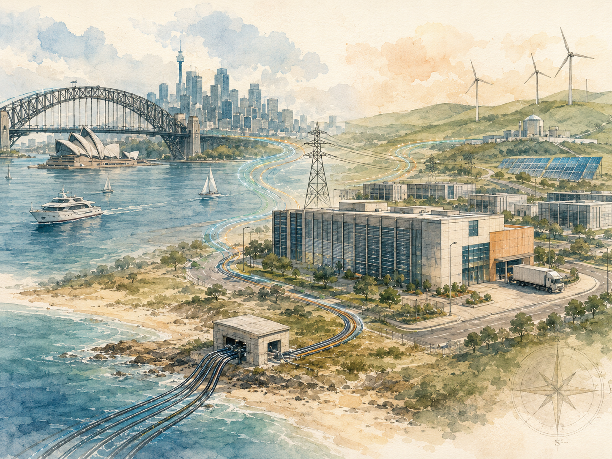
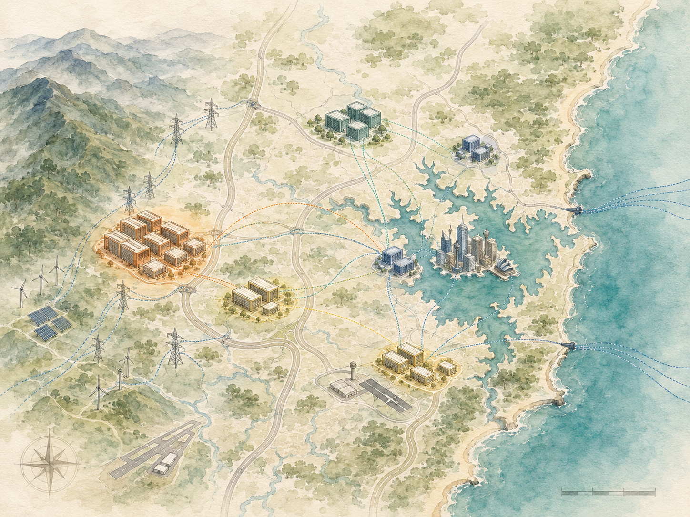

+++
date = '2026-06-22T00:05:00+00:00'
title = "【Data Center 101】Sydney as a Data Center Market: A Complete Regional Deep-Dive"
slug = "data-center-101-13-sydney-deep-dive"
aliases = ["/posts/data-center-101-sydney-deep-dive/", "/posts/數據中心-101-雪梨深度指南/"]
tags = ['Data Center', 'Data Center 101', 'Passport to AI Era', '中文']
thumbnail = 'pic.png'
+++

> Sydney holds roughly **75% of Australia's data center capacity**, more than four times Melbourne's share, and serves as the primary digital hub for the entire Asia-Pacific south. In August 2024, Blackstone and Canada Pension Plan Investment Board announced an AUD **24 billion** acquisition of AirTrunk — the largest data center transaction in Asia-Pacific history, and the largest single private-equity deal in Australia ever. The buyers were not paying for any one Sydney building. They were paying for what Sydney has become: an infrastructure choke point that hyperscaler AI buildouts cannot route around.
>
> This is the final article in the Data Center 101 series. The previous twelve articles built up the analytical frameworks — the five-layer architecture, the TCO economics, the supply chain map, the reliability and efficiency metrics, the construction and commissioning process, the site-selection scoring framework, the trend forces. This article applies all of them to one specific market, and serves dual audiences: anyone wanting to understand how a real data center market works, and anyone evaluating Sydney as a build location.
>
> 雪梨持有澳洲約 **75% 的數據中心容量**，超過墨爾本份額的四倍，是整個亞太南部主要的數位樞紐。2024 年 8 月，Blackstone 與加拿大退休金計畫投資委員會宣布以 AUD **240 億** 收購 AirTrunk —— 亞太歷史上最大的數據中心交易，也是澳洲史上最大的單筆私募股權交易。買家不是在付任何一棟雪梨建物的錢。他們付的是雪梨已經變成的東西：超大規模 AI 擴建無法繞過的基礎設施咽喉點。
>
> 這是 Data Center 101 系列的最後一篇文章。前面十二篇建立了分析框架 —— 五層架構、TCO 經濟學、供應鏈地圖、可靠性與能效指標、建設與調試流程、選址評分框架、趨勢力量。這篇文章把所有框架應用到一個特定市場，服務兩個受眾：想理解真實數據中心市場如何運作的任何人，與評估雪梨作為建設地點的任何人。

---

## Why Sydney // 為什麼是雪梨

Three structural advantages give Sydney its dominant position in Australia's data center market, and a meaningful position in the broader Asia-Pacific south.

三個結構性優勢給雪梨在澳洲數據中心市場的主導地位，與在更廣亞太南部有意義的地位。

- **Submarine cable concentration.** Sydney is the dominant submarine cable landing point for the Australian east coast. Major cables include Southern Cross (NEXT, NEXT2), Hawaiki, Indigo West, Australia-Singapore Cable, and several others. Sydney connects to North America, Asia, and the Pacific Islands with minimum-latency paths that Melbourne, Brisbane, and Perth do not match.
- **海底電纜集中。** 雪梨是澳洲東岸主導的海底電纜登陸點。主要電纜包括 Southern Cross（NEXT、NEXT2）、Hawaiki、Indigo West、Australia-Singapore Cable、以及其他幾條。雪梨以最小延遲路徑連接北美、亞洲、太平洋島嶼，墨爾本、布里斯本、伯斯比不上。
  
- **Hyperscaler anchor presence.** AWS designated Sydney as its first Australian region in 2012 (ap-southeast-2), Microsoft Azure followed in 2014, Google Cloud in 2017. Each maintains multiple availability zones in the Sydney metropolitan area. Once a region anchor is established, the entire ecosystem of customers, partners, and downstream services concentrates around it.
- **超大規模業者錨定存在。** AWS 在 2012 年指定雪梨為其澳洲首個 region（ap-southeast-2）、Microsoft Azure 2014 年跟進、Google Cloud 2017 年。每家在雪梨大都會區維持多個可用區。一旦 region 錨定建立，整個客戶、合作夥伴、下游服務生態系都集中在它周圍。
  
- **Financial and government density.** The four major Australian banks (Commonwealth, Westpac, NAB, ANZ) are all headquartered in Sydney or run their core IT operations there. The NSW state government and many federal agencies operate substantial IT estates in the Sydney region. The Australian financial sector's regulatory pressure for in-country data sovereignty makes physical location near customers commercially valuable.
- **金融與政府密度。** 澳洲四大銀行（Commonwealth、Westpac、NAB、ANZ）都在雪梨總部或在那裡運轉核心 IT。NSW 州政府與許多聯邦機構在雪梨區域運轉大量 IT 資產。澳洲金融部門對國內資料主權的法規壓力，讓物理上靠近客戶在商業上有價值。

These three factors compound. The hyperscalers chose Sydney partly because the cables were there, the financial sector clusters because the hyperscalers are there, the colocation operators expand because both are there. The cluster has positive-feedback dynamics.

這三個因素複合。超大規模業者選雪梨部分因為電纜在那、金融部門聚集因為超大規模業者在那、Colocation 業者擴張因為兩者都在那。這個聚落有正回饋動態。

---

## Part 1 — The Australian DC Market in Context // 第一部分：澳洲 DC 市場脈絡

The Australian data center market sits at roughly **AUD 6 billion** in 2024–2025, growing at a compound annual rate of **12–15%**, with the AI buildout currently pushing the upper end of that range.

澳洲數據中心市場 2024–2025 年約 **AUD 60 億**，複合年增長率 **12–15%**，AI 擴建目前把上限往上推。

### Capacity by city // 各城市容量

| City | Approx. share // 約佔比 | Character // 特性 |
|---|---|---|
| **Sydney** | **~75%** | Submarine cable anchor, hyperscaler primary region, financial cluster 海底電纜錨定、超大規模業者主 region、金融聚落 |
| **Melbourne** | ~15% | Hyperscaler secondary region, government cluster, Victorian state ecosystem 超大規模業者次 region、政府聚落、維多利亞州生態 |
| **Perth** | ~5% | Western Australia mining and resources industry, isolated network position 西澳礦業與資源產業、孤立網路位置 |
| **Brisbane** | ~3% | Queensland state, growing for North Asia and US west-coast traffic 昆士蘭州、為北亞與美西流量成長 |
| **Adelaide / Canberra / others** | ~2% | Smaller markets with specialized roles 較小市場、特殊角色 |

### What is driving the growth // 什麼在驅動成長

Three demand sources are running simultaneously in Australia and especially in Sydney:

三個需求來源在澳洲、特別是雪梨，同時運轉：

- **Hyperscaler region expansion.** AWS, Microsoft, and Google have all announced multi-billion-dollar Australian infrastructure investments. Microsoft committed **AUD 5 billion** in 2024 for cloud and AI infrastructure expansion; AWS announced **AUD 13.2 billion** by 2027 to expand Sydney and Melbourne regions plus new edge sites.
- **超大規模業者 region 擴展。** AWS、Microsoft、Google 都已宣布數十億澳幣的澳洲基礎設施投資。Microsoft 2024 年承諾 **AUD 50 億** 給雲端與 AI 基礎設施擴展；AWS 宣布到 2027 年 **AUD 132 億** 擴展雪梨與墨爾本 region 加新的邊緣站點。
  
- **AI training and inference capacity.** Australian financial services, government, healthcare, and education sectors are all building substantial AI capacity, and increasingly demanding sovereign AI options — workloads that run on Australian soil rather than overseas.
- **AI 訓練與推理容量。** 澳洲金融服務、政府、醫療、教育部門都在建構大量 AI 容量，並越來越要求主權 AI 選項 —— 工作負載跑在澳洲土地上而非海外。
  
- **Colocation and enterprise migration.** Mid-size enterprise customers continue migrating from on-premise to colocation, and from colocation to public cloud, with both ends of the transition increasing Sydney's net capacity demand.
- **Colocation 與企業遷移。** 中型企業客戶持續從自建遷移到 Colocation、從 Colocation 遷移到公有雲，過渡兩端都增加雪梨的淨容量需求。

---

## Part 2 — The Regulatory Landscape // 第二部分：法規版圖

Building a data center in NSW means navigating four overlapping regulatory layers. Each layer has its own approval pathway, timeline, and disqualifying conditions.

在 NSW 建一座數據中心意味著導航四個重疊的法規層。每層有自己的核准路徑、時程、與失格條件。

### Federal level // 聯邦層

| Regulation | What it does // 它做什麼 |
|---|---|
| **EPBC Act** (Environment Protection and Biodiversity Conservation Act 1999) | Federal environmental impact assessment for projects affecting matters of national environmental significance — heritage, water, threatened species 影響國家環境重要事務的專案的聯邦環境影響評估 —— 遺產、水、瀕危物種 |
| **SOCI Act** (Security of Critical Infrastructure Act 2018, amended 2021) | Data centers classified as critical infrastructure; obligations include cyber-security plans, incident reporting, ownership disclosure 數據中心被分類為關鍵基礎設施；義務包括資安計畫、事件報告、所有權揭露 |
| **Privacy Act 1988 + Australian Privacy Principles** | Data handling, breach notification, cross-border data flow restrictions 資料處理、洩漏通知、跨境資料流動限制 |
| **ACMA** (Australian Communications and Media Authority) | Telecommunications carrier licensing if the DC also operates network services 若 DC 同時運轉網路服務則需電信運營商執照 |

### NSW state level // NSW 州層

| Regulation | What it does // 它做什麼 |
|---|---|
| **NSW Environmental Planning and Assessment Act 1979** | The primary planning approval framework. Most large DCs trigger state-level approval as "State Significant Development" (SSD) 主要規劃核准框架。多數大型 DC 觸發州級核准為「州重要開發」（SSD） |
| **SEPP** (State Environmental Planning Policies) | Various SEPPs cover infrastructure, industry, biodiversity, primary production. A DC in an industrial zone typically falls under SEPP (Industry and Employment) 各種 SEPP 涵蓋基礎設施、工業、生物多樣性、主要生產。工業區的 DC 典型上落在 SEPP（工業與就業）下 |
| **NSW EPA** (Environment Protection Authority) | Air quality, noise, water pollution, contaminated land — operational permits issued separately from planning approval 空氣品質、噪音、水污染、受污染土地 —— 運轉許可跟規劃核准分開發放 |
| **NSW Noise Policy for Industry** | Cooling towers, gensets, and outdoor equipment subject to specific noise limits based on time of day and surrounding land use 冷卻塔、發電機、戶外設備受時段與周邊土地使用的特定噪音限制 |

### Local council level // 地方議會層

NSW has 128 local councils, each with their own **LEP (Local Environmental Plan)** and **DCP (Development Control Plan)** that govern what can be built where within their boundaries.

NSW 有 128 個地方議會，每個有自己的 **LEP（Local Environmental Plan，地方環境計畫）** 與 **DCP（Development Control Plan，開發控制計畫）**，治理在其邊界內哪裡可以蓋什麼。

For most large data center projects, the development application is determined by the state government as State Significant Development, but local council input remains influential — particularly on traffic management, noise, visual impact, and community consultation.

對多數大型數據中心專案，開發申請由州政府決定為 State Significant Development，但地方議會輸入仍有影響力 —— 特別是交通管理、噪音、視覺衝擊、社區諮詢。

### Industry self-regulation // 產業自律

| Framework | Notes // 備註 |
|---|---|
| **NABERS Energy for Data Centres** | Operated by NSW Department of Planning. Star rating system (1–6) for IT equipment efficiency, infrastructure efficiency, and whole-building efficiency. Government and many enterprise tenants increasingly require 4.5+ stars 由 NSW 規劃部運轉。星等系統（1–6）給 IT 設備效率、基礎設施效率、整棟建物效率。政府與許多企業租戶越來越要求 4.5 星以上 |
| **NCC Section J** (National Construction Code) | Energy efficiency provisions in the building code. DCs have specific exemptions and provisions that interact with NABERS 建築法規中的能效條款。DC 有特定豁免與條款，跟 NABERS 互動 |
| **Climate Active** | Federal carbon neutrality certification for organizations. Increasingly required by enterprise tenants for sustainability claims 聯邦組織碳中和認證。企業租戶越來越要求做永續主張 |

---

## Part 3 — NABERS for Data Centres in Depth // 第三部分：NABERS for Data Centres 深入

NABERS deserves its own section because it is uniquely Australian, uniquely binding for the market, and frequently misunderstood by international operators.

NABERS 值得自己一節，因為它是獨特的澳洲產物、對市場獨特地有約束力、且常被國際營運者誤解。

### What NABERS rates // NABERS 評什麼

The NABERS Energy for Data Centres framework provides three distinct ratings, addressing different questions:

NABERS Energy for Data Centres 框架提供三個不同評等，處理不同問題：

| Rating | Question it answers // 它回答的問題 | Who cares // 誰在乎 |
|---|---|---|
| **IT Equipment** | How efficient is the IT equipment itself (servers, storage, network)? IT 設備本身（伺服器、儲存、網路）多有效率？ | Enterprise tenants who manage their own equipment 管理自家設備的企業租戶 |
| **Infrastructure** | How efficient is the facility infrastructure (power, cooling) relative to the IT load? 設施基礎設施（電力、冷卻）相對 IT 負載多有效率？ | Colocation operators Colocation 業者 |
| **Whole Building** | How efficient is the combined facility + equipment? 合併的設施 + 設備多有效率？ | Enterprise EDCs with single-tenant operation 單一租戶運轉的企業 EDC |

The star ratings run 1 to 6, calibrated to industry-relative performance:

星等運行 1 到 6，校準到產業相對表現：

- **1 star** — Poor (well below average) // 差（遠低於平均）
- **2 stars** — Below average // 低於平均
- **3 stars** — Average // 平均
- **4 stars** — Good // 好
- **5 stars** — Excellent // 優秀
- **6 stars** — Market leading // 市場領先

### Why NABERS actually matters commercially // 為什麼 NABERS 在商業上實際重要

The reason NABERS is more than a marketing badge:

NABERS 不只是行銷標誌的原因：

- **NSW government tenancy requirements** — Many NSW government tenants require 4.5 stars or higher for their hosting facility. Below that threshold, the facility cannot bid for those tenancies.
- **NSW 政府租戶要求** —— 許多 NSW 政府租戶要求承載設施 4.5 星以上。低於那個門檻，設施不能投標那些租戶。
  
- **Enterprise sustainability commitments** — Major Australian enterprises (banks, telcos, retailers) increasingly require NABERS minimum thresholds in their colocation contracts to support their own Scope 3 emissions reporting.
- **企業永續承諾** —— 主要澳洲企業（銀行、電信、零售）越來越在 Colocation 合約中要求 NABERS 最低門檻，以支持他們自己的範疇 3 排放報告。
  
- **Federal sustainability procurement** — Climate Active certification and federal procurement guidelines increasingly reference NABERS ratings.
- **聯邦永續採購** —— Climate Active 認證與聯邦採購指引越來越參考 NABERS 評等。
  
- **Industry credibility** — In the Australian market specifically, NABERS has accumulated enough industry credibility that "5-star NABERS" is recognized as a meaningful operational signal in a way that, say, a self-claimed PUE figure is not.
- **產業可信度** —— 在澳洲市場特別，NABERS 已累積足夠的產業可信度，「5 星 NABERS」被認可為有意義的運轉訊號，方式是自稱的 PUE 數字做不到的。

For an operator entering the Sydney market, achieving NABERS certification at 4.5 stars or higher is effectively a commercial prerequisite, not an optional extra.

對進入雪梨市場的營運者，達到 4.5 星以上的 NABERS 認證實質上是商業前提，不是可選的額外。

---

## Part 4 — The NSW Power Market // 第四部分：NSW 電力市場

Power is the binding constraint on Sydney data center growth, more than land, water, or talent. Understanding the NSW power market is the difference between a smooth build and a project that quietly dies in regulatory queue.

電力是雪梨數據中心成長的綁定約束，超過土地、水、人才。理解 NSW 電力市場是「順利建設」與「在法規排隊中靜悄悄死掉的專案」之間的差別。

### The National Electricity Market (NEM) // 國家電力市場

The eastern Australian states (NSW, Victoria, Queensland, South Australia, Tasmania, ACT) operate under a single integrated wholesale electricity market called the **NEM**, operated by **AEMO (Australian Energy Market Operator)**. Western Australia and the Northern Territory operate separate systems.

東澳州（NSW、維多利亞、昆士蘭、南澳、塔斯馬尼亞、ACT）在單一整合躉售電力市場下運作，稱為 **NEM**，由 **AEMO（Australian Energy Market Operator）** 運轉。西澳與北領地運轉分開系統。

NEM is one of the world's longest synchronous power systems, stretching roughly **5,000 km from Cairns to Adelaide**. Long thin grids have known stability challenges, and a meaningful share of AEMO's operational work is managing those challenges.

NEM 是世界最長的同步電力系統之一，從凱恩斯到阿德雷德伸展約 **5,000 公里**。長薄電網有已知的穩定性挑戰，AEMO 運轉工作有意義份額是管理那些挑戰。

### NSW's coal transition and the resulting grid stress // NSW 燃煤轉型與隨之而來的電網壓力

NSW's electricity has historically been supplied by a small number of very large coal-fired power stations. Three of them are closing or have closed:

NSW 電力歷史上由少數非常大的燃煤電廠供應。其中三座正在關閉或已關閉：

- **Liddell (1,680 MW)** — Closed 2023 // 2023 年關閉
- **Eraring (2,880 MW)** — Originally scheduled to close 2025, extended to 2027 due to grid reliability concerns // 原本預定 2025 年關閉，因電網可靠性顧慮延長到 2027
- **Bayswater (2,640 MW)** — Scheduled closure 2033 // 預定 2033 年關閉

The replacement is meant to be a combination of renewables, storage, and limited new gas generation, coordinated under the **NSW Electricity Infrastructure Roadmap (2020)** — a state-level commitment to roughly **12 GW of new renewables and 2 GW of storage by 2030**, with an estimated AUD 32 billion of private investment.

替代方案是再生能源、儲能、有限新天然氣發電的組合，在 **NSW Electricity Infrastructure Roadmap（2020）** 下協調 —— 州級承諾到 2030 年大約 **12 GW 新再生能源與 2 GW 儲能**，估計 AUD 320 億私人投資。

The implementation mechanism is the **Renewable Energy Zone (REZ)** program, designating five geographic zones for concentrated renewable energy development with associated transmission upgrades. The five NSW REZs:

實施機制是 **Renewable Energy Zone（REZ）** 計畫，指定五個地理區域做集中再生能源開發、加上相關輸電升級。NSW 五個 REZ：

| REZ | Location | Focus |
|---|---|---|
| Central-West Orana | Inland central NSW | Wind + solar |
| New England | Northeast NSW | Wind + solar + pumped hydro |
| South West | Southwest NSW | Solar |
| Hunter-Central Coast | Mid-NSW coast | Offshore wind + solar |
| Illawarra | South coast | Offshore wind |

### The grid connection bottleneck // 電網接入瓶頸

The structural challenge for Sydney data centers is that the coal-to-renewables transition is creating temporary grid capacity stress in exactly the period when AI buildout is creating unprecedented demand. The result is that **grid connection lead times for new large industrial loads in NSW have stretched from approximately 18–24 months (pre-2020) to 4–7 years (2025–2026)**.

雪梨數據中心的結構性挑戰是，燃煤到再生能源的轉型在 AI 擴建創造前所未有需求的同一時期，創造了暫時的電網容量壓力。結果是 **NSW 新大型工業負載的電網接入交期已從 2020 年前的約 18–24 個月，拉長到 2025–2026 年的 4–7 年**。

The three distribution network service providers (DNSPs) serving the Sydney region:

服務雪梨區域的三個配電網路服務供應商（DNSP）：

| DNSP | Coverage // 涵蓋 |
|---|---|
| **Ausgrid** | Sydney CBD, eastern suburbs, north shore, central coast |
| **Endeavour Energy** | Western Sydney, Blue Mountains, southern highlands |
| **Essential Energy** | Rural NSW (relevant for some far-western projects) |

Endeavour Energy's territory — Western Sydney — is where most new hyperscale and AI builds are concentrating, and consequently where the grid connection backlog is most acute.

Endeavour Energy 的領域 —— 西雪梨 —— 是多數新超大規模與 AI 建設集中的地方，因此也是電網接入待辦最尖銳的地方。

### The PPA path forward // PPA 前路

The major operators have responded to grid constraints by signing renewable PPAs directly with generators, bypassing the retail market and accelerating their own grid connection priorities through the AEMO connection process.

主要營運者透過直接跟發電商簽再生能源 PPA、繞過零售市場、透過 AEMO 連接流程加速他們自己的電網接入優先級，回應電網約束。

- **AirTrunk** announced PPAs for over 1 GW of renewable energy in 2023–2024, primarily covering its Australian footprint
- **AirTrunk** 在 2023–2024 宣布超過 1 GW 再生能源的 PPA，主要涵蓋其澳洲足跡
  
- **NEXTDC** holds multiple solar and wind PPAs and is targeting 100% renewable by 2030 across its Australian operations
- **NEXTDC** 持有多個太陽能與風力 PPA，瞄準 2030 年澳洲運轉 100% 再生能源
  
- **Microsoft Australia** announced PPAs for Australian wind and solar projects supporting its Australian data center load
- **Microsoft Australia** 宣布支持其澳洲數據中心負載的澳洲風力與太陽能專案的 PPA
  
- **AWS Australia** has signed PPAs for multiple gigawatt-scale projects in NSW and beyond
- **AWS Australia** 已簽多個 GW 規模專案的 PPA，在 NSW 與更廣

---

## Part 5 — Sydney's Six Major Data Center Clusters // 第五部分：雪梨六大數據中心聚落

Sydney's data center capacity is not evenly distributed. It concentrates in six identifiable clusters, each with a distinct profile of cost, latency, customer mix, and operator presence.

雪梨數據中心容量不是平均分布。它集中在六個可識別的聚落，每個有不同的成本、延遲、客戶組合、營運者存在的概況。

### Cluster 1 — Eastern Creek // 聚落一：Eastern Creek

The largest cluster by capacity, located in Western Sydney near the M4/M7 motorway intersection, approximately 35 km west of the CBD.

按容量計最大的聚落，位於西雪梨 M4/M7 高速公路交叉口附近，約離 CBD 35 公里西。

| Characteristic | Profile |
|---|---|
| **Primary operators** | AirTrunk (SYD1, SYD2, SYD3), Digital Realty, Equinix (SY9), various others |
| **Typical customer** | Hyperscalers (AWS, Microsoft, Google), large IDCs 超大規模業者、大型 IDC |
| **Land cost** | Lower than CBD-adjacent clusters; meaningful land available for greenfield 低於 CBD 鄰近聚落；綠地有意義可得 |
| **Power** | Endeavour Energy territory; major substation infrastructure but capacity tight Endeavour Energy 領域；主要變電所基礎設施但容量緊 |
| **Network** | Strong fiber backbone; multiple providers 強光纖骨幹；多家供應商 |
| **Climate** | Slightly hotter than coastal Sydney (urban heat island effect) 稍熱於沿海雪梨（城市熱島效應） |
| **Best for** | Hyperscale AI training, large colocation, future expansion 超大規模 AI 訓練、大型 Colocation、未來擴展 |

### Cluster 2 — Macquarie Park // 聚落二：Macquarie Park

Established technology district in the north of Sydney, approximately 15 km from CBD, with deep roots as a corporate IT hub since the 1990s.

成熟的科技區，位於雪梨北部約離 CBD 15 公里，1990 年代起作為企業 IT 樞紐有深厚根基。

| Characteristic | Profile |
|---|---|
| **Primary operators** | Macquarie Data Centres (Intellicentre IC2, IC3), Equinix, NEXTDC Macquarie Data Centres（Intellicentre IC2、IC3）、Equinix、NEXTDC |
| **Typical customer** | Enterprise, banking, government, telecom carrier 企業、銀行、政府、電信業者 |
| **Land cost** | High (mature commercial district) 高（成熟商業區） |
| **Power** | Ausgrid territory; relatively stable but limited expansion headroom Ausgrid 領域；相對穩定但有限的擴展餘量 |
| **Network** | Excellent (longstanding fiber density) 優秀（長期光纖密度） |
| **Climate** | Mild; some free-cooling capacity 溫和；有些自然冷卻容量 |
| **Best for** | High-reliability EDCs, financial colocation, government 高可靠性 EDC、金融 Colocation、政府 |

### Cluster 3 — Mascot / Alexandria // 聚落三：Mascot / Alexandria

Inner south Sydney, adjacent to Sydney Airport and the port. The latency-optimized cluster — many cable landings reach this area first.

雪梨內南，鄰近雪梨機場與港口。延遲優化的聚落 —— 許多電纜登陸最先到達這個區域。

| Characteristic | Profile |
|---|---|
| **Primary operators** | Equinix (SY1, SY2, SY3, etc.), Global Switch, NEXTDC Equinix（SY1、SY2、SY3 等）、Global Switch、NEXTDC |
| **Typical customer** | Financial services, content delivery networks, internet exchanges 金融服務、CDN、網際網路交換點 |
| **Land cost** | Very high (constrained inner-Sydney location) 非常高（受限的內雪梨位置） |
| **Power** | Ausgrid; constrained capacity Ausgrid；受限容量 |
| **Network** | Best in Sydney; major internet exchange (IX Australia, Equinix Sydney IX) 雪梨最好；主要網際網路交換點（IX Australia、Equinix Sydney IX） |
| **Climate** | Moderate coastal influence 適度沿海影響 |
| **Best for** | Retail colocation, financial co-location, IX hosting 零售 Colocation、金融 Colocation、IX 託管 |

### Cluster 4 — Pyrmont // 聚落四：Pyrmont

A small peninsula on the western edge of Sydney's CBD. The historical center of Sydney's data center industry, home to the Equinix and Global Switch facilities that anchor the inner-CBD ecosystem.

雪梨 CBD 西側邊緣的小半島。雪梨數據中心產業的歷史中心，是 Equinix 與 Global Switch 設施的家，錨定內 CBD 生態。

| Characteristic | Profile |
|---|---|
| **Primary operators** | Equinix (SY4), Global Switch (Sydney West, Sydney East) Equinix（SY4）、Global Switch（Sydney West、Sydney East） |
| **Typical customer** | Financial services, internet exchanges, content delivery 金融服務、網際網路交換點、內容傳遞 |
| **Land cost** | Highest in Sydney 雪梨最高 |
| **Power** | Ausgrid; very constrained Ausgrid；非常受限 |
| **Network** | Excellent — peninsula is densely served 優秀 —— 半島密集服務 |
| **Climate** | Coastal moderation 沿海調節 |
| **Best for** | Retail colocation requiring CBD adjacency, financial interconnection 需要 CBD 鄰近的零售 Colocation、金融互連 |

### Cluster 5 — Lane Cove West // 聚落五：Lane Cove West

North Shore industrial precinct, primarily serving enterprise and mid-size colocation, with strong fiber connectivity but limited expansion capacity.

北岸工業區，主要服務企業與中型 Colocation，光纖連線性強但擴展容量有限。

| Characteristic | Profile |
|---|---|
| **Primary operators** | Equinix (SY5, SY6), Macquarie Data Centres Equinix（SY5、SY6）、Macquarie Data Centres |
| **Typical customer** | Mid-tier enterprise, hybrid cloud, government secondary 中階企業、混合雲、政府次要 |
| **Power** | Ausgrid; moderate constraints Ausgrid；中度約束 |
| **Network** | Good 好 |
| **Climate** | Moderate 適度 |

### Cluster 6 — Homebush / Silverwater / Auburn // 聚落六：Homebush / Silverwater / Auburn

Inner-west industrial area, including the Olympic Park precinct. Growing presence of mid-tier colocation and edge sites, with reasonable land availability for the location.

內西工業區，包括 Olympic Park 區域。中階 Colocation 與邊緣站點存在成長中，以該位置而言土地可得性合理。

| Characteristic | Profile |
|---|---|
| **Primary operators** | Various mid-tier and edge operators 各種中階與邊緣營運者 |
| **Typical customer** | Mid-tier enterprise, edge/CDN, regional 中階企業、邊緣 / CDN、區域 |
| **Power** | Mixed (Ausgrid / Endeavour boundary) 混合（Ausgrid / Endeavour 邊界） |
| **Network** | Good 好 |
| **Best for** | Edge sites, mid-tier colocation, expansion fill-in 邊緣站點、中階 Colocation、擴展填補 |

### Western Sydney Aerotropolis — the future cluster // 西雪梨航空都會 —— 未來聚落

The new Western Sydney International Airport (Nancy-Bird Walton Airport) opens to passenger traffic in late 2026. The NSW government has zoned a substantial area around the airport as the **Aerotropolis**, with explicit zoning provisions for data centers and other digital infrastructure.

新的 **西雪梨國際機場（Nancy-Bird Walton 機場）** 在 2026 年底開放客運。NSW 政府已把機場周圍大量區域劃為**航空都會**，明確的數據中心與其他數位基礎設施分區條款。

This is the most actively planned new cluster in Australia. Multiple operators have announced intentions, but actual construction is in the planning stage as of 2026. The cluster will likely emerge as a 7th major Sydney cluster over 2027–2030, particularly for operators that can co-locate with the airport's freight and customs infrastructure.

這是澳洲最積極規劃的新聚落。多家營運者已宣布意圖，但實際建設在 2026 年仍在規劃階段。聚落可能在 2027–2030 年浮現為雪梨第 7 個主要聚落，特別給能跟機場貨運與海關基礎設施共址的營運者。

---

## Part 6 — Major Operators in Sydney // 第六部分：雪梨主要營運者

### AirTrunk // AirTrunk

Founded in 2015, headquartered in Sydney, AirTrunk became the dominant hyperscale-focused operator across Asia-Pacific within a decade. The August 2024 acquisition by **Blackstone and Canada Pension Plan Investment Board for AUD 24 billion** marked it as the largest data center transaction in Asia-Pacific history.

2015 年成立、總部在雪梨，AirTrunk 在十年內成為亞太主導的超大規模聚焦營運者。2024 年 8 月被 **Blackstone 與加拿大退休金計畫投資委員會以 AUD 240 億**收購，標誌它為亞太歷史上最大的數據中心交易。

Sydney facilities: **SYD1** (originally 130 MW, expanded), **SYD2**, **SYD3**, **SYD4**, plus future capacity in the Western Sydney Aerotropolis.

雪梨設施：**SYD1**（原本 130 MW、已擴展）、**SYD2**、**SYD3**、**SYD4**，加上西雪梨航空都會的未來容量。

Customer model: hyperscaler wholesale only. AirTrunk does not serve retail colocation.

客戶模式：只做超大規模業者批發。AirTrunk 不服務零售 Colocation。

### NEXTDC // NEXTDC

Sydney facilities: **S1** (Macquarie Park), **S2** (Macquarie Park), **S3** (Artarmon), **S4** (Eastern Creek, hyperscale).

雪梨設施：**S1**（Macquarie Park）、**S2**（Macquarie Park）、**S3**（Artarmon）、**S4**（Eastern Creek，超大規模）。

Customer model: mixed colocation, retail through hyperscale wholesale. Strong NABERS ratings across portfolio.

客戶模式：混合 Colocation，從零售到超大規模批發。組合中強 NABERS 評等。

### Equinix // Equinix

The global colocation leader, with the deepest Sydney portfolio: **SY1 through SY9**, spread across Mascot, Pyrmont, Lane Cove West, and Eastern Creek. Operates the **Equinix Sydney IX** internet exchange.

全球 Colocation 領導者，有最深的雪梨組合：**SY1 到 SY9**，分布在 Mascot、Pyrmont、Lane Cove West、Eastern Creek。運轉 **Equinix Sydney IX** 網際網路交換點。

Customer model: retail colocation, network interconnection, with growing hyperscale relationships.

客戶模式：零售 Colocation、網路互連，加上成長中的超大規模關係。

### Macquarie Data Centres // Macquarie Data Centres

Part of Macquarie Telecom Group, focused on Australian government and enterprise. Key facilities: **Intellicentre IC2, IC3** in Macquarie Park.

Macquarie Telecom Group 旗下，聚焦澳洲政府與企業。關鍵設施：**Intellicentre IC2、IC3** 在 Macquarie Park。

Strong government accreditation (cleared for sensitive Australian government workloads), Climate Active certified.

強政府認證（清關給敏感澳洲政府工作負載）、Climate Active 認證。

### Global Switch // Global Switch

Long-established UK-headquartered colocation operator with major Pyrmont facilities (**Sydney West, Sydney East**). Strong financial-sector customer base.

長期成立的英國總部 Colocation 業者，在 Pyrmont 有主要設施（**Sydney West、Sydney East**）。強金融部門客戶基礎。

### Hyperscalers // 超大規模業者

| Hyperscaler | Australian region | Notes |
|---|---|---|
| **AWS** | Sydney (ap-southeast-2) since 2012; 3 AZs | Plus Melbourne (ap-southeast-4); AUD 13.2B committed to 2027 |
| **Microsoft Azure** | Australia East (Sydney) since 2014; Australia Southeast (Melbourne) | AUD 5B committed in 2024 for AI infrastructure |
| **Google Cloud** | Sydney (australia-southeast1) since 2017; Melbourne (australia-southeast2) since 2021 | Continued infrastructure expansion |
| **Oracle Cloud** | Sydney since 2019; Melbourne since 2021 | Government-focused presence |
| **Tencent Cloud** | Sydney presence | Limited regional position |
| **Alibaba Cloud** | Sydney presence | Limited regional position |

The hyperscalers generally do not directly own their Sydney facilities — they lease wholesale capacity from AirTrunk, NEXTDC, and Global Switch, while specifying their own internal designs and operating their own racks within the leased halls.

超大規模業者一般不直接擁有他們的雪梨設施 —— 他們從 AirTrunk、NEXTDC、Global Switch 租批發容量，同時指定自己的內部設計、在租用的廳內運轉自己的機櫃。

---

## Part 7 — Applying the Site-Selection Scoring Framework to Sydney // 第七部分：把選址評分框架應用到雪梨

Article 11 in this series introduced a 10-criterion weighted scoring framework for site selection. Applied to the six Sydney clusters, the framework illustrates concretely how a buyer's priorities should map to a cluster choice.

本系列第 11 篇介紹了 10 準則加權選址評分框架。應用到雪梨六個聚落，框架具體說明買家優先級應如何對應到聚落選擇。

The exercise below uses standard weights (Power 25%, Climate 15%, Water 10%, Network 10%, Land 10%, Disaster 10%, Policy 5%, Adaptability 5%, Talent 5%, Community 5%) and rates each cluster on a 0–5 scale.

下面的練習用標準權重（電力 25%、氣候 15%、水 10%、網路 10%、土地 10%、災害 10%、政策 5%、適應性 5%、人才 5%、社區 5%），每聚落在 0–5 量表上評分。

| Criterion | Weight | Eastern Creek | Macquarie Park | Mascot | Pyrmont | Lane Cove W | Homebush |
|---|---|---|---|---|---|---|---|
| Power | 25% | 4 | 3 | 3 | 2 | 3 | 3 |
| Climate | 15% | 3 | 3 | 4 | 4 | 4 | 3 |
| Water | 10% | 3 | 3 | 3 | 3 | 3 | 3 |
| Network | 10% | 4 | 4 | 5 | 5 | 4 | 4 |
| Land & Layout | 10% | 5 | 2 | 2 | 1 | 3 | 4 |
| Disaster | 10% | 4 | 4 | 4 | 4 | 4 | 4 |
| Policy & Permit | 5% | 4 | 3 | 3 | 3 | 3 | 3 |
| Adaptability | 5% | 5 | 3 | 2 | 2 | 3 | 4 |
| Talent & Service | 5% | 4 | 5 | 5 | 5 | 4 | 4 |
| Community | 5% | 5 | 3 | 2 | 2 | 4 | 4 |
| **Weighted total** | **100%** | **3.95** | **3.20** | **3.45** | **3.10** | **3.45** | **3.50** |

**Interpretation:**

**解讀：**

- **Eastern Creek wins on weighted total (3.95)** — strong on the heaviest-weighted criterion (Power), excellent on Land/Layout (room for hyperscale builds), and Community (industrial zoning means low resident objection).
- **Eastern Creek 在加權總分上贏（3.95）** —— 在權重最重的準則（電力）上強、土地/佈局優秀（超大規模建設的空間）、社區優秀（工業區意味著低居民反對）。
  
- **Mascot and Lane Cove West tie for second (3.45)** — strong on Network and Talent, but constrained on Land and Power.
- **Mascot 與 Lane Cove West 並列第二（3.45）** —— 網路與人才強，但土地與電力受限。
  
- **Homebush comes third (3.50)** — balanced profile, no major weaknesses, no major strengths.
- **Homebush 第三（3.50）** —— 平衡組合、無重大弱點、無重大強項。
  
- **Macquarie Park (3.20)** and **Pyrmont (3.10)** trail despite their excellent network and talent scores because the heavy weight on Power penalizes their constrained grid positions.
- **Macquarie Park（3.20）** 與 **Pyrmont（3.10）** 落後，儘管網路與人才分數優秀，因為電力的重權重懲罰了它們受限的電網位置。

### What changes when you adjust the weights // 調整權重時什麼改變

The standard weights are a starting point, not a universal answer. For specific project types:

標準權重是起點，不是通用答案。對特定專案類型：

- **For an AI training cluster (Power 35%, Network 5%, Climate 20%)** — Eastern Creek wins by even larger margin; the inner Sydney clusters drop further.
- **AI 訓練集群（電力 35%、網路 5%、氣候 20%）** —— Eastern Creek 以更大差距贏；內雪梨聚落進一步下降。
  
- **For a financial colocation node (Network 25%, Power 15%, Talent 10%)** — Mascot or Pyrmont win; Eastern Creek drops to mid-pack.
- **金融 Colocation 節點（網路 25%、電力 15%、人才 10%）** —— Mascot 或 Pyrmont 贏；Eastern Creek 落到中段。
  
- **For an edge / CDN node (Network 30%, Power 10%, Talent 5%)** — Mascot wins decisively.
- **邊緣 / CDN 節點（網路 30%、電力 10%、人才 5%）** —— Mascot 決定性地贏。
  
- **For a sovereign-government EDC (Disaster 20%, Policy 15%, Community 10%)** — Macquarie Park rises sharply (established government cluster); Eastern Creek remains competitive.
- **主權政府 EDC（災害 20%、政策 15%、社區 10%）** —— Macquarie Park 急升（成熟政府聚落）；Eastern Creek 仍有競爭力。

The framework's value, again, is not in producing a definitive answer. It is in forcing the trade-offs to be explicit, defensible, and consistent.

框架的價值，再說一次，不在產生定論答案。是在強迫權衡明確、可辯護、一致。

---

## Part 8 — The Sydney Five-Year Outlook // 第八部分：雪梨五年展望

The forces reshaping the global industry — prefabrication, sustainability, autonomy, geopolitical bifurcation — all play out in Sydney with specific local manifestations.

重塑全球產業的力量 —— 預製化、永續、自治、地緣政治分裂 —— 都在雪梨以具體本地形式展演。

### Demand outlook through 2030 // 到 2030 年的需求展望

Aggregating the announced expansion plans from hyperscalers, major colocation operators, and the NSW Aerotropolis program, Sydney is on track to roughly **double its data center capacity by 2030** — going from approximately 1,200 MW in 2024 to projected 2,400+ MW by 2030. The growth is heavily concentrated in Western Sydney and the new Aerotropolis precinct.

加總超大規模業者、主要 Colocation 業者、NSW 航空都會計畫宣布的擴展計畫，雪梨有望到 **2030 年大致使數據中心容量翻倍** —— 從 2024 年的約 1,200 MW 到 2030 年預計的 2,400+ MW。成長重度集中在西雪梨與新的航空都會區。

### Supply constraints that could throttle growth // 可能扼制成長的供應約束

Four specific constraints could slow Sydney's growth below its demand trajectory:

四個特定約束可能讓雪梨成長放慢到低於其需求軌跡：

- **Grid connection backlog** — Endeavour Energy's connection queue in Western Sydney is the binding constraint. The NSW Electricity Infrastructure Roadmap is meant to address this, but transmission buildout typically runs 5–10 years behind generation buildout.
- **電網接入待辦** —— Endeavour Energy 在西雪梨的接入排隊是綁定約束。NSW Electricity Infrastructure Roadmap 是用來處理這個的，但輸電建設典型上落後發電建設 5–10 年。
  
- **Renewable generation buildout timing** — The REZ program is on track but multiple projects have faced delays. If renewable generation comes online slower than coal closure, the gap is filled by gas — adding carbon liability that data center operators must then offset elsewhere.
- **再生能源建設時程** —— REZ 計畫進度正常但多個專案已面臨延遲。如果再生能源上線比燃煤關閉慢，缺口被天然氣填補 —— 增加碳責任，數據中心營運者必須在別處抵消。
  
- **Water restrictions during drought cycles** — Sydney has a documented history of multi-year drought (most recently 2017–2020). New facilities specifying evaporative cooling face material risk during drought cycles.
- **乾旱週期間的水限制** —— 雪梨有多年乾旱的文件化歷史（最近是 2017–2020）。指定蒸發冷卻的新設施在乾旱週期間面臨實質風險。
  
- **Skilled trades capacity** — The combined pressure of Sydney's ongoing construction boom (Western Sydney Airport, Sydney Metro, residential build-out) plus AI data center construction is straining the skilled electrical, mechanical, and commissioning workforce. Project delays from trades shortages are increasing.
- **熟練工種容量** —— 雪梨持續建築熱潮（西雪梨機場、雪梨地鐵、住宅建設）加上 AI 數據中心建設的合併壓力，正在拉緊熟練電氣、機械、調試人力。工種短缺造成的專案延誤正在增加。

### Investment and policy moves to watch // 值得關注的投資與政策動作

- **NSW Net Zero Plan** — State commitment to net zero by 2050, with interim 2030 targets that increasingly affect data center procurement
- **NSW Net Zero Plan** —— 州承諾 2050 年淨零，2030 年中期目標越來越影響數據中心採購
  
- **AEMO Integrated System Plan (ISP)** — Updated every two years; the current ISP shapes transmission investment decisions through 2050
- **AEMO Integrated System Plan（ISP）** —— 每兩年更新；目前 ISP 塑造到 2050 年的輸電投資決策
  
- **Federal Capacity Investment Scheme** — Federal underwriting of new dispatchable generation, intended to bridge the coal-to-renewables gap
- **聯邦 Capacity Investment Scheme** —— 聯邦核保新可調度發電，意圖橋接燃煤到再生能源的差距
  
- **Snowy 2.0 pumped hydro** — Long-delayed but still proceeding; major potential firming asset for the entire NEM
- **Snowy 2.0 抽水蓄能** —— 長期延誤但仍進行；整個 NEM 的主要潛在穩定資產
  
- **Offshore wind in Illawarra REZ** — Could become a major dedicated power source for southern Sydney data centers if it proceeds at scale
- **Illawarra REZ 的離岸風力** —— 如果規模化進行，可以成為南雪梨數據中心的主要專用電力來源
  
- **Western Sydney Aerotropolis Phase 2 planning** — Will determine the next decade's data center cluster boundaries
- **西雪梨航空都會第二階段規劃** —— 將決定下個十年的數據中心聚落邊界

---

## Part 9 — Practical Decision Framework // 第九部分：實用決策框架

For anyone evaluating Sydney as a build location, the analytical journey reduces to a small number of structured decisions, each best made in a specific order.

對任何評估雪梨作為建設地點的人，分析旅程歸結為小數量的結構化決策，每個最好按特定順序做。

### Decision 1 — Workload type // 決策一：工作負載類型

Before choosing a cluster, define the workload:

選聚落前，定義工作負載：

- **AI training** — Power-density is the dominant constraint; Eastern Creek or future Aerotropolis is the answer
- **AI 訓練** —— 功率密度是主導約束；Eastern Creek 或未來航空都會是答案
  
- **Cloud production / general enterprise** — Multiple clusters viable; balance Network and Power
- **雲端生產 / 一般企業** —— 多聚落可行；平衡網路與電力
  
- **Financial trading / latency-sensitive** — Mascot or Pyrmont for IX proximity
- **金融交易 / 延遲敏感** —— Mascot 或 Pyrmont 為 IX 鄰近
  
- **Government / sovereignty** — Macquarie Park or Mascot for established government infrastructure
- **政府 / 主權** —— Macquarie Park 或 Mascot 為成熟政府基礎設施
  
- **Edge / CDN** — Mascot for network density; multiple secondary clusters for distributed presence
- **邊緣 / CDN** —— Mascot 為網路密度；多個次要聚落為分散存在

### Decision 2 — Build vs lease vs colocation // 決策二：建設 vs 租 vs Colocation

- **Hyperscale build** (>50 MW) — Direct build or anchor-tenant arrangement; Western Sydney
- **超大規模建設**（>50 MW） —— 直接建設或錨定租戶安排；西雪梨
  
- **Mid-scale build** (10–50 MW) — Custom colocation with NEXTDC, AirTrunk, or Global Switch; multiple cluster options
- **中等規模建設**（10–50 MW） —— 跟 NEXTDC、AirTrunk、Global Switch 客製 Colocation；多聚落選項
  
- **Small enterprise** (<10 MW) — Retail colocation with Equinix, NEXTDC, Macquarie; cluster choice based on network and operational proximity
- **小型企業**（<10 MW） —— 跟 Equinix、NEXTDC、Macquarie 零售 Colocation；聚落選擇基於網路與運轉鄰近
  
- **Edge** (<1 MW) — Pre-existing edge colocation or specialized edge operator; choice based on customer proximity
- **邊緣**（<1 MW） —— 既有邊緣 Colocation 或專門邊緣業者；選擇基於客戶鄰近

### Decision 3 — Power strategy // 決策三：電力策略

- **Grid only** — Acceptable for sub-5 MW retail colocation tenants; impractical for new hyperscale build given connection backlog
- **僅電網** —— 5 MW 以下零售 Colocation 租戶可接受；對新超大規模建設不實際，鑑於接入待辦
  
- **Grid + corporate PPA** — Standard pattern for mid-to-large enterprise builds; requires careful PPA structuring under Australian Renewable Energy Target rules
- **電網 + 企業 PPA** —— 中大型企業建設的標準模式；需要在澳洲再生能源目標規則下仔細結構化 PPA
  
- **Anchor-tenant PPA arrangement** — For hyperscale, PPAs are typically signed by the tenant rather than the facility operator, with the operator providing the grid connection
- **錨定租戶 PPA 安排** —— 對超大規模，PPA 典型由租戶簽而不是設施營運者，營運者提供電網接入
  
- **Behind-the-meter generation** — Increasingly considered for new builds, particularly using solar + storage; faces local council and AEMO interconnection complexity
- **電錶後發電** —— 越來越多新建設考慮，特別是用太陽能 + 儲能；面臨地方議會與 AEMO 互連複雜度

### Decision 4 — Sustainability positioning // 決策四：永續定位

- **Minimum** — Meet NABERS 4 stars (entry threshold for most enterprise tenants and government work)
- **最低** —— 達 NABERS 4 星（多數企業租戶與政府工作的入門門檻）
  
- **Standard** — NABERS 4.5 stars + 100% renewable PPA + Climate Active organizational certification
- **標準** —— NABERS 4.5 星 + 100% 再生能源 PPA + Climate Active 組織認證
  
- **Premium** — NABERS 5.5+ stars + 100% renewable + carbon-neutral construction + water recycling
- **頂級** —— NABERS 5.5+ 星 + 100% 再生能源 + 碳中和建設 + 水回收

### Decision 5 — Timeline realism // 決策五：時程現實

For Sydney specifically in 2025–2026:

對 2025–2026 雪梨特別：

| Project type | Realistic timeline // 現實時程 |
|---|---|
| Greenfield hyperscale (50+ MW) | **4–7 years** including grid connection wait |
| Mid-size enterprise build (10–50 MW) | 24–36 months |
| Colocation expansion at existing site | 12–18 months |
| Retail colocation deployment | 8–16 weeks for sub-1 MW tenants |
| Edge node | 4–12 weeks |

Any timeline shorter than these for a greenfield build in 2025–2026 should be treated with substantial skepticism. Grid connection alone routinely takes longer than the project sponsors initially assume.

任何比 2025–2026 年綠地建設這些更短的時程，都應該帶相當懷疑看待。光電網接入就常常比專案發起者最初假設的更久。

---

## Key Takeaways // 重點整理

#### 1. Sydney holds roughly 75% of Australian DC capacity for compound reasons // 雪梨持有澳洲約 75% DC 容量，原因複合

Submarine cable concentration, hyperscaler anchor presence, and financial sector density all reinforce each other. The cluster has positive-feedback dynamics that are unlikely to reverse.

海底電纜集中、超大規模業者錨定存在、金融部門密度互相強化。聚落有不太可能逆轉的正回饋動態。

#### 2. NABERS is binding, not optional // NABERS 有約束力，不是可選

For any operator serious about NSW government or major enterprise tenancies, 4.5 stars or higher is a commercial prerequisite. Plan for it in design, not as an afterthought.

對任何認真追求 NSW 政府或主要企業租戶的營運者，4.5 星以上是商業前提。在設計時規劃，而不是事後想起。

#### 3. The grid connection backlog is the binding constraint // 電網接入待辦是綁定約束

Endeavour Energy's queue in Western Sydney has stretched grid connection lead times to 4–7 years for large industrial loads. This is the single most important variable shaping new-build timelines in Sydney through 2030.

Endeavour Energy 在西雪梨的排隊已把大型工業負載的電網接入交期拉到 4–7 年。這是塑造到 2030 年雪梨新建設時程的最重要單一變數。

#### 4. The NSW coal-to-renewables transition creates timing risk // NSW 燃煤到再生能源轉型造成時序風險

Eraring (2,880 MW coal) closing 2027 plus the REZ program's renewable buildout creates a multi-year gap in baseload generation. Operators that signed PPAs early are protected; latecomers face higher costs and reliability risk.

Eraring（2,880 MW 燃煤）2027 年關閉加上 REZ 計畫的再生能源建設，在基載發電上創造多年差距。早期簽 PPA 的營運者受保護；晚到者面臨較高成本與可靠性風險。

#### 5. Six clusters serve six different customer profiles // 六個聚落服務六種不同客戶概況

Eastern Creek for hyperscale and AI. Macquarie Park for government and enterprise. Mascot and Pyrmont for financial colocation and network. Lane Cove West and Homebush for mid-tier. The clusters are not interchangeable.

Eastern Creek 給超大規模與 AI。Macquarie Park 給政府與企業。Mascot 與 Pyrmont 給金融 Colocation 與網路。Lane Cove West 與 Homebush 給中階。聚落不可互換。

#### 6. The AirTrunk AUD 24B acquisition is a market signal // AirTrunk AUD 240 億收購是市場訊號

Blackstone and CPP Investment Board did not pay AUD 24 billion for buildings. They paid for the structural position Sydney occupies in the Asia-Pacific AI infrastructure chain. The acquisition is the clearest statement yet that institutional capital sees Sydney as strategically important rather than incidentally important.

Blackstone 與 CPP 投資委員會不是為建物付 AUD 240 億。他們付的是雪梨在亞太 AI 基礎設施鏈中的結構性位置。這次收購是迄今最清楚的聲明：機構資本看雪梨為戰略上重要，而不是偶然重要。

#### 7. The Western Sydney Aerotropolis will be the seventh major cluster // 西雪梨航空都會將是第七個主要聚落

The new airport opens late 2026; the NSW government has zoned data center capacity around it. Most existing operators have signaled intent to build there. The cluster will likely emerge as a major presence over 2027–2030.

新機場 2026 年底開放；NSW 政府已圍繞它劃分數據中心容量。多數既有營運者已表示在那裡建設的意圖。聚落可能在 2027–2030 年浮現為主要存在。

#### 8. Realistic build timelines have lengthened // 現實建設時程已拉長

A greenfield hyperscale build in Sydney in 2025–2026 should be planned for 4–7 years, not the 2–3 years that was credible pre-2020. Operators that have not adjusted their expectations are systematically missing market windows.

雪梨 2025–2026 年的綠地超大規模建設應規劃為 4–7 年，不是 2020 年前可信的 2–3 年。沒調整期待的營運者系統性地錯過市場窗口。

---

## Series Conclusion // 系列總結

This is the thirteenth and final article in the Data Center 101 series. Over the course of the series, we have built up a complete picture of the data center industry from first principles — beginning with the five-layer architecture in article one, working through the economics, the supply chain, the reliability and efficiency metrics, the four major facility subsystems, the operations discipline of RCA and predictive maintenance, the construction process, the trend forces reshaping the industry, and finally a regional deep-dive into one specific market.

這是 Data Center 101 系列的第十三篇也是最後一篇。整個系列中，我們從第一原理建構了數據中心產業的完整圖像 —— 從第一篇的五層架構開始，走過經濟學、供應鏈、可靠性與能效指標、四大設施子系統、RCA 與預測性維護的運轉學科、建設流程、重塑產業的趨勢力量，最後對一個特定市場做區域深度。

The thread running through every article has been the same: data centers look simple from the outside (a building with servers in it) and are extraordinarily complex from the inside, with technical, economic, regulatory, geopolitical, and operational dimensions that all interact. Understanding any one dimension in isolation produces misleading conclusions. Understanding the interactions is what separates surface knowledge from useful knowledge.

每篇文章貫穿的主線都是一樣的：數據中心從外面看簡單（裡面有伺服器的建物），從裡面看極度複雜，有技術、經濟、法規、地緣政治、運轉維度全部互動。孤立理解任何一個維度產生誤導結論。理解互動是把表面知識與有用知識分開的東西。

Two structural shifts that ran through the entire series deserve a closing emphasis:

兩個貫穿整個系列的結構性轉變值得最後強調：

**The AI buildout has changed everything about the industry's tempo and scale.** Build times, equipment refresh cycles, power density, cooling architecture, supply chain bottlenecks, geographic concentration — all of these have moved in the same direction at the same time, and most of the movement has happened in the past five years. Anyone whose mental model of data centers was formed before 2020 is operating on outdated assumptions.

**AI 擴建已經改變了產業節奏與規模的一切。** 建設時間、設備汰換週期、功率密度、冷卻架構、供應鏈瓶頸、地理集中 —— 所有這些在同一時間往同一方向移動，多數移動發生在過去五年。任何 2020 年前形成數據中心心智模型的人，正在用過時的假設運作。

**The boundaries between technical, regulatory, and geopolitical questions have dissolved.** Carbon pricing, water restrictions, vendor restrictions, sovereign-AI requirements, grid connection backlogs — these are not separate concerns to be handed off to separate departments. They are inseparable inputs to every meaningful decision the industry now makes. The successful operator of the late 2020s will be the one whose decision-making fully integrates them rather than treating them as exogenous.

**技術、法規、地緣政治問題之間的邊界已經溶解。** 碳定價、水限制、廠商限制、主權 AI 要求、電網接入待辦 —— 這些不是要交給不同部門的不同關切。它們是產業現在做每個有意義決策的不可分輸入。2020 年代後期的成功營運者，將是那些決策完全整合它們而不是當外生變數處理的營運者。

Thank you for reading the series.

謝謝您讀完這個系列。
