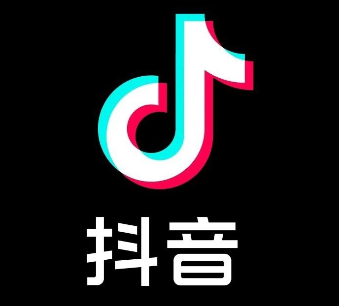
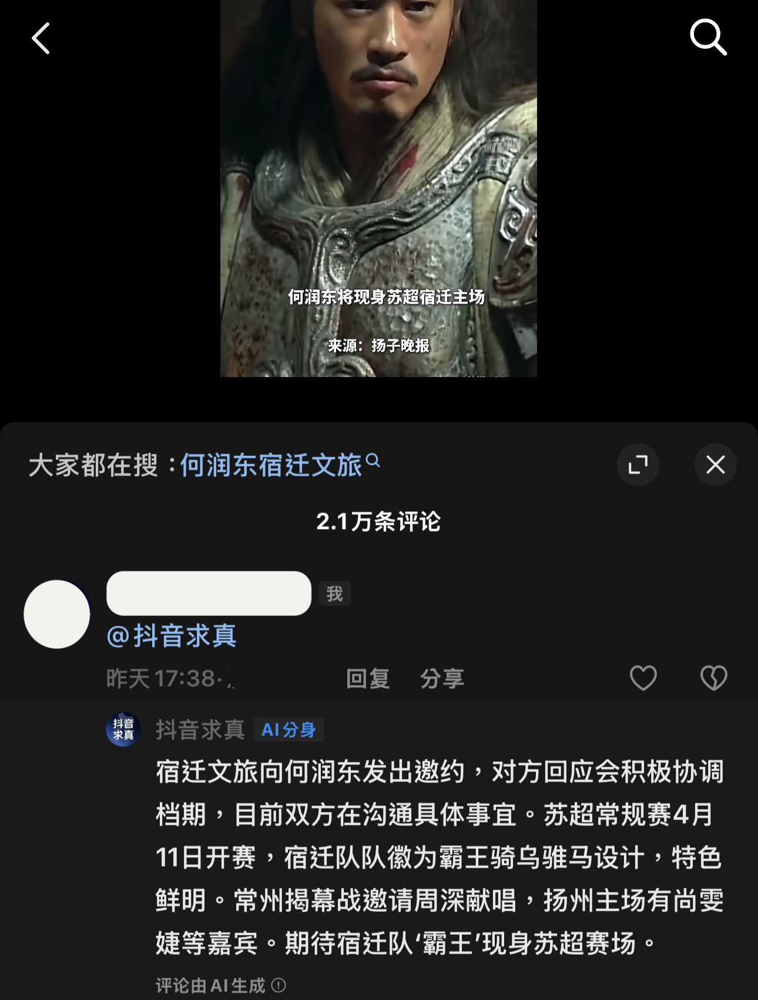

+++
date = '2026-04-04T00:00:00+00:00'
title = "Product Decoder: Douyin's <AI Fact-Check> — How a Simple @ Mention Fights Misinformation"
tags = ['Product Decoder', '中文']
+++

As a PM, I always like to view products from a user's perspective. This time, I'd like to analyze a feature I find brilliantly designed — Douyin's "AI Fact-Check" (@抖音求真).

身為產品經理，我習慣從使用者視角出發。這次我想聊聊一個設計得非常精妙的功能：抖音的「AI 求真」(@抖音求真)。

---

## What Is It?
When browsing Douyin, if a user encounters content that seems questionable, they can simply type **@抖音求真** in the comments. An AI agent then verifies the claim, compiles sources, and replies with a structured summary—labeling the content as confirmed, disputed, or debunked.

## 這是什麼？
當使用者在滑抖音看到可疑內容時，只要在評論區標記 **@抖音求真**，後台的 AI 就會介入核實、彙整來源，並直接回覆一份結構化的查核摘要，清楚標示該內容是「屬實」、「存在爭議」或「純屬謠言」。

---

## Why This Design Is Brilliant

### (1) Solving a Real Problem at the Right Moment
Traditional fact-checking requires users to **leave the app** and cross-reference sources manually. That’s too much friction. Douyin embeds fact-checking **directly into the content flow**. The moment of doubt is the moment of action.

### (2) A Minimalist Interaction: Just @ It
The interaction leverages an existing behavior: the **@ mention**. There’s no new UI to learn and no forms to fill out. It’s a textbook example of reducing cognitive load by repurposing a familiar interaction for a new use case.

### (3) Asynchronous by Design: No Waiting Required
AI verification takes time. Rather than making users wait on a loading screen, the interaction is **fully asynchronous**. Users can keep scrolling, and the system notifies them once the result is posted. This respects the user's "infinite scroll" habit instead of interrupting it.

## 為什麼這個設計很精彩？

### (1) 在正確的時機解決真正的痛點
傳統的查證流程需要使用者**跳出 App**、打開瀏覽器搜尋並交叉比對，這對大多數人來說門檻太高了。「AI 求真」將查核機制直接**嵌入消費流程**中。在使用者產生懷疑的當下，就能立刻完成操作，不讓資訊落差過夜。

### (2) 極簡互動：一個 @ 就搞定
它的互動設計極其簡單——就是大家本來就熟悉的 **@ 標記**。不需要學習新介面，也不用填寫複雜表單。這是一個減少「認知負荷」的典範：利用既有的使用者習慣，來承載全新的功能需求。

### (3) 非同步設計：無需停留等待
AI 查證需要時間搜尋與彙整。抖音並沒有讓使用者停在加載畫面，而是採用了**完全非同步**的設計。標記完後，使用者可以繼續滑下一個影片；等查核完成，系統會自動跳出通知。這種設計順應了短影音「不斷下滑」的行為邏輯，而非中斷它。

---

## The PM Takeaway
Great product design isn't just about the most powerful technology; it’s about making that technology **feel effortless**. Douyin’s AI Fact-Check succeeds by being in the right context, using the right interaction, and respecting the user's flow.

## PM 觀點總結
出色的產品設計不只是追求技術強大，更重要的是讓技術變得**「毫不費力」**。「AI 求真」的成功在於：鎖定正確痛點、出現在正確時機、使用最輕量的互動，並用非同步機制尊重使用者的時間。這就是好的產品思維。

---
*© Chung-Hao Lee. All Rights Reserved.
All content on this webpage—including but not limited to text, images, design, code, and multimedia materials—is protected under the international copyright treaties. Unauthorized reproduction, modification, distribution, public transmission, or commercial use is strictly prohibited. Legal action will be taken against infringement.*  
*© 李崇豪。保留所有權利。
本網頁之內容（包括但不限於文字、圖片、設計、程式碼及多媒體素材）均受國際著作權條約保護。未經書面授權，嚴禁任何形式之複製、改作、散布、公開傳輸或商業利用。侵權者將依法追訴。*
