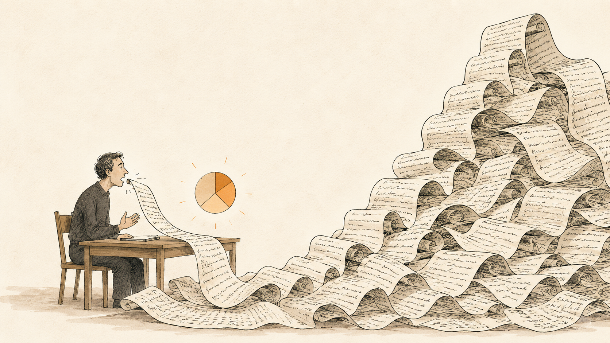
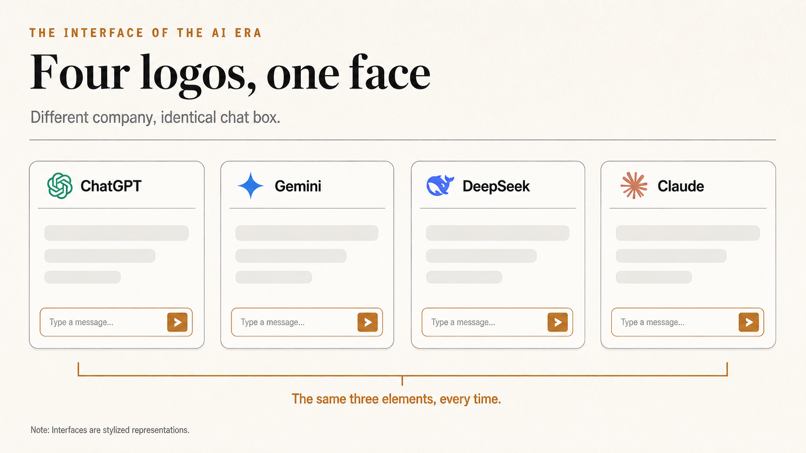
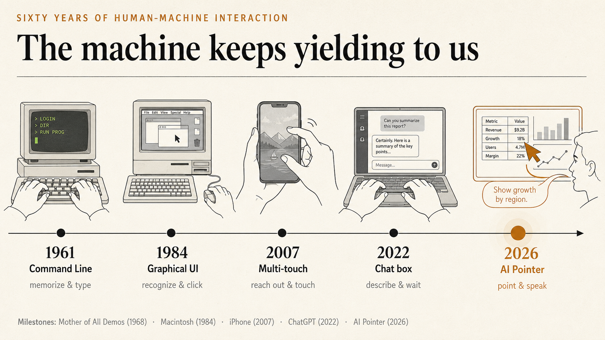
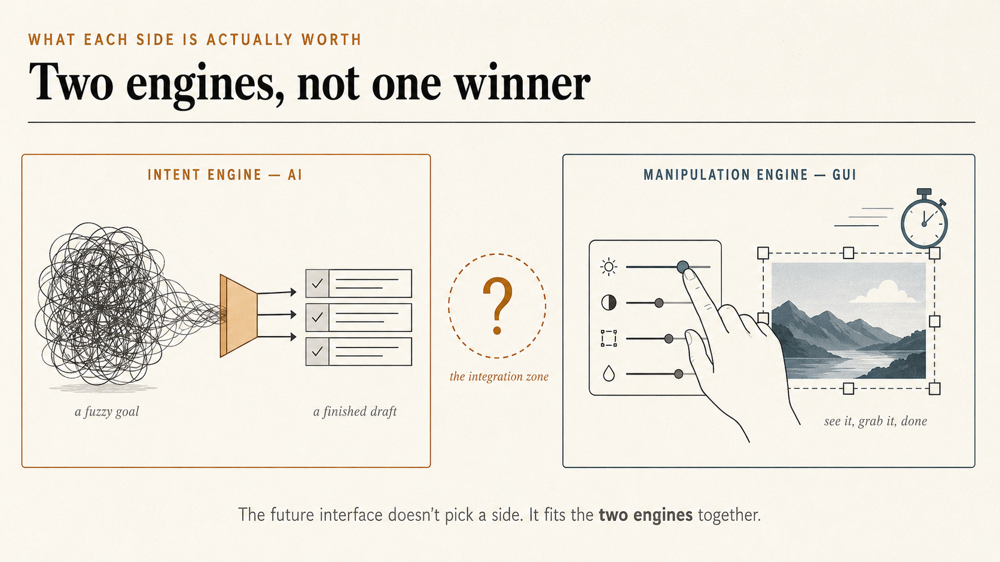
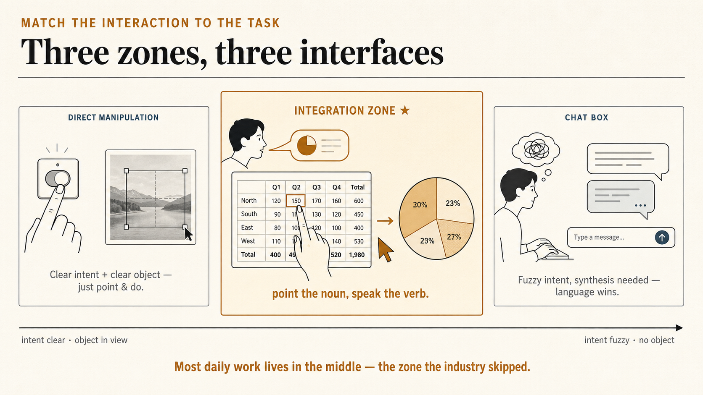
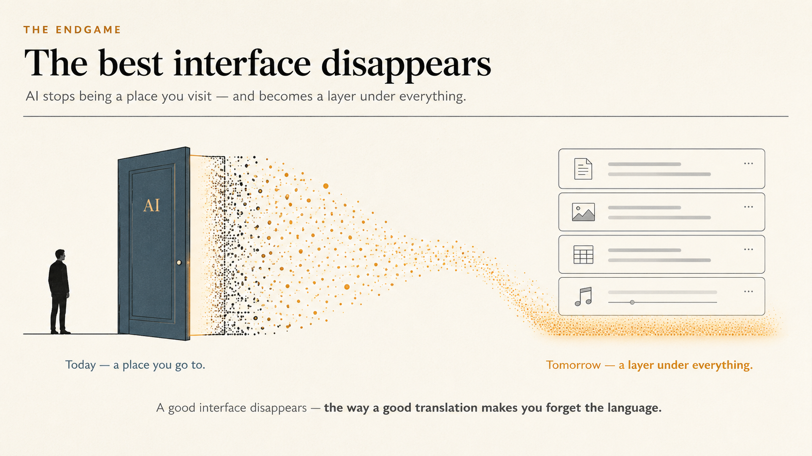

+++
date = '2026-07-16T00:00:00+00:00'
title = "Product Decoder: Google's AI Pointer — Where Human-AI Interaction Goes Next"
tags = ['Product Decoder', 'AI', 'PM', '中文']
thumbnail = 'pic.png'
+++

Picture one of the most ordinary moments in knowledge work: a quarterly revenue table sits on your screen, and you want to turn it into a pie chart.

想像一個再日常不過的瞬間：螢幕上有一張季度營收表，你想把它變成一張圓餅圖。

In Excel, that is three moves: select the range, click Insert, pick Pie. Two seconds. Muscle memory. No conscious thought required.

在 Excel 裡，這是三個動作：框選資料、點「插入」、選「圓餅圖」。兩秒鐘，肌肉記憶，不經大腦。

In the most advanced AI chat box of 2026, the same task becomes: switch windows, copy the table, paste, and start typing — "Turn the Q3 revenue share by product line into a pie chart, use the amounts in the right-hand column, and exclude the subtotal row." Send. Wait. Discover it counted the subtotal anyway. Type another paragraph to correct it.

在 2026 年最先進的 AI 對話框裡，同一件事變成：切換視窗、複製表格、貼上，然後開始打字——「幫我把這張表裡第三季各產品線的營收占比畫成圓餅圖，金額用右邊那一欄，記得排除小計列」。送出，等待，發現它把「小計」也算進去了，再打一段話糾正。

The technology jumped forward a generation; the interaction fell back one. There is a Chinese saying that captures it perfectly: *taking your pants off to fart* — pure redundant effort. I call this overhead the **description tax: being forced to restate, in words, what your eyes and your mouse already know.**

明明是往前走了一個世代的技術，操作起來卻像倒退了一個世代。中文有句俗話講得傳神：**脫褲子放屁——多此一舉**。我把這個多出來的成本叫做**「描述稅」（description tax）：你被迫用文字，把你的眼睛和滑鼠早就知道的事，重新講一遍給 AI 聽。**

In my previous piece, [*Beyond the Interface*](/posts/beyond-the-interface-designing-a-common-language-for-humans-and-ai/), I argued that GUI and CLI share the same underlying substance — data — and differ only in who is looking. This piece asks the next question down: in the age of AI, what should human-machine interaction actually look like?

上一篇[《Beyond the Interface》](/posts/beyond-the-interface-designing-a-common-language-for-humans-and-ai/)我談過：GUI 和 CLI 的底層都是資料，差別只在「誰在看」。這一篇想往下再問一層：在 AI 的時代，人與機器的交互，到底該長什麼樣？

The question matters because right now the entire industry has converged on one strikingly uniform answer: a chat box. Open ChatGPT, Claude, Gemini, or Copilot and, color schemes aside, you are looking at the same face — one input field, one send button, one endlessly scrolling message stream. As if forty years of accumulated interface design had been reset to zero overnight.

因為現在整個行業給出的答案出奇地一致：一個對話框。打開 ChatGPT、Claude、Gemini、Copilot，撇除配色與圓角，它們是同一張臉——一個輸入框，一個送出鍵，一條不斷向上捲動的訊息流。彷彿人類四十年的介面設計積累，一夜之間被歸零了。

Here is the interesting part: computing history has already fought this exact war once — typing versus pointing. It took a decade to settle.

有趣的是，計算機的歷史上，我們已經為「打字還是點選」吵過一模一樣的架。而且那一仗，打了十年才分出勝負。

---

## The Argument We Already Had, Forty Years Ago // 四十年前，我們吵過一模一樣的架

Compress the history into four milestones. In 1962, Douglas Engelbart wrote *Augmenting Human Intellect*, arguing that the computer's mission was not calculation but the amplification of human intelligence. In 1968, he staged what was later named the Mother of All Demos — the mouse, windows, and hypertext, all shown publicly for the first time. In 1973, Xerox PARC built the Alto, the first computer organized around a graphical interface. In 1984, Apple packed it all into the Macintosh and sold it to the world.

先把歷史線壓縮成四個節點。1962 年，Douglas Engelbart 寫下《Augmenting Human Intellect》，主張電腦的使命不是計算，而是「增強人類的智力」；1968 年，他在舊金山做了那場被後世稱為「所有 demo 之母」（The Mother of All Demos）的展示，滑鼠、視窗、超連結全部首次亮相；1973 年，Xerox PARC 造出第一台以圖形介面運作的電腦 Alto；1984 年，Apple 把這一切裝進 Macintosh，賣給了大眾。

Textbooks draw this as a straight, inevitable line. It was not. Every step of the GUI's rise met fierce resistance — and the resisters were not laymen, but some of the best engineers of the era. Their arguments will sound eerily familiar:

教科書把這段寫成一條理所當然的直線。但回到現場，GUI 從誕生到勝出的每一步，都伴隨著激烈的反對——而且反對者不是外行，是當時最優秀的一批工程師。他們的論點，今天聽起來會非常耳熟：

<table>
  <thead>
    <tr>
      <th style="width:30%; text-align:left; vertical-align:top;">The 1980s Debate 1980 年代的論戰</th>
      <th style="width:30%; text-align:left; vertical-align:top;">The 2020s Rerun 2020 年代的重演</th>
      <th style="width:40%; text-align:left; vertical-align:top;">History's Verdict 時間的裁決</th>
    </tr>
  </thead>
  <tbody>
    <tr>
      <td style="vertical-align:top;">"GUIs are toys — drawing graphics burns expensive memory; real work doesn't need it." 「GUI 是玩具，畫圖形要吃掉昂貴的運算資源，正經工作不需要。」</td>
      <td style="vertical-align:top;">"GUIs are baggage — for AI, text is enough; rendering an interface is overhead." 「GUI 是包袱，對 AI 來說文字就夠了，渲染介面是多餘的。」</td>
      <td style="vertical-align:top;">Compute cost never decided the outcome. Hardware gets cheaper every year; human cognitive cost never does — the side that saves <em>human</em> effort wins. 運算成本從來不是勝負手。硬體年年降價，人的認知成本卻一毛不降——最後贏的都是替人省力的那邊。</td>
    </tr>
    <tr>
      <td style="vertical-align:top;">"A skilled operator types commands faster than anyone points a mouse." 「熟手打指令比點滑鼠快得多。」</td>
      <td style="vertical-align:top;">"A skilled prompter gets more done in a chat box than anyone clicking around." 「會寫 prompt 的人，用對話框效率最高。」</td>
      <td style="vertical-align:top;">Apple ran the stopwatch in the 1980s: users <em>felt</em> the keyboard was faster; the clock said the mouse won. Our intuition about our own efficiency is unreliable. Apple 在 80 年代做過實測：使用者「感覺」鍵盤指令比較快，碼錶卻顯示滑鼠更快。人對自己效率的直覺，並不可靠。</td>
    </tr>
    <tr>
      <td style="vertical-align:top;">"Commands compose and pipe together — menus and buttons will never match that expressive power." 「指令可以組合、可以串接（Unix 管線），選單和按鈕永遠給不了這種表達力。」</td>
      <td style="vertical-align:top;">"Natural language can express anything; buttons only do what a designer anticipated." 「自然語言什麼都能表達，按鈕只能做設計者預想到的事。」</td>
      <td style="vertical-align:top;"><strong>Both sides were right</strong> — and each side's "right" grew into an industry of its own (see below). <strong>雙方都對</strong>——而雙方的「對」，各自長成了一個行業（見下文）。</td>
    </tr>
    <tr>
      <td style="vertical-align:top;">"Using a computer is a skill. Learning commands is the user's responsibility." 「使用電腦本來就該受訓，學指令是使用者的責任。」</td>
      <td style="vertical-align:top;">"Can't prompt properly? That's on you — go take a prompt-engineering course." 「不會下 prompt 是你的問題，該去上 prompt engineering 課。」</td>
      <td style="vertical-align:top;">Every single time, the machine has yielded to the human. Not once has the human permanently yielded to the machine. 歷史上每一次，都是機器遷就人；沒有一次，是人遷就機器。</td>
    </tr>
  </tbody>
</table>

The third row deserves its own paragraph. The skeptics were right: the expressive power of composition and piping is something menus will never match — which is why the CLI never died. It retreated into the terminal and remains an engineer's daily bread today. But the GUI camp was right too, and their "right" gave birth to an entirely new craft: UI/UX design. If buttons can only do what a designer anticipated, then anticipate everything the user will ever meet, and bury the complexity behind the interface. The purest expression of that lineage is iOS — pinch to zoom, slide to unlock, no manual anywhere in the box, and a three-year-old and an eighty-year-old both figure it out on their own. Steve Jobs's standard for his design team was that products be "intuitively obvious"; the folk version circulating in Chinese tech circles is blunter: *"What I build, even a fool can use."* One debate, two correct answers — and each side claimed its own half of the world: the CLI kept the expressive power, and the GUI took the three billion users.

第三行值得單獨拿出來說。反方是對的：組合與串接的表達力，選單永遠給不了——所以 CLI 從來沒有死，它退守進終端機，至今仍是工程師的日常。但正方也是對的，而且正方的「對」催生了一門全新的手藝：UI/UX 設計。既然按鈕只能做預想到的事，那就把使用者會遇到的每一件事都預想到，把複雜性藏到介面的背後。這條路線的極致就是 iOS——捏合縮放、滑動解鎖，盒子裡沒有任何一本說明書，三歲小孩和八十歲長輩都能無師自通。賈伯斯對設計團隊的要求是「直覺到顯而易見」（intuitively obvious），坊間流傳一個更狠的版本：「我做出來的東西，連笨蛋都會用。」一場論戰，雙方都對，於是各自贏下了自己的半壁江山：CLI 拿走了表達力，GUI 拿走了三十億使用者。

And the last row deserves a pause. Cognitive science long ago named the principle behind the GUI's victory: **recognition over recall**. The CLI demands recall — before a blank command line, everything must be retrieved from your own memory. The GUI asks only for recognition — the options are laid out on screen; you spot the one you want and click it. Outsourcing the burden of memory from the brain to the screen: that is the entire magic of the GUI. It did not win by being prettier. It won by being cheaper — cheaper for the human mind.

而最後一格，值得停一下。GUI 勝出的根本原因，認知科學早有名字：**辨認優於回憶（recognition over recall）**。CLI 要求你「回憶」指令——空白的命令列前，一切都得從腦中提取；GUI 只要求你「辨認」——選項攤在螢幕上，你認出它、點它。把記憶的負擔從人腦外包給螢幕，這就是 GUI 全部的魔法。它不是比較漂亮，是比較便宜——對人腦比較便宜。

This, incidentally, is my answer to the anxiety that "AI is now so strong it will replace us." At every turn of interface history, it is the machine that grows a shape accommodating the human — because humans are the source of the demand and the judge of the value. As long as people exist, people are the principal. However powerful AI becomes, it too will end up learning to yield to us. In fact, it already is — which is exactly what the rest of this piece is about.

順帶一提，這也是我對「AI 太強、終將取代人」這類焦慮的回答。介面史上每一次，都是機器主動長出遷就人的形狀，因為需求的源頭是人，價值的裁判也是人。只要人還在，主體就是人。AI 再強，最終也得學會遷就我們——事實上，它已經在學了，這正是本文接下來要講的事。

---

## AI's Value: An Intent Engine // AI 的價值：一顆意圖引擎

To answer "what should the AI-era interface look like," resist picking a side. First, be precise about what each side is actually worth.

要回答「AI 時代的介面該長什麼樣」，得先把兩邊各自的價值想清楚，而不是急著選邊。

AI's value is not "it understands language." Understanding language is merely the ticket in. What it is genuinely worth is its ability to handle tasks where **you can state the goal but cannot spell out the steps**. "Turn this transcript into meeting minutes — focus on the decisions and the action items." No button can carry that sentence, because its steps cannot be enumerated in advance. Grasping fuzzy intent, synthesizing across contexts, generating from nothing — this is AI's home turf, and nothing in forty years of GUIs ever touched it.

AI 的價值不在「聽得懂話」。聽得懂話只是入場券。它真正值錢的地方，是能處理**說得出目的、卻說不清步驟**的任務。「幫我把這份逐字稿整理成會議紀錄，重點放在結論和待辦」——這句話沒有任何一個按鈕能承載，因為它的步驟無法窮舉。理解模糊的意圖、跨越多個情境做綜合、無中生有地生成——這是 AI 的主場，是四十年來任何 GUI 都做不到的事。

In one line: **AI is an intent engine — you give it the "what I want," and it derives the "what to do."**

一句話：**AI 是一顆意圖引擎（intent engine）——你給它「想要什麼」，它負責推導「該做什麼」。**

## GUI's Value: A Manipulation Engine // GUI 的價值：一顆操作引擎

The GUI's value is the precise complement. Its strengths all begin *after* intent is clear: **precise reference** (what you click is what you mean — no "which column did you mean?" ambiguity), **instant feedback** (every millisecond of a drag shows its result; errors are corrected on the spot), and **spatial memory** (tools live in fixed places; your muscles remember the route). When you know exactly what you want, pointing beats describing — not by habit, but by bandwidth: typing runs at a few dozen words per minute, while one glance-and-point runs in a few hundred milliseconds.

GUI 的價值則恰好互補。它的長處全在意圖已經明確之後：**精確的指涉**（點哪個就是哪個，不存在「你說的是哪一欄」的歧義）、**即時的回饋**（拖曳的每一毫秒都看得到結果，錯了立刻改）、**空間的記憶**（工具永遠在同一個位置，肌肉記得路）。當你確切知道自己要什麼，「點」永遠比「描述」快——這不是習慣問題，是頻寬問題：人打字每分鐘幾十個詞，而眼睛加手指的一次指涉，只要幾百毫秒。

In one line: **the GUI is a manipulation engine — you know "what to do," and it gives you the shortest path to doing it.**

一句話：**GUI 是一顆操作引擎（manipulation engine）——你知道「該做什麼」，它讓你用最短的路徑做到。**

## The Collision: Three Zones, Three Interfaces // 碰撞：三種狀況，三種介面

Set the two engines side by side, and "which task deserves which interaction" stops being a matter of taste and becomes a matter of derivation. Spread tasks along one axis — the clarity of intent — and three zones appear:

兩顆引擎一對照，「什麼任務該用什麼交互」就不再是品味問題，而是可以推導的結論。依「意圖的清晰度」把任務攤開，會得到三個帶：

- **Clear intent, clear object → direct manipulation.** Adjusting volume, cropping a photo, changing a date. Forcing AI into this zone is the description tax in reverse — what used to be one motion now requires a sentence first.
- **意圖明確、物件明確 → 直接操作。** 調音量、裁圖片、改日期。這一帶硬塞 AI 是反向的脫褲子放屁——本來一個動作，現在還得先講一句話。

- **Fuzzy intent, synthesis required → the chat box.** "Help me find the weaknesses in this proposal." There is no object to point at; language is the best interface here, and the chat box earns its seat.
- **意圖模糊、需要綜合 → 對話框。** 「幫我想想這份提案的弱點」。這一帶沒有物件可指，語言就是最好的介面，對話框當之無愧。

- **Speakable intent, visible object → the integration zone.** "Turn *this* table into a pie chart." "Make *this* paragraph more conversational." The goal needs language, but the object is right there on screen. Until now this zone forced a bad choice: retreat to pure manual work, or pay the description tax. And it happens to be the largest zone in daily work.
- **意圖說得清、物件在眼前 → 整合帶。** 「把**這個**表格畫成圓餅圖」「把**這段**改得口語一點」。目的要用語言講，但對象明明就在螢幕上——這一帶過去被迫二選一：要嘛退回純手工，要嘛付描述稅。而這恰恰是日常工作裡最大的一帶。

For the past four years, the industry has stuffed every task into zone two's chat box. The real opportunity sits in zone three — and last May, the first serious big-company attempt on zone three arrived.

過去四年，全行業把所有任務都塞進了第二帶的對話框。真正的機會在第三帶——而第一個認真對第三帶出手的大廠方案，今年 5 月出現了。

---

## Product Decoder: Google's AI Pointer // Product Decoder：拆解 Google 的 AI Pointer

In May 2026, Google DeepMind published something that looks almost trivially small: a redesign of the mouse pointer — a component that has not changed in fifty years. They call it the [AI-enabled pointer](https://deepmind.google/blog/ai-pointer/), shipping with Gemini in Chrome and Google's new laptop line.

今年 5 月，Google DeepMind 發表了一個乍看不起眼的東西：把滑鼠游標——這個五十年沒變過的元件——重新設計了一遍。他們叫它 [AI-enabled pointer](https://deepmind.google/blog/ai-pointer/)，搭載在 Chrome 的 Gemini 與新款筆電上。

<figure style="margin: 2em 0; text-align: center;">
  <video controls playsinline preload="metadata" style="width: 100%; max-width: 860px; border-radius: 12px; display: block; margin: 0 auto;">
    <source src="ai-pointer-demo.mp4" type="video/mp4">
    Your browser does not support the video tag. <a href="https://deepmind.google/blog/ai-pointer/">Watch the demo on the DeepMind blog.</a>
  </video>
  <figcaption style="margin-top: 10px; font-size: 14px; color: #8a837a;">The AI Pointer in action — point at an object, speak a command, get the result in place. AI Pointer 實際操作——指著物件、說一句話，結果就地生成。</figcaption>
</figure>

Following this series' convention, let's decode it twice — once as a user, once as a PM.

照這個系列的慣例，我們從使用者視角和 PM 視角各拆一次。

**The user's view.** You are reading a PDF. The cursor drifts over a data table, and you say, "make this a pie chart." No window switch, no copy-paste, no describing "which file, which table." What took seven steps takes one point and one sentence. DeepMind frames the design as four principles — and read closely, every one of them is a refund of the tax we described above:

**使用者視角。** 你在讀一份 PDF，游標移到一張數據表上，開口說「做成圓餅圖」。沒有切換視窗，沒有複製貼上，沒有描述「哪份文件哪張表」。原本七步的事，變成一指加一句話。DeepMind 給這套設計定了四條原則，逐條看，會發現每一條都在退我們前面說的那筆稅：

- **Maintain the flow:** the AI comes to wherever you are working, instead of you queueing at the AI's window. It refunds the cost of context-switching.
- **Maintain the flow（別打斷心流）：** AI 來到你工作的地方，而不是你去 AI 的視窗排隊。退掉的是「切換情境」的成本。

- **Show and tell:** wherever the pointer goes, the AI sees — no rebuilding the scene in words. It refunds the description tax itself.
- **Show and tell（用指的，配著說）：** 游標指到哪，AI 就看到哪，不必用文字重建畫面。退掉的正是描述稅的本體。

- **The power of "this" and "that":** "fix this," "move that over here" — this is how humans already talk to each other, letting gesture and shared context complete the meaning. It refunds the cost of expanding pronouns into full descriptions.
- **This and that（「這個」「那個」就夠了）：** 「修一下這裡」「把那個移過來」——人和人之間本來就這樣講話，靠手勢和共享的視野補完語意。退掉的是「把指示詞展開成完整描述」的成本。

- **Turn pixels into actionable entities:** a photo of handwritten notes becomes a checkable to-do list; a paused video frame of a restaurant becomes a booking link. The most radical of the four: it extends the GUI's "operability" onto content that was never designed to be operated on.
- **Pixels into actionable entities（讓像素變成可操作的物件）：** 手寫筆記的照片變成可勾選的待辦清單，影片裡的餐廳畫面變成可點的訂位連結。這是最激進的一條：它把 GUI 的「可操作性」鋪到了原本死的內容上。

**The PM's view.** The most brilliant thing about this product is that it invents no new interaction language at all. Pointing at things is a gesture humans master at ten months old; "this" and "that" are among the oldest words in every language. All it does is finally let the machine understand humanity's most primitive way of communicating — **point at the nouns, speak the verbs.** Forty years ago, the GUI downgraded "recall" to "recognition." Today, the AI pointer downgrades "description" to "reference." Same direction, same long line of history: once again, the machine has moved one step closer to the human.

**PM 視角。** 這個產品最高明的地方，是它沒有發明任何新的交互語言。指東西，是人類嬰兒十個月大就會的動作；「這個」「那個」，是每種語言裡最古老的詞。它只是讓機器終於聽懂了人類最原始的溝通方式——**名詞用指的，動詞用說的**。四十年前 GUI 把「回憶」降級成「辨認」；今天 AI pointer 把「描述」降級成「指涉」。同一個方向，同一條歷史的延長線：機器又一次，朝人遷就了一步。

---

## The Endgame: Interfaces That Disappear // 結語：介面的終點，是讓 AI 消失

History suggests how this plays out. Just as the CLI survived the GUI's victory by retreating to professional ground, the chat box will not disappear — open-ended, generate-from-nothing tasks will always need a free writing space. But it will step down from being "the front door of AI" to being one entrance among many. Mainstream interaction will return to the world of *see it, point at it* — except this time, behind every click and every circled selection stands a mind that understands intent.

以史為鑒，可以推一下日後的發展。就像 GUI 勝出後 CLI 沒有死、退守專業場景一樣，對話框也不會消失——開放式的、無中生有的任務，永遠需要一塊自由書寫的空間。但它會從「AI 的正門」退成眾多入口之一。主流的交互會回到「看得見、指得到」的世界，只是這一次，每一個點擊、每一次圈選的背後，都站著一個聽得懂意圖的大腦。

The endgame of interface design is not a smarter chat box. It is AI dissolving into every motion — a good interface disappears, the way a good translation makes you forget the language it came from.

介面的終點，不是一個更聰明的對話框，而是讓 AI 溶解進每一個動作裡——好的介面會消失，就像好的翻譯讓你忘記語言的存在。

But pull the camera back further, and "the interface on the screen" may only be the first half of this story. If the mission of every interface is to shorten the distance between intent and action, then the endpoint of that distance is zero. When that day comes — where does the interface retreat to? Your glasses? Your ears? Or straight into the brain?

不過，把鏡頭再拉遠一點，「螢幕上的介面」可能只是這個故事的上半場。如果介面的使命是縮短「意圖」與「行動」之間的距離，那這個距離的終點是零——到那一天，介面會退到哪裡去？眼鏡？耳朵？還是直接進到大腦？

In the next piece, we run the timeline all the way to the end — and think it through, seriously.

下一篇，我們把時間軸拉到底，認真地狂想一次。

### References // 參考資料

- Douglas Engelbart, *Augmenting Human Intellect: A Conceptual Framework*, SRI (1962)
- "The Mother of All Demos," Douglas Engelbart, Fall Joint Computer Conference (1968)
- Jakob Nielsen, "10 Usability Heuristics for User Interface Design" — Recognition rather than recall (1994)
- Bruce Tognazzini, "Keyboard vs. The Mouse," *AskTog*
- Thariq Shihipar, ["Using Claude Code: The Unreasonable Effectiveness of HTML"](https://thariqs.github.io/html-effectiveness/)
- Google DeepMind, ["Shaping the future of AI interaction by reimagining the mouse pointer"](https://deepmind.google/blog/ai-pointer/) (May 2026)

---

*© Chung-Hao Lee. All Rights Reserved.
All content on this webpage—including but not limited to text, images, design, code, and multimedia materials—is protected under the international copyright treaties. Unauthorized reproduction, modification, distribution, public transmission, or commercial use is strictly prohibited. Legal action will be taken against infringement.*  
*© 李崇豪。保留所有權利。
本網頁之內容（包括但不限於文字、圖片、設計、程式碼及多媒體素材）均受國際著作權條約保護。未經書面授權，嚴禁任何形式之複製、改作、散布、公開傳輸或商業利用。侵權者將依法追訴。*
