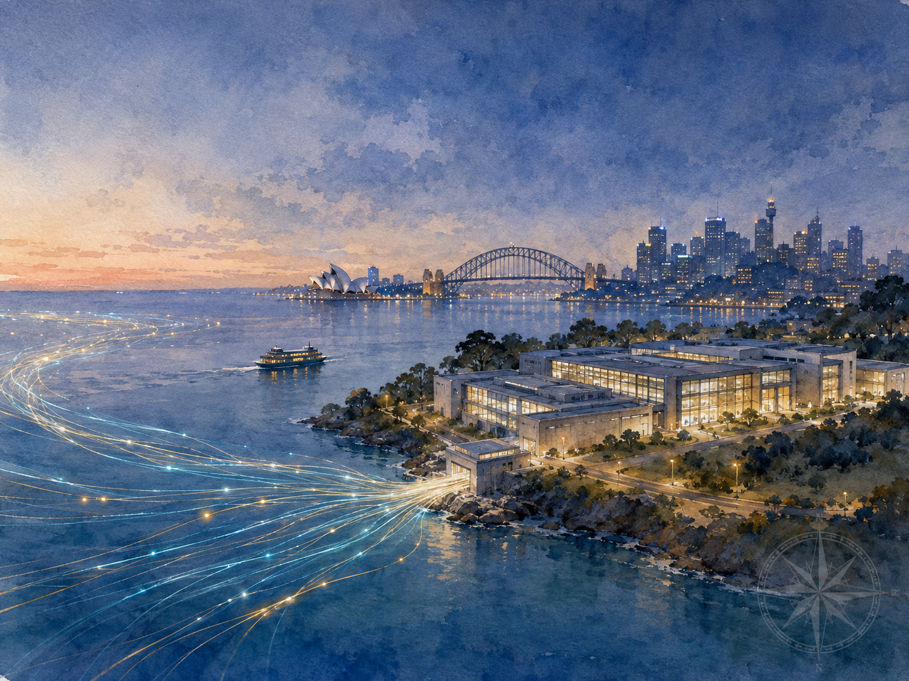

+++
date = '2026-08-09T00:05:00+00:00'
title = "【Passport to AI Era】Why Global Capital Is Betting on Sydney's AI Data Centers: The Advantage That Compounds Up the AI Ladder"
slug = "sydney-ai-data-center-advantages"
aliases = ["/posts/sydney-ai-data-center-compounding-advantage/"]
tags = ['AI', 'Data Center', 'Passport to AI Era', '中文']
thumbnail = 'pic.png'
+++

In the twelve months to mid-2026, three of the most disciplined capital allocators on earth wrote the same address on their cheques. Anthropic committed A$21.6 billion to Australian compute. Microsoft pledged A$25 billion, the largest investment in its four decades in the country. Amazon put down A$20 billion. Add the A$24 billion Blackstone and a Canadian pension fund paid for AirTrunk in 2024 — the biggest data-centre deal in Asia-Pacific history — and a pattern stops looking like coincidence.

到 2026 年年中為止的十二個月裡，地球上最有紀律的幾家資本，不約而同把支票開往同一個地址。Anthropic 承諾投入 A$216 億到澳洲的算力；Microsoft 押下 A$250 億，是它進駐澳洲四十年來最大的一筆；Amazon 放上 A$200 億。再加上 2024 年 Blackstone 與一家加拿大退休基金以 A$240 億買下 AirTrunk——亞太史上最大的數據中心交易——這就不再像巧合了。

These firms do not move on vibes. Each ran the numbers internally before signing. When rivals who agree on almost nothing independently converge on one coordinate, the interesting question is not whether they are right. It is what they saw.

這些公司不靠感覺做事。每一筆錢簽字之前，內部都把帳算過。當幾乎在所有事情上都意見相左的對手，各自獨立地把賭注押在同一個坐標上，值得問的就不是「他們對不對」，而是——他們看到了什麼。

They saw Sydney. And to understand why, you have to stop asking what Sydney is today, and start asking what artificial intelligence will need tomorrow.

他們看到的是悉尼。而要看懂為什麼，你得先放下「悉尼現在是什麼樣子」，改問另一個問題：人工智慧，明天會需要什麼。

## The Ladder // AI 的階梯

DeepSeek founder Liang Wenfeng describes AI's progress as a ladder — each rung standing on the one below. Last year's rung was chain-of-thought. This year's is the agent. The next visible rung, he says, is continuous learning: a model that keeps learning on the job the way a new employee does, instead of being frozen after training. Above that, researchers call the step recursive improvement — a system that can build its own successor. The staircase climbs higher still, but the real battleground is the rungs in front of us.

DeepSeek 創辦人梁文鋒，把 AI 的演進形容成一座階梯——每一階都踩在前一階上。去年那一階是思維鏈（CoT），今年這一階是 Agent。他說，下一個看得見的階，是「持續學習」：讓模型能像一個新進員工那樣，在工作裡不斷學習，而不是訓練完就被凍結。再往上，研究界叫它「遞歸式自我改進」——一個能自己打造下一代版本的系統。階梯還會更高，但真正的戰場，是眼前這幾階。

Hold that ladder up against Sydney, and something clean appears. The city's advantages are not a single feature a cheaper location could undercut next year. They are a set of dividends that compound as AI climbs. Each rung the technology reaches, Sydney's edge widens rather than erodes.

把這座階梯，對著悉尼舉起來，一件很乾淨的事就浮現了。悉尼的優勢，不是某個明年就會被更便宜的地點取代的單點賣點。它是一組會隨著 AI 往上爬而複利放大的紅利。技術每登上一階，悉尼的領先不是被磨平，而是被拉開。

## Rung One — Training: The Energy Dividend // 第一階，訓練：能源紅利

Training, and the reinforcement learning that now dominates post-training, is patient work. It tolerates latency; a run that takes days does not care whether its home is milliseconds from a user. What it cares about is the cost and cleanliness of energy, the cost of cooling, and the stability of the ground it sits on. Chips are roughly 44% of the cost of training a frontier model; add servers, networking and power, and more than half sits in everything around the chip. That is Australia's home turf. Abundant sun and wind give it sustainable, ever-expanding green power — an invisible passport for global technology firms carrying carbon commitments. And a temperate maritime climate lets a Sydney facility lean on free outside air for cooling far more of the year than a tropical hub can, pressing down the single largest operating cost after the chips themselves. Energy in, intelligence out — and Australia is a clean, low-carbon, stable place to run that conversion.

訓練，以及如今主導後訓練的強化學習（RL），是一種有耐心的工作。它容忍延遲；一次跑好幾天的訓練，不在乎自己離使用者是幾毫秒。它在乎的是能源的成本與乾淨程度、散熱的成本，以及腳下這塊地穩不穩。訓練一個前沿模型，晶片大約佔成本的 44%；把伺服器、網路與電力加進來，超過一半的錢，花在晶片以外的一切——而這正是澳洲的主場。充沛的陽光與風，讓它能提供可持續、且規模不斷擴張的綠電；對背著減碳承諾的全球科技巨頭，這是一張隱形的通行證。溫和的海洋性氣候，又讓一座悉尼的機房，一年裡有遠比熱帶樞紐更長的時間，可以直接靠室外的冷空氣散熱，把散熱——晶片之外最貴的一筆開銷——實實在在地壓下來。能源進去，智慧出來，而澳洲，是一個乾淨、低碳、又夠穩定的地方，適合做這場轉換。

But post-training is not only a power problem. Reinforcement learning runs on judgment — on the high-quality, professional-grade data that only expert humans can verify and shape. Liang has said half of DeepSeek's best researchers spend their time on exactly this. That work needs a deep bench of educated, English-fluent professionals, and Australia's universities — UNSW, the University of Sydney, and their peers — supply it. The scarce input at this rung is not cheap labour. It is trusted expertise, and Sydney has it.

但後訓練不只是電力問題。強化學習吃的是判斷力——是只有專家才校準得了、塑形得了的高品質、專業級數據。梁文鋒說過，DeepSeek 一半最頂尖的研究員，時間就花在這件事上。這種工作，需要一群受過良好教育、英語流利的專業人才做後盾，而澳洲的大學——新南威爾斯大學（UNSW）、悉尼大學（USYD）以及它們的同儕——正好供得起。這一階稀缺的輸入，從來不是廉價勞力，而是可信任的專業。悉尼有。

## Rung Two — Agents: The Connectivity Dividend // 第二階，Agent：連通紅利

The agent is a different animal. It runs inference, it faces users, and increasingly it acts in the world — booking, buying, calling other services. Now milliseconds matter, and Sydney's geography does the talking. It is the dominant landing point for the submarine cables that stitch Australia to North America, Asia and the Pacific — Southern Cross, Hawaiki, and the rest. AWS anchored its first Australian region here in 2012; Azure and Google Cloud followed. Roughly three-quarters of the country's data-centre capacity now sits in this one metro. An agent hosted in Sydney reaches the markets of the Asia-Pacific south with a latency Melbourne, Brisbane and Perth cannot match. Training can sit inland; the agent wants the port. Sydney is the port.

Agent 是另一種動物。它跑推理、它面向使用者，而且越來越常在真實世界裡動手——訂位、下單、呼叫別的服務。這時候，毫秒開始要命，而悉尼的地理，會替它說話。它是把澳洲縫進北美、亞洲與太平洋的海底電纜——Southern Cross、Hawaiki 等等——最主要的登陸點。AWS 2012 年就在這裡設下它在澳洲的第一個 region，Azure 與 Google Cloud 隨後跟上。如今全國約四分之三的數據中心容量，集中在這一個都會區。一個部署在悉尼的 Agent，觸及亞太南方市場的延遲，是墨爾本、布里斯本、伯斯都比不上的。訓練可以蓋在內陸；Agent 想要的是港口。悉尼，就是那個港口。

## Rung Three — Memory: The Trust Dividend // 第三階，memory：信任紅利

The rung after the agent is the one that changes the game. When models gain persistent memory — when they keep learning on the job — the scarce asset quietly moves. It stops being the model, which is being commoditised, and becomes the accumulated memory itself: the proprietary data an organisation feeds its AI, and everything the AI learns from it. Models are replaceable. Memory is not.

Agent 之後那一階，才是真正改變賽局的。當模型有了持續的記憶——當它能一邊工作一邊學習——稀缺的東西，會悄悄換位。它不再是模型本身，因為模型正在被商品化；它變成了那份累積起來的記憶：一個組織餵給 AI 的專有數據，以及 AI 從中學到的一切。模型可以替換，記憶不行。

And memory has to live somewhere. The world's most valuable data — a decade of a global bank's decisions, a drugmaker's research, a nation's records — will not be parked just anywhere. It goes where it can be accumulated and refined for years under a stable government, a mature rule of law, and a credible, neutral jurisdiction far from conflict. This is not about serving Australia's own modest population. It is the opposite: it is about becoming the trusted vault where the rest of the world is willing to keep its memory. That is what Blackstone and a Canadian pension fund actually bought for A$24 billion — not buildings, but a durable, trusted place to hold the world's most important data. As memory becomes the centre of gravity in AI, that trust commands a premium.

而記憶，總得住在某個地方。全世界最有價值的數據——一家全球銀行十年的決策、一家藥廠的研究、一個國家的檔案——不會隨便找個地方停放。它會去一個能在穩定政府、成熟法治、可信而中立、且遠離衝突的司法管轄下，安心累積與提煉很多年的地方。這件事，跟服務澳洲自己那並不大的人口無關。恰恰相反：它講的是，成為那個「全世界都願意把記憶存放進來」的可信保險庫。這正是 Blackstone 與一家加拿大退休基金，用 A$240 億買下 AirTrunk 時，真正買到的東西——不是幾棟建築，而是一個耐久、可信、能安放全世界最重要數據的地方。當記憶成為 AI 的重心，這份信任，會被標上溢價。

## Rung Four — Recursion: The Durability Dividend // 第四階，遞歸：耐久紅利

Liang's next rung — a system building its own successor — is not a weekend project. He is explicit that it arrives gradually, over years, a long climb rather than a sudden singularity. A bet on that horizon is a bet on the next decade, and decade-long, capital-heavy bets are decided less by this year's electricity price than by whether the rules will still hold in 2035. Australia's real product here is boring and rare: policy certainty and asset security you can underwrite for ten years. In a world where infrastructure is increasingly a geopolitical hostage, "nothing dramatic will happen to your asset" is a feature almost no one else can credibly sell.

梁文鋒說的下一階——一個系統打造自己的接班人——不是一個週末做得完的專案。他講得很清楚：它是漸進地、花上好幾年才到來的，是一段漫長的攀登，而不是一次突如其來的奇點。押注在那個時間尺度上，就是押注下一個十年；而十年起跳、資本極重的賭注，決定勝負的，往往不是今年的電價，而是——2035 年，規則還算不算數。澳洲在這裡真正的產品，無聊，卻稀有：一種你可以為它擔保十年的政策確定性與資產安全。在一個基礎設施越來越像地緣政治人質的世界裡，「你的資產不會發生任何戲劇性的事」，是一項幾乎沒有別人能可信地賣出的特點。

## The Bet // 這場賭注

Put the rungs back together and the shape of the bet is obvious. The hyperscalers are not paying for Sydney as it is. They are paying for Sydney as AI climbs — a city whose advantages compound, rung after rung, instead of decaying. The sustainable green power training needs, it has. The cable port agents need, it has. The trusted vault memory needs, it has. The stable decade recursion needs, it has.

把這幾階重新拼回去，這場賭注的形狀就一目了然。這些超大規模業者，付的不是「此刻的悉尼」，是「AI 往上爬時的悉尼」——一座優勢會一階一階複利、而不是折舊的城市。訓練要的可持續綠電，它有；Agent 要的電纜港口，它有；記憶要的可信保險庫，它有；遞歸要的穩定十年，它有。

Stretch the timeline out, and the real deciding factor was never who is cheapest today. It is who can still be the right answer across the full decade it takes AI to climb the ladder. Sydney's advantages happen to be the compounding kind. The world's smartest capital has already run the numbers and written the answer into its cheques. One question remains: on whose ground will the next era of intelligence be grown?

把時間拉長，這場競賽真正的勝負手，從來不是誰此刻最便宜，而是誰能在 AI 爬完整座階梯的那十年裡，始終是那個對的答案。悉尼的優勢，剛好是會複利的那一種。最精明的資本已經算完帳，把答案寫進了支票。剩下的問題只有一句：世界的下一段智慧，要在誰的土地上長出來？

They have cast the first vote for Sydney. Next, it is the world's turn.

他們已經替悉尼，投下了第一票。接下來，輪到世界。

---
*© Chung-Hao Lee. All Rights Reserved.
All content on this webpage—including but not limited to text, images, design, code, and multimedia materials—is protected under the international copyright treaties. Unauthorized reproduction, modification, distribution, public transmission, or commercial use is strictly prohibited. Legal action will be taken against infringement.*  
*© 李崇豪。保留所有權利。
本網頁之內容（包括但不限於文字、圖片、設計、程式碼及多媒體素材）均受國際著作權條約保護。未經書面授權，嚴禁任何形式之複製、改作、散布、公開傳輸或商業利用。侵權者將依法追訴。*
